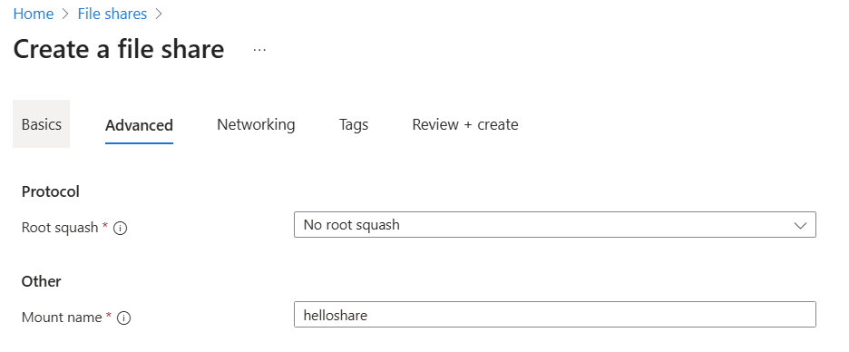

# Create an file share

Before you create an file share, you need to answer two questions about how you want to use it:

- **Is file share the right fit for me?**  
  **File share is a public preview feature.** File share currently offers only SSD (premium). SSD file shares provide consistent high performance and low latency, within single-digit milliseconds for most IO operations. file share currently only support on provisioned v2 billing model. In provisioned v2 billing model you specify how much storage, IOPS, and throughput your file share needs. The amount of each quantity that you provision determines your total bill. By default, when you create a new file share using the provisioned v2 model, we provide a recommendation for how many IOPS and how much throughput you need based on the amount of provisioned storage you specify. Depending on your individual file share requirements, you might find that you require more or less IOPS or throughput than our recommendations, and can optionally override these recommendations with your own values as desired. To learn more about the provisioned v2 model, see [Understanding the provisioned v2 billing model](./understanding-billing.md#provisioned-v2-model). If you need all existing features that Azure File offers, or you need SMB protocol, HDD (standard) performance, please choose file share (Classic) instead.

- **What are the redundancy requirements for your file share?**  
   File share are only available for the Local and Zone redundancy types. See [Azure Files redundancy](./files-redundancy.md) for more information.

For more information on Azure file share options, see [Planning for an Azure Files deployment](storage-files-planning.md).

## Applies to

| Management model     | Object             | Applys to                           |
| -------------------- | ------------------ | ----------------------------------- |
| Microsoft.FileShares | file share         |  |
| Microsoft.Storage    | classis file share |    |

## Prerequisites

- This article assumes that you have an Azure subscription. If you don't have an Azure subscription, then create a [free account](https://azure.microsoft.com/free/?WT.mc_id=A261C142F) before you begin.
- If you intend to use Azure PowerShell, [install the latest version](/powershell/azure/install-azure-powershell).
- If you intend to use Azure CLI, [install the latest version](/cli/azure/install-azure-cli).

---

## Create a file share

# [Portal](#tab/azure-portal)

To create a file share via the Azure portal, use the search box at the top of the Azure portal to search for **file share** and select the matching result.

Click **+ Create** to create a new file share.

### Basics

The first tab to complete to create a file share is labeled **Basics**, which contains the required fields to create a file share.

| Field name                      | Input type         | Values                                                                                                                                                                        | Applicable to file share | Meaning                                                                                                                                                                                                                                                  |
| ------------------------------- | ------------------ | ----------------------------------------------------------------------------------------------------------------------------------------------------------------------------- | ------------------------ | -------------------------------------------------------------------------------------------------------------------------------------------------------------------------------------------------------------------------------------------------------- |
| Subscription                    | Drop-down list     | _Available Azure subscriptions_                                                                                                                                               | Yes                      | The selected subscription in which to deploy the storage account.                                                                                                                                                                                        |
| Resource group                  | Drop-down list     | _Available resource groups in selected subscription_                                                                                                                          | Yes                      | The resource group in which to deploy the file share. A resource group is a logical container for organizing for Azure resources, including file share.                                                                                                  |
| File share name                 | Text box           | --                                                                                                                                                                            | Yes                      | The name of the file share must be unique across all existing file share names in Microsoft Azure. It must be 3 to 63 characters long and can contain only lowercase letters, numbers, and hyphens. The name must start and end with a letter or number. |
| Tier                            | N/A                | --                                                                                                                                                                            | Yes                      | Premium file shares are backed by solid-state drives (SSD) for better performance. Currently file share only support SSD tier.                                                                                                                           |
| Protocol                        | N/A                | --                                                                                                                                                                            | Yes                      | Azure file shares support a multitude of access protocols. If you need the SMB protocol, deploy your file share within a storage account. Currently file share only support NFS protocol.                                                                |
| Region                          | Drop-down list     | _Available Azure regions_                                                                                                                                                     | Yes                      | The region for the file share to be deployed into. This can be the region associated with the resource group, or any other available region.                                                                                                             |
| Provisioned capacity (GiB)      | Drop-down list     | Integer                                                                                                                                                                       | Yes                      | Provisioned capacity for the file share, range from 32 GiB to 262144 GiB.                                                                                                                                                                                |
| Redundancy                      | Drop-down list     | <ul><li>Locally-redundant storage (LRS)</li><li>Geo-redundant storage (GRS)</li>                                                                                              | Yes                      | The redundancy choice for the file share. See [Azure Files redundancy](./files-redundancy.md) for more information.                                                                                                                                      |
| Provisioned IOPS and throughput | Radio button group | <ul><li>Recommended provisioning<ul></ul></li><li>Mannually specify IOPS and throughput<ul><li>Provisioned IOPS</li><li>Provisioned throughtput (MiB/sec)</li></ul></li></ul> | Yes                      | file share only use provisioned v2 ssd billing model. See [Understanding billing](./understanding-billing.md) for more information.                                                                                                                      |

### Advanced

The **Advanced** tab is optional, but provides more granular settings for the file share. Currently you can choose to set up root squash options or specify a mount name for the file share. See xxxx to learn more about root squash options in NFS protocol file share.
Mount name allows you to choose a different name to use to mount the file share. By default, it is the same as the file share name. Customize to have a unique mount name. Same regulations still applying to the naming policy, see [Naming rules and restrictions for Azure resources](../../azure-resource-manager/management/resource-name-rules.md) to learn more.

### Networking

NFS protocol for an Azure file share requires network-level security configurations. Currently there are two options for establishing networking-level security configuations. Private endpoint and service endpoint. Private endpoint gives your file share a private, static IP address within your virtual network, preventing connectivity interruptions from dynamic IP address changes. Traffic to your file share stays within peered virtual networks, including those in other regions and on premises. See [What is a private endpoint](../../private-link/private-endpoint-overview.md) to learn more about private endpoint. If you don't require a static IP address, you can enable a service endpoint for Azure Files within the virtual network. A service endpoint configures file share to allow access only from specific subnets. The allowed subnets can belong to a virtual network in the same subscription or a different subscription, including those that belong to a different Microsoft Entra tenant. There's no extra charge for using service endpoints. See [Azure virtual netowrk service endpoints](../../virtual-network/virtual-network-service-endpoints-overview.md) to learn more.

The **Networking** tab is optional, and allow you to set up both service and private endpoint. With public endpoints access enabled, you can choose an existing virtual network for the service endpoint connection to this file share. If you decided to disable public endpoint access, service endpoint will be disabled for this specific file share.

A virtual network is required if you intented to set up networking while create the file share, you may also set up networking configurations after the file share is created.

For private endpoint configurations, each file share will have it's own private endpoint. To get started, click on **+ Create private endpoint**. Leave **Subscription** and **Resource group** the same. Choose the same location as the virtual network and desired name for the private endpoint. Chosse FileShare for storage sub-resource. Next, under confugre virtual network section, choose the desired virtual network, and subnet setting. Select **Yes** for **Enable Private DNS zone**. Select **Add** after everything is all setted up.

### Tags

Tags are name/value pairs that enable you to categorize resources and view consolidated billing by applying the same tag to multiple resources and resource groups. These are optional and can be applied after file share creation.

### Review + create

The final step to create the file share is to select the **Create** button on the **Review + create** tab. This button isn't available until all the required fields for a file share are completed.

---
