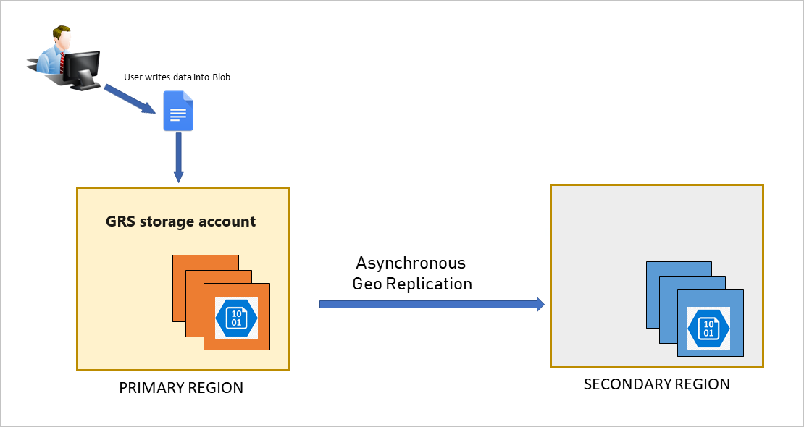
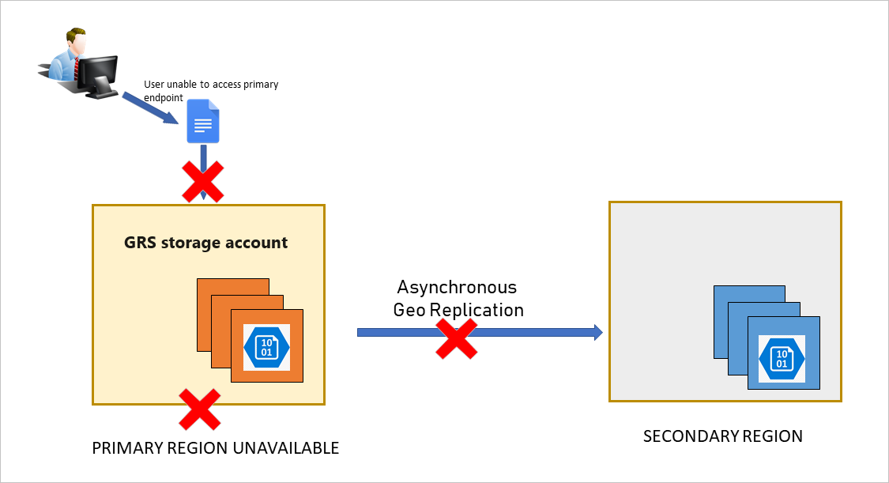
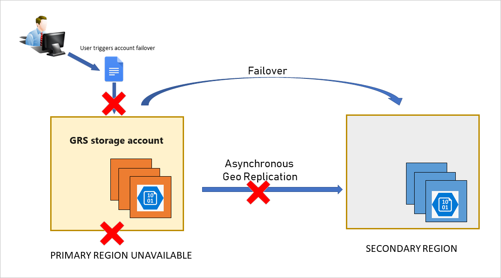

# Disaster recovery and failover for Azure Files

Microsoft strives to ensure that Azure services are always available. However, unplanned service outages might occur, and you should have a disaster recovery (DR) plan in place for handling a regional service outage. An important part of a disaster recovery plan is preparing to fail over to the secondary endpoint in the event that the primary endpoint becomes unavailable. This article describes the concepts and processes involved with disaster recovery (DR) and storage account failover.

> [!IMPORTANT]
> Azure File Sync only supports storage account failover if the Storage Sync Service is also failed over. This is because Azure File Sync requires the storage account and Storage Sync Service to be in the same Azure region. If only the storage account is failed over, sync and cloud tiering operations will fail until the Storage Sync Service is failed over to the secondary region. If you want to fail over a storage account containing Azure file shares that are being used as cloud endpoints in Azure File Sync, see [Azure File Sync disaster recovery best practices](../file-sync/file-sync-disaster-recovery-best-practices.md) and [Azure File Sync server recovery](../file-sync/file-sync-server-recovery.md).

## Recovery metrics and costs
To formulate an effective DR strategy, an organization must understand:

- How much data it can afford to lose in case of a disruption (**recovery point objective** or **RPO**)
- How quickly it needs to be able to restore business functions and data (**recovery time objective** or **RTO**)

The cost of DR generally increases with lower or zero RPO/RTO. Companies that need to be up and running in a few seconds after a disaster and can't sustain any data loss will pay more for DR, while those with higher RPO/RTO numbers will pay less. Azure provides solutions that can work with various RPO and RTO requirements.

## Choose the right redundancy option

Azure Files offers different redundancy options to protect your data from planned and unplanned events ranging from transient hardware failures, network and power outages, to natural disasters. All Azure file shares can use locally redundant (LRS) or zone-redundant storage (ZRS). For more information, see [Azure Files redundancy](files-redundancy.md).

Azure Files supports account failover for standard storage accounts configured with geo-redundant storage (GRS) and geo-zone redundant storage (GZRS) for protection against regional outages. With account failover, you can initiate the failover process for your storage account if the primary endpoint becomes unavailable. The failover updates the secondary endpoint to become the primary endpoint for your storage account. Once the failover is complete, clients can begin writing to the new primary endpoint.

GRS and GZRS still carry a [risk of data loss](#anticipate-data-loss) because data is copied to the secondary region asynchronously, meaning there's a delay before a write to the primary region is copied to the secondary region. In the event of an outage, write operations to the primary endpoint that haven't yet been copied to the secondary endpoint will be lost. This means a failure that affects the primary region might result in data loss if the primary region can't be recovered. The interval between the most recent writes to the primary region and the last write to the secondary region is the RPO. Azure Files typically has an RPO of 15 minutes or less, although there's currently no SLA on how long it takes to replicate data to the secondary region.

## Design for high availability

It's important to design your application for high availability from the start. Refer to these Azure resources for guidance on designing your application and planning for disaster recovery:

- [Designing resilient applications for Azure](/azure/architecture/framework/resiliency/app-design): An overview of the key concepts for architecting highly available applications in Azure.
- [Resiliency checklist](/azure/architecture/checklist/resiliency-per-service): A checklist for verifying that your application implements the best design practices for high availability.
- [Use geo-redundancy to design highly available applications](../common/geo-redundant-design.md): Design guidance for building applications to take advantage of geo-redundant storage.

We also recommend that you design your application to prepare for the possibility of write failures. Your application should expose write failures in a way that alerts you to the possibility of an outage in the primary region.

As a best practice, design your application to check the [Last Sync Time property](#check-the-last-sync-time-property) to evaluate expected data loss. For example, if you're logging all write operations, then you can compare the time of your last write operations to the last sync time to determine which writes haven't been synced to the secondary.

## Track outages

You can subscribe to the [Azure Service Health Dashboard](https://azure.microsoft.com/status/) to track the health and status of Azure Files and other Azure services.

## Understand the account failover process

Customer-managed account failover enables you to fail your entire storage account over to the secondary region if the primary becomes unavailable for any reason. When you force a failover to the secondary region, clients can begin writing data to the secondary endpoint after the failover is complete. The failover typically takes about an hour. We recommend suspending your workload as much as possible before initiating an account failover.

To learn how to initiate an account failover, see [Initiate an account failover](../common/storage-initiate-account-failover.md).

### How an account failover works

Under normal circumstances, a client writes data to a storage account in the primary region, and that data is copied asynchronously to the secondary region. The following image shows the scenario when the primary region is available:

If the primary endpoint becomes unavailable for any reason, the client is no longer able to write to the storage account. The following image shows the scenario where the primary has become unavailable, but no recovery has happened yet:

The customer initiates the account failover to the secondary endpoint. The failover process updates the DNS entry provided by Azure Storage so that the secondary endpoint becomes the new primary endpoint for your storage account, as shown in the following image:

Write access is restored for geo-redundant accounts once the DNS entry has been updated and requests are being directed to the new primary endpoint. Existing storage service endpoints remain the same after the failover. File handles and leases aren't retained on failover, so clients must unmount and remount the file shares.

> [!IMPORTANT]
> After the failover is complete, the storage account is configured to be locally redundant in the new primary endpoint/region. To resume replication to the new secondary, configure the account for geo-redundancy again.
>
> Keep in mind that converting a locally redundant storage account to use geo-redundancy incurs both cost and time. For more information, see [Important implications of account failover](../common/storage-initiate-account-failover.md#important-implications-of-account-failover).

### Anticipate data loss

> [!CAUTION]
> An account failover usually involves some data loss. It's important to understand the implications of initiating an account failover.

Because data is written asynchronously from the primary region to the secondary region, if the primary region becomes unavailable, the most recent writes might not yet have been copied to the secondary region.

When you force a failover, all data in the primary region is lost as the secondary region becomes the new primary region. The new primary region is configured to be locally redundant after the failover.

All data already copied to the secondary is maintained when the failover happens. However, any data written to the primary that has not also been copied to the secondary will be lost permanently.

### Check the Last Sync Time property

The **Last Sync Time (LST)** property indicates the most recent time that data from the primary region is guaranteed to have been written to the secondary region. All data written prior to the last sync time is available on the secondary, while data written after the last sync time might not have been written to the secondary and might be lost. Use this property in the event of an outage to estimate the amount of data loss you might incur by initiating an account failover.

To ensure file shares are in a consistent state when a failover occurs, a system snapshot is created in the primary region every 15 minutes and is replicated to the secondary region. When a failover occurs to the secondary region, the share state will be based on the latest system snapshot in the secondary region. If a failure happens in the primary region, the secondary region is likely behind the primary region, as all writes to the primary won't yet have been replicated to the secondary. Due to geo-lag or other issues, the latest system snapshot in the secondary region might be older than 15 minutes.

All write operations written to the primary region prior to the LST have been successfully replicated to the secondary region, meaning that they're available to be read from the secondary. Any write operations written to the primary region after the last sync time might or might not have been replicated to the secondary region, meaning that they might not be available for read operations.

You can query the value of the **Last Sync Time** property using Azure PowerShell, Azure CLI, or the client library. The **Last Sync Time** property is a GMT date/time value. For more information, see [Check the Last Sync Time property for a storage account](../common/last-sync-time-get.md).

### Use caution when failing back to the original primary

As previously mentioned, after you fail over from the primary to the secondary region, your storage account is configured to be locally redundant in the new primary region. You can then configure the account in the new primary region for geo-redundancy. When the account is configured for geo-redundancy after a failover, the new primary region immediately begins copying data to the new secondary region, which was the primary before the original failover. However, it might take some time before existing data in the new primary is fully copied to the new secondary.

After the storage account is reconfigured for geo-redundancy, it's possible to initiate a failback from the new primary to the new secondary. In this case, the original primary region prior to the failover becomes the primary region again, and is configured to be either locally redundant or zone-redundant, depending on whether the original primary configuration was GRS or GZRS. All data in the post-failover primary region (the original secondary) is lost during the failback. If most of the data in the storage account has not been copied to the new secondary before you fail back, you could suffer a major data loss.

To avoid a major data loss, check the value of the **Last Sync Time** property before failing back. Compare the last sync time to the last times that data was written to the new primary to evaluate expected data loss.

After a failback operation, you can configure the new primary region to be geo-redundant again. If the original primary was configured for LRS, you can configure it to be GRS. If the original primary was configured for ZRS, you can configure it to be GZRS. For additional options, see [Change how a storage account is replicated](../common/redundancy-migration.md).

## Initiate an account failover

You can initiate an account failover from the Azure portal, PowerShell, Azure CLI, or the Azure Storage resource provider API. For more information on how to initiate a failover, see [Initiate an account failover](../common/storage-initiate-account-failover.md).

## Microsoft-managed failover

In extreme circumstances where a region is lost due to a significant disaster, Microsoft might initiate a regional failover. In this case, no action is required on your part. Until the Microsoft-managed failover has completed, you won't have write access to your storage account.

## See also

- [Azure Files redundancy](files-redundancy.md)
- [Azure Files data protection overview](files-data-protection-overview.md)
- [Initiate a storage account failover](../common/storage-initiate-account-failover.md)
