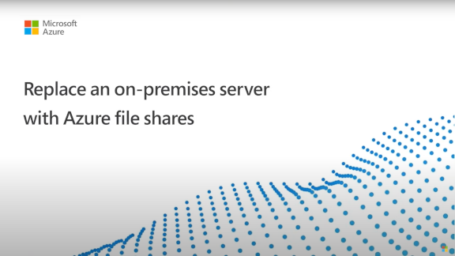
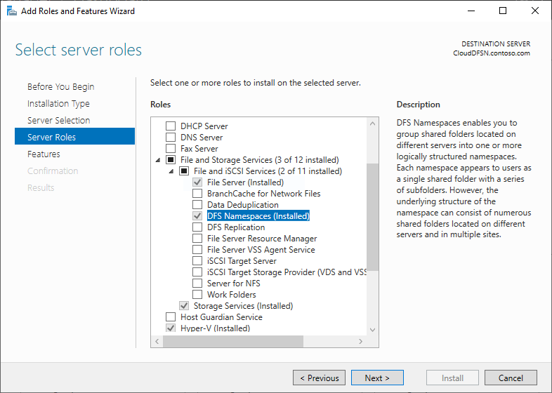
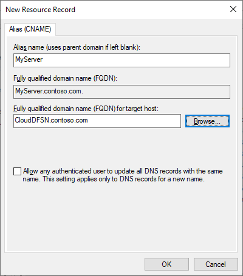
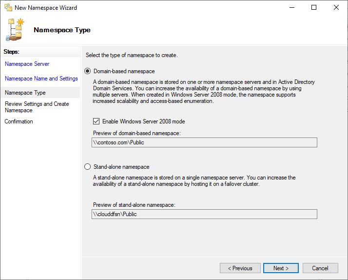
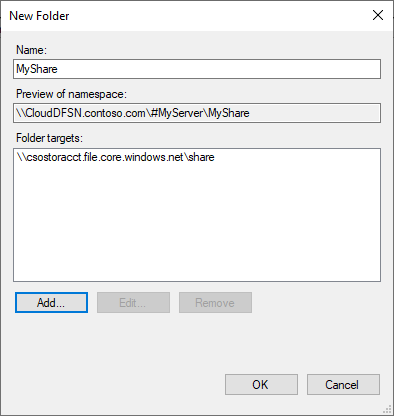

# How to use DFS Namespaces with Azure Files
[Distributed File Systems Namespaces](/windows-server/storage/dfs-namespaces/dfs-overview), commonly referred to as DFS Namespaces or DFS-N, is a Windows Server server role that is widely used to simplify the deployment and maintenance of SMB file shares in production. DFS Namespaces is a storage namespace virtualization technology, which means that it enables you to provide a layer of indirection between the UNC path of your file shares and the actual file shares themselves. DFS Namespaces works with SMB file shares, agnostic of where those file shares are hosted: it can be used with SMB shares hosted on an on-premises Windows File Server with or without Azure File Sync, Azure file shares directly, SMB file shares hosted in Azure NetApp Files or other third-party offerings, and even with file shares hosted in other clouds. 

At its core, DFS Namespaces provides a mapping between a user-friendly UNC path, like `\\contoso\shares\ProjectX` and the underlying UNC path of the SMB share like `\\Server01-Prod\ProjectX` or `\\storageaccount.file.core.windows.net\projectx`. When the end user wants to navigate to their file share, they type in the user-friendly UNC path, but their SMB client accesses the underlying SMB path of the mapping. You can also extend this basic concept to take over an existing file server name, such as `\\MyServer\ProjectX`. You can use this capability to achieve the following scenarios:

- Provide a migration-proof name for a logical set of data. In this example, you have a mapping like `\\contoso\shares\Engineering` that maps to `\\OldServer\Engineering`. When you complete your migration to Azure Files, you can change your mapping so your user-friendly UNC path points to `\\storageaccount.file.core.windows.net\engineering`. When an end user accesses the user-friendly UNC path, they will be seamlessly redirected to the Azure file share path.

- Establish a common name for a logical set of data that is distributed to multiple servers at different physical sites, such as through Azure File Sync. In this example, a name such as `\\contoso\shares\FileSyncExample` is mapped to multiple UNC paths such as `\\FileSyncServer1\ExampleShare`, `\\FileSyncServer2\DifferentShareName`, `\\FileSyncServer3\ExampleShare`. When the user accesses the user-friendly UNC, they are given a list of possible UNC paths and choose the one closest to them based on Windows Server Active Directory (AD) site definitions.

- Extend a logical set of data across size, IO, or other scale thresholds. This is common when dealing with user directories, where every user gets their own folder on a share, or with scratch shares, where users get arbitrary space to handle temporary data needs. With DFS Namespaces, you stitch together multiple folders into a cohesive namespace. For example, `\\contoso\shares\UserShares\user1` maps to `\\storageaccount.file.core.windows.net\user1`, `\\contoso\shares\UserShares\user2` maps to `\\storageaccount.file.core.windows.net\user2`, and so on.  

You can see an example of how to use DFS Namespaces with your Azure Files deployment in the following video overview.

[](https://www.youtube.com/watch?v=jd49W33DxkQ)
> [!NOTE]  
> Skip to 10:10 in the video to see how to set up DFS Namespaces.

If you already have a DFS Namespace in place, no special steps are required to use it with Azure Files and File Sync. If you're accessing your Azure file share from on-premises, normal networking considerations apply; see [Azure Files networking considerations](./storage-files-networking-overview.md) for more information.

## Applies to
| File share type | SMB | NFS |
|-|:-:|:-:|
| Standard file shares (GPv2), LRS/ZRS |  |  |
| Standard file shares (GPv2), GRS/GZRS |  |  |
| Premium file shares (FileStorage), LRS/ZRS |  |  |

## Namespace types
DFS Namespaces provides two main namespace types:

- **Domain-based namespace**: A namespace hosted as part of your Windows Server AD domain. Namespaces hosted as part of AD will have a UNC path containing the name of your domain, for example, `\\contoso.com\shares\myshare`, if your domain is `contoso.com`. Domain-based namespaces support larger scale limits and built-in redundancy through AD. Domain-based namespaces can't be a clustered resource on a failover cluster. 
- **Standalone namespace**: A namespace hosted on an individual server, not hosted as part of Windows Server AD. Standalone namespaces will have a name based on the name of the standalone server, such as `\\MyStandaloneServer\shares\myshare`, where your standalone server is named `MyStandaloneServer`. Standalone namespaces support lower scale targets than domain-based namespaces but can be hosted as a clustered resource on a failover cluster.

## Requirements
To use DFS Namespaces with Azure Files and File Sync, you must have the following resources:

- An Active Directory domain. This can be hosted anywhere you like, such as on-premises, in an Azure virtual machine (VM), or even in another cloud.
- A Windows Server that can host the namespace. A common pattern deployment pattern for DFS Namespaces is to use the Active Directory domain controller to host the namespaces, however the namespaces can be setup from any server with the DFS Namespaces server role installed. DFS Namespaces is available on all supported Windows Server versions.
- An SMB file share hosted in a domain-joined environment, such as an Azure file share hosted within a domain-joined storage account, or a file share hosted on a domain-joined Windows File Server using Azure File Sync. For more on domain-joining your storage account, see [Identity-based authentication](storage-files-active-directory-overview.md). Windows File Servers are domain-joined the same way regardless of whether you are using Azure File Sync.
- The SMB file shares you want to use with DFS Namespaces must be reachable from your on-premises networks. This is primarily a concern for Azure file shares, however, technically applies to any file share hosted in Azure or any other cloud. For more information on networking, see [Networking considerations for direct access](storage-files-networking-overview.md).

## Install the DFS Namespaces server role
If you are already using DFS Namespaces, or wish to set up DFS Namespaces on your domain controller, you may safely skip these steps.

# [Portal](#tab/azure-portal)
To install the DFS Namespaces server role, open the Server Manager on your server. Select **Manage**, and then select **Add Roles and Features**. The resulting wizard guides you through the installation of the necessary Windows components to run and manage DFS Namespaces. 

In the **Installation Type** section of the installation wizard, select the **Role-based or feature-based installation** radio button and select **Next**. On the **Server Selection** section, select the desired server(s) on which you would like to install the DFS Namespaces server role, and select **Next**. 

In the **Server Roles** section, select and check the **DFS Namespaces** role from role list. You can find this under **File and Storage Services** > **File and ISCSI Services**. When you select the DFS Namespaces server role, it may also add any required supporting server roles or features that you don't already have installed.



After you have checked the **DFS Namespaces** role, you may select **Next** on all subsequent screens, and select **Install** as soon as the wizard enables the button. When the installation is complete, you may configure your namespace.

# [PowerShell](#tab/azure-powershell)
From an elevated PowerShell session (or using PowerShell remoting), execute the following commands.

```PowerShell
Install-WindowsFeature -Name "FS-DFS-Namespace", "RSAT-DFS-Mgmt-Con"
```
---

## Take over existing server names with root consolidation
An important use for DFS Namespaces is to take over an existing server name for the purposes of refactoring the physical layout of the file shares. For example, you may wish to consolidate file shares from multiple old file servers together on a single file server during a modernization migration. Traditionally, end user familiarity and document-linking limit your ability to consolidate file shares from disparate file servers together on one host, but the DFS Namespaces root consolidation feature allows you to stand-up a single server to multiple server names and route to the appropriate share name.

Although useful for various datacenter migration scenarios, root consolidation is especially useful for adopting cloud-native Azure file shares because:

- Azure file shares don't allow you to keep existing on-premises server names.
- Azure file shares must be accessed via the fully qualified domain name (FQDN) of the storage account. For example, an Azure file share called `share` in storage account `storageaccount` is always accessed through the `\\storageaccount.file.core.windows.net\share` UNC path. This can be confusing to end users who expect a short name (ex. `\\MyServer\share`) or a name that is a subdomain of the organization's domain name (ex. `\\MyServer.contoso.com\share`).

Root consolidation may only be used with standalone namespaces. If you already have an existing domain-based namespace for your file shares, you do not need to create a root consolidated namespace.

### Enabling root consolidation
Root consolidation can be enabled by setting the following registry keys from an elevated PowerShell session (or using PowerShell remoting).

```PowerShell
New-Item `
    -Path "HKLM:SYSTEM\CurrentControlSet\Services\Dfs" `
    -Type Registry `
    -ErrorAction SilentlyContinue
New-Item `
    -Path "HKLM:SYSTEM\CurrentControlSet\Services\Dfs\Parameters" `
    -Type Registry `
    -ErrorAction SilentlyContinue
New-Item `
    -Path "HKLM:SYSTEM\CurrentControlSet\Services\Dfs\Parameters\Replicated" `
    -Type Registry `
    -ErrorAction SilentlyContinue
Set-ItemProperty `
    -Path "HKLM:SYSTEM\CurrentControlSet\Services\Dfs\Parameters\Replicated" `
    -Name "ServerConsolidationRetry" `
    -Value 1
```

### Creating DNS entries for existing file server names
In order for DFS Namespaces to respond to existing file server names, create alias (CNAME) records for your existing file servers that point at the DFS Namespaces server name. The exact procedure for updating your DNS records may depend on what servers your organization is using and if your organization is using custom tooling to automate the management of DNS. The following steps are shown for the DNS server included with Windows Server and automatically used by Windows AD.

# [Portal](#tab/azure-portal)
On a Windows DNS server, open the DNS management console. This can be found by selecting the **Start** button and typing **DNS**. Navigate to the forward lookup zone for your domain. For example, if your domain is `contoso.com`, the forward lookup zone can be found under **Forward Lookup Zones** > **`contoso.com`** in the management console. The exact hierarchy shown in this dialog will depend on the DNS configuration for your network.

Right-click on your forward lookup zone and select **New Alias (CNAME)**. In the resulting dialog, enter the short name for the file server you're replacing (the fully qualified domain name will be auto-populated in the textbox labeled **Fully qualified domain name**). In the textbox labeled **Fully qualified domain name (FQDN) for the target host**, enter the name of the DFS-N server you have set up. You can use the **Browse** button to help you select the server if desired. Select **OK** to create the CNAME record for your server.



# [PowerShell](#tab/azure-powershell)
On a Windows DNS server, open a PowerShell session (or use PowerShell remoting) to execute the following commands, populating `$oldServer` and `$dfsnServer`, with the relevant values for your environment (`$domain` will auto-populate with the domain name, but you can also manually type this out as well).

```PowerShell
# Variables
$oldServer = "MyServer"
$domain = Get-CimInstance -ClassName "Win32_ComputerSystem" | `
    Select-Object -ExpandProperty Domain
$dfsnServer = "CloudDFSN.$domain"

# Create CNAME record
Import-Module -Name DnsServer
Add-DnsServerResourceRecordCName `
    -Name $oldServer `
    -HostNameAlias $dfsnServer `
    -ZoneName $domain
```

---

## Create a namespace
The basic unit of management for DFS Namespaces is the namespace. The namespace root, or name, is the starting point of the namespace, such that in the UNC path `\\contoso.com\Public\`, the namespace root is `Public`. 

If you are using DFS Namespaces to take over an existing server name with root consolidation, the name of the namespace should be the name of server name you want to take over, prepended with the `#` character. For example, if you wanted to take over an existing server named `MyServer`, you would create a DFS-N namespace called `#MyServer`. The PowerShell section below takes care of prepending the `#`, but if you create via the DFS Management console, you will need to prepend as appropriate. 

# [Portal](#tab/azure-portal)
To create a new namespace, open the **DFS Management** console. This can be found by selecting the **Start** button and typing **DFS Management**. The resulting management console has two sections **Namespaces** and **Replication**, which refer to DFS Namespaces and DFS Replication (DFS-R) respectively. Azure File Sync provides a modern replication and synchronization mechanism that may be used in place of DFS-R if replication is also desired.

Select the **Namespaces** section, and select the **New Namespace** button (you may also right-click on the **Namespaces** section). The resulting **New Namespace Wizard** walks you through creating a namespace. 

The first section in the wizard requires you to pick the DFS Namespace server to host the namespace. Multiple servers can host a namespace, but you will need to set up DFS Namespaces with one server at a time. Enter the name of the desired DFS Namespace server and select **Next**. In the **Namespace Name and Settings** section, you can enter the desired name of your namespace and select **Next**. 

The **Namespace Type** section allows you to choose between a **Domain-based namespace** and a **Stand-alone namespace**. If you intend to use DFS Namespaces to preserve an existing file server/NAS device name, you should select the standalone namespace option. For any other scenarios, you should select a domain-based namespace. Refer to [namespace types](#namespace-types) above for more information on choosing between namespace types.



Select the desired namespace type for your environment and select **Next**. The wizard will then summarize the namespace to be created. Select **Create** to create the namespace and **Close** when the dialog completes.

# [PowerShell](#tab/azure-powershell)
From a PowerShell session on the DFS Namespace server, execute the following PowerShell commands, populating `$namespace`, `$type`, and `$takeOverName` with the relevant values for your environment.

```PowerShell
# Variables
$namespace = "Public"
$type = "DomainV2" # "Standalone"
$takeOverName = $false # $true

$namespace = if ($takeOverName -and $type -eq "Standalone" -and $namespace[0] -ne "#") { 
    "#$namespace" 
} else { $namespace }
$dfsnServer = $env:ComputerName
$namespaceServer = if ($type -eq "DomainV2") { 
    Get-CimInstance -ClassName "Win32_ComputerSystem" | `
    Select-Object -ExpandProperty Domain
} else { $dfsnServer }

# Create share for DFS-N namespace
$smbShare = "C:\DFSRoots\$namespace"
if (!(Test-Path -Path $smbShare)) { New-Item -Path $smbShare -ItemType Directory }
New-SmbShare -Name $namespace -Path $smbShare -FullAccess Everyone

# Create DFS-N namespace
Import-Module -Name DFSN
$namespacePath = "\\$namespaceServer\$namespace"
$targetPath = "\\$dfsnServer\$namespace"
New-DfsnRoot -Path $namespacePath -TargetPath $targetPath -Type $type
```
---

## Configure folders and folder targets
For a namespace to be useful, it must have folders and folder targets. Each folder can have one or more folder targets, which are pointers to the SMB file share(s) that host that content. When users browse a folder with folder targets, the client computer receives a referral that transparently redirects the client computer to one of the folder targets. You can also have folders without folder targets to add structure and hierarchy to the namespace.

You can think of DFS Namespaces folders as analogous to file shares. 

# [Portal](#tab/azure-portal)
In the DFS Management console, select the namespace you just created and select **New Folder**. The resulting **New Folder** dialog will allow you to create both the folder and its targets.



In the textbox labeled **Name** provide the name of the folder. Select **Add...** to add folder targets for this folder. The resulting **Add Folder Target** dialog provides a textbox labeled **Path to folder target** where you can provide the UNC path to the desired folder. Select **OK** on the **Add Folder Target** dialog. If you are adding a UNC path to an Azure file share, you may receive a message reporting that the server `storageaccount.file.core.windows.net` cannot be contacted. This is expected; select **Yes** to continue. Finally, select **OK** on the **New Folder** dialog to create the folder and folder targets.

# [PowerShell](#tab/azure-powershell)
```PowerShell
# Variables
$shareName = "MyShare"
$targetUNC = "\\storageaccount.file.core.windows.net\myshare"

# Create folder and folder targets
$sharePath = "$namespacePath\$shareName"
New-DfsnFolder -Path $sharePath -TargetPath $targetUNC
```

---

Now that you have created a namespace, a folder, and a folder target, you should be able to mount your file share through DFS Namespaces. If you are using a domain-based namespace, the full path for your share should be `\\<domain-name>\<namespace>\<share>`. If you are using a standalone namespace, the full path for your share should be `\\<DFS-server>\<namespace>\<share>`. If you are using a standalone namespace with root consolidation, you can access directly through your old server name, such as `\\<old-server>\<share>`.

## Access-Based Enumeration (ABE)

Using ABE to control the visibility of the files and folders in SMB Azure file shares isn't currently a supported scenario. ABE is a feature of DFS-N, so it's possible to configure identity-based authentication and enable the ABE feature. However, this only applies to the DFS-N folder targets; it doesn't retroactively apply to the targeted file shares themselves. This is because DFS-N works by referral, rather than as a proxy in front of the folder target.

For example, if the user types in the path `\\mydfsnserver\share`, the SMB client gets the referral of `\\mydfsnserver\share => \\server123\share` and makes the mount against the latter.

Because of this, ABE will only work in cases where the DFS-N server is hosting the list of usernames before the redirection:

  `\\DFSServer\users\contosouser1 => \\SA.file.core.windows.net\contosouser1`

  `\\DFSServer\users\contosouser1 => \\SA.file.core.windows.net\users\contosouser1`

(Where **contosouser1** is a subfolder of the **users** share)

If each user is a subfolder *after* the redirection, ABE won't work:

  `\\DFSServer\SomePath\users --> \\SA.file.core.windows.net\users`

## See also
- Deploying an Azure file share: [Planning for an Azure Files deployment](storage-files-planning.md) and [How to create an file share](storage-how-to-create-file-share.md).
- Configuring file share access: [Identity-based authentication](storage-files-active-directory-overview.md) and [Networking considerations for direct access](storage-files-networking-overview.md).
- [Windows Server Distributed File System Namespaces](/windows-server/storage/dfs-namespaces/dfs-overview)
