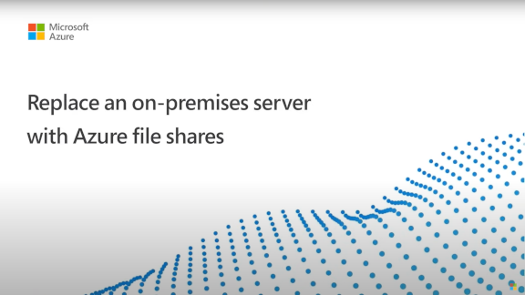
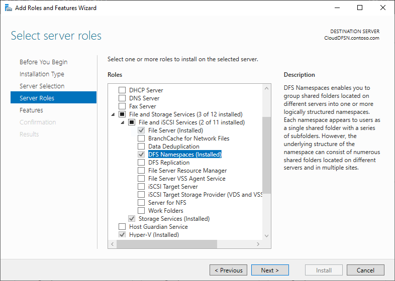
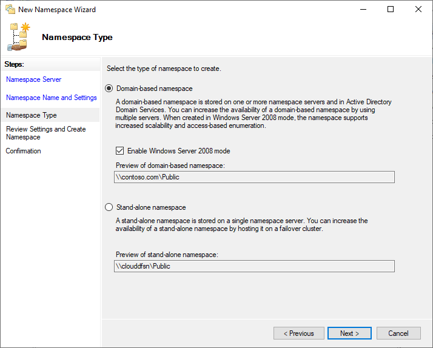
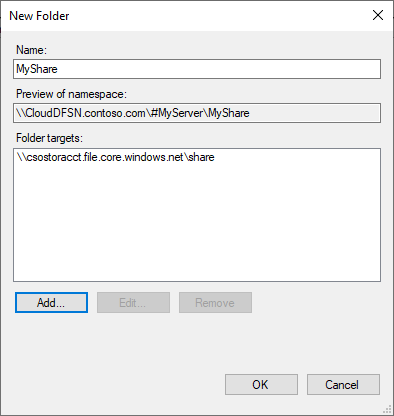
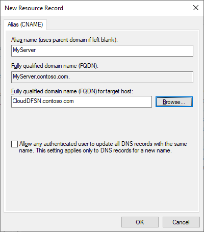

# How to use DFS Namespaces with Azure Files

**Applies to:** :heavy_check_mark: SMB file shares

[Distributed File Systems Namespaces](/windows-server/storage/dfs-namespaces/dfs-overview), commonly referred to as DFS Namespaces or DFS-N, is a Windows Server server role that simplifies the deployment and maintenance of SMB file shares in production. DFS Namespaces provides storage namespace virtualization, so you can provide a layer of indirection between the UNC path of your file share and the actual file share. DFS Namespaces works with SMB file shares, agnostic of where those file shares are hosted. You can use it with SMB shares hosted on an on-premises Windows File Server with or without Azure File Sync, Azure file shares directly, SMB file shares hosted in Azure NetApp Files or other third-party offerings, and even with file shares hosted in other clouds.

At its core, DFS Namespaces provides a mapping between a user-friendly UNC path, like `\\contoso\shares\ProjectX`, and the underlying UNC path of the SMB share, like `\\Server01-Prod\ProjectX` or `\\storageaccount.file.core.windows.net\projectx`. When the end user navigates to their file share, they type the user-friendly UNC path, but their SMB client accesses the underlying SMB path of the mapping. You can also extend this concept to take over an existing file server name, such as `\\MyServer\ProjectX`. You can use this capability to achieve the following scenarios:

- Provide a migration-proof name for a logical set of data. For example, you can map `\\contoso\shares\Engineering` to `\\OldServer\Engineering`. When you complete your migration to Azure Files, you can change the mapping to `\\storageaccount.file.core.windows.net\engineering`, so that when an end user accesses the user-friendly UNC path, they're seamlessly redirected to the Azure file share path.

- Establish a common name for a logical set of data distributed to multiple servers at different physical sites, such as through Azure File Sync. In this example, a name such as `\\contoso\shares\FileSyncExample` is mapped to multiple UNC paths such as `\\FileSyncServer1\ExampleShare`, `\\FileSyncServer2\DifferentShareName`, and `\\FileSyncServer3\ExampleShare`. When the user accesses the user-friendly UNC, they get a list of possible UNC paths and choose the one closest to them based on Windows Server Active Directory (AD) site definitions.

- Extend a logical set of data across size, IO, or other scale thresholds. This extension is useful for user directories, where every user gets their own folder on a share, and for scratch shares, where users get arbitrary space for temporary data. With DFS Namespaces, you stitch together multiple folders into a cohesive namespace. For example, `\\contoso\shares\UserShares\user1` maps to `\\storageaccount.file.core.windows.net\user1`, `\\contoso\shares\UserShares\user2` maps to `\\storageaccount.file.core.windows.net\user2`, and so on.

You can see an example of how to use DFS Namespaces with your Azure Files deployment in the following video overview.

[](https://www.youtube.com/watch?v=jd49W33DxkQ)
> [!NOTE]  
> Skip to 10:10 in the video to see how to set up DFS Namespaces.

If you already have a DFS Namespace in place, no special steps are required to use it with Azure Files and File Sync. If you access your Azure file share from on-premises, normal networking considerations apply. For more information, see [Azure Files networking considerations](./storage-files-networking-overview.md).

This article covers the parts of a DFS Namespaces deployment that are specific to Azure Files. For the underlying Windows Server concepts and the full set of namespace procedures, see [DFS Namespaces overview](/windows-server/storage/dfs-namespaces/dfs-overview) and [Deploying DFS Namespaces](/windows-server/storage/dfs-namespaces/deploying-dfs-namespaces).

## Prerequisites

To use DFS Namespaces with Azure Files and File Sync, you need the following resources:

- An Active Directory domain. You can host this domain anywhere, such as on-premises, in an Azure virtual machine (VM), or in another cloud.
- A domain-joined Windows Server member server with the DFS Namespaces server role installed. DFS Namespaces is available on all supported Windows Server versions.

    > [!IMPORTANT]
    > Don't host a root consolidated namespace on an Active Directory domain controller. Taking over an existing file server name requires a dedicated member server or a Windows Server failover cluster.

- An SMB file share hosted in a domain-joined environment, such as an Azure file share in a domain-joined storage account, or a file share on a domain-joined Windows File Server with Azure File Sync. For more information, see [Identity-based authentication](storage-files-active-directory-overview.md).
- Network reachability from your clients to the SMB file shares. For more information, see [Networking considerations for direct access](storage-files-networking-overview.md).
- Domain Administrator rights, or delegated write access to the `servicePrincipalName` attribute of the affected computer accounts. The name-takeover procedure modifies Active Directory objects and requires an elevated session.

### Install the DFS Namespaces server role

If you already use DFS Namespaces, skip this step.

# [Server Manager](#tab/server-manager)

Open Server Manager and select **Manage** > **Add Roles and Features**. Choose **Role-based or feature-based installation**. On the **Server Roles** page, select **DFS Namespaces** under **File and Storage Services** > **File and iSCSI Services**. The wizard adds any required supporting roles or features.



# [PowerShell](#tab/install-powershell)

From an elevated PowerShell session, run:

```PowerShell
Install-WindowsFeature -Name "FS-DFS-Namespace", "RSAT-DFS-Mgmt-Con"
```

---

For more installation options, see [Install DFS Namespaces](/windows-server/storage/dfs-namespaces/dfs-overview#install-dfs-namespaces).

## Choose a namespace type

DFS Namespaces provides two namespace types: **domain-based** and **stand-alone**. For a full comparison, including scale limits, availability options, and Active Directory requirements, see [Choose a namespace type](/windows-server/storage/dfs-namespaces/choose-a-namespace-type).



For Azure Files, the choice usually comes down to a single question:

- **If you need to preserve an existing on-premises file server name** such as `\\MyServer\share`, choose a **stand-alone namespace** and use root consolidation. This approach is recommended when you migrate file shares to Azure Files, because it keeps document shortcuts, embedded links, and hardcoded UNC paths working after the migration. The rest of this article focuses on this scenario.
- **For any other scenario**, choose a **domain-based namespace**.

Stand-alone namespaces have trade-offs to plan for:

- Namespace metadata is stored in the registry of the namespace server, not in Active Directory. Include the namespace configuration in your server backup strategy.
- You can't add multiple namespace servers to a stand-alone namespace for redundancy. For high availability, host the namespace on a Windows Server failover cluster.
- Stand-alone namespaces support lower scale targets than domain-based namespaces in Windows Server 2008 mode.

The path your users mount depends on the namespace type:

| Namespace configuration | Path to use |
| --- | --- |
| Stand-alone namespace with root consolidation | `\\<old-server>\<share>` |
| Stand-alone namespace | `\\<DFS-server>\<namespace>\<share>` |
| Domain-based namespace | `\\<domain-name>\<namespace>\<share>` |

If you chose a domain-based namespace, skip the root consolidation stages. The namespace and folder target procedure is the same for both types. Use [Create the namespace and add your Azure file shares](#create-the-namespace-and-add-your-azure-file-shares) with `DomainV2` as the namespace type.

## Take over existing server names with root consolidation

By using root consolidation, a single DFS Namespaces server can respond to multiple file server names and route requests to the appropriate share. This capability is especially useful for adopting Azure Files, because:

- Azure file shares can't reuse existing on-premises server names.
- You address Azure file shares by using the storage account fully qualified domain name (FQDN). For example, to access share `share` in storage account `storageaccount`, use `\\storageaccount.file.core.windows.net\share`. That path can be confusing to end users who expect a short name, such as `\\MyServer\share`. Azure Files supports [custom domain names](storage-how-to-use-files-windows.md#mount-file-shares-using-custom-domain-names) when the storage account name is the domain prefix, but without DFS Namespaces, you can't use a name like `\\MyServer.contoso.com\share`.

You can use root consolidation only with stand-alone namespaces. If you already have a domain-based namespace for your file shares, you don't need a root consolidated namespace.

To make a root consolidated namespace highly available, host it on a failover cluster. To build the underlying cluster, see [Create a failover cluster](/windows-server/failover-clustering/create-failover-cluster). If you take this approach, register the alias against the cluster name object (CNO), not against an individual node.

The following diagram shows a highly available root consolidation deployment. An Azure Load Balancer fronts a Windows Server failover cluster of DFS Namespaces servers that host the root consolidated namespaces, so clients continue to reach the retired file server names after their shares move to Azure Files.


Taking over an existing server name is a cutover, not an additive change. Complete the following stages in order:

1. [Enable root consolidation](#enable-root-consolidation) on the DFS Namespaces server.
1. [Create the namespace and add your Azure file shares](#create-the-namespace-and-add-your-azure-file-shares), using a namespace named `#<old-server-name>`.
1. [Transfer the server name and service principal names](#transfer-the-server-name-and-service-principal-names) from the source file server.
1. [Create DNS entries for existing file server names](#create-dns-entries-for-existing-file-server-names).
1. [Verify the name takeover](#verify-the-name-takeover).

> [!IMPORTANT]
> Stages 3 and 4 take the source file server offline, so the interval between shutting it down and completing the DNS change is an outage for your users. Schedule a maintenance window.
>
> Before you begin, inventory everything else that resolves to the source server name. Print queues, DFS Replication members, database aliases, scheduled tasks, backup jobs, and hardcoded scripts that reference the old name stop working when the name is redirected to a DFS Namespaces server, because a namespace server only returns SMB referrals. Migrate or retire those dependencies first.

### Enable root consolidation

From an elevated PowerShell session on the namespace server, set the following registry values and then restart the DFS Namespaces service. The service reads these values only at startup; until it restarts, you can't create a namespace whose name begins with `#`.

```PowerShell
New-Item `
    -Path "HKLM:SYSTEM\CurrentControlSet\Services\Dfs" `
    -Type Registry `
    -ErrorAction SilentlyContinue
New-Item `
    -Path "HKLM:SYSTEM\CurrentControlSet\Services\Dfs\Parameters" `
    -Type Registry `
    -ErrorAction SilentlyContinue
New-Item `
    -Path "HKLM:SYSTEM\CurrentControlSet\Services\Dfs\Parameters\Replicated" `
    -Type Registry `
    -ErrorAction SilentlyContinue
Set-ItemProperty `
    -Path "HKLM:SYSTEM\CurrentControlSet\Services\Dfs\Parameters\Replicated" `
    -Name "ServerConsolidationRetry" `
    -Type DWord `
    -Value 1

Restart-Service -Name "Dfs"
```

On a failover cluster, set the registry values on every node and then fail the clustered namespace role over so that each node restarts the service.

### Create the namespace and add your Azure file shares

The basic unit of management for DFS Namespaces is the *namespace*, whose root is the starting point of the tree. In `\\contoso.com\Public\`, the namespace root is `Public`. Within a namespace, *folders* with folder targets point at the SMB file shares that hold your content, and folders without folder targets add structure and hierarchy.

For the general Windows Server procedures, see [Create a DFS namespace](/windows-server/storage/dfs-namespaces/create-a-dfs-namespace), [Create a folder in a DFS namespace](/windows-server/storage/dfs-namespaces/create-a-folder-in-a-dfs-namespace), and [Add folder targets](/windows-server/storage/dfs-namespaces/add-folder-targets). When you target Azure file shares, keep the following points in mind:

- **Use the storage account FQDN for the folder target.** Point folder targets at `\\<storage-account>.file.core.windows.net\<share>`. Azure Files also supports [custom domain names](storage-how-to-use-files-windows.md#mount-file-shares-using-custom-domain-names) when the storage account name is the domain prefix, but using one for a folder target adds a second DNS and Kerberos dependency behind every referral. Use the FQDN unless you already depend on custom domain names.
- **Expect a connectivity warning in DFS Management.** When you add a folder target for an Azure file share, the console might report that `storageaccount.file.core.windows.net` can't be contacted. This warning is expected. Select **Yes** to continue.
- **Root consolidation namespaces need a `#` prefix.** The namespace name must match the server you're replacing, prepended with `#`. To take over a server named `MyServer`, create a namespace called `#MyServer`. The PowerShell example adds the prefix for you. The DFS Management console doesn't, so type it in yourself.
- **Folder names must match the old share names.** A client that opens `\\MyServer\Finance` is served by the folder `Finance` in the `#MyServer` namespace, so folder names must match the source server's share names exactly.

# [DFS Management](#tab/dfs-management)

In the DFS Management console, select **Namespaces** > **New Namespace** and follow the New Namespace Wizard. Then select the new namespace, select **New Folder**, enter a folder name, and select **Add** to supply the UNC path of your Azure file share as a folder target.



# [PowerShell](#tab/namespace-powershell)

Run the following commands from an elevated PowerShell session on the DFS Namespace server. Update the variables in the first block for your environment.

```PowerShell
# Variables
$namespace = "MyServer"                   # Namespace root name. For root consolidation, use the
                                          # name of the file server you're replacing.
$type = "Standalone"                      # "Standalone" for a stand-alone namespace, or "DomainV2"
                                          # for a domain-based namespace (Windows Server 2008 mode).
$takeOverName = $true                     # Set to $false if you aren't using root consolidation.
$shareName = "Finance"                    # Folder name within the namespace. For root consolidation,
                                          # match the share name on the source file server exactly.
$targetUNC = "\\storageaccount.file.core.windows.net\finance"

# Root consolidation namespaces must be prefixed with "#".
if ($takeOverName -and $type -eq "Standalone" -and $namespace -notlike "#*") {
    $namespace = "#$namespace"
}

$dfsnServer = $env:ComputerName
$namespaceServer = if ($type -like "Domain*") {
    Get-CimInstance -ClassName "Win32_ComputerSystem" | `
        Select-Object -ExpandProperty Domain
} else { $dfsnServer }

# Create the SMB share that backs the namespace root. Read-only access matches the DFS Management
# default, because this share serves referrals rather than data.
$smbSharePath = "C:\DFSRoots\$namespace"
if (!(Test-Path -Path $smbSharePath)) {
    New-Item -Path $smbSharePath -ItemType Directory | Out-Null
}
New-SmbShare -Name $namespace -Path $smbSharePath -ReadAccess "Everyone"

# Create the namespace root.
Import-Module -Name DFSN
$namespacePath = "\\$namespaceServer\$namespace"
New-DfsnRoot -Path $namespacePath -TargetPath "\\$dfsnServer\$namespace" -Type $type

# Create the folder and point it at the Azure file share.
New-DfsnFolder -Path "$namespacePath\$shareName" -TargetPath $targetUNC

# Verify the namespace root and folder target.
Get-DfsnRoot -Path $namespacePath
Get-DfsnFolderTarget -Path "$namespacePath\$shareName"
```

---

Confirm that the namespace resolves through the namespace server's own name before you continue. The old server name doesn't work yet; it starts working after the next two stages.

```PowerShell
Test-Path -Path "\\CloudDFSN\#MyServer\Finance"
```

If the path doesn't resolve, verify that the client can reach the Azure file share directly at `\\<storage-account>.file.core.windows.net\<share>`. DFS Namespaces only returns a referral, so any networking or authentication problem with the underlying share surfaces here. For more information, see [Networking considerations for direct access](storage-files-networking-overview.md).

### Transfer the server name and service principal names

Root consolidation lets the DFS Namespaces server answer to the old file server's name, but two other things must be true before a client can authenticate to that name:

- The SMB server on the namespace server must accept a connection made to a name other than its own computer name.
- Kerberos must resolve `cifs/MyServer` to the account that services the request. If that service principal name (SPN) is still registered on the decommissioned file server's computer account, clients get a ticket for the wrong account. The connection then fails with "The target account name is incorrect" or silently falls back to NTLM.

The `netdom computername` command handles both requirements. It registers the old name as an alternate computer name on the namespace server, which adds the name to the server's `msDS-AdditionalDnsHostName` attribute and registers the matching `HOST/<alias>` SPNs. A `HOST` SPN implicitly covers a set of service classes that includes `cifs`, so a client request for `cifs/MyServer` resolves to the namespace server's account. For the full list of service classes, see [setspn](/windows-server/administration/windows-commands/setspn).

Don't substitute a hand-built `setspn` registration for `netdom`. Registering `cifs/MyServer` on the namespace server's account configures Kerberos but not the SMB server, and the directory service rejects SPNs that aren't derived from the target account's own names. For more information, see [SMB file server share access is unsuccessful through DNS CNAME alias](/troubleshoot/windows-server/networking/dns-cname-alias-cannot-access-smb-file-server-share).

> [!WARNING]
> Don't delete the source computer account. Disabling it keeps the account, its security identifier (SID), and its group memberships intact, so you can roll the cutover back by re-enabling the account and restoring its SPNs. Deleting the account makes rollback much harder.

> [!IMPORTANT]
> Run the directory changes in this procedure against the same domain controller, and preferably against the PDC emulator. Active Directory uses [multi-master replication with loose consistency](/windows/win32/ad/features-of-the-replication-model-for-active-directory-domain-services), so replicas aren't guaranteed to be consistent with each other at any point in time. If you remove the old registration on one domain controller and then add it against a different one, the duplicate check can still see the removed registration and refuse to write. To find the PDC emulator, run `(Get-ADDomain).PDCEmulator`, and then run the commands from a session on that server.

1. **Shut down the source file server.** The source server and the DFS Namespaces server can't both answer to the same name. Power the server off rather than removing it from the domain.

1. **Disable the source computer account.** In Active Directory Users and Computers, right-click the computer object and select **Disable Account**. To do the same from PowerShell on a machine with the Active Directory module installed, run:

    ```PowerShell
    $oldServer = "MyServer"
    Disable-ADAccount -Identity ($oldServer + '$')
    ```

1. **Remove SPNs from the source computer account.** Disabling an account doesn't remove its SPNs. Registrations left behind on the old account block the next step, because the same name can't be registered on two accounts. Duplicate SPNs are a documented cause of `KDC_ERR_PRINCIPAL_NOT_UNIQUE`. For more information, see [Kerberos generates KDC_ERR_S_PRINCIPAL_UNKNOWN or KDC_ERR_PRINCIPAL_NOT_UNIQUE error](/troubleshoot/windows-server/windows-security/kerberos-error-kdc-err-s-principal-unknown-or-not-unique). List what's registered, and then delete the `HOST` and `cifs` entries:

    ```cmd
    setspn -L MyServer
    setspn -D HOST/MyServer MyServer
    setspn -D HOST/MyServer.contoso.com MyServer
    ```

    Delete any explicit `cifs/` entries the same way. If `setspn -L` shows other service classes such as `TERMSRV` or `MSSQLSvc`, the old name is still serving something other than SMB. Resolve that dependency before you continue.

1. **Add the old name as an alternate computer name on the namespace server.** Run `netdom` from an elevated command prompt on the namespace server. For a single DFS Namespaces server, target that server's computer account. For a clustered stand-alone namespace, target the cluster name object (CNO), not the individual node accounts. `netdom` ships with the AD DS tools in Remote Server Administration Tools; install `RSAT-AD-Tools` if the command isn't available.

    ```cmd
    netdom computername CloudDFSN.contoso.com /add:MyServer.contoso.com
    ```

    Specify both names as fully qualified domain names. `netdom` registers the `HOST/MyServer` and `HOST/MyServer.contoso.com` SPNs on the target account and adds the name to the account's `msDS-AdditionalDnsHostName` attribute, which allows the SMB server to accept connections made to the old name.

    Verify the result. The `/verify` switch checks that a DNS record and an SPN exist for each registered name:

    ```cmd
    netdom computername CloudDFSN.contoso.com /enumerate:AlternateNames
    netdom computername CloudDFSN.contoso.com /verify
    ```

    If `netdom` reports that the name is already in use, it's still registered elsewhere in the forest. Locate the conflicting object before you continue:

    ```cmd
    setspn -T contoso -F -Q */MyServer
    ```

    If the only object returned is the source computer account you edited in the previous step, the removal didn't replicate to the domain controller you're querying yet. Wait for replication to converge, or rerun the commands against the PDC emulator.

### Create DNS entries for existing file server names

For DFS Namespaces to respond to existing file server names, create alias (CNAME) records that point the old file server names to the DFS Namespaces server. The exact procedure depends on which DNS server your organization uses. The following steps use the DNS server included with Windows Server.

# [DNS Manager](#tab/dns-manager)

On a Windows DNS server, open the DNS management console and go to the forward lookup zone for your domain. Right-click the zone and select **New Alias (CNAME)**. In the dialog box, enter the short name of the file server you're replacing. Then enter the name of the DFS-N server in the **Fully qualified domain name (FQDN) for the target host** text box. Select **OK** to create the CNAME record.



# [PowerShell](#tab/dns-powershell)

On a Windows DNS server, run the following commands from an elevated PowerShell session. Populate `$oldServer` with the name of the file server you're replacing, and `$dfsnServer` with the short name of your DFS Namespaces server. For a clustered namespace, use the cluster network name rather than a node name. The `$domain` variable populates from the local computer's domain.

```PowerShell
# Variables
$oldServer = "MyServer"
$dfsnServer = "CloudDFSN"
$domain = Get-CimInstance -ClassName "Win32_ComputerSystem" | `
    Select-Object -ExpandProperty Domain

# Create CNAME record
Import-Module -Name DnsServer
Add-DnsServerResourceRecordCName `
    -Name $oldServer `
    -HostNameAlias "$dfsnServer.$domain" `
    -ZoneName $domain
```

---

### Verify the name takeover

Test from a domain-joined client, signed in as a user with permissions on the target Azure file share. Don't test from the DFS Namespaces server itself, because a loopback connection doesn't use the same authentication path that a remote client uses.

1. Confirm that the alternate name registration replicated to every domain controller. The client's key distribution center isn't necessarily the domain controller you changed, and Active Directory replicas aren't guaranteed to be consistent at any point in time:

    ```PowerShell
    $oldServer = "MyServer"
    $dfsnServer = "CloudDFSN"
    Get-ADDomainController -Filter * | ForEach-Object {
        $spns = (Get-ADComputer -Identity $dfsnServer -Properties servicePrincipalName `
            -Server $_.HostName).servicePrincipalName
        [pscustomobject]@{
            DomainController = $_.HostName
            HasHostSpn       = [bool]($spns -contains "HOST/$oldServer")
        }
    }
    ```

    If any domain controller reports `False`, replication isn't complete. Wait and check again before you continue, because a client that authenticates through that domain controller still fails.

1. Confirm that the old server name now resolves to the DFS Namespaces server:

    ```PowerShell
    Resolve-DnsName -Name "MyServer" -Type CNAME
    ```

1. Open the share through the old name and confirm that you see the contents of the Azure file share:

    ```PowerShell
    Test-Path -Path "\\MyServer\Finance"
    Get-ChildItem -Path "\\MyServer\Finance"
    ```

1. Confirm that the session authenticated with Kerberos rather than falling back to NTLM by checking that a ticket was issued for the old name:

    ```cmd
    klist
    ```

    Look for a ticket whose server field is `cifs/MyServer`. Kerberos issues this ticket against the namespace server's account because the `HOST/MyServer` registration covers the `cifs` service class. If no such ticket exists, the most common causes are that the alternate name registration didn't replicate to the domain controller the client is using, that a registration was left on the disabled account, or that a duplicate exists elsewhere in the forest.

If DNS or Kerberos changes don't take effect immediately, clear the client-side caches and retry:

```cmd
ipconfig /flushdns
klist purge
```

Clearing the client caches doesn't help if the underlying change didn't replicate yet. If a retry still fails, recheck replication convergence in step 1 before you change anything else.

## Access-based enumeration (ABE)

Access-based enumeration hides files and folders that a user doesn't have permission to access. In DFS Namespaces, enabling ABE on a namespace applies only to the DFS-N folders in that namespace. To control enumeration of a folder target's contents, enable ABE on the target file share itself. ABE requires all namespace servers to run Windows Server 2008 or later, and domain-based namespaces must use Windows Server 2008 mode. For details, see [Enable access-based enumeration on a namespace](/windows-server/storage/dfs-namespaces/enable-access-based-enumeration-on-a-namespace).

Because you can't enable ABE on an Azure file share, using ABE to control the visibility of files and folders inside an SMB Azure file share isn't a supported scenario. This limitation exists because DFS-N works by referral rather than as a proxy in front of the folder target. When a user types `\\mydfsnserver\share`, the SMB client gets the referral `\\mydfsnserver\share => \\server123\share` and mounts the latter directly, so the DFS-N server is no longer in the data path.

ABE only works where the DFS-N server hosts the level of the hierarchy that you want to filter, before the redirection. Both of the following layouts work, because the per-user folder names live in the namespace on the DFS-N server:

- `\\DFSServer\users\contosouser1 => \\SA.file.core.windows.net\contosouser1`
- `\\DFSServer\users\contosouser1 => \\SA.file.core.windows.net\users\contosouser1`, where `contosouser1` is a subfolder of the `users` share.

If each user is a subfolder *after* the redirection, ABE doesn't work, because the per-user folders are never enumerated by the DFS-N server:

- `\\DFSServer\SomePath\users => \\SA.file.core.windows.net\users`

## See also

- Configuring file share access: [Identity-based authentication](storage-files-active-directory-overview.md) and [Networking considerations for direct access](storage-files-networking-overview.md).
- [DFS Namespaces overview](/windows-server/storage/dfs-namespaces/dfs-overview)
- [Deploying DFS Namespaces](/windows-server/storage/dfs-namespaces/deploying-dfs-namespaces)
- [Choose a namespace type](/windows-server/storage/dfs-namespaces/choose-a-namespace-type)
- [netdom computername](/windows-server/administration/windows-commands/netdom-computername)
- [setspn](/windows-server/administration/windows-commands/setspn)
- [SMB file server share access is unsuccessful through DNS CNAME alias](/troubleshoot/windows-server/networking/dns-cname-alias-cannot-access-smb-file-server-share)
- [Create a failover cluster](/windows-server/failover-clustering/create-failover-cluster)
