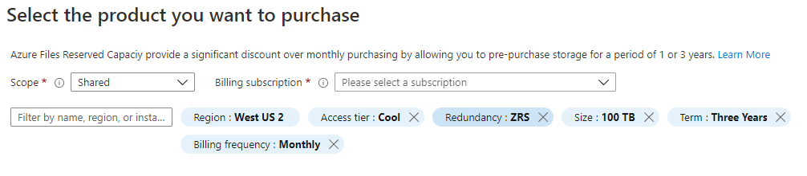

# Optimize costs for Azure Files with Reservations
You can save money on the storage costs for Azure file shares with Azure Files Reservations. Azure Files Reservations (also referred to as *reserved instances*) offer you a discount on capacity for storage costs when you commit to a Reservation for either one year or three years. A Reservation provides a fixed amount of storage capacity for the term of the Reservation.

Azure Files reservations can significantly reduce your capacity costs for storing data in your Azure file shares. How much you save will depend on the duration of your Reservation, the total storage capacity you choose to reserve, and the tier and redundancy settings that you've chosen for your Azure file shares. Reservations provide a billing discount and don't affect the state of your Azure file shares.

For pricing information about Azure Files Reservations, see [Azure Files pricing](https://azure.microsoft.com/pricing/details/storage/files/).

## Applies to
| File share type | SMB | NFS |
|-|:-:|:-:|
| Standard file shares (GPv2), LRS/ZRS |  |  |
| Standard file shares (GPv2), GRS/GZRS |  |  |
| Premium file shares (FileStorage), LRS/ZRS |  |  |

## Reservation terms for Azure Files
The following sections describe the terms of an Azure Files Reservation.

### Reservation units and terms
You can purchase Azure Files Reservations in units of 10 TiB and 100 TiB per month for a one-year or three-year term.

### Reservation scope
Azure Files Reservations are available for a single subscription, multiple subscriptions (shared scope), and management groups. When scoped to a single subscription, the Reservation discount is applied to the selected subscription only. When scoped to multiple subscriptions, the Reservation discount is shared across those subscriptions within the customer's billing context. When scoped to a management group, the reservation discount is applied to subscriptions that are a part of both the management group and billing scope. A Reservation applies to your usage within the purchased scope and can't be limited to a specific storage account, container, or object within the subscription.

An Azure Files Reservation covers only the amount of data that is stored in a subscription or shared resource group. Transaction, bandwidth, data transfer, and metadata storage charges are not included in the Reservation. As soon as you buy a Reservation, the capacity charges that match the Reservation attributes are charged at the discount rates instead of the pay-as-you go rates. For more information, see [What are Azure Reservations?](../../cost-management-billing/reservations/save-compute-costs-reservations.md).

### Reservations and snapshots
If you're taking snapshots of Azure file shares, there are differences in how Reservations work for standard versus premium file shares. If you're taking snapshots of standard file shares, then the snapshot differentials count against the Reservation and are billed as part of the normal used storage meter. However, if you're taking snapshots of premium file shares, then the snapshots are billed using a separate meter and don't count against the Reservation. For more information, see [Snapshots](understanding-billing.md#snapshots).

### Supported tiers and redundancy options
Azure Files Reservations are available for premium, hot, and cool file shares. Reservations aren't available for Azure file shares in the transaction optimized tier. All storage redundancies support Reservations. For more information about redundancy options, see [Azure Files redundancy](storage-files-planning.md#redundancy).

### Security requirements for purchase
To purchase a Reservation:

- You must be in the **Owner** role for at least one Enterprise or individual subscription with pay-as-you-go rates.
- For Enterprise subscriptions, **Add Reserved Instances** must be enabled in the EA portal. Or, if that setting is disabled, you must be an EA Admin on the subscription.
- For the Cloud Solution Provider (CSP) program, only admin agents or sales agents can buy Azure Files Reservations.

## Determine required capacity before purchase
When you purchase an Azure Files Reservation, you must choose the region, tier, and redundancy option for the Reservation. Your Reservation is valid only for data stored in that region, tier, and redundancy level. For example, suppose you purchase a Reservation for data in West US for the hot tier using zone-redundant storage (ZRS). That Reservation will not apply to data in US East, data in the cool tier, or data in geo-redundant storage (GRS). However, you can purchase another Reservation for your additional needs.  

Reservations are available for 10 TiB or 100 TiB blocks, with higher discounts for 100 TiB blocks. When you purchase a Reservation in the Azure portal, Microsoft may provide you with recommendations based on your previous usage to help determine which Reservation you should purchase.

## Purchase Azure Files Reservations
You can purchase Azure Files Reservations through the [Azure portal](https://portal.azure.com). Pay for the Reservation up front or with monthly payments. For more information about purchasing with monthly payments, see [Purchase Azure Reservations with up front or monthly payments](../../cost-management-billing/reservations/prepare-buy-reservation.md).

For help identifying the Reservation terms that are right for your scenario, see [Understand Azure Storage Reservation discounts](../../cost-management-billing/reservations/understand-storage-charges.md).

Follow these steps to purchase a Reservation:

1. Navigate to the [Purchase Reservations](https://portal.azure.com/#blade/Microsoft_Azure_Reservations/CreateBlade/referrer/Browse_AddCommand) blade in the Azure portal.  
1. Select **Azure Files** to buy a new Reservation.  
1. Fill in the required fields as described in the following table:

    

   |Field  |Description  |
   |---------|---------|
   |**Scope**   |  Indicates how many subscriptions can use the billing benefit associated with the Reservation. It also controls how the Reservation is applied to specific subscriptions.    If you select **Shared**, the Reservation discount is applied to Azure Files capacity in any subscription within your billing context. The billing context is based on how you signed up for Azure. For enterprise customers, the shared scope is the enrollment and includes all subscriptions within the enrollment. For pay-as-you-go customers, the shared scope includes all individual subscriptions with pay-as-you-go rates created by the account administrator.      If you select **Single subscription**, the Reservation discount is applied to Azure Files capacity in the selected subscription.    If you select **Single resource group**, the Reservation discount is applied to Azure Files capacity in the selected subscription and the selected resource group within that subscription.    You can change the Reservation scope after you purchase the Reservation.  |
   |**Subscription**  | The subscription that's used to pay for the Azure Files Reservation. The payment method on the selected subscription is used in charging the costs. The subscription must be one of the following types:     Enterprise Agreement (offer numbers: MS-AZR-0017P or MS-AZR-0148P): For an Enterprise subscription, the charges are deducted from the enrollment's Azure Prepayment (previously called monetary commitment) balance or charged as overage.    Individual subscription with pay-as-you-go rates (offer numbers: MS-AZR-0003P or MS-AZR-0023P): For an individual subscription with pay-as-you-go rates, the charges are billed to the credit card or invoice payment method on the subscription.    |
   | **Region** | The region where the Reservation is in effect. |
   | **Tier** | The tier for which the Reservation is in effect. Options include *Premium*, *Hot*, and *Cool*. |
   | **Redundancy** | The redundancy option for the Reservation. Options include *LRS*, *ZRS*, *GRS*, and *GZRS*. For more information about redundancy options, see [Azure Files redundancy](storage-files-planning.md#redundancy). |
   | **Billing frequency** | Indicates how often the account is billed for the Reservation. Options include *Monthly* or *Upfront*. |
   | **Size** | The amount of capacity to reserve. |
   |**Term**  | One year or three years.   |

1. After you select the parameters for your Reservation, the Azure portal displays the cost. The portal also shows the discount percentage over pay-as-you-go billing.

1. In the **Purchase Reservations** blade, review the total cost of the Reservation. You can also provide a name for the Reservation.

After you purchase a Reservation, it is automatically applied to any existing Azure file shares that match the terms of the Reservation. If you haven't created any Azure file shares yet, the Reservation will apply whenever you create a resource that matches the terms of the Reservation. In either case, the term of the Reservation begins immediately after a successful purchase.

## Exchange or refund a Reservation
You can exchange or refund a Reservation, with certain limitations. These limitations are described in the following sections.

To exchange or refund a Reservation, navigate to the Reservation details in the Azure portal. Select **Exchange** or **Refund**, and follow the instructions to submit a support request. When the request has been processed, Microsoft will send you an email to confirm completion of the request.

For more information about Azure Reservations policies, see [Self-service exchanges and refunds for Azure Reservations](../../cost-management-billing/reservations/exchange-and-refund-azure-reservations.md).

### Exchange a Reservation
Exchanging a Reservation enables you to receive a prorated refund based on the unused portion of the Reservation. You can then apply the refund to the purchase price of a new Azure Files Reservation.

There's no limit on the number of exchanges you can make. Additionally, there's no fee associated with an exchange. The new Reservation that you purchase must be of equal or greater value than the prorated credit from the original reservation. An Azure Files reservation can be exchanged only for another Azure Files reservation, and not for a reservation for any other Azure service.

### Refund a Reservation
You may cancel an Azure Files Reservation at any time. When you cancel, you'll receive a prorated refund based on the remaining term of the Reservation, minus a 12 percent early termination fee. The maximum refund per year is $50,000.

Cancelling a Reservation immediately terminates the Reservation and returns the remaining months to Microsoft. The remaining prorated balance, minus the fee, will be refunded to your original form of purchase.

## Expiration of a Reservation
When a Reservation expires, any Azure Files capacity that you are using under that Reservation is billed at the pay-as-you go rate. Reservations don't renew automatically.

You will receive an email notification 30 days prior to the expiration of the Reservation, and again on the expiration date. To continue taking advantage of the cost savings that a Reservation provides, renew it no later than the expiration date.

## Need help? Contact us
If you have questions or need help, [create a support request](https://go.microsoft.com/fwlink/?linkid=2083458).

## Next steps
- [What are Azure Reservations?](../../cost-management-billing/reservations/save-compute-costs-reservations.md)
- [Understand how reservation discounts are applied to Azure storage services](../../cost-management-billing/reservations/understand-storage-charges.md)
