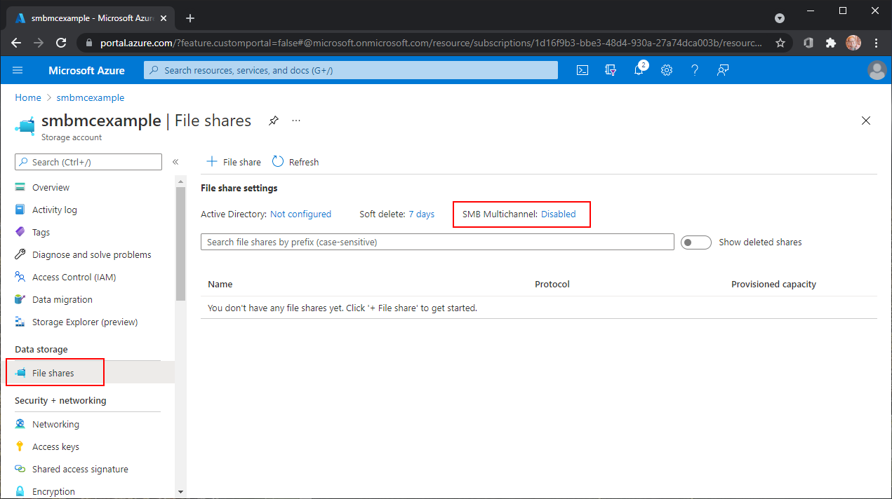

# SMB file shares in Azure Files
Azure Files offers two industry-standard protocols for mounting Azure file share: the [Server Message Block (SMB)](/windows/win32/fileio/microsoft-smb-protocol-and-cifs-protocol-overview) protocol and the [Network File System (NFS)](https://en.wikipedia.org/wiki/Network_File_System) protocol. Azure Files enables you to pick the file system protocol that is the best fit for your workload. Azure file shares don't support accessing an individual Azure file share with both the SMB and NFS protocols, although you can create SMB and NFS file shares within the same storage account. For all file shares, Azure Files offers enterprise-grade file shares that can scale up to meet your storage needs and can be accessed concurrently by thousands of clients.

This article covers SMB Azure file shares. For information about NFS Azure file shares, see [NFS file shares in Azure Files](files-nfs-protocol.md).

## Common scenarios
SMB file shares are used for a variety of applications including end-user file shares and file shares that back databases and applications. SMB file shares are often used in the following scenarios:

- End-user file shares such as team shares, home directories, etc.
- Backing storage for Windows-based applications, such as SQL Server databases or line-of-business applications written for Win32 or .NET local file system APIs. 
- New application and service development, particularly if that application or service has a requirement for random IO and hierarchical storage.

## Features
Azure Files supports the major features of SMB and Azure needed for production deployments of SMB file shares:

- AD domain join and discretionary access control lists (DACLs).
- Integrated serverless backup with Azure Backup.
- Network isolation with Azure private endpoints.
- High network throughput using SMB Multichannel (premium file shares only).
- SMB channel encryption including AES-256-GCM, AES-128-GCM, and AES-128-CCM.
- Previous version support through VSS integrated share snapshots.
- Automatic soft delete on Azure file shares to prevent accidental deletes.
- Optionally internet-accessible file shares with internet-safe SMB 3.0+.

SMB file shares can be mounted directly on-premises or can also be [cached on-premises with Azure File Sync](../file-sync/file-sync-introduction.md).  

## Security
All data stored in Azure Files is encrypted at rest using Azure storage service encryption (SSE). Storage service encryption works similarly to BitLocker on Windows: data is encrypted beneath the file system level. Because data is encrypted beneath the Azure file share's file system, as it's encoded to disk, you don't have to have access to the underlying key on the client to read or write to the Azure file share. Encryption at rest applies to both the SMB and NFS protocols.

By default, all Azure storage accounts have encryption in transit enabled. This means that when you mount a file share over SMB (or access it via the FileREST protocol), Azure Files will only allow the connection if it is made with SMB 3.x with encryption or HTTPS. Clients that do not support SMB 3.x with SMB channel encryption will not be able to mount the Azure file share if encryption in transit is enabled. 

Azure Files supports AES-256-GCM with SMB 3.1.1 when used with Windows Server 2022 or Windows 11. SMB 3.1.1 also supports AES-128-GCM and SMB 3.0 supports AES-128-CCM. AES-128-GCM is negotiated by default on Windows 10, version 21H1 for performance reasons.

You can disable encryption in transit for an Azure storage account. When encryption is disabled, Azure Files will also allow SMB 2.1 and SMB 3.x without encryption. The primary reason to disable encryption in transit is to support a legacy application that must be run on an older operating system, such as Windows Server 2008 R2 or older Linux distribution. Azure Files only allows SMB 2.1 connections within the same Azure region as the Azure file share; an SMB 2.1 client outside of the Azure region of the Azure file share, such as on-premises or in a different Azure region, will not be able to access the file share.

## SMB protocol settings
Azure Files offers multiple settings that affect the behavior, performance, and security of the SMB protocol. These are configured for all Azure file shares within a storage account.

### SMB Multichannel
SMB Multichannel enables an SMB 3.x client to establish multiple network connections to an SMB file share. Azure Files supports SMB Multichannel on premium file shares (file shares in the FileStorage storage account kind). There is no additional cost for enabling SMB Multichannel in Azure Files. SMB Multichannel is disabled by default.

# [Portal](#tab/azure-portal)
To view the status of SMB Multichannel, navigate to the storage account containing your premium file shares and select **File shares** under the **Data storage** heading in the storage account table of contents. The status of the SMB Multichannel can be seen under the **File share settings** section.



To enable or disable SMB Multichannel, select the current status (**Enabled** or **Disabled** depending on the status). The resulting dialog provides a toggle to enable or disable SMB Multichannel. Select the desired state and select **Save**.

:::image type="content" source="media/files-smb-protocol/2-smb-multichannel-enable.png" alt-text="A screenshot of the dialog to enable/disable the SMB Multichannel feature.":::

# [PowerShell](#tab/azure-powershell)
To get the status of SMB Multichannel, use the `Get-AzStorageFileServiceProperty` cmdlet. Remember to replace `<resource-group>` and `<storage-account>` with the appropriate values for your environment before running these PowerShell commands.

```PowerShell
$resourceGroupName = "<resource-group>"
$storageAccountName = "<storage-account>"

# Get reference to storage account
$storageAccount = Get-AzStorageAccount `
    -ResourceGroupName $resourceGroupName `
    -StorageAccountName $storageAccountName

# If you've never enabled or disabled SMB Multichannel, the value for the SMB Multichannel 
# property returned by Azure Files will be null. Null returned values should be interpreted 
# as "default settings are in effect". To make this more user-friendly, the following 
# PowerShell commands replace null values with the human-readable default values. 
$defaultSmbMultichannelEnabled = $false

# Get the current value for SMB Multichannel
Get-AzStorageFileServiceProperty -StorageAccount $storageAccount | `
    Select-Object -Property `
        ResourceGroupName, `
        StorageAccountName, `
        @{ 
            Name = "SmbMultichannelEnabled"; 
            Expression = { 
                if ($null -eq $_.ProtocolSettings.Smb.Multichannel.Enabled) { 
                    $defaultSmbMultichannelEnabled 
                } else { 
                    $_.ProtocolSettings.Smb.Multichannel.Enabled 
                } 
            } 
        }
```

To enable/disable SMB Multichannel, use the `Update-AzStorageFileServiceProperty` cmdlet.

```PowerShell
Update-AzStorageFileServiceProperty `
    -StorageAccount $storageAccount `
    -EnableSmbMultichannel $true
```

# [Azure CLI](#tab/azure-cli)
To get the status of SMB Multichannel, use the `az storage account file-service-properties show` command. Remember to replace `<resource-group>` and `<storage-account>` with the appropriate values for your environment before running these Bash commands.

```bash
RESOURCE_GROUP_NAME="<resource-group>"
STORAGE_ACCOUNT_NAME="<storage-account>"

# If you've never enabled or disabled SMB Multichannel, the value for the SMB Multichannel 
# property returned by Azure Files will be null. Null returned values should be interpreted 
# as "default settings are in effect". To make this more user-friendly, the following 
# PowerShell commands replace null values with the human-readable default values. 

## Search strings
REPLACESMBMULTICHANNEL="\"smbMultichannelEnabled\": null"

# Replacement values for null parameters. 
DEFAULTSMBMULTICHANNELENABLED="\"smbMultichannelEnabled\": false"

# Build JMESPath query string
QUERY="{" 
QUERY="${QUERY}smbMultichannelEnabled: protocolSettings.smb.multichannel.enabled"
QUERY="${QUERY}}"

# Get protocol settings from the Azure Files FileService object
protocolSettings=$(az storage account file-service-properties show \
    --resource-group $RESOURCE_GROUP_NAME \
    --account-name $STORAGE_ACCOUNT_NAME \
    --query "${QUERY}")

# Replace returned values if null with default values 
PROTOCOL_SETTINGS="${protocolSettings/$REPLACESMBMULTICHANNEL/$DEFAULTSMBMULTICHANNELENABLED}"

# Print returned settings
echo $PROTOCOL_SETTINGS
```

To enable/disable SMB Multichannel, use the `az storage account file-service-properties update` command.

```azurecli
az storage account file-service-properties update \
    --resource-group $RESOURCE_GROUP_NAME \
    --account-name $STORAGE_ACCOUNT_NAME \
    --enable-smb-multichannel "true"
```
---

### SMB security settings
Azure Files exposes settings that let you toggle the SMB protocol to be more compatible or more secure, depending on your organization's requirements. By default, Azure Files is configured to be maximally compatible, so keep in mind that restricting these settings may cause some clients not to be able to connect.

Azure Files exposes the following settings:

- **SMB versions**: Which versions of SMB are allowed. Supported protocol versions are SMB 3.1.1, SMB 3.0, and SMB 2.1. By default, all SMB versions are allowed, although SMB 2.1 is disallowed if "require secure transfer" is enabled, because SMB 2.1 does not support encryption in transit.
- **Authentication methods**: Which SMB authentication methods are allowed. Supported authentication methods are NTLMv2 (storage account key only) and Kerberos. By default, all authentication methods are allowed. Removing NTLMv2 disallows using the storage account key to mount the Azure file share. Azure Files doesn't support using NTLM authentication for domain credentials.
- **Kerberos ticket encryption**: Which encryption algorithms are allowed. Supported encryption algorithms are AES-256 (recommended) and RC4-HMAC.
- **SMB channel encryption**: Which SMB channel encryption algorithms are allowed. Supported encryption algorithms are AES-256-GCM, AES-128-GCM, and AES-128-CCM.

You can view and change the SMB security settings using the Azure portal, PowerShell, or CLI. Select the desired tab to see the steps on how to get and set the SMB security settings.

# [Portal](#tab/azure-portal)
To view or change the SMB security settings using the Azure portal, follow these steps:

1. Search for **Storage accounts** and select the storage account for which you want to view the security settings.

1. Select **Data storage** > **File shares**.

1. Under **File share settings**, select the value associated with **Security**. If you haven't modified the security settings, this value defaults to **Maximum compatibility**.

   :::image type="content" source="media/files-smb-protocol/file-share-settings.png" alt-text="A screenshot showing where to change SMB security settings.":::

1. Under **Profile**, select **Maximum compatibility**, **Maximum security**, or **Custom**. Selecting **Custom** allows you to create a custom profile for SMB protocol versions, SMB channel encryption, authentication mechanisms, and Kerberos ticket encryption.

   :::image type="content" source="media/files-smb-protocol/file-share-security-settings.png" alt-text="A screenshot showing the dialog to change the SMB security settings for SMB protocol versions, SMB channel encryption, authentication mechanisms, and Kerberos ticket encryption.":::

After you've entered the desired security settings, select **Save**.

# [PowerShell](#tab/azure-powershell)
To get the SMB protocol settings, use the `Get-AzStorageFileServiceProperty` cmdlet. Remember to replace `<resource-group>` and `<storage-account>` with the appropriate values for your environment. If you've deliberately set any of your SMB security settings to null, for example by disabling SMB channel encryption, see the instructions in the script about commenting out certain lines.

```PowerShell
$resourceGroupName = "<resource-group>"
$storageAccountName = "<storage-account>"

# Get reference to storage account
$storageAccount = Get-AzStorageAccount `
    -ResourceGroupName $resourceGroupName `
    -StorageAccountName $storageAccountName

# If you've never changed any SMB security settings, the values for the SMB security 
# settings returned by Azure Files will be null. Null returned values should be interpreted 
# as "default settings are in effect". To make this more user-friendly, the following 
# PowerShell commands replace null values with the human-readable default values.
# If you've deliberately set any of your SMB security settings to null, for example by
# disabling SMB channel encryption, comment out the following four lines to avoid
# changing the security settings back to defaults.
$smbProtocolVersions = "SMB2.1", "SMB3.0", "SMB3.1.1"
$smbAuthenticationMethods = "NTLMv2", "Kerberos"
$smbKerberosTicketEncryption = "RC4-HMAC", "AES-256"
$smbChannelEncryption = "AES-128-CCM", "AES-128-GCM", "AES-256-GCM"

# Gets the current values of the SMB security settings
Get-AzStorageFileServiceProperty -StorageAccount $storageAccount | `
    Select-Object -Property `
        ResourceGroupName, `
        StorageAccountName, `
        @{ 
            Name = "SmbProtocolVersions";
            Expression = {
                if ($null -eq $_.ProtocolSettings.Smb.Versions) {
                    [String]::Join(", ", $smbProtocolVersions)
                } else {
                    [String]::Join(", ", $_.ProtocolSettings.Smb.Versions)
                }
            }
        },
        @{
            Name = "SmbChannelEncryption";
            Expression = {
                if ($null -eq $_.ProtocolSettings.Smb.ChannelEncryption) {
                    [String]::Join(", ", $smbChannelEncryption)
                } else {
                    [String]::Join(", ", $_.ProtocolSettings.Smb.ChannelEncryption)
                }
            }
        },
        @{
            Name = "SmbAuthenticationMethods";
            Expression = {
                if ($null -eq $_.ProtocolSettings.Smb.AuthenticationMethods) {
                    [String]::Join(", ", $smbAuthenticationMethods)
                } else {
                    [String]::Join(", ", $_.ProtocolSettings.Smb.AuthenticationMethods)
                }
            }
        },
        @{
            Name = "SmbKerberosTicketEncryption";
            Expression = {
                if ($null -eq $_.ProtocolSettings.Smb.KerberosTicketEncryption) {
                    [String]::Join(", ", $smbKerberosTicketEncryption)
                } else {
                    [String]::Join(", ", $_.ProtocolSettings.Smb.KerberosTicketEncryption)
                }
            }
        }
```

Depending on your organization's security, performance, and compatibility requirements, you may wish to modify the SMB protocol settings. The following PowerShell command restricts your SMB file shares to only the most secure options.

> [!Important]  
> Restricting SMB Azure file shares to only the most secure options may result in some clients not being able to connect if they do not meet the requirements. For example, AES-256-GCM was introduced as an option for SMB channel encryption starting in Windows Server 2022 and Windows 11. This means that older clients that do not support AES-256-GCM will not be able to connect.

```PowerShell
Update-AzStorageFileServiceProperty `
    -ResourceGroupName $resourceGroupName `
    -StorageAccountName $storageAccountName `
    -SmbAuthenticationMethod "Kerberos" `
    -SmbChannelEncryption "AES-256-GCM" `
    -SmbKerberosTicketEncryption "AES-256" `
    -SmbProtocolVersion "SMB3.1.1"
```

# [Azure CLI](#tab/azure-cli)
To get the status of the SMB security settings, use the `az storage account file-service-properties show` command. Remember to replace `<resource-group>` and `<storage-account>` with the appropriate values for your environment before running these Bash commands. If you've deliberately set any of your SMB security settings to null, for example by disabling SMB channel encryption, see the instructions in the script about commenting out certain lines.

```bash
RESOURCE_GROUP_NAME="<resource-group>"
STORAGE_ACCOUNT_NAME="<storage-account>"

# If you've never changed any SMB security settings, the values for the SMB security 
# settings returned by Azure Files will be null. Null returned values should be interpreted 
# as "default settings are in effect". To make this more user-friendly, the commands in the 
# following two sections replace null values with the human-readable default values.
# If you've deliberately set any of your SMB security settings to null, for example by
# disabling SMB channel encryption, comment out the following two sections before 
# running the script to avoid changing the security settings back to defaults.

# Values to be replaced
REPLACESMBPROTOCOLVERSION="\"smbProtocolVersions\": null"
REPLACESMBCHANNELENCRYPTION="\"smbChannelEncryption\": null"
REPLACESMBAUTHENTICATIONMETHODS="\"smbAuthenticationMethods\": null"
REPLACESMBKERBEROSTICKETENCRYPTION="\"smbKerberosTicketEncryption\": null"

# Replacement values for null parameters. If you copy this into your own 
# scripts, you will need to ensure that you keep these variables up-to-date with any new 
# options we may add to these parameters in the future.
DEFAULTSMBPROTOCOLVERSIONS="\"smbProtocolVersions\": \"SMB2.1;SMB3.0;SMB3.1.1\""
DEFAULTSMBCHANNELENCRYPTION="\"smbChannelEncryption\": \"AES-128-CCM;AES-128-GCM;AES-256-GCM\""
DEFAULTSMBAUTHENTICATIONMETHODS="\"smbAuthenticationMethods\": \"NTLMv2;Kerberos\""
DEFAULTSMBKERBEROSTICKETENCRYPTION="\"smbKerberosTicketEncryption\": \"RC4-HMAC;AES-256\""

# Build JMESPath query string
QUERY="{"
QUERY="${QUERY}smbProtocolVersions: protocolSettings.smb.versions,"
QUERY="${QUERY}smbChannelEncryption: protocolSettings.smb.channelEncryption,"
QUERY="${QUERY}smbAuthenticationMethods: protocolSettings.smb.authenticationMethods,"
QUERY="${QUERY}smbKerberosTicketEncryption: protocolSettings.smb.kerberosTicketEncryption"
QUERY="${QUERY}}"

# Get protocol settings from the Azure Files FileService object
PROTOCOLSETTINGS=$(az storage account file-service-properties show \
    --resource-group $RESOURCE_GROUP_NAME \
    --account-name $STORAGE_ACCOUNT_NAME \
    --query "${QUERY}")

# Replace returned values if null with default values 
PROTOCOLSETTINGS="${protocolSettings/$REPLACESMBPROTOCOLVERSION/$DEFAULTSMBPROTOCOLVERSIONS}"
PROTOCOLSETTINGS="${protocolSettings/$REPLACESMBCHANNELENCRYPTION/$DEFAULTSMBCHANNELENCRYPTION}"
PROTOCOLSETTINGS="${protocolSettings/$REPLACESMBAUTHENTICATIONMETHODS/$DEFAULTSMBAUTHENTICATIONMETHODS}"
PROTOCOLSETTINGS="${protocolSettings/$REPLACESMBKERBEROSTICKETENCRYPTION/$DEFAULTSMBKERBEROSTICKETENCRYPTION}"

# Print returned settings
echo $PROTOCOLSETTINGS
```

Depending on your organization's security, performance, and compatibility requirements, you might wish to modify the SMB protocol settings. The following Azure CLI command restricts your SMB file shares to only the most secure options.

> [!Important]  
> Restricting SMB Azure file shares to only the most secure options might result in some clients not being able to connect if they don't meet the requirements. For example, AES-256-GCM was introduced as an option for SMB channel encryption starting in Windows Server 2022 and Windows 11. This means that older clients that don't support AES-256-GCM won't be able to connect.

```azurecli
az storage account file-service-properties update \
    --resource-group $RESOURCE_GROUP_NAME \
    --account-name $STORAGE_ACCOUNT_NAME \
    --versions "SMB3.1.1" \
    --channel-encryption "AES-256-GCM" \
    --auth-methods "Kerberos" \
    --kerb-ticket-encryption "AES-256"
```
---

## Limitations
SMB file shares in Azure Files support a subset of features supported by SMB protocol and the NTFS file system. Although most use cases and applications do not require these features, some applications might not work properly with Azure Files if they rely on unsupported features. The following features aren't supported:

- [SMB Direct](/windows-server/storage/file-server/smb-direct)  
- SMB directory leasing
- [VSS for SMB file shares](/archive/blogs/clausjor/vss-for-smb-file-shares) (this enables VSS providers to flush their data to the SMB file share before a snapshot is taken)
- Alternate data streams
- Extended attributes
- Object identifiers
- [Hard links](/windows/win32/fileio/hard-links-and-junctions)
- [Soft links](/windows/win32/fileio/creating-symbolic-links)  
- [Reparse points](/windows/win32/fileio/reparse-points)  
- [Sparse files](/windows/win32/fileio/sparse-files)
- [Short file names (8.3 alias)](/windows/win32/fileio/naming-a-file#short-vs-long-names)  
- [Compression](https://techcommunity.microsoft.com/t5/itops-talk-blog/smb-compression-deflate-your-io/ba-p/1183552)

## Regional availability
SMB Azure file shares are available in every Azure region, including all public and sovereign regions. Premium SMB file shares are available in [a subset of regions](https://azure.microsoft.com/global-infrastructure/services/?products=storage).

## Next steps
- [Plan for an Azure Files deployment](storage-files-planning.md)
- [Create an Azure file share](storage-how-to-create-file-share.md)
- Mount SMB file shares on your preferred operating system:
    - [Mounting SMB file shares on Windows](storage-how-to-use-files-windows.md)
    - [Mounting SMB file shares on Linux](storage-how-to-use-files-linux.md)
    - [Mounting SMB file shares on macOS](storage-how-to-use-files-mac.md)
