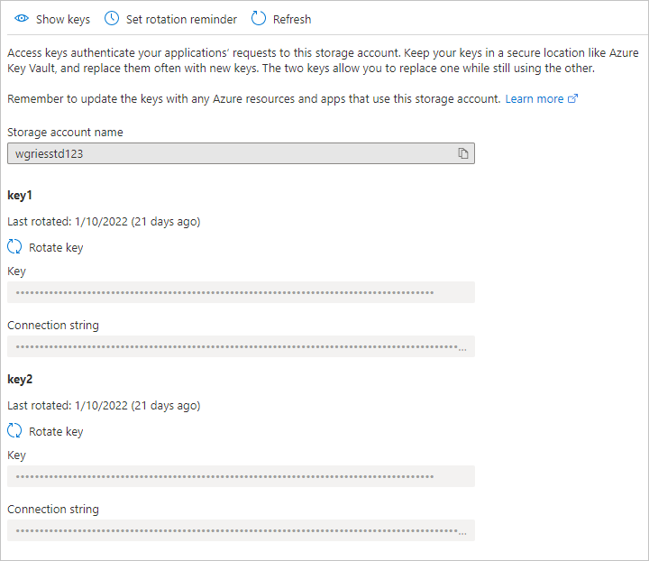

# Troubleshoot Azure Files identity-based authentication and authorization issues (SMB)

This article lists common problems when using SMB Azure file shares with identity-based authentication. It also provides possible causes and resolutions for these problems. Identity-based authentication isn't currently supported for NFS Azure file shares.

## Applies to
| File share type | SMB | NFS |
|-|:-:|:-:|
| Standard file shares (GPv2), LRS/ZRS |  |  |
| Standard file shares (GPv2), GRS/GZRS |  |  |
| Premium file shares (FileStorage), LRS/ZRS |  |  |

## Error 5 when mounting an Azure file share

When you try to mount a file share, you might receive the following error:

- System error 5 has occurred. Access is denied.

### Cause: Share-level permissions are incorrect

If end users are accessing the Azure file share using Active Directory Domain Services (AD DS) or Azure Active Directory Domain Services (Azure AD DS) authentication, access to the file share fails with "Access is denied" error if share-level permissions are incorrect. 

> [!NOTE]
> This error might be caused by issues other than incorrect share-level permissions. For information on other possible causes and solutions, see [Troubleshoot Azure Files connectivity and access issues](files-troubleshoot-smb-connectivity.md#error-5-when-you-mount-an-azure-file-share).

### Solution

Validate that permissions are configured correctly:

- **Active Directory Domain Services (AD DS)** see [Assign share-level permissions](storage-files-identity-ad-ds-assign-permissions.md).

    Share-level permission assignments are supported for groups and users that have been synced from AD DS to Azure Active Directory (Azure AD) using Azure AD Connect sync or Azure AD Connect cloud sync. Confirm that groups and users being assigned share-level permissions are not unsupported "cloud-only" groups.
- **Azure Active Directory Domain Services (Azure AD DS)** see [Assign share-level permissions](storage-files-identity-auth-active-directory-domain-service-enable.md?tabs=azure-portal#assign-share-level-permissions).

## Error AadDsTenantNotFound in enabling Azure AD DS authentication for Azure Files "Unable to locate active tenants with tenant ID aad-tenant-id"

### Cause

Error AadDsTenantNotFound happens when you try to [enable Azure AD DS authentication on Azure Files](storage-files-identity-auth-active-directory-domain-service-enable.md) on a storage account where Azure AD DS isn't created on the Azure AD tenant of the associated subscription.  

### Solution

Enable Azure AD DS on the Azure AD tenant of the subscription that your storage account is deployed to. You need administrator privileges of the Azure AD tenant to create a managed domain. If you aren't the administrator of the Azure AD tenant, contact the administrator and follow the step-by-step guidance to [create and configure an Azure AD DS managed domain](../../active-directory-domain-services/tutorial-create-instance.md).

## Unable to mount Azure file shares with AD credentials

### Self diagnostics steps
First, make sure that you've followed the steps to [enable Azure Files AD DS Authentication](./storage-files-identity-auth-active-directory-enable.md).

Second, try [mounting Azure file share with storage account key](storage-how-to-use-files-windows.md). If the share fails to mount, download [`AzFileDiagnostics`](https://github.com/Azure-Samples/azure-files-samples/tree/master/AzFileDiagnostics/Windows) to help you validate the client running environment. AzFileDiagnostics can detect incompatible client configurations that might cause access failure for Azure Files, give prescriptive guidance on self-fix, and collect the diagnostics traces.

Third, you can run the `Debug-AzStorageAccountAuth` cmdlet to conduct a set of basic checks on your AD configuration with the logged on AD user. This cmdlet is supported on [AzFilesHybrid v0.1.2+ version](https://github.com/Azure-Samples/azure-files-samples/releases). You need to run this cmdlet with an AD user that has owner permission on the target storage account.  
```PowerShell
$ResourceGroupName = "<resource-group-name-here>"
$StorageAccountName = "<storage-account-name-here>"

Debug-AzStorageAccountAuth -StorageAccountName $StorageAccountName -ResourceGroupName $ResourceGroupName -Verbose
```
The cmdlet performs these checks in sequence and provides guidance for failures:
1. CheckADObjectPasswordIsCorrect: Ensure that the password configured on the AD identity that represents the storage account is matching that of the storage account kerb1 or kerb2 key. If the password is incorrect, you can run [Update-AzStorageAccountADObjectPassword](./storage-files-identity-ad-ds-update-password.md) to reset the password. 
2. CheckADObject: Confirm that there is an object in the Active Directory that represents the storage account and has the correct SPN (service principal name). If the SPN isn't correctly set up, run the `Set-AD` cmdlet returned in the debug cmdlet to configure the SPN.
3. CheckDomainJoined: Validate that the client machine is domain joined to AD. If your machine isn't domain joined to AD, refer to this [article](/windows-server/identity/ad-fs/deployment/join-a-computer-to-a-domain) for domain join instruction.
4. CheckPort445Connectivity: Check that port 445 is opened for SMB connection. If port 445 isn't open, refer to the troubleshooting tool [`AzFileDiagnostics`](https://github.com/Azure-Samples/azure-files-samples/tree/master/AzFileDiagnostics/Windows) for connectivity issues with Azure Files.
5. CheckSidHasAadUser: Check that the logged on AD user is synced to Azure AD. If you want to look up whether a specific AD user is synchronized to Azure AD, you can specify the -UserName and -Domain in the input parameters. 
6. CheckGetKerberosTicket: Attempt to get a Kerberos ticket to connect to the storage account. If there isn't a valid Kerberos token, run the `klist get cifs/storage-account-name.file.core.windows.net` cmdlet and examine the error code to root-cause the ticket retrieval failure.
7. CheckStorageAccountDomainJoined: Check if the AD authentication has been enabled and the account's AD properties are populated. If not, refer to the instructions [here](./storage-files-identity-ad-ds-enable.md) to enable AD DS authentication on Azure Files. 
8. CheckUserRbacAssignment: Check if the AD identity has the proper RBAC role assignment to provide share level permission to access Azure Files. If not, refer to the instructions [here](storage-files-identity-ad-ds-assign-permissions.md) to configure the share level permission. (Supported on AzFilesHybrid v0.2.3+ version)
9. CheckUserFileAccess: Check if the AD identity has the proper directory/file permission (Windows ACLs) to access Azure Files. If not, refer to the instructions [here](storage-files-identity-ad-ds-configure-permissions.md) to configure the directory/file level permission. (Supported on AzFilesHybrid v0.2.3+ version)

## Unable to configure directory/file level permissions (Windows ACLs) with Windows File Explorer

### Symptom

You may experience one of the symptoms described below when trying to configure Windows ACLs with File Explorer on a mounted file share:
- After you click on **Edit permission** under the Security tab, the Permission wizard doesn't load. 
- When you try to select a new user or group, the domain location doesn't display the right AD DS domain. 
- You're using multiple AD forests and get the following error message: "The Active Directory domain controllers required to find the selected objects in the following domains are not available. Ensure the Active Directory domain controllers are available, and try to select the objects again."

### Solution

We recommend that you [configure directory/file level permissions using icacls](storage-files-identity-ad-ds-configure-permissions.md#configure-windows-acls-with-icacls) instead of using Windows File Explorer.

## Errors when running Join-AzStorageAccountForAuth cmdlet

### Error: "The directory service was unable to allocate a relative identifier"

This error might occur if a domain controller that holds the RID Master FSMO role is unavailable or was removed from the domain and restored from backup.  Confirm that all Domain Controllers are running and available.

### Error: "Cannot bind positional parameters because no names were given"

This error is most likely triggered by a syntax error in the `Join-AzStorageAccountforAuth` command.  Check the command for misspellings or syntax errors and verify that the latest version of the **AzFilesHybrid** module (https://github.com/Azure-Samples/azure-files-samples/releases) is installed.  

## Azure Files on-premises AD DS Authentication support for AES-256 Kerberos encryption

Azure Files supports AES-256 Kerberos encryption for AD DS authentication beginning with the AzFilesHybrid module v0.2.2. AES-256 is the recommended authentication method. If you've enabled AD DS authentication with a module version lower than v0.2.2, you'll need to [download the latest AzFilesHybrid module](https://github.com/Azure-Samples/azure-files-samples/releases) and run the PowerShell below. If you haven't enabled AD DS authentication on your storage account yet, follow this [guidance](./storage-files-identity-ad-ds-enable.md#option-one-recommended-use-azfileshybrid-powershell-module) for enablement. 

```PowerShell
$ResourceGroupName = "<resource-group-name-here>"
$StorageAccountName = "<storage-account-name-here>"

Update-AzStorageAccountAuthForAES256 -ResourceGroupName $ResourceGroupName -StorageAccountName $StorageAccountName
```

## User identity formerly having the Owner or Contributor role assignment still has storage account key access
The storage account Owner and Contributor roles grant the ability to list the storage account keys. The storage account key enables full access to the storage account's data including file shares, blob containers, tables, and queues, and limited access to the Azure Files management operations via the legacy management APIs exposed through the FileREST API. If you're changing role assignments, you should consider that the users being removed from the Owner or Contributor roles may continue to maintain access to the storage account through saved storage account keys.

### Solution 1
You can remedy this issue easily by rotating the storage account keys. We recommend rotating the keys one at a time, switching access from one to the other as they are rotated. There are two types of shared keys the storage account provides: the storage account keys, which provide super-administrator access to the storage account's data, and the Kerberos keys, which function as a shared secret between the storage account and the Windows Server Active Directory domain controller for Windows Server Active Directory scenarios.

To rotate the Kerberos keys of a storage account, see [Update the password of your storage account identity in AD DS](./storage-files-identity-ad-ds-update-password.md).

# [Portal](#tab/azure-portal)
Navigate to the desired storage account in the Azure portal. In the table of contents for the desired storage account, select **Access keys** under the **Security + networking** heading. In the **Access key** pane, select **Rotate key** above the desired key. 



# [PowerShell](#tab/azure-powershell)
The following script will rotate both keys for the storage account. If you desire to swap out keys during rotation, you'll need to provide additional logic in your script to handle this scenario. Remember to replace `<resource-group>` and `<storage-account>` with the appropriate values for your environment.

```PowerShell
$resourceGroupName = "<resource-group>"
$storageAccountName = "<storage-account>"

# Rotate primary key (key 1). You should switch to key 2 before rotating key 1.
New-AzStorageAccountKey `
    -ResourceGroupName $resourceGroupName `
    -Name $storageAccountName `
    -KeyName "key1"

# Rotate secondary key (key 2). You should switch to the new key 1 before rotating key 2.
New-AzStorageAccountKey `
    -ResourceGroupName $resourceGroupName `
    -Name $storageAccountName `
    -KeyName "key2"
```

# [Azure CLI](#tab/azure-cli)
The following script will rotate both keys for the storage account. If you desire to swap out keys during rotation, you'll need to provide additional logic in your script to handle this scenario. Remember to replace `<resource-group>` and `<storage-account>` with the appropriate values for your environment.

```bash
resourceGroupName="<resource-group>"
storageAccountName="<storage-account>"

# Rotate primary key (key 1). You should switch to key 2 before rotating key 1.
az storage account keys renew \
    --resource-group $resourceGroupName \
    --account-name $storageAccountName \
    --key "primary"

# Rotate secondary key (key 2). You should switch to the new key 1 before rotating key 2.
az storage account keys renew \
    --resource-group $resourceGroupName \
    --account-name $storageAccountName \
    --key "secondary"
```

---

## Set the API permissions on a newly created application

After enabling Azure AD Kerberos authentication, you'll need to explicitly grant admin consent to the new Azure AD application registered in your Azure AD tenant to complete your configuration. You can configure the API permissions from the [Azure portal](https://portal.azure.com) by following these steps.

1. Open **Azure Active Directory**.
2. Select **App registrations** in the left pane.
3. Select **All Applications** in the right pane.

   :::image type="content" source="media/files-troubleshoot-smb-authentication/azure-portal-azure-ad-app-registrations.png" alt-text="Screenshot of the Azure portal. Azure Active Directory is open. App registrations is selected in the left pane. All applications is highlighted in the right pane." lightbox="media/files-troubleshoot-smb-authentication/azure-portal-azure-ad-app-registrations.png":::

4. Select the application with the name matching **[Storage Account] $storageAccountName.file.core.windows.net**.
5. Select **API permissions** in the left pane.
6. Select **Add permissions** at the bottom of the page.
7. Select **Grant admin consent for "DirectoryName"**.

## Potential errors when enabling Azure AD Kerberos authentication for hybrid users

You might encounter the following errors when enabling Azure AD Kerberos authentication for hybrid user accounts.

### Error - Grant admin consent disabled

In some cases, Azure AD admin may disable the ability to grant admin consent to Azure AD applications. Below is the screenshot of what this may look like in the Azure portal.

   :::image type="content" source="media/files-troubleshoot-smb-authentication/grant-admin-consent-disabled.png" alt-text="Screenshot of the Azure portal configured permissions blade displaying a warning that some actions may be disabled due to your permissions." lightbox="media/files-troubleshoot-smb-authentication/grant-admin-consent-disabled.png":::

If this is the case, ask your Azure AD admin to grant admin consent to the new Azure AD application. To find and view your administrators, select **roles and administrators**, then select **Cloud application administrator**.

### Error - "The request to AAD Graph failed with code BadRequest"

####  Cause 1: an application management policy is preventing credentials from being created

When enabling Azure AD Kerberos authentication, you might encounter this error if the following conditions are met:

1. You're using the beta/preview feature of [application management policies](/graph/api/resources/applicationauthenticationmethodpolicy).
2. You (or your administrator) have set a [tenant-wide policy](/graph/api/resources/tenantappmanagementpolicy) that:
    - Has no start date, or has a start date before 2019-01-01
    - Sets a restriction on service principal passwords, which either disallows custom passwords or sets a maximum password lifetime of less than 365.5 days

There is currently no workaround for this error.

#### Cause 2: an application already exists for the storage account

You might also encounter this error if you previously enabled Azure AD Kerberos authentication through manual limited preview steps. To delete the existing application, the customer or their IT admin can run the following script. Running this script will remove the old manually created application and allow the new experience to auto-create and manage the newly created application.

> [!IMPORTANT]
> This script must be run in PowerShell 5 because the AzureAD module doesn't work in PowerShell 7. This PowerShell snippet uses Azure AD Graph.

```powershell
$storageAccount = "exampleStorageAccountName"
$tenantId = "aaaaaaaa-bbbb-cccc-dddd-eeeeeeeeeeee"
Import-Module AzureAD
Connect-AzureAD -TenantId $tenantId

$application = Get-AzureADApplication -Filter "DisplayName eq '${storageAccount}'"
if ($null -ne $application) {
   Remove-AzureADApplication -ObjectId $application.ObjectId
}
```

### Error - Service principal password has expired in Azure AD

If you've previously enabled Azure AD Kerberos authentication through manual limited preview steps, the password for the storage account's service principal is set to expire every six months. Once the password expires, users won't be able to get Kerberos tickets to the file share.

To mitigate this, you have two options: either rotate the service principal password in Azure AD every six months, or disable Azure AD Kerberos, delete the existing application, and reconfigure Azure AD Kerberos.

#### Option 1: Update the service principal password using PowerShell

1. Install the latest Az.Storage and AzureAD modules. Use PowerShell 5.1, because currently the AzureAD module doesn't work in PowerShell 7. Azure Cloud Shell won't work in this scenario. For more information about installing PowerShell, see [Install Azure PowerShell on Windows with PowerShellGet](/powershell/azure/install-Az-ps).

To install the modules, open PowerShell with elevated privileges and run the following commands:

```azurepowershell
Install-Module -Name Az.Storage 
Install-Module -Name AzureAD
```

2. Set the required variables for your tenant, subscription, storage account name, and resource group name by running the following cmdlets, replacing the values with the ones relevant to your environment.

```azurepowershell
$tenantId = "<MyTenantId>" 
$subscriptionId = "<MySubscriptionId>" 
$resourceGroupName = "<MyResourceGroup>" 
$storageAccountName = "<MyStorageAccount>"
```

3. Generate a new kerb1 key and password for the service principal.

```azurepowershell
Connect-AzAccount -Tenant $tenantId -SubscriptionId $subscriptionId 
$kerbKeys = New-AzStorageAccountKey -ResourceGroupName $resourceGroupName -Name $storageAccountName -KeyName "kerb1" -ErrorAction Stop | Select-Object -ExpandProperty Keys 
$kerbKey = $kerbKeys | Where-Object { $_.KeyName -eq "kerb1" } | Select-Object -ExpandProperty Value 
$azureAdPasswordBuffer = [System.Linq.Enumerable]::Take([System.Convert]::FromBase64String($kerbKey), 32); 
$password = "kk:" + [System.Convert]::ToBase64String($azureAdPasswordBuffer);
```

4. Connect to Azure AD and retrieve the tenant information, application, and service principal.

```azurepowershell
Connect-AzureAD 
$azureAdTenantDetail = Get-AzureADTenantDetail; 
$azureAdTenantId = $azureAdTenantDetail.ObjectId 
$azureAdPrimaryDomain = ($azureAdTenantDetail.VerifiedDomains | Where-Object {$_._Default -eq $true}).Name 
$application = Get-AzureADApplication -Filter "DisplayName eq '$($storageAccountName)'" -ErrorAction Stop; 
$servicePrincipal = Get-AzureADServicePrincipal -Filter "AppId eq '$($application.AppId)'" 
if ($servicePrincipal -eq $null) { 
  Write-Host "Could not find service principal corresponding to application with app id $($application.AppId)" 
  Write-Error -Message "Make sure that both service principal and application exist and are correctly configured" -ErrorAction Stop 
} 
```

5. Set the password for the storage account's service principal.

```azurepowershell
$Token = ([Microsoft.Open.Azure.AD.CommonLibrary.AzureSession]::AccessTokens['AccessToken']).AccessToken; 
$Uri = ('https://graph.windows.net/{0}/{1}/{2}?api-version=1.6' -f $azureAdPrimaryDomain, 'servicePrincipals', $servicePrincipal.ObjectId) 
$json = @' 
{ 
  "passwordCredentials": [ 
  { 
    "customKeyIdentifier": null, 
    "endDate": "<STORAGEACCOUNTENDDATE>", 
    "value": "<STORAGEACCOUNTPASSWORD>", 
    "startDate": "<STORAGEACCOUNTSTARTDATE>" 
  }] 
} 
'@ 
 
$now = [DateTime]::UtcNow 
$json = $json -replace "<STORAGEACCOUNTSTARTDATE>", $now.AddHours(-12).ToString("s") 
 $json = $json -replace "<STORAGEACCOUNTENDDATE>", $now.AddMonths(6).ToString("s") 
$json = $json -replace "<STORAGEACCOUNTPASSWORD>", $password 
 
$Headers = @{'authorization' = "Bearer $($Token)"} 
 
try { 
  Invoke-RestMethod -Uri $Uri -ContentType 'application/json' -Method Patch -Headers $Headers -Body $json  
  Write-Host "Success: Password is set for $storageAccountName" 
} catch { 
  Write-Host $_.Exception.ToString() 
  Write-Host "StatusCode: " $_.Exception.Response.StatusCode.value 
  Write-Host "StatusDescription: " $_.Exception.Response.StatusDescription 
}
```

#### Option 2: Disable Azure AD Kerberos, delete the existing application, and reconfigure

If you don't want to rotate the service principal password every six months, you can follow these steps. Be sure to save domain properties (domainName and domainGUID) before disabling Azure AD Kerberos, as you'll need them during reconfiguration if you want to configure directory and file-level permissions using Windows File Explorer. If you didn't save domain properties, you can still [configure directory/file-level permissions using icacls](storage-files-identity-ad-ds-configure-permissions.md#configure-windows-acls-with-icacls) as a workaround.

1. [Disable Azure AD Kerberos](storage-files-identity-auth-azure-active-directory-enable.md#disable-azure-ad-authentication-on-your-storage-account)
1. [Delete the existing application](#cause-2-an-application-already-exists-for-the-storage-account)
1. [Reconfigure Azure AD Kerberos via the Azure portal](storage-files-identity-auth-azure-active-directory-enable.md#enable-azure-ad-kerberos-authentication-for-hybrid-user-accounts)

Once you've reconfigured Azure AD Kerberos, the new experience will auto-create and manage the newly created application.

### Error 1326 - The username or password is incorrect when using private link

If you're connecting to a storage account via a private endpoint/private link using Azure AD Kerberos authentication, when attempting to mount a file share via `net use` or other method, the client is prompted for credentials. The user will likely type their credentials in, but the credentials are rejected.

#### Cause 

This is because the SMB client has tried to use Kerberos but failed, so it falls back to using NTLM authentication, which Azure Files doesn't support. The client can't get a Kerberos ticket to the storage account because the private link FQDN isn't registered to any existing Azure AD application.

#### Solution

The solution is to add the privateLink FQDN to the storage account's Azure AD application before you mount the file share. You can add the required identifierUris to the application object using the [Azure portal](https://portal.azure.com) by following these steps.

1. Open **Azure Active Directory**.
1. Select **App registrations** in the left pane.
1. Select **All Applications**.
1. Select the application with the name matching **[Storage Account] $storageAccountName.file.core.windows.net**.
1. Select **Manifest** in the left pane.
1. Copy and paste the existing content so you have a duplicate copy. Replace all instances of `<storageaccount>.file.core.windows.net` with `<storageaccount>.privatelink.file.core.windows.net`.
1. Review the content and select **Save** to update the application object with the new identifierUris.
1. Retry mounting the share.

## Need help?
If you still need help, [contact support](https://portal.azure.com/?#blade/Microsoft_Azure_Support/HelpAndSupportBlade) to get your problem resolved quickly.

## See also
- [Troubleshoot Azure Files](files-troubleshoot.md)
- [Troubleshoot Azure Files performance](files-troubleshoot-performance.md)
- [Troubleshoot Azure Files connectivity (SMB)](files-troubleshoot-smb-connectivity.md)
- [Troubleshoot Azure Files general SMB issues on Linux](files-troubleshoot-linux-smb.md)
- [Troubleshoot Azure Files general NFS issues on Linux](files-troubleshoot-linux-nfs.md)
- [Troubleshoot Azure File Sync issues](../file-sync/file-sync-troubleshoot.md)