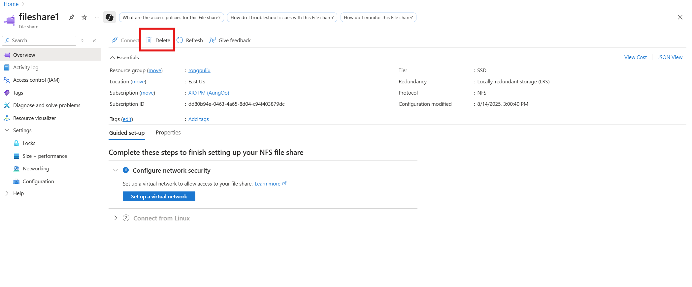

# How to modify an Azure file share

This article explains how to adjust the size, cost, and performance characteristics of Azure file shares using the Azure portal, Azure PowerShell, and Azure CLI. The procedures are different for classic file shares, which use the Microsoft.Storage resource provider, versus file shares created with Microsoft.FileShares (preview).

## Applies to

| Management model     | Billing model  | Media tier     | Redundancy     |                 SMB                 |                 NFS                 |
| -------------------- | -------------- | -------------- | -------------- | :---------------------------------: | :---------------------------------: |
| Microsoft.FileShares | Provisioned v2 | SSD (premium)  | Local (LRS)    |    |   |
| Microsoft.FileShares | Provisioned v2 | SSD (premium)  | Zone (ZRS)     |    |    |
| Microsoft.Storage    | Provisioned v2 | SSD (premium)  | Local (LRS)    |  |  |
| Microsoft.Storage    | Provisioned v2 | SSD (premium)  | Zone (ZRS)     |  |  |
| Microsoft.Storage    | Provisioned v2 | HDD (standard) | Local (LRS)    |  |    |
| Microsoft.Storage    | Provisioned v2 | HDD (standard) | Zone (ZRS)     |  |    |
| Microsoft.Storage    | Provisioned v2 | HDD (standard) | Geo (GRS)      |  |    |
| Microsoft.Storage    | Provisioned v2 | HDD (standard) | GeoZone (GZRS) |  |    |
| Microsoft.Storage    | Provisioned v1 | SSD (premium)  | Local (LRS)    |  |  |
| Microsoft.Storage    | Provisioned v1 | SSD (premium)  | Zone (ZRS)     |  |  |
| Microsoft.Storage    | Pay-as-you-go  | HDD (standard) | Local (LRS)    |  |    |
| Microsoft.Storage    | Pay-as-you-go  | HDD (standard) | Zone (ZRS)     |  |    |
| Microsoft.Storage    | Pay-as-you-go  | HDD (standard) | Geo (GRS)      |  |    |
| Microsoft.Storage    | Pay-as-you-go  | HDD (standard) | GeoZone (GZRS) |  |    |

## Change the cost and performance characteristics of a classic file share

After creating your file share, you might need to adjust the provisioning (provisioned models) or access tier (pay-as-you-go model) of the share. The following sections show you how to adjust the relevant properties for your share.

### Change the cost and performance characteristics of a provisioned v2 classic file share

After creating your provisioned v2 file share, you can change one or all three of the provisioned quantities of your file share. The amount of storage, IOPS, and throughput you provision can be dynamically scaled up or down as your needs change. However, you can only decrease a provisioned quantity after 24 hours have elapsed since your last quantity increase. Storage, IOPS, and throughput changes are effective within a few minutes after a provisioning change.

# [Portal](#tab/azure-portal)

Follow these instructions to update the provisioning for your file share.

1. Go to your storage account. From the service menu, under **Data storage**, select **File shares**.

2. In the file share listing, select the file share for which you desire to change the provisioning.

3. In the file share overview, select **Change size and performance**.

   

4. The **Size and performance** pop out dialog has the following options:

   

   - **Provisioned storage (GiB)**: The amount of storage provisioned on the share.

   - **Provisioned IOPS and throughput**: A radio button group that lets you select between _Recommended provisioning_ and _Manually specify IOPS and throughput_. If your share is at the recommended IOPS and throughput level for the amount of storage provisioned, _Recommended provisioning_ will be selected; otherwise, _Manually specify IOPS and throughput_ will be selected. You can toggle between these two options depending on your desire to change share provisioning.

     - **IOPS**: If you select _Manually specify IOPS and throughput_, this textbox enables you to change the amount of IOPS provisioned on this file share.

     - **Throughput (MiB/sec)**: If you select _Manually specify IOPS and throughput_, this textbox enables you to change the amount of throughput provisioned on this file share.

5. Select **Save** to save provisioning changes. Storage, IOPS, and throughput changes are effective within a few minutes after a provisioning change.

# [PowerShell](#tab/azure-powershell)

You can modify a provisioned v2 file share with the `Update-AzRmStorageShare` cmdlet. Remember to replace the values for the variables `$resourceGroupName`, `$storageAccountName`, `$shareName`, `$provisionedMibps`, `$provisionedIops`, and `$provisionedStorageGib` with the desired values for your file share.

```powershell
# The path to the file share resource to be modified.
$resourceGroupName = "<my-resource-group>"
$storageAccountName = "<my-storage-account-name>"
$shareName = "<name-of-the-file-share>"
# The provisioning desired on the file share. Delete the parameters if no
# change is desired.
$provisionedStorageGib = 10240
$provisionedIops = 10000
$provisionedThroughputMibPerSec = 2048
# Update the file share provisioning.
Update-AzRmStorageShare `
        -ResourceGroupName $resourceGroupName `
        -AccountName $storageAccountName `
        -ShareName $shareName `
        -QuotaGiB $provisionedStorageGib `
        -ProvisionedIops $provisionedIops `
        -ProvisionedBandwidthMibps $provisionedThroughputMibPerSec
$f = Get-AzRmStorageShare -ResourceGroupName $resourceGroupName -AccountName $storageAccountName -ShareName $shareName
$f | fl
```

# [Azure CLI](#tab/azure-cli)

You can modify a provisioned v2 file share with the `az storage share-rm update` command. Remember to replace the values for the variables `resourceGroupName`, `storageAccountName`, `fileShareName`, `provisionedStorageGib`, `provisionedIops`, and `provisionedThroughputMibPerSec` with the desired values for your file share.

```bash
# The path to the file share resource to be modified.
resourceGroupName="<resource-group>"
storageAccountName="<storage-account>"
fileShareName="<file-share>"

# The provisioning desired on the file share. Delete the parameters if no
# change is desired.
provisionedStorageGib=10240
provisionedIops=10000
provisionedThroughputMibPerSec=2048

# Update the file share provisioning.
az storage share-rm update \
        --resource-group $resourceGroupName \
        --name $shareName \
        --storage-account $storageAccountName \
        --quota $provisionedStorageGib \
        --provisioned-iops $provisionedIops \
        --provisioned-bandwidth-mibps $provisionedThroughputMibPerSec
```

---

### Change the cost and performance characteristics of a provisioned v1 classic file share

After creating your provisioned v1 file share, you can change the provisioned storage size of the file share. Changing the provisioned storage of the share will also change the amount of provisioned IOPS and provisioned throughput. You can only decrease the provisioned storage after 24 hours have elapsed since your last storage increase. Storage, IOPS, and throughput changes are effective within a few minutes after a provisioning change. For more information, see [provisioned v1 provisioning detail](./understanding-billing.md#provisioned-v1-provisioning-detail).

# [Portal](#tab/azure-portal)

Follow these instructions to update the provisioning for your file share.

1. Go to your storage account. From the service menu, under **Data storage**, select **File shares**.

2. In the file share listing, select the file share for which you desire to change the provisioning.

3. In the file share overview select **Change size and performance**.

   

4. The **Size and performance** pop out dialog has a single option, **Provisioned storage (GiB)**. If you require more IOPS or throughput than the given amount of provisioned storage provides, you can increase your provisioned storage capacity to get additional IOPS and throughput.

   

5. Select **Save** to save provisioning changes. Storage, IOPS, and throughput changes are effective within a few minutes after a provisioning change.

> [!NOTE]
> You can use PowerShell and CLI to enable/disable paid bursting if desired. Paid bursting is an advanced feature of the provisioned v1 billing model. Consult [provisioned v1 paid bursting](./understanding-billing.md#provisioned-v1-paid-bursting) before enabling paid bursting.

# [PowerShell](#tab/azure-powershell)

You can modify a provisioned v1 file share with the `Update-AzRmStorageShare` cmdlet. Remember to replace the values for the variables `$resourceGroupName`, `$storageAccountName`, and `$fileShareName` with the desired values for your file share. Set `$provisionedStorageGib`, `$paidBurstingEnabled`, `$paidBurstingMaxIops`, and `$paidBurstingMaxThroughputMibPerSec` to non-null (`$null`) values to set on the file share. Paid bursting is an advanced feature of the provisioned v1 model. Consult [provisioned v1 paid bursting](./understanding-billing.md#provisioned-v1-paid-bursting) before enabling.

```PowerShell
# The path to the file share resource to be modified.
$resourceGroupName = "<resource-group>"
$storageAccountName = "<storage-account>"
$fileShareName = "<file-share>"
# The provisioning desired on the file share. Set to $null to keep at the
# current level of provisioning.
$provisionedStorageGib = 10240
# Paid bursting settings.
$paidBurstingEnabled = $null # Set to $true or $false.
$paidBurstingMaxIops = $null # Set to an integer value.
$paidBurstingMaxThroughputMibPerSec = $null # Set to an integer value.
# Configure parameter object for splatting.
$params = @{
    ResourceGroupName = $resourceGroupName;
    StorageAccountName = $storageAccountName;
    Name = $fileShareName;
}
if ($null -ne $provisionedStorageGib) {
    $params += @{ QuotaGiB = $provisionedStorageGib }
}
if ($null -ne $paidBurstingEnabled) {
    $params += @{ PaidBurstingEnabled = $paidBurstingEnabled }
}
if ($null -ne $paidBurstingMaxIops) {
    $params += @{ PaidBurstingMaxIops = $paidBurstingMaxIops }
}
if ($null -ne $paidBurstingMaxThroughputMibPerSec) {
    $params += @{
        PaidBurstingMaxBandwidthMibps = $paidBurstingMaxThroughputMibPerSec
    }
}
# Update the file share provisioning.
Update-AzRmStorageShare @params
```

# [Azure CLI](#tab/azure-cli)

You can modify a provisioned v1 file share with the `az storage share-rm update` command. Remember to replace the values for the variables `resourceGroupName`, `storageAccountName`, `fileShareName`, and `provisionedStorageGib` with the desired values for your file share.

```bash
# The path to the file share resource to be modified.
resourceGroupName="<resource-group>"
storageAccountName="<storage-account>"
fileShareName="<file-share>"

# The provisioning desired on the file share.
provisionedStorageGib=10240

# Update the file share provisioning.
az storage share-rm update \
        --resource-group $resourceGroupName \
        --storage-account $storageAccountName \
        --name $fileShareName \
        --quota $provisionedStorageGib
```

To toggle paid bursting, use the `--paid-bursting-enabled` parameter. Paid bursting is an advanced feature of the provisioned v1 model. Consult [provisioned v1 paid bursting](./understanding-billing.md#provisioned-v1-paid-bursting) before enabling. You can optionally use the `--paid-bursting-max-iops` and `--paid-bursting-max-bandwidth-mibps` flags to set a restriction on the upper amount of paid bursting allowed for cost control purposes. Remember to replace the values for the variables `resourceGroupName`, `storageAccountName`, and `fileShareName` with the desired values for your file share.

```bash
resourceGroupName="<resource-group>"
storageAccountName="<storage-account>"
fileShareName="<file-share>"

az storage share-rm update \
        --resource-group $resourceGroupName \
        --storage-account $storageAccountName \
        --name $fileShareName \
        --paid-bursting-enabled true
```

---

### Change the cost and performance characteristics of a pay-as-you-go classic file share

After you've created your pay-as-you-go file share, there are two properties you might want to change:

- **Access tier**: The access tier of the file share dictates to the ratio of storage to IOPS/throughput costs (in the form of transactions). There are three access tiers: _transaction optimized_, _hot_, and _cool_. Changing the tier of the Azure file share results in transaction costs for the movement to the new access tier. For more information, see [switching between access tiers](./understanding-billing.md#switching-between-access-tiers).

- **Quota**: Quota is a limit on the size of the file share. The quota property is used in the provisioned v2 and provisioned v1 models to mean "provisioned storage capacity", however, in the pay-as-you-go model, quota has no direct impact on bill. The two primary reasons you might want to modify this are if you use quota to limit the growth of your file share to keep control of the used storage/transaction costs in the pay-as-you-go model, or if you have a storage account predating the introduction of the large file share feature, which enabled file shares to grow beyond 5 TiB. The maximum file share size for a pay-as-you-go file share is 100 TiB.

# [Portal](#tab/azure-portal)

Follow these instructions to update the access tier of your file share using the Azure portal.

1. Go to your storage account. From the service menu, under **Data storage**, select **File shares**.

2. In the file share listing, select the file share for which you desire to change the access tier.

3. In the file share overview, select **Change tier**.

4. Select the desired **Access tier** from the provided drop-down list.

5. Select **Apply** to save the access tier change.

For these instructions to update the quota of your file share.

1. Go to your storage account. From the service menu, under **Data storage**, select **File shares**.

2. In the file share listing, select the file share for which you desire to change the quota.

3. In the file share overview, select **Edit quota**.

4. In the edit quota pop-out, enter the desired maximum size of the share or select **Set to maximum**. There is no cost implication of setting the share to the maximum size.

5. Select **OK** to save quota changes. The new quota is effective within a few minutes.

# [PowerShell](#tab/azure-powershell)

You can modify the access tier and quota settings of a pay-as-you-go file share with the `Update-AzRmStorageShare` cmdlet. Remember to replace the values for the variables `$resourceGroupName`, `$storageAccountName`, `$fileShareName`, `$accessTier`, and `$quotaGib` with the desired values for your file share.

```PowerShell
# The path to the file share resource to be modified.
$resourceGroupName = "<resource-group>"
$storageAccountName = "<storage-account>"
$fileShareName = "<file-share>"
# The settings to be changed on the file share. Set to $null to skip setting.
$accessTier = "Cool"
$quotaGib = $null
# Construct a parameters hash table for cmdlet splatting.
$updateParams = @{
    ResourceGroupName = $resourceGroupName
    StorageAccountName = $storageAccountName
    Name = $fileShareName
}
if ($null -ne $accessTier) { $updateParams += @{ AccessTier = $accessTier } }
if ($null -ne $quotaGib) { $updateParams += @{ QuotaGiB = $quotaGib } }
# Update the file share
Update-AzRmStorageShare @updateParams
```

# [Azure CLI](#tab/azure-cli)

You can modify the access tier and quota settings of a pay-as-you-go file share with the `az storage share-rm update` command. Remember to replace the values for the variables `resourceGroupName`, `storageAccountName`, `fileShareName`, `accessTier`, and `quotaGib` with the desired values for your file share.

```bash
# The path to the file share resource to be modified.
resourceGroupName="<resource-group>"
storageAccountName="<storage-account>"
fileShareName="<file-share>"

# The settings to be changed on the file share. Set to the empty string to skip
# setting.
accessTier="Cool"
quotaGib=""

command="az storage share-rm update --resource-group $resourceGroupName"
command="$command --storage-account $storageAccountName --name $fileShareName"

if [ ! -z "${accessTier}" ]; then
    command="$command --access-tier $accessTier"
fi

if [ ! -z "${quotaGib}" ]; then
    command="$command --quota $quotaGib"
fi

# Update file share (command is in variable)
$command
```

---

## Change the cost and performance characteristics of a file share (Microsoft.FileShares)

> [!NOTE]
> File share with Microsoft.FileShares is currently in preview. You may use the Azure portal, or you can use generic PowerShell or Azure CLI commands to work with file shares. If you want to try the CLI private package for Microsoft.FileShares resource provider, fill out this [survey](https://forms.microsoft.com/r/nEGcB0ccaD).

# [Portal](#tab/azure-portal)

Follow these instructions to change the size and performance of a file share (Microsoft.FileShares) using the Azure portal. The amount of storage, IOPS, and throughput you provision can be dynamically scaled up or down as your needs change. However, you can only decrease a provisioned quantity after 24 hours have elapsed since your last quantity increase. Storage, IOPS, and throughput changes are effective within a few minutes after a provisioning change.

1. Select the file share you want to modify.
2. From the context menu, select **Settings**.
3. Choose **Size + performance**.

   

4. The **Size and performance** dialog has the following options:

   - **Provisioned capacity (GiB)**: The amount of storage provisioned on the share.

   - **Provisioned IOPS and throughput**: A radio button group that lets you select between _Recommended provisioning_ and _Manually specify IOPS and throughput_. If your share is at the recommended IOPS and throughput level for the amount of storage provisioned, _Recommended provisioning_ will be selected; otherwise, _Manually specify IOPS and throughput_ will be selected. You can toggle between these two options to change share provisioning.

    - **IOPS**: If you select _Manually specify IOPS and throughput_, this textbox enables you to change the amount of IOPS provisioned on this file share.

    - **Throughput (MiB/sec)**: If you select _Manually specify IOPS and throughput_, this textbox enables you to change the amount of throughput provisioned on the file share.

    

5. Select **Save**. Storage, IOPS, and throughput changes are effective within a few minutes after a provisioning change.

# [PowerShell](#tab/azure-powershell)

To change the size and performance of a file share (Microsoft.FileShares) using PowerShell, use the following commands.

```powershell
$Resource = Get-AzResource -ResourceType "Microsoft.FileShares/fileShares" `
                            -ResourceGroupName "<your-resource-group-name>" `
                            -ResourceName "<your-file-share-name>"
# You may update file share, provisioned capacity, IOPS, throughput, mount name, and nfsProtocolProperties here. 
# For more info, refer to the property example for update section. 
$Resource.Properties.provisionedStorageGiB = <intended capacity>
$Resource | Set-AzResource -Force
```

Property example for update:

```powershell
-Properties @{
    provisionedStorageGiB = 36
    ProvisionedIoPerSec = 5005 
    ProvisionedThroughputMiBPerSec = 1003
    mountName = "<intened-mount-name>"
    nfsProtocolProperties = @{
        rootSquash = "AllSquash"
    }
}
```

To check file share information:

```powershell
$Resource = Get-AzResource -ResourceType "Microsoft.FileShares/fileShares" `
                            -ResourceGroupName "<your-resource-group-name>" `
                            -ResourceName "<your-file-share-name>"
$Resource.properties
```

# [Azure CLI](#tab/azure-cli)

To change the size and performance of a file share (Microsoft.FileShares) using Azure CLI, use the following commands.

```bash
az resource update \
  --resource-type "Microsoft.FileShares/fileShares" \
  --name <your-file-share-name> \
  --resource-group <your-resource-group-name> \
  --set properties.provisionedStorageGiB=<intended capacity> \
       properties.ProvisionedIoPerSec=<intended IOPS> \
       properties.ProvisionedThroughputMiBPerSec=<intended througphput> \
       properties.nfsProtocolProperties.rootSquash="AllSquash"
```

To check file share information:

```bash
az resource show \
  --resource-type "Microsoft.FileShares/fileShares" \
  --name <your-file-share-name> \
  --resource-group <your-resource-group-name>
```

---

## Delete a classic file share

Depending on your workflow, you might want to delete unused or outdated file shares. File shares in storage accounts with [soft delete enabled](storage-files-prevent-file-share-deletion.md) can be recovered within the retention period.

# [Portal](#tab/azure-portal)

Follow these instructions to delete a classic file share using the Azure portal.

1. Go to your storage account. From the service menu, under **Data storage**, select **File shares**.

2. In the file share list, select the **...** for the file share you want to delete.

3. Select **Delete share** from the context menu.

4. The **Delete** pop-out contains a survey about why you're deleting the file share. You can skip this, but we appreciate any feedback you have on Azure Files, particularly if something isn't working properly for you.

5. Enter the file share name to confirm deletion and then select **Delete**.

# [PowerShell](#tab/azure-powershell)

You can delete a file share using the `Remove-AzRmStorageShare` cmdlet. Remember to replace the values for the variables `$resourceGroupName`, `$storageAccountName`, and `$fileShareName` with the desired values for your file share.

```PowerShell
# The path to the file share resource to be deleted.
$resourceGroupName = "<resource-group>"
$storageAccountName = "<storage-account>"
$fileShareName = "<file-share>"
# Remove the file share
Remove-AzRmStorageShare `
        -ResourceGroupName $resourceGroupName `
        -StorageAccountName $storageAccountName `
        -Name $fileShareName
```

# [Azure CLI](#tab/azure-cli)

You can delete a file share using the `az storage share-rm delete` command. Remember to replace the values for the variables `resourceGroupName`, `storageAccountName`, and `fileShareName` with the desired values for your file share.

```bash
resourceGroupName="<resource-group>"
storageAccountName="<storage-account>"
fileShareName="<file-share>"

az storage share-rm delete \
    --resource-group $resourceGroupName \
    --storage-account $storageAccountName \
    --name $fileShareName
```

---

## Delete a file share (Microsoft.FileShares)

> [!NOTE]
> File share with Microsoft.FileShares is currently in preview. You may use the Azure portal, or you can use generic PowerShell or Azure CLI commands to work with file shares. If you want to try the CLI private package for Microsoft.FileShares resource provider, fill out this [survey](https://forms.microsoft.com/r/nEGcB0ccaD).

# [Portal](#tab/azure-portal)

To delete a file share (Microsoft.FileShares) using the Azure portal, follow these steps.

1. Go to your file share.

2. Select **Delete** from the context menu.

    

3. The **Delete** pop-out contains a survey about why you're deleting the file share. You can skip this, but we appreciate any feedback you have on Azure Files, particularly if something isn't working properly for you.

4. Enter the file share name to confirm deletion and then select **Delete**.

# [PowerShell](#tab/azure-powershell)

To delete a file share (Microsoft.FileShares) using PowerShell, run the following command.

```powershell
Remove-AzResource -ResourceType "Microsoft.FileShares/fileShares" `
                  -ResourceName "<your-file-share-name>" `
                  -ResourceGroupName "<your-resource-group-name>" `
```

# [Azure CLI](#tab/azure-cli)

To delete a file share (Microsoft.FileShares) using Azure CLI, run the following command.

```bash
az resource delete \
  --resource-type "Microsoft.FileShares/fileShares" \
  --name <your-file-share-name> \
  --resource-group <your-resource-group-name>
```

---

## Next steps

- Learn [more about Azure Files](storage-files-introduction.md)
- Learn how to [plan for an Azure Files deployment](storage-files-planning.md)
