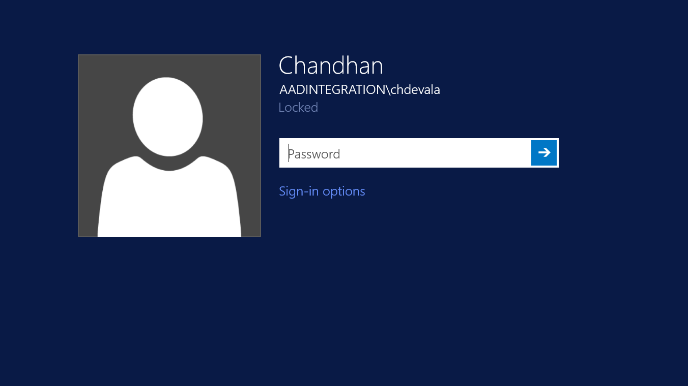

# Enable Azure Active Directory integration for Azure Files SMB access

Azure Files offers fully managed file shares in the cloud that are accessible via the industry standard [Server Message Block (SMB) protocol](https://msdn.microsoft.com/library/windows/desktop/aa365233.aspx) (also known as Common Internet File System or CIFS). Azure File shares can be mounted
concurrently by cloud or on-premises deployments of Windows, Linux, and macOS using Storage account name and key. We recently announced the Public Preview of
Azure Files Azure AD Integration leveraging [Azure Active Directory Domain Services](https://docs.microsoft.com/azure/active-directory-domain-services/active-directory-ds-overview)
(AAD DS). This enables share access using Azure AD credentials over SMB for Windows Virtual Machine. Besides, Azure Files will support preserving and enforcing
[NTFS DACLs](https://technet.microsoft.com/library/2006.01.howitworksntfs.aspx) on all files and directories under a file share.


## Workflow 

The diagram below illustrates the end to end workflow to enable Azure Files Azure AD
integration for SMB access. There are two parts to the process. First, the
prerequisites, this is to verify that your Azure AD and Storage environments are
proper configured. We strongly recommend you to walk through the prerequisites
and ensure that you have performed the required setup. Then, you can proceed to
activate Azure Files access with Azure AD credentials in 3 steps: Enable Azure Files
Azure AD Integration, Assign user permission, and Access share with Azure AD credentials.


## Prerequisites 

1.  Select or create your Azure Active Directory (Azure AD) tenant

    Select your target Azure AD tenant and deploy your file share under the
    subscriptions associated with this Azure AD tenant. If you don’t have an existing
    Azure AD tenant, you can [Add an Azure AD tenant and Azure AD
    subscription](https://docs.microsoft.com/windows/client-management/mdm/add-an-azure-ad-tenant-and-azure-ad-subscription).
    If you have an existing Azure AD tenant and want to create a new tenant,
    follow the guidance for [Create an Azure Active Directory
    tenant](https://docs.microsoft.com/rest/api/datacatalog/create-an-azure-active-directory-tenant).

2.  Enable Azure Active Directory Domain Service (AAD DS) on your Azure AD tenant

    To support authentication with Azure AD credentials, you need to enable AAD DS on
    your Azure AD tenant. If you are not the administrator of the Azure AD tenant, please
    contact the administrator and follow the step by step guidance to [Enable
    Azure Active Directory Domain Services using the Azure
    portal](https://docs.microsoft.com/azure/active-directory-domain-services/active-directory-ds-getting-started).
    It usually takes around 15 minutes for AAD DS deployment to complete, please
    ensure that the health status of your AAD DS shows “Running” before
    proceeding to the next step.

3.  Domain join your Azure VM to AAD DS

    To access Azure File shares using Azure AD credentials from a VM, your VM must be
    domain joined to AAD DS. For Preview, we only support Azure AD integration for
    Azure Windows Server VMs. We will extend the coverage to include Linux VMs
    by GA. You can [Join a Windows Server virtual machine to a managed
    domain](https://docs.microsoft.com/azure/active-directory-domain-services/active-directory-ds-admin-guide-join-windows-vm-portal)
    in a few steps.

4.  Select or create your new Azure File share

    We support Azure Files integration with the primary Azure AD tenant, which is the
    Azure AD tenant that is associated with the subscriptions where the file share is
    deployed under. You can select an existing file share or [Create a file
    share in Azure
    Files](https://docs.microsoft.com/azure/storage/files/storage-how-to-create-file-share)
    under your target Azure AD tenant. Besides, we recommend having your File share
    deployed in the same region as your VMs where you will access the share for
    better performance.

5.  Verify Azure Files connectivity by mounting Azure Files shares using storage
    account key

    To ensure that your VM and file share are properly configured, try [Mount an
    Azure File share and access the share in
    Windows](https://docs.microsoft.com/azure/storage/files/storage-how-to-use-files-windows).

## Enable Azure AD integration for Azure Files SMB access

We recommend you to review the prerequisites again before proceeding to the
steps below to enable Azure AD integration for Azure Files.

### Step 1: Enable Azure AD integration for Azure Files on your storage account

You will first need to enable Azure AD integration for Azure Files on your storage
account by setting the storage account property azureFilesAadIntegration to
true. It registers the storage account with the associated AAD DS to support
Kerberos authentication from Azure Files access with Azure AD credentials. Now Azure AD
integration is enabled for all new and existing file shares deployed under this
storage account. You can update the storage account property listed below
through [Azure Resource
Manager](https://docs.microsoft.com/azure/azure-resource-manager/resource-group-overview)
(ARM) using the [storage account
template](https://docs.microsoft.com/azure/templates/microsoft.storage/storageaccounts)
(Private Preview), or through Azure PS (Preview), CLI (Preview), and Azure
Portal (GA).

**Portal**

To be updated: Required before GA

**Powershell**

Remember to replace "\<resource-group-name\>, \<storage-account-name\> with
proper information.

```powershell
Set-AzureRmStorageAccount -ResourceGroupName "\<resource-group-name\>" -Name
"\<storage-account-name\>" -EnableAzureFilesAadIntegration \$true
```

**CLI**

To be updated: Required before Public Preview

**ARM/JSON**

You can include the property **azureFilesAadIntegration** in the ARM update for your
storage account and set it to true.

```json
{ 
  "properties": { 
    "azureFilesAadIntegration":true, 
    … 
  } 
} 
```

### Step 2 Assign permissions to a user with super-user privileges 

To access Azure Files using Azure AD credentials, a user must have the required
permissions on share, directory, and file levels. The step by step guidance
below demonstrates how to assign super-user or administrator permission to a
user with fill read, write, and ownership of a file share. You can follow the
same flow to assign permissions at different levels to other users or user
groups.

#### Step 2.1: Assign share level permission

We leverage [role-based access control
(RBAC)](https://docs.microsoft.com/azure/role-based-access-control/role-assignments-portal)
to define file share level access for users, groups, and service principals by
assigning roles to the file share. This is very similar to the Windows Share
permission where you determine the type of access others have to the specific
file share. We support two custom roles that refine the permission to data path
access to Azure File shares: Storage Files Data Contributor (Allows read, write
and delete access to Azure File share), Storage Files Data Reader (Allows read
access to Azure File share). We can still apply existing default roles like
Owner, Contributor, and Reader to grant broader permissions on share level.

**Portal**

To be updated: Required before Preview

**Powershell**

You can use existing [RBAC assignment Powershell
commands](https://docs.microsoft.com/azure/role-based-access-control/role-assignments-powershell)
to manage access on Azure File shares. The command below allows you to assign
RBAC role to a Azure AD user with its sign in name.

```powershell
New-AzureRmRoleAssignment -SignInName <user-email> -RoleDefinitionName <role-name-in-quotes> -Scope <resource-id>
```

For example:

```powershell
PS C:\\\> New-AzureRmRoleAssignment -SignInName <john.doe@contoso.com>
-RoleDefinitionName "Owner" -Scope "/subscriptions/00000000-0000-0000-0000
000000000000/resourceGroups/aadintegration/providers/Microsoft.Storage/storageAccounts/testaccount/"
```

**CLI**

You can use existing [RBAC assignment CLI
commands](https://docs.microsoft.com/azure/role-based-access-control/role-assignments-cli)
to manage access on Azure File shares. The command below allows you to assign
RBAC role to a Azure AD user with its sign in name.

```cli
az role assignment create --role <role-name-in-quotes> --assignee <user-email> --scope <resource-id>
```

For example:

```cli
az role assignment create --role "Owner" --assignee <john.doe@contoso.com> –scope "/subscriptions/00000000-0000-0000-0000-000000000000/resourceGroups/aadintegration/providers/Microsoft.Storage/storageAccounts/testaccount/"
```

#### Step 2.2: Configure root/directory/file level NTFS permissions with icacls over SMB 

After configuring the share level access, you need to assign proper NTFS
permission on the root/directory/file level. You can consider share level
permission as the top level gate keeper that determine where a user can access
to the share all up, and NTFS permission at a granular level to determine what
operations you can perform on per directory/file level. Azure Files supports the
full set of NTFS basic and advance permissions. You will be able to view and
configure NTFS permissions on directories and files in an Azure File share by
mounting the share then running Windows
[icacls](https://docs.microsoft.com/windows-server/administration/windows-commands/icacls)
command. You can also use
[robocopy](https://docs.microsoft.com/windows-server/administration/windows-commands/robocopy)
or other copy tools to copy files along with the ACLs.

If you have just enabled Azure AD integration feature, you will not have any Azure AD
users that has NTFS permissions configured on the root directory of the file
share. With that, you will need to mount your share with storage account key to
your AAD DS domain joined VM to assign permissions with Super-User privileges.
You can follow up the instruction below to mount Azure File share with command
prompt.

#### **Step 2.2.1 Mount Azure File Share with command prompt** 

Use the following command to mount the Azure File share: Remember to replace \<desired-drive-letter\>, \<storage-account-name\>, \<share-name\>, \<storage-account-key\>, \<storage-account-name\> with the proper information. You can refer to [Mount an Azure File share and access the share in Windows](https://docs.microsoft.com/azure/storage/files/storage-how-to-use-files-windows) for more details.
=====================================================================================================================================================================================================================================================================================================================================================================================================================

```
net use <desired-drive-letter>: \\<storage-account-name\>.file.core.windows.net\<share-name> <storage-account-key> /user:Azure\<storage-account-name>
```

If you already have a Azure AD user setup with write access to Azure Files, you can
mount the file share using Azure AD directly from domain joined VM.

**Step 2.2.2 Configure NTFS permissions with icacls**

Use the following command to give full permission to all directories and files
under the file share including root directory: Remember to
replace <mounted-drive-letter> and <user-email> with your own values.
You can find more information on how to use icacls to set NTFS permissions and
the different type of permissions supported
[here](https://docs.microsoft.com/windows-server/administration/windows-commands/icacls).

```
icacls <mounted-drive-letter> /grant <user-email>:(f)
```

### Step 3: Mount Azure File share from AAD DS domain joined VM 

Now you are ready to use your Azure AD credentials to access Azure File share.

First, log on to the Azure VM domain joined to AAD DS using the name and
password that you have just granted permissions, see screenshot below.



  
Then, use the following command to mount the Azure File share: Remember to
replace \< desired-drive-letter\>, \<storage-account-name\>, \<share-name\> with
the proper information. This time, you will no longer need to provide storage
account key nor Azure AD user name and password. We support single sign on experience
using Azure AD credentials.

```
net use <desired-drive-letter>: \\<storage-account-name>.file.core.windows.net\<share-name>
```

You have now successfully enabled Azure Files Azure AD integration and setup an
administrative account to manage permission assignment. If you need to grant
access permission of your file share to more users, follow the instruction in
step 2.

## Feedback

Azure file users, we want to hear from you! Email *Azure Files AAD Integration*
to provide your feedback.

## Next steps

See these links for more information about Azure Files.

-   [Introduction to Azure Files](storage-files-introduction.md)
-   [Planning for an Azure Files deployment](storage-files-planning.md)
-   Azure Files access with Azure AD credentials over SMB
-   [FAQ](storage-files-faq.md)
-   [Troubleshooting](storage-troubleshoot-linux-file-connection-problems.md)

