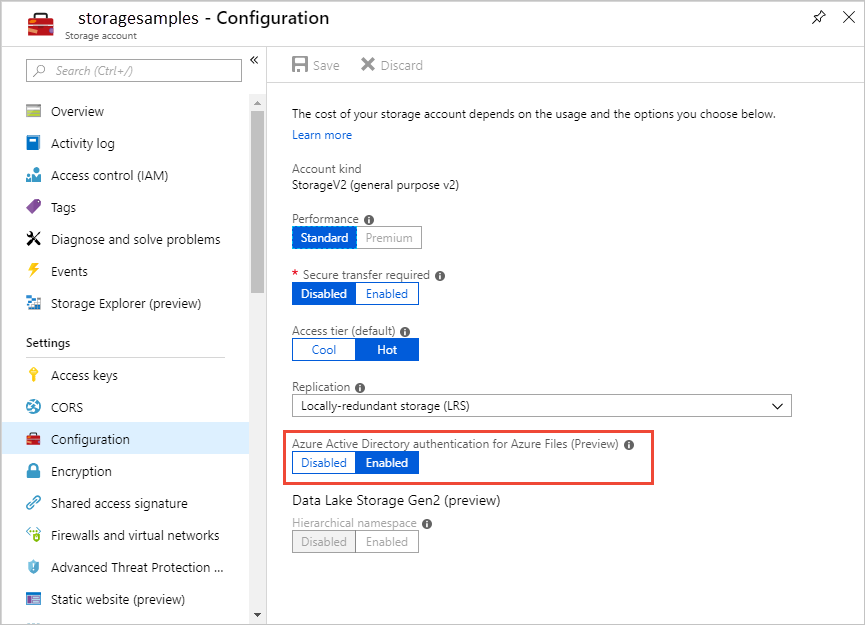

# Enable Azure Active Directory Domain Service authentication over SMB for Azure Files (Preview)
[!INCLUDE [storage-files-aad-auth-include](../../../includes/storage-files-aad-auth-include.md)]

For an overview of Azure AD authentication over SMB for Azure Files, see [Overview of Azure Active Directory authentication over SMB for Azure Files (Preview)](storage-files-active-directory-overview.md).

[!INCLUDE [updated-for-az](../../../includes/updated-for-az.md)]

## Overview of the workflow
Before you enable Azure AD DS Authentication over SMB for Azure Files, verify that your Azure AD and Azure Storage environments are properly configured. It's recommended that you walk through the [prerequisites](#prerequisites) to make sure that you've performed all of the required steps. 

Next, grant access to Azure Files resources with Azure AD credentials by following these steps: 

1. Enable Azure AD DS authentication over SMB for your storage account to register the storage account with the associated Azure AD Domain Services deployment.
2. Assign access permissions for a share to an Azure AD identity (a user, group, or service principal).
3. Configure NTFS permissions over SMB for directories and files.
4. Mount an Azure file share from a domain-joined VM.

The diagram below illustrates the end-to-end workflow for enabling Azure AD DS authentication over SMB for Azure Files. 


## Prerequisites 

Before you enable Azure AD over SMB for Azure Files, make sure you have completed the following prerequisites:

1.  **Select or create an Azure AD tenant.**

    You can use a new or existing tenant for Azure AD authentication over SMB. The tenant and the file share that you want to access must be associated with the same subscription.

    To create a new Azure AD tenant, you can [Add an Azure AD tenant and an Azure AD subscription](https://docs.microsoft.com/windows/client-management/mdm/add-an-azure-ad-tenant-and-azure-ad-subscription). If you have an existing Azure AD tenant but want to create a new tenant for use with Azure Files, see [Create an Azure Active Directory tenant](https://docs.microsoft.com/rest/api/datacatalog/create-an-azure-active-directory-tenant).

2.  **Enable Azure AD Domain Services on the Azure AD tenant.**

    To support authentication with Azure AD credentials, you must enable Azure AD Domain Services for your Azure AD tenant. If you aren't the administrator of the Azure AD tenant, contact the administrator and follow the step-by-step guidance to [Enable Azure Active Directory Domain Services using the Azure portal](../../active-directory-domain-services/create-instance.md).

    It typically takes about 15 minutes for an Azure AD Domain Services deployment to complete. Verify that the health status of your Azure AD Domain Services shows **Running**, with password hash synchronization enabled, before proceeding to the next step.

3.  **Domain-join an Azure VM with Azure AD Domain Services.**

    To access a file share using Azure AD credentials from a VM, your VM must be domain-joined to Azure AD Domain Services. For more information about how to domain-join a VM, see [Join a Windows Server virtual machine to a managed domain](../../active-directory-domain-services/join-windows-vm.md).

    > [!NOTE]
    > Azure AD DS authentication over SMB with Azure Files is supported only on Azure VMs running on OS versions above Windows 7 or Windows Server 2008 R2.

4.  **Select or create an Azure file share.**

    Select a new or existing file share that's associated with the same subscription as your Azure AD tenant. For information about creating a new file share, see [Create a file share in Azure Files](storage-how-to-create-file-share.md). 
    For optimal performance, Microsoft recommends that your file share is in the same region as the VM from which you plan to access the share.

5.  **Verify Azure Files connectivity by mounting Azure file shares using your storage account key.**

    To verify that your VM and file share are properly configured, try mounting the file share using your storage account key. For more information, see [Mount an Azure file share and access the share in Windows](storage-how-to-use-files-windows.md).

## Enable Azure AD DS authentication for your account

To enable Azure AD DS authentication over SMB for Azure Files, you can set a property on storage accounts created after September 24, 2018, using the Azure portal, Azure PowerShell, or Azure CLI. Setting this property registers the storage account with the associated Azure AD Domain Services deployment. Azure AD DS authentication over SMB is then enabled for all new and existing file shares in the storage account. 

Keep in mind that you can enable Azure AD DS authentication over SMB only after you have successfully deployed Azure AD Domain Services to your Azure AD tenant. For more information, refer to the [prerequisites](#prerequisites).

### Azure portal

To enable Azure AD DS authentication over SMB using the [Azure portal](https://portal.azure.com), follow these steps:

1. In the Azure portal, navigate to your existing storage account, or [create a storage account](../common/storage-quickstart-create-account.md).
2. In the **Settings** section, select **Configuration**.
3. Enable **Azure Active Directory Authentication for Azure Files (preview)**.

The following image shows how to enable Azure AD authentication over SMB for your storage account.


  
### PowerShell  

To enable Azure AD DS authentication over SMB using Azure PowerShell: First, install the latest Az module (2.4 or newer) or the Az.Storage module (1.5 or newer).For more information about installing PowerShell, see [Install Azure PowerShell on Windows with PowerShellGet](https://docs.microsoft.com/powershell/azure/install-Az-ps):

```powershell
Install-Module -Name Az.Storage -AllowPrerelease -Force -AllowClobber
```

Next, create a new storage account, then call [Set-AzStorageAccount](https://docs.microsoft.com/powershell/module/az.storage/set-azstorageaccount) and set the **EnableAzureActiveDirectoryDomainServicesForFile** parameter to **true**. In the example below, remember to replace the placeholder values with your own values. (If you were using the previous Preview module, the parameter for feature enablement is **EnableAzureFilesAadIntegrationForSMB**.)

```powershell
# Create a new storage account
New-AzStorageAccount -ResourceGroupName "<resource-group-name>" `
    -Name "<storage-account-name>" `
    -Location "<azure-region>" `
    -SkuName Standard_LRS `
    -Kind StorageV2 `
    -EnableAzureActiveDirectoryDomainServicesForFile $true
```
To enable this feature on existing storage accounts, use the following command:

```powershell
# Update a storage account
Set-AzStorageAccount -ResourceGroupName "<resource-group-name>" `
    -Name "<storage-account-name>" `
    -EnableAzureActiveDirectoryDomainServicesForFile $true
```


### Azure CLI

To enable Azure AD authentication over SMB from Azure CLI 2.0, first install the `storage-preview` extension:

```cli-interactive
az extension add --name storage-preview
```
  
Next, create a new storage account, then call [az storage account update](https://docs.microsoft.com/cli/azure/storage/account#az-storage-account-update) and set the `--file-aad` property to **true**. In the example below, remember to replace the placeholder values with your own values.

```azurecli-interactive
# Create a new storage account
az storage account create -n <storage-account-name> -g <resource-group-name> --file-aad true
```

## Assign access permissions to an identity 

To access Azure Files resources using Azure AD credentials, an identity (a user, group, or service principal) must have the necessary permissions at the share level. This process is similar to specifying Windows Share permissions, where you specify the type of access that a given user has to a file share. The guidance in this section demonstrates how to assign read, write, or delete permissions for a file share to an identity.

We have introduced two Azure Built-in roles for granting share level permissions to users: Storage File Data SMB Share Reader and Storage File Data SMB Share Contributor. 

- **Storage File Data SMB Share Reader** allows read access in Azure Storage file shares over SMB
- **Storage File Data SMB Share Contributor** allows read, write, and delete access in Azure Storage file shares over SMB

> [!IMPORTANT]
> Full administrative control of a file share, including the ability to assign a role to an identity, requires using the storage account key. Administrative control is not supported with Azure AD credentials. 

You can use the Azure portal, PowerShell, or Azure CLI to assign the built-in roles to the Azure AD identity of an user for granting share level permissions. 

#### Azure portal
To assign a RBAC role to an Azure AD identity, using the [Azure portal](https://portal.azure.com), follow these steps:

1. In the Azure portal, navigate to your file share, or [create a file share in Azure Files](storage-how-to-create-file-share.md).
2. Select **Access Control (IAM)**.
3. Select **Add a role assignment**
4. In the **Add role assignment** blade, select the appropriate built-in role (Storage File Data SMB Share Reader, Storage File Data SMB Share Contributor) from the **Role** dropdown list. Keep the **Assign access to** as default: "Azure AD user, group, or service principal", and select the target Azure AD identity by name or email address. 
5. Lastly, select **Save** to complete the role assignment operation.

#### PowerShell

The following PowerShell command shows how to assign a RBAC role to an Azure AD identity, based on sign-in name. For more information about assigning RBAC roles with PowerShell, see [Manage access using RBAC and Azure PowerShell](../../role-based-access-control/role-assignments-powershell.md).

When running the following sample script, remember to replace placeholder values, including brackets, with your own values.

```powershell
#Get the name of the custom role
$FileShareContributorRole = Get-AzRoleDefinition "<role-name>" #Use one of the built-in roles: Storage File Data SMB Share Reader, Storage File Data SMB Share Contributor
#Constrain the scope to the target file share
$scope = "/subscriptions/<subscription-id>/resourceGroups/<resource-group>/providers/Microsoft.Storage/storageAccounts/<storage-account>/fileServices/default/fileshare/<share-name>"
#Assign the custom role to the target identity with the specified scope.
New-AzRoleAssignment -SignInName <user-principal-name> -RoleDefinitionName $FileShareContributorRole.Name -Scope $scope
```

#### CLI
  
The following CLI 2.0 command shows how to assign a RBAC role to an Azure AD identity, based on sign-in name. For more information about assigning RBAC roles with Azure CLI, see [Manage access using RBAC and Azure CLI](../../role-based-access-control/role-assignments-cli.md). 

When running the following sample script, remember to replace placeholder values, including brackets, with your own values.

```azurecli-interactive
#Assign the built-in role to the target identity: Storage File Data SMB Share Reader, Storage File Data SMB Share Contributor
az role assignment create --role "<role-name>" --assignee <user-principal-name> --scope "/subscriptions/<subscription-id>/resourceGroups/<resource-group>/providers/Microsoft.Storage/storageAccounts/<storage-account>/fileServices/default/fileshare/<share-name>"
```

## Configure NTFS permissions over SMB 
After you assign share-level permissions with RBAC, you must assign proper NTFS permissions at the root, directory, or file level. Think of share-level permissions as the high-level gatekeeper that determines whether a user can access the share, while NTFS permissions act at a more granular level to determine what operations the user can perform at the directory or file level. 

Azure Files supports the full set of NTFS basic and advanced permissions. You can view and configure NTFS permissions on directories and files in an Azure file share by mounting the share and then running the Windows [icacls](https://docs.microsoft.com/windows-server/administration/windows-commands/icacls) or [Set-ACL](https://docs.microsoft.com/powershell/module/microsoft.powershell.security/get-acl) command. 

> [!NOTE]
> The preview release supports viewing permissions with Windows File Explorer only. Editing permissions is not yet supported.

To configure NTFS permissions with superuser privileges, you must mount the share with your storage account key from your domain-joined VM. Follow the instructions in the next section to mount an Azure file share from the command prompt and configure NTFS permissions accordingly.

The following sets of permissions are supported on the root directory of a file share:

- BUILTIN\Administrators:(OI)(CI)(F)
- NT AUTHORITY\SYSTEM:(OI)(CI)(F)
- BUILTIN\Users:(RX)
- BUILTIN\Users:(OI)(CI)(IO)(GR,GE)
- NT AUTHORITY\Authenticated Users:(OI)(CI)(M)
- NT AUTHORITY\SYSTEM:(F)
- CREATOR OWNER:(OI)(CI)(IO)(F)

### Mount a file share from the command prompt

Use the Windows **net use** command to mount the Azure file share. Remember to replace the placeholder values in the example with your own values. For more information about mounting file shares, see [Mount an Azure file share and access the share in Windows](storage-how-to-use-files-windows.md).

```
net use <desired-drive-letter>: \\<storage-account-name>.file.core.windows.net\<share-name> <storage-account-key> /user:Azure\<storage-account-name>
```

### Configure NTFS permissions with icacls
Use the following Windows command to grant full permissions to all directories and files under the file share, including the root directory. Remember to replace the placeholder values shown in brackets in the example with your own values.

```
icacls <mounted-drive-letter>: /grant <user-email>:(f)
```

For more information on how to use icacls to set NTFS permissions and on the different type of permissions supported, see [the command-line reference for icacls](https://docs.microsoft.com/windows-server/administration/windows-commands/icacls).

## Mount a file share from a domain-joined VM 

Now you are ready to verify that you've completed the steps above successfully by using your Azure AD credentials to access an Azure file share from a domain-joined VM. First, sign in to the VM using the Azure AD identity to which you have granted permissions, as shown in the following image.


Next, use the following command to mount the Azure file share. Remember to replace the placeholder values with your own values. Because you have already been authenticated, you do not need to provide the storage account key or the Azure AD user name and password. Azure AD over SMB supports a single sign-on experience using Azure AD credentials.

```
net use <desired-drive-letter>: \\<storage-account-name>.file.core.windows.net\<share-name>
```

You have now successfully enabled Azure AD authentication over SMB and assigned a custom role that provides access to a file share to an Azure AD identity. To grant access to your file share to additional users, follow the instructions provided in step 2 and 3.

## Next steps

For more information about Azure Files and using Azure AD over SMB, see these resources:

- [Introduction to Azure Files](storage-files-introduction.md)
- [Overview of Azure Active Directory authentication over SMB for Azure Files (Preview)](storage-files-active-directory-overview.md)
- [FAQ](storage-files-faq.md)
