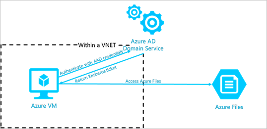

# Overview of Azure Files Azure Active Directory Domain Service (AAD DS) Authentication Support for SMB Access (Preview)
[!INCLUDE [storage-files-aad-auth-include](../../../includes/storage-files-aad-auth-include.md)]

To learn how to enable AAD DS authentication for Azure Files, see [Enable Azure Active Directory Domain Service Authentication over SMB for Azure Files (Preview)](storage-files-active-directory-enable.md).

## Glossary 
It's helpful to understand some key terms relating to Azure AD Domain Service authentication over SMB for Azure Files:

-   **Azure Active Directory (Azure AD)**  
    Azure Active Directory (Azure AD) is Microsoft’s multi-tenant cloud-based directory and identity management service. Azure AD combines core directory services, application access management, and identity protection into a single solution. For more information, see [What is Azure Active Directory?](../../active-directory/fundamentals/active-directory-whatis.md)

-   **Azure AD Domain Services**  
    Azure AD Domain Services provides managed domain services such as domain join, group policies, LDAP, and Kerberos/NTLM authentication. These services are fully
    compatible with Windows Server Active Directory. For more information, see [Azure Active Directory (AD) Domain Services](../../active-directory-domain-services/overview.md).

-   **Azure Role Based Access Control (RBAC)**  
    Azure Role-Based Access Control (RBAC) enables fine-grained access management for Azure. Using RBAC, you can manage access to resources by granting users the fewest permissions needed to perform their jobs. For more information on RBAC, see [What is role-based access control (RBAC) in Azure?](../../role-based-access-control/overview.md)

-   **Kerberos authentication**

    Kerberos is an authentication protocol that is used to verify the identity of a user or host. For more information on Kerberos, see [Kerberos Authentication Overview](https://docs.microsoft.com/windows-server/security/kerberos/kerberos-authentication-overview).

-  **Server Message Block (SMB) protocol**  
    SMB is an industry-standard network file-sharing protocol. SMB is also known as Common Internet File System or CIFS. For more information on SMB, see [Microsoft SMB Protocol and CIFS Protocol Overview](https://docs.microsoft.com/windows/desktop/FileIO/microsoft-smb-protocol-and-cifs-protocol-overview).

## Advantages of Azure AD Domain Service authentication
Azure AD Domain Service authentication for Azure Files offers several benefits over using Shared Key authentication:

-   **Extend the traditional identity-based file share access experience to the cloud with Azure AD and Azure AD Domain Service**  
    If you plan to "lift and shift" your application to the cloud, replacing traditional file servers with Azure Files, then you may want your application to authenticate with Azure AD credentials to access file data. Azure Files supports using Azure AD credentials to access Azure Files over SMB from AAD DS domain-joined Windows VMs. You can also choose to sync all of your on-premises Active Directory objects to Azure AD to preserve usernames, passwords, and other group assignments.

-   **Enforce granular access control on Azure file shares**  
    You can grant permissions to a specific identity at the share, directory, or file level. For example, suppose that you have several teams using a single Azure file share for project collaboration. You can grant all teams access to non-sensitive directories, while limiting access to directories containing sensitive financial data to your Finance team only. 

-   **Back up ACLs along with your data**  
    You can use Azure Files to back up your existing on-premises file shares. Azure Files preserves your ACLs along with your data when you back up a file share to Azure Files over SMB.

## How it works
Azure Files uses Azure AD Domain Services to support Kerberos authentication with Azure AD credentials from domain-joined VMs. Before you can use Azure AD with Azure Files, you must first enable Azure AD Domain Services and join the domain from the VMs from which you plan to access file data. Your domain-joined VM must reside in the same virtual network (VNET) as Azure AD Domain Services. 

When an identity associated with an application running on a VM attempts to access data in Azure Files, the request is sent to Azure AD Domain Services to authenticate the identity. If authentication is successful, Azure AD Domain Services returns a Kerberos token. The application sends a request that includes the Kerberos token, and Azure Files uses that token to authorize the request. Azure Files receives the token only and does not persist Azure AD credentials.

### Enable Azure AD Domain Service authentication for SMB access
You can enable Azure AD Domain Service authentication for Azure Files on your new and existing storage accounts created after September 24, 2018. 

Before enabling this feature, verify that Azure AD Domain Services has been deployed for the primary Azure AD tenant with which your storage account is associated. If you have not yet set up Azure AD Domain Services, follow the step-by-step guidance provided in [Enable Azure Active Directory Domain Services using the Azure portal](../../active-directory-domain-services/create-instance.md).

Azure AD Domain Services deployment generally takes 10 to 15 minutes. After Azure AD Domain Services has been deployed, you can enable Azure AD authentication over SMB for Azure Files. For more information, see [Enable Azure Active Directory Domain Service authentication over SMB for Azure Files (Preview)](storage-files-active-directory-enable.md). 

### Configure share-level permissions for Azure Files
Once Azure AD Domain Service authentication has been enabled, you can configure custom RBAC roles for Azure AD identities and assign access rights to any file shares in the storage account.

When an application running on a domain-joined VM tries to mount an Azure file share or access a directory or file, the application's Azure AD credentials are verified to ensure the proper share-level permissions and NTFS permissions. For information about configuring share-level permissions, see [Enable Azure Active Directory Domain Service authentication over SMB (Preview)](storage-files-active-directory-enable.md).

### Configure directory- or file-level permissions for Azure Files 
Azure Files enforces standard NTFS file permissions at the directory and file level, including at the root directory. Configuration of directory- or file-level permissions is supported over SMB only. Mount the target file share from your VM and configure permissions using the Windows
[icacls](https://docs.microsoft.com/windows-server/administration/windows-commands/icacls) or [Set-ACL](https://docs.microsoft.com/powershell/module/microsoft.powershell.security/get-acl) command. 

> [!NOTE]
> Configuring NTFS permissions through Windows File Explorer is not supported in the preview.

### Use the storage account key for superuser permissions 
A user possessing the storage account key can access Azure Files with superuser permissions. Superuser permissions surpass all access control restrictions configured at the share level with RBAC and enforced by Azure AD. Superuser permissions are required to mount an Azure file share. 

> [!IMPORTANT]
> As part of best practices for security, avoid sharing your storage account keys, and leverage Azure AD permissions whenever possible.

### Preserve directory and file ACLs for data import to Azure file shares
Azure Files now supports preserving directory or file ACLs when you copy data to Azure file shares. You can copy the ACLs on a directory or file to Azure Files. For example, you can use [robocopy](https://docs.microsoft.com/windows-server/administration/windows-commands/robocopy) with flag `/copy:s` to copy both data and ACLs to an Azure file share. ACL preservation is on by default and you don't need to explicitly enable Azure AD Domain Service authentication feature on your storage account. 

## Pricing
There is no additional service charge to enable Azure AD authentication over SMB on your storage account. For more information on pricing, see [Azure Files pricing](https://azure.microsoft.com/pricing/details/storage/files/) and [Azure AD Domain Services pricing](https://azure.microsoft.com/pricing/details/active-directory-ds/) pages.

## Next Steps
For more information about Azure Files and Azure AD authentication over SMB, see these resources:

- [Introduction to Azure Files](storage-files-introduction.md)
- [Enable Azure Active Directory authentication over SMB for Azure Files (Preview)](storage-files-active-directory-enable.md)
- [FAQ](storage-files-faq.md)
