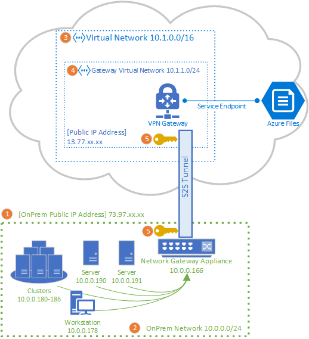
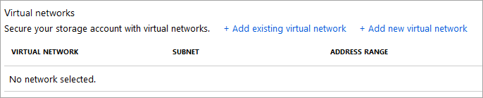

# Configure a Site-to-Site VPN for use with Azure Files
You can use a Site-to-Site (S2S) VPN connection to mount your Azure file shares over SMB from your on-premises network, without opening up port 445. You can set up a Site-to-Site VPN using [Azure VPN Gateway](../../vpn-gateway/vpn-gateway-about-vpngateways.md), which is an Azure resource offering VPN services, and is deployed in a resource group alongside storage accounts or other Azure resources.

We strongly recommend that you read [Azure Files networking overview](storage-files-networking-overview.md) before continuing with this how to article for a complete discussion of the networking options available for Azure Files.

The article details the steps to configure a Site-to-Site VPN to mount Azure file shares directly on-premises. If you're looking to route sync traffic for Azure File Sync over a Site-to-Site VPN, please see [configuring Azure File Sync proxy and firewall settings](storage-sync-files-firewall-and-proxy.md).

## Prerequisites
- An Azure file share you would like to mount on-premises. Azure file shares are deployed within storage accounts, which are management constructs that represent a shared pool of storage in which you can deploy multiple file shares, as well as other storage resources, such as blob containers or queues. You can learn more about how to deploy Azure file shares and storage accounts in [Create an Azure file share](storage-how-to-create-file-share.md).

- A private endpoint for the storage account containing the Azure file share you want to mount on-premises. To learn more about how to create a private endpoint, see [Configuring Azure Files network endpoints](storage-files-networking-endpoints.md?tabs=azure-portal). 

- A network appliance or server in your on-premises datacenter that is compatible with Azure VPN Gateway. Azure Files is agnostic of the on-premises network appliance chosen but Azure VPN Gateway maintains a [list of tested devices](../../vpn-gateway/vpn-gateway-about-vpn-devices.md). Different network appliances offer different features, performance characteristics, and management functionalities, so consider these when selecting a network appliance.

    If you do not have an existing network appliance, Windows Server contains a built-in Server Role, Routing and Remote Access (RRAS), which may be used as the on-premises network appliance. To learn more about how to configure Routing and Remote Access in Windows Server, see [RAS Gateway](https://docs.microsoft.com/windows-server/remote/remote-access/ras-gateway/ras-gateway).

## Add storage account to VNet
In the Azure portal, navigate to the storage account containing the Azure file share you would like to mount on-premises. In the table of contents for the storage account, select the **Firewalls and virtual networks** entry. Unless you added a virtual network to your storage account when you created it, the resulting pane should have the **Allow access from** radio button for **All networks** selected.

To add your storage account to the desired virtual network, select **Selected networks**. Under the **Virtual networks** subheading, click either **+ Add existing virtual network** or **+Add new virtual network** depending on the desired state. Creating a new virtual network will result in a new Azure resource being created. The new or existing VNet resource does not need to be in the same resource group or subscription as the storage account, however it must be in the same region as the storage account and the resource group and subscription you deploy your VNet into must match the one you will deploy your VPN Gateway into. 

If you add existing virtual network, you will be asked to select one or more subnets of that virtual network which the storage account should be added to. If you select a new virtual network, you will create a subnet as part of the creation of the virtual network, and you can add more later through the resulting Azure resource for the virtual network.

If you have not added a storage account to your subscription before, the Microsoft.Storage service endpoint will need to be added to the virtual network. This may take some time, and until this operation has completed, you will not be able to access the Azure file shares within that storage account, including via the VPN connection. 

## Deploy an Azure VPN Gateway
In the table of contents for the Azure portal, select **Create a new resource** and search for *Virtual network gateway*. Your virtual network gateway must be in the same subscription, Azure region, and resource group as the virtual network you deployed in the previous step (note that resource group is automatically selected when the virtual network is picked). 

For the purposes of deploying an Azure VPN Gateway, you must populate the following fields:

- **Name**: The name of the Azure resource for the VPN Gateway. This name may be any name you find useful for your management.
- **Region**: The region into which the VPN Gateway will be deployed.
- **Gateway type**: For the purpose of deploying a Site-to-Site VPN, you must select **VPN**.
- **VPN type**: You may choose either *Route-based** or **Policy-based** depending on your VPN device. Route-based VPNs support IKEv2, while policy-based VPNs only support IKEv1. To learn more about the two types of VPN gateways, see [About policy-based and route-based VPN gateways](../../vpn-gateway/vpn-gateway-connect-multiple-policybased-rm-ps.md#about)
- **SKU**: The SKU controls the number of allowed Site-to-Site tunnels and desired performance of the VPN. To select the appropriate SKU for your use case, consult the [Gateway SKU](../../vpn-gateway/vpn-gateway-about-vpngateways.md#gwsku) listing. The SKU of the VPN Gateway may be changed later if necessary.
- **Virtual network**: The virtual network you created in the previous step.
- **Public IP address**: The IP address of VPN Gateway that will be exposed to the internet. Likely, you will need to create a new IP address, however you may also use an existing unused IP address if that is appropriate. If you select to **Create new**, a new IP address Azure resource will be created in the same resource group as the VPN Gateway and the  **Public IP address name** will be the name of the newly created IP address. If you select **Use existing**, you must select the existing unused IP address.
- **Enable active-active mode**: Only select **Enabled** if you are creating an active-active gateway configuration, otherwise leave **Disabled** selected. To learn more about active-active mode, see [Highly available cross-premises and VNet-to-VNet connectivity](../../vpn-gateway/vpn-gateway-highlyavailable.md).
- **Configure BGP ASN**: Only select **Enabled** if your configuration specifically requires this setting. To learn more about this setting, see [About BGP with Azure VPN Gateway](../../vpn-gateway/vpn-gateway-bgp-overview.md).

Select **Review + create** to create the VPN Gateway. A VPN Gateway may take up to 45 minutes to fully create and deploy.

### Create a local network gateway for your on-premises gateway 
A local network gateway is an Azure resource that represents your on-premises network appliance. In the table of contents for the Azure portal, select **Create a new resource** and search for *local network gateway*. The local network gateway is an Azure resource that will be deployed alongside your storage account, virtual network, and VPN Gateway, but does not need to be in the same resource group or subscription as the storage account. 

For the purposes of deploying the local network gateway resource, you must populate the following fields:

- **Name**: The name of the Azure resource for the local network gateway. This name may be any name you find useful for your management.
- **IP address**: The public IP address of your local gateway on-premises.
- **Address space**: The address ranges for the network this local network gateway represents. You can add multiple address space ranges, but make sure that the ranges you specify here do not overlap with ranges of other networks that you want to connect to. 
- **Configure BGP settings**: Only configure BGP settings if your configuration requires this setting. To learn more about this setting, see [About BGP with Azure VPN Gateway](../../vpn-gateway/vpn-gateway-bgp-overview.md).
- **Subscription**: The desired subscription. This does not need to match the subscription used for the VPN Gateway or the storage account.
- **Resource group**: The desired resource group. This does not need to match the resource group used for the VPN Gateway or the storage account.
- **Location**: The Azure Region the local network gateway resource should be created in. This should match the region you selected for the VPN Gateway and the storage account.

Select **Create** to create the local network gateway resource.  

## Configure on-premises network appliance
The specific steps to configure your on-premises network appliance depend based on the network appliance your organization has selected. Depending on the device your organization has chosen, the [list of tested devices](../../vpn-gateway/vpn-gateway-about-vpn-devices.md) may have a link out to your device vendor's instructions for configuring with Azure VPN Gateway.

## Create the Site-to-Site connection
To complete the deployment of a S2S VPN, you must create a connection between your on-premises network appliance (represented by the local network gateway resource) and the VPN Gateway. To do this, navigate to the VPN Gateway you created above. In the table of contents for the VPN Gateway, select **Connections**, and click **Add**. The resulting **Add connection** pane requires the following fields:

- **Name**: The name of the connection. A VPN Gateway can host multiple connections, so pick a name helpful for your management that will distinguish this particular connection.
- **Connection type**: Since this a S2S connection, select **Site-to-site (IPSec)** in the drop-down list.
- **Virtual network gateway**: This field is auto-selected to the VPN Gateway you're making the connection to and can't be changed.
- **Local network gateway**: This is the local network gateway you want to connect to your VPN Gateway. The resulting selection pane should have the name of the local network gateway you created above.
- **Shared key (PSK)**: A mixture of letters and numbers, used to establish encryption for the connection. The same shared key must be used in both the virtual network and local network gateways. If your gateway device doesn't provide one, you can make one up here and provide it to your device.

Select **OK** to create the connection. You can verify the connection has been made successfully through the **Connections** page.

## Mount Azure file share 
The final step in configuring a S2S VPN is verifying that it works for Azure Files. You can do this by mounting your Azure file share on-premises with your preferred OS. See the instructions to mount by OS here:

- [Windows](storage-how-to-use-files-windows.md)
- [macOS](storage-how-to-use-files-mac.md)
- [Linux](storage-how-to-use-files-linux.md)

## See also
- [Azure Files networking overview](storage-files-networking-overview.md)
- [Configure a Point-to-Site (P2S) VPN on Windows for use with Azure Files](storage-files-configure-p2s-vpn-windows.md)
- [Configure a Point-to-Site (P2S) VPN on Linux for use with Azure Files](storage-files-configure-p2s-vpn-linux.md)