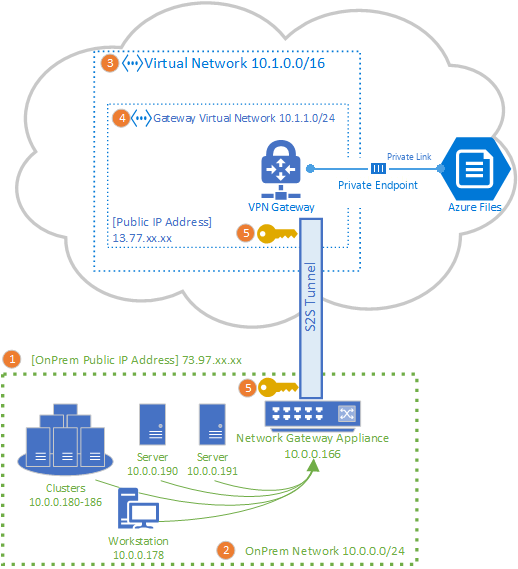

# Configure a site-to-site VPN for use with Azure Files

:heavy_check_mark: **Applies to:** Classic SMB and NFS file shares created with the Microsoft.Storage resource provider

:heavy_multiplication_x: **Doesn't apply to:** File shares created with the Microsoft.FileShares resource provider (preview)

You can use a site-to-site VPN connection to mount your Azure file shares from your on-premises network, without sending data over the open internet. You can set up a site-to-site VPN using [Azure VPN Gateway](../../vpn-gateway/vpn-gateway-about-vpngateways.md), which is an Azure resource offering VPN services. You deploy VPN Gateway in a resource group alongside storage accounts or other Azure resources.



We strongly recommend that you read [Azure Files networking overview](storage-files-networking-overview.md) before continuing with this article for a complete discussion of the networking options available for Azure Files.

The article details the steps to configure a site-to-site VPN to mount Azure file shares directly on-premises. If you're looking to route sync traffic for Azure File Sync over a site-to-site VPN, see [configuring Azure File Sync proxy and firewall settings](../file-sync/file-sync-firewall-and-proxy.md).

## Prerequisites

- An Azure file share you would like to mount on-premises. Azure file shares are deployed within storage accounts, which are management constructs that represent a shared pool of storage in which you can deploy multiple file shares, as well as other storage resources, such as blobs or queues. You can learn more about how to deploy Azure file shares and storage accounts in [Create an Azure file share](storage-how-to-create-file-share.md).

- A private endpoint for the storage account deployed in the virtual network you'll use for VPN Gateway. A private endpoint assigns the storage account a private IP address from within your virtual network address space, enabling on-premises clients to access Azure Files through the VPN tunnel. To learn how to create a private endpoint, see [Configuring Azure Files network endpoints](storage-files-networking-endpoints.md).

- A network appliance or server in your on-premises data center that's compatible with Azure VPN Gateway. Azure Files is agnostic of the on-premises network appliance chosen, but Azure VPN Gateway maintains a [list of tested devices](../../vpn-gateway/vpn-gateway-about-vpn-devices.md). Different network appliances offer different features, performance characteristics, and management functionalities, so consider these when selecting a network appliance.

If you don't have an existing network appliance, Windows Server contains a built-in Server Role, Routing and Remote Access (RRAS), which can be used as the on-premises network appliance. To learn more about how to configure Routing and Remote Access in Windows Server, see [RAS Gateway](/windows-server/remote/remote-access/ras-gateway/ras-gateway).

## Configure virtual network and network access

To configure a new or existing virtual network and restrict storage account access, follow these steps.

# [Portal](#tab/azure-portal)

1. Sign in to the Azure portal and navigate to the storage account containing the Azure file share you would like to mount on-premises.

1. In the service menu, under **Security + networking**, select **Networking**. Unless you added a virtual network to your storage account when you created it, the resulting pane should have the radio button for **Enabled from all networks** selected under **Public network access**.

1. To restrict storage account access to specific virtual networks, select the **Enabled from selected virtual networks and IP addresses** radio button. Under the **Virtual networks** subheading, select either **+ Add existing virtual network** or **+ Add new virtual network**. Creating a new virtual network will result in a new Azure resource being created. The new or existing virtual network resource must be in the same region as the storage account, but it doesn't need to be in the same resource group or subscription. However, keep in mind that the resource group, region, and subscription you deploy your virtual network into must match where you deploy your virtual network gateway in the next step.

   :::image type="content" source="media/storage-files-configure-s2s-vpn/add-virtual-network.png" alt-text="Screenshot of the Azure portal giving the option to add an existing or new virtual network to the storage account.":::

   If you add an existing virtual network, you must first create a [gateway subnet](../../vpn-gateway/vpn-gateway-about-vpn-gateway-settings.md#gwsub) on the virtual network. You'll be asked to select one or more subnets of that virtual network. If you create a new virtual network, you'll create a subnet as part of the creation process. You can add more subnets later through the resulting Azure resource for the virtual network.

1. Select **Save** at the top of the page.

# [Azure PowerShell](#tab/azure-powershell)

1. Sign in to Azure.

   ```azurepowershell-interactive
   Connect-AzAccount
   ```

1. If you want to add a new virtual network and gateway subnet, run the following script. If you have an existing virtual network that you want to use, then skip this step and proceed to step 3. Be sure to replace `<your-subscription-id>`, `<resource-group>`, and `<storage-account-name>` with your own values. If desired, provide your own values for `$location` and `$vnetName`. The `-AddressPrefix` parameter defines the IP address blocks for the virtual network and the subnet, so replace those with your respective values.

   ```azurepowershell-interactive
   # Select subscription  
   $subscriptionId = "<your-subscription-id>"
   Select-AzSubscription -SubscriptionId $subscriptionId

   # Define parameters
   $storageAccount = "<storage-account-name>"
   $resourceGroup = "<resource-group>"
   $location = "East US" # Change to desired Azure region
   $vnetName = "myVNet"
   # Virtual network gateway can only be created in subnet with name 'GatewaySubnet'.
   $subnetName = "GatewaySubnet"
   $vnetAddressPrefix = "10.0.0.0/16" # Update this address as per your requirements
   $subnetAddressPrefix = "10.0.0.0/24" # Update this address as per your requirements
   
   # Set current storage account
   Set-AzCurrentStorageAccount -ResourceGroupName $resourceGroup -Name $storageAccount

   # Define subnet configuration  
   $subnetConfig = New-AzVirtualNetworkSubnetConfig -Name $subnetName -AddressPrefix $subnetAddressPrefix
     
   # Create a virtual network  
   New-AzVirtualNetwork -Name $vnetName -ResourceGroupName $resourceGroup -Location $location -AddressPrefix $vnetAddressPrefix -Subnet $subnetConfig  
   ```

1. If you created a new virtual network and subnet in the previous step, then skip this step. If you have an existing virtual network you want to use, you must first create a [gateway subnet](../../vpn-gateway/vpn-gateway-about-vpn-gateway-settings.md#gwsub) on the virtual network before you can deploy a virtual network gateway.

   To add a gateway subnet to an existing virtual network, run the following script. Be sure to replace `<your-subscription-id>`, `<resource-group>`, and `<virtual-network-name>` with your own values. The `$subnetAddressPrefix` parameter defines the IP address block for the subnet, so replace the IP address per your requirements.

   ```azurepowershell-interactive
   # Select subscription  
   $subscriptionId = "<your-subscription-id>"
   Select-AzSubscription -SubscriptionId $subscriptionId

   # Define parameters
   $storageAccount = "<storage-account-name>"
   $resourceGroup = "<resource-group>"
   $vnetName = "<virtual-network-name>"
   # Virtual network gateway can only be created in subnet with name 'GatewaySubnet'.
   $subnetName = "GatewaySubnet"
   $subnetAddressPrefix = "10.0.0.0/24" # Update this address as per your requirements

   # Set current storage account
   Set-AzCurrentStorageAccount -ResourceGroupName $resourceGroup -Name $storageAccount

   # Get the virtual network
   $vnet = Get-AzVirtualNetwork -Name $vnetName -ResourceGroupName $resourceGroup
     
   # Add the gateway subnet
   Add-AzVirtualNetworkSubnetConfig -Name $subnetName -VirtualNetwork $vnet -AddressPrefix $subnetAddressPrefix
     
   # Apply the configuration to the virtual network
   Set-AzVirtualNetwork -VirtualNetwork $vnet
   ```

1. To allow traffic only from specific virtual networks, use the `Update-AzStorageAccountNetworkRuleSet` command and set the `-DefaultAction` parameter to Deny.

   ```azurepowershell-interactive
   Update-AzStorageAccountNetworkRuleSet -ResourceGroupName $resourceGroup -Name $storageAccount -DefaultAction Deny
   ```
   
1. Add a network rule for the virtual network and subnet.

   ```azurepowershell-interactive
   $subnet = Get-AzVirtualNetwork -ResourceGroupName $resourceGroup -Name $vnetName | Get-AzVirtualNetworkSubnetConfig -Name $subnetName
   Add-AzStorageAccountNetworkRule -ResourceGroupName $resourceGroup -Name $storageAccount -VirtualNetworkResourceId $subnet.Id
   ```

# [Azure CLI](#tab/azure-cli)

1. Sign in to Azure.

   ```azurecli-interactive
   az login
   ```

1. If you want to add a new virtual network and gateway subnet, run the following script. If you have an existing virtual network that you want to use, then skip this step and proceed to step 3. Be sure to replace `<your-subscription-id>`, `<storage-account-name>`, and `<resource-group>` with your own values. Replace `<virtual-network-name>` with the name of the new virtual network you want to create. The `--address-prefix` and `--subnet-prefixes` parameters define the IP address blocks for the virtual network and the subnet, so replace those with your respective values. The virtual network will be created in the same region as the resource group.

   ```azurecli-interactive
   # Set your subscription  
   az account set --subscription "<your-subscription-id>"  
     
   # Define parameters
   storageAccount="<storage-account-name>"
   resourceGroup="<resource-group>"
   vnetName="<virtual-network-name>"
   # Virtual network gateway can only be created in subnet with name 'GatewaySubnet'.
   subnetName="GatewaySubnet"
   vnetAddressPrefix="10.0.0.0/16" # Update this address per your requirements
   subnetAddressPrefix="10.0.0.0/24" # Update this address per your requirements

   # Create a virtual network and subnet
   az network vnet create \
     --resource-group $resourceGroup \
     --name $vnetName \
     --address-prefix $vnetAddressPrefix \
     --subnet-name $subnetName \
     --subnet-prefixes $subnetAddressPrefix  
   ```

1. If you created a new virtual network and subnet in the previous step, then skip this step. If you have an existing virtual network you want to use, you must first create a [gateway subnet](../../vpn-gateway/vpn-gateway-about-vpn-gateway-settings.md#gwsub) on the virtual network before you can deploy a virtual network gateway.

   To add a gateway subnet to an existing virtual network, run the following script. Be sure to replace `<your-subscription-id>`, `<resource-group>`, and `<virtual-network-name>` with your own values. The `--address-prefixes` parameter defines the IP address block for the subnet, so replace the IP address block as needed.

   ```azurecli-interactive
   # Set your subscription  
   az account set --subscription "<your-subscription-id>"

   # Define parameters
   storageAccount="<storage-account-name>"
   resourceGroup="<resource-group>"
   vnetName="<virtual-network-name>"
   # Virtual network gateway can only be created in subnet with name 'GatewaySubnet'.
   subnetName="GatewaySubnet"
   subnetAddressPrefix="10.0.0.0/24" # Update this address per your requirements
   
   # Create the gateway subnet
   az network vnet subnet create \
     --resource-group $resourceGroup \
     --vnet-name $vnetName \
     --name $subnetName \
     --address-prefixes $subnetAddressPrefix
   ```

1. To allow traffic only from specific virtual networks, use the `az storage account update` command and set the `--default-action` parameter to Deny.

   ```azurecli-interactive
   az storage account update --resource-group $resourceGroup --name $storageAccount --default-action Deny
   ```
   
1. Add a network rule for the virtual network and subnet.

   ```azurecli-interactive
   subnetid=$(az network vnet subnet show --resource-group $resourceGroup --vnet-name $vnetName --name $subnetName --query id --output tsv)
   az storage account network-rule add --resource-group $resourceGroup --account-name $storageAccount --subnet $subnetid
   ```

---

## Create a private endpoint for the storage account

A private endpoint assigns your storage account a private IP address from within your virtual network's address space. When on-premises clients connected through the VPN tunnel resolve the storage account's fully qualified domain name (FQDN), the name resolves to the private IP address instead of the public IP, and traffic routes through the tunnel.

Without a private endpoint, `storageaccount.file.core.windows.net` resolves to the storage account's public IP address, and on-premises routing tables send traffic directly over the internet, bypassing the VPN tunnel entirely.

# [Portal](#tab/azure-portal)

1. Navigate to the storage account in the Azure portal. In the service menu, under **Security + networking**, select **Networking**, and then select the **Private endpoint connections** tab.

1. Select **+ Private endpoint**.

1. On the **Basics** tab, select the subscription, resource group, and region. Give the private endpoint a name.

1. On the **Resource** tab, select **Microsoft.Storage/storageAccounts** as the resource type. Select your storage account as the resource, and **file** as the target sub-resource.

1. On the **Virtual Network** tab, select the virtual network and subnet where you want to place the private endpoint. This should be a subnet within the virtual network you configured in the previous section (not the GatewaySubnet).

1. On the **DNS** tab, select **Yes** for **Integrate with private DNS zone**. This creates a `privatelink.file.core.windows.net` private DNS zone linked to your virtual network, which is required for the storage account's FQDN to resolve to the private IP address.

1. Select **Review + create**, then **Create**.

# [Azure PowerShell](#tab/azure-powershell)

```azurepowershell-interactive
# Define parameters (reuse values from the previous section)
$privateEndpointName = "myStoragePrivateEndpoint"
$privateDnsZoneName = "privatelink.file.core.windows.net"

# Get the storage account resource ID
$storageAccountId = (Get-AzStorageAccount -ResourceGroupName $resourceGroup -Name $storageAccount).Id

# Get the virtual network and a non-gateway subnet
$vnet = Get-AzVirtualNetwork -Name $vnetName -ResourceGroupName $resourceGroup

# If you don't have a non-gateway subnet, create one
$vnet | Add-AzVirtualNetworkSubnetConfig -Name "PrivateEndpointSubnet" -AddressPrefix "10.0.1.0/24" | Set-AzVirtualNetwork
$vnet = Get-AzVirtualNetwork -Name $vnetName -ResourceGroupName $resourceGroup
$peSubnet = Get-AzVirtualNetworkSubnetConfig -Name "PrivateEndpointSubnet" -VirtualNetwork $vnet

# Create private link service connection
$plsConnection = New-AzPrivateLinkServiceConnection `
    -Name "myStoragePLS" `
    -PrivateLinkServiceId $storageAccountId `
    -GroupId "file"

# Create the private endpoint
$privateEndpoint = New-AzPrivateEndpoint `
    -Name $privateEndpointName `
    -ResourceGroupName $resourceGroup `
    -Location $location `
    -Subnet $peSubnet `
    -PrivateLinkServiceConnection $plsConnection

# Create the private DNS zone
$privateDnsZone = New-AzPrivateDnsZone `
    -ResourceGroupName $resourceGroup `
    -Name $privateDnsZoneName

# Link the private DNS zone to the virtual network
New-AzPrivateDnsVirtualNetworkLink `
    -ResourceGroupName $resourceGroup `
    -ZoneName $privateDnsZoneName `
    -Name "myDnsLink" `
    -VirtualNetworkId $vnet.Id

# Create DNS zone group for automatic DNS record management
New-AzPrivateDnsZoneGroup `
    -ResourceGroupName $resourceGroup `
    -PrivateEndpointName $privateEndpointName `
    -Name "myZoneGroup" `
    -PrivateDnsZoneId $privateDnsZone.ResourceId
```

# [Azure CLI](#tab/azure-cli)

```azurecli-interactive
# Define parameters (reuse values from the previous section)
privateEndpointName="myStoragePrivateEndpoint"
privateDnsZoneName="privatelink.file.core.windows.net"

# Get the storage account resource ID
storageAccountId=$(az storage account show --resource-group $resourceGroup --name $storageAccount --query id --output tsv)

# If you don't have a non-gateway subnet, create one
az network vnet subnet create \
    --resource-group $resourceGroup \
    --vnet-name $vnetName \
    --name PrivateEndpointSubnet \
    --address-prefixes "10.0.1.0/24"

# Create the private endpoint
az network private-endpoint create \
    --resource-group $resourceGroup \
    --name $privateEndpointName \
    --vnet-name $vnetName \
    --subnet PrivateEndpointSubnet \
    --private-connection-resource-id $storageAccountId \
    --group-ids file \
    --connection-name myStoragePLS

# Create the private DNS zone
az network private-dns zone create \
    --resource-group $resourceGroup \
    --name $privateDnsZoneName

# Link the private DNS zone to the virtual network
az network private-dns link vnet create \
    --resource-group $resourceGroup \
    --zone-name $privateDnsZoneName \
    --name myDnsLink \
    --virtual-network $vnetName \
    --registration-enabled false

# Create DNS zone group for automatic DNS record management
az network private-endpoint dns-zone-group create \
    --resource-group $resourceGroup \
    --endpoint-name $privateEndpointName \
    --name myZoneGroup \
    --private-dns-zone $privateDnsZoneName \
    --zone-name file
```

---

## Deploy a virtual network gateway

To deploy a virtual network gateway, follow these steps.

# [Portal](#tab/azure-portal)

1. In the search box at the top of the Azure portal, search for and then select *Virtual network gateways*. The **Virtual network gateways** page should appear. At the top of the page, select **+ Create**.

1. On the **Basics** tab, fill in the values for **Project details** and **Instance details**. Your virtual network gateway must be in the same subscription, Azure region, and resource group as the virtual network.

   :::image type="content" source="media/storage-files-configure-s2s-vpn/create-virtual-network-gateway.png" alt-text="Screenshot showing how to create a virtual network gateway using the Azure portal.":::

   - **Subscription**: Select the subscription you want to use from the dropdown.
   - **Resource Group**: This setting is autofilled when you select your virtual network on this page.
   - **Name**: Name your virtual network gateway. Naming your gateway isn't the same as naming a gateway subnet. It's the name of the virtual network gateway object you're creating.
   - **Region**: Select the region in which you want to create this resource. The region for the virtual network gateway must be the same as the virtual network.
   - **Gateway type**: Select **VPN**. VPN gateways use the virtual network gateway type **VPN**.
   - **SKU**: Select the gateway SKU that supports the features you want to use from the dropdown. The SKU controls the number of allowed Site-to-Site tunnels and desired performance of the VPN. See [Gateway SKUs](../../vpn-gateway/vpn-gateway-about-vpn-gateway-settings.md#gwsku). Don't use the Basic SKU if you want to use IKEv2 authentication (route-based VPN).
   - **Generation**: Select the generation you want to use. We recommend using a Generation2 SKU. For more information, see [Gateway SKUs](../../vpn-gateway/vpn-gateway-about-vpngateways.md#gwsku).
   - **Virtual network**: From the dropdown, select the virtual network you configured in the previous step.
   - **Subnet**: This field should be grayed out and list the name of the gateway subnet you created, along with its IP address range. If you instead see a **Gateway subnet address range** field with a text box, then you haven't yet configured a gateway subnet on the virtual network.

1. Specify the values for the **Public IP address** that gets associated to the virtual network gateway. The public IP address is assigned to this object when the virtual network gateway is created. The only time the primary public IP address changes is when the gateway is deleted and re-created. It doesn't change across resizing, resetting, or other internal maintenance/upgrades.

   :::image type="content" source="media/storage-files-configure-s2s-vpn/create-public-ip-address.png" alt-text="Screenshot showing how to specify the public IP address for a virtual network gateway using the Azure portal.":::

   - **Public IP address**: The IP address of the virtual network gateway that will be exposed to the internet. Likely, you'll need to create a new IP address, however you may also use an existing unused IP address. If you select **Create new**, a new IP address Azure resource will be created in the same resource group as the virtual network gateway, and the **Public IP address name** will be the name of the newly created IP address. If you select **Use existing**, you must select the existing unused IP address.
   - **Public IP address name**: In the text box, type a name for your public IP address instance.
   - **Public IP address SKU**: Setting is autoselected.
   - **Assignment**: The assignment is typically autoselected and can be either Dynamic or Static.
   - **Enable active-active mode**: Select **Disabled**. Only enable this setting if you're creating an active-active gateway configuration. To learn more about active-active mode, see [Highly available cross-premises and VNet-to-VNet connectivity](../../vpn-gateway/vpn-gateway-highlyavailable.md).
   - **Configure BGP**: Select **Disabled**, unless your configuration specifically requires Border Gateway Protocol. If you do require this setting, the default ASN is 65515, although this value can be changed. To learn more about this setting, see [About BGP with Azure VPN Gateway](../../vpn-gateway/vpn-gateway-bgp-overview.md).

1. Select **Review + create** to run validation. Once validation passes, select **Create** to deploy the virtual network gateway. Deployment can take up to 45 minutes to complete.

# [Azure PowerShell](#tab/azure-powershell)

1. First, request a public IP address. If you have an existing unused IP address that you want to use, you can skip this step. Replace `<resource-group>` with your resource group name, and specify the same Azure region that you used for your virtual network.

   ```azurepowershell-interactive
   $gwpip = New-AzPublicIpAddress -Name "mypublicip" -ResourceGroupName "<resource-group>" -Location "East US" -AllocationMethod Static -Sku Standard
   ```

1. Next, create the gateway IP address configuration by defining the subnet and the public IP address to use. The public IP address of the VPN gateway will be exposed to the internet. Replace `<virtual-network-name>` and `<resource-group>` with your own values.

   ```azurepowershell-interactive
   $vnet = Get-AzVirtualNetwork -Name <virtual-network-name> -ResourceGroupName <resource-group>
   $subnet = Get-AzVirtualNetworkSubnetConfig -Name "GatewaySubnet" -VirtualNetwork $vnet
   $gwipconfig = New-AzVirtualNetworkGatewayIpConfig -Name gwipconfig -SubnetId $subnet.Id -PublicIpAddressId $gwpip.Id
   ```

1. Run the following script to create the VPN gateway.

   Replace `<resource-group>` with the same resource group as your virtual network. Specify the [gateway SKU](../../vpn-gateway/vpn-gateway-about-vpn-gateway-settings.md#gwsku) that supports the features you want to use. The gateway SKU controls the number of allowed Site-to-Site tunnels and desired performance of the VPN. We recommend using a Generation 2 SKU. Don't use the Basic SKU if you want to use IKEv2 authentication (route-based VPN).

   ```azurepowershell-interactive
   New-AzVirtualNetworkGateway -Name MyVnetGateway -ResourceGroupName <resource-group> -Location "East US" -IpConfigurations $gwipconfig -GatewayType "Vpn" -VpnType RouteBased -GatewaySku VpnGw2 -VpnGatewayGeneration Generation2
   ```

   You can also choose to include other features like [Border Gateway Protocol (BGP)](../../vpn-gateway/vpn-gateway-bgp-overview.md) and [Active-Active](../../vpn-gateway/vpn-gateway-highlyavailable.md). See the documentation for the [New-AzVirtualNetworkGateway](/powershell/module/az.network/new-azvirtualnetworkgateway) cmdlet. If you do require BGP, the default ASN is 65515, although this value can be changed.

1. Creating a gateway can take 45 minutes or more, depending on the gateway SKU you specified. You can view the VPN gateway using the [Get-AzVirtualNetworkGateway](/powershell/module/az.network/Get-azVirtualNetworkGateway) cmdlet.

   ```azurepowershell-interactive
   Get-AzVirtualNetworkGateway -Name MyVnetGateway -ResourceGroup <resource-group>
   ```

# [Azure CLI](#tab/azure-cli)

1. First, request a public IP address. If you have an existing unused IP address that you want to use, you can skip this step. Replace `<resource-group>` with your resource group name.

   ```azurecli-interactive
   az network public-ip create -n mypublicip -g <resource-group>
   ```

1. Run the following script to create the VPN gateway. Creating a gateway can take 45 minutes or more, depending on the gateway SKU you specify.

   Replace `<resource-group>` with the same resource group as your virtual network. Specify the [gateway SKU](../../vpn-gateway/vpn-gateway-about-vpn-gateway-settings.md#gwsku) that supports the features you want to use. The gateway SKU controls the number of allowed Site-to-Site tunnels and desired performance of the VPN. We recommend using a Generation 2 SKU. Don't use the Basic SKU if you want to use IKEv2 authentication (route-based VPN).

   ```azurecli-interactive
   az network vnet-gateway create -n MyVnetGateway -l eastus --public-ip-address mypublicip -g <resource-group> --vnet <virtual-network-name> --gateway-type Vpn --sku VpnGw2 --vpn-gateway-generation Generation2 --no-wait
   ```
   
   The `--no-wait` parameter allows the gateway to be created in the background. It doesn't mean that the VPN gateway is created immediately.

1. You can view the VPN gateway using the following command. If the VPN gateway isn't fully deployed, you'll receive an error message.
   
   ```azurecli-interactive
   az network vnet-gateway show -n MyVnetGateway -g <resource-group>
   ```

---

### Create a local network gateway for your on-premises gateway

A local network gateway is an Azure resource that represents your on-premises network appliance. It's deployed alongside your storage account, virtual network, and virtual network gateway, but doesn't need to be in the same resource group or subscription as the storage account. To create a local network gateway, follow these steps.

# [Portal](#tab/azure-portal)

1. In the search box at the top of the Azure portal, search for and select *local network gateways*.  The **Local network gateways** page should appear. At the top of the page, select **+ Create**.

1. On the **Basics** tab, fill in the values for **Project details** and **Instance details**.

   :::image type="content" source="media/storage-files-configure-s2s-vpn/create-local-network-gateway.png" alt-text="Screenshot showing how to create a local network gateway using the Azure portal.":::

   - **Subscription**: The desired Azure subscription. This doesn't need to match the subscription used for the virtual network gateway or the storage account.
   - **Resource group**: The desired resource group. This doesn't need to match the resource group used for the virtual network gateway or the storage account.
   - **Region**: The Azure region the local network gateway resource should be created in. This should match the region you selected for the virtual network gateway and the storage account.
   - **Name**: The name of the Azure resource for the local network gateway. This name may be any name you find useful for your management.
   - **Endpoint**: Leave **IP address** selected.
   - **IP address**: The public IP address of your local gateway on-premises.
   - **Address space**: The address range or ranges for the network this local network gateway represents. For example: 192.168.0.0/16. If you add multiple address space ranges, make sure that the ranges you specify don't overlap with ranges of other networks that you want to connect to. If you plan to use this local network gateway in a BGP-enabled connection, then the minimum prefix you need to declare is the host address of your BGP Peer IP address on your VPN device.

1. If your organization requires BGP, select the **Advanced** tab to configure BGP settings. To learn more, see [About BGP with Azure VPN Gateway](../../vpn-gateway/vpn-gateway-bgp-overview.md).

1. Select **Review + create** to run validation. Once validation passes, select **Create** to create the local network gateway.

# [Azure PowerShell](#tab/azure-powershell)

Run the following command to create a new local network gateway. Replace `<resource-group>` with your own value.

The `-AddressPrefix` parameter specifies the address range or ranges for the network this local network gateway represents. If you add multiple address space ranges, make sure that the ranges you specify don't overlap with ranges of other networks that you want to connect to.

```azurepowershell-interactive
New-AzLocalNetworkGateway -Name MyLocalGateway -Location "East US" -AddressPrefix @('10.101.0.0/24','10.101.1.0/24') -GatewayIpAddress "5.4.3.2" -ResourceGroupName <resource-group>
```

# [Azure CLI](#tab/azure-cli)

Run the following command to create a new local network gateway. Replace `<resource-group>` with your own value.

The `--local-address-prefixes` parameter specifies the address range or ranges for the network this local network gateway represents. If you add multiple address space ranges, make sure that the ranges you specify don't overlap with ranges of other networks that you want to connect to.

```azurecli-interactive
az network local-gateway create --gateway-ip-address 5.4.3.2 --name MyLocalGateway -g <resource-group> --local-address-prefixes 10.101.0.0/24 10.101.1.0/24
```

---

## Configure on-premises network appliance

The specific steps to configure your on-premises network appliance depend on the network appliance your organization has selected.

When configuring your network appliance, you'll need the following items:

* **A shared key.** This is the same shared key that you specify when creating your site-to-site VPN connection. In our examples, we use a basic shared key such as 'abc123'. We recommend that you generate a more complex key to use that complies with your organization's security requirements.
* **The public IP address of your virtual network gateway.** To find the public IP address of your virtual network gateway using PowerShell, run the following command. In this example, `mypublicip` is the name of the public IP address resource that you created in an earlier step.

  ```azurepowershell-interactive
  Get-AzPublicIpAddress -Name mypublicip -ResourceGroupName <resource-group>
  ```

[!INCLUDE [Configure VPN device](../../../includes/vpn-gateway-configure-vpn-device-rm-include.md)]

## Create the site-to-site connection

To complete the deployment of a site-to-site VPN, you must create a connection between your on-premises network appliance (represented by the local network gateway resource) and the Azure virtual network gateway. To do this, follow these steps.

# [Portal](#tab/azure-portal)

1. Navigate to the virtual network gateway you created. In the table of contents for the virtual network gateway, select **Settings > Connections**, and then select **+ Add**.

1. On the **Basics** tab, fill in the values for **Project details** and **Instance details**.

   :::image type="content" source="media/storage-files-configure-s2s-vpn/create-connection-basics.png" alt-text="Screenshot showing how to create a site to site VPN connection using the Azure portal.":::

   - **Subscription**: The desired Azure subscription.
   - **Resource group**: The desired resource group.
   - **Connection type**: Because this a site-to-site connection, select **Site-to-site (IPsec)** from the drop-down list.
   - **Name**: The name of the connection. A virtual network gateway can host multiple connections, so choose a name that's helpful for your management and that will distinguish this particular connection.
   - **Region**: The region you selected for the virtual network gateway and the storage account.

1. On the **Settings** tab, supply the following information.

   :::image type="content" source="media/storage-files-configure-s2s-vpn/create-connection-settings.png" alt-text="Screenshot showing how to configure the settings for a site to site VPN connection using the Azure portal.":::

   - **Virtual network gateway**: Select the virtual network gateway you created.
   - **Local network gateway**: Select the local network gateway you created.
   - **Shared key (PSK)**: A mixture of letters and numbers used to establish encryption for the connection. The same shared key must be used in both the virtual network and local network gateways. If your gateway device doesn't provide one, you can make one up here and provide it to your device.
   - **IKE protocol**: Depending on your VPN device, select IKEv1 for policy-based VPN or IKEv2 for route-based VPN. To learn more about the two types of VPN gateways, see [About policy-based and route-based VPN gateways](../../vpn-gateway/vpn-gateway-connect-multiple-policybased-rm-ps.md#about).
   - **Use Azure Private IP Address**: Checking this option allows you to use Azure private IPs to establish an IPsec VPN connection. Support for private IPs must be set on the VPN gateway for this option to work. It's only supported on AZ Gateway SKUs.
   - **Enable BGP**: Leave unchecked unless your organization specifically requires this setting.
   - **Enable Custom BGP Addresses**: Leave unchecked unless your organization specifically requires this setting.
   - **FastPath**: FastPath is designed to improve the datapath performance between your on-premises network and your virtual network. [Learn more](https://aka.ms/erfastpath).
   - **IPsec / IKE policy**: The IPsec / IKE policy that will be negotiated for the connection. Leave **Default** selected unless your organization requires a custom policy. [Learn more](../../vpn-gateway/vpn-gateway-about-compliance-crypto.md).
   - **Use policy based traffic selector**: Leave disabled unless you need to configure the Azure VPN gateway to connect to a policy-based VPN firewall on premises. If you enable this field, you must ensure your VPN device has the matching traffic selectors defined with all combinations of your on-premises network (local network gateway) prefixes to/from the Azure virtual network prefixes, instead of any-to-any. For example, if your on-premises network prefixes are 10.1.0.0/16 and 10.2.0.0/16, and your virtual network prefixes are 192.168.0.0/16 and 172.16.0.0/16, you would need to specify the following traffic selectors:
     - 10.1.0.0/16 <====> 192.168.0.0/16
     - 10.1.0.0/16 <====> 172.16.0.0/16
     - 10.2.0.0/16 <====> 192.168.0.0/16
     - 10.2.0.0/16 <====> 172.16.0.0/16
   - **DPD timeout in seconds**: Dead Peer Detection Timeout of the connection in seconds. The recommended and default value for this property is 45 seconds.
   - **Connection mode**: Connection mode is used to decide which gateway can initiate the connection. When this value is set to:
     - **Default**: Both Azure and the on-premises VPN gateway can initiate the connection.
     - **ResponderOnly**: Azure VPN gateway will never initiate the connection. The on-premises VPN gateway must initiate the connection.
     - **InitiatorOnly**: Azure VPN gateway will initiate the connection and reject any connection attempts from the on-premises VPN gateway.

1. Select **Review + create** to run validation. Once validation passes, select **Create** to create the connection. You can verify the connection has been made successfully through the virtual network gateway's **Connections** page.

# [Azure PowerShell](#tab/azure-powershell)

Run the following commands to create the site-to-site VPN connection between your virtual network gateway and your on-premises device. Be sure to replace the values with your own. The shared key must match the value you used for your VPN device configuration. The `-ConnectionType` for site-to-site VPN is **IPsec**.

For more options, see the documentation for the [New-AzVirtualNetworkGatewayConnection](/powershell/module/az.network/new-azvirtualnetworkgatewayconnection) cmdlet.

1. Set the variables.

   ```azurepowershell-interactive
   $gateway1 = Get-AzVirtualNetworkGateway -Name MyVnetGateway -ResourceGroupName <resource-group>
   $local = Get-AzLocalNetworkGateway -Name MyLocalGateway -ResourceGroupName <resource-group>
   ```

1. Create the VPN connection.

   ```azurepowershell-interactive
   New-AzVirtualNetworkGatewayConnection -Name VNet1toSite1 -ResourceGroupName <resource-group> `
   -Location 'East US' -VirtualNetworkGateway1 $gateway1 -LocalNetworkGateway2 $local `
   -ConnectionType IPsec -SharedKey 'abc123'
   ```

1. After a short while, the connection will be established. You can verify your VPN connection by running the following command. If prompted, select 'A' in order to run 'All'.

   ```azurepowershell-interactive
   Get-AzVirtualNetworkGatewayConnection -Name VNet1toSite1 -ResourceGroupName <resource-group>
   ```
   
   The connection status should show as "Connected."


# [Azure CLI](#tab/azure-cli)

Run the following commands to create the site-to-site VPN connection between your virtual network gateway and your on-premises device. Be sure to replace the values with your own. The shared key must match the value you used for your VPN device configuration.

For more options, see the documentation for the [az network vnet create](/cli/azure/network/vnet#az-network-vnet-create) command.

```azurecli-interactive
az network vpn-connection create --name VNet1toSite1 --resource-group <resource-group> --vnet-gateway1 MyVnetGateway -l eastus --shared-key abc123 --local-gateway MyLocalGateway
```

After a short while, the connection will be established. You can verify your VPN connection by running the following command. When the connection is in the process of being established, its connection status shows 'Connecting'. Once the connection is established, the status changes to 'Connected'.

```azurecli-interactive
az network vpn-connection show --name VNet1toSite1 --resource-group <resource-group>
```

---

## Configure DNS forwarding for on-premises access

For on-premises clients to access Azure file shares through the VPN tunnel, DNS must resolve the storage account's FQDN (for example, `storageaccount.file.core.windows.net`) to the private endpoint's private IP address. Without DNS forwarding, on-premises DNS resolves the FQDN to the storage account's public IP address, and traffic routes over the internet instead of the VPN tunnel.

### Option 1: Azure DNS Private Resolver (recommended)

Deploy an [Azure DNS Private Resolver](/azure/dns/dns-private-resolver-overview) in your virtual network. Configure your on-premises DNS servers to conditionally forward queries for `file.core.windows.net` to the Private Resolver's inbound endpoint IP address. The Private Resolver can resolve names against the `privatelink.file.core.windows.net` private DNS zone that was linked to your virtual network when you created the private endpoint.

### Option 2: DNS forwarder virtual machines

Deploy one or more DNS forwarder VMs in your virtual network that forward queries to the Azure recursive resolver at `168.63.129.16`. Configure your on-premises DNS servers to conditionally forward queries for `file.core.windows.net` to the IP addresses of these forwarder VMs.

For detailed instructions on both approaches, see [Configuring DNS forwarding for Azure Files](storage-files-networking-dns.md).

### Verify DNS resolution from on-premises

Before mounting your file share, verify that DNS resolution is working correctly from an on-premises machine connected to the VPN. The FQDN should resolve to a private IP address from your virtual network's address space.

**Windows (PowerShell):**

```powershell
Resolve-DnsName -Name storageaccount.file.core.windows.net
```

**Linux/macOS:**

```bash
nslookup storageaccount.file.core.windows.net
```

If the result returns a public IP address instead of a private IP (for example, `10.0.x.x`), your DNS forwarding isn't configured correctly and the mount traffic won't traverse the VPN tunnel.

## Mount Azure file share

Before mounting, confirm that DNS resolution returns the private endpoint's private IP address (see previous section). If DNS resolution returns a public IP, the mount traffic will bypass the VPN tunnel.

Once DNS resolution is confirmed, mount your Azure file share on-premises. See the instructions to mount by OS:

- [Windows](storage-how-to-use-files-windows.md)
- [macOS](storage-how-to-use-files-mac.md)
- [Linux (NFS)](storage-files-how-to-mount-nfs-shares.md)
- [Linux (SMB)](storage-how-to-use-files-linux.md)

## See also

- [Azure Files networking overview](storage-files-networking-overview.md)
- [Configuring Azure Files network endpoints](storage-files-networking-endpoints.md)
- [Configuring DNS forwarding for Azure Files](storage-files-networking-dns.md)
- [Configure a Point-to-Site VPN on Windows for use with Azure Files](storage-files-configure-p2s-vpn-windows.md)
- [Configure a Point-to-Site VPN on Linux for use with Azure Files](storage-files-configure-p2s-vpn-linux.md)
