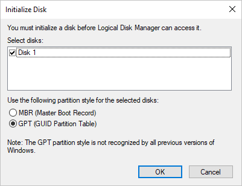

# How to deploy Azure Files
[Azure Files](storage-files-introduction.md) offers fully managed file shares in the cloud that are accessible via the industry standard SMB protocol. This article will show you how to practically deploy Azure Files within your organization.

We strongly recommend reading [Planning for an Azure Files deployment](storage-files-planning.md) prior to following the steps in this article.

## Prerequisites
This article assumes that you have already completed the following steps:

- Created an Azure Storage Account with your desired resiliency and encryption options, in the region you desire. See [Create a Storage Account](../common/storage-create-storage-account.md?toc=%2fazure%2fstorage%2ffiles%2ftoc.json) for step-by-step directions on how to create a Storage Account.
- Created an Azure file share with your desired quota in your Storage Account. See [Create a file share](storage-how-to-create-file-share.md) for step-by-step directions on how to create a file share.

## Transfer data into Azure Files
You may wish to migrate existing file shares, such as those stored on-premises, to your new Azure file share. This section will show you how to move data into an Azure file share via several popular methods detailed from the [planning guide](storage-files-planning.md#data-transfer-method)

### Azure File Sync
Azure File Sync allows you to centralize your organization's file shares in Azure Files without giving up the flexibility, performance, and compatibility of an on-premises file server. It does this by transforming your Windows Servers into a quick cache of your Azure file share. You can use any protocol available on Windows Server to access your data locally (including SMB, NFS, and FTPS) and you can have as many caches as you need across the world.

Azure File Sync may be used to migrate data into an Azure file share, even if the sync mechanism isn't desired for long-term use. More information on how to use Azure File Sync to transfer data into Azure file share can be found in [Planning for an Azure File Sync deployment](storage-sync-files-planning.md) and [How to deploy Azure File Sync](storage-sync-files-deployment-guide.md).

### Azure Import/Export
The Azure Import/Export service allows you to securely transfer large amounts of data into an Azure file share by shipping hard disk drives to an Azure datacenter. See [Use the Microsoft Azure Import/Export service to transfer data to Azure storage](../common/storage-import-export-service.md?toc=%2fazure%2fstorage%2ffiles%2ftoc.json) for a more detailed overview of the service.

> [!Note]  
> The Azure Import/Export service does not support the export of files from an Azure file share at this time.

The following steps will import data from an on-premises location to your Azure file share.

1. Procure the required number of hard disks to mail into Azure. Hard disks may be of any disk size, but must be either a 2.5" or 3.5" SSD or HDD supporting the SATA II or SATA III standard. 

2. Connect and mount each disk on the server/PC doing the data transfer. For optimal performance, we recommend running the on-premises export job locally on the server that contains the data. In some cases, such as when the file server that serves the data is a NAS device, this may not be possible. In that case, it is perfectly acceptable to mount each disk on a PC.

3. Ensure each drive is online, initialized, and is assigned a drive letter. To do bring a drive online, initialize, and assign a drive letter, open the Disk Management MMC snap-in (diskmgmt.msc).

    - To bring a disk online (if it's not already online), right-click on the disk in the lower pane of the Disk Management MMC and select "Online".
    - To initialize a disk, right-click on the disk in the lower pane (after the disk is online), and select "Initialize". Be sure to select "GPT" when asked.

        

    - To assign a drive letter to the disk, right-click on the "unallocated" space of the online and initialized disk, and click "New Simple Volume". This will allow you to assign drive letter. Note that you do not need to format the volume as this will be done later.

        

4. Create the dataset CSV file. The dataset CSV file is a mapping between  the path to the data on-premises and the desired Azure file share the data should be copied to. For example, the following dataset CSV file maps an on-premises file share ("F:\shares\scratch") to an Azure file share ("MyAzureFileShare"):
    
    ```
    BasePath,DstItemPathOrPrefix,ItemType,Disposition,MetadataFile,PropertiesFile
    "F:\shares\scratch\","MyAzureFileShare/",file,rename,"None",None
    ```

    Multiple shares with a Storage Account may be specified. See [Prepare the dataset CSV file](../common/storage-import-export-tool-preparing-hard-drives-import.md?toc=%2fazure%2fstorage%2ffiles%2ftoc.json#prepare-the-dataset-csv-file) for more information.

5. Create the driveset CSV file. The driveset CSV file lists the disks available to the on-premises export agent. For example, the following driveset CSV file lists `X:`, `Y:`, and `Z:` drives to be used in the on-premises export job:

    ```
    DriveLetter,FormatOption,SilentOrPromptOnFormat,Encryption,ExistingBitLockerKey
    X,Format,SilentMode,Encrypt,
    Y,Format,SilentMode,Encrypt,
    Z,Format,SilentMode,Encrypt,
    ```
    
    See [Prepare the driveset CSV file](../common/storage-import-export-tool-preparing-hard-drives-import.md?toc=%2fazure%2fstorage%2ffiles%2ftoc.json#prepare-initialdriveset-or-additionaldriveset-csv-file) for more information.

6. Use the [WAImportExport Tool](https://www.microsoft.com/download/details.aspx?id=55280) to copy your data to one or more hard drives.

    ```
    WAImportExport.exe PrepImport /j:<JournalFile> /id:<SessionId> [/logdir:<LogDirectory>] [/sk:<StorageAccountKey>] [/silentmode] [/InitialDriveSet:<driveset.csv>] DataSet:<dataset.csv>
    ```

    > [!Warning]  
    > Do not modify the data on the hard disk drives or the journal file after completing disk preparation.

7. [Create an import job](../common/storage-import-export-data-to-files.md#step-2-create-an-import-job).
    
### Robocopy
Robocopy is a well known copy tool that ships with Windows and Windows Server. Robocopy may be used to transfer data into Azure Files by mounting the file share locally, and then using the mounted location as the destination in the Robocopy command. Using Robocopy is quite simple:

1. [Mount your Azure file share](storage-how-to-use-files-windows.md). For optimal performance, we recommend mounting the Azure file share locally on the server that contains the data. In some cases, such as when the file server that serves the data is a NAS device, this may not be possible. In that case, it is perfectly acceptable to mount the Azure file share on a PC. In this example, `net use` is used at the command line to mount the file share:

    ```
    net use <desired-drive-letter>: \\<storage-account-name>.file.core.windows.net\<share-name> <storage-account-key> /user:Azure\<storage-account-name>
    ```

2. Use `robocopy` at the command line to move data to the Azure file share:

    ```
    robocopy <path-to-local-share> <path-to-azure-file-share> /E /Z /MT:32
    ```
    
    Robocopy has a significant number of options to modify the copy behavior as desired. For more information, view the [Robocopy](https://technet.microsoft.com/library/cc733145.aspx) manual page.

### AzCopy
AzCopy is a command-line utility designed for copying data to and from Azure Files, as well as Azure Blob storage, using simple commands with optimal performance. Using AzCopy is easy:

1. Download the [latest version of AzCopy on Windows](https://aka.ms/downloadazcopy) or [Linux](https://docs.microsoft.com/previous-versions/azure/storage/storage-use-azcopy-linux#download-and-install-azcopy).
2. Use `azcopy` at the command line to move data to the Azure file share. The syntax on Windows is as follows: 

    ```
    azcopy /Source:<path-to-local-share> /Dest:https://<storage-account>.file.core.windows.net/<file-share>/ /DestKey:<storage-account-key> /S
    ```

    On Linux, the command syntax is a little different:

    ```
    azcopy --source <path-to-local-share> --destination https://<storage-account>.file.core.windows.net/<file-share>/ --dest-key <storage-account-key> --recursive
    ```

    AzCopy has a significant number of options to modify the copy behavior as desired. For more information, view [AzCopy on Windows](../common/storage-use-azcopy.md?toc=%2fazure%2fstorage%2ffiles%2ftoc.json) and [AzCopy on Linux](../common/storage-use-azcopy-linux.md?toc=%2fazure%2fstorage%2ffiles%2ftoc.json).

## Automatically mount on needed PCs/Servers
To replace an on-premises file share, it is helpful to pre-mount the shares on the machines it will be used on. This can be done automatically on a list of machines.

> [!Note]  
> Mounting an Azure file share requires using the storage account key as the password, therefore we only recommend mounting in trusted environments. 

### Windows
PowerShell can be used run the mount command on multiple PCs. In the following example, `$computers` is manually populated, but you can generate the list of computers to mount automatically. For example, you can populate this variable with results from Active Directory.

```powershell
$computer = "MyComputer1", "MyComputer2", "MyComputer3", "MyComputer4"
$computer | ForEach-Object { Invoke-Command -ComputerName $_ -ScriptBlock { net use <desired-drive-letter>: \\<storage-account-name>.file.core.windows.net\<share-name> <storage-account-key> /user:Azure\<storage-account-name> /PERSISTENT:YES } }
```

### Linux
A simple bash script combined with SSH can yield the same result in the following example. The `$computer` variable is similarly left to be populated by the user:

```
computer = ("MyComputer1" "MyComputer2" "MyComputer3" "MyComputer4")
for item in "${computer[@]}"
do
    ssh $item "sudo bash -c 'echo \"//<storage-account-name>.file.core.windows.net/<share-name> /mymountpoint cifs vers=3.0,username=<storage-account-name>,password=<storage-account-key>,dir_mode=0777,file_mode=0777,serverino\" >> /etc/fstab'", "sudo mount -a"
done
```

## Next steps
- [Plan for an Azure File Sync deployment](storage-sync-files-planning.md)
- [Troubleshoot Azure Files on Windows](storage-troubleshoot-windows-file-connection-problems.md)
- [Troubleshoot Azure Files on Linux](storage-troubleshoot-linux-file-connection-problems.md)
