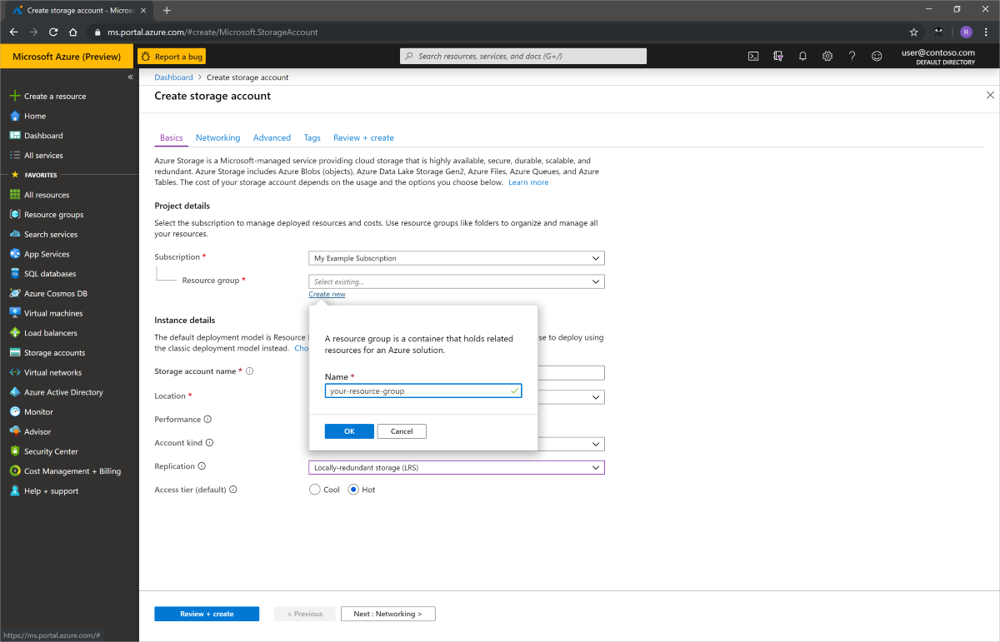
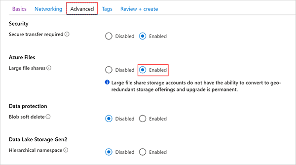
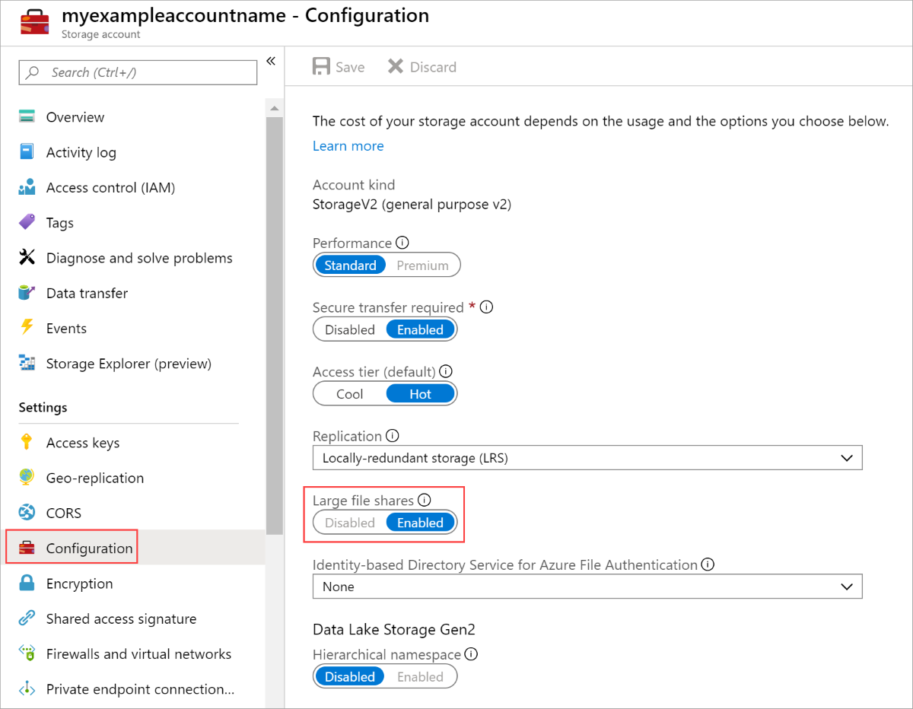

# Enable and create large file shares

When you enable large file shares on your storage account, your file shares can scale up to 100 TiB. You can enable this scaling on your existing storage accounts for your existing file shares.

## Prerequisites

- If you don't have an Azure subscription, create a [free account](https://azure.microsoft.com/free/) before you begin.
- If you intend to use the Azure CLI, [install the latest version](https://docs.microsoft.com/cli/azure/install-azure-cli?view=azure-cli-latest).
- If you intend to use Azure PowerShell, [install the latest version](https://docs.microsoft.com/powershell/azure/install-az-ps?view=azps-3.0.0).

## Restrictions

For now, you can only use locally-redundant storage (LRS) or zone-redundant storage (ZRS) on large file share–enabled accounts. You can't use geo-zone-redundant storage (GZRS), geo-redundant storage (GRS), read-access geo-redundant storage (RA-GRS), or read-access geo-zone-redundant storage (RA-GZRS).

Enabling large file shares on an account is an irreversible process. After you enable it, you won't be able to convert your account to GZRS, GRS, RA-GRS, or RA-GZRS.

## Create a new storage account

# [Portal](#tab/azure-portal)

1. Sign in to the [Azure portal](https://portal.azure.com).
1. In the Azure portal, select **All services**. 
1. In the list of resources, enter **Storage Accounts**. As you type, the list filters based on your input. Select **Storage Accounts**.
1. On the **Storage Accounts** window that appears, select **Add**.
1. Select the subscription that you'll use to create the storage account.
1. Under the **Resource group** field, select **Create new**. Enter a name for your new resource group.

    

1. Next, enter a name for your storage account. The name must be unique across Azure. The name also must be 3 to 24 characters in length, and it can only have numbers and lowercase letters.
1. Select a location for your storage account.
1. Set the replication to either **Locally redundant storage** or **Zone-redundant storage**.
1. Leave these fields at their default values:

   |Field  |Value  |
   |---------|---------|
   |Deployment model     |Resource Manager         |
   |Performance     |Standard         |
   |Account kind     |StorageV2 (general-purpose v2)         |
   |Access tier     |Hot         |

1. Select **Advanced**, and then select the **Enabled** option button to the right of **Large file shares**.
1. Select **Review + Create** to review your storage account settings and create the account.

    

1. Select **Create**.

# [Azure CLI](#tab/azure-cli)

First, [install the latest version of the Azure CLI](https://docs.microsoft.com/cli/azure/install-azure-cli?view=azure-cli-latest) so that you can enable large file shares.

To create a storage account with large file shares enabled, use the following command. Replace `<yourStorageAccountName>`, `<yourResourceGroup>`, and `<yourDesiredRegion>` with your information.

```azurecli-interactive
## This command creates a large file share–enabled account. It will not support GZRS, GRS, RA-GRS, or RA-GZRS.
az storage account create --name <yourStorageAccountName> -g <yourResourceGroup> -l <yourDesiredRegion> --sku Standard_LRS --kind StorageV2 --enable-large-file-share
```

# [PowerShell](#tab/azure-powershell)

First, [install the latest version of PowerShell](https://docs.microsoft.com/powershell/azure/install-az-ps?view=azps-3.0.0) so that you can enable large file shares.

To create a storage account with large file shares enabled, use the following command. Replace `<yourStorageAccountName>`, `<yourResourceGroup>`, and `<yourDesiredRegion>` with your information.

```powershell
## This command creates a large file share–enabled account. It will not support GZRS, GRS, RA-GRS, or RA-GZRS.
New-AzStorageAccount -ResourceGroupName <yourResourceGroup> -Name <yourStorageAccountName> -Location <yourDesiredRegion> -SkuName Standard_LRS -EnableLargeFileShare;
```
---

## Enable large files shares on an existing account

You can also enable large file shares on your existing accounts. If you enable large file shares, you won't be able to convert to GZRS, GRS, RA-GRS, or RA-GZRS. Enabling large file shares is irreversible on this storage account.

# [Portal](#tab/azure-portal)

1. Open the [Azure portal](https://portal.azure.com), and go to the storage account where you want to enable large file shares.
1. Open the storage account and select **Configuration**.
1. Select **Enabled** on **Large file shares**, and then select **Save**.
1. Select **Overview** and select **Refresh**.



You've now enabled large file shares on your storage account. Next, you must [update existing share's quota](#expand-existing-file-shares) to take advantage of increased capacity and scale.

# [Azure CLI](#tab/azure-cli)

To enable large file shares on your existing account, use the following command. Replace `<yourStorageAccountName>` and `<yourResourceGroup>` with your information.

```azurecli-interactive
az storage account update --name <yourStorageAccountName> -g <yourResourceGroup> --enable-large-file-share
```

You've now enabled large file shares on your storage account. Next, you must [update existing share's quota](#expand-existing-file-shares) to take advantage of increased capacity and scale.

# [PowerShell](#tab/azure-powershell)

To enable large file shares on your existing account, use the following command. Replace `<yourStorageAccountName>` and `<yourResourceGroup>` with your information.

```powershell
Set-AzStorageAccount -ResourceGroupName <yourResourceGroup> -Name <yourStorageAccountName> -EnableLargeFileShare
```

You've now enabled large file shares on your storage account. Next, you must [update existing share's quota](#expand-existing-file-shares) to take advantage of increased capacity and scale.

---

## Create a large file share

After you've enabled large file shares on your storage account, you can create file shares in that account with higher quotas. 

# [Portal](#tab/azure-portal)

Creating a large file share is almost identical to creating a standard file share. The main difference is that you can set a quota up to 100 TiB.

1. From your storage account, select **File shares**.
1. Select **+ File share**.
1. Enter a name for your file share. You can also set the quota size you'd like, up to 100 TiB. Then select **Create**. 


# [Azure CLI](#tab/azure-cli)

To create a large file share, use the following command. Replace `<yourStorageAccountName>`, `<yourStorageAccountKey>`, and `<yourFileShareName>` with your information.

```azurecli-interactive
az storage share create --account-name <yourStorageAccountName> --account-key <yourStorageAccountKey> --name <yourFileShareName>
```

# [PowerShell](#tab/azure-powershell)

To create a large file share, use the following command. Replace `<YourStorageAccountName>`, `<YourStorageAccountKey>`, and `<YourStorageAccountFileShareName>` with your information.

```powershell
##Config
$storageAccountName = "<YourStorageAccountName>"
$storageAccountKey = "<YourStorageAccountKey>"
$shareName="<YourStorageAccountFileShareName>"
$ctx = New-AzStorageContext -StorageAccountName $storageAccountName -StorageAccountKey $storageAccountKey
New-AzStorageShare -Name $shareName -Context $ctx
```
---

## Expand existing file shares

After you've enabled large file shares on your storage account, you can also expand existing file shares in that account to the higher quota. 

# [Portal](#tab/azure-portal)

1. From your storage account, select **File shares**.
1. Right-click your file share, and then select **Quota**.
1. Enter the new size that you want, and then select **OK**.


# [Azure CLI](#tab/azure-cli)

To set the quota to the maximum size, use the following command. Replace `<yourStorageAccountName>`, `<yourStorageAccountKey>`, and `<yourFileShareName>` with your information.

```azurecli-interactive
az storage share update --account-name <yourStorageAccountName> --account-key <yourStorageAccountKey> --name <yourFileShareName> --quota 102400
```

# [PowerShell](#tab/azure-powershell)

To set the quota to the maximum size, use the following command. Replace `<YourStorageAccountName>`, `<YourStorageAccountKey>`, and `<YourStorageAccountFileShareName>` with your information.

```powershell
##Config
$storageAccountName = "<YourStorageAccountName>"
$storageAccountKey = "<YourStorageAccountKey>"
$shareName="<YourStorageAccountFileShareName>"
$ctx = New-AzStorageContext -StorageAccountName $storageAccountName -StorageAccountKey $storageAccountKey
# update quota
Set-AzStorageShareQuota -ShareName $shareName -Context $ctx -Quota 102400
```
---

## Next steps

* [Connect and mount a file share on Windows](storage-how-to-use-files-windows.md)
* [Connect and mount a file share on Linux](storage-how-to-use-files-linux.md)
* [Connect and mount a file share on macOS](storage-how-to-use-files-mac.md)
