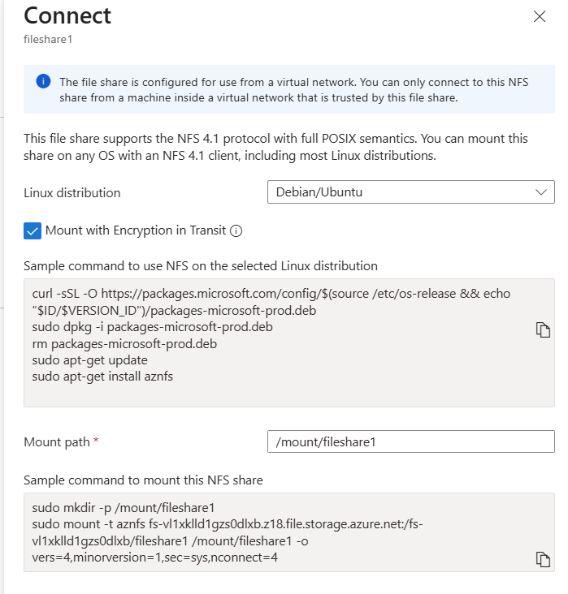

# Mount NFS Azure file shares on Linux

:heavy_check_mark: **Applies to:** Classic NFS file shares created with the Microsoft.Storage resource provider

:heavy_check_mark: **Applies to:** File shares created with the Microsoft.FileShares resource provider

You can mount Azure file shares in Linux distributions by using either the Server Message Block (SMB) protocol or the Network File System (NFS) protocol. This article focuses on mounting with NFS. For details on mounting SMB file shares, see [Use Azure Files with Linux](storage-how-to-use-files-linux.md). For details on the available protocols, see [Azure file share protocols](storage-files-planning.md#available-protocols).

## Prerequisite: Configure network security

You can access NFSv4.1 file shares (both classic file shares created with the Microsoft.Storage resource provider and file shares created with Microsoft.FileShares resource provider) only from trusted networks. Secure the data by using a virtual network and other network security settings. You can't use Microsoft Entra security and access control lists (ACLs) to authorize NFSv4.1 requests. To learn more about how to set up NFSv4.1 file shares, see [how to create a file share](./create-file-share.md) and [how to create a classic file share](./create-classic-file-share.md).

## Mount an NFS Azure file share

You can mount the share by using the AZNFS mount helper in Azure portal, or you can use the native NFS mount commands in CLI. You can also create a record in the **/etc/fstab** file to automatically mount the share every time the Linux server or VM boots.

Use the `nconnect` Linux mount option to improve performance for NFS Azure file shares at scale. For more information, see [Improve NFS Azure file share performance](nfs-performance.md#nfs-nconnect).

### Default mount instructions

The mount instructions differ depending on whether you created the NFS file share using the Microsoft.Storage resource provider (classic file share) or the Microsoft.FileShares resource provider.

#### Classic NFS file share (Microsoft.Storage)

Follow these steps to mount a classic NFS file share.

1. After you create the file share, select the share and then select **Connect from Linux**.
1. Enter the mount path you'd like to use, and then copy the script and run it on your client. Azure portal offers a step-by-step, ready-to-use installation script tailored to your selected Linux distribution for installing the AZNFS mount helper package and to securely mount the share using [Encryption in Transit](encryption-in-transit-for-nfs-shares.md). The script includes only the required mount options, but you can add other [recommended mount options](#mount-options).

:::image type="content" source="./media/storage-files-how-to-mount-nfs-shares/mount-file-share.png" alt-text="Screenshot showing how to connect to an NFS file share from Linux using a provided mounting script." lightbox="./media/storage-files-how-to-mount-nfs-shares/mount-file-share.png" border="true":::

##### Mount a classic NFS share by using the NFS client mount in command line

You can also mount the Azure file share by using NFS client mount in command line. Select the tab below for your Linux distribution to see the commands you need to run. Replace `<YourStorageAccountName>` and `<FileShareName>` with your information.

# [Ubuntu/Debian](#tab/Ubuntu)

```bash
sudo apt-get -y update
sudo apt-get install nfs-common

sudo mkdir -p /mount/<YourStorageAccountName>/<FileShareName>
sudo mount -t nfs <YourStorageAccountName>.file.core.windows.net:/<YourStorageAccountName>/<FileShareName> /mount/<YourStorageAccountName>/<FileShareName> -o vers=4,minorversion=1,sec=sys,nconnect=4
```

# [RHEL/CentOS](#tab/RHEL)

```bash
sudo yum update
sudo yum install nfs-utils

sudo mkdir -p /mount/<YourStorageAccountName>/<FileShareName>
sudo mount -t nfs <YourStorageAccountName>.file.core.windows.net:/<YourStorageAccountName>/<FileShareName> /mount/<YourStorageAccountName>/<FileShareName> -o vers=4,minorversion=1,sec=sys,nconnect=4
```

# [SUSE](#tab/SUSE)

```bash
sudo zypper update
sudo zypper -n install nfs-client

sudo mkdir -p /mount/<YourStorageAccountName>/<FileShareName>
sudo mount -t nfs <YourStorageAccountName>.file.core.windows.net:/<YourStorageAccountName>/<FileShareName> /mount/<YourStorageAccountName>/<FileShareName> -o vers=4,minorversion=1,sec=sys,nconnect=4
```

---

#### NFS file share (Microsoft.FileShares)

Follow these steps to mount a file share created with the Microsoft.FileShares resource provider.

1. After you create the file share, select the share and then select **Connect from Linux**.
1. Enter the mount path you want to use, and then copy the script and run it on your client. The Azure portal offers a step-by-step, ready-to-use installation script tailored to your selected Linux distribution for installing the AZNFS mount helper package and to securely mount the share by using [Encryption in Transit](encryption-in-transit-for-nfs-shares.md). If the file share requires encryption in transit, the mount script uses the Aznfs mount helper. If the feature require encryption in transit is off, toggle the **Mount with encryption in transit** checkbox to use different mount commands to mount the file share. The script includes only the required mount options, but you can add other [recommended mount options](#mount-options).

   

##### Mount an NFS share using the NFS client mount in command line

You can also mount the file share using NFS client mount in command line. Select the tab below for your Linux distribution to see the commands you need to run. Replace `<your-subscription-id>`, `<your-resource-group>` and `<your-file-share-name>` with your information.

```bash
# Customize these placeholders:
# - `<your-subscription-id>` → Your Azure subscription ID.
# - `<your-resource-group>` → The resource group containing the file share.
# - `<your-file-share-name>` → The name of your file share.

# you will use $hostname later when mounting the file share.
hostName=$(az resource show \
  --ids "/subscriptions/<your-subscription-id>/resourceGroups/<your-resource-group>/providers/Microsoft.FileShares/fileShares/<your-file-share-name>" \
  --query "properties.hostName" \
  --output tsv)
echo $hostName

# you will use shortName later when mounting the file share.
prefix=$(echo "$hostName" | sed 's/\.file\.storage\.azure\.net.*//')
shortName=$(echo "$prefix" | sed 's/\.[^.]*$//')
echo $shortName
```

# [Ubuntu/Debian](#tab/Ubuntu)

```bash
sudo apt-get -y update
sudo apt-get install nfs-common
sudo mkdir -p /mount/<your-file-share-name>
sudo mount -t nfs $hostName:/$shortName/<your-file-share-name> /mount/<your-file-share-name> -o vers=4,minorversion=1,sec=sys
```

# [RHEL/CentOS](#tab/RHEL)

```bash
sudo yum update
sudo yum install nfs-utils
sudo mkdir -p /mount/<your-file-share-name>
sudo mount -t nfs $hostName:/$shortName/<your-file-share-name> /mount/<your-file-share-name> -o vers=4,minorversion=1,sec=sys
```

# [SUSE](#tab/SUSE)

```bash
sudo zypper update
sudo zypper -n install nfs-client
sudo mkdir -p /mount/<your-file-share-name>
sudo mount -t nfs $hostName:/$shortName/<your-file-share-name> /mount/<your-file-share-name> -o vers=4,minorversion=1,sec=sys
```

---

### Mount by using /etc/fstab

To automatically mount the NFS file share every time the Linux server or VM boots, create a record in the **/etc/fstab** file for your Azure file share. The record differs depending on whether you're using the AZNFS Mount Helper or the native NFS mount commands.

To check if the AZNFS Mount Helper package is installed on your client, run the following command:

```bash
systemctl is-active --quiet aznfswatchdog && echo -e "\nAZNFS Mount Helper is installed! \n"
```

If the package is installed, the message `AZNFS Mount Helper is installed!` appears.

For classic file share, replace `<YourStorageAccountName>` and `<FileShareName>` with your own values. For file share, replace `hostName` and `shortName` with the correct values. For more information, enter the command `man fstab` from the Linux command line.

### Mount by using AZNFS Mount Helper with encryption in transit

If you're using the AZNFS Mount Helper and want to mount the share using encryption in transit, the record in **/etc/fstab** should look like this:

```bash
# For Microsoft.Storage file share, use:
<YourStorageAccountName>.file.core.windows.net:/<YourStorageAccountName>/<FileShareName> /media/<YourStorageAccountName>/<FileShareName> aznfs defaults,sec=sys,vers=4,minorversion=1,nolock,proto=tcp,nofail,_netdev   0 2

# For Microsoft.FileShares file share, use:
$hostName:/$shortName/<FileShareName> /media/$shortName/<FileShareName> aznfs defaults,sec=sys,vers=4,minorversion=1,nolock,proto=tcp,nofail,_netdev   0 2
```

### Mount by using AZNFS Mount Helper without encryption in transit

If you're using the AZNFS Mount Helper but don't want to use encryption in transit, the record in **/etc/fstab** should look like this:

```bash
# For Microsoft.Storage file share, use:
<YourStorageAccountName>.file.core.windows.net:/<YourStorageAccountName>/<FileShareName> /media/<YourStorageAccountName>/<FileShareName> aznfs defaults,sec=sys,vers=4,minorversion=1,nolock,proto=tcp,nofail,_netdev,notls   0 2

# For Microsoft.FileShares file share, use:
$hostName:/$shortName/<FileShareName> /media/$shortName/<FileShareName> aznfs defaults,sec=sys,vers=4,minorversion=1,nolock,proto=tcp,nofail,_netdev,notls   0 2
```

### Mount by using native mount command

If you're using the native NFS mount without AZNFS, the record in **/etc/fstab** should look like this:

```bash
# For Microsoft.Storage file share, use:
<YourStorageAccountName>.file.core.windows.net:/<YourStorageAccountName>/<FileShareName> /media/<YourStorageAccountName>/<FileShareName> nfs vers=4,minorversion=1,_netdev,nofail,sec=sys 0 0

# For Microsoft.FileShares file share, use:
$hostName:/$shortName/<FileShareName> /media/$shortName/<FileShareName> nfs vers=4,minorversion=1,_netdev,nofail,sec=sys 0 0
```

### Mount options

Use the following mount options when mounting NFS Azure file shares.

| **Mount option** | **Recommended value** | **Description** |
|**\*\*\*\***\*\***\*\*\*\***|\***\*\*\*\*\***\*\*\*\***\*\*\*\*\***|**\*\*\*\***\***\*\*\*\***|
| `vers` | 4 | Required. Specifies which version of the NFS protocol to use. Azure Files only supports NFSv4.1. |
| `minorversion` | 1 | Required. Specifies the minor version of the NFS protocol. Some Linux distros don't recognize dotted minor versions on the `vers` parameter. So instead of `vers=4.1`, use `vers=4,minorversion=1`. |
| `sec` | sys | Required. Specifies the type of security to use when authenticating an NFS connection. Setting `sec=sys` uses the local UNIX UIDs and GIDs that use AUTH_SYS to authenticate NFS operations. |
| `rsize` | 1048576 | Recommended. Sets the maximum number of bytes to transfer in a single NFS read operation. Specifying the maximum level of 1,048,576 bytes usually results in the best performance. |
| `wsize` | 1048576 | Recommended. Sets the maximum number of bytes to transfer in a single NFS write operation. Specifying the maximum level of 1,048,576 bytes usually results in the best performance. |
| `noresvport` | n/a | Recommended for kernels before 5.18. Tells the NFS client to use a nonprivileged source port when communicating with an NFS server for the mount point. Using the `noresvport` mount option helps ensure that your NFS share has uninterrupted availability after a reconnection. Using this option is recommended for achieving high availability. |
| `actimeo` | 30-60 | Recommended. Specifying `actimeo` sets all of `acregmin`, `acregmax`, `acdirmin`, and `acdirmax` to the same value. Using a value lower than 30 seconds can cause performance degradation because attribute caches for files and directories expire too quickly. Set `actimeo` between 30 and 60 seconds. |
| `nconnect` | 4 | Recommended. Nconnect increases performance by using multiple TCP connections between the client and your NFS share. Configure the mount options with the optimal setting of nconnect=4. Currently, there are no gains beyond four channels for the Azure Files implementation of nconnect. |
| `clean` | n/a | A non-TLS mount might fail if a prior TLS mount to the same server ended abruptly, leaving stale entries. To resolve this issue, remount the share by using the `clean` option, which immediately clears any stale entries. This option applies only for AZNFS mount. |

## Validate connectivity

If your mount fails, it's possible that your private endpoint isn't set up correctly or isn't accessible. For details, see [Verify connectivity](storage-files-networking-endpoints.md#verify-connectivity).

## NFS file share snapshots

You can take file share snapshots when using NFS Azure file shares. This capability allows you to roll back entire file systems or recover files that are accidentally deleted or corrupted. See [Use share snapshots with Azure Files](storage-snapshots-files.md#nfs-file-share-snapshots).

## Next step

- If you experience any issues, see [Troubleshoot NFS Azure file shares](/troubleshoot/azure/azure-storage/files-troubleshoot-linux-nfs?toc=/azure/storage/files/toc.json).
