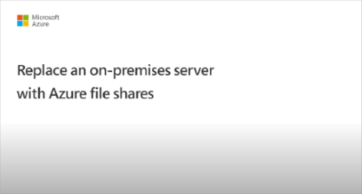
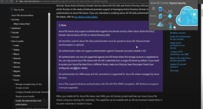

# Overview: On-premises Active Directory Domain Services authentication over SMB for Azure file shares

[!INCLUDE [storage-files-aad-auth-include](../../../includes/storage-files-aad-auth-include.md)]

We strongly recommend that you review the [How it works section](./storage-files-active-directory-overview.md#how-it-works) to select the right AD source for authentication. The setup is different depending on the domain service you choose. This article focuses on enabling and configuring on-premises AD DS for authentication with Azure file shares.

If you're new to Azure Files, we recommend reading our [planning guide](storage-files-planning.md).

## Applies to
| Management model | Billing model | Media tier | Redundancy | SMB | NFS |
|-|-|-|-|:-:|:-:|
| Microsoft.Storage | Provisioned v2 | HDD (standard) | Local (LRS) |  |  |
| Microsoft.Storage | Provisioned v2 | HDD (standard) | Zone (ZRS) |  |  |
| Microsoft.Storage | Provisioned v2 | HDD (standard) | Geo (GRS) |  |  |
| Microsoft.Storage | Provisioned v2 | HDD (standard) | GeoZone (GZRS) |  |  |
| Microsoft.Storage | Provisioned v1 | SSD (premium) | Local (LRS) |  |  |
| Microsoft.Storage | Provisioned v1 | SSD (premium) | Zone (ZRS) |  |  |
| Microsoft.Storage | Pay-as-you-go | HDD (standard) | Local (LRS) |  |  |
| Microsoft.Storage | Pay-as-you-go | HDD (standard) | Zone (ZRS) |  |  |
| Microsoft.Storage | Pay-as-you-go | HDD (standard) | Geo (GRS) |  |  |
| Microsoft.Storage | Pay-as-you-go | HDD (standard) | GeoZone (GZRS) |  |  |

## Supported scenarios and restrictions

- To use identity-based authentication with Azure Files, share-level RBAC permissions must be assigned. You can do this in two ways:
  - **[Default share-level permission](storage-files-identity-assign-share-level-permissions.md#share-level-permissions-for-all-authenticated-identities):** This option applies RBAC at the share level for all authenticated users. With this configuration, you don't need to sync your on-premises AD DS identities to Microsoft Entra ID.
  - **Granular share-level permissions:** If you want to assign RBAC at the share level to specific users or groups, the corresponding identities must be synchronized from your on-premises AD DS to Microsoft Entra ID using [Microsoft Entra Connect](/entra/identity/hybrid/connect/whatis-azure-ad-connect) or [Microsoft Entra Cloud Sync](/entra/identity/hybrid/cloud-sync/what-is-cloud-sync). Groups created only in Microsoft Entra ID won't work unless they contain synced user accounts. Password hash synchronization isn't required.
- Client OS requirements: Windows 8 / Windows Server 2012 or later, or Linux VMs such as Ubuntu 18.04+ and equivalent RHEL/SLES distributions.
- Azure file shares can be managed with Azure File Sync.
- Kerberos authentication is available with Active Directory using [AES 256 encryption](/troubleshoot/azure/azure-storage/files-troubleshoot-smb-authentication?toc=/azure/storage/files/toc.json#azure-files-on-premises-ad-ds-authentication-support-for-aes-256-kerberos-encryption) (recommended) and RC4-HMAC. AES 128 Kerberos encryption isn't yet supported.
- Single sign-on (SSO) is supported.
- By default access is limited to the Active Directory forest where the storage account is registered. Users from any domain in that forest can access the file share contents, provided they have the appropriate permissions. To enable access from additional forests, you must configure a forest trust. For details, see [Use Azure Files with multiple Active Directory forests](storage-files-identity-multiple-forests.md).
- Identity-based authentication isn't currently supported for NFS file shares.

When you enable AD DS for Azure file shares over SMB, your AD DS-joined machines can mount Azure file shares using your existing AD DS credentials. The AD DS environment can be hosted either on-premises or on a virtual machine (VM) in Azure.

## Videos

To help you set up identity-based authentication for common use cases, we published two videos with step-by-step guidance for the following scenarios. Note that Azure Active Directory is now Microsoft Entra ID. For more info, see [New name for Azure AD](https://aka.ms/azureadnewname).

| Replace on-premises file servers with Azure Files (including setup on private link for files and AD authentication) | Use Azure Files as the profile container for Azure Virtual Desktop (including setup on AD authentication and FSLogix configuration)  |
|-|-|
|  |  |

## Prerequisites

Before you enable AD DS authentication for Azure file shares, make sure you've completed the following prerequisites:

- Select or create your [AD DS environment](/windows-server/identity/ad-ds/get-started/virtual-dc/active-directory-domain-services-overview) and [sync it to Microsoft Entra ID](../../active-directory/hybrid/how-to-connect-install-roadmap.md) using either the on-premises [Microsoft Entra Connect Sync](../../active-directory/hybrid/whatis-azure-ad-connect.md) application or [Microsoft Entra Connect cloud sync](../../active-directory/cloud-sync/what-is-cloud-sync.md), a lightweight agent that can be installed from the Microsoft Entra Admin Center.

    You can enable the feature on a new or existing on-premises AD DS environment. Identities used for access must be synced to Microsoft Entra ID or use a default share-level permission. The Microsoft Entra tenant and the file share that you're accessing must be associated with the same subscription.

- Domain-join an on-premises machine or an Azure VM to on-premises AD DS. For information about how to domain-join, refer to [Join a Computer to a Domain](/windows-server/identity/ad-fs/deployment/join-a-computer-to-a-domain).

    If a machine isn't domain joined, you can still use AD DS for authentication if the machine has unimpeded network connectivity to the on-premises AD domain controller and the user provides explicit credentials. For more information, see [Mount the file share from a non-domain-joined VM or a VM joined to a different AD domain](storage-files-identity-mount-file-share.md#mount-the-file-share-from-a-non-domain-joined-vm-or-a-vm-joined-to-a-different-ad-domain).

- Select or create an Azure storage account. For optimal performance, we recommend that you deploy the storage account in the same region as the client from which you plan to access the share. Then, mount the Azure file share with your storage account key to verify connectivity.

    Make sure that the storage account containing your file shares isn't already configured for identity-based authentication. If an AD source is already enabled on the storage account, you must disable it before enabling on-premises AD DS.

    If you experience issues in connecting to Azure Files, refer to [troubleshoot Azure Files mounting errors on Windows](https://azure.microsoft.com/blog/new-troubleshooting-diagnostics-for-azure-files-mounting-errors-on-windows/).

- If you plan to enable any networking configurations on your file share, we recommend you read the [networking considerations](./storage-files-networking-overview.md) article and complete the related configuration before enabling AD DS authentication.

## Regional availability

Azure Files authentication with AD DS is available in [all Azure Public, China and Gov regions](https://azure.microsoft.com/global-infrastructure/locations/).

## Overview

Enabling AD DS authentication for your Azure file shares allows you to authenticate to your Azure file shares with your on-premises AD DS credentials. Further, it allows you to better manage your permissions to allow granular access control. Doing this requires syncing identities from on-premises AD DS to Microsoft Entra ID using either the on-premises [Microsoft Entra Connect Sync](../../active-directory/hybrid/whatis-azure-ad-connect.md) application or [Microsoft Entra Connect cloud sync](../../active-directory/cloud-sync/what-is-cloud-sync.md), a lightweight agent that can be installed from the Microsoft Entra Admin Center. You assign share-level permissions to hybrid identities synced to Microsoft Entra ID while managing file/directory-level access using Windows ACLs.

Follow these steps to set up Azure Files for AD DS authentication:

1. [Enable AD DS authentication on your storage account](storage-files-identity-ad-ds-enable.md)

1. [Assign share-level permissions to the Microsoft Entra identity (a user, group, or service principal) that is in sync with the target AD identity](storage-files-identity-assign-share-level-permissions.md)

1. [Configure Windows ACLs over SMB for directories and files](storage-files-identity-configure-file-level-permissions.md)

1. [Mount an Azure file share to a VM joined to your AD DS](storage-files-identity-mount-file-share.md)

1. [Update the password of your storage account identity in AD DS](storage-files-identity-ad-ds-update-password.md)

The following diagram illustrates the end-to-end workflow for enabling AD DS authentication over SMB for Azure file shares.

:::image type="content" source="media/storage-files-active-directory-domain-services-enable/diagram-files-active-directory-domain-services.png" alt-text="Diagram showing AD DS authentication over SMB for Azure Files workflow." lightbox="media/storage-files-active-directory-domain-services-enable/diagram-files-active-directory-domain-services.png" border="false":::

Identities used to access Azure file shares must be synced to Microsoft Entra ID to enforce share-level file permissions through the [Azure role-based access control (Azure RBAC)](../../role-based-access-control/overview.md) model. Alternatively, you can use a default share-level permission. [Windows-style DACLs](/previous-versions/technet-magazine/cc161041(v=msdn.10)) on files/directories carried over from existing file servers will be preserved and enforced. This offers seamless integration with your enterprise AD DS environment. As you replace on-premises file servers with Azure file shares, existing users can access Azure file shares from their current clients with a single sign-on experience, without any change to the credentials in use.  

## Next step

To get started, you must [enable AD DS authentication for your storage account](storage-files-identity-ad-ds-enable.md).
