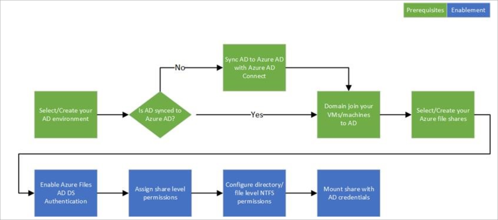

# Overview - on-premises Active Directory Domain Services authentication over SMB for Azure file shares

[Azure Files](storage-files-introduction.md) supports identity-based authentication over Server Message Block (SMB) through two types of Domain Services: Azure Active Directory Domain Services (Azure AD DS) and on-premises Active Directory Domain Services (AD DS). Using either identity-based authentication method allows you to integrate the process of accessing your Azure file shares with your existing identity-based authentication process, instead of having to manage it separately. This series of articles focus on enabling and configuring on-premises AD DS for authentication with Azure file shares.

If you are new to Azure file shares, we recommend reading our [planning guide](storage-files-planning.md) before reading the following series of articles.

## Supported scenarios and restrictions

- AD DS Identities used for Azure Files on-premises AD DS authentication must be synced to Azure AD. Password hash synchronization is optional. 
- Supports Azure file shares managed by Azure File Sync.
- Supports Kerberos authentication with AD with RC4-HMAC encryption. AES Kerberos encryption is not yet supported.
- Supports single sign-on experience.
- Only supported on clients running on OS versions newer than Windows 7 or Windows Server 2008 R2.
- Only supported against the AD forest that the storage account is registered. You can only access Azure file shares with the AD DS credentials from a single forest by default. If you need to access your Azure file share from a different forest, make sure that you have the proper forest trust configured, see the [FAQ](storage-files-faq.md#ad-ds--azure-ad-ds-authentication) for details.
- Does not support authentication against computer accounts created in AD DS. 

When you enable AD DS for Azure file shares over SMB, your AD DS-joined machines can mount Azure file shares using your existing AD DS credentials. This capability can be enabled with an AD DS environment hosted either in on-prem machines or hosted in Azure.

> [!NOTE]
> To help you setup Azure Files AD authentication for some common use cases, we published two videos with step by step guidance for the following scenarios:
> - [Replacing on-premises file servers with Azure Files (including setup on private link for files and AD authentication)](https://sec.ch9.ms/ch9/3358/0addac01-3606-4e30-ad7b-f195f3ab3358/ITOpsTalkAzureFiles_high.mp4)
> - [Using Azure Files as the profile container for Windows Virtual Desktop (including setup on AD authentication and FsLogix configuration)](https://www.youtube.com/embed/9S5A1IJqfOQ)

## Prerequisites 

Before you enable AD DS authentication for Azure file shares, make sure you have completed the following prerequisites: 

- Select or create your [AD DS environment](https://docs.microsoft.com/windows-server/identity/ad-ds/get-started/virtual-dc/active-directory-domain-services-overview) and [sync it to Azure AD](../../active-directory/hybrid/how-to-connect-install-roadmap.md) with Azure AD Connect. 

    You can enable the feature on a new or existing on-premises AD DS environment. Identities used for access must be synced to Azure AD. The Azure AD tenant and the file share that you are accessing must be associated with the same subscription.

- Domain-join an on-premises machine or an Azure VM to on-premises AD DS. For information about how to domain-join, refer to [Join a Computer to a Domain](https://docs.microsoft.com/windows-server/identity/ad-fs/deployment/join-a-computer-to-a-domain).

- Select or create an Azure storage account.  For optimal performance, we recommend that you deploy the storage account in the same region as the client from which you plan to access the share. Then, [mount the Azure file share](storage-how-to-use-files-windows.md) with your storage account key. Mounting with the storage account key verifies connectivity.

    Make sure that the storage account containing your file shares is not already configured for Azure AD DS Authentication. If Azure Files Azure AD DS authentication is enabled on the storage account, it needs to be disabled before changing to use on-premises AD DS. This implies that existing ACLs configured in Azure AD DS environment will need to be reconfigured for proper permission enforcement.

    If you experience issues in connecting to Azure Files, refer to [the troubleshooting tool we published for Azure Files mounting errors on Windows](https://gallery.technet.microsoft.com/Troubleshooting-tool-for-a9fa1fe5). We also provide [guidance](https://docs.microsoft.com/azure/storage/files/storage-files-faq#on-premises-access) to work around scenarios when port 445 is blocked. 

- Make any relevant networking configuration prior to enabling and configuring AD DS authentication to your Azure file shares. See [Azure Files networking considerations](storage-files-networking-overview.md) for more information.

## Regional availability

Azure Files authentication with AD DS is available in [all Azure Public regions](https://azure.microsoft.com/global-infrastructure/locations/).

## Overview

If you plan to enable any networking configurations on your file share, we recommend you to read the [networking considerations](https://docs.microsoft.com/azure/storage/files/storage-files-networking-overview) article and complete the related configuration before enabling AD DS authentication.

Enabling AD DS authentication for your Azure file shares allows you to authenticate to your Azure file shares with your on-prem AD DS credentials. Further, it allows you to better manage your permissions to allow granular access control. Doing this requires synching identities from on-prem AD DS to Azure AD with AD connect. You control the share level access with identities synched to Azure AD while managing file/share level access with on-prem AD DS credentials.

Next, follow the steps below to set up Azure Files for AD DS Authentication: 

1. [Part one: enable AD DS authentication on your storage account](storage-files-identity-ad-ds-enable.md)

1. [Part two: assign access permissions for a share to the Azure AD identity (a user, group, or service principal) that is in sync with the target AD identity](storage-files-identity-ad-ds-assign-permissions.md)

1. [Part three: configure Windows ACLs over SMB for directories and files](storage-files-identity-ad-ds-configure-permissions.md)
 
1. [Part four: mount an Azure file share to a VM joined to your AD DS](storage-files-identity-ad-ds-mount-file-share.md)

1. [Update the password of your storage account identity in AD DS](storage-files-identity-ad-ds-update-password.md)

The following diagram illustrates the end-to-end workflow for enabling Azure AD authentication over SMB for Azure file shares. 

Identities used to access Azure file shares must be synced to Azure AD to enforce share level file permissions through the [role-based access control (RBAC)](../../role-based-access-control/overview.md) model. [Windows-style DACLs](https://docs.microsoft.com/previous-versions/technet-magazine/cc161041(v=msdn.10)?redirectedfrom=MSDN) on files/directories carried over from existing file servers will be preserved and enforced. This offers seamless integration with your enterprise AD DS environment. As you replace on-prem file servers with Azure file shares, existing users can access Azure file shares from their current clients with a single sign-on experience, without any change to the credentials in use.  

## Next steps

To enable on-premises AD DS authentication for your Azure file share, continue to the next article:

[Part one: enable AD DS authentication for your account](storage-files-identity-ad-ds-enable.md)
