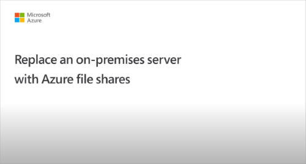
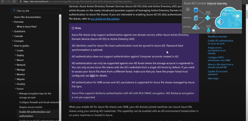

# Overview - on-premises Active Directory Domain Services authentication over SMB for Azure file shares
[!INCLUDE [storage-files-aad-auth-include](../../../includes/storage-files-aad-auth-include.md)]

We strongly recommend that you review the [How it works section](./storage-files-active-directory-overview.md#how-it-works) to select the right AD source for authentication. The setup is different depending on the domain service you choose. This article focuses on enabling and configuring on-premises AD DS for authentication with Azure file shares.

If you're new to Azure Files, we recommend reading our [planning guide](storage-files-planning.md).

## Applies to
| File share type | SMB | NFS |
|-|:-:|:-:|
| Standard file shares (GPv2), LRS/ZRS |  |  |
| Standard file shares (GPv2), GRS/GZRS |  |  |
| Premium file shares (FileStorage), LRS/ZRS |  |  |

## Supported scenarios and restrictions

- AD DS identities used for Azure Files on-premises AD DS authentication must be synced to Microsoft Entra ID or [use a default share-level permission](storage-files-identity-ad-ds-assign-permissions.md#share-level-permissions-for-all-authenticated-identities). Password hash synchronization is optional.
- Supports Azure file shares managed by Azure File Sync.
- Supports Kerberos authentication with AD with [AES 256 encryption](/troubleshoot/azure/azure-storage/files-troubleshoot-smb-authentication?toc=/azure/storage/files/toc.json#azure-files-on-premises-ad-ds-authentication-support-for-aes-256-kerberos-encryption) (recommended) and RC4-HMAC. AES 128 Kerberos encryption isn't yet supported.
- Supports single sign-on experience.
- Only supported on Windows clients running OS versions Windows 8/Windows Server 2012 or newer, or Linux VMs (Ubuntu 18.04+ or an equivalent RHEL or SLES VM) running on Azure.
- Only supported against the AD forest that the storage account is registered to. Users belonging to different domains within the same forest should be able to access the file share and underlying directories/files as long as they have the appropriate permissions.  
- You can only access Azure file shares with the AD DS credentials from a single forest by default. If you need to access your Azure file share from a different forest, make sure that you have the proper forest trust configured. For details, see [Use Azure Files with multiple Active Directory forests](storage-files-identity-multiple-forests.md).
- Doesn't support assigning share-level permissions to computer accounts (machine accounts) using Azure RBAC. You can either [use a default share-level permission](storage-files-identity-ad-ds-assign-permissions.md#share-level-permissions-for-all-authenticated-identities) to allow computer accounts to access the share, or consider using a service logon account instead.
- Doesn't support authentication against Network File System (NFS) file shares.

When you enable AD DS for Azure file shares over SMB, your AD DS-joined machines can mount Azure file shares using your existing AD DS credentials. This capability can be enabled with an AD DS environment hosted either in on-premises machines or hosted on a virtual machine (VM) in Azure.

## Videos

To help you set up identity-based authentication for some common use cases, we published two videos with step-by-step guidance for the following scenarios:

| Replacing on-premises file servers with Azure Files (including setup on private link for files and AD authentication) | Using Azure Files as the profile container for Azure Virtual Desktop (including setup on AD authentication and FSLogix configuration)  |
|-|-|
|  |  |

## Prerequisites

Before you enable AD DS authentication for Azure file shares, make sure you've completed the following prerequisites: 

- Select or create your [AD DS environment](/windows-server/identity/ad-ds/get-started/virtual-dc/active-directory-domain-services-overview) and [sync it to Microsoft Entra ID](../../active-directory/hybrid/how-to-connect-install-roadmap.md) using either the on-premises [Microsoft Entra Connect Sync](../../active-directory/hybrid/whatis-azure-ad-connect.md) application or [Microsoft Entra Connect cloud sync](../../active-directory/cloud-sync/what-is-cloud-sync.md), a lightweight agent that can be installed from the Microsoft Entra Admin Center.

    You can enable the feature on a new or existing on-premises AD DS environment. Identities used for access must be synced to Microsoft Entra ID or use a default share-level permission. The Microsoft Entra tenant and the file share that you're accessing must be associated with the same subscription.

- Domain-join an on-premises machine or an Azure VM to on-premises AD DS. For information about how to domain-join, refer to [Join a Computer to a Domain](/windows-server/identity/ad-fs/deployment/join-a-computer-to-a-domain).

    If a machine isn't domain joined, you can still use AD DS for authentication if the machine has line of sight to the on-premises AD domain controller and the user provides explicit credentials. For more information, see [Mount the file share from a non-domain-joined VM or a VM joined to a different AD domain](storage-files-identity-ad-ds-mount-file-share.md#mount-the-file-share-from-a-non-domain-joined-vm-or-a-vm-joined-to-a-different-ad-domain).

- Select or create an Azure storage account.  For optimal performance, we recommend that you deploy the storage account in the same region as the client from which you plan to access the share. Then, [mount the Azure file share](storage-how-to-use-files-windows.md) with your storage account key. Mounting with the storage account key verifies connectivity.

    Make sure that the storage account containing your file shares isn't already configured for identity-based authentication. If an AD source is already enabled on the storage account, you must disable it before enabling on-premises AD DS.

    If you experience issues in connecting to Azure Files, refer to [the troubleshooting tool we published for Azure Files mounting errors on Windows](https://azure.microsoft.com/blog/new-troubleshooting-diagnostics-for-azure-files-mounting-errors-on-windows/).

- Make any relevant networking configuration prior to enabling and configuring AD DS authentication to your Azure file shares. See [Azure Files networking considerations](storage-files-networking-overview.md) for more information.

## Regional availability

Azure Files authentication with AD DS is available in [all Azure Public, China and Gov regions](https://azure.microsoft.com/global-infrastructure/locations/).

## Overview

If you plan to enable any networking configurations on your file share, we recommend you read the [networking considerations](./storage-files-networking-overview.md) article and complete the related configuration before enabling AD DS authentication.

Enabling AD DS authentication for your Azure file shares allows you to authenticate to your Azure file shares with your on-premises AD DS credentials. Further, it allows you to better manage your permissions to allow granular access control. Doing this requires synching identities from on-premises AD DS to Microsoft Entra ID using either the on-premises [Microsoft Entra Connect Sync](../../active-directory/hybrid/whatis-azure-ad-connect.md) application or [Microsoft Entra Connect cloud sync](../../active-directory/cloud-sync/what-is-cloud-sync.md), a lightweight agent that can be installed from the Microsoft Entra Admin Center. You assign share-level permissions to hybrid identities synced to Microsoft Entra ID while managing file/directory-level access using Windows ACLs.

Follow these steps to set up Azure Files for AD DS authentication: 

1. [Enable AD DS authentication on your storage account](storage-files-identity-ad-ds-enable.md)

1. [Assign share-level permissions to the Microsoft Entra identity (a user, group, or service principal) that is in sync with the target AD identity](storage-files-identity-ad-ds-assign-permissions.md)

1. [Configure Windows ACLs over SMB for directories and files](storage-files-identity-ad-ds-configure-permissions.md)
 
1. [Mount an Azure file share to a VM joined to your AD DS](storage-files-identity-ad-ds-mount-file-share.md)

1. [Update the password of your storage account identity in AD DS](storage-files-identity-ad-ds-update-password.md)

The following diagram illustrates the end-to-end workflow for enabling AD DS authentication over SMB for Azure file shares. 

Identities used to access Azure file shares must be synced to Microsoft Entra ID to enforce share-level file permissions through the [Azure role-based access control (Azure RBAC)](../../role-based-access-control/overview.md) model. Alternatively, you can use a default share-level permission. [Windows-style DACLs](/previous-versions/technet-magazine/cc161041(v=msdn.10)) on files/directories carried over from existing file servers will be preserved and enforced. This offers seamless integration with your enterprise AD DS environment. As you replace on-premises file servers with Azure file shares, existing users can access Azure file shares from their current clients with a single sign-on experience, without any change to the credentials in use.  

## Next steps

To get started, you must [enable AD DS authentication for your storage account](storage-files-identity-ad-ds-enable.md).
