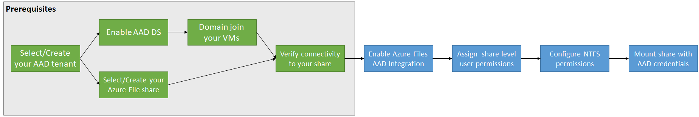

# Enable Microsoft Entra Domain Services authentication on Azure Files
[!INCLUDE [storage-files-aad-auth-include](../../../includes/storage-files-aad-auth-include.md)]

This article focuses on enabling and configuring Microsoft Entra Domain Services (formerly Azure Active Directory Domain Services) for identity-based authentication with Azure file shares. In this authentication scenario, Microsoft Entra credentials and Microsoft Entra Domain Services credentials are the same and can be used interchangeably.

We strongly recommend that you review the [How it works section](./storage-files-active-directory-overview.md#how-it-works) to select the right AD source for authentication. The setup is different depending on the AD source you choose.

If you're new to Azure Files, we recommend reading our [planning guide](storage-files-planning.md) before reading this article.

> [!NOTE]
> Azure Files supports Kerberos authentication with Microsoft Entra Domain Services with RC4-HMAC and AES-256 encryption. We recommend using AES-256.
>
> Azure Files supports authentication for Microsoft Entra Domain Services with full or partial (scoped) synchronization with Microsoft Entra ID. For environments with scoped synchronization present, administrators should be aware that Azure Files only honors Azure RBAC role assignments granted to principals that are synchronized. Role assignments granted to identities not synchronized from Microsoft Entra ID to Microsoft Entra Domain Services will be ignored by the Azure Files service.

## Applies to
| File share type | SMB | NFS |
|-|:-:|:-:|
| Standard file shares (GPv2), LRS/ZRS |  |  |
| Standard file shares (GPv2), GRS/GZRS |  |  |
| Premium file shares (FileStorage), LRS/ZRS |  |  |

## Prerequisites

Before you enable Microsoft Entra Domain Services over SMB for Azure file shares, make sure you've completed the following prerequisites:

1.  **Select or create a Microsoft Entra tenant.**

    You can use a new or existing tenant. The tenant and the file share that you want to access must be associated with the same subscription.

    To create a new Microsoft Entra tenant, you can [Add a Microsoft Entra tenant and a Microsoft Entra subscription](/windows/client-management/mdm/add-an-azure-ad-tenant-and-azure-ad-subscription). If you have an existing Microsoft Entra tenant but want to create a new tenant for use with Azure file shares, see [Create a Microsoft Entra tenant](/rest/api/datacatalog/create-an-azure-active-directory-tenant).

1.  **Enable Microsoft Entra Domain Services on the Microsoft Entra tenant.**

    To support authentication with Microsoft Entra credentials, you must enable Microsoft Entra Domain Services for your Microsoft Entra tenant. If you aren't the administrator of the Microsoft Entra tenant, contact the administrator and follow the step-by-step guidance to [Enable Microsoft Entra Domain Services using the Azure portal](../../active-directory-domain-services/tutorial-create-instance.md).

    It typically takes about 15 minutes for a Microsoft Entra Domain Services deployment to complete. Verify that the health status of Microsoft Entra Domain Services shows **Running**, with password hash synchronization enabled, before proceeding to the next step.

1.  **Domain-join an Azure VM with Microsoft Entra Domain Services.**

    To access an Azure file share by using Microsoft Entra credentials from a VM, your VM must be domain-joined to Microsoft Entra Domain Services. For more information about how to domain-join a VM, see [Join a Windows Server virtual machine to a managed domain](../../active-directory-domain-services/join-windows-vm.md). Microsoft Entra Domain Services authentication over SMB with Azure file shares is supported only on Azure VMs running on OS versions above Windows 7 or Windows Server 2008 R2.

    > [!NOTE]
    > Non-domain-joined VMs can access Azure file shares using Microsoft Entra Domain Services authentication only if the VM has unimpeded network connectivity to the domain controllers for Microsoft Entra Domain Services. Usually this requires either site-to-site or point-to-site VPN.

1.  **Select or create an Azure file share.**

    Select a new or existing file share that's associated with the same subscription as your Microsoft Entra tenant. For information about creating a new file share, see [Create a file share in Azure Files](storage-how-to-create-file-share.md).
    For optimal performance, we recommend that your file share be in the same region as the VM from which you plan to access the share.

1.  **Verify Azure Files connectivity by mounting Azure file shares using your storage account key.**

    To verify that your VM and file share are properly configured, try mounting the file share using your storage account key. For more information, see [Mount an Azure file share and access the share in Windows](storage-how-to-use-files-windows.md).

## Regional availability

Azure Files authentication with Microsoft Entra Domain Services is available in [all Azure Public, Gov, and China regions](https://azure.microsoft.com/global-infrastructure/locations/).

## Overview of the workflow

Before you enable Microsoft Entra Domain Services authentication over SMB for Azure file shares, verify that your Microsoft Entra ID and Azure Storage environments are properly configured. We recommend that you walk through the [prerequisites](#prerequisites) to make sure you've completed all the required steps.

Follow these steps to grant access to Azure Files resources with Microsoft Entra credentials:

1. Enable Microsoft Entra Domain Services authentication over SMB for your storage account to register the storage account with the associated Microsoft Entra Domain Services deployment.
1. Assign share-level permissions to a Microsoft Entra identity (a user, group, or service principal).
1. Connect to your Azure file share using a storage account key and configure Windows access control lists (ACLs) for directories and files.
1. Mount an Azure file share from a domain-joined VM.

The following diagram illustrates the end-to-end workflow for enabling Microsoft Entra Domain Services authentication over SMB for Azure Files.



<a name='enable-azure-ad-ds-authentication-for-your-account'></a>

## Enable Microsoft Entra Domain Services authentication for your account

To enable Microsoft Entra Domain Services authentication over SMB for Azure Files, you can set a property on storage accounts by using the Azure portal, Azure PowerShell, or Azure CLI. Setting this property implicitly "domain joins" the storage account with the associated Microsoft Entra Domain Services deployment. Microsoft Entra Domain Services authentication over SMB is then enabled for all new and existing file shares in the storage account.

Keep in mind that you can enable Microsoft Entra Domain Services authentication over SMB only after you've successfully deployed Microsoft Entra Domain Services to your Microsoft Entra tenant. For more information, see the [prerequisites](#prerequisites).

# [Portal](#tab/azure-portal)

To enable Microsoft Entra Domain Services authentication over SMB with the [Azure portal](https://portal.azure.com), follow these steps:

1. In the Azure portal, go to your existing storage account, or [create a storage account](../common/storage-account-create.md).
1. In the **File shares** section, select **Active directory: Not Configured**.

    :::image type="content" source="media/storage-files-active-directory-enable/files-azure-ad-enable-storage-account-identity.png" alt-text="Screenshot of the File shares pane in your storage account, Active directory is highlighted." lightbox="media/storage-files-active-directory-enable/files-azure-ad-enable-storage-account-identity.png":::

1. Select **Microsoft Entra Domain Services** then enable the feature by ticking the checkbox.
1. Select **Save**.

    :::image type="content" source="media/storage-files-active-directory-enable/files-azure-ad-ds-highlight.png" alt-text="Screenshot of the Active Directory pane, Microsoft Entra Domain Services is enabled." lightbox="media/storage-files-active-directory-enable/files-azure-ad-ds-highlight.png":::

# [PowerShell](#tab/azure-powershell)

To enable Microsoft Entra Domain Services authentication over SMB with Azure PowerShell, install the latest Az module (2.4 or newer) or the Az.Storage module (1.5 or newer). For more information about installing PowerShell, see [Install Azure PowerShell on Windows with PowerShellGet](/powershell/azure/install-azure-powershell).

To create a new storage account, call [New-AzStorageAccount](/powershell/module/az.storage/New-azStorageAccount), and then set the **EnableAzureActiveDirectoryDomainServicesForFile** parameter to **true**. In the following example, remember to replace the placeholder values with your own values. (If you were using the previous preview module, the parameter for enabling the feature is **EnableAzureFilesAadIntegrationForSMB**.)

```powershell
# Create a new storage account
New-AzStorageAccount -ResourceGroupName "<resource-group-name>" `
    -Name "<storage-account-name>" `
    -Location "<azure-region>" `
    -SkuName Standard_LRS `
    -Kind StorageV2 `
    -EnableAzureActiveDirectoryDomainServicesForFile $true
```

To enable this feature on existing storage accounts, use the following command:

```powershell
# Update a storage account
Set-AzStorageAccount -ResourceGroupName "<resource-group-name>" `
    -Name "<storage-account-name>" `
    -EnableAzureActiveDirectoryDomainServicesForFile $true
```


# [Azure CLI](#tab/azure-cli)

To enable Microsoft Entra authentication over SMB with Azure CLI, install the latest CLI version (Version 2.0.70 or newer). For more information about installing Azure CLI, see [Install the Azure CLI](/cli/azure/install-azure-cli).

To create a new storage account, call [az storage account create](/cli/azure/storage/account#az-storage-account-create), and set the `--enable-files-aadds` argument. In the following example, remember to replace the placeholder values with your own values. (If you were using the previous preview module, the parameter for feature enablement is **file-aad**.)

```azurecli-interactive
# Create a new storage account
az storage account create -n <storage-account-name> -g <resource-group-name> --enable-files-aadds
```

To enable this feature on existing storage accounts, use the following command:

```azurecli-interactive
# Update a new storage account
az storage account update -n <storage-account-name> -g <resource-group-name> --enable-files-aadds
```
---

## Recommended: Use AES-256 encryption

By default, Microsoft Entra Domain Services authentication uses Kerberos RC4 encryption. We recommend configuring it to use Kerberos AES-256 encryption instead by following these instructions.

The action requires running an operation on the Active Directory domain that's managed by Microsoft Entra Domain Services to reach a domain controller to request a property change to the domain object. The cmdlets below are Windows Server Active Directory PowerShell cmdlets, not Azure PowerShell cmdlets. Because of this, these PowerShell commands must be run from a client machine that's domain-joined to the Microsoft Entra Domain Services domain.

> [!IMPORTANT]
> The Windows Server Active Directory PowerShell cmdlets in this section must be run in Windows PowerShell 5.1 from a client machine that's domain-joined to the Microsoft Entra Domain Services domain. PowerShell 7.x and Azure Cloud Shell won't work in this scenario.

Log into the domain-joined client machine as a Microsoft Entra Domain Services user with the required permissions. You must have write access to the `msDS-SupportedEncryptionTypes` attribute of the domain object. Typically, members of the **AAD DC Administrators** group will have the necessary permissions. Open a normal (non-elevated) PowerShell session and execute the following commands.

```powershell
# 1. Find the service account in your managed domain that represents the storage account.

$storageAccountName= “<InsertStorageAccountNameHere>”
$searchFilter = "Name -like '*{0}*'" -f $storageAccountName
$userObject = Get-ADUser -filter $searchFilter

if ($userObject -eq $null)
{
   Write-Error "Cannot find AD object for storage account:$storageAccountName" -ErrorAction Stop
}

# 2. Set the KerberosEncryptionType of the object

Set-ADUser $userObject -KerberosEncryptionType AES256

# 3. Validate that the object now has the expected (AES256) encryption type.

Get-ADUser $userObject -properties KerberosEncryptionType
```

> [!IMPORTANT]
> If you were previously using RC4 encryption and update the storage account to use AES-256, you should run `klist purge` on the client and then remount the file share to get new Kerberos tickets with AES-256.

## Assign share-level permissions

To access Azure Files resources with identity-based authentication, an identity (a user, group, or service principal) must have the necessary permissions at the share level. This process is similar to specifying Windows share permissions, where you specify the type of access that a particular user has to a file share. The guidance in this section demonstrates how to assign read, write, or delete permissions for a file share to an identity. **We highly recommend assigning permissions by declaring actions and data actions explicitly as opposed to using the wildcard (\*) character.**

Most users should assign share-level permissions to specific Microsoft Entra users or groups, and then [configure Windows ACLs](#configure-windows-acls) for granular access control at the directory and file level. However, alternatively you can set a [default share-level permission](storage-files-identity-ad-ds-assign-permissions.md#share-level-permissions-for-all-authenticated-identities) to allow contributor, elevated contributor, or reader access to **all authenticated identities**.

There are five Azure built-in roles for Azure Files, some of which allow granting share-level permissions to users and groups:

- **Storage File Data Share Reader** allows read access in Azure file shares over SMB.
- **Storage File Data Privileged Reader** allows read access in Azure file shares over SMB by overriding existing Windows ACLs.
- **Storage File Data Share Contributor** allows read, write, and delete access in Azure file shares over SMB.
- **Storage File Data Share Elevated Contributor** allows read, write, delete, and modify Windows ACLs in Azure file shares over SMB.
- **Storage File Data Privileged Contributor** allows read, write, delete, and modify Windows ACLs in Azure file shares over SMB by overriding existing Windows ACLs.

> [!IMPORTANT]
> Full administrative control of a file share, including the ability to take ownership of a file, requires using the storage account key. Administrative control isn't supported with Microsoft Entra credentials.

You can use the Azure portal, PowerShell, or Azure CLI to assign the built-in roles to the Microsoft Entra identity of a user for granting share-level permissions. Be aware that the share-level Azure role assignment can take some time to take effect. We recommend using share-level permission for high-level access management to an AD group representing a group of users and identities, then leverage Windows ACLs for granular access control at the directory/file level.

<a name='assign-an-azure-role-to-an-azure-ad-identity'></a>

### Assign an Azure role to a Microsoft Entra identity

> [!IMPORTANT]
> **Assign permissions by explicitly declaring actions and data actions as opposed to using a wildcard (\*) character.** If a custom role definition for a data action contains a wildcard character, all identities assigned to that role are granted access for all possible data actions. This means that all such identities will also be granted any new data action added to the platform. The additional access and permissions granted through new actions or data actions may be unwanted behavior for customers using wildcard.

# [Portal](#tab/azure-portal)
To assign an Azure role to a Microsoft Entra identity using the [Azure portal](https://portal.azure.com), follow these steps:

1. In the Azure portal, go to your file share, or [Create a file share](storage-how-to-create-file-share.md).
2. Select **Access Control (IAM)**.
3. Select **Add a role assignment**
4. In the **Add role assignment** blade, select the appropriate built-in role (for example, Storage File Data SMB Share Reader or Storage File Data SMB Share Contributor) from the **Role** list. Leave **Assign access to** at the default setting: **Microsoft Entra user, group, or service principal**. Select the target Microsoft Entra identity by name or email address.
5. Select **Review + assign** to complete the role assignment.

# [PowerShell](#tab/azure-powershell)

The following PowerShell sample shows how to assign an Azure role to a Microsoft Entra identity, based on sign-in name. For more information about assigning Azure roles with PowerShell, see [Manage access using RBAC and Azure PowerShell](../../role-based-access-control/role-assignments-powershell.md).

Before you run the following sample script, remember to replace placeholder values, including brackets, with your own values.

```powershell
#Get the name of the custom role
$FileShareContributorRole = Get-AzRoleDefinition "<role-name>" #Use one of the built-in roles: Storage File Data SMB Share Reader, Storage File Data SMB Share Contributor, Storage File Data SMB Share Elevated Contributor
#Constrain the scope to the target file share
$scope = "/subscriptions/<subscription-id>/resourceGroups/<resource-group>/providers/Microsoft.Storage/storageAccounts/<storage-account>/fileServices/default/fileshares/<share-name>"
#Assign the custom role to the target identity with the specified scope.
New-AzRoleAssignment -SignInName <user-principal-name> -RoleDefinitionName $FileShareContributorRole.Name -Scope $scope
```

# [Azure CLI](#tab/azure-cli)
  
The following command shows how to assign an Azure role to a Microsoft Entra identity based on sign-in name. For more information about assigning Azure roles with Azure CLI, see [Manage access by using RBAC and Azure CLI](../../role-based-access-control/role-assignments-cli.md).

Before you run the following sample script, remember to replace placeholder values, including brackets, with your own values.

```azurecli-interactive
#Assign the built-in role to the target identity: Storage File Data SMB Share Reader, Storage File Data SMB Share Contributor, Storage File Data SMB Share Elevated Contributor
az role assignment create --role "<role-name>" --assignee <user-principal-name> --scope "/subscriptions/<subscription-id>/resourceGroups/<resource-group>/providers/Microsoft.Storage/storageAccounts/<storage-account>/fileServices/default/fileshares/<share-name>"
```
---

## Configure Windows ACLs

After you assign share-level permissions with RBAC, you can assign Windows ACLs at the root, directory, or file level. Think of share-level permissions as the high-level gatekeeper that determines whether a user can access the share, whereas Windows ACLs act at a more granular level to determine what operations the user can do at the directory or file level.

Azure Files supports the full set of basic and advanced permissions. You can view and configure Windows ACLs on directories and files in an Azure file share by mounting the share and then using Windows File Explorer or running the Windows [icacls](/windows-server/administration/windows-commands/icacls) or [Set-ACL](/powershell/module/microsoft.powershell.security/set-acl) command.

The following sets of permissions are supported on the root directory of a file share:

- BUILTIN\Administrators:(OI)(CI)(F)
- NT AUTHORITY\SYSTEM:(OI)(CI)(F)
- BUILTIN\Users:(RX)
- BUILTIN\Users:(OI)(CI)(IO)(GR,GE)
- NT AUTHORITY\Authenticated Users:(OI)(CI)(M)
- NT AUTHORITY\SYSTEM:(F)
- CREATOR OWNER:(OI)(CI)(IO)(F)

For more information, see [Configure directory and file-level permissions over SMB](storage-files-identity-ad-ds-configure-permissions.md).

### Mount the file share using your storage account key

Before you configure Windows ACLs, you must first mount the file share to your domain-joined VM by using your storage account key. To do this, log into the domain-joined VM as a Microsoft Entra user, open a Windows command prompt, and run the following command. Remember to replace `<YourStorageAccountName>`, `<FileShareName>`, and `<YourStorageAccountKey>` with your own values. If Z: is already in use, replace it with an available drive letter. You can find your storage account key in the Azure portal by navigating to the storage account and selecting **Security + networking** > **Access keys**, or you can use the `Get-AzStorageAccountKey` PowerShell cmdlet.

It's important that you use the `net use` Windows command to mount the share at this stage and not PowerShell. If you use PowerShell to mount the share, then the share won't be visible to Windows File Explorer or cmd.exe, and you won't be able to configure Windows ACLs.

> [!NOTE]
> You might see the **Full Control** ACL applied to a role already. This typically already offers the ability to assign permissions. However, because there are access checks at two levels (the share level and the file/directory level), this is restricted. Only users who have the **SMB Elevated Contributor** role and create a new file or directory can assign permissions on those new files or directories without using the storage account key. All other file/directory permission assignment requires connecting to the share using the storage account key first.

```
net use Z: \\<YourStorageAccountName>.file.core.windows.net\<FileShareName> /user:localhost\<YourStorageAccountName> <YourStorageAccountKey>
```

### Configure Windows ACLs with Windows File Explorer

After you've mounted your Azure file share, you must configure the Windows ACLs. You can do this using either Windows File Explorer or icacls.

Follow these steps to use Windows File Explorer to grant full permission to all directories and files under the file share, including the root directory.

1. Open Windows File Explorer and right click on the file/directory and select **Properties**.
1. Select the **Security** tab.
1. Select **Edit** to change permissions.
1. You can change the permissions of existing users or select **Add** to grant permissions to new users.
1. In the prompt window for adding new users, enter the target user name you want to grant permission to in the **Enter the object names to select** box, and select **Check Names** to find the full UPN name of the target user.
1. Select **OK**.
1. In the **Security** tab, select all permissions you want to grant your new user.
1. Select **Apply**.

### Configure Windows ACLs with icacls

Use the following Windows command to grant full permissions to all directories and files under the file share, including the root directory. Remember to replace the placeholder values in the example with your own values.

```
icacls <mounted-drive-letter>: /grant <user-email>:(f)
```

For more information on how to use icacls to set Windows ACLs and the different types of supported permissions, see [the command-line reference for icacls](/windows-server/administration/windows-commands/icacls).

## Mount the file share from a domain-joined VM

The following process verifies that your file share and access permissions were set up correctly and that you can access an Azure file share from a domain-joined VM. Be aware that the share-level Azure role assignment can take some time to take effect.

Sign in to the domain-joined VM using the Microsoft Entra identity to which you granted permissions. Be sure to sign in with Microsoft Entra credentials. If the drive is already mounted with the storage account key, you'll need to disconnect the drive or sign in again.

Run the PowerShell script below or [use the Azure portal](storage-files-quick-create-use-windows.md#map-the-azure-file-share-to-a-windows-drive) to persistently mount the Azure file share and map it to drive Z: on Windows. If Z: is already in use, replace it with an available drive letter. Because you've been authenticated, you won't need to provide the storage account key. The script will check to see if this storage account is accessible via TCP port 445, which is the port SMB uses. Remember to replace `<storage-account-name>` and `<file-share-name>` with your own values. For more information, see [Use an Azure file share with Windows](storage-how-to-use-files-windows.md).

Unless you're using [custom domain names](storage-files-identity-ad-ds-mount-file-share.md#mount-file-shares-using-custom-domain-names), you should mount Azure file shares using the suffix `file.core.windows.net`, even if you set up a private endpoint for your share.

```powershell
$connectTestResult = Test-NetConnection -ComputerName <storage-account-name>.file.core.windows.net -Port 445
if ($connectTestResult.TcpTestSucceeded) {
    cmd.exe /C "cmdkey /add:`"<storage-account-name>.file.core.windows.net`" /user:`"localhost\<storage-account-name>`""
    New-PSDrive -Name Z -PSProvider FileSystem -Root "\\<storage-account-name>.file.core.windows.net\<file-share-name>" -Persist
} else {
    Write-Error -Message "Unable to reach the Azure storage account via port 445. Check to make sure your organization or ISP is not blocking port 445, or use Azure P2S VPN, Azure S2S VPN, or Express Route to tunnel SMB traffic over a different port."
}
```

You can also use the `net-use` command from a Windows prompt to mount the file share. Remember to replace `<YourStorageAccountName>` and `<FileShareName>` with your own values.

```
net use Z: \\<YourStorageAccountName>.file.core.windows.net\<FileShareName>
```

## Mount the file share from a non-domain-joined VM or a VM joined to a different AD domain

Non-domain-joined VMs or VMs that are joined to a different domain than the storage account can access Azure file shares using Microsoft Entra Domain Services authentication only if the VM has unimpeded network connectivity to the domain controllers for Microsoft Entra Domain Services, which are located in Azure. This usually requires setting up a site-to-site or point-to-site VPN. The user accessing the file share must have an identity and credentials (a Microsoft Entra identity synced from Microsoft Entra ID to Microsoft Entra Domain Services) in the Microsoft Entra Domain Services managed domain.

To mount a file share from a non-domain-joined VM, the user must either:

- Provide explicit credentials such as **DOMAINNAME\username** where **DOMAINNAME** is the Microsoft Entra Domain Services domain and **username** is the identity’s user name in Microsoft Entra Domain Services, or
- Use the notation **username@domainFQDN**, where **domainFQDN** is the fully qualified domain name.

Using one of these approaches will allow the client to contact the domain controller in the Microsoft Entra Domain Services domain to request and receive Kerberos tickets.

For example:

```
net use Z: \\<YourStorageAccountName>.file.core.windows.net\<FileShareName> /user:<DOMAINNAME\username>
```

or

```
net use Z: \\<YourStorageAccountName>.file.core.windows.net\<FileShareName> /user:<username@domainFQDN>
```

## Next steps

To grant additional users access to your file share, follow the instructions in [Assign share-level permissions](#assign-share-level-permissions) and [Configure Windows ACLs](#configure-windows-acls).

For more information about identity-based authentication for Azure Files, see these resources:

- [Overview of Azure Files identity-based authentication support for SMB access](storage-files-active-directory-overview.md)
- [FAQ](storage-files-faq.md)
