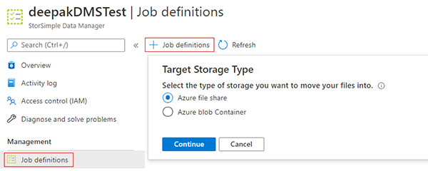
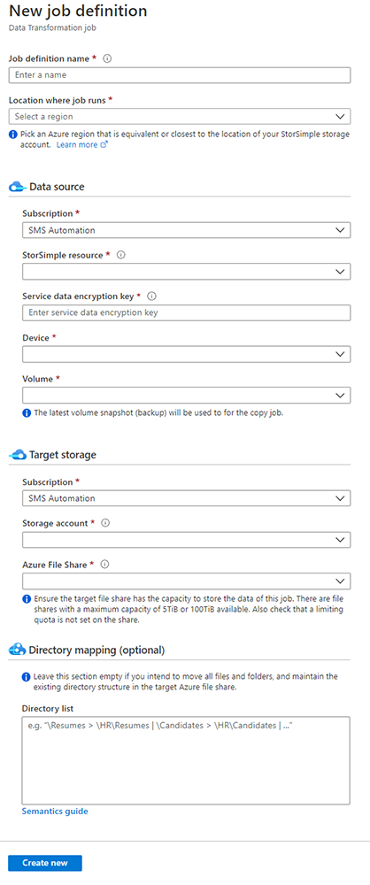

# StorSimple 8100 and 8600 migration to Azure File Sync

The StorSimple 8000 series is represented by either the 8100 or the 8600 physical, on-premises appliances and their cloud service components. It's possible to migrate the data from either of these appliances to an Azure File Sync environment. Azure File Sync is the default and strategic long-term Azure service that StorSimple appliances can be migrated to.

The StorSimple 8000 series will reach its [end of life](https://support.microsoft.com/en-us/lifecycle/search?alpha=StorSimple%208000%20Series) in December 2022. It's important to begin planning your migration as soon as possible. This article provides the necessary background knowledge and migration steps for a successful migration to Azure File Sync.

## Phase 1: Prepare for migration

This section contains the steps you should take at the beginning of your migration from StorSimple volumes to Azure file shares.

### Inventory

When you begin planning your migration, first identify all the StorSimple appliances and volumes you need to migrate. After you've done that, you can decide on the best migration path for you.

* StorSimple physical appliances (8000 series) use this migration guide.
* Virtual appliances, [StorSimple 1200 series, use a different migration guide](storage-files-migration-storsimple-1200.md).

### Migration cost summary

Migrations to Azure file shares from StorSimple volumes via migration jobs in a StorSimple Data Manager resource are free of charge. Other costs might be incurred during and after a migration:

* **Network egress:** Your StorSimple files live in a storage account within a specific Azure region. If you provision the Azure file shares you migrate into a storage account that's located in the same Azure region, no egress cost will occur. You can move your files to a storage account in a different region as part of this migration. In that case, egress costs will apply to you.
* **Azure file share transactions:** When files are copied into an Azure file share (as part of a migration or outside of one), transaction costs apply as files and metadata are being written. As a best practice, start your Azure file share on the transaction optimized tier during the migration. Switch to your desired tier after the migration is finished. The following phases will call this out at the appropriate point.
* **Change an Azure file share tier:** Changing the tier of an Azure file share costs transactions. In most cases, it will be more cost efficient to follow the advice from the previous point.
* **Storage cost:** When this migration starts copying files into an Azure file share, Azure Files storage is consumed and billed. Migrated backups will become [Azure file share snapshots](storage-snapshots-files.md). File share snapshots only consume storage capacity for the differences they contain.
* **StorSimple:** Until you have a chance to deprovision the StorSimple devices and storage accounts, StorSimple cost for storage, backups, and appliances will continue to occur.

### Direct-share-access vs. Azure File Sync

Azure file shares open up a whole new world of opportunities for structuring your file services deployment. An Azure file share is just an SMB share in the cloud that you can set up to have users access directly over the SMB protocol with the familiar Kerberos authentication and existing NTFS permissions (file and folder ACLs) working natively. Learn more about [identity-based access to Azure file shares](storage-files-active-directory-overview.md).

An alternative to direct access is [Azure File Sync](../file-sync/file-sync-planning.md). Azure File Sync is a direct analog for StorSimple's ability to cache frequently used files on-premises.

Azure File Sync is a Microsoft cloud service, based on two main components:

* File synchronization and cloud tiering to create a performance access cache on any Windows Server.
* File shares as native storage in Azure that can be accessed over multiple protocols like SMB and file REST.

Azure file shares retain important file fidelity aspects on stored files like attributes, permissions, and timestamps. With Azure file shares, there's no longer a need for an application or service to interpret the files and folders stored in the cloud. You can access them natively over familiar protocols and clients like Windows File Explorer. Azure file shares allow you to store general-purpose file server data and application data in the cloud. Backup of an Azure file share is a built-in functionality and can be further enhanced by Azure Backup.

This article focuses on the migration steps. If you want to learn more about Azure File Sync before migrating, see the following articles:

* [Azure File Sync overview](../file-sync/file-sync-planning.md "Overview")
* [Azure File Sync deployment guide](../file-sync/file-sync-deployment-guide.md)

### StorSimple service data encryption key

When you first set up your StorSimple appliance, it generated a "service data encryption key" and instructed you to securely store the key. This key is used to encrypt all data in the associated Azure storage account where the StorSimple appliance stores your files.

The "service data encryption key" is necessary for a successful migration. Now is a good time to retrieve this key from your records, one for each of the appliances in your inventory.

If you can't find the keys in your records, you can generate a new key from the appliance. Each appliance has a unique encryption key.

#### Change the service data encryption key

[!INCLUDE [storage-files-migration-generate-key](../../../includes/storage-files-migration-generate-key.md)]

> [!CAUTION]
> When you're deciding how to connect to your StorSimple appliance, consider the following:
>
> * Connecting through an HTTPS session is the most secure and recommended option.
> * Connecting directly to the device serial console is secure, but connecting to the serial console over network switches is not.
> * HTTP session connections are an option but are *not encrypted*. They're not recommended unless they're used within in a closed, trusted network.

### StorSimple volume backups

StorSimple offers differential backups on the volume level. Azure file shares also have this ability, called share snapshots.
Your migration jobs can only move backups, not data from the live volume. So the most recent backup should always be on the list of backups moved in a migration.

Decide if you need to move any older backups during your migration.
Best practice is to keep this list as small as possible, so your migration jobs complete faster.

To identify critical backups that must be migrated, make a checklist of your backup policies. For instance:
* The most recent backup. (Note: The most recent backup should always be part of this list.)
* One backup a month for 12 months.
* One backup a year for three years. 

Later on, when you create your migration jobs, you can use this list to identify the exact StorSimple volume backups that must be migrated to satisfy the requirements on your list.

> [!CAUTION]
> Selecting more than **50** StorSimple volume backups is not supported.
> Your migration jobs can only move backups, never data from the live volume. Therefore the most recent backup is closest to the live data and thus should always be part of the list of backups to be moved in a migration.

### Map your existing StorSimple volumes to Azure file shares

[!INCLUDE [storage-files-migration-namespace-mapping](../../../includes/storage-files-migration-namespace-mapping.md)]

### Number of storage accounts

Your migration will likely benefit from a deployment of multiple storage accounts that each hold a smaller number of Azure file shares.

If your file shares are highly active (utilized by many users or applications), two Azure file shares might reach the performance limit of your storage account. Because of this, the best practice is to migrate to multiple storage accounts, each with their own individual file shares, and typically no more than two or three shares per storage account.

A best practice is to deploy storage accounts with one file share each. You can pool multiple Azure file shares into the same storage account, if you have archival shares in them.

These considerations apply more to [direct cloud access](#direct-share-access-vs-azure-file-sync) (through an Azure VM or service) than to Azure File Sync. If you plan to exclusively use Azure File Sync on these shares, grouping several into a single Azure storage account is fine. In the future, you may want to lift and shift an app into the cloud that would then directly access a file share, this scenario would benefit from having higher IOPS and throughput. Or you could start using a service in Azure that would also benefit from having higher IOPS and throughput.

If you've made a list of your shares, map each share to the storage account where it will reside.

> [!IMPORTANT]
> Decide on an Azure region, and ensure each storage account and Azure File Sync resource matches the region you selected.
> Don't configure network and firewall settings for the storage accounts now. Making these configurations at this point would make a migration impossible. Configure these Azure storage settings after the migration is complete.

### Phase 1 summary

At the end of Phase 1:

* You have a good overview of your StorSimple devices and volumes.
* The Data Manager service is ready to access your StorSimple volumes in the cloud because you've retrieved your "service data encryption key" for each StorSimple device.
* You have a plan for which volumes and backups (if any beyond the most recent) need to be migrated.
* You know how to map your volumes to the appropriate number of Azure file shares and storage accounts.

## Phase 2: Deploy Azure storage and migration resources

This section discusses considerations around deploying the different resource types that are needed in Azure. Some will hold your data post migration, and some are needed solely for the migration. Don't start deploying resources until you've finalized your deployment plan. It's difficult, sometimes impossible, to change certain aspects of your Azure resources after they've been deployed.

### Deploy storage accounts

You'll likely need to deploy several Azure storage accounts. Each one will hold a smaller number of Azure file shares, as per your deployment plan, completed in the previous section of this article. Go to the Azure portal to [deploy your planned storage accounts](../common/storage-account-create.md#create-a-storage-account). Consider adhering to the following basic settings for any new storage account.

> [!IMPORTANT]
> Do not configure network and firewall settings for your storage accounts now. Making those configurations at this point would make a migration impossible. Configure these Azure storage settings after the migration is complete.

#### Subscription

You can use the same subscription you used for your StorSimple deployment or a different one. The only limitation is that your subscription must be in the same Azure Active Directory tenant as the StorSimple subscription. Consider moving the StorSimple subscription to the appropriate tenant before you start a migration. You can only move the entire subscription, individual StorSimple resources can't be moved to a different tenant or subscription.

#### Resource group

Resource groups are assisting with organization of resources and admin management permissions. Find out more about [resource groups in Azure](../../azure-resource-manager/management/manage-resource-groups-portal.md#what-is-a-resource-group).

#### Storage account name

The name of your storage account will become part of a URL and has certain character limitations. In your naming convention, consider that storage account names have to be unique in the world, allow only lowercase letters and numbers, require between 3 to 24 characters, and don't allow special characters like hyphens or underscores. For more information, see [Azure storage resource naming rules](../../azure-resource-manager/management/resource-name-rules.md#microsoftstorage).

#### Location

The location or Azure region of a storage account is very important. If you use Azure File Sync, all of your storage accounts must be in the same region as your Storage Sync Service resource. The Azure region you pick should be close or central to your local servers and users. After your resource has been deployed, you can't change its region.

You can pick a different region from where your StorSimple data (storage account) currently resides.

> [!IMPORTANT]
> If you pick a different region from your current StorSimple storage account location, [egress charges will apply](https://azure.microsoft.com/pricing/details/bandwidth) during the migration. Data will leave the StorSimple region and enter your new storage account region. No bandwidth charges apply if you stay within the same Azure region.

#### Performance

You have the option to pick premium storage (SSD) for Azure file shares or standard storage. Standard storage includes [several tiers for a file share](storage-how-to-create-file-share.md#change-the-tier-of-an-azure-file-share). Standard storage is the right option for most customers migrating from StorSimple.

Still not sure?

* Choose premium storage if you need the [performance of a premium Azure file share](understanding-billing.md#provisioned-model).
* Choose standard storage for general-purpose file server workloads, which includes hot data and archive data. Also choose standard storage if the only workload on the share in the cloud will be Azure File Sync.

#### Account kind

* For standard storage, choose *StorageV2 (general purpose v2)*.
* For premium file shares, choose *FileStorage*.

#### Replication

There are several replication settings available. Learn more about the different replication types.

Only choose from either of the following two options:

* *Locally redundant storage (LRS)*.
* *Zone redundant storage (ZRS)*, which isn't available in all Azure regions.

> [!NOTE]
> Only LRS and ZRS redundancy types are compatible with the large 100-TiB-capacity Azure file shares.

Geo redundant storage (GRS) in all variations is currently not supported. You can switch your redundancy type later, and switch to GRS when support for it arrives in Azure.

#### Enable 100-TiB-capacity file shares

:::row:::
    :::column:::
        :::image type="content" source="media/storage-files-how-to-create-large-file-share/large-file-shares-advanced-enable.png" alt-text="An image showing the Advanced tab in the Azure portal for the creation of a storage account.":::
    :::column-end:::
    :::column:::
        Under the **Advanced** section of the new storage account wizard in the Azure portal, you can enable **Large file shares** support in this storage account. If this option isn't available to you, you most likely selected the wrong redundancy type. Ensure you only select LRS or ZRS for this option to become available.
    :::column-end:::
:::row-end:::

Opting for the large, 100-TiB-capacity file shares has several benefits:

* Your performance is greatly increased as compared to the smaller 5-TiB-capacity file shares (for example, 10 times the IOPS).
* Your migration will finish significantly faster.
* You ensure that a file share will have enough capacity to hold all the data you'll migrate into it, including the storage capacity differential backups require.
* Future growth is covered.

### Azure file shares

After your storage accounts are created, go to the **File share** section of the storage account and deploy the appropriate number of Azure file shares as per your migration plan from Phase 1. Consider adhering to the following basic settings for your new file shares in Azure.

:::row:::
    :::column:::
        :::image type="content" source="media/storage-files-migration-storsimple-8000/storage-files-migration-storsimple-8000-new-share.png" alt-text="An Azure portal screenshot showing the new file share UI.":::
    :::column-end:::
    :::column:::
        </br>**Name**</br>Lowercase letters, numbers, and hyphens are supported.</br></br>**Quota**</br>Quota here is comparable to an SMB hard quota on a Windows Server instance. The best practice is to not set a quota here because your migration and other services will fail when the quota is reached.</br></br>**Tiers**</br>Select **Transaction optimized** for your new file share. During the migration, many transactions will occur. Its more cost efficient to change your tier later to the tier best suited to your workload.
    :::column-end:::
:::row-end:::

### StorSimple Data Manager

The Azure resource that will hold your migration jobs is called a **StorSimple Data Manager**. Select **New resource**, and search for it. Then select **Create**.

This temporary resource is used for orchestration. You deprovision it after your migration completes. It should be deployed in the same subscription, resource group, and region as your StorSimple storage account.

### Azure File Sync

With Azure File Sync, you can add on-premises caching of the most frequently accessed files. Similar to the caching abilities of StorSimple, the Azure File Sync cloud tiering feature offers local-access latency in combination with improved control over the available cache capacity on the Windows Server instance and multi-site sync. If having an on-premises cache is your goal, then in your local network, prepare a Windows Server VM (physical servers and failover clusters are also supported) with sufficient direct-attached storage capacity.

> [!IMPORTANT]
> Don't set up Azure File Sync yet. It's best to set up Azure File Sync after the migration of your share is complete. Deploying Azure File Sync shouldn't start before Phase 4 of a migration.

### Phase 2 summary

At the end of Phase 2, you'll have deployed your storage accounts and all Azure file shares across them. You'll also have a StorSimple Data Manager resource. You'll use the latter in Phase 3 when you configure your migration jobs.

## Phase 3: Create and run a migration job

This section describes how to set up a migration job and carefully map the directories on a StorSimple volume that should be copied into the target Azure file share you select. To get started, go to your StorSimple Data Manager, find **Job definitions** on the menu, and select **+ Job definition**. The correct target storage type is the default: **Azure file share**.



:::row:::
    :::column:::
        
    :::column-end:::
    :::column:::
        **Job definition name**</br>This name should indicate the set of files you're moving. Giving it a similar name as your Azure file share is a good practice. </br></br>**Location where the job runs**</br>When selecting a region, you must select the same region as your StorSimple storage account or, if that isn't available, then a region close to it. </br></br><h3>Source</h3>**Source subscription**</br>Select the subscription in which you store your StorSimple Device Manager resource. </br></br>**StorSimple resource**</br>Select your StorSimple Device Manager your appliance is registered with. </br></br>**Service data encryption key**</br>Check this [prior section in this article](#storsimple-service-data-encryption-key) in case you can't locate the key in your records. </br></br>**Device**</br>Select your StorSimple device that holds the volume where you want to migrate. </br></br>**Volume**</br>Select the source volume. Later you'll decide if you want to migrate the whole volume or subdirectories into the target Azure file share.</br></br> **Volume backups**</br>You can select *Select volume backups* to choose specific backups to move as part of this job. An upcoming, [dedicated section in this article](#selecting-volume-backups-to-migrate) covers the process in detail.</br></br><h3>Target</h3>Select the subscription, storage account, and Azure file share as the target of this migration job.</br></br><h3>Directory mapping</h3>[A dedicated section in this article](#directory-mapping), discusses all relevant details.
    :::column-end:::
:::row-end:::

### Selecting volume backups to migrate

There are important aspects around choosing backups that need to be migrated:

- Your migration jobs can only move backups, not data from a live volume. So the most recent backup is closest to the live data and should always be on the list of backups moved in a migration.
- Make sure your latest backup is recent to keep the delta to the live share as small as possible. It could be worth manually triggering and completing another volume backup before creating a migration job. A small delta to the live share will improve your migration experience. If this delta can be zero = no more changes to the StorSimple volume happened after the newest backup was taken in your list - then Phase 5: User cut-over will be drastically simplified and sped up.
- Backups must be played back into the Azure file share **from oldest to newest**. An older backup cannot be "sorted into" the list of backups on the Azure file share after a migration job has run. Therefore you must ensure that your list of backups is complete *before* you create a job. 
- This list of backups in a job cannot be modified once the job is created - even if the job never ran. 

:::row:::
    :::column:::        
        :::image type="content" source="media/storage-files-migration-storsimple-8000/storage-files-migration-storsimple-8000-job-select-backups.png" alt-text="A screenshot of the new job creation form detailing the portion where StorSimple backups are selected for migration." lightbox="media/storage-files-migration-storsimple-8000/storage-files-migration-storsimple-8000-job-select-backups-expanded.png":::
    :::column-end:::
    :::column:::
        To select backups of your StorSimple volume for your migration job, select the *Select volume backups* on the job creation form.
    :::column-end:::
:::row-end:::
:::row:::
    :::column:::
        :::image type="content" source="media/storage-files-migration-storsimple-8000/storage-files-migration-storsimple-8000-job-select-backups-annotated.png" alt-text="An image showing that the upper half of the blade for selecting backups lists all available backups. A selected backup will be grayed-out in this list and added to a second list on the lower half of the blade. There it can also be deleted again." lightbox="media/storage-files-migration-storsimple-8000/storage-files-migration-storsimple-8000-job-select-backups-annotated.png":::
    :::column-end:::
    :::column:::
        When the backup selection blade opens, it is separated into two lists. In the first list, all available backups are displayed. You can expand and narrow the result set by filtering for a specific time range. (see next section) </br></br>A selected backup will display as grayed-out and it is added to a second list on the lower half of the blade. The second list displays all the backups selected for migration. A backup selected in error can also be removed again.
        > [!CAUTION]
        > You must select **all** backups you wish to migrate. You cannot add older backups later on. You cannot modify the job to change your selection once the job is created.
    :::column-end:::
:::row-end:::
:::row:::
    :::column:::
        :::image type="content" source="media/storage-files-migration-storsimple-8000/storage-files-migration-storsimple-8000-job-select-backups-time.png" alt-text="A screenshot showing the selection of a time range of the backup selection blade." lightbox="media/storage-files-migration-storsimple-8000/storage-files-migration-storsimple-8000-job-select-backups-time-expanded.png":::
    :::column-end:::
    :::column:::
        By default, the list is filtered to show the StorSimple volume backups within the past seven days to make it easy to select the most recent backup. For backups further in the past, use the time range filter at the top of the blade. You can either select from an existing filter or set a custom time range to filter for only the backups taken during this period.
    :::column-end:::
:::row-end:::

> [!CAUTION]
> Selecting more than 50 StorSimple volume backups is not supported. Jobs with a large number of backups may fail.

### Directory mapping

Directory mapping is optional for your migration job. If you leave the section empty, *all* the files and folders on the root of your StorSimple volume will be moved into the root of your target Azure file share. In most cases, storing an entire volume's content in an Azure file share isn't the best approach. It's often better to split a volume's content across multiple file shares in Azure. If you haven't made a plan already, see [Map your StorSimple volume to Azure file shares](#map-your-existing-storsimple-volumes-to-azure-file-shares) first.

As part of your migration plan, you might have decided that the folders on a StorSimple volume need to be split across multiple Azure file shares. If that's the case, you can accomplish that split by:

1. Defining multiple jobs to migrate the folders on one volume. Each will have the same StorSimple volume source but a different Azure file share as the target.
1. Specifying precisely which folders from the StorSimple volume need to be migrated into the specified file share by using the **Directory mapping** section of the job creation form and following the specific [mapping semantics](#semantic-elements).

> [!IMPORTANT]
> The paths and mapping expressions in this form can't be validated when the form is submitted. If mappings are specified incorrectly, a job might either fail completely or produce an undesirable result. In that case, it's usually best to delete the Azure file share, re-create it, and then fix the mapping statements in a new migration job for the share. Running a new job with fixed mapping statements can fix omitted folders and bring them into the existing share. However, only folders that were omitted because of path misspellings can be addressed this way.

#### Semantic elements

A mapping is expressed from left to right: [\source path] \> [\target path].

|Semantic character          | Meaning  |
|:---------------------------|:---------|
| **\\**                     | Root level indicator.       |
| **\>**                     | [Source] and [target-mapping] operator.     |
|**\|** or RETURN (new line) | Separator of two folder-mapping instructions. </br>Alternatively, you can omit this character and select **Enter** to get the next mapping expression on its own line.        |

### Examples
Moves the content of folder *User data* to the root of the target file share:
``` console
\User data > \
```
Moves the entire volume content into a new path on the target file share:
``` console
\ > \Apps\HR tracker
```
Moves the source folder content into a new path on the target file share:
``` console
\HR resumes-Backup > \Backups\HR\resumes
```
Sorts multiple source locations into a new directory structure:
``` console
\HR\Candidate Tracker\v1.0 > \Apps\Candidate tracker
\HR\Candidates\Resumes > \HR\Candidates\New
\Archive\HR\Old Resumes > \HR\Candidates\Archived
```

### Semantic rules

* Always specify folder paths relative to the root level.
* Begin each folder path with a root level indicator "\\".
* Don't include drive letters.
* When specifying multiple paths, source or target paths can't overlap:</br>
   Invalid source path overlap example:</br>
    *\\folder\1 > \\folder*</br>
    *\\folder\\1\\2 > \\folder2*</br>
   Invalid target path overlap example:</br>
   *\\folder > \\*</br>
   *\\folder2 > \\*</br>
* Source folders that don't exist will be ignored.
* Folder structures that don't exist on the target will be created.
* Like Windows, folder names are case insensitive but case preserving.

> [!NOTE]
> Contents of the *\System Volume Information* folder and the *$Recycle.Bin* on your StorSimple volume won't be copied by the migration job.

### Run a migration job

Your migration jobs are listed under *Job definitions* in the Data Manager resource you've deployed to a resource group.
From the list of job definitions, select the job you want to run.

In the job blade that opens, you can see your job runs in the lower list. Initially, this list will be empty. At the top of the blade, there is a command called *Run job*. This command will not immediately run the job, it opens the **Job run** blade:

:::row:::
    :::column:::
        :::image type="content" source="media/storage-files-migration-storsimple-8000/storage-files-migration-storsimple-8000-run-job.png" alt-text="An image showing the job run blade with a dropdown control opened, displaying the selected backups to be migrated. The oldest backup is highlighted, it needs to be selected first." lightbox="media/storage-files-migration-storsimple-8000/storage-files-migration-storsimple-8000-run-job-expanded.png":::
    :::column-end:::
    :::column:::
        In this release, each job must be run several times. </br></br>**You must start with the oldest backup from your list of backups you wish to migrate.** (highlighted in the image)</br></br>You run the job again, as many times as you have backups selected, each time against a progressively newer backup.
        </br></br>
        > [!CAUTION]
        > It is imperative that you run the migration job with the oldest backup selected first and then again, each time with a progressively newer backup. You always must maintain the order of your backups manually - from oldest to newest.
    :::column-end:::
:::row-end:::

### Phase 3 summary

At the end of Phase 3, you'll have run at least one of your migration jobs from StorSimple volumes into Azure file share(s). You will have run the same migration job several time, from oldest to newest backups that must be migrated. You can now focus on either setting up Azure File Sync for the share (once migration jobs for a share have completed) or directing share access for your information workers and apps to the Azure file share.

## Phase 4: Access your Azure file shares

There are two main strategies for accessing your Azure file shares:

* **Azure File Sync**: [Deploy Azure File Sync](#deploy-azure-file-sync) to an on-premises Windows Server instance. Azure File Sync has all the advantages of a local cache, just like StorSimple.
* **Direct-share-access**: [Deploy direct-share-access](#deploy-direct-share-access). Use this strategy if your access scenario for a given Azure file share won't benefit from local caching, or you no longer have an ability to host an on-premises Windows Server instance. Here, your users and apps will continue to access SMB shares over the SMB protocol. These shares are no longer on an on-premises server but directly in the cloud.

You should have already decided which option is best for you in [Phase 1](#phase-1-prepare-for-migration) of this guide.

The remainder of this section focuses on deployment instructions.

### Deploy Azure File Sync

It's time to deploy a part of Azure File Sync.

1. Create the Azure File Sync cloud resource.
1. Deploy the Azure File Sync agent on your on-premises server.
1. Register the server with the cloud resource.

Don't create any sync groups yet. Setting up sync with an Azure file share should only occur after your migration jobs to an Azure file share have completed. If you started using Azure File Sync before your migration completed, it would make your migration unnecessarily difficult since you couldn't easily tell when it was time to initiate a cut-over.

#### Deploy the Azure File Sync cloud resource

[!INCLUDE [storage-files-migration-deploy-afs-sss](../../../includes/storage-files-migration-deploy-azure-file-sync-storage-sync-service.md)]

> [!TIP]
> If you want to change the Azure region your data resides in after the migration is finished, deploy the Storage Sync Service in the same region as the target storage accounts for this migration.

#### Deploy an on-premises Windows Server instance

* Create Windows Server 2019 (at a minimum 2012R2) as a virtual machine or physical server. A Windows Server failover cluster is also supported. Don't reuse the server fronting the StorSimple 8100 or 8600.
* Provision or add direct-attached storage. Network-attached storage isn't supported.

It's best practice to give your new Windows Server instance an equal or larger amount of storage than your StorSimple 8100 or 8600 appliance has locally available for caching. You'll use the Windows Server instance the same way you used the StorSimple appliance. If it has the same amount of storage as the appliance, the caching experience should be similar, if not the same. You can add or remove storage from your Windows Server instance at will. This capability enables you to scale your local volume size and the amount of local storage available for caching.

#### Prepare the Windows Server instance for file sync

[!INCLUDE [storage-files-migration-deploy-afs-agent](../../../includes/storage-files-migration-deploy-azure-file-sync-agent.md)]

#### Configure Azure File Sync on the Windows Server instance

Your registered on-premises Windows Server instance must be ready and connected to the internet for this process.

> [!IMPORTANT]
> Your StorSimple migration of files and folders into the Azure file share must be complete before you proceed. Make sure there are no more changes done to the file share.

[!INCLUDE [storage-files-migration-configure-sync](../../../includes/storage-files-migration-configure-sync.md)]

> [!IMPORTANT]
> Be sure to turn on cloud tiering. Cloud tiering is the Azure File Sync feature that allows the local server to have less storage capacity than is stored in the cloud, yet have the full namespace available. Locally interesting data is also cached locally for fast, local access performance. Another reason to turn on cloud tiering at this step is that we don't want to sync file content at this stage. Only the namespace should be moving at this time.

### Deploy direct-share-access

:::row:::
    :::column:::
        <iframe width="560" height="315" src="https://www.youtube-nocookie.com/embed/jd49W33DxkQ" frameborder="0" allow="accelerometer; autoplay; clipboard-write; encrypted-media; gyroscope; picture-in-picture" allowfullscreen></iframe>
    :::column-end:::
    :::column:::
        This video is a guide and demo for how to securely expose Azure file shares directly to information workers and apps in five simple steps.</br>
        The video references dedicated documentation for some topics:

* [Identity overview](storage-files-active-directory-overview.md)
* [How to domain join a storage account](storage-files-identity-auth-active-directory-enable.md)
* [Networking overview for Azure file shares](storage-files-networking-overview.md)
* [How to configure public and private endpoints](storage-files-networking-endpoints.md)
* [How to configure a S2S VPN](storage-files-configure-s2s-vpn.md)
* [How to configure a Windows P2S VPN](storage-files-configure-p2s-vpn-windows.md)
* [How to configure a Linux P2S VPN](storage-files-configure-p2s-vpn-linux.md)
* [How to configure DNS forwarding](storage-files-networking-dns.md)
* [Configure DFS-N](/windows-server/storage/dfs-namespaces/dfs-overview)
   :::column-end:::
:::row-end:::

### Phase 4 summary

In this phase, you've created and run multiple migration jobs in your StorSimple Data Manager. Those jobs have migrated your files and folders to Azure file shares. You've also deployed Azure File Sync or prepared your network and storage accounts for direct-share-access.

## Phase 5: User cut-over

This phase is all about wrapping up your migration:

* Plan your downtime.
* Catch up with any changes your users and apps produced on the StorSimple side while the migration jobs in Phase 3 have been running.
* Fail your users over to the new Windows Server instance with Azure File Sync or the Azure file shares via direct-share-access.

### Plan your downtime

This migration approach requires some downtime for your users and apps. The goal is to keep downtime to a minimum. The following considerations can help:

* Keep your StorSimple volumes available while running your migration jobs.
* When you've finished running your data migration jobs for a share, it's time to remove user access (at least write access) from the StorSimple volumes or shares. A final RoboCopy will catch up your Azure file share. Then you can cut over your users. Where you run RoboCopy depends on whether you chose to use Azure File Sync or direct-share-access. The upcoming section on RoboCopy covers that subject.
* After you've completed the RoboCopy catch-up, you're ready to expose the new location to your users by either the Azure file share directly or an SMB share on a Windows Server instance with Azure File Sync. Often a DFS-N deployment will help accomplish a cut-over quickly and efficiently. It will keep your existing share addresses consistent and repoint to a new location that contains your migrated files and folders.

### Determine when your namespace has fully synced to your server

When you use Azure File Sync for an Azure file share, it's important that you determine your entire namespace has finished downloading to the server *before* you start any local RoboCopy. The time it takes to download your namespace depends on the number of items in your Azure file share. There are two methods for determining whether your namespace has fully arrived on the server.

#### Azure portal

You can use the Azure portal to see when your namespace has fully arrived.

* Sign in to the Azure portal, and go to your sync group. Check the sync status of your sync group and server endpoint.
* The interesting direction is download. If the server endpoint is newly provisioned, it will show **Initial sync**, which indicates the namespace is still coming down.
After that changes to anything but **Initial sync**, your namespace will be fully populated on the server. You can now proceed with a local RoboCopy.

#### Windows Server Event Viewer

You can also use the Event Viewer on your Windows Server instance to tell when the namespace has fully arrived.

1. Open the **Event Viewer**, and go to **Applications and Services**.
1. Go to and open **Microsoft\FileSync\Agent\Telemetry**.
1. Look for the most recent **event 9102**, which corresponds to a completed sync session.
1. Select **Details**, and confirm that you're looking at an event where the **SyncDirection** value is **Download**.
1. For the time where your namespace has completed download to the server, there will be a single event with **Scenario**, the value **FullGhostedSync**, and **HResult** = **0**.
1. If you miss that event, you can also look for other **9102 events** with **SyncDirection** = **Download** and **Scenario** = **"RegularSync"**. Finding one of these events also indicates that the namespace has finished downloading and sync progressed to regular sync sessions, whether there's anything to sync or not at this time.

### A final RoboCopy

At this point, there are differences between your on-premises Windows Server instance and the StorSimple 8100 or 8600 appliance.

1. You need to catch up with the changes that users or apps produced on the StorSimple side while the migration was ongoing.
1. For cases where you use Azure File Sync: The StorSimple appliance has a populated cache versus the Windows Server instance with just a namespace with no file content stored locally at this time. The final RoboCopy can help jump-start your local Azure File Sync cache by pulling over locally cached file content as much as is available and can fit on the Azure File Sync server.
1. Some files might have been left behind by the migration job because of invalid characters. If so, copy them to the Azure File Sync-enabled Windows Server instance. Later on, you can adjust them so that they will sync. If you don't use Azure File Sync for a particular share, you're better off renaming the files with invalid characters on the StorSimple volume. Then run the RoboCopy directly against the Azure file share.

> [!WARNING]
> Robocopy in Windows Server 2019 currently experiences an issue that will cause files tiered by Azure File Sync on the target server to be recopied from the source and re-uploaded to Azure when using the /MIR function of robocopy. It is imperative that you use Robocopy on a Windows Server other than 2019. A preferred choice is Windows Server 2016. This note will be updated should the issue be resolved via Windows Update.

> [!WARNING]
> You *must not* start the RoboCopy before the server has the namespace for an Azure file share downloaded fully. For more information, see [Determine when your namespace has fully downloaded to your server](#determine-when-your-namespace-has-fully-synced-to-your-server).

 You only want to copy files that were changed after the migration job last ran and files that haven't moved through these jobs before. You can solve the problem as to why they didn't move later on the server, after the migration is complete. For more information, see [Azure File Sync troubleshooting](../file-sync/file-sync-troubleshoot.md#how-do-i-see-if-there-are-specific-files-or-folders-that-are-not-syncing).

RoboCopy has several parameters. The following example showcases a finished command and a list of reasons for choosing these parameters.

```console
Robocopy /MT:16 /UNILOG:<file name> /TEE /NP /B /MIR /IT /COPYALL /DCOPY:DAT <SourcePath> <Dest.Path>
```

Background:

:::row:::
   :::column span="1":::
      /MT
   :::column-end:::
   :::column span="1":::
      Allows for RoboCopy to run multi-threaded. Default is 8, and the maximum is 128.
   :::column-end:::
:::row-end:::
:::row:::
   :::column span="1":::
      /UNILOG:<file name>
   :::column-end:::
   :::column span="1":::
      Outputs status to LOG file as UNICODE (overwrites existing log).
   :::column-end:::
:::row-end:::
:::row:::
   :::column span="1":::
      /TEE
   :::column-end:::
   :::column span="1":::
      Outputs to console window. Used in conjunction with output to a log file.
   :::column-end:::
:::row-end:::
:::row:::
   :::column span="1":::
      /NP
   :::column-end:::
   :::column span="1":::
      Omits the logging of progress to keep the log readable.
   :::column-end:::
:::row-end:::
:::row:::
   :::column span="1":::
      /B
   :::column-end:::
   :::column span="1":::
      Runs RoboCopy in the same mode a backup application would use. It allows RoboCopy to move files that the current user doesn't have permissions to.
   :::column-end:::
:::row-end:::
:::row:::
   :::column span="1":::
      /MIR
   :::column-end:::
   :::column span="1":::
      Allows for RoboCopy to only consider deltas between source (StorSimple appliance) and target (Windows Server directory).
   :::column-end:::
:::row-end:::
:::row:::
   :::column span="1":::
      /IT
   :::column-end:::
   :::column span="1":::
      Ensures fidelity is preserved in certain mirror scenarios.</br>Example: Between two Robocopy runs a file experiences an ACL change and an attribute update, for instance it is also marked *hidden*. Without /IT the ACL change can be missed by Robocopy and thus not transferred to the target location.
   :::column-end:::
:::row-end:::
:::row:::
   :::column span="1":::
      /COPY:copyflag[s]
   :::column-end:::
   :::column span="1":::
      Fidelity of the file copy (default is /COPY:DAT), copy flags: D=Data, A=Attributes, T=Timestamps, S=Security=NTFS ACLs, O=Owner information, U=aUditing information.
   :::column-end:::
:::row-end:::
:::row:::
   :::column span="1":::
      /COPYALL
   :::column-end:::
   :::column span="1":::
      COPY ALL file information (equivalent to /COPY:DATSOU).
   :::column-end:::
:::row-end:::
:::row:::
   :::column span="1":::
      /DCOPY:copyflag[s]
   :::column-end:::
   :::column span="1":::
      Fidelity for the copy of directories (default is /DCOPY:DA), copy flags: D=Data, A=Attributes, T=Timestamps.
   :::column-end:::
:::row-end:::

When you configure source and target locations of the RoboCopy command, make sure you review the structure of the source and target to ensure they match. If you used the directory-mapping feature of the migration job, your root-directory structure might be different than the structure of your StorSimple volume. If that's the case, you might need multiple RoboCopy jobs, one for each subdirectory. If you unsure if the command will perform as expected, you can use the */L* parameter, which will simulate the command without actually making any changes.

This RoboCopy command uses /MIR, so it won't move files that are the same (tiered files, for instance). But if you get the source and target path wrong, /MIR also purges directory structures on your Windows Server instance or Azure file share that aren't present on the StorSimple source path. They must match exactly for the RoboCopy job to reach its intended goal of updating your migrated content with the latest changes made while the migration is ongoing.

Consult the RoboCopy log file to see if files have been left behind. If issues exist, fix them, and rerun the RoboCopy command. Don't deprovision any StorSimple resources before you fix outstanding issues for files or folders you care about.

If you don't use Azure File Sync to cache the particular Azure file share in question but instead opted for direct-share-access:

1. [Mount your Azure file share](storage-how-to-use-files-windows.md#mount-the-azure-file-share) as a network drive to a local Windows machine.
1. Perform the RoboCopy between your StorSimple and the mounted Azure file share. If files don't copy, fix up their names on the StorSimple side to remove invalid characters. Then retry RoboCopy. The previously listed RoboCopy command can be run multiple times without causing unnecessary recall to StorSimple.

### User cut-over

If you use Azure File Sync, you likely need to create the SMB shares on that Azure File Sync-enabled Windows Server instance that match the shares you had on the StorSimple volumes. You can front-load this step and do it earlier to not lose time here. But you must ensure that before this point, nobody has access to cause changes to the Windows Server instance.

If you have a DFS-N deployment, you can point the DFN-Namespaces to the new server folder locations. If you don't have a DFS-N deployment, and you fronted your 8100 or 8600 appliance locally with a Windows Server instance, you can take that server off the domain. Then domain join your new Azure File Sync-enabled Windows Server instance. During that process, give the server the same server name and share names as the old server so that cut-over remains transparent for your users, group policy, and scripts.

Learn more about [DFS-N](/windows-server/storage/dfs-namespaces/dfs-overview).

## Deprovision

When you deprovision a resource, you lose access to the configuration of that resource and its data. Deprovisioning can't be undone. Don't proceed until you've confirmed that:

* Your migration is complete.
* There are no dependencies whatsoever on the StorSimple files, folders, or volume backups that you're about to deprovision.

Before you begin, it's a best practice to observe your new Azure File Sync deployment in production for a while. That time gives you the opportunity to fix any problems you might encounter. After you've observed your Azure File Sync deployment for at least a few days, you can begin to deprovision resources in this order:

1. Deprovision your StorSimple Data Manager resource via the Azure portal. All of your DTS jobs will be deleted with it. You won't be able to easily retrieve the copy logs. If they're important for your records, retrieve them before you deprovision.
1. Make sure that your StorSimple physical appliances have been migrated, and then unregister them. If you aren't completely sure that they've been migrated, don't proceed. If you deprovision these resources while they're still necessary, you won't be able to recover the data or their configuration.<br>Optionally you can first deprovision the StorSimple volume resource, which will clean up the data on the appliance. This can take several days and **will not** forensically zero out the data on the appliance. If this is important to you, handle disk zeroing separately from the resource deprovisioning and according to your policies.
1. If there are no more registered devices left in a StorSimple Device Manager, you can proceed to remove that Device Manager resource itself.
1. It's now time to delete the StorSimple storage account in Azure. Again, stop and confirm your migration is complete and that nothing and no one depends on this data before you proceed.
1. Unplug the StorSimple physical appliance from your data center.
1. If you own the StorSimple appliance, you're free to PC Recycle it. If your device is leased, inform the lessor and return the device as appropriate.

Your migration is complete.

> [!NOTE]
> Still have questions or encountered any issues?</br>
> We're here to help at AzureFilesMigration@microsoft.com.

## Next steps

* Get more familiar with [Azure File Sync: aka.ms/AFS](../file-sync/file-sync-planning.md).
* Understand the flexibility of [cloud tiering](../file-sync/file-sync-cloud-tiering-overview.md) policies.
* [Enable Azure Backup](../../backup/backup-afs.md#configure-backup-from-the-file-share-pane) on your Azure file shares to schedule snapshots and define backup retention schedules.
* If you see in the Azure portal that some files are permanently not syncing, review the [Troubleshooting guide](../file-sync/file-sync-troubleshoot.md) for steps to resolve these issues.