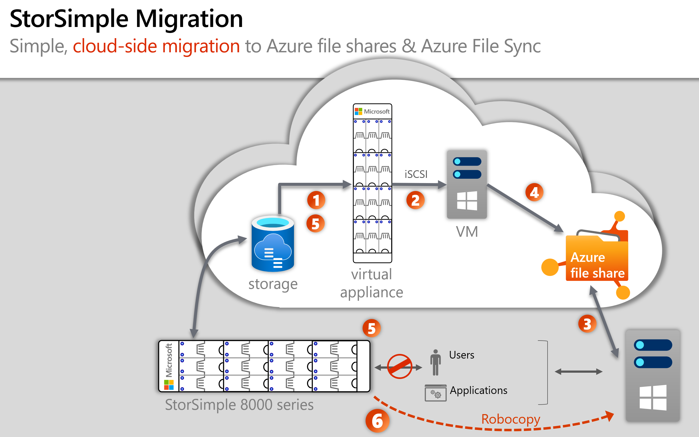
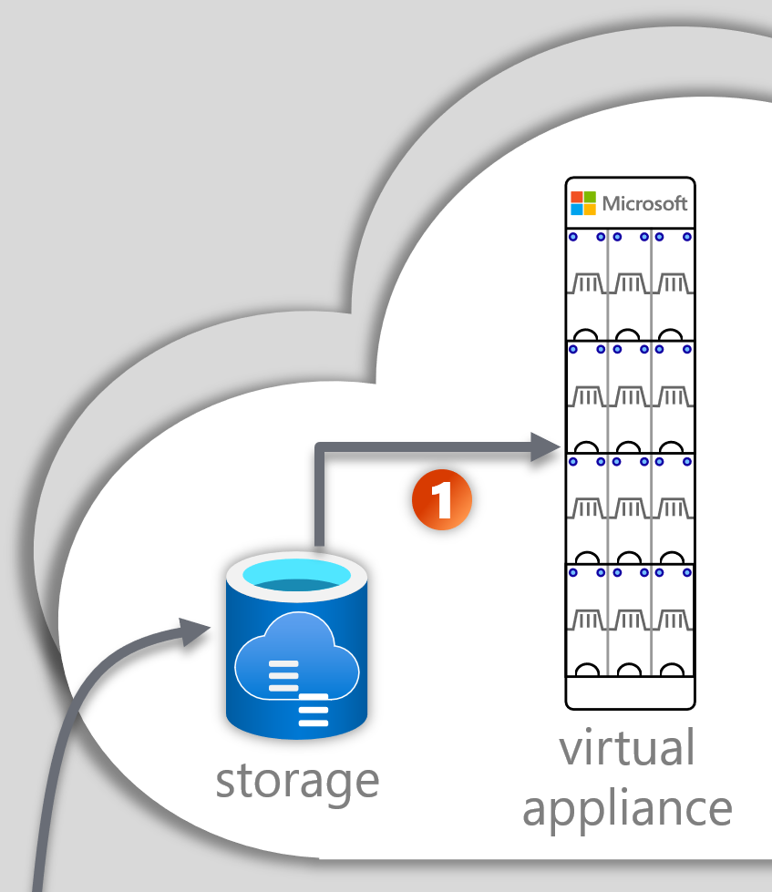
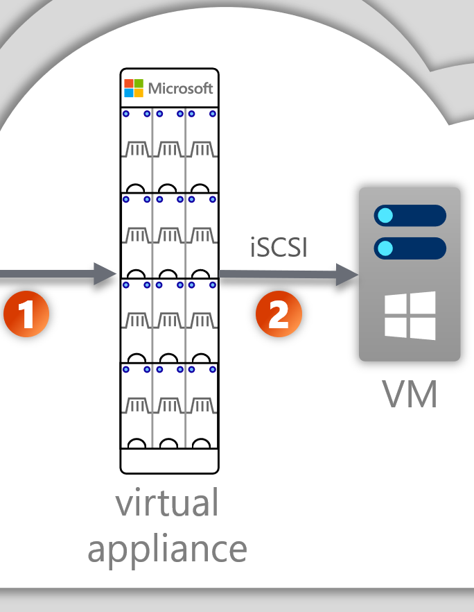
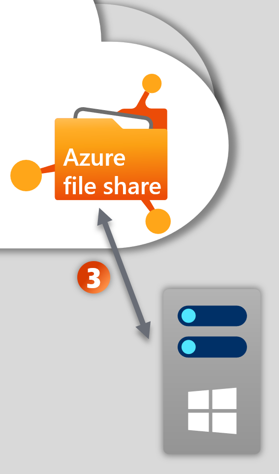
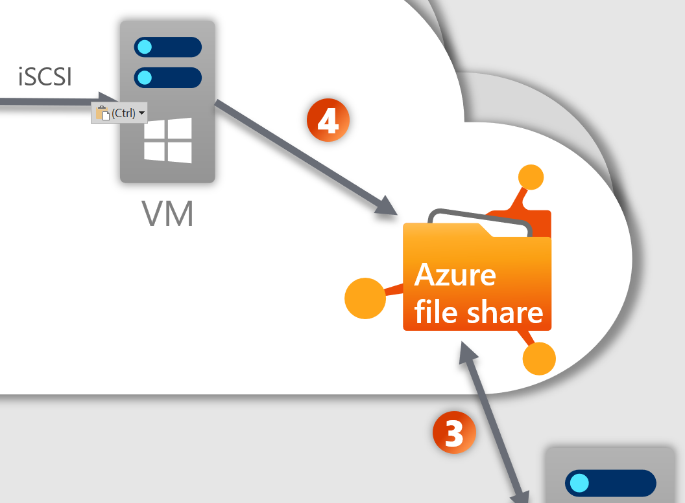
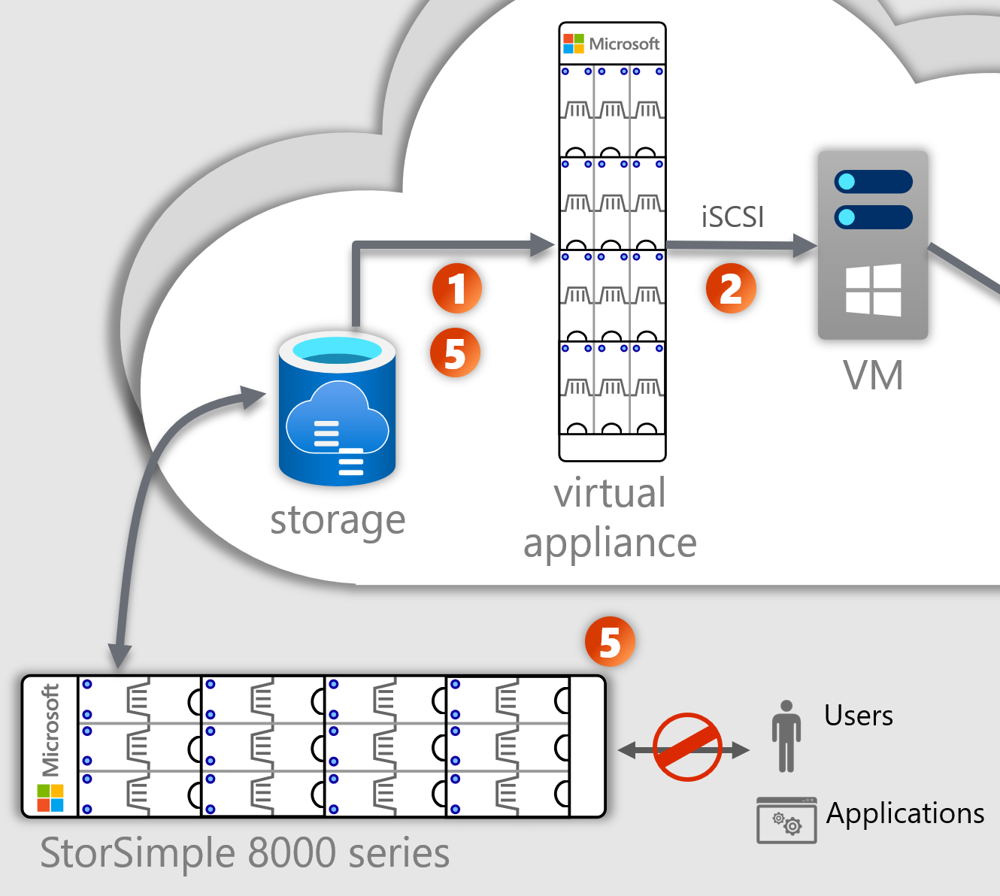
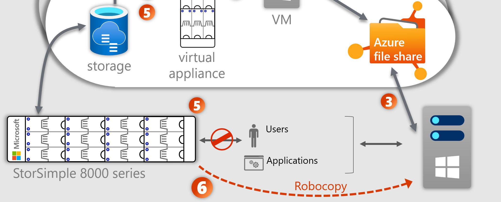

# StorSimple 8100 and 8600 migration to Azure File Sync

The StorSimple 8000 series is represented by either the 8100 or the 8600 physical, on-premises appliances, and their cloud service components. It is possible to migrate the data from either of these appliances to an Azure File Sync environment. Azure File Sync is the default and strategic long-term Azure service that StorSimple appliances can be migrated to.

StorSimple 8000 series will reach its [end-of-life](https://support.microsoft.com/en-us/lifecycle/search?alpha=StorSimple%208000%20Series) in December 2022. It is important to begin planning your migration as soon as possible. This article provides the necessary background knowledge and migrations steps for a successful migration to Azure File Sync. 

## Azure File Sync

> [!IMPORTANT]
> Microsoft is committed to assist customers in their migration. Email AzureFilesMigration@microsoft .com for a customized migration plan as well as assistance during the migration.

Azure File Sync is a Microsoft cloud service, based on two main components:

* File synchronization and cloud tiering.
* File shares as native storage in Azure, that can be accessed over multiple protocols like SMB and file REST. An Azure file share is comparable to a file share on a Windows Server, that you can natively mount as a network drive. It supports important file fidelity aspects like attributes, permissions, and timestamps. With Azure file shares, there is no longer a need for an application or service to interpret the files and folders stored in the cloud. You can access them natively over familiar protocols and clients like Windows File Explorer. That makes Azure file shares the ideal, and most flexible approach to store general purpose file server data as well as some application data, in the cloud.

This article focuses on the migration steps. If before migrating you'd like to learn more about Azure File Sync, we recommend the following articles:

* [Azure File Sync - overview](https://aka.ms/AFS "Overview")
* [Azure File Sync - deployment guide](storage-sync-files-deployment-guide.md)

## Migration goals

The goal is to guarantee the integrity of the production data as well as guaranteeing availability. The latter requires keeping downtime to a minimum, so that it can fit into or only slightly exceed regular maintenance windows.

## StorSimple 8000 series migration path to Azure File Sync

A local Windows Server is required to run an Azure File Sync agent. The Windows Server can be at a minimum a 2012R2 server but ideally is a Windows Server 2019.

There are numerous, alternative migration paths and it would create too long of an article to document all of them and illustrate why they bear risk or disadvantages over the route we recommend as a best practice in this article.



The previous image depicts phases that correspond to sections in this article.
We use a cloud-side migration to avoid unnecessary recall of files to your local StorSimple appliance. This approach avoids impacting local caching behavior or network bandwidth use, either of which can affect your production workloads.
A cloud-side migration is operating on a snapshot (a volume clone) of your data. So your production data is isolated from this process - until cut-over at the end of the migration. Working off of what is essentially a backup, makes the migration safe and easily repeatable, should you run into any difficulties.

## Considerations around existing StorSimple backups

StorSimple allows you to take backups in the form of volume clones. This article uses a new volume clone to migrate your live files.
If you need to migrate backups in addition to your live data, then all the guidance in this article still applies. The only difference is that instead of starting with a new volume clone, you will start with the oldest backup volume clone you need to migrate.

The sequence is as follows:

* Determine the minimum set of volume clones you must migrate. We recommend keeping this list to a minimum if possible, because the more backups you migrate the longer the overall migration process will take.
* When going through the migration process, begin with the oldest volume clone you intend to migrate and on each subsequent migration, use the next oldest.
* When each volume clone migration completes, you must take an Azure file share snapshot. [Azure file share snapshots](storage-snapshots-files.md) are how you keep point-in-time backups of the files and folder structure for your Azure file shares. You will need these snapshots after the migration completes, to ensure you have preserved versions of each of your volume clones as you progress through the migration.
* Ensure that you take Azure file share snapshots for all Azure file shares, that are served by the same StorSimple volume. Volume clones are on the volume level, Azure file share snapshots are on the share level. You must take a share snapshot (on each Azure file share) after the migration of a volume clone is finished.
* Repeat the migration process for a volume clone and taking share snapshots after each volume clone until you get caught up to a snapshot of the live data. The process of migrating a volume clone is described in the phases below. 

If you do not need to move backups at all and can start a new chain of backups on the Azure file share side after the migration of only the live data is done, then that is beneficial to reduce complexity in the migration and amount of time the migration will take. You can make the decision whether or not to move backups and how many for each volume (not each share) you have in StorSimple.

## Phase 1: Get ready

:::row:::
    :::column:::
        
    :::column-end:::
    :::column:::
        The basis for the migration is a volume clone and a virtual cloud appliance, called a StorSimple 8020.
This phase focuses on deployment of these resources in Azure.
    :::column-end:::
:::row-end:::

### Deploy a StorSimple 8020 virtual appliance

Deploying a cloud appliance is a process that requires security, networking, and a few other considerations.

> [!IMPORTANT]
> The following guide contains some unnecessary sections. Read and follow the article from the beginning up until "Step 3." Then return to this article. You do not need to complete "Step 3" or anything beyond it in that guide, at this time.

[Deployment of a StorSimple 8020 virtual appliance](../../storsimple/storsimple-8000-cloud-appliance-u2.md)

### Determine a volume clone to use

When you are ready to begin the migration, the first step is to take a new volume clone - just as you would for backup - that captures the current state of your StorSimple cloud storage. Take a clone for each of the StorSimple volumes you have.
If you are in need of moving backups, then the first volume clone you use is not a newly created clone but the oldest volume clone (oldest backup) you need to migrate.
Refer to the section ["Considerations around existing StorSimple backups"](#considerations-around-existing-storsimple-backups) for detailed guidance.

> [!IMPORTANT]
> The following guide contains some unnecessary sections. Read and follow only the steps outlined in the linked-to section. Then return to this article. You do not need to follow the "Next steps" section.

[Create a clone of a volume](../../storsimple/storsimple-8000-clone-volume-u2.md#create-a-clone-of-a-volume)

### Use the volume clone

The last phase of phase 1 is to make the volume clone you've chosen, available on the 8020 virtual appliance in Azure.

> [!IMPORTANT]
> The following guide contains the necessary steps but also - at the end - an instruction to format the volume. **DO NOT FORMAT THE VOLUME** Read and follow the linked-to "section 7" from the beginning up until instruction: "10. To format a simple volume, ..."  Stop before following this step and return to this article.

[Mount a volume clone on the 8020 virtual appliance in Azure](../../storsimple/storsimple-8000-deployment-walkthrough-u2.md#step-7-mount-initialize-and-format-a-volume)

### Phase 1 summary

Now that you've completed phase 1, you will have done the following:

* Deployed a StorSimple 8020 virtual appliance in Azure.
* Determined which volume clone you will begin the migration with.
* Mounted your volume clone(s) (one for each live volume) to the StorSimple virtual appliance in Azure, with its data available for further use.

## Phase 2: Cloud VM

:::row:::
    :::column:::
        
    :::column-end:::
    :::column:::
        After your initial clone is available on the StorSimple 8020 virtual appliance in Azure, it is now time to provision a VM and expose the volume clone (or multiple) to that VM over iSCSI.
    :::column-end:::
:::row-end:::

### Deploy an Azure VM

The Windows Server virtual machine in Azure is just like the StorSimple 8020, a temporary piece of infrastructure that is only necessary during the migration.
The configuration of the VM you deploy depends mostly on the number of items (files and folders) you will be syncing. We recommend going with a higher performance configuration if you have any concerns.

A single Windows Server can sync up to 30 Azure file shares.
The specs you decide on need to encompass every share/path or the root of the StorSimple volume and count the items (files and folders).

The overall size of the data is less of a bottleneck - it is the number of items you need to tailor the machine specs to.

* [Learn how to size a Windows Server based on the number of items (files and folders) you need to sync.](storage-sync-files-planning.md#recommended-system-resources)

    **Please note:** The previously linked article presents a table with a range for server memory (RAM). Orient towards the large number for the Azure VM. You can orient towards the smaller number for your on-premises machine.

* [Learn how to deploy a Windows Sever VM.](../../virtual-machines/windows/quick-create-portal.md)

> [!IMPORTANT]
> Make sure that the VM is deployed in the same Azure region as the StorSimple 8020 virtual appliance. If as part of this migration, you also need to change the region of your cloud data from the region it is stored in today, you can do that at a later step, when you provision Azure file shares.

> [!IMPORTANT]
> Often, an on-premises Windows Server is used to front your on-premises StorSimple appliance. In such a configuration, it is possible to enable the "[Data Deduplication](https://docs.microsoft.com/windows-server/storage/data-deduplication/install-enable)" feature on that Windows Server. **If you used Data Deduplication with your StorSimple data, ensure that you enable Data Deduplication on this Azure VM as well.** Don't confuse this file-level deduplication with StorSimples built-in block-level deduplication, for which no action is necessary.

> [!IMPORTANT]
> To optimize for performance, deploy a **fast OS disk** for your cloud VM. You will store the sync database on the OS disk for all of your data volumes. Furthermore, ensure that you create a **large OS disk**. Depending on the number of items (files and folders) on your StorSimple volumes, the OS disk might need a **several hundred GiB** of space to accommodate the sync database.

### Expose the StorSimple 8020 volumes to the Azure VM

In this phase, you are connecting one or several StorSimple volumes from the 8020 virtual appliance over iSCSI to the Windows Server VM you've provisioned.

> [!IMPORTANT]
> For the following articles, complete only the **Get private IP for the cloud appliance** and **Connect over iSCSI** sections and return to this article.

1. [Get private IP for the cloud appliance](../../storsimple/storsimple-8000-cloud-appliance-u2.md#get-private-ip-for-the-cloud-appliance)
2. [Connect over iSCSI](../../storsimple/storsimple-8000-deployment-walkthrough-u2.md#step-7-mount-initialize-and-format-a-volume)

### Phase 2 summary

Now that you've completed phase 2, you have: 

* Provisioned a Windows Server VM in the same region as the 8020 virtual StorSimple appliance
* Exposed all applicable volumes from the 8020 to the Windows Server VM over iSCSI.
* You should now see file and folder content, when you use File Explorer on the Server VM on the mounted volumes.

Only proceed to phase 3 when you have completed these steps for all the volumes that need migration.

## Phase 3: Set up Azure file shares and get ready for Azure File Sync

:::row:::
    :::column:::
        
    :::column-end:::
    :::column:::
        In this phase, you will be determining and provisioning a number of Azure file shares, creating a Windows Server on-premises as a StorSimple appliance replacement and configure that server for Azure File Sync. 
    :::column-end:::
:::row-end:::

### Map your existing namespaces to Azure file shares

[!INCLUDE [storage-files-migration-namespace-mapping](../../../includes/storage-files-migration-namespace-mapping.md)]

### Deploy Azure file shares

[!INCLUDE [storage-files-migration-provision-azfs](../../../includes/storage-files-migration-provision-azure-file-share.md)]

> [!TIP]
> If you need to change the Azure region from the current region your StorSimple data resides in, then provision the Azure file shares in the new region you want to use. You determine the region by selecting it when you provision the storage accounts that hold your Azure file shares. Make sure that also the Azure File Sync resource you will provision below, is in that same, new region.

### Deploy the Azure File Sync cloud resource

[!INCLUDE [storage-files-migration-deploy-afs-sss](../../../includes/storage-files-migration-deploy-azure-file-sync-storage-sync-service.md)]

> [!TIP]
> If you need to change the Azure region from the current region your StorSimple data resides in, then you have provisioned the storage accounts for your Azure file shares in the new region. Make sure that you selected that same region when you deploy this Storage Sync Service.

### Deploy an on-premises Windows Server

* Create a Windows Server 2019 - at a minimum 2012R2 - as a virtual machine or physical server. A Windows Server fail-over cluster is also supported. Don't reuse the server you might have fronting the StorSimple 8100 or 8600.
* Provision or add Direct Attached Storage (DAS as compared to NAS, which is not supported).

It is best practice to give your new Windows Server an equal or larger amount of storage than your StorSimple 8100 or 8600 appliance has locally available for caching. You will use the Windows Server the same way you used the StorSimple appliance, if it has the same amount of storage as the appliance then the caching experience should be similar, if not the same.
You can add or remove storage from your Windows Server at will. This enables you to scale your local volume size and the amount of local storage available for caching.

### Prepare the Windows Server for file sync

[!INCLUDE [storage-files-migration-deploy-afs-agent](../../../includes/storage-files-migration-deploy-azure-file-sync-agent.md)]

### Configure Azure File Sync on the Windows Server

Your registered on-premises Windows Server must be ready and connected to the internet for this process.

[!INCLUDE [storage-files-migration-configure-sync](../../../includes/storage-files-migration-configure-sync.md)]

> [!WARNING]
> **Be sure to turn on cloud tiering!** Cloud tiering is the AFS feature that allows the local server to have less storage capacity than is stored in the cloud, yet have the full namespace available. Locally interesting data is also cached locally for fast, local access performance. Another reason to turn on cloud tiering at this step is that we do not want to sync file content at this stage, only the namespace should be moving at this time.

## Phase 4: Configure the Azure VM for sync

:::row:::
    :::column:::
        
    :::column-end:::
    :::column:::
        This phase concerns your Azure VM with the iSCSI mounted, first volume clone(s). During this phase, you will get the VM connected via Azure File Sync and start a first round of moving files from your StorSimple volume clone(s).
        
    :::column-end:::
:::row-end:::

You already have configured your on-premises server that will replace your StorSimple 8100 or 8600 appliance, for Azure File Sync. 

Configuring the Azure VM is an almost identical process, with one additional step. The following steps will guide you through the process.

> [!IMPORTANT]
> It is important that the Azure VM is **not configured with cloud tiering enabled!** You will exchange the volume of this server with newer volume clones throughout the migration. Cloud tiering has no benefit and overhead on CPU usage you should avoid.

1. [Deploy the AFS agent. (see previous section)](#prepare-the-windows-server-for-file-sync)
2. [Getting the VM ready for Azure File Sync.](#get-the-vm-ready-for-azure-file-sync)
3. [Configure sync](#configure-azure-file-sync-on-the-azure-vm)

### Get the VM ready for Azure File Sync

Azure File Sync is used to move the files from the mounted iSCSI StorSimple volumes to the target Azure file shares.
During this migration process, you will mount several volume clones to your VM, under the same drive letter. Azure File Sync must be configured to see the next volume clone you've mounted as a newer version of the files and folders and update the Azure file shares connected via Azure File Sync. 

> [!IMPORTANT]
> For this to work, a registry key must be set on the server before Azure File Sync is configured.

1. Create a new directory on the system drive of the VM. Azure File Sync information will need to be persisted there instead of on the mounted volume clones. For example: `"C:\syncmetadata"`
2. Open regedit and locate the following registry hive: `HKEY_LOCAL_MACHINE\SOFTWARE\Microsoft\Azure\StorageSync`
3. Create a new Key of type String, named: ***MetadataRootPath***
4. Set the full path to the directory you created on the system volume, for example: `C:\syncmetadata"`

### Configure Azure File Sync on the Azure VM

This step is similar to the previous section, that discusses how you configure AFS on the on-premises server.

The difference is, that you must not enable cloud tiering on this server and that you need to make sure that the right folders are connected to the right Azure file shares. Otherwise your naming of Azure file shares and data content won't match and there is no way to rename the cloud resources or local folders without reconfiguring sync.

Refer to the [previous section on how to configure Azure File Sync on a Windows Server](#configure-azure-file-sync-on-the-windows-server).

### Step 4 summary

At this point, you will have successfully configured Azure File Sync on the Azure VM you have mounted your StorSimple volume clone(s) via iSCSI.
Data is now flowing from the Azure VM to the various Azure file shares and from there a fully tired namespace appears on your on-premises Windows Server.

> [!IMPORTANT]
> Ensure there are no changes made or user access granted to the Windows Server at this time.

The initial volume clone data moving through the Azure VM to the Azure file shares can take a long time, potentially weeks. Estimating the time this will take is tricky and depends on many factors. Most notably the speed at which the Azure VM can access files on the StorSimple volumes and how fast Azure File Sync can process the files and folders that need syncing. 

From experience, we can assume that the bandwidth - therefore the actual data size - plays a subordinate role. The time this or any subsequent migration round will take is mostly dependent on the number of items that can be processed per second. So for example 1 TiB with a 100,000 files and folders will most likely finish slower than 1 TiB with only 50,000 files and folders.

## Phase 5: Iterate through multiple volume clones

:::row:::
    :::column:::
        
    :::column-end:::
    :::column:::
        As discussed in the previous phase, the initial sync can take a long time. Your users and applications are still accessing the on-premises StorSimple 8100 or 8600 appliance. That means that changes are accumulating, and with every day a larger delta between the live data and the initial volume clone, you are currently migration, forms. In this section, you'll learn how to minimize downtime by using multiple volume clones and telling when sync is done.
    :::column-end:::
:::row-end:::

Unfortunately, the migration process isn't instantaneous. That means that the aforementioned delta to the live data is an unavoidable consequence. The good news is that you can repeat the process of mounting new volume clones. Each volume clone's delta will be progressively smaller. So eventually, a sync will finish in a duration of time that you consider acceptable for taking users and apps offline to cut over to your on-premises Windows server.

Repeat the following steps until sync completes in a fast enough duration that you feel comfortable taking users and apps offline:

1. [Determine sync is complete for a given volume clone.](#determine-when-sync-is-done)
2. [Take a new volume clone(s) and mount it to the 8020 virtual appliance.](#the-next-volume-clones)
3. [Determine when sync is done.](#determine-when-sync-is-done)
4. [Cut-over strategy](#cut-over-strategy)

### The next volume clone(s)

We have discussed taking a volume clone(s) earlier in this article.
This phase has two actions:

1. [Take a volume clone](../../storsimple/storsimple-8000-clone-volume-u2.md#create-a-clone-of-a-volume)
2. [Mount that volume clone (see above)](#use-the-volume-clone)

### Determine when sync is done

When sync is done, you can stop your time measurement and determine if you need to repeat the process of taking a volume clone and mounting it or if the time sync took with the last volume clone was sufficiently small.

In order to determine sync is complete:

1. Open the Event Viewer and navigate to **Applications and Services**
2. Navigate and open **Microsoft\FileSync\Agent\Telemetry**
3. Look for the most recent **event 9102**, which corresponds to a completed sync session
4. Select **Details** and confirm that the **SyncDirection** value is **Upload**
5. Check the **HResult** and confirm it shows **0**. This means that the sync session was successful. If HResult is a non-zero value, then there was an error during sync. If the **PerItemErrorCount** is greater than 0, then some files or folders did not sync properly. It is possible to have an HResult of 0 but a PerItemErrorCount that is greater than 0. At this point, you don't need to worry about the PerItemErrorCount. We will catch these files later. If this error count is significant, thousands of items, contact customer support and ask to be connected to the Azure File Sync product group for direct guidance on best, next phases.
6. Check to see multiple 9102 events with HResult 0 in a row. This indicates that sync is complete for this volume clone.

### Cut-over strategy

1. Determine if sync from a volume clone is fast enough now. (Delta small enough.)
2. Take the StorSimple appliance offline.
3. A final RoboCopy.

Measure the time and determine if sync from a recent volume clone can finish within a time window small enough, that you can afford as downtime in your system.

It is now time disable user access to the StorSimple appliance. No more changes. Downtime has begun.
You need to leave the appliance online and connected but must now prevent changes on it.

In phase 6 you will catch up with any delta in the live data since the last volume clone.

## Phase 6: A final RoboCopy

At this point, there are two differences between your on-premises Windows Server and the StorSimple 8100 or 8600 appliance:

1. There may be files that haven't synced (see **PerItemErrors** from the event log above)
2. The StorSimple appliance has a populated cache vs. the Windows Server just a namespace with no file content stored locally at this time.



We can bring the cache of the Windows Server up to the state of the appliance and ensure no file is left behind with a final RoboCopy.

> [!CAUTION]
> It is imperative that the RoboCopy command you follow, is exactly as described below. We only want to copy files that are local and files that haven't moved through the volume clone+sync approach before. We can solve the problems why they didn't sync later, after the migration is complete. (See [Azure File Sync troubleshooting](storage-sync-files-troubleshoot.md#how-do-i-see-if-there-are-specific-files-or-folders-that-are-not-syncing). It's most likely unprintable characters in file names that you won't miss when they are deleted.)

RoboCopy command:

```console
Robocopy /MT:32 /UNILOG:<file name> /TEE /B /MIR /COPYALL /DCOPY:DAT <SourcePath> <Dest.Path>
```

Background:

:::row:::
   :::column span="1":::
      /MT
   :::column-end:::
   :::column span="1":::
      Allows for RoboCopy to run multi-threaded. Default is 8, max is 128.
   :::column-end:::
:::row-end:::
:::row:::
   :::column span="1":::
      /UNILOG:<file name>
   :::column-end:::
   :::column span="1":::
      Outputs status to LOG file as UNICODE (overwrites existing log).
   :::column-end:::
:::row-end:::
:::row:::
   :::column span="1":::
      /TEE
   :::column-end:::
   :::column span="1":::
      Outputs to console window. Used in conjunction with output to a log file.
   :::column-end:::
:::row-end:::
:::row:::
   :::column span="1":::
      /B
   :::column-end:::
   :::column span="1":::
      Runs RoboCopy in the same mode a backup application would use. It allows RoboCopy to move files that the current user does not have permissions to.
   :::column-end:::
:::row-end:::
:::row:::
   :::column span="1":::
      /MIR
   :::column-end:::
   :::column span="1":::
      Allows for RoboCopy to only consider deltas between source (StorSimple appliance) and target (Windows Server directory).
   :::column-end:::
:::row-end:::
:::row:::
   :::column span="1":::
      /COPY:copyflag[s]
   :::column-end:::
   :::column span="1":::
      fidelity of the file copy (default is /COPY:DAT), copy flags: D=Data, A=Attributes, T=Timestamps, S=Security=NTFS ACLs, O=Owner info, U=aUditing info
   :::column-end:::
:::row-end:::
:::row:::
   :::column span="1":::
      /COPYALL
   :::column-end:::
   :::column span="1":::
      COPY ALL file info (equivalent to /COPY:DATSOU)
   :::column-end:::
:::row-end:::
:::row:::
   :::column span="1":::
      /DCOPY:copyflag[s]
   :::column-end:::
   :::column span="1":::
      fidelity for the copy of directories (default is /DCOPY:DA), copy flags: D=Data, A=Attributes, T=Timestamps
   :::column-end:::
:::row-end:::

You should run this RoboCopy command for each of the directories on the Windows Server as a target, that you've configured with file sync to an Azure file.

You can run multiple of these commands in parallel.
Once this RoboCopy step is complete, you can allow your users and apps to access the Windows Server like they did the StorSimple appliance before.

Consult the robocopy log file(s) to see if files have been left behind. If issues should exist, in most cases you can resolve them after the migration is complete and your users and apps have been re-homed to your Windows Server. If you need to fix any issues, do so before phase 7.

It is likely needed to create the SMB shares on the Windows Server that you had on the StorSimple data before. You can front-load this step and do it earlier to not lose time here, but you must ensure that before this point, no changes to files occur on the Windows server.

If you have a DFS-N deployment, you can point the DFN-Namespaces to the new server folder locations. If you do not have a DFS-N deployment, and you fronted your 8100 8600 appliance locally with a Windows Server, you can take that server off the domain, and domain join your new Windows Server with AFS to the domain, give it the same server name as the old server, and the same share names, then the cut-over to the new server remains transparent for your users, group policy, or scripts.

## Phase 7: Deprovision

During the last phase you have iterated through multiple volume clones, and eventually were able to cut over user access to the new Windows Server after taking you StorSimple appliance offline.

You can now begin to deprovision unnecessary resources.
Before you begin, it is a best practice to observe your new Azure File Sync deployment in production, for a bit. That gives you options to fix any problems you might encounter.

Once you are satisfied and have observed your AFS deployment for at least a few days, you can begin to deprovision resources in this order:

1. Turn off the Azure VM that we have used to move data from the volume clones to the Azure file shares via file sync.
2. Go to your Storage Sync Service resource in Azure, and unregister the Azure VM. That removes it from all the sync groups.

    > [!WARNING]
    > **ENSURE you pick the right machine.** You've turned the cloud VM off, that means it should show as the only offline server in the list of registered servers. You must not pick the on-premises Windows Server at this step, doing so will unregister it.

3. Delete Azure VM and its resources.
4. Disable the 8020 virtual StorSimple appliance.
5. Deprovision all StorSimple resources in the Azure.
6. Unplug the StorSimple physical appliance from your data center.

Your migration is complete.

## Next steps

Get more familiar with Azure File Sync.
Especially with the flexibility of cloud tiering policies.

If you see in the Azure portal, or from the earlier events, that some files are permanently not syncing, review the troubleshooting guide for steps to resolve these issues.

* [Azure File Sync overview: aka.ms/AFS](https://aka.ms/AFS)
* [Cloud tiering](storage-sync-cloud-tiering.md) 
* [Azure File Sync troubleshooting guide](storage-sync-files-troubleshoot.md)
