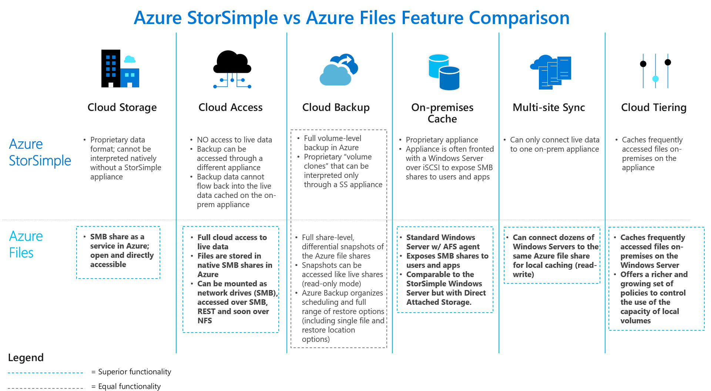

[//]: # (Title: StorSimple migration to Azure file shares FAQ)
[//]: # (Description: Frequently asked question when migrating from Azure StorSimple to Azure file shares.)  
[//]: # (Author: v-shool)  
[//]: # (ms.service: storage)  
[//]: # (ms.topic: how-to)  
[//]: # (ms.date: 12/01/2020)
[/]: # (ms.author: v-shtol)
[/]: # (ms.subservice: files)

# Microsoft Azure StorSimple Data Migration Guide: FAQ

## Document summary

This document is intended to be used by customers (and partners) that have implemented Microsoft’s StorSimple solution in their environments. It is designed to provide a brief overview of Azure’s StorSimple solution and its end of life announcement, alternate storage solutions that Microsoft recommends, and a comprehensive FAQ (Frequently Asked Questions) section that provides answers to specific questions. The target audience for this document are IT teams inside corporations (or partners managing customers) and account teams managing customers and advising them on Microsoft solutions.

## Azure StorSimple overview

StorSimple is an integrated storage solution that manages storage tasks between on-premises devices and Microsoft Azure cloud storage. StorSimple is an efficient, cost-effective, and easily manageable storage area network (SAN) solution that eliminates many of the issues and expenses associated with enterprise storage and data protection. It uses the proprietary StorSimple appliance that integrates with cloud services and provides a set of management tools for a seamless view of all enterprise storage, including cloud storage.

StorSimple uses [storage tiering](https://docs.microsoft.com/azure/storsimple/storsimple-overview#automatic-storage-tiering) to manage stored data across various storage media. The current working set is stored on-premises on solid state drives (SSDs), data that is used less frequently is stored on hard disk drives (HDDs), and archival data is pushed to the cloud. Moreover, StorSimple uses [deduplication and compression](https://docs.microsoft.com/azure/storsimple/storsimple-overview#deduplication-and-compression) to reduce the amount of storage that the data consumes. For more information, go to Deduplication and compression. For definitions of other key terms and concepts used in the StorSimple 8000 series documentation, go to [StorSimple terminology](https://docs.microsoft.com/azure/storsimple/storsimple-overview#storsimple-terminology) at the end of this article.

## StorSimple service end of life

Microsoft’s StorSimple 8000 Physical Appliance series and the StorSimple 1200 Virtual Array series will reach its end of life in December 2022, ending support for the devices and cloud services. This means that customers will need to migrate their current StorSimple data to a different storage platform before the product retirement date. There are other newer first- and third-party solutions that provide the same functionality as StorSimple, and some that provide additional benefits. We recommend that you explore some of the alternative storage solutions such as Azure file shares, Azure File Sync, and Azure Data Box Online devices for your current StorSimple workloads.  Other solutions like SharePoint Online, OneDrive, and Azure NetApp files can also be potential alternatives for StorSimple data migrations.

## StorSimple migration paths

Microsoft offers different migration paths and options based on a customer’s current StorSimple workload scenario and what they want their future environments to look like. For most of the use cases, Microsoft recommends customers migrate from StorSimple to Azure file shares combined with Azure File Sync. The FAQ section of this document will discuss other migration targets like SharePoint Online or NetApp Files. If a customer chooses to migrate to a different, or third party on-premises solution, those scenarios are beyond the scope of this document.

Currently, there are several different options to migrate from StorSimple to Azure file shares and Azure File Sync based on a customer’s current StorSimple platform:  

**Customers with StorSimple 8000 (8100 and 8600) series**: StorSimple Data Manager based migration is the recommended method of migration for most customers. This tool is currently in Beta test and is the easiest and most efficient way to migrate StorSimple 8000 series appliances data. If customers want to move before the StorSimple Data Manager is generally available, they can use the cloud side migration option outlined in this [Microsoft product documentation article](https://docs.microsoft.com/azure/storage/files/storage-files-migration-storsimple-8000).

**Customers with StorSimple 1200 series**: For the StorSimple 1200 Virtual Arrays, currently there is only one migration path to Azure file shares. StorSimple Data Manager based migration support for migrating 1200 Virtual Arrays to Azure file shares is still in the planning phase and Microsoft does not have an ETA at this point. The documentation for the current migration path can be found [here](https://docs.microsoft.com/azure/storage/files/storage-files-migration-storsimple-1200).

## Azure Files and Azure File Sync

Azure file shares offers fully managed file shares in the cloud that are accessible via the industry standard [Server Message Block (SMB) protocol](https://msdn.microsoft.com/library/windows/desktop/aa365233.aspx). Azure file shares can be mounted concurrently by cloud or on-premises deployments of Windows, Linux, and macOS. Additionally, Azure file shares can be cached on Windows Servers with Azure File Sync for fast access near where the data is being used.

Azure File Sync is a service that allows you to cache several Azure file shares on an on-premises Windows Server or cloud VM. Use Azure File Sync to centralize your organization's file shares in Azure file shares, while keeping the flexibility, performance, and compatibility of an on-premises file server. Azure File Sync transforms Windows Server into a quick cache of your Azure file share. You can use any protocol that is available on Windows Server to access your data locally, including SMB, NFS, and FTPS. You can have as many caches as you need across the world.

We strongly recommend that you read [Planning for an Azure file shares deployment](https://docs.microsoft.com/azure/storage/files/storage-files-planning) and [Planning for an Azure File Sync deployment](https://docs.microsoft.com/azure/storage/files/storage-sync-files-planning) before you complete the steps described in this article.

## StorSimple migrations: Frequently asked questions (FAQ)

## StorSimple end of life

### Why is Microsoft shutting down the StorSimple service?

Microsoft has been expanding the portfolio of Azure Hybrid storage capabilities with new services for data tiering and cloud ingestion, providing more options to customers for storing data in Azure in native formats. In conjunction with this, support for the following StorSimple 8000 series: 8100, 8600, 8010, and 8020 will end March 1, 2023.

### When is Microsoft StorSimple service end of life (EOL)?

Microsoft announced last year that StorSimple 8000 series physical appliances and StorSimple 1200 series Virtual Arrays will reach end of life on December 31, 2022. The StorSimple service, along with support for physical and virtual appliances will end at that time.

### What versions/models of StorSimple service (and support) are being terminated?

Microsoft has announced that support for StorSimple 8000 versions (8100, 8600, 8010, and 8020) Physical Appliances and StorSimple 1200 Virtual Arrays will end on December 31, 2022. Support for StorSimple 5000 and 7000 series ended July 9, 2019. Replacement parts, software updates, and customer support for the 5000 and 7000 series have also ended.

### What if we have an older model of StorSimple, like 5000 or 7000 series?

Microsoft is recommending that customers that have the older StorSimple 5000 or 7000 series appliances should migrate to Azure Files. Before you can migrate your StorSimple data stored on a 5000 or 7000 series appliance to Azure Files, customers first need to migrate their StorSimple data to the newer 8000 series appliance. Once their data has been migrated to the 8000 series, customers can then use the StorSimple Data Manager tool to migrate to Azure Files and Azure File Sync.

## StorSimple vs Azure Files and Azure File Sync

### What are the benefits of Azure Files (and Azure File Sync) when compared with StorSimple?



## StorSimple migration

### What are the best migration options?

Depending on the type of StorSimple solution the customer has in their environment, there are different options available for migrating their StorSimple data to Azure Files and Azure File Sync.

**Customers with StorSimple 8000 series (8100, 8600, 8010, and 8020) appliances**: StorSimple Data Manager based migration is the recommended method of migration for most customers. This tool is currently in Beta test and is the easiest and most efficient way to migrate data from StorSimple 8000 series appliances. Microsoft highly recommends using StorSimple Data Manager for StorSimple to Azure Files migrations.  If customers want to migrate their data before the StorSimple Data Manager tool is generally available, they can use the cloud side migration option outlined in [this](https://docs.microsoft.com/azure/storage/files/storage-files-migration-storsimple-8000) Microsoft product documentation article.

**Customers with StorSimple 1200 series appliances**: For StorSimple 1200 Virtual Arrays, currently there is only one migration path to Azure Files. The documentation for the current migration path can be found [here](https://docs.microsoft.com/azure/storage/files/storage-files-migration-storsimple-1200). StorSimple Data Manager based migration support for migrating 1200 Virtual Arrays to Azure Files is still in the planning phase and Microsoft does not yet have an ETA available.

### What other migration options are available for StorSimple customers?

Microsoft recommends Azure Files (and Azure File Sync) as the best data storage replacement solutions for StorSimple workloads. Azure file shares and Azure File Sync offer the most comprehensive set of services/solutions for files/folders (SMB) based workloads. Some customers (and workloads) may look for alternate Microsoft solutions to Azure Files. SharePoint Online, OneDrive, and Azure NetApp files are other alternatives they can consider.

### How can customers migrate from StorSimple to SharePoint Online or OneDrive?

Microsoft will support customers who choose to move their current StorSimple volumes/shares to SharePoint Online or OneDrive based on their workload needs. There is a Microsoft FastTrack team in place to help with these types of migrations. The recommended way to migrate is:

- Migrate the StorSimple Volumes to Azure file shares using the StorSimple Data Manager. The StorSimple to Azure Files team can be engaged by the customer to complete this process.

- Isolate the shares/folders/files that need to move to SharePoint Online or OneDrive into their own set of Azure file shares based on the mapping exercise.

- Once the migration process to Azure file shares is complete, customers can now take these isolated files/folders and can leverage support from the Microsoft Fasttrack team (and tools like Mover) to migrate the files/folder to SharePoint Online or OneDrive.

This is the most efficient way for us to move data into the right target solutions as it will minimize data recall and when using the right tools, we can ensure most of the migrations are performed within Azure.

### What is the StorSimple Data Manager? How does it help with StorSimple migrations?

Microsoft recommends using the StorSimple Data Manager to migrate StorSimple 8000 workloads to Azure Files. Enhancements have been added to the StorSimple Data Manager to ensure file/folder fidelity is maintained during data migrations. This tool will also automate, and greatly simplify the migration process and can speed up migrations by up to 10x compared to the previous manual/iterative method used now and is generally delivering transfer speeds in excess of 1 million files (normally about 1TB) every 4 hours.  The StorSimple Data Manager will be released in three planned releases outlined below. Depending on customer needs, some customers may need to wait for the right release that better suits their data migration needs. More information about the StorSimple Data Manager can be found [here](https://docs.microsoft.com/azure/storsimple/storsimple-data-manager-overview).

- **StorSimple Data Manager Release 1 (will be available soon)**: Migrates live data (does not migrate any snapshot backups).

- **StorSimple Data Manager v2 (expected Nov/Dec 2020)**:  Migrates live data and selected snapshot backups.  However, a separate job must be defined for each backup and for the live data. Note that at each step, only differential data needs to be copied.

- **StorSimple Data Manager v3 (expected Q1 2021)**:  Migrates live data and selected snapshot backups.  A single job can be defined, allowing you to select backups to be transferred, and the job then orchestrates the work, copying the oldest backup first, then cycling though the backups until the newest backup is copied and then the live data is copied. Note that at each step, only differential data needs to be copied.

### What is the best way to map (namespace mapping) StorSimple volumes to Azure file shares for migration purposes?

Before customers deploy cloud storage for their Azure Files, it is important to create a map between on-premises folders and Azure file shares. This mapping will then inform how many and which Azure File Sync “sync” group resources need to be provisioned. A sync group ties the Azure file share and the folder on a Windows Server together and establishes a sync connection. Customers should use concepts like share consolidations or splitting to determine how many Azure file shares they will need, and which StorSimple shares will end up in which Azure file share. Microsoft has put together a simple Excel name-space mapping template that customers can use to create a complete mapping of their StorSimple volumes to help organize the Azure file shares creation process. Please use this [link](https://docs.microsoft.com/azure/storage/files/storage-files-migration-storsimple-8000) to download a copy of the mapping template.

### Are there specific recommendations for mapping StorSimple volumes to Azure file shares?

Customers must first evaluate how many Azure file shares they need. A single Windows Server instance (or cluster) can sync up to 30 Azure file shares. Customers may have more folders on their volumes that they currently share out locally as SMB shares to their users and apps. The easiest way is to envision an on-premises share that maps 1:1 to an Azure file share. If customers have a small-enough number, below 30 for a single Windows Server instance, then we recommend a 1:1 mapping. If customers have more than 30 shares, it is often unnecessary to map an on-premises share 1:1 to an Azure file share. Please follow this [link](https://docs.microsoft.com/azure/storage/files/storage-files-migration-storsimple-8000#map-your-existing-namespaces-to-azure-file-shares) for more details on the volume mapping exercise.
  
### How many concurrent StorSimple Data Manager jobs can customers start?

Using the first release of the StorSimple Data Manager (available now), customers can start up-to two concurrent jobs. It is recommended that customers wait for the compute resources for the first job to be provisioned before starting the second job. By the second release (expected in late 2020), the StorSimple Data Manager will support additional numbers of concurrent jobs.

### How do customers/partners obtain the StorSimple Service Data Encryption (Secret) Key that is required for migrations using the StorSimple Data Manager?

Customers were provided with a StorSimple Service Data Encryption Key when they first setup/registered their StorSimple device. Typically, IT departments would have saved this key for disaster recovery and other purposes. The key should be kept in a safe place. If the StorSimple device fails or is damaged or lost, then your data cannot be decrypted without it. It is also needed for the StorSimple Data Manager to operate on your data. If customers do not have the key handy, you have the following options to retrieve it:

- Open a Support Ticket with StorSimple customer support. They will walk customers through the process of retrieving the secret key. More details on how to create a Microsoft Support request are available [here](https://docs.microsoft.com/azure/storsimple/storsimple-8000-contact-microsoft-support).

- Use Windows PowerShell to retrieve the key from the appliance. You can connect to your StorSimple appliance via a serial console or through a remote PowerShell session.  Caution:  When you are deciding how to connect to Windows PowerShell for StorSimple, consider the following: *connecting through an HTTPS session is the most secure and recommended option*. Connecting directly to the device serial console is secure but connecting to the serial console over network switches is not. HTTP session connections are an option, but are not encrypted, and therefore also not recommended unless used within in a closed, trusted network. To retrieve the key, use the following command: *Get-HcsmServiceDataEncryptionKey*

- Securely note the key. You will need it when specifying any subsequent StorSimple Data Manager job.

### When can I migrate StorSimple backup volumes using the StorSimple Data Manager?

- **StorSimple Data Manager v1** (available now) migrates live data volumes only. It does not migrate any StorSimple volume snapshots or backups.

- **StorSimple Data Manager v2** (expected Nov/Dec 2020) will migrate live data and selected volume snapshots and backups. Customers must then manually take backups of the Azure file shares. Also, the Azure files share snapshots created will be stamped with the date of the actual migration, with the original snapshot date recorded only in the comments/description.

- **StorSimple Data Manager v3** (expected Q1 2021) will migrate live data and selected snapshot backups and ensures that the Azure files share snapshots created are stamped with the date of the original StorSimple volume snapshot from which the data was copied from. This release will also automate the Azure file share snapshot creation process.

### Do customers have to take Azure file share snapshots manually after each share is copied?

Yes, customers that decide to use the StorSimple Data Manager Release v2 (expected Nov/Dec 2020) for StorSimple migrations or follow the cloud side migration process to migrate their StorSimple backup volume clones will have to manually take an Azure file share snapshot after each volume/share is migrated. 

### When customers take a snapshot of a file share that was part of a StorSimple backup volume (clone), is the original backup date/time stamp fidelity maintained?

Customers taking snapshots of Azure file shares after they migrate from StorSimple using the StorSimple Data Manager v2 or the cloud side migration method will not be able to keep the original date/time stamp of the backup volume. Please wait for Release v3 for the StorSimple Data Manager (expected in Q1 of 2021) for the StorSimple Data Manager to support the backup volume’s creation date/time fidelity.

### What kind of migration support is Microsoft providing to customers?

Microsoft’s StorSimple migration support team, along with the Azure Files support team, will provide guidance for customers migrating from StorSimple to Azure Files. If customers plan to move to other solutions, like SharePoint Online or OneDrive, there are different FastTrack teams at Microsoft that will help with the migration. However, if customers decide to migrate to a third-party solution instead, then they will need to obtain migration support from that third-party company. Customers who elect to migrate to Azure Files, the Microsoft support team, will provide an estimated target date for your migration to begin to ensure there are adequate resources available to assist customers with their migrations. Prior to identifying a target start date, all StorSimple customers will receive instructions on how to get started with the migration planning process. If you have any questions about getting plugged into the process email us at [storsimp@microsoft.com](mailto:storsimp@microsoft.com).

### Can customers keep their existing StorSimple backup data in the cloud and how long can they keep it?

Customers can keep their existing StorSimple backups in the cloud until December 31, 2022. There are no plans to extend the StorSimple service beyond that date. Because backup data is stored in a format that only the StorSimple service can interpret, it is critical that customers who need to retain backups past the StorSimple retirement date migrate to Azure Files and use Azure Files Snapshots optionally with Azure Backup to automate the backup and retention schedule.

### What do customers do with the StorSimple appliance after completing migrations?

During the last phase of the migration process, customers need to make sure they have iterated through multiple volume clones and eventually were able to migrate ALL volumes they need from StorSimple over to Azure Files or whatever alternative data storage solution they have selected. Once they have verified that all the required volumes have been migrated, the customer is ready to do the cut over and provide user access to the new Windows Server (if using Azure File Sync) after taking your StorSimple appliance offline. Once customers are satisfied with the Azure file shares, Azure File Sync operations, and Azure File Share Snapshot Backups, and you have verified that applications and users are functioning correctly, they can then begin to de-provision unnecessary resources, including the StorSimple appliance, Device Manager, and data storage that were part of the older StorSimple solution. Once customers are done de-provisioning, they can follow the guidelines [here](https://www.microsoft.com/legal/compliance/recycling) for recycling the hardware.

### When will Databox (or Databox Gateway) based migrations be supported for large migrations (in the petabytes)?

Microsoft is working on enhancing the Databox solution to help customers with petabytes of StorSimple data (and slow connections) migrate to Azure Files.  We do not have an estimated date of release for this new functionality. This FAQ will be updated as soon as more details become available.

### What is a StorSimple Service Data Encryption Key, why do I need it, and how do I get it?

You should already have the StorSimple Service Data Encryption Key recorded for each of your StorSimple devices. It is needed to failover to a new device if your device fails. It is also needed for migration. If you do not have it recorded in a safe place for each StorSimple device, please do so now, as a matter of urgency using instructions [here](https://docs.microsoft.com/azure/storsimple/storsimple-8000-manage-service).

### How do I find my StorSimple serial number?

To provide migration assistance to you, we need to know your StorSimple serial number for all your StorSimple appliances. Please include it in any communication with us. The simplest way to access it us as follows:

For the 8000 series, it is available in the Azure Portal on the properties page: *Azure Portal / StorSimple Device Manager / Devices / Device / All Settings / Properties*

For the 5000/7000 series, it is available in the web interface on the technical assistance page: *Help / Technical Assistance*

### How should I use Robocopy?

This very much depends on the scenario, your specific needs, and objectives. Please use “Robocopy /?” for Robocopy help.  You may also want to refer to the Robocopy guidance [here](https://docs.microsoft.com/azure/storage/files/storage-files-migration-storsimple-8000#phase-6-a-final-robocopy) which is specific to that particular migration to catchup changes and unsynced files scenarios.

### What is the best way to size and count the files I need to migrate?

There are various tools that are available for this task. One tool which we have found to work well is TreeSize.  A free version is available for download [here](https://www.jam-software.com/treesize_free).

### Can I migrate from StorSimple to Azure Blob Storage?

Yes, for StorSimple 8000 series users, the StorSimple Data Manager v1 version allows you to migrate directly into blob containers. This is normally relevant when the data is being used by an application rather than directly by users. Watch out for any dependencies on file metadata. With StorSimple Data Manager, you will lose all file metadata in the process, so be sure to complete a test-run first to verify if the application depends on timestamps or attributes on a file. If such dependencies exist, then you may need to take measures to ensure that metadata is preserved and remains accessible to the app.  In some cases, if the application depends on a proper file system, then object storage might not be the right target storage.  Another alternative might be to use the blob metadata field in which you could store some of the file metadata, but access to it for the application is very different than in a file system. You can re-code the app to work with key-value pairs in blob metadata.  Note also that you can use SAS (Shared Access Signature) tokens for authentication with both Azure Blob Storage and Azure file shares as well.

## Migrating from older 5000 and 7000 StorSimple devices

### How do we obtain a loaner StorSimple 8000 device?

For customers that have older 5000 or 7000 series appliances, Microsoft may be able to help those customers migrate to a StorSimple 8000 series appliance so they can migrate their StorSimple data to Azure Files.  Please reach out to [storsimp@microsoft.com](mailto:storsimp@microsoft.com) for support.
  
### How do I contact StorSimple support?

The StorSimple Device Manager provides the capability to log a new support request within the service summary blade. If you encounter any issues with your StorSimple solution, you can create a service request for technical support. In an online session with your support engineer, you may also need to start a support session on your StorSimple device. This [link](https://docs.microsoft.com/azure/storsimple/storsimple-8000-contact-microsoft-support) shows you:

- How to create a support request.

- How to manage a support request lifecycle from within the portal.

- How to start a support session in the Windows PowerShell interface of your StorSimple device.

- Review the StorSimple 8000 Series Support SLAs and information before you create a support request.

### Who will provide support for migrating older StorSimple devices to the new 8000 series?

For customers that have older 5000 or 7000 series appliances, Microsoft may be able to help those customers migrate to a StorSimple 8000 series appliance so they can migrate their StorSimple data to Azure Files. Please reach out to [storsimp@microsoft.com](mailto:storsimp@microsoft.com) for support.
  
## Azure Files

### What is Azure Files?

Azure Files offers fully managed file shares in the cloud that are accessible via the industry standard Server Message Block (SMB) protocol. Azure file shares can be mounted concurrently by cloud or on-premises deployments of Windows, Linux, and macOS. Additionally, Azure file shares can be cached on Windows Servers with Azure File Sync for fast access near where the data is being used. To learn more about Azure Files, please review the documentation [here](https://docs.microsoft.com/azure/storage/files/storage-files-introduction).

### Where can Azure file shares be deployed?

Azure file shares are deployed into storage accounts, which are top-level objects that represent a shared pool of storage. This pool of storage can be used to deploy multiple file shares, as well as other storage resources such as blob containers, queues, or tables. All storage resources that are deployed into a storage account share the limits that apply to that particular storage account. To see the current limits for a storage account, see [Azure Files scalability and performance targets](https://docs.microsoft.com/azure/storage/files/storage-files-scale-targets). There are two main types of storage accounts you will use for Azure Files deployments:

- **General purpose version 2 (GPv2) storage accounts**: GPv2 storage accounts allow you to deploy Azure file shares on standard/hard disk-based (HDD-based) hardware. In addition to storing Azure file shares, GPv2 storage accounts can store other storage resources such as blob containers, queues, or tables.

- **FileStorage storage accounts**: FileStorage storage accounts allow you to deploy Azure file shares on premium/solid-state disk-based (SSD-based) hardware. FileStorage accounts can only be used to store Azure file shares; no other storage resources (blob containers, queues, tables, etc.) can be deployed in a FileStorage account.

There are several other storage account types you may come across in the Azure portal, including PowerShell, or CLI. Two storage account types, BlockBlobStorage, and BlobStorage storage accounts, cannot contain Azure file shares. The other two storage account types you may see are general purpose version 1 (GPv1) and classic storage accounts, both of which can contain Azure file shares. Although GPv1 and classic storage accounts may contain Azure file shares, most new features of Azure Files are available only in GPv2 and FileStorage storage accounts. We therefore recommend to only use GPv2 and FileStorage storage accounts for new deployments and to upgrade GPv1 and classic storage accounts if they already exist in your environment.

### What size file shares does Azure Files support?

Azure Files offers standard file shares, which are hosted on hard disk-based (HDD-based) hardware, and premium file shares, which are hosted on solid-state disk-based (SSD-based) hardware. Standard file shares can span up to 100 TiB, however this feature is not enabled by default; if you need a file share that is larger than 5 TiB, you will need to enable the large file share feature for your storage account. Premium file shares can span up to 100 TiB without any special setting, however, premium file shares are provisioned, rather than pay as you go, like standard file shares. This means that provisioning a file share much larger than what you need will increase the total cost of storage.

### Are Azure File Sync and large Azure file shares available in all regions?

Currently, large Azure file shares and Azure File Sync are available in most Azure regions worldwide. For a complete and up to date list of the regions with Azure Files and File Sync service availability, please review details [here](https://docs.microsoft.com/azure/storage/files/storage-sync-files-planning#azure-file-sync-region-availability).  

### What are the different tiers Azure Files supports?

Azure Files currently offers four tiers. Premium and Transaction Optimized (Standard) tiers are available in most regions. Hot and Cool tiers are being rolled out and should be available shortly in all regions.

- **Premium**: Offered on solid-state disk (SSD) storage media and useful for IO-intensive workloads, including hosting databases and high-performance computing (HPC).

- **Transaction Optimized**: Offered on rotational hard-disk (HDD) storage media and useful for general purpose file shares. Low transaction charges make this tier ideal for larger sets of files with high churn.

- **Hot**: Useful for most general-purpose workloads, including for lifting and shifting an on-premises file share to Azure, and especially with Azure File Sync.

- **Cool**: This tier is more useful for lightly used file shares, where data is to be stored for long term access without compromising the capability of instant online access to the data.

### What kind of redundancy do Azure Files support?

Standard file shares offer locally redundant (LRS), zone redundant (ZRS), geo-redundant (GRS), or geo-zone redundant (GZRS) storage, however, the large file share feature is only supported on locally redundant and zone redundant file shares. Premium file shares do not support any form of geo-redundancy.

Premium file shares are available with locally redundancy in most regions that offer storage accounts and with zone redundancy available in a smaller subset of regions. To find out if premium file shares are currently available in your region, see the [products available by region](https://azure.microsoft.com/global-infrastructure/services/?products=storage) page on the Azure services overview page. For information about regions that support ZRS, see [Azure Storage redundancy](https://docs.microsoft.com/azure/storage/common/storage-redundancy?toc=/azure/storage/files/toc.json).

### When will NFS support be added to Azure Files?

Currently, NFS 4.1 support for Azure Files is in Private Preview. This feature will be released as a public preview in the coming months and should be included in the generally available (GA) version. Once additional release details become available, we will update this FAQ.

### Does Azure Files offer deduplication and compression like StorSimple does?

Currently, Azure Files (and Azure file shares) do not offer deduplication and compression capabilities. Although these features are planned for future product releases, we do not have the exact timeframe when these features will be added. This FAQ will be updated as soon as more details become available.

### What type of encryption does Azure Files and Azure File Sync provide?

While Azure Files (at-rest) and Azure File Sync in transit encrypts data, there are multiple encryption layers and strategies to consider.  Encryption on the at-rest storage of Windows Server, encryption in transit between the Azure File Sync agent and Azure, and encryption of the rest of your data in the Azure file share. Note that SMB 3.0 access over VPN is double encrypted as follows:

- SMB 3.0 encrypts content

- VPNs such as ExpressRoute encrypts content

### Can the StorSimple Data Manager or Robocopy move encrypted files to Azure file shares?

Neither StorSimple Data Manager nor Robocopy (even with /EFSRAW switch) can copy encrypted files from StorSimple to Azure Files in the cloud. Content needs to be decrypted first before it is copied to the cloud share. Note that if you were to use Azure File Sync, then you can perform an on-prem Robocopy (with /EFSRAW switch) from StorSimple to an Azure File Sync (AFS) Server where the target server receives the file in encrypted form. AFS would try and fail to upload it, but the user who encrypted it would be able to read it when using the local AFS file server.

### Do Azure file shares support multiple tiers in a single share?

Azure Files does not support multiple tiers within a single share today. This is a feature that is part of the Azure Files roadmap, but there is no estimated release date. We will update this FAQ with more details as it becomes available.

### What are some of the Azure Files limits?

There are specific limits Azure Files has with respect to share size, file size, number of files per share, storage account limits, etc. For more information on Azure Files limits, see [Azure Files scalability and performance targets](https://docs.microsoft.com/azure/storage/files/storage-files-scale-targets).

| Resource        | Standard file shares           | Premium file shares  |
| ------------- |-------------| -----|
| Minimum size of a file share      | No minimum; pay as you go | 100 Gib; provisioned |
| Maximum size of a file share      | 100 TiB*, 5 TiB      |   100 TiB |
| Maximum size of a file in a file share | 1 TiB      |    4 TiB |
| Maximum number of files in a file share | No limit      |    No limit |
| Maximum IOPS per share | 10,000 IOPS* or 100 requests in 100ms      |    100,000 IOPS |
| Maximum number of stored access policies per file share | 5      |    5 |
| Target throughput for a single file share | up to 300 MiB/sec*, Up to 60 MiB/sec      |    See premium file share ingress and egress values |
| Maximum egress for a single file share |See standard file share target throughput      |    Up to 6,204 MiB/s |
| Maximum ingress for a single file share | See standard file share target throughput      |    Up to 4,136 MiB/s |
| Maximum open handles per file or directory | 2,000 open handles      |    2,000 open handles |
| Maximum number of share snapshots | 200 share snapshots      |    200 share snapshots |
| Maximum object (directories and files) name length | 255 characters      |    2,048 characters |
| Maximum pathname component (in the path \A\B\C\D, each letter is a component) | 255 characters      |    255 characters |

*Subject to machine network limits, available bandwidth, IO sizes, queue depth, and other factors. For details see [SMB Multichannel performance](https://docs.microsoft.com/azure/storage/files/storage-files-smb-multichannel-performance).

### What are the limitations of Azure storage accounts when being used for Azure file shares?

For the current and up-to-date limits please review the documentation [here](https://docs.microsoft.com/azure/storage/files/storage-files-scale-targets).

The parent resource for an Azure file share is an Azure storage account. A storage account represents a pool of storage in Azure that can be used by multiple storage services, including Azure Files, to store data. Other services that store data in storage accounts are Azure Blob storage, Azure Queue storage, and Azure Table storage. The following targets apply all storage services storing data in a storage account.

The following table describes default limits for Azure general-purpose v1, v2, Blob storage, and block blob storage accounts. The ingress limit refers to all data that is sent to a storage account. The egress limit refers to all data that is received from a storage account.

Note:  You can request higher capacity and ingress limits. To request an increase, contact [Azure Support](https://azure.microsoft.com/support/faq/).

| Resource        | Limit           |
| ------------- |-------------|
| Number of storage accounts per region per subscription, including standard, and premium storage accounts.      | 250 |
| Maximum storage account capacity | 5 PiB<sup>1</sup>
| Maximum number of blob containers, blobs, file shares, tables, queues, entities, or messages per storage account      | No limit |
| Maximum request rate<sup>1</sup> per storage account      | 20,000 requests per second |
| Maximum ingress<sup>1</sup> per storage account (US, Europe regions) account      | 10 Gbps |
| Maximum ingress<sup>1</sup> per storage account (regions other than US and Europe)      | 5 Gbps if RA-GRS/GRS is enabled, 10 Gbps for LRS/ZRS<sup>2</sup> |
| Maximum egress for general-purpose v2 and Blob storage accounts (all regions)      | 50 Gbps |
| Maximum egress for general-purpose v1 storage accounts (US regions)      | 20 Gbps if RA-GRS/GRS is enabled, 30 Gbps for LRS/ZRS<sup>2</sup> |
| Maximum egress for general-purpose v1 storage accounts (non-US regions)      | 10 Gbps if RA-GRS/GRS is enabled, 15 Gbps for LRS/ZRS<sup>2</sup> |
| Maximum number of virtual network rules per storage account      | 200 |
| Maximum number of IP address rules per storage account      | 200 |

<sup>1</sup> Azure Storage standard accounts support higher capacity limits and higher limits for ingress by request. To request an increase in account limits, contact [Azure Support](https://azure.microsoft.com/support/faq/).

<sup>2</sup> If your storage account has read-access enabled with geo-redundant storage (RA-GRS) or geo-zone-redundant storage (RA-GZRS), then the egress targets for the secondary location are identical to those of the primary location. For more information, see [Azure Storage replication](https://docs.microsoft.com/azure/storage/common/storage-redundancy).

## Azure File Sync

### What is Azure File Sync?

Azure File Sync is a service that allows you to cache a number of Azure file shares on an on-premises Windows Server or cloud VM. The files will be stored in the cloud in Azure file shares. Azure file shares can be used in two ways: by directly mounting these serverless Azure file shares (SMB) or by caching Azure file shares on-premises using Azure File Sync. Whichever deployment option customers choose changes the aspects they need to consider as they plan their deployment. For more details on Azure File Sync, please review the documentation [here](https://docs.microsoft.com/azure/storage/files/storage-sync-files-planning).

### What components make up the Azure File Sync service?

An Azure File Sync deployment has three fundamental management objects:

- **Azure file share**: An Azure file share is a serverless cloud file share, which provides the *cloud endpoint* of an Azure File Sync sync relationship. Files in an Azure file share can be accessed directly with SMB or the FileREST protocol, although we encourage you to primarily access the files through the Windows Server cache when the Azure file share is being used with Azure File Sync. This is because Azure Files today lacks an efficient change detection mechanism like Windows Server has, so changes to the Azure file share directly will take time to propagate back to the server endpoints.

- **Server endpoint**: The path on the Windows Server that is being synced to an Azure file share. This can be a specific folder on a volume or the root of the volume. Multiple server endpoints can exist on the same volume if their namespaces do not overlap.

- **Sync group**: The object that defines the sync relationship between a cloud endpoint, or Azure file share, and a server endpoint. Endpoints within a sync group are kept in sync with each other. If for example, you have two distinct sets of files that you want to manage with Azure File Sync, you would create two sync groups and add different endpoints to each sync group.

### What is cloud tiering (in Azure File Sync)? 

Cloud tiering is an optional feature of Azure File Sync in which frequently accessed files are cached locally on the server while all other files are tiered to Azure Files based on policy settings. When a file is tiered, the Azure File Sync file system filter (StorageSync.sys) replaces the file locally with a pointer or reparse point. The reparse point represents a URL to the file in Azure Files. A tiered file has both the "offline" attribute and the FILE_ATTRIBUTE_RECALL_ON_DATA_ACCESS attribute set in NTFS so that third-party applications can securely identify tiered files. When a user opens a tiered file, Azure File Sync seamlessly recalls the file data from Azure Files without the user needing to know that the file is stored in Azure. More details about cloud tiering can be found [here](https://docs.microsoft.com/azure/storage/files/storage-sync-cloud-tiering).

### Does Azure File Sync support multi-site sync? 

Yes, Azure File Sync supports multi-site sync capability. Please note that if the same file(s) is open by two users in two different locations (sites), file locking will not happen if the file(s) is independently updated/modified by the users, and two copies of the same file with different filenames will be saved.

### Does Azure File Sync support multi-site file locking capabilities?

Currently, Azure File Sync (and Azure Files) does NOT support multi-site file locking capabilities. This capability is in the product planning phase and there is no estimated time as to when this feature will be released. As soon as more details are available, this FAQ will be updated.

### How should I size the Windows Server machine or VM to run the AFS agent?

Please refer to the “Recommended System Resources” section in the documentation [here](https://docs.microsoft.com/azure/storage/files/storage-sync-files-planning#recommended-system-resources).

### Does Azure File Sync support DFS(N)?
Azure File Sync supports interop with DFS Namespaces (DFS-N) and DFS Replication (DFS-R).

- **DFS Namespaces (DFS-N)**: Azure File Sync is fully supported on DFS-N servers. You can install the Azure File Sync agent on one or more DFS-N members to sync data between the server endpoints and the cloud endpoint. For more information, see [DFS Namespaces overview](https://docs.microsoft.com/windows-server/storage/dfs-namespaces/dfs-overview).

- **DFS Replication (DFS-R)**: Since DFS-R and Azure File Sync are both replication solutions, in most cases, we recommend replacing DFS-R with Azure File Sync. There are however, several scenarios where you would want to use DFS-R and Azure File Sync together: For more details on this topic, please review the documentation [here](https://docs.microsoft.com/azure/storage/files/storage-sync-files-planning#distributed-file-system-dfs).

### Should Azure File Sync be used as a migration tool when it is not planned to be used longer term?

When migrating to Azure Files without a final topology including Azure File Sync, we are **NOT** recommending using Azure File Sync as a stepping stone. Instead, after one or more StorSimple Data Manager jobs have been run, to catchup churn during those jobs, we recommend to run a Robocopy executed on an on-prem machine to copy from the on-prem StorSimple share to the Azure file shares in Azure. This can be ran once or more than once, but the last time it is run, users should be offline, and then after it is verified to be complete, users can be brought online to the new Azure file shares (note: do not then run the Robocopy job again or new user changes will be deleted).

### What Windows Server OS versions does Azure File Sync support? 

Azure File Sync can run on Windows Server 2012 R2 and later versions (2016, 2019), both full and core versions. Microsoft highly recommends that customers use Azure File Sync with Windows Server 2019 as the sync service is best optimized for this version of Windows Server. 

### What are the system requirements for Azure File Sync? 

Just like any server feature or application, the system resource requirements for Azure File Sync are determined by the scale of the deployment; larger deployments on a server require greater system resources. For Azure File Sync, scale is determined by the number of objects across the server endpoints and the churn on the dataset. A single server can have server endpoints in multiple sync groups, and the number of objects listed in the following table accounts for the full namespace that a server is attached to. More details about can be found in the documentation [here](https://docs.microsoft.com/azure/storage/files/storage-sync-files-planning#recommended-system-resources). 

### How can customers plan their Azure File Sync deployments, from cache sizing to networking requirements?

Details about Azure File Sync cloud tiering can be found in the documentation [here](https://docs.microsoft.com/azure/storage/files/storage-sync-cloud-tiering). Networking configuration for Azure File Sync spans two different Azure objects: a Storage Sync Service and an Azure storage account. A storage account is a management construct that represents a shared pool of storage in which you can deploy multiple file shares, as well as other storage resources, such as blob containers or queues. A Storage Sync Service is a management construct that represents registered servers, which are Windows file servers with an established trust relationship with Azure File Sync, and sync groups, which define the topology of the sync relationship. Learn more about networking and Azure File Sync in the documentation [here](https://docs.microsoft.com/azure/storage/files/storage-sync-files-networking-overview).

### Can users access Azure File Sync shares and the related Azure file shares? Why would I implement a VM in Azure running AFS, why not access the Azure file shares directly?

In general, you should access Azure File shares either directly or using Azure File Sync (AFS), but not both. The reason is that when using Azure File Sync, it uses Windows Server’s NTFS file system, Update Sequence Number, or USN Change Journal feature to immediately detect when a file handle is closed, and at that time, copies that file (if it has changed) to the Azure file share AND to all the other Azure File Sync servers so that all stores are kept in sync. However, the Azure file system does not currently have a USN Change Journal feature and so for files changed directly on the Azure Files share, there is no way to trigger copies to attached Azure File Sync servers, so for files that are changed directly in the Azure File share, those files are not immediately copied to Azure File Sync servers when they are closed.  Instead, a daily process checks for changes and copies any changed files down to any connected Azure File Sync servers. Because of this, if you do want to provide users with access to both Azure File Sync servers on-prem, and direct access to cloud shares, it is recommended that you create a VM in the cloud running Azure File Sync and direct users to its shares rather than to the Azure files shares directly. This way, any changes they make will immediately be copied to all other Azure File Sync servers as soon as any file is closed.  This is the use case to implement a VM in Azure for Azure File Sync.

### What are some of the Azure File Sync limits?

There are specific limits Azure File Sync has when it comes to the number of Sync Services per region, Sync Groups, Cloud Endpoints etc. These limitations can be found [here](https://docs.microsoft.com/azure/storage/files/storage-files-scale-targets#azure-file-sync-scale-targets) and are outlined in the chart below:

| Resource        | Target           | Hard limit  |
| ------------- |-------------| -----|
| Storage Sync Services per region      | 100 Storage Sync Services | Yes |
| Sync groups per Storage Sync Service      | 200 sync groups      |   Yes |
| Registered servers per Storage Sync Service | 99 servers      |    Yes |
| Cloud endpoints per sync group | 1 cloud endpoint      |    Yes |
| Server endpoints per sync group | 50 server endpoints      |    No |
| Server endpoints per server | 30 server endpoints      |    Yes |
| File system objects (directories and files) per sync group | 100 million objects      |    No |
| Maximum number of file system objects (directories and files) in a directory |5 million objects      |    Yes |
| Maximum object (directories and files) security descriptor size | 64 KiB      |    Yes |
| File Size | 100 GiB      |    No |
| Minimum file size for a file to be tiered | V9: Based on file system cluster size (double file system cluster size). For example, if the file system cluster size is 4kb, the minimum file size will be 8kb. V8 and older: 64 KiB      |    Yes |

## Azure Files and Active Directory

### Does Azure Files work with Azure Active Directory? What identity-based authentication should we use with Azure Files?

No, Azure Files uses Kerberos Authentication and thus requires Active Directory Domain Services as delivered by either (1) [Windows Server Active Directory Domain Services (AD DS)](https://docs.microsoft.com/windows-server/identity/ad-ds/get-started/virtual-dc/active-directory-domain-services-overview) either on-premises or running in a VM the cloud (recommended due to richer feature set) or (2) [Azure Active Directory Domain Services (Azure AD DS)](https://docs.microsoft.com/azure/active-directory-domain-services/overview). [Azure Active Directory](https://docs.microsoft.com/azure/active-directory/) does not provide Kerberos services and thus will not support authentication when connecting with Azure Files. For more information, please see read the documentation [here](https://docs.microsoft.com/azure/storage/files/storage-files-active-directory-overview).

## Network considerations using Azure Files and Azure File Sync

### How should I set up our network to work with Azure Files and Azure File Sync?
Please review the documentation [here](https://docs.microsoft.com/azure/storage/files/storage-files-networking-overview) for guidance on storage files networking. 

## Backups

### How do you do backups with Azure Files and/or Azure File Sync

When using Azure File Sync, all your data is held in the cloud with the hottest data cached locally. So, it does not make any sense to do on-premises backups as this would result in a large volume of data being recalled. With StorSimple, data was backed up using volume clones. With Azure File Sync, you take a more granular Azure file share snapshots. They are very clever delta snapshots, so only the delta between two snapshots will increase storage consumption in the cloud. The cool thing about them is you can mount a snapshot to provide direct access to a read-only view of that snapshot as a SMB share to provide greater flexibility. This sort of easy access to backups is changing the game; you could not do that with your StorSimple storage (the 8000 Series does support mounting volume backups, but not at the share level). File Share snapshots can be done manually or via code at any time.

Azure Backup optionally orchestrates scheduled backups, as well as giving powerful restore capabilities to original location, or alternative location, with single file restore or whole share restore options.

### What is Azure file share backup? 

Azure file share backup is a native, cloud-based backup solution that protects your data in the cloud and eliminates additional maintenance overheads involved in on-premises backup solutions. The Azure Backup service smoothly integrates with Azure File Sync and allows you to centralize your file share data as well as your backups. This simple, reliable, and secure solution enables you to configure protection for your enterprise file shares in a few simple steps with an assurance that you can recover your data in case of any disaster scenario. More information the about Azure Backup service can be found [here](https://docs.microsoft.com/azure/backup/azure-file-share-backup-overview?toc=/azure/storage/files/toc.json). 

### What is the added cost of taking Azure file share snapshots? 

Azure Files provides the capability to take share snapshots of file shares. Share snapshots capture the share state at that point in time. Since Azure Files snapshots are based on differential backup technology, only the deltas are saved when snapshots are taken. There is an excellent article on how to calculate the file share snapshot size for a storage account in this [blog post](https://charbelnemnom.com/2020/01/how-to-calculate-the-file-share-snapshot-size-for-an-azure-storage-account/). To learn more about Azure Files Snapshots, please review the documentation [here](https://docs.microsoft.com/azure/storage/files/storage-snapshots-files).

### Can I take multiple backups per day?

Backup Recovery Services Vault allows for one backup per day.  For multiple backups per day, use Windows Server Volume Shadow Copy Service (VSS), which operates largely independently of Azure File Sync, but does require a PowerShell script to be run on Azure File Sync server to enable them to work together (See below for further details).

### Can I use VSS (Volume Shadow Copy Service) with Azure File Sync?

Compatibility is available, but requires running a PowerShell Commandlet as detailed in the documentation [here](https://docs.microsoft.com/azure/storage/files/storage-sync-files-deployment-guide?tabs=azure-portal#self-service-restore-through-previous-versions-and-vss-volume-shadow-copy-service).

Note that “Previous Versions” is a Windows client feature that allows you to utilize server-side VSS snapshots of a volume to present restorable versions of a file to an SMB client. This enables a powerful scenario, commonly referred to as self-service restore, directly for information workers instead of depending on the restore from an IT admin.

VSS snapshots and Previous Versions work independently of Azure File Sync. However, cloud tiering must be set to a compatible mode. Many Azure File Sync server endpoints can exist on the same volume. You have to make the following PowerShell call per volume that has even one server endpoint where you plan to or are using cloud tiering:

*Import-Module*
```<SyncAgentInstallPath>\StorageSync.Management.ServerCmdlets.dll' Enable-StorageSyncSelfServiceRestore [-DriveLetter] <string> [[-Force]]```

VSS snapshots are taken of an entire volume. By default, up to 64 snapshots can exist for a given volume, granted there is enough space to store the snapshots. VSS handles this automatically. The default snapshot schedule takes two snapshots per day, Monday through Friday. That schedule is configurable via Windows Scheduled Tasks. The above PowerShell cmdlet does two things:

1. It configures Azure File Sync’s cloud tiering on the specified volume to be compatible with “previous versions” and guarantees that a file can be restored from a previous version, even if it was tiered to the cloud on the server.

2. It enables the default VSS schedule. You can then decide to modify it later.

## Azure storage

### When will the new tiers (Hot and Cool) be rolled out to all regions?

Microsoft has rolled out the new Azure Files tiers (Hot, Cool) worldwide. Currently, all regions should have the tiers. View the [storage pricing page](https://azure.microsoft.com/pricing/details/storage/files/) for more details on available tiers in your region.

## Security and compliance

### What are best practices for virus scanning when using Azure Files and Azure File Sync?

**On-premises virus scanners**:  Be sure to use a virus scanner that will only scan the Data Stream (content) on files without the “Recall on Data Access” attribute set (to scan files with that attribute would trigger recall). This attribute can only be set in Kernel Mode and thus viruses cannot set it to avoid being scanned. Note that Antivirus Scanners will still scan the attributes, ACLs, and timestamps of all files.

**In cloud virus scanners**:  Either use a PAAS offering (For Azure files only, McAfee has an offering at this time) or use IAAS and set up a VM in the cloud in the same region as your files and install and run your Antivirus software of choice on that VM.

### Is Azure Files HIPAA compliant? Can I store PHI in Azure Files and Azure File Sync?

Azure Files has been assessed for Health Insurance Portability and Accountability Act (HIPAA) compliance as part of Azure. When used in accordance with the appropriate guidance and best practices, Azure Files can be considered when HIPAA Compliance and the storage of Protected Health Information (PHI) is required.  Please refer to the following [document](https://aka.ms/AzureCompliance) for the most up-to-date statements regarding Azure Compliance Offerings. 

Here is an excerpt from that document as of October 2020:

HIPAA regulations require that covered entities and their business associates enter into a contract called a Business Associate Agreement (BAA) to ensure the business associates will protect PHI adequately. Azure has enabled the physical, technical, and administrative safeguards required by HIPAA and the HITECH Act inside the in-scope Azure services, and offers a [HIPAA BAA](https://aka.ms/BAA) as part of the [Microsoft Online Services Terms](https://aka.ms/Online-Services-Terms) to all customers who are covered entities or business associates under HIPAA for use of such in-scope Azure services. In the BAA, Microsoft makes contractual assurances about data safeguarding, reporting (including breach notifications), data access in accordance with HIPAA and the HITECH Act, and many other important provisions. Aside from Azure services listed in Appendices A and Azure Government services in Appendix B Microsoft Intune, Microsoft Power BI and Microsoft Healthcare Bot online services are also included.

Customers subject to HIPAA/HITECH Act compliance obligations should review [Microsoft Azure HIPAA/HITECH Act Implementation Guidance](https://aka.ms/azurehipaaguidance), as well as the white paper ["Practical guide to designing secure health solutions using Microsoft Azure”](https://aka.ms/azureindustrysecurity) to learn about concrete steps needed to maintain compliance on Azure and to better understand what it takes to adopt a cloud platform in a secure manner. Also available to customers is the [Azure Security and Compliance HIPAA/HITRUST Blueprint](https://aka.ms/healthblueprint), which offers a turnkey deployment of an Azure PaaS solution to demonstrate how to securely ingest, store, analyze, and interact with health data while addressing industry compliance requirements.

## Pricing and costs

### Does StorSimple support CSP billing models?  

No, StorSimple does not support the CSP billing model. Because the service end of life (EoL) has been announced, there are no future plans to support CSP billing.

### What kind of migration costs will be reimbursed?

Microsoft will reimburse StorSimple to Azure Files migrations ONLY. Note that the migration reimbursement depends on the migration path a customer has chosen to use to migrate to Azure Files and the type of StorSimple appliance they are migrating from.

- **StorSimple 1200 series**: Customers migrating from the 1200 Virtual Array, with the only option currently documented, to Azure Files will incur Egress (due to data recall) and additional storage costs during the migration process. These costs will be reimbursed.

- **StorSimple 8000 series**: Offered on rotational hard-disk (HDD) storage media and useful for general purpose file shares. Low transaction charges make this tier ideal for larger sets of files with high churn.

### How do customers get credited for migration costs? What is the process?

Microsoft will ONLY credit (reimburse Azure Subscriptions) StorSimple migration related costs when moving to Azure Files. Customers will need to work with their respective Microsoft Account Teams to start the reimbursement process, and depending on the region the customer is located in, the Microsoft Account Team will know what tools to use in order to request Azure credits for the migration process.

### What is the cost/price for using Azure File Sync?

These are the costs of syncing your files from Windows Servers to Azure file shares in the cloud. The total cost of Azure File Sync services is determined by the number of servers that connect to the cloud endpoint (Azure file shares) plus the underlying costs of Azure Files (including storage and access costs) and outbound data transfer. The first Sync Server is free per sync service, then each subsequent Server is $5 per month. Visit the [pricing page](https://azure.microsoft.com/pricing/details/storage/files/) to learn more about costs.

### What are bridging discounts?

Azure Files supports different tiers of file shares to meet specific customer workload needs. Currently, most Azure regions support the Premium and Transaction Optimized (Standard) tiers. The two new tiers, Hot and Cool, are being rolled out to Azure regions worldwide, starting in August 2020. Azure regions like France South and others already support these new tiers, while (larger) regions like US East and Europe North will be supporting them shortly. For customers in regions where the new tiers (Hot and Cool) are yet to be rolled out, but want to migrate to Azure Files, they can migrate to the slightly more expensive Transaction Optimized (Standard) Tier until the new, cheaper tiers are rolled out. Microsoft will provide a Bridging Discount in the interim to customers who prefer the lower priced tiers (Hot and or Cool) but have migrated to Transaction Optimize Tier due to availability.

### What kind of bridging discounts can customers expect and what is the process to request them?

Bridging discounts are handled by Business Desks in each region. Customers should work with their respective Microsoft Account Teams to understand the type of bridging discounts they can get and how to request them. If customers don’t know who to contact or don’t have a Microsoft Account Team assigned, they can send questions regarding bridging discounts to [storsimp@microsoft.com](mailto:storsimp@microsoft.com) for assistance.

## Additional resources

### Azure Files

- What is Azure Files:   https://docs.microsoft.com/en-us/azure/storage/files/storage-files-introduction

- Creating Azure file share: https://docs.microsoft.com/en-us/azure/storage/files/storage-files-quick-create-use-windows

- Planning for an Azure Files: https://docs.microsoft.com/en-us/azure/storage/files/storage-files-quick-create-use-windows

- Direct Access Authentication:  https://docs.microsoft.com/en-us/azure/storage/files/storage-files-active-directory-overview 

- Direct Access Network Considerations: https://docs.microsoft.com/en-us/azure/storage/files/storage-files-networking-overview 

- Disaster Recovery: https://docs.microsoft.com/en-us/azure/storage/common/storage-disaster-recovery-guidance 

- Backups & Snapshots: https://docs.microsoft.com/en-us/azure/storage/files/storage-snapshots-files 

- Monitor & Troubleshoot: https://docs.microsoft.com/en-us/azure/storage/common/storage-monitoring-diagnosing-troubleshooting 

- How-to Guides: https://docs.microsoft.com/en-us/azure/storage/files/storage-how-to-create-file-share

### Azure File Sync (AFS)

- Planning for AFS: https://docs.microsoft.com/en-us/azure/storage/files/storage-sync-files-planning

- AFS Networking Considerations: https://docs.microsoft.com/en-us/azure/storage/files/storage-sync-files-networking-overview 

- AFS Cloud Tiering: https://docs.microsoft.com/en-us/azure/storage/files/storage-sync-cloud-tiering 

- AFS Deployment: https://docs.microsoft.com/en-us/azure/storage/files/storage-sync-files-deployment-guide 

### StorSimple Data Manager

- https://docs.microsoft.com/en-us/azure/storsimple/storsimple-data-manager-overview 

### Migration assistance

- Migration Support: AzureFilesMigration@microsoft.com

- StorSimple 8100/8600 migration to Azure File Sync: StorSimple 8100 and 8600 migration to Azure File Sync

- Options to migrate data from StorSimple 5000/7000 series: Options to migrate data from StorSimple 5000-7000 series

- Migrate data from StorSimple 5000/7000 series to 8000 series devices: Migrate data from StorSimple 5000-7000 series to 8000 series device

- Migrate data from StorSimple 5000/7000 series to Azure File Sync: Migrate data from StorSimple 5000-7000 series to Azure File Sync

- Deploy and manage a StorSimple cloud appliance in Azure (Update 3 and later): Deploy and manage a StorSimple Cloud Appliance in Azure (Update 3 and later)

- Azure File Sync Frequently Asked Questions: https://docs.microsoft.com/en-us/azure/storage/files/storage-files-faq#azure-file-sync 

- Azure Files Frequently Asked Questions: https://docs.microsoft.com/en-us/azure/storage/files/storage-files-faq
