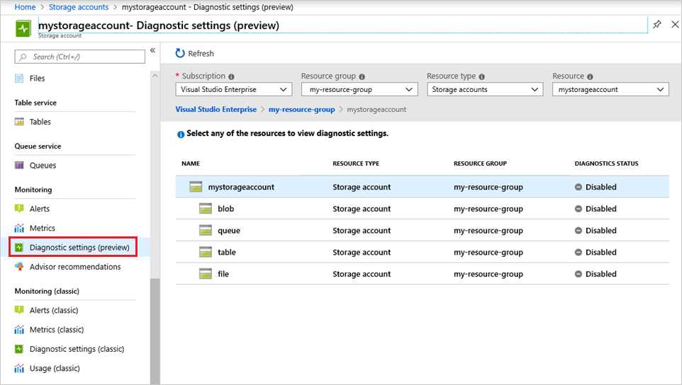
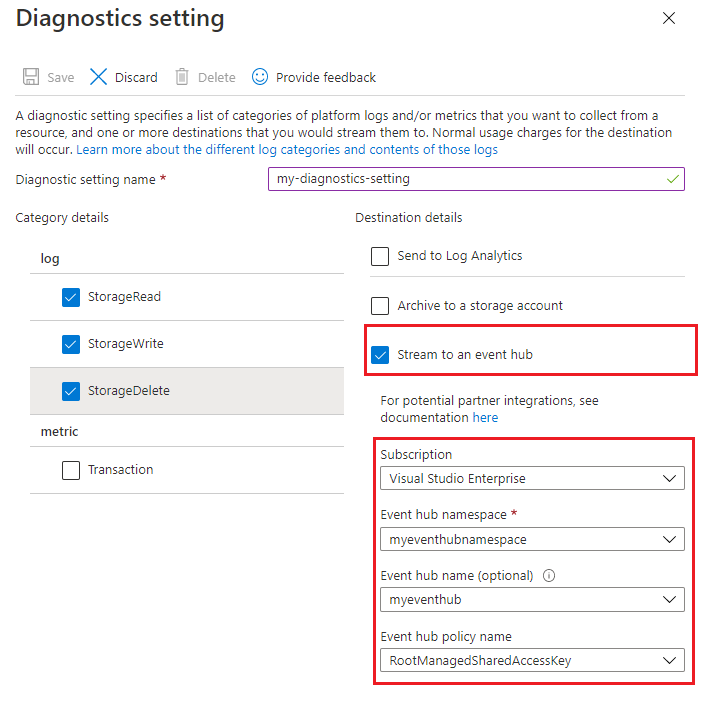

# Monitoring Azure Files

When you have critical applications and business processes that rely on Azure resources, you want to monitor those resources for their availability, performance, and operation. This article describes the monitoring data that's generated by Azure Files and how you can use the features of Azure Monitor to analyze alerts on this data.

## Monitor overview

The **Overview** page in the Azure portal for each Azure Files resource includes a brief view of the resource usage, such as requests and hourly billing. This information is useful, but only a small amount of the monitoring data is available. Some of this data is collected automatically and is available for analysis as soon as you create the resource. You can enable additional types of data collection with some configuration.

## What is Azure Monitor?
Azure Files creates monitoring data by using [Azure Monitor](../../azure-monitor/overview.md), which is a full stack monitoring service in Azure. Azure Monitor provides a complete set of features to monitor your Azure resources and resources in other clouds and on-premises. 

Start with the article [Monitoring Azure resources with Azure Monitor](../../azure-monitor/essentials/monitor-azure-resource.md), which describes the following:

- What is Azure Monitor?
- Costs associated with monitoring
- Monitoring data collected in Azure
- Configuring data collection
- Standard tools in Azure for analyzing and alerting on monitoring data

The following sections build on this article by describing the specific data gathered from Azure Files. Examples show how to configure data collection and analyze this data with Azure tools.

## Monitoring data

Azure Files collects the same kinds of monitoring data as other Azure resources, which are described in [Monitoring data from Azure resources](../../azure-monitor/essentials/monitor-azure-resource.md#monitoring-data). 

See [Azure File monitoring data reference](storage-files-monitoring-reference.md) for detailed information on the metrics and logs metrics created by Azure Files.

Metrics and logs in Azure Monitor support only Azure Resource Manager storage accounts. Azure Monitor doesn't support classic storage accounts. If you want to use metrics or logs on a classic storage account, you need to migrate to an Azure Resource Manager storage account. See [Migrate to Azure Resource Manager](../../virtual-machines/migration-classic-resource-manager-overview.md).

## Collection and routing

Platform metrics and the Activity log are collected automatically, but can be routed to other locations by using a diagnostic setting. 

To collect resource logs, you must create a diagnostic setting. When you create the setting, choose **file** as the type of storage that you want to enable logs for. Then, specify one of the following categories of operations for which you want to collect logs. 

| Category | Description |
|:---|:---|
| StorageRead | Read operations on objects. |
| StorageWrite | Write operations on objects. |
| StorageDelete | Delete operations on objects. |

To get the list of SMB and REST operations that are logged, see [Storage logged operations and status messages](/rest/api/storageservices/storage-analytics-logged-operations-and-status-messages) and [Azure Files monitoring data reference](storage-files-monitoring-reference.md).

## Creating a diagnostic setting

You can create a diagnostic setting by using the Azure portal, PowerShell, the Azure CLI, or an Azure Resource Manager template.

> [!NOTE]
> Azure Storage logs in Azure Monitor is in public preview and is available for preview testing in all public cloud regions. This preview enables logs for blobs (which includes Azure Data Lake Storage Gen2), files, queues,and tables. This feature is available for all storage accounts that are created with the Azure Resource Manager deployment model. See [Storage account overview](../common/storage-account-overview.md).

For general guidance, see [Create diagnostic setting to collect platform logs and metrics in Azure](../../azure-monitor/essentials/diagnostic-settings.md).

### [Azure portal](#tab/azure-portal)

1. Sign in to the Azure portal.

2. Navigate to your storage account.

3. In the **Monitoring** section, click **Diagnostic settings (preview)**.

   > [!div class="mx-imgBorder"]
   >    

4. Choose **file** as the type of storage that you want to enable logs for.

5. Click **Add diagnostic setting**.

   > [!div class="mx-imgBorder"]
   > 

   The **Diagnostic settings** page appears.

   > [!div class="mx-imgBorder"]
   > 

6. In the **Name** field of the page, enter a name for this Resource log setting. Then, select which operations you want logged (read, write, and delete operations), and where you want the logs to be sent.

#### Archive logs to a storage account

If you choose to archive your logs to a storage account, you'll pay for the volume of logs that are sent to the storage account. For specific pricing, see the **Platform Logs** section of the [Azure Monitor pricing](https://azure.microsoft.com/pricing/details/monitor/#platform-logs) page.

1. Select the **Archive to a storage account** checkbox, and then click the **Configure** button.

   > [!div class="mx-imgBorder"]   
   > 

2. In the **Storage account** drop-down list, select the storage account that you want to archive your logs to, click the **OK** button, and then click the **Save** button.

   [!INCLUDE [no retention policy](../../../includes/azure-storage-logs-retention-policy.md)]

   > [!NOTE]
   > Before you choose a storage account as the export destination, see [Archive Azure resource logs](../../azure-monitor/essentials/resource-logs.md#send-to-azure-storage) to understand prerequisites on the storage account.

#### Stream logs to Azure Event Hubs

If you choose to stream your logs to an event hub, you'll pay for the volume of logs that are sent to the event hub. For specific pricing, see the **Platform Logs** section of the [Azure Monitor pricing](https://azure.microsoft.com/pricing/details/monitor/#platform-logs) page.

1. Select the **Stream to an event hub** checkbox, and then click the **Configure** button.

2. In the **Select an event hub** pane, choose the namespace, name, and policy name of the event hub that you want to stream your logs to. 

   > [!div class="mx-imgBorder"]
   > 

3. Click the **OK** button, and then click the **Save** button.

#### Send logs to Azure Log Analytics

1. Select the **Send to Log Analytics** checkbox, select a log analytics workspace, and then click the and then click the **Save** button.

   > [!div class="mx-imgBorder"]   
   > 

### [PowerShell](#tab/azure-powershell)

1. Open a Windows PowerShell command window, and sign in to your Azure subscription by using the `Connect-AzAccount` command. Then, follow the on-screen directions.

   ```powershell
   Connect-AzAccount
   ```

2. Set your active subscription to subscription of the storage account that you want to enable logging for.

   ```powershell
   Set-AzContext -SubscriptionId <subscription-id>
   ```

#### Archive logs to a storage account

If you choose to archive your logs to a storage account, you'll pay for the volume of logs that are sent to the storage account. For specific pricing, see the **Platform Logs** section of the [Azure Monitor pricing](https://azure.microsoft.com/pricing/details/monitor/#platform-logs) page.

Enable logs by using the [Set-AzDiagnosticSetting](/powershell/module/az.monitor/set-azdiagnosticsetting) PowerShell cmdlet along with the `StorageAccountId` parameter.

```powershell
Set-AzDiagnosticSetting -ResourceId <storage-service-resource-id> -StorageAccountId <storage-account-resource-id> -Enabled $true -Category <operations-to-log> 
```

Replace the `<storage-service-resource--id>` placeholder in this snippet with the resource ID of the Azure File service. You can find the resource ID in the Azure portal by opening the **Properties** page of your storage account.

You can use `StorageRead`, `StorageWrite`, and `StorageDelete` for the value of the **Category** parameter.

[!INCLUDE [no retention policy](../../../includes/azure-storage-logs-retention-policy.md)]

Here's an example:

`Set-AzDiagnosticSetting -ResourceId /subscriptions/208841be-a4v3-4234-9450-08b90c09f4/resourceGroups/myresourcegroup/providers/Microsoft.Storage/storageAccounts/mystorageaccount/fileServices/default -StorageAccountId /subscriptions/208841be-a4v3-4234-9450-08b90c09f4/resourceGroups/myresourcegroup/providers/Microsoft.Storage/storageAccounts/myloggingstorageaccount -Enabled $true -Category StorageWrite,StorageDelete`

For a description of each parameter, see the [Archive Azure Resource logs via Azure PowerShell](../../azure-monitor/essentials/resource-logs.md#send-to-azure-storage).

#### Stream logs to an event hub

If you choose to stream your logs to an event hub, you'll pay for the volume of logs that are sent to the event hub. For specific pricing, see the **Platform Logs** section of the [Azure Monitor pricing](https://azure.microsoft.com/pricing/details/monitor/#platform-logs) page.

Enable logs by using the [Set-AzDiagnosticSetting](/powershell/module/az.monitor/set-azdiagnosticsetting) PowerShell cmdlet with the `EventHubAuthorizationRuleId` parameter.

```powershell
Set-AzDiagnosticSetting -ResourceId <storage-service-resource-id> -EventHubAuthorizationRuleId <event-hub-namespace-and-key-name> -Enabled $true -Category <operations-to-log> -RetentionEnabled <retention-bool> -RetentionInDays <number-of-days>
```

Here's an example:

`Set-AzDiagnosticSetting -ResourceId /subscriptions/208841be-a4v3-4234-9450-08b90c09f4/resourceGroups/myresourcegroup/providers/Microsoft.Storage/storageAccounts/mystorageaccount/fileServices/default -EventHubAuthorizationRuleId /subscriptions/20884142-a14v3-4234-5450-08b10c09f4/resourceGroups/myresourcegroup/providers/Microsoft.EventHub/namespaces/myeventhubnamespace/authorizationrules/RootManageSharedAccessKey -Enabled $true -Category StorageDelete`

For a description of each parameter, see the [Stream Data to Event Hubs via PowerShell cmdlets](../../azure-monitor/essentials/resource-logs.md#send-to-azure-event-hubs).

#### Send logs to Log Analytics

Enable logs by using the [Set-AzDiagnosticSetting](/powershell/module/az.monitor/set-azdiagnosticsetting) PowerShell cmdlet with the `WorkspaceId` parameter.

```powershell
Set-AzDiagnosticSetting -ResourceId <storage-service-resource-id> -WorkspaceId <log-analytics-workspace-resource-id> -Enabled $true -Category <operations-to-log> -RetentionEnabled <retention-bool> -RetentionInDays <number-of-days>
```

Here's an example:

`Set-AzDiagnosticSetting -ResourceId /subscriptions/208841be-a4v3-4234-9450-08b90c09f4/resourceGroups/myresourcegroup/providers/Microsoft.Storage/storageAccounts/mystorageaccount/fileServices/default -WorkspaceId /subscriptions/208841be-a4v3-4234-9450-08b90c09f4/resourceGroups/myresourcegroup/providers/Microsoft.OperationalInsights/workspaces/my-analytic-workspace -Enabled $true -Category StorageDelete`

For more information, see [Stream Azure Resource Logs to Log Analytics workspace in Azure Monitor](../../azure-monitor/essentials/resource-logs.md#send-to-log-analytics-workspace).

### [Azure CLI](#tab/azure-cli)

1. First, open the [Azure Cloud Shell](../../cloud-shell/overview.md), or if you've [installed](/cli/azure/install-azure-cli) the Azure CLI locally, open a command console application such as Windows PowerShell.

2. If your identity is associated with more than one subscription, then set your active subscription to subscription of the storage account that you want to enable logs for.

   ```azurecli-interactive
   az account set --subscription <subscription-id>
   ```

   Replace the `<subscription-id>` placeholder value with the ID of your subscription.

#### Archive logs to a storage account

If you choose to archive your logs to a storage account, you'll pay for the volume of logs that are sent to the storage account. For specific pricing, see the **Platform Logs** section of the [Azure Monitor pricing](https://azure.microsoft.com/pricing/details/monitor/#platform-logs) page.

Enable logs by using the [az monitor diagnostic-settings create](/cli/azure/monitor/diagnostic-settings#az_monitor_diagnostic_settings_create) command.

```azurecli-interactive
az monitor diagnostic-settings create --name <setting-name> --storage-account <storage-account-name> --resource <storage-service-resource-id> --resource-group <resource-group> --logs '[{"category": <operations>, "enabled": true}]'
```

Replace the `<storage-service-resource--id>` placeholder in this snippet with the resource ID Blob storage service. You can find the resource ID in the Azure portal by opening the **Properties** page of your storage account.

You can use `StorageRead`, `StorageWrite`, and `StorageDelete` for the value of the **category** parameter.

[!INCLUDE [no retention policy](../../../includes/azure-storage-logs-retention-policy.md)]

Here's an example:

`az monitor diagnostic-settings create --name setting1 --storage-account mystorageaccount --resource /subscriptions/938841be-a40c-4bf4-9210-08bcf06c09f9/resourceGroups/myresourcegroup/providers/Microsoft.Storage/storageAccounts/myloggingstorageaccount/fileServices/default --resource-group myresourcegroup --logs '[{"category": StorageWrite, "enabled": true}]'`

For a description of each parameter, see the [Archive Resource logs via the Azure CLI](../../azure-monitor/essentials/resource-logs.md#send-to-azure-storage).

#### Stream logs to an event hub

If you choose to stream your logs to an event hub, you'll pay for the volume of logs that are sent to the event hub. For specific pricing, see the **Platform Logs** section of the [Azure Monitor pricing](https://azure.microsoft.com/pricing/details/monitor/#platform-logs) page.

Enable logs by using the [az monitor diagnostic-settings create](/cli/azure/monitor/diagnostic-settings#az_monitor_diagnostic_settings_create) command.

```azurecli-interactive
az monitor diagnostic-settings create --name <setting-name> --event-hub <event-hub-name> --event-hub-rule <event-hub-namespace-and-key-name> --resource <storage-account-resource-id> --logs '[{"category": <operations>, "enabled": true "retentionPolicy": {"days": <number-days>, "enabled": <retention-bool}}]'
```

Here's an example:

`az monitor diagnostic-settings create --name setting1 --event-hub myeventhub --event-hub-rule /subscriptions/938841be-a40c-4bf4-9210-08bcf06c09f9/resourceGroups/myresourcegroup/providers/Microsoft.EventHub/namespaces/myeventhubnamespace/authorizationrules/RootManageSharedAccessKey --resource /subscriptions/938841be-a40c-4bf4-9210-08bcf06c09f9/resourceGroups/myresourcegroup/providers/Microsoft.Storage/storageAccounts/myloggingstorageaccount/fileServices/default --logs '[{"category": StorageDelete, "enabled": true }]'`

For a description of each parameter, see the [Stream data to Event Hubs via Azure CLI](../../azure-monitor/essentials/resource-logs.md#send-to-azure-event-hubs).

#### Send logs to Log Analytics

Enable logs by using the [az monitor diagnostic-settings create](/cli/azure/monitor/diagnostic-settings#az_monitor_diagnostic_settings_create) command.

```azurecli-interactive
az monitor diagnostic-settings create --name <setting-name> --workspace <log-analytics-workspace-resource-id> --resource <storage-account-resource-id> --logs '[{"category": <category name>, "enabled": true "retentionPolicy": {"days": <days>, "enabled": <retention-bool}}]'
```

Here's an example:

`az monitor diagnostic-settings create --name setting1 --workspace /subscriptions/208841be-a4v3-4234-9450-08b90c09f4/resourceGroups/myresourcegroup/providers/Microsoft.OperationalInsights/workspaces/my-analytic-workspace --resource /subscriptions/938841be-a40c-4bf4-9210-08bcf06c09f9/resourceGroups/myresourcegroup/providers/Microsoft.Storage/storageAccounts/myloggingstorageaccount/fileServices/default --logs '[{"category": StorageDelete, "enabled": true ]'`

 For more information, see [Stream Azure Resource Logs to Log Analytics workspace in Azure Monitor](../../azure-monitor/essentials/resource-logs.md#send-to-log-analytics-workspace).

### [Template](#tab/template)

To view an Azure Resource Manager template that creates a diagnostic setting, see [Diagnostic setting for Azure Storage](../../azure-monitor/essentials/resource-manager-diagnostic-settings.md#diagnostic-setting-for-azure-storage).

---

## Analyzing metrics

You can analyze metrics for Azure Storage with metrics from other Azure services by using Metrics Explorer. Open Metrics Explorer by choosing **Metrics** from the **Azure Monitor** menu. For details on using this tool, see [Getting started with Azure Metrics Explorer](../../azure-monitor/essentials/metrics-getting-started.md). 

For metrics that support dimensions, you can filter the metric with the desired dimension value.  For a complete list of the dimensions that Azure Storage supports, see [Metrics dimensions](storage-files-monitoring-reference.md#metrics-dimensions). Metrics for Azure Files are in these namespaces: 

- Microsoft.Storage/storageAccounts
- Microsoft.Storage/storageAccounts/fileServices

For a list of all Azure Monitor support metrics, which includes Azure Files, see [Azure Monitor supported metrics](../../azure-monitor/essentials/metrics-supported.md#microsoftstoragestorageaccountsfileservices).

### Accessing metrics

> [!TIP]
> To view Azure CLI or .NET examples, choose the corresponding tabs listed here.

### [PowerShell](#tab/azure-powershell)

#### List the metric definition

You can list the metric definition of your storage account or the Azure Files service. Use the [Get-AzMetricDefinition](/powershell/module/az.monitor/get-azmetricdefinition) cmdlet.

In this example, replace the `<resource-ID>` placeholder with the resource ID of the entire storage account or the resource ID of the Azure Files service.  You can find these resource IDs on the **Properties** pages of your storage account in the Azure portal.

```powershell
   $resourceId = "<resource-ID>"
   Get-AzMetricDefinition -ResourceId $resourceId
```

#### Reading metric values

You can read account-level metric values of your storage account or the Azure Files service. Use the [Get-AzMetric](/powershell/module/Az.Monitor/Get-AzMetric) cmdlet.

```powershell
   $resourceId = "<resource-ID>"
   Get-AzMetric -ResourceId $resourceId -MetricNames "UsedCapacity" -TimeGrain 01:00:00
```

### [Azure CLI](#tab/azure-cli)

#### List the account-level metric definition

You can list the metric definition of your storage account or the Azure Files service. Use the [az monitor metrics list-definitions](/cli/azure/monitor/metrics#az_monitor_metrics_list_definitions) command.
 
In this example, replace the `<resource-ID>` placeholder with the resource ID of the entire storage account or the resource ID of the Azure Files service. You can find these resource IDs on the **Properties** pages of your storage account in the Azure portal.

```azurecli-interactive
   az monitor metrics list-definitions --resource <resource-ID>
```

#### Read account-level metric values

You can read the metric values of your storage account or the Azure Files service. Use the [az monitor metrics list](/cli/azure/monitor/metrics#az_monitor_metrics_list) command.

```azurecli-interactive
   az monitor metrics list --resource <resource-ID> --metric "UsedCapacity" --interval PT1H
```

### [.NET](#tab/azure-portal)

Azure Monitor provides the [.NET SDK](https://www.nuget.org/packages/Microsoft.Azure.Management.Monitor/) to read metric definition and values. The [sample code](https://azure.microsoft.com/resources/samples/monitor-dotnet-metrics-api/) shows how to use the SDK with different parameters. You need to use `0.18.0-preview` or a later version for storage metrics.
 
In these examples, replace the `<resource-ID>` placeholder with the resource ID of the entire storage account or the Azure Files service. You can find these resource IDs on the **Properties** pages of your storage account in the Azure portal.

Replace the `<subscription-ID>` variable with the ID of your subscription. For guidance on how to obtain values for `<tenant-ID>`, `<application-ID>`, and `<AccessKey>`, see [Use the portal to create an Azure AD application and service principal that can access resources](../../active-directory/develop/howto-create-service-principal-portal.md). 

#### List the account-level metric definition

The following example shows how to list a metric definition at the account level:

```csharp
    public static async Task ListStorageMetricDefinition()
    {
        var resourceId = "<resource-ID>";
        var subscriptionId = "<subscription-ID>";
        var tenantId = "<tenant-ID>";
        var applicationId = "<application-ID>";
        var accessKey = "<AccessKey>";


        MonitorManagementClient readOnlyClient = AuthenticateWithReadOnlyClient(tenantId, applicationId, accessKey, subscriptionId).Result;
        IEnumerable<MetricDefinition> metricDefinitions = await readOnlyClient.MetricDefinitions.ListAsync(resourceUri: resourceId, cancellationToken: new CancellationToken());

        foreach (var metricDefinition in metricDefinitions)
        {
            // Enumrate metric definition:
            //    Id
            //    ResourceId
            //    Name
            //    Unit
            //    MetricAvailabilities
            //    PrimaryAggregationType
            //    Dimensions
            //    IsDimensionRequired
        }
    }

```

#### Reading account-level metric values

The following example shows how to read `UsedCapacity` data at the account level:

```csharp
    public static async Task ReadStorageMetricValue()
    {
        var resourceId = "<resource-ID>";
        var subscriptionId = "<subscription-ID>";
        var tenantId = "<tenant-ID>";
        var applicationId = "<application-ID>";
        var accessKey = "<AccessKey>";

        MonitorClient readOnlyClient = AuthenticateWithReadOnlyClient(tenantId, applicationId, accessKey, subscriptionId).Result;

        Microsoft.Azure.Management.Monitor.Models.Response Response;

        string startDate = DateTime.Now.AddHours(-3).ToUniversalTime().ToString("o");
        string endDate = DateTime.Now.ToUniversalTime().ToString("o");
        string timeSpan = startDate + "/" + endDate;

        Response = await readOnlyClient.Metrics.ListAsync(
            resourceUri: resourceId,
            timespan: timeSpan,
            interval: System.TimeSpan.FromHours(1),
            metricnames: "UsedCapacity",

            aggregation: "Average",
            resultType: ResultType.Data,
            cancellationToken: CancellationToken.None);

        foreach (var metric in Response.Value)
        {
            // Enumrate metric value
            //    Id
            //    Name
            //    Type
            //    Unit
            //    Timeseries
            //        - Data
            //        - Metadatavalues
        }
    }

```

#### Reading multidimensional metric values

For multidimensional metrics, you need to define metadata filters if you want to read metric data on specific dimension values.

The following example shows how to read metric data on the metric supporting multidimension:

```csharp
    public static async Task ReadStorageMetricValueTest()
    {
        // Resource ID for Azure Files
        var resourceId = "/subscriptions/{subscriptionId}/resourceGroups/{resourceGroupName}/providers/Microsoft.Storage/storageAccounts/{storageAccountName}/fileServices/default";
        var subscriptionId = "<subscription-ID}";
        // How to identify Tenant ID, Application ID and Access Key: https://azure.microsoft.com/documentation/articles/resource-group-create-service-principal-portal/
        var tenantId = "<tenant-ID>";
        var applicationId = "<application-ID>";
        var accessKey = "<AccessKey>";

        MonitorManagementClient readOnlyClient = AuthenticateWithReadOnlyClient(tenantId, applicationId, accessKey, subscriptionId).Result;

        Microsoft.Azure.Management.Monitor.Models.Response Response;

        string startDate = DateTime.Now.AddHours(-3).ToUniversalTime().ToString("o");
        string endDate = DateTime.Now.ToUniversalTime().ToString("o");
        string timeSpan = startDate + "/" + endDate;
        // It's applicable to define meta data filter when a metric support dimension
        // More conditions can be added with the 'or' and 'and' operators, example: BlobType eq 'BlockBlob' or BlobType eq 'PageBlob'
        ODataQuery<MetadataValue> odataFilterMetrics = new ODataQuery<MetadataValue>(
            string.Format("BlobType eq '{0}'", "BlockBlob"));

        Response = readOnlyClient.Metrics.List(
                        resourceUri: resourceId,
                        timespan: timeSpan,
                        interval: System.TimeSpan.FromHours(1),
                        metricnames: "BlobCapacity",
                        odataQuery: odataFilterMetrics,
                        aggregation: "Average",
                        resultType: ResultType.Data);

        foreach (var metric in Response.Value)
        {
            //Enumrate metric value
            //    Id
            //    Name
            //    Type
            //    Unit
            //    Timeseries
            //        - Data
            //        - Metadatavalues
        }
    }

```

# [Template](#tab/template)

N/A.

---

## Analyzing logs

You can access resource logs either as a blob in a storage account, as event data, or through Log Analytic queries.

To get the list of SMB and REST operations that are logged, see [Storage logged operations and status messages](/rest/api/storageservices/storage-analytics-logged-operations-and-status-messages) and [Azure Files monitoring data reference](storage-files-monitoring-reference.md).

> [!NOTE]
> Azure Storage logs in Azure Monitor is in public preview and is available for preview testing in all public cloud regions. This preview enables logs for blobs (which includes Azure Data Lake Storage Gen2), files, queues, tables, premium storage accounts in general-purpose v1, and general-purpose v2 storage accounts. Classic storage accounts aren't supported.

Log entries are created only if there are requests made against the service endpoint. For example, if a storage account has activity in its file endpoint but not in its table or queue endpoints, only logs that pertain to the Azure File service are created. Azure Storage logs contain detailed information about successful and failed requests to a storage service. This information can be used to monitor individual requests and to diagnose issues with a storage service. Requests are logged on a best-effort basis.

### Log authenticated requests

 The following types of authenticated requests are logged:

- Successful requests
- Failed requests, including timeout, throttling, network, authorization, and other errors
- Requests that use Kerberos, NTLM or shared access signature (SAS), including failed and successful requests
- Requests to analytics data (classic log data in the **$logs** container and classic metric data in the **$metric** tables)

Requests made by the Azure Files service itself, such as log creation or deletion, aren't logged. For a full list of the SMB and REST requests that are logged, see [Storage logged operations and status messages](/rest/api/storageservices/storage-analytics-logged-operations-and-status-messages) and [Azure Files monitoring data reference](storage-files-monitoring-reference.md).

### Accessing logs in a storage account

Logs appear as blobs stored to a container in the target storage account. Data is collected and stored inside a single blob as a line-delimited JSON payload. The name of the blob follows this naming convention:

`https://<destination-storage-account>.blob.core.windows.net/insights-logs-<storage-operation>/resourceId=/subscriptions/<subscription-ID>/resourceGroups/<resource-group-name>/providers/Microsoft.Storage/storageAccounts/<source-storage-account>/fileServices/default/y=<year>/m=<month>/d=<day>/h=<hour>/m=<minute>/PT1H.json`

Here's an example:

`https://mylogstorageaccount.blob.core.windows.net/insights-logs-storagewrite/resourceId=/subscriptions/`<br>`208841be-a4v3-4234-9450-08b90c09f4/resourceGroups/myresourcegroup/providers/Microsoft.Storage/storageAccounts/mystorageaccount/fileServices/default/y=2019/m=07/d=30/h=23/m=12/PT1H.json`

### Accessing logs in an event hub

Logs sent to an event hub aren't stored as a file, but you can verify that the event hub received the log information. In the Azure portal, go to your event hub and verify that the **incoming messages** count is greater than zero. 


You can access and read log data that's sent to your event hub by using security information and event management and monitoring tools. For more information, see [What can I do with the monitoring data being sent to my event hub?](../../azure-monitor/essentials/stream-monitoring-data-event-hubs.md).

### Accessing logs in a Log Analytics workspace

You can access logs sent to a Log Analytics workspace by using Azure Monitor log queries. Data is stored in the **StorageFileLogs** table. 

For more information, see [Log Analytics tutorial](../../azure-monitor/logs/log-analytics-tutorial.md).

#### Sample Kusto queries

Here are some queries that you can enter in the **Log search** bar to help you monitor your Azure Files. These queries work with the [new language](../../azure-monitor/logs/log-query-overview.md).

> [!IMPORTANT]
> When you select **Logs** from the storage account resource group menu, Log Analytics is opened with the query scope set to the current resource group. This means that log queries will only include data from that resource group. If you want to run a query that includes data from other resources or data from other Azure services, select **Logs** from the **Azure Monitor** menu. See [Log query scope and time range in Azure Monitor Log Analytics](../../azure-monitor/logs/scope.md) for details.

Use these queries to help you monitor your Azure file shares:

- View SMB errors over the last week

```Kusto
StorageFileLogs
| where Protocol == "SMB" and TimeGenerated >= ago(7d) and StatusCode contains "-"
| sort by StatusCode
```
- Create a pie chart of SMB operations over the last week

```Kusto
StorageFileLogs
| where Protocol == "SMB" and TimeGenerated >= ago(7d) 
| summarize count() by OperationName
| sort by count_ desc
| render piechart
```

- View REST errors over the last week

```Kusto
StorageFileLogs
| where Protocol == "HTTPS" and TimeGenerated >= ago(7d) and StatusText !contains "Success"
| sort by StatusText asc
```

- Create a pie chart of REST operations over the last week

```Kusto
StorageFileLogs
| where Protocol == "HTTPS" and TimeGenerated >= ago(7d) 
| summarize count() by OperationName
| sort by count_ desc
| render piechart
```

To view the list of column names and descriptions for Azure Files, see [StorageFileLogs](/azure/azure-monitor/reference/tables/storagefilelogs).

For more information on how to write queries, see [Log Analytics tutorial](../../azure-monitor/logs/log-analytics-tutorial.md).

## Alerts

Azure Monitor alerts proactively notify you when important conditions are found in your monitoring data. They allow you to identify and address issues in your system before your customers notice them. You can set alerts on [metrics](../../azure-monitor/alerts/alerts-metric-overview.md), [logs](../../azure-monitor/alerts/alerts-unified-log.md), and the [activity log](../../azure-monitor/alerts/activity-log-alerts.md). 

The following table lists some example scenarios to monitor and the proper metric to use for the alert:

| Scenario | Metric to use for alert |
|-|-|
| File share is throttled. | Metric: Transactions<br>Dimension name: Response type <br>Dimension name: FileShare (premium file share only) |
| File share size is 80% of capacity. | Metric: File Capacity<br>Dimension name: FileShare (premium file share only) |
| File share egress has exceeded 500 GiB in one day. | Metric: Egress<br>Dimension name: FileShare (premium file share only) |

### How to create alerts for Azure Files

1. Go to your **storage account** in the **Azure portal**. 

2. Click **Alerts** and then click **+ New alert rule**.

3. Click **Edit resource**, select the **File resource type** and then click **Done**. 

4. Click **Add condition** and provide the following information for the alert: 

	- **Metric**
	- **Dimension name**
	- **Alert logic**

5. Click **Add action groups** and add an action group (email, SMS, etc.) to the alert either by selecting an existing action group or creating a new action group.

6. Fill in the **Alert details** like **Alert rule name**, **Description**, and **Severity**.

7. Click **Create alert rule** to create the alert.

> [!NOTE]  
> If you create an alert and it's too noisy, adjust the threshold value and alert logic.

### How to create an alert if a file share is throttled

1. Go to your **storage account** in the **Azure portal**.
2. In the **Monitoring** section, click **Alerts**, and then click **+ New alert rule**.
3. Click **Edit resource**, select the **File resource type** for the storage account and then click **Done**. For example, if the storage account name is `contoso`, select the `contoso/file` resource.
4. Click **Add condition** to add a condition.
5. You will see a list of signals supported for the storage account, select the **Transactions** metric.
6. On the **Configure signal logic** blade, click the **Dimension name** drop-down and select **Response type**.
7. Click the **Dimension values** drop-down and select the appropriate response types for your file share.

    For standard file shares, select the following response types:

    - SuccessWithShareIopsThrottling
    - SuccessWithThrottling
    - ClientShareIopsThrottlingError

    For premium file shares, select the following response types:

    - SuccessWithShareEgressThrottling
    - SuccessWithShareIngressThrottling
    - SuccessWithShareIopsThrottling
    - ClientShareEgressThrottlingError
    - ClientShareIngressThrottlingError
    - ClientShareIopsThrottlingError

   > [!NOTE]
   > If the response types are not listed in the **Dimension values** drop-down, this means the resource has not been throttled. To add the dimension values, next to the **Dimension values** drop-down list, select **Add custom value**, enter the respone type (for example, **SuccessWithThrottling**), select **OK**, and then repeat these steps to add all applicable response types for your file share.

8. For **premium file shares**, click the **Dimension name** drop-down and select **File Share**. For **standard file shares**, skip to **step #10**.

   > [!NOTE]
   > If the file share is a standard file share, the **File Share** dimension will not list the file share(s) because per-share metrics are not available for standard file shares. Throttling alerts for standard file shares will be triggered if any file share within the storage account is throttled and the alert will not identify which file share was throttled. Since per-share metrics are not available for standard file shares, the recommendation is to have one file share per storage account.

9. Click the **Dimension values** drop-down and select the file share(s) that you want to alert on.
10. Define the **alert parameters** (threshold value, operator, aggregation granularity and frequency of evaluation) and click **Done**.

    > [!TIP]
    > If you are using a static threshold, the metric chart can help determine a reasonable threshold value if the file share is currently being throttled. If you are using a dynamic threshold, the metric chart will display the calculated thresholds based on recent data.

11. Click **Add action groups** to add an **action group** (email, SMS, etc.) to the alert either by selecting an existing action group or creating a new action group.
12. Fill in the **Alert details** like **Alert rule name**, **Description**, and **Severity**.
13. Click **Create alert rule** to create the alert.

### How to create an alert if the Azure file share size is 80% of capacity

1. Go to your **storage account** in the **Azure portal**.
2. In the **Monitoring** section, click **Alerts** and then click **+ New alert rule**.
3. Click **Edit resource**, select the **File resource type** for the storage account and then click **Done**. For example, if the storage account name is `contoso`, select the `contoso/file` resource.
4. Click **Add condition** to add a condition.
5. You will see a list of signals supported for the storage account, select the **File Capacity** metric.
6. For **premium file shares**, click the **Dimension name** drop-down and select **File Share**. For **standard file shares**, skip to **step #8**.

   > [!NOTE]
   > If the file share is a standard file share, the **File Share** dimension will not list the file share(s) because per-share metrics are not available for standard file shares. Alerts for standard file shares are based on all file shares in the storage account. Since per-share metrics are not available for standard file shares, the recommendation is to have one file share per storage account.

7. Click the **Dimension values** drop-down and select the file share(s) that you want to alert on.
8. Enter the **Threshold value** in bytes. For example, if the file share size is 100 TiB and you want to receive an alert when the file share size is 80% of capacity, the threshold value in bytes is 87960930222080.
9. Define the rest of the **alert parameters** (aggregation granularity and frequency of evaluation) and click **Done**.
10. Click **Add action groups** to add an **action group** (email, SMS, etc.) to the alert either by selecting an existing action group or creating a new action group.
11. Fill in the **Alert details** like **Alert rule name**, **Description**, and **Severity**.
12. Click **Create alert rule** to create the alert.

### How to create an alert if the Azure file share egress has exceeded 500 GiB in a day

1. Go to your **storage account** in the **Azure portal**.
2. In the Monitoring section, click **Alerts** and then click **+ New alert rule**.
3. Click **Edit resource**, select the **File resource type** for the storage account and then click **Done**. For example, if the storage account name is contoso, select the contoso/file resource.
4. Click **Add condition** to add a condition.
5. You will see a list of signals supported for the storage account, select the **Egress** metric.
6. For **premium file shares**, click the **Dimension name** drop-down and select **File Share**. For **standard file shares**, skip to **step #8**.

   > [!NOTE]
   > If the file share is a standard file share, the **File Share** dimension will not list the file share(s) because per-share metrics are not available for standard file shares. Alerts for standard file shares are based on all file shares in the storage account. Since per-share metrics are not available for standard file shares, the recommendation is to have one file share per storage account.

7. Click the **Dimension values** drop-down and select the file share(s) that you want to alert on.
8. Enter **536870912000** bytes for Threshold value. 
9. Click the **Aggregation granularity** drop-down and select **24 hours**.
10. Select the **Frequency of evaluation** and **click Done**.
11. Click **Add action groups** to add an **action group** (email, SMS, etc.) to the alert either by selecting an existing action group or creating a new action group.
12. Fill in the **Alert details** like **Alert rule name**, **Description**, and **Severity**.
13. Click **Create alert rule** to create the alert.

## Next steps

- [Azure Files monitoring data reference](storage-files-monitoring-reference.md)
- [Monitor Azure resources with Azure Monitor](../../azure-monitor/essentials/monitor-azure-resource.md)
- [Azure Storage metrics migration](../common/storage-metrics-migration.md)
- [Planning for an Azure Files deployment](./storage-files-planning.md)
- [How to deploy Azure Files](./storage-how-to-create-file-share.md)
- [Troubleshoot Azure Files on Windows](./storage-troubleshoot-windows-file-connection-problems.md)
- [Troubleshoot Azure Files on Linux](./storage-troubleshoot-linux-file-connection-problems.md)
