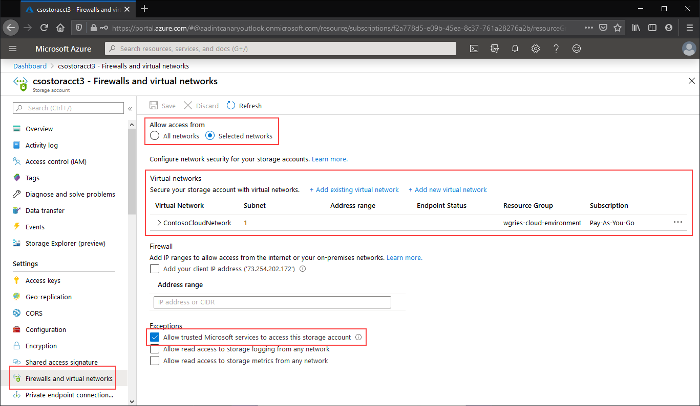

# Configuring Azure Files network endpoints
Azure Files provides two main types of endpoints for accessing Azure file shares: 
- Public endpoints, which have a public IP address and can be accessed from anywhere in the world.
- Private endpoints, which exist within a virtual network and have a private IP address from within the address space of that virtual network.

Public and private endpoints exist on the Azure storage account. A storage account is a management construct that represents a shared pool of storage in which you can deploy multiple file shares, as well as other storage resources, such as blob containers or queues.

This article focuses on how to configure a storage account's endpoints for accessing the Azure file share directly. Most of the detail provided within this document also applies to how Azure File Sync interoperates with public and private endpoints for the storage account, however for more information about networking considerations for an Azure File Sync deployment, see [configuring Azure File Sync proxy and firewall settings](storage-sync-files-firewall-and-proxy.md).

We recommend reading [Azure Files networking considerations](storage-files-networking-overview.md) prior to reading this how to guide.

## Prerequisites
- This article assumes that you have already created an Azure subscription. If you don't already have a subscription, then create a [free account](https://azure.microsoft.com/free/?WT.mc_id=A261C142F) before you begin.
- This article assumes that you have already created an Azure file share in a storage account which you would like to connect to from on-premises. To learn how to create an Azure file share, see [Create an Azure file share](storage-how-to-create-file-share.md).
- If you intend to use Azure PowerShell, [install the latest version](https://docs.microsoft.com/powershell/azure/install-az-ps).
- If you intend to use the Azure CLI, [install the latest version](https://docs.microsoft.com/cli/azure/install-azure-cli?view=azure-cli-latest).

## Create a private endpoint
Creating a private endpoint for your storage account will result in the following Azure resources being deployed:

- **A private endpoint**: An Azure resource representing the storage account's private endpoint. You can think of this as a resource that connects a storage account and a network interface.
- **A network interface (NIC)**: The network interface that maintains a private IP address within the specified virtual network/subnet. This is the exact same resource that gets deployed when you deploy a virtual machine, however instead of being assigned to a VM, it's owned by the private endpoint.
- **A private DNS zone**: If you've never deployed a private endpoint for this virtual network before, a new private DNS zone will be deployed for your virtual network. A DNS A record will also be created for the storage account in this DNS zone. If you've already deployed a private endpoint in this virtual network, a new A record for the storage account will be added to the existing DNS zone. Deploying a DNS zone is optional, however highly recommended, and required if you are mounting your Azure file shares with an AD service principal or using the FileREST API.

> [!Note]  
> This article uses the storage account DNS suffix for the Azure Public regions, `core.windows.net`. This commentary also applies to Azure Sovereign clouds such as the Azure US Government cloud and the Azure China cloud - just substitute the the appropriate suffixes for your environment. 

# [Portal](#tab/azure-portal)
Navigate to the storage account for which you would like to create a private endpoint. In the table of contents for the storage account, select **Private endpoint connections**, and then **+ Private endpoint** to create a new private endpoint. 


The resulting wizard has multiple pages to complete.

In the **Basics** blade, select the desired resource group, name, and region for your private endpoint. These can be whatever you want, they don't have to match the storage account in anyway, although you must create the private endpoint in the same region as the virtual network you wish to create the private endpoint in.


In the **Resource** blade, select the radio button for **Connect to an Azure resource in my directory**. Under **Resource type**, select **Microsoft.Storage/storageAccounts** for the resource type. The **Resource** field is the storage account with the Azure file share you wish to connect to. Target sub-resource is **file**, since this is for Azure Files.

The **Configuration** blade allows you to select the specific virtual network and subnet you would like to add your private endpoint to. Select the virtual network you created above. You must select a distinct subnet from the subnet you added your service endpoint to above. The Configuration blade also contains the information for creating/update the private DNS zone. We recommend using the default `privatelink.file.core.windows.net` zone.


Click **Review + create** to create the private endpoint. 

If you have a virtual machine inside of your virtual network, or you've configured DNS forwarding as described [here](storage-files-networking-dns.md), you can test that your private endpoint has been setup correctly by running the following commands from PowerShell, the command line, or the terminal (works for Windows, Linux, or macOS). You must replace `<storage-account-name>` with the appropriate storage account name:

```
nslookup <storage-account-name>.file.core.windows.net
```

If everything has worked successfully, you should see the following output, where `192.168.0.5` is the private IP address of the private endpoint in your virtual network (output shown for Windows):

```Output
Server:  UnKnown
Address:  10.2.4.4

Non-authoritative answer:
Name:    storageaccount.privatelink.file.core.windows.net
Address:  192.168.0.5
Aliases:  storageaccount.file.core.windows.net
```

# [PowerShell](#tab/azure-powershell)
To create a private endpoint for your storage account, you first need to get a reference to your storage account and the virtual network subnet to which you want to add the private endpoint. Replace `<storage-account-resource-group-name>`,  `<storage-account-name>`, `<vnet-resource-group-name>`, `<vnet-name>`, and `<vnet-subnet-name>` below:

```PowerShell
$storageAccountResourceGroupName = "<storage-account-resource-group-name>"
$storageAccountName = "<storage-account-name>"
$virtualNetworkResourceGroupName = "<vnet-resource-group-name>"
$virtualNetworkName = "<vnet-name>"
$subnetName = "<vnet-subnet-name>"

# Get storage account reference, and throw error if it doesn't exist
$storageAccount = Get-AzStorageAccount `
        -ResourceGroupName $storageAccountResourceGroupName `
        -Name $storageAccountName `
        -ErrorAction SilentlyContinue

if ($null -eq $storageAccount) {
    $errorMessage = "Storage account $storageAccountName not found "
    $errorMessage += "in resource group $storageAccountResourceGroupName."
    Write-Error -Message $errorMessage -ErrorAction Stop
}

# Get virtual network reference, and throw error if it doesn't exist
$virtualNetwork = Get-AzVirtualNetwork `
        -ResourceGroupName $virtualNetworkResourceGroupName `
        -Name $virtualNetworkName `
        -ErrorAction SilentlyContinue

if ($null -eq $virtualNetwork) {
    $errorMessage = "Virtual network $virtualNetworkName not found "
    $errorMessage += "in resource group $virtualNetworkResourceGroupName."
    Write-Error -Message $errorMessage -ErrorAction Stop
}

# Get reference to virtual network subnet, and throw error if it doesn't exist
$subnet = $virtualNetwork | `
    Select-Object -ExpandProperty Subnets | `
    Where-Object { $_.Name -eq $subnetName }

if ($null -eq $subnet) {
    Write-Error `
            -Message "Subnet $subnetName not found in virtual network $virtualNetworkName." `
            -ErrorAction Stop
}
```

To create a private endpoint, you must create a private link service connection to the storage account. The private link service connection is an input to the creation of the private endpoint. 

```PowerShell
# Disable private endpoint network policies
$subnet.PrivateEndpointNetworkPolicies = "Disabled"
$virtualNetwork | Set-AzVirtualNetwork | Out-Null

# Create a private link service connection to the storage account.
$privateEndpointConnection = New-AzPrivateLinkServiceConnection `
        -Name "$storageAccountName-Connection" `
        -PrivateLinkServiceId $storageAccount.Id `
        -GroupId "file"

# Create a new private endpoint.
$privateEndpoint = New-AzPrivateEndpoint `
        -ResourceGroupName $storageAccountResourceGroupName `
        -Name "$storageAccountName-PrivateEndpoint" `
        -Location $virtualNetwork.Location `
        -Subnet $subnet `
        -PrivateLinkServiceConnection $privateEndpointConnection `
        -ErrorAction Stop
```

Creating an Azure private DNS zone enables the original name of the storage account, such as `storageaccount.file.core.windows.net` to resolve to the private IP inside of the virtual network. Although optional from the perspective of creating a private endpoint, it is explicitly required for mounting the Azure file share using an AD user principal or accessing via the REST API.  

```PowerShell
# Get the desired storage account suffix (core.windows.net for public cloud).
# This is done like this so this script will seamlessly work for non-public Azure.
$storageAccountSuffix = Get-AzContext | `
    Select-Object -ExpandProperty Environment | `
    Select-Object -ExpandProperty StorageEndpointSuffix

# For public cloud, this will generate the following DNS suffix:
# privatelink.file.core.windows.net.
$dnsZoneName = "privatelink.file.$storageAccountSuffix"

# Find a DNS zone matching desired name attached to this virtual network.
$dnsZone = Get-AzPrivateDnsZone | `
    Where-Object { $_.Name -eq $dnsZoneName } | `
    Where-Object {
        $privateDnsLink = Get-AzPrivateDnsVirtualNetworkLink `
                -ResourceGroupName $_.ResourceGroupName `
                -ZoneName $_.Name `
                -ErrorAction SilentlyContinue
        
        $privateDnsLink.VirtualNetworkId -eq $virtualNetwork.Id
    }

if ($null -eq $dnsZone) {
    # No matching DNS zone attached to virtual network, so create new one.
    $dnsZone = New-AzPrivateDnsZone `
            -ResourceGroupName $virtualNetworkResourceGroupName `
            -Name $dnsZoneName `
            -ErrorAction Stop

    $privateDnsLink = New-AzPrivateDnsVirtualNetworkLink `
            -ResourceGroupName $virtualNetworkResourceGroupName `
            -ZoneName $dnsZoneName `
            -Name "$virtualNetworkName-DnsLink" `
            -VirtualNetworkId $virtualNetwork.Id `
            -ErrorAction Stop
}
```

Now that you have a reference to the private DNS zone, you must create an A record for your storage account.

```PowerShell
$privateEndpointIP = $privateEndpoint | `
    Select-Object -ExpandProperty NetworkInterfaces | `
    Select-Object @{ 
        Name = "NetworkInterfaces"; 
        Expression = { Get-AzNetworkInterface -ResourceId $_.Id } 
    } | `
    Select-Object -ExpandProperty NetworkInterfaces | `
    Select-Object -ExpandProperty IpConfigurations | `
    Select-Object -ExpandProperty PrivateIpAddress

$privateDnsRecordConfig = New-AzPrivateDnsRecordConfig `
        -IPv4Address $privateEndpointIP

New-AzPrivateDnsRecordSet `
        -ResourceGroupName $virtualNetworkResourceGroupName `
        -Name $storageAccountName `
        -RecordType A `
        -ZoneName $dnsZoneName `
        -Ttl 600 `
        -PrivateDnsRecords $privateDnsRecordConfig `
        -ErrorAction Stop | `
    Out-Null
```

If you have a virtual machine inside of your virtual network, or you've configured DNS forwarding as described [here](storage-files-networking-dns.md), you can test that your private endpoint has been setup correctly with the following commands:

```PowerShell
$storageAccountHostName = [System.Uri]::new($storageAccount.PrimaryEndpoints.File) | `
    Select-Object -ExpandProperty Host

Resolve-DnsName -Name $storageAccountHostName
```

If everything has worked successfully, you should see the following output, where `192.168.0.5` is the private IP address of the private endpoint in your virtual network:

```Output
Name                             Type   TTL   Section    NameHost
----                             ----   ---   -------    --------
storageaccount.file.core.windows CNAME  60    Answer     storageaccount.privatelink.file.core.windows.net
.net

Name       : storageaccount.privatelink.file.core.windows.net
QueryType  : A
TTL        : 600
Section    : Answer
IP4Address : 192.168.0.5
```

# [Azure CLI](#tab/azure-cli)
To create a private endpoint for your storage account, you first need to get a reference to your storage account and the virtual network subnet to which you want to add the private endpoint. Replace `<storage-account-resource-group-name>`,  `<storage-account-name>`, `<vnet-resource-group-name>`, `<vnet-name>`, and `<vnet-subnet-name>` below:

```bash
storageAccountResourceGroupName="<storage-account-resource-group-name>"
storageAccountName="<storage-account-name>"
virtualNetworkResourceGroupName="<vnet-resource-group-name>"
virtualNetworkName="<vnet-name>"
subnetName="<vnet-subnet-name>"

# Get storage account ID 
storageAccount=$(az storage account show \
        --resource-group $storageAccountResourceGroupName \
        --name $storageAccountName \
        --query "id" | \
    tr -d '"')

# Get virtual network ID
virtualNetwork=$(az network vnet show \
        --resource-group $virtualNetworkResourceGroupName \
        --name $virtualNetworkName \
        --query "id" | \
    tr -d '"')

# Get subnet ID
subnet=$(az network vnet subnet show \
        --resource-group $virtualNetworkResourceGroupName \
        --vnet-name $virtualNetworkName \
        --name $subnetName \
        --query "id" | \
    tr -d '"')
```

To create a private endpoint, you must first ensure that the subnet's private endpoint network policy is set to disabled. Then you can create a private endpoint with the `az network private-endpoint create` command

```bash
# Disable private endpoint network policies
az network vnet subnet update \
        --ids $subnet \
        --disable-private-endpoint-network-policies \
        --output none

# Get virtual network location
region=$(az network vnet show \
        --ids $virtualNetwork \
        --query "location" | \
    tr -d '"')

# Create a private endpoint
privateEndpoint=$(az network private-endpoint create \
        --resource-group $virtualNetworkResourceGroupName \
        --name "$storageAccountName-PrivateEndpoint" \
        --location $region \
        --subnet $subnet \
        --private-connection-resource-id $storageAccount \
        --group-ids "file" \
        --connection-name "$storageAccountName-Connection" \
        --query "id" | \
    tr -d '"')
```

Creating an Azure private DNS zone enables the original name of the storage account, such as `storageaccount.file.core.windows.net` to resolve to the private IP inside of the virtual network. Although optional from the perspective of creating a private endpoint, it is explicitly required for mounting the Azure file share using an AD user principal or accessing via the REST API.  

```bash
# Get the desired storage account suffix (core.windows.net for public cloud).
# This is done like this so this script will seamlessly work for non-public Azure.
storageAccountSuffix=$(az cloud show \
        --query "suffixes.storageEndpoint" | \
    tr -d '"')

# For public cloud, this will generate the following DNS suffix:
# privatelink.file.core.windows.net.
dnsZoneName="privatelink.file.$storageAccountSuffix"

# Find a DNS zone matching desired name attached to this virtual network.
possibleDnsZones=$(az network private-dns zone list \
        --query "[?name == '$dnsZoneName'].id" \
        --output tsv)

for possibleDnsZone in $possibleDnsZones
do
    possibleResourceGroupName=$(az resource show \
            --ids $possibleDnsZone \
            --query "resourceGroup" | \
        tr -d '"')
    
    link=$(az network private-dns link vnet list \
            --resource-group $possibleResourceGroupName \
            --zone-name $dnsZoneName \
            --query "[?virtualNetwork.id == '$virtualNetwork'].id" \
            --output tsv)
    
    if [ -z $link ]
    then
        1 > /dev/null
    else 
        dnsZoneResourceGroup=$possibleResourceGroupName
        dnsZone=$possibleDnsZone
        break
    fi  
done

if [ -z $dnsZone ]
then
    # No matching DNS zone attached to virtual network, so create a new one
    dnsZone=$(az network private-dns zone create \
            --resource-group $virtualNetworkResourceGroupName \
            --name $dnsZoneName \
            --query "id" | \
        tr -d '"')
    
    az network private-dns link vnet create \
            --resource-group $resourceGroupName \
            --zone-name $zoneName \
            --name "$virtualNetworkName-DnsLink" \
            --virtual-network $virtualNetwork \
            --registration-enabled false \
            --output none
fi
```

Now that you have a reference to the private DNS zone, you must create an A record for your storage account.

```bash
privateEndpointNIC=$(az network private-endpoint show \
        --ids $privateEndpoint \
        --query "networkInterfaces[0].id" | \
    tr -d '"')

privateEndpointIP=$(az network nic show \
        --ids $privateEndpointNIC \
        --query "ipConfigurations[0].privateIpAddress" | \
    tr -d '"')

az network private-dns record-set a create \
        --resource-group $dnsZoneResourceGroup \
        --zone-name $dnsZoneName \
        --name $storageAccountName \
        --output none

az network private-dns record-set a add-record \
        --resource-group $dnsZoneResourceGroup \
        --zone-name $dnsZoneName \
        --record-set-name $storageAccountName \
        --ipv4-address $privateEndpointIP \
        --output none
```

If you have a virtual machine inside of your virtual network, or you've configured DNS forwarding as described [here](storage-files-networking-dns.md), you can test that your private endpoint has been setup correctly with the following commands:

```bash
httpEndpoint=$(az storage account show \
        --resource-group $storageAccountResourceGroupName \
        --name $storageAccountName \
        --query "primaryEndpoints.File" | \
    tr -d '"')

hostName=$(echo $httpEndpoint | cut -c7-$(expr length $httpEndpoint) | tr -d "/")
nslookup $hostName
```

If everything has worked successfully, you should see the following output, where `192.168.0.5` is the private IP address of the private endpoint in your virtual network:

```Output
Server:         127.0.0.53
Address:        127.0.0.53#53

Non-authoritative answer:
storageaccount.file.core.windows.net      canonical name = storageaccount.privatelink.file.core.windows.net.
Name:   storageaccount.privatelink.file.core.windows.net
Address: 192.168.0.5
```

---

## Restrict access to the public endpoint
You can restrict access to the public endpoint using the storage account firewall settings. In general, most firewall policies for a storage account will restrict networking access to one or more virtual networks. There are two approaches to restricting access to a storage account to a virtual network:

- [Create one or more private endpoints for the storage account](#create-a-private-endpoint)  and restrict all access to the public endpoint. This ensures that only traffic originating from within the desired virtual networks can access the Azure file shares within the storage account.
- Restrict the public endpoint to one or more virtual networks. This works by using a capability of the virtual network called *service endpoints*. When you restrict the traffic to a storage account via a service endpoint, you are still accessing the storage account via the public IP address.

### Restrict all access to the public endpoint
When all access to the public endpoint is restricted, the storage account can still be accessed through its the private endpoints. Otherwise valid requests to the storage account's public endpoint will be rejected. 

# [Portal](#tab/azure-portal)
Navigate to the storage account for which you would like to restrict all access to the public endpoint. In the table of contents for the storage account, select **Firewalls and virtual networks**.

At the top of the page, select the **Selected networks** radio button. This will un-hide a number of settings for controlling the restriction of the public endpoint. Check **Allow trusted Microsoft services to access this service account** to allow trusted first party Microsoft services such as Azure File Sync to access the storage account.


# [PowerShell](#tab/azure-powershell)
The following PowerShell command will deny all traffic to the storage account's public endpoint. Note that this command has the `-Bypass` parameter set to `AzureServices`. This will allow trusted first party services such as Azure File Sync to access the storage account via the public endpoint.

```PowerShell
# This assumes $storageAccount is still defined from the beginning of this of this guide.
$storageAccount | Update-AzStorageAccountNetworkRuleSet `
        -DefaultAction Deny `
        -Bypass AzureServices `
        -WarningAction SilentlyContinue `
        -ErrorAction Stop | `
    Out-Null
```

# [Azure CLI](#tab/azure-cli)
The following CLI command will deny all traffic to the storage account's public endpoint. Note that this command has the `-bypass` parameter set to `AzureServices`. This will allow trusted first party services such as Azure File Sync to access the storage account via the public endpoint.

```bash
# This assumes $storageAccountResourceGroupName and $storageAccountName 
# are still defined from the beginning of this guide.
az storage account update \
    --resource-group $storageAccountResourceGroupName \
    --name $storageAccountName \
    --bypass "AzureServices" \
    --default-action "Deny" \
    --output none
```
---

### Restrict access to the public endpoint to specific virtual networks
When you restrict the storage account to specific virtual networks, you are allowing requests to the public endpoint from within the specified virtual networks. This works by using a capability of the virtual network called *service endpoints*. This can be used with or without private endpoints.

# [Portal](#tab/azure-portal)
Navigate to the storage account for which you would like to restrict the public endpoint to specific virtual networks. In the table of contents for the storage account, select **Firewalls and virtual networks**. 

At the top of the page, select the **Selected networks** radio button. This will un-hide a number of settings for controlling the restriction of the public endpoint. Click **+Add existing virtual network** to select the specific virtual network that should be allowed to access the storage account via the public endpoint. This will require selecting a virtual network and a subnet for that virtual network. 

Check **Allow trusted Microsoft services to access this service account** to allow trusted first party Microsoft services such as Azure File Sync to access the storage account.



# [PowerShell](#tab/azure-powershell)
To restrict access to the storage account's public endpoint to specific virtual networks using service endpoints, we first need to collect information about the storage account and virtual network. Fill in `<storage-account-resource-group>`, `<storage-account-name>`, `<vnet-resource-group-name>`, `<vnet-name>`, and `<subnet-name>` to collect this information.

```PowerShell
$storageAccountResourceGroupName = "<storage-account-resource-group>"
$storageAccountName = "<storage-account-name>"
$restrictToVirtualNetworkResourceGroupName = "<vnet-resource-group-name>"
$restrictToVirtualNetworkName = "<vnet-name>"
$subnetName = "<subnet-name>"

$storageAccount = Get-AzStorageAccount `
        -ResourceGroupName $storageAccountResourceGroupName `
        -Name $storageAccountName `
        -ErrorAction Stop

$virtualNetwork = Get-AzVirtualNetwork `
        -ResourceGroupName $restrictToVirtualNetworkResourceGroupName `
        -Name $restrictToVirtualNetworkName `
        -ErrorAction Stop

$subnet = $virtualNetwork | `
    Select-Object -ExpandProperty Subnets | `
    Where-Object { $_.Name -eq $subnetName }

if ($null -eq $subnet) {
    Write-Error `
            -Message "Subnet $subnetName not found in virtual network $restrictToVirtualNetworkName." `
            -ErrorAction Stop
}
```

In order for traffic from the virtual network to be allowed by the Azure network fabric to get to the storage account public endpoint, the virtual network's subnet must have the `Microsoft.Storage` service endpoint exposed. The following PowerShell commands will add the the `Microsoft.Storage` service endpoint to the subnet if it's not already there.

```PowerShell
$serviceEndpoints = $subnet | `
    Select-Object -ExpandProperty ServiceEndpoints | `
    Select-Object -ExpandProperty Service

if ($serviceEndpoints -notcontains "Microsoft.Storage") {
    if ($null -eq $serviceEndpoints) {
        $serviceEndpoints = @("Microsoft.Storage")
    } elseif ($serviceEndpoints -is [string]) {
        $serviceEndpoints = @($serviceEndpoints, "Microsoft.Storage")
    } else {
        $serviceEndpoints += "Microsoft.Storage"
    }

    $virtualNetwork = $virtualNetwork | Set-AzVirtualNetworkSubnetConfig `
            -Name $subnetName `
            -AddressPrefix $subnet.AddressPrefix `
            -ServiceEndpoint $serviceEndpoints `
            -WarningAction SilentlyContinue `
            -ErrorAction Stop | `
        Set-AzVirtualNetwork `
            -ErrorAction Stop
}
```

The final step in restricting traffic to the storage account is to create a networking rule and add to the storage account's network rule set.

```PowerShell
$networkRule = $storageAccount | Add-AzStorageAccountNetworkRule `
    -VirtualNetworkResourceId $subnet.Id `
    -ErrorAction Stop

$storageAccount | Update-AzStorageAccountNetworkRuleSet `
        -DefaultAction Deny `
        -Bypass AzureServices `
        -VirtualNetworkRule $networkRule `
        -WarningAction SilentlyContinue `
        -ErrorAction Stop | `
    Out-Null
```

# [Azure CLI](#tab/azure-cli)
To restrict access to the storage account's public endpoint to specific virtual networks using service endpoints, we first need to collect information about the storage account and virtual network. Fill in `<storage-account-resource-group>`, `<storage-account-name>`, `<vnet-resource-group-name>`, `<vnet-name>`, and `<subnet-name>` to collect this information.

```bash
storageAccountResourceGroupName="<storage-account-resource-group>"
storageAccountName="<storage-account-name>"
restrictToVirtualNetworkResourceGroupName="<vnet-resource-group-name>"
restrictToVirtualNetworkName="<vnet-name>"
subnetName="<subnet-name>"

storageAccount=$(az storage account show \
        --resource-group $storageAccountResourceGroupName \
        --name $storageAccountName \
        --query "id" | \
    tr -d '"')

virtualNetwork=$(az network vnet show \
        --resource-group $restrictToVirtualNetworkResourceGroupName \
        --name $restrictToVirtualNetworkName \
        --query "id" | \
    tr -d '"')

subnet=$(az network vnet subnet show \
        --resource-group $restrictToVirtualNetworkResourceGroupName \
        --vnet-name $restrictToVirtualNetworkName \
        --name $subnetName \
        --query "id" | \
    tr -d '"')
```

In order for traffic from the virtual network to be allowed by the Azure network fabric to get to the storage account public endpoint, the virtual network's subnet must have the `Microsoft.Storage` service endpoint exposed. The following CLI commands will add the the `Microsoft.Storage` service endpoint to the subnet if it's not already there.

```bash
serviceEndpoints=$(az network vnet subnet show \
        --resource-group $restrictToVirtualNetworkResourceGroupName \
        --vnet-name $restrictToVirtualNetworkName \
        --name $subnetName \
        --query "serviceEndpoints[].service" \
        --output tsv)

foundStorageServiceEndpoint=false
for serviceEndpoint in $serviceEndpoints
do
    if [ $serviceEndpoint = "Microsoft.Storage" ]
    then
        foundStorageServiceEndpoint=true
    fi
done

if [ $foundStorageServiceEndpoint = false ] 
then
    serviceEndpointList=""

    for serviceEndpoint in $serviceEndpoints
    do
        serviceEndpointList+=$serviceEndpoint
        serviceEndpointList+=" "
    done
    
    serviceEndpointList+="Microsoft.Storage"

    az network vnet subnet update \
            --ids $subnet \
            --service-endpoints $serviceEndpointList \
            --output none
fi
```

The final step in restricting traffic to the storage account is to create a networking rule and add to the storage account's network rule set.

```bash
az storage account network-rule add \
        --resource-group $storageAccountResourceGroupName \
        --account-name $storageAccountName \
        --subnet $subnet \
        --output none

az storage account update \
        --resource-group $storageAccountResourceGroupName \
        --name $storageAccountName \
        --bypass "AzureServices" \
        --default-action "Deny" \
        --output none
```

---

## See also
- [Azure Files networking considerations](storage-files-networking-overview.md)
- [Configuring DNS forwarding for Azure Files](storage-files-networking-dns.md)
- [Configuring S2S VPN for Azure Files](storage-files-configure-s2s-vpn.md)