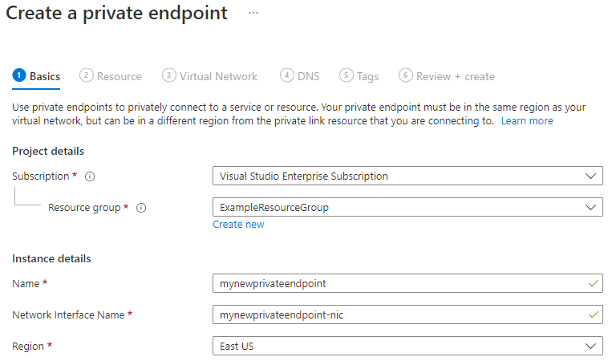
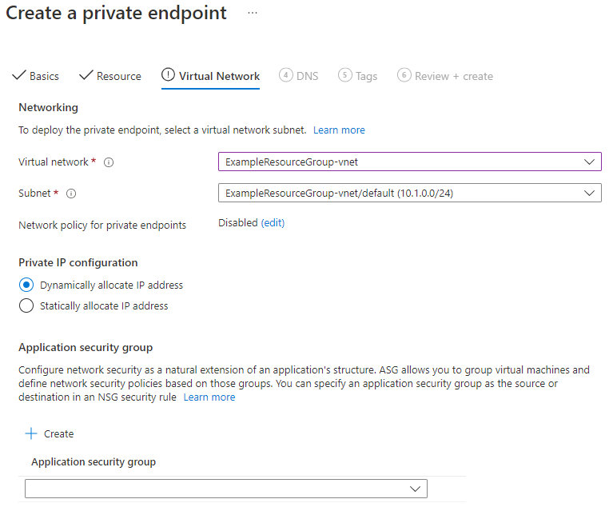
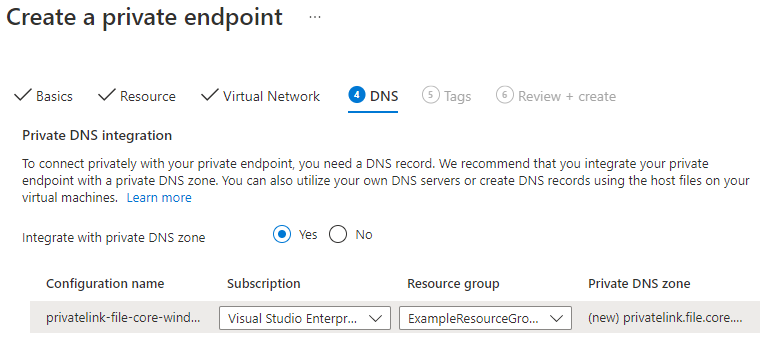
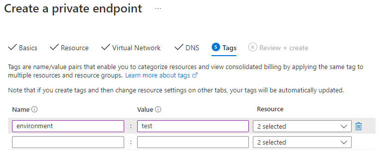

# Configure network endpoints for accessing Azure file shares

:heavy_check_mark: **Applies to:** Classic file shares created with the Microsoft.Storage resource provider

:heavy_check_mark: **Applies to:** File shares created with the Microsoft.FileShares resource provider

Azure Files provides two main types of endpoints for accessing Azure file shares:

- Public endpoints, which have a public IP address and can be accessed from anywhere in the world.
- Private endpoints, which exist within a virtual network and have a private IP address from within the address space of that virtual network.

For classic file shares (created with the `Microsoft.Storage` resource provider), public and private endpoints exist on the Azure storage account. For file shares created with the `Microsoft.FileShares` resource provider, public and private 
endpoints are created at the file share level rather than the storage account level.

This article focuses on how to configure a private endpoint for accessing the Azure file share directly. Much of this article also applies to how Azure File Sync interoperates with public and private endpoints for the storage account. For more information about networking considerations for Azure File Sync, see [configuring Azure File Sync proxy and firewall settings](../file-sync/file-sync-firewall-and-proxy.md).

We recommend reading [Azure Files networking considerations](storage-files-networking-overview.md) before reading this guide.

## Prerequisites

- This article assumes that you already created an Azure subscription. If you don't already have a subscription, then create a [free account](https://azure.microsoft.com/pricing/purchase-options/azure-account?cid=msft_learn) before you begin.
- This article assumes that you already created an Azure file share in a storage account that you want to connect to from on-premises. To learn how to create an Azure file share, see [Create an Azure file share](storage-how-to-create-file-share.md).
- If you intend to use Azure PowerShell, [install the latest version](/powershell/azure/install-azure-powershell).
- If you intend to use the Azure CLI, [install the latest version](/cli/azure/install-azure-cli).

## Endpoint configurations

You can configure your endpoints to restrict network access to your storage account. There are two approaches to restricting access to a storage account to a virtual network:

- [Create one or more private endpoints](#create-a-private-endpoint) and restrict all access to the public endpoint. This ensures that only traffic originating from within the desired virtual networks can access the Azure file shares. See [Private Link cost](https://azure.microsoft.com/pricing/details/private-link/).
- [Restrict the public endpoint to one or more virtual networks](#restrict-public-endpoint-access). This works by using a capability of the virtual network called *service endpoints*. When you restrict the traffic to a storage account via a service endpoint, you're accessing via the public IP address, but access is only possible from the locations you specify in your configuration.

### Create a private endpoint

When you create a private endpoint for your file shares, the following Azure resources are deployed:

- **A private endpoint**: An Azure resource representing the private endpoint. You can think of this as a resource that connects a target resource and a network interface.
- **A network interface (NIC)**: The network interface that maintains a private IP address within the specified virtual network/subnet. This is the exact same resource that gets deployed when you deploy a virtual machine (VM), however instead of being assigned to a VM, it's owned by the private endpoint.
- **A private Domain Name System (DNS) zone**: If you haven't deployed a private endpoint for this virtual network before, a new private DNS zone will be deployed for your virtual network. A DNS record will also be created in this DNS zone. If you've already deployed a private endpoint in this virtual network, a new record will be added to the existing DNS zone. Deploying a DNS zone is optional. However, it's highly recommended, and required if you're mounting your Azure file shares with an AD service principal or using the FileREST API.

> [!NOTE]
> This article uses DNS suffix for the Azure Public regions, `core.windows.net`. This commentary also applies to Azure Sovereign clouds such as the Azure US Government cloud and the Microsoft Azure operated by 21Vianet cloud. Just substitute the appropriate suffixes for your environment.

#### Classic vs. new file share experience
 
 The private endpoint creation process differs slightly depending on whether you're using classic file shares or the new file share:
 
 | | Classic file shares (`Microsoft.Storage`) | New file shares (`Microsoft.FileShares`) |
 |---|---|---|
 | **Private endpoint target** | Storage account | File share |
 | **Resource cmdlet** | `Get-AzStorageAccount` | `Get-AzFileShare` |
 | **Group ID (sub-resource)** | `file` | `FileShare` |
 | **DNS A record name** | Storage account name | Host name prefix (e.g., `fs-xxxxxxxxxxxxxxxxx`) |
 
 The virtual network setup, private endpoint creation, and DNS zone configuration steps are identical for both experiences. Only the resource reference, group ID, and DNS record name differ.

# [Portal](#tab/azure-portal)
Navigate to the resource group in which you would like to create a private endpoint. Click **+ Create** and search for **Private Endpoint**. Select the private endpoint resource, and then select **Create**.

The resulting wizard has multiple pages to complete.

In the **Basics** blade, select the desired subscription, resource group, name, network interface name, and region for your private endpoint. You must create the private endpoint in the same region as the virtual network you wish to create the private endpoint in. Then select **Next: Resource**.

[](../../../includes/media/storage-files-networking-endpoints-private-portal/private-endpoint-basics.png#lightbox)

If you're using classic file shares: 

In the **Resource** blade, choose **Microsoft.Storage/storageAccounts** from the drop-down menu for the resource type. Then select the specific storage account you want to connect to as Resource. The target sub-resource will auto-populate with `file`. Then select **Next: Virtual Network**.

If you're using the new file share: 

In the **Resource** blade, choose **Microsoft.FileShares/fileShares** from the drop-down menu for the resource type. Then select the specific file share you want to connect to as Resource. The target sub-resource will auto-populate with `FileShare`. Then select **Next: Virtual Network**.

The **Virtual Network** blade allows you to select the specific virtual network and subnet you would like to add your private endpoint to. Select dynamic or static IP address allocation for the new private endpoint. If you select static, you'll also need to provide a name and a private IP address. You can also optionally specify an application security group. When you're finished, select **Next: DNS**.

[](../../../includes/media/storage-files-networking-endpoints-private-portal/private-endpoint-virtual-network.png#lightbox)

The **DNS** blade contains the information for integrating your private endpoint with a private DNS zone. Make sure the subscription and resource group are correct, then select **Next: Tags**.

[](../../../includes/media/storage-files-networking-endpoints-private-portal/private-endpoint-dns.png#lightbox)

You can optionally apply tags to categorize your resources, such as applying the name **Environment** and the value **Test** to all testing resources. Enter name/value pairs if desired, and then select **Next: Review + create**.

[](../../../includes/media/storage-files-networking-endpoints-private-portal/private-endpoint-tags.png#lightbox)

Select **Create** to create the private endpoint.

# [PowerShell](#tab/azure-powershell)

To create a private endpoint, you first need to get a reference to your storage account or your file share and the virtual network subnet to which you want to add the private endpoint. Replace the placeholder values below with your own.
 
 **For classic file shares**, get a reference to the storage account:
 
 ```PowerShell
 $storageAccountResourceGroupName = "<storage-account-resource-group-name>"
 $storageAccountName = "<storage-account-name>"
 
 $storageAccount = Get-AzStorageAccount `
         -ResourceGroupName $storageAccountResourceGroupName `
         -Name $storageAccountName `
         -ErrorAction SilentlyContinue
 
 if ($null -eq $storageAccount) {
     $errorMessage = "Storage account $storageAccountName not found "
     $errorMessage += "in resource group $storageAccountResourceGroupName."
     Write-Error -Message $errorMessage -ErrorAction Stop
 }
 
 # Set common variables for private endpoint creation
 $resourceGroupName = $storageAccountResourceGroupName
 $privateLinkResourceId = $storageAccount.Id
 $groupId = "file"
 $dnsRecordName = $storageAccountName
 ```


**For file shares created with the Microsoft.FileShares resource provider**, get a reference to the file share:

```PowerShell
 $fileShareResourceGroupName = "<resource-group-name>"
 $fileShareName = "<file-share-name>"
 
 $fileShare = Get-AzFileShare `
         -ResourceGroupName $fileShareResourceGroupName `
         -ResourceName $fileShareName `
         -ErrorAction SilentlyContinue
 
 if ($null -eq $fileShare) {
     $errorMessage = "File share $fileShareName not found "
     $errorMessage += "in resource group $fileShareResourceGroupName."
     Write-Error -Message $errorMessage -ErrorAction Stop
 }
 
 # Extract hostName and hostNamePrefix for DNS record
 $hostName = $fileShare.HostName
 $hostNamePrefix = $hostName.Split('.')[0]
 
 # Set common variables for private endpoint creation
 $resourceGroupName = $fileShareResourceGroupName
 $privateLinkResourceId = $fileShare.Id
 $groupId = "FileShare"
 $dnsRecordName = $hostNamePrefix
```

After setting the common variables above, the remaining steps are the same for both experiences. Get references to the virtual network and subnet:

```PowerShell
 $virtualNetworkResourceGroupName = "<vnet-resource-group-name>"
 $virtualNetworkName = "<vnet-name>"
 $subnetName = "<vnet-subnet-name>"
 
 # Get virtual network reference, and throw error if it doesn't exist
 $virtualNetwork = Get-AzVirtualNetwork `
         -ResourceGroupName $virtualNetworkResourceGroupName `
         -Name $virtualNetworkName `
         -ErrorAction SilentlyContinue
 
 if ($null -eq $virtualNetwork) {
     $errorMessage = "Virtual network $virtualNetworkName not found "
     $errorMessage += "in resource group $virtualNetworkResourceGroupName."
     Write-Error -Message $errorMessage -ErrorAction Stop
 }
 
 # Get reference to virtual network subnet, and throw error if it doesn't exist
 $subnet = $virtualNetwork | `
     Select-Object -ExpandProperty Subnets | `
     Where-Object { $_.Name -eq $subnetName }
 
 if ($null -eq $subnet) {
     Write-Error `
             -Message "Subnet $subnetName not found in virtual network $virtualNetworkName." `
             -ErrorAction Stop
 }
```

To create a private endpoint, you must create a private link service connection. The private link service connection is an input to the creation of the private endpoint.

```powerShell
 # Disable private endpoint network policies
 $subnet.PrivateEndpointNetworkPolicies = "Disabled"
 $virtualNetwork = $virtualNetwork | `
     Set-AzVirtualNetwork -ErrorAction Stop
 
 # Create a private link service connection.
 $privateEndpointConnection = New-AzPrivateLinkServiceConnection `
         -Name "$dnsRecordName-Connection" `
         -PrivateLinkServiceId $privateLinkResourceId `
         -GroupId $groupId `
         -ErrorAction Stop
 
 # Create a new private endpoint.
 $privateEndpoint = New-AzPrivateEndpoint `
         -ResourceGroupName $resourceGroupName `
         -Name "$dnsRecordName-PrivateEndpoint" `
         -Location $virtualNetwork.Location `
         -Subnet $subnet `
         -PrivateLinkServiceConnection $privateEndpointConnection `
         -ErrorAction Stop
```

Creating an Azure private DNS zone enables the original host name to resolve to the private IP inside of the virtual network. Although optional from the perspective of creating a private endpoint, it is explicitly required for mounting
the Azure file share directly using an AD user principal or accessing via the REST API.

```PowerShell
 # Get the host name suffix (core.windows.net for public cloud).
 # This is done like this so this script will seamlessly work for non-public Azure.
 $hostNameSuffix = Get-AzContext | `
     Select-Object -ExpandProperty Environment | `
     Select-Object -ExpandProperty StorageEndpointSuffix
 
 # For public cloud, this will generate the following DNS suffix:
 # privatelink.file.core.windows.net.
 $dnsZoneName = "privatelink.file.$hostNameSuffix"
 
 # Find a DNS zone matching desired name attached to this virtual network.
 $dnsZone = Get-AzPrivateDnsZone | `
     Where-Object { $_.Name -eq $dnsZoneName } | `
     Where-Object {
         $privateDnsLink = Get-AzPrivateDnsVirtualNetworkLink `
                 -ResourceGroupName $_.ResourceGroupName `
                 -ZoneName $_.Name `
                 -ErrorAction SilentlyContinue
         
         $privateDnsLink.VirtualNetworkId -eq $virtualNetwork.Id
     }
 
 if ($null -eq $dnsZone) {
     # No matching DNS zone attached to virtual network, so create new one.
     $dnsZone = New-AzPrivateDnsZone `
             -ResourceGroupName $virtualNetworkResourceGroupName `
             -Name $dnsZoneName `
             -ErrorAction Stop
 
     $privateDnsLink = New-AzPrivateDnsVirtualNetworkLink `
             -ResourceGroupName $virtualNetworkResourceGroupName `
             -ZoneName $dnsZoneName `
             -Name "$virtualNetworkName-DnsLink" `
             -VirtualNetworkId $virtualNetwork.Id `
             -ErrorAction Stop
 }
 ```

Now that you have a reference to the private DNS zone, you must create a record.

```PowerShell
 $privateEndpointIP = $privateEndpoint | `
     Select-Object -ExpandProperty NetworkInterfaces | `
     Select-Object @{ 
         Name = "NetworkInterfaces"; 
         Expression = { Get-AzNetworkInterface -ResourceId $_.Id } 
     } | `
     Select-Object -ExpandProperty NetworkInterfaces | `
     Select-Object -ExpandProperty IpConfigurations | `
     Select-Object -ExpandProperty PrivateIpAddress
 
 $privateDnsRecordConfig = New-AzPrivateDnsRecordConfig `
         -IPv4Address $privateEndpointIP
 
 New-AzPrivateDnsRecordSet `
         -ResourceGroupName $virtualNetworkResourceGroupName `
         -Name $dnsRecordName `
         -RecordType A `
         -ZoneName $dnsZoneName `
         -Ttl 600 `
         -PrivateDnsRecords $privateDnsRecordConfig `
         -ErrorAction Stop | `
     Out-Null
```

# [Azure CLI](#tab/azure-cli)

To create a private endpoint, you first need to get a reference to your storage account or file share, plus the virtual network subnet to which you want to add the private endpoint. Replace the placeholder values below with your own.

**For classic file shares**, get a reference to the storage account:

```bash
storageAccountResourceGroupName="<storage-account-resource-group-name>"
storageAccountName="<storage-account-name>"

# Get storage account ID
privateLinkResourceId=$(az storage account show \
        --resource-group $storageAccountResourceGroupName \
        --name $storageAccountName \
        --query "id" --output tsv)

# Set common variables for private endpoint creation
resourceGroupName=$storageAccountResourceGroupName
groupId="file"
dnsRecordName=$storageAccountName
```

**For file shares created with the Microsoft.FileShares resource provider**, get a reference to the file share:

```bash
# Install the fileshares extension
az extension add --name fileshares

fileShareResourceGroupName="<resource-group-name>"
fileShareName="<file-share-name>"

# Get the file share resource ID and host name
privateLinkResourceId=$(az fileshare show \
        --resource-group $fileShareResourceGroupName \
        --name $fileShareName \
        --query "id" --output tsv)

hostName=$(az fileshare show \
        --resource-group $fileShareResourceGroupName \
        --name $fileShareName \
        --query "properties.hostName" --output tsv)

hostNamePrefix=$(echo $hostName | cut -d'.' -f1)

# Set common variables for private endpoint creation
resourceGroupName=$fileShareResourceGroupName
groupId="FileShare"
dnsRecordName=$hostNamePrefix
```

After setting the common variables above, the remaining steps are the same for both experiences. Get references to the virtual network and subnet:

```bash
virtualNetworkResourceGroupName="<vnet-resource-group-name>"
virtualNetworkName="<vnet-name>"
subnetName="<vnet-subnet-name>"

virtualNetwork=$(az network vnet show \
        --resource-group $virtualNetworkResourceGroupName \
        --name $virtualNetworkName \
        --query "id" --output tsv)

subnet=$(az network vnet subnet show \
        --resource-group $virtualNetworkResourceGroupName \
        --vnet-name $virtualNetworkName \
        --name $subnetName \
        --query "id" --output tsv)
```

To create a private endpoint, ensure the subnet's private endpoint network policy is disabled, then create the private endpoint with `az network private-endpoint create`.

```bash
# Disable private endpoint network policies
az network vnet subnet update \
        --ids $subnet \
        --disable-private-endpoint-network-policies \
        --output none

# Get virtual network location
region=$(az network vnet show \
        --ids $virtualNetwork \
        --query "location" --output tsv)

# Create a private endpoint
privateEndpoint=$(az network private-endpoint create \
        --resource-group $resourceGroupName \
        --name "$dnsRecordName-PrivateEndpoint" \
        --location $region \
        --subnet $subnet \
        --private-connection-resource-id $privateLinkResourceId \
        --group-id $groupId \
        --connection-name "$dnsRecordName-Connection" \
        --query "id" --output tsv)
```

Creating an Azure private DNS zone enables the original host name to resolve to the private IP inside the virtual network. Although optional from the perspective of creating a private endpoint, it's required for mounting the Azure file share using an AD user principal or accessing via the FileREST API.

```bash
# Get the desired storage account suffix (core.windows.net for public cloud).
# This is done so the script will work for non-public Azure clouds.
storageAccountSuffix=$(az cloud show \
        --query "suffixes.storageEndpoint" --output tsv)

# For public cloud, this generates the DNS suffix:
# privatelink.file.core.windows.net.
dnsZoneName="privatelink.file.$storageAccountSuffix"

# Find a DNS zone matching the desired name attached to this virtual network.
possibleDnsZones=$(az network private-dns zone list \
        --query "[?name == '$dnsZoneName'].id" \
        --output tsv)

dnsZone=""
for possibleDnsZone in $possibleDnsZones
do
    possibleResourceGroupName=$(az resource show \
            --ids $possibleDnsZone \
            --query "resourceGroup" --output tsv)

    link=$(az network private-dns link vnet list \
            --resource-group $possibleResourceGroupName \
            --zone-name $dnsZoneName \
            --query "[?virtualNetwork.id == '$virtualNetwork'].id" \
            --output tsv)

    if [ -n "$link" ]
    then
        dnsZoneResourceGroup=$possibleResourceGroupName
        dnsZone=$possibleDnsZone
        break
    fi
done

if [ -z "$dnsZone" ]
then
    # No matching DNS zone attached to the virtual network, so create a new one.
    dnsZone=$(az network private-dns zone create \
            --resource-group $virtualNetworkResourceGroupName \
            --name $dnsZoneName \
            --query "id" --output tsv)

    az network private-dns link vnet create \
            --resource-group $virtualNetworkResourceGroupName \
            --zone-name $dnsZoneName \
            --name "$virtualNetworkName-DnsLink" \
            --virtual-network $virtualNetwork \
            --registration-enabled false \
            --output none

    dnsZoneResourceGroup=$virtualNetworkResourceGroupName
fi
```

Now that you have a reference to the private DNS zone, create an A record.

```bash
privateEndpointNIC=$(az network private-endpoint show \
        --ids $privateEndpoint \
        --query "networkInterfaces[0].id" --output tsv)

privateEndpointIP=$(az network nic show \
        --ids $privateEndpointNIC \
        --query "ipConfigurations[0].privateIPAddress" --output tsv)

az network private-dns record-set a create \
        --resource-group $dnsZoneResourceGroup \
        --zone-name $dnsZoneName \
        --name $dnsRecordName \
        --output none

az network private-dns record-set a add-record \
        --resource-group $dnsZoneResourceGroup \
        --zone-name $dnsZoneName \
        --record-set-name $dnsRecordName \
        --ipv4-address $privateEndpointIP \
        --output none
```

---

## Verify connectivity

# [Portal](#tab/azure-portal)

If you have a VM inside of your virtual network, or you've configured DNS forwarding as described in [Configuring DNS forwarding for Azure Files](storage-files-networking-dns.md), you can test that your private endpoint is set up correctly. Run the following commands from PowerShell, the command line, or the terminal (works for Windows, Linux, or macOS).

**For classic file shares**, replace `<storage-account-name>` with the appropriate storage account name:

```
nslookup <storage-account-name>.file.core.windows.net
```

**For file shares created with the Microsoft.FileShares resource provider**, use the file share's host name. In the overview tab of the file share, Select **JSON view** from the upper right. In the JSON view, under properties, copy the value for **hostName**. The format looks like `fs-xxxxxxxxxxxxxxxxx.xx.file.storage.azure.net`.

```
nslookup <file-share-host-name>
```

If successful, you should see output similar to the following, where `192.168.0.5` is the private IP address of the private endpoint in your virtual network (output shown for Windows).

For classic file shares:

```Output
Server:  UnKnown
Address:  10.2.4.4

Non-authoritative answer:
Name:    storageaccount.privatelink.file.core.windows.net
Address:  192.168.0.5
Aliases:  storageaccount.file.core.windows.net
```

For file shares created with the Microsoft.FileShares resource provider:

```Output
Server:  UnKnown
Address:  10.2.4.4

Non-authoritative answer:
Name:    <hostNamePrefix>.privatelink.file.core.windows.net
Address:  192.168.0.5
Aliases:  <hostNamePrefix>.<zone>.file.storage.azure.net
```

# [PowerShell](#tab/azure-powershell)

If you have a VM inside of your virtual network, or you've configured DNS forwarding as described in [Configuring DNS forwarding for Azure Files](storage-files-networking-dns.md), you can test that your private endpoint is set up correctly by running the following commands:

For classic file shares:


```PowerShell
 $storageAccountHostName = [System.Uri]::new($storageAccount.PrimaryEndpoints.file) | `
     Select-Object -ExpandProperty Host
 
 Resolve-DnsName -Name $storageAccountHostName
 ```

For file shares created with the Microsoft.FileShares resource provider:

```PowerShell
 Resolve-DnsName -Name $fileShare.HostName
```

If successful, you should see output similar to the following, where `192.168.0.5` is the private IP address of the private endpoint in your virtual network.

For classic file shares:

```Output
Name                             Type   TTL   Section    NameHost
----                             ----   ---   -------    --------
storageaccount.file.core.windows CNAME  60    Answer     storageaccount.privatelink.file.core.windows.net
.net

Name       : storageaccount.privatelink.file.core.windows.net
QueryType  : A
TTL        : 600
Section    : Answer
IP4Address : 192.168.0.5
```

For file shares created with the Microsoft.FileShares resource provider:

```Output
Name                                       Type   TTL   Section    NameHost
----                                       ----   ---   -------    --------
<hostNamePrefix>.<zone>.file.storage.azur  CNAME  60    Answer     <hostNamePrefix>.privatelink.file.core.windows.net
e.net

Name       : <hostNamePrefix>.privatelink.file.core.windows.net
QueryType  : A
TTL        : 600
Section    : Answer
IP4Address : 192.168.0.5
```

# [Azure CLI](#tab/azure-cli)

If you have a VM inside of your virtual network, or you've configured DNS forwarding as described in [Configuring DNS forwarding for Azure Files](storage-files-networking-dns.md), you can test that your private endpoint is set up correctly by running the following commands:

**For classic file shares:**

```bash
httpEndpoint=$(az storage account show \
        --resource-group $storageAccountResourceGroupName \
        --name $storageAccountName \
        --query "primaryEndpoints.file" --output tsv)

hostName=$(echo $httpEndpoint | cut -c7-$(expr length $httpEndpoint) | tr -d "/")
nslookup $hostName
```

**For file shares created with the Microsoft.FileShares resource provider:**

```bash
hostName=$(az fileshare show \
        --resource-group $fileShareResourceGroupName \
        --name $fileShareName \
        --query "properties.hostName" --output tsv)

nslookup $hostName
```

If successful, you should see output similar to the following, where `192.168.0.5` is the private IP address of the private endpoint in your virtual network. You should still use the original host name (`storageaccount.file.core.windows.net` for classic, or the file share's `hostName` for the new experience) to mount your file share instead of the `privatelink` path.

For classic file shares:

```Output
Server:         127.0.0.53
Address:        127.0.0.53#53

Non-authoritative answer:
storageaccount.file.core.windows.net      canonical name = storageaccount.privatelink.file.core.windows.net.
Name:   storageaccount.privatelink.file.core.windows.net
Address: 192.168.0.5
```

For file shares created with the Microsoft.FileShares resource provider:

```Output
Server:         127.0.0.53
Address:        127.0.0.53#53

Non-authoritative answer:
<hostNamePrefix>.<zone>.file.storage.azure.net      canonical name = <hostNamePrefix>.privatelink.file.core.windows.net.
Name:   <hostNamePrefix>.privatelink.file.core.windows.net
Address: 192.168.0.5
```
---

## Restrict public endpoint access

Limiting public endpoint access first requires you to disable general access to the public endpoint. Disabling access to the public endpoint does not impact private endpoints. After the public endpoint is disabled, you can select specific networks or IP addresses that may continue to access it. In general, most firewall policies for a storage account restrict networking access to one or more virtual networks.

#### Disable access to the public endpoint

When access to the public endpoint is disabled, the storage account can still be accessed through its private endpoints. Otherwise valid requests to the storage account's public endpoint will be rejected, unless they are from [a specifically allowed source](#restrict-access-to-the-public-endpoint-to-specific-virtual-networks).

# [Portal](#tab/azure-portal)

**For classic file shares:**

Navigate to the storage account for which you would like to restrict all access to the public endpoint. In the table of contents for the storage account, select **Networking**.

At the top of the page, select the **Enabled from selected virtual networks and IP addresses** radio button. This will un-hide a number of settings for controlling the restriction of the public endpoint. Select **Allow Azure services on the trusted services list to access this storage account** to allow trusted first party Microsoft services such as Azure File Sync to access the storage account.

:::image type="content" source="../../../includes/media/storage-files-networking-endpoints-public-disable-portal/disable-public-endpoint.png" alt-text="Screenshot of the Networking blade with the required settings to disable access to the storage account public endpoint." lightbox="../../../includes/media/storage-files-networking-endpoints-public-disable-portal/disable-public-endpoint.png":::

**For file shares created with the Microsoft.FileShares resource provider:**

Navigate to the file share for which you would like to disable public access. In the service menu, under **Settings**, select **Configuration**. Set **Public network access** to **Disabled**, and then select **Save**.

# [PowerShell](#tab/azure-powershell)

**For classic file shares**, the following PowerShell command denies all traffic to the storage account's public endpoint. The `-Bypass` parameter is set to `AzureServices` to allow trusted first party services such as Azure File Sync to access the storage account via the public endpoint.

```PowerShell
# This assumes $storageAccount is still defined from the beginning of this guide.
$storageAccount | Update-AzStorageAccountNetworkRuleSet `
        -DefaultAction Deny `
        -Bypass AzureServices `
        -WarningAction SilentlyContinue `
        -ErrorAction Stop | `
    Out-Null
```

**For file shares created with the Microsoft.FileShares resource provider**, set `-PublicNetworkAccess` to `Disabled` on the file share.

```PowerShell
# To learn more about the Az.FileShare module, see https://www.powershellgallery.com/packages/Az.FileShare/0.1.0
Install-Module -Name Az.FileShare -Repository psgallery -RequiredVersion 0.1.0

$fileShareResourceGroupName = "<resource-group-name>"
$fileShareName = "<file-share-name>"

Update-AzFileShare `
        -ResourceGroupName $fileShareResourceGroupName `
        -ResourceName $fileShareName `
        -PublicNetworkAccess Disabled
```

# [Azure CLI](#tab/azure-cli)

**For classic file shares**, the following CLI command denies all traffic to the storage account's public endpoint. The `--bypass` parameter is set to `AzureServices` to allow trusted first party services such as Azure File Sync to access the storage account via the public endpoint.

```bash
# This assumes $storageAccountResourceGroupName and $storageAccountName
# are still defined from the beginning of this guide.
az storage account update \
    --resource-group $storageAccountResourceGroupName \
    --name $storageAccountName \
    --bypass "AzureServices" \
    --default-action "Deny" \
    --output none
```

**For file shares created with the Microsoft.FileShares resource provider**, set `--public-network-access` to `Disabled` on the file share.

```bash
# Install the fileshares extension
az extension add --name fileshares

fileShareResourceGroupName="<resource-group-name>"
fileShareName="<file-share-name>"

az fileshare update \
    --name $fileShareName \
    --resource-group $fileShareResourceGroupName \
    --public-network-access Disabled
```

---

#### Restrict access to the public endpoint to specific virtual networks

When you restrict the storage account to specific virtual networks, you're allowing requests to the public endpoint from within the specified virtual networks. This works by using a capability of the virtual network called *service endpoints*. This can be used with or without private endpoints.

# [Portal](#tab/azure-portal)

**For classic file shares:**

Navigate to the storage account for which you would like to restrict the public endpoint to specific virtual networks. In the table of contents for the storage account, select **Networking**.

At the top of the page, select the **Enabled from selected virtual networks and IP addresses** radio button. This will un-hide a number of settings for controlling the restriction of the public endpoint. Select **+Add existing virtual network** to select the specific virtual network that should be allowed to access the storage account via the public endpoint. Select a virtual network and a subnet for that virtual network, and then select **Enable**.

Select **Allow Azure services on the trusted services list to access this storage account** to allow trusted first party Microsoft services such as Azure File Sync to access the storage account.

:::image type="content" source="../../../includes/media/storage-files-networking-endpoints-public-restrict-portal/restrict-public-endpoint.png" alt-text="Screenshot of the Networking blade with a specific virtual network allowed to access the storage account via the public endpoint." lightbox="../../../includes/media/storage-files-networking-endpoints-public-restrict-portal/restrict-public-endpoint.png":::

**For file shares created with the Microsoft.FileShares resource provider:**

Navigate to the file share for which you would like to restrict public access. In the service menu, under **Settings**, select **Configuration**. Under **Public network access**, select **Enabled from selected virtual networks**, then add the virtual networks and subnets allowed to access the share, and select **Save**.

# [PowerShell](#tab/azure-powershell)

**For classic file shares**, restricting access to the storage account's public endpoint to specific virtual networks uses service endpoints. First, collect information about the storage account and virtual network. Replace the placeholder values below with your own.

```PowerShell
$storageAccountResourceGroupName = "<storage-account-resource-group>"
$storageAccountName = "<storage-account-name>"
$restrictToVirtualNetworkResourceGroupName = "<vnet-resource-group-name>"
$restrictToVirtualNetworkName = "<vnet-name>"
$subnetName = "<subnet-name>"

$storageAccount = Get-AzStorageAccount `
        -ResourceGroupName $storageAccountResourceGroupName `
        -Name $storageAccountName `
        -ErrorAction Stop

$virtualNetwork = Get-AzVirtualNetwork `
        -ResourceGroupName $restrictToVirtualNetworkResourceGroupName `
        -Name $restrictToVirtualNetworkName `
        -ErrorAction Stop

$subnet = $virtualNetwork | `
    Select-Object -ExpandProperty Subnets | `
    Where-Object { $_.Name -eq $subnetName }

if ($null -eq $subnet) {
    Write-Error `
            -Message "Subnet $subnetName not found in virtual network $restrictToVirtualNetworkName." `
            -ErrorAction Stop
}
```

In order for traffic from the virtual network to be allowed by the Azure network fabric to get to the storage account public endpoint, the virtual network's subnet must have the `Microsoft.Storage` service endpoint exposed. The following PowerShell commands add the `Microsoft.Storage` service endpoint to the subnet if it's not already there.

```PowerShell
$serviceEndpoints = $subnet | `
    Select-Object -ExpandProperty ServiceEndpoints | `
    Select-Object -ExpandProperty Service

if ($serviceEndpoints -notcontains "Microsoft.Storage") {
    if ($null -eq $serviceEndpoints) {
        $serviceEndpoints = @("Microsoft.Storage")
    } elseif ($serviceEndpoints -is [string]) {
        $serviceEndpoints = @($serviceEndpoints, "Microsoft.Storage")
    } else {
        $serviceEndpoints += "Microsoft.Storage"
    }

    $virtualNetwork = $virtualNetwork | Set-AzVirtualNetworkSubnetConfig `
            -Name $subnetName `
            -AddressPrefix $subnet.AddressPrefix `
            -ServiceEndpoint $serviceEndpoints `
            -WarningAction SilentlyContinue `
            -ErrorAction Stop | `
        Set-AzVirtualNetwork `
            -ErrorAction Stop
}
```

The final step in restricting traffic to the storage account is to create a networking rule and add it to the storage account's network rule set.

```PowerShell
$networkRule = $storageAccount | Add-AzStorageAccountNetworkRule `
    -VirtualNetworkResourceId $subnet.Id `
    -ErrorAction Stop

$storageAccount | Update-AzStorageAccountNetworkRuleSet `
        -DefaultAction Deny `
        -Bypass AzureServices `
        -VirtualNetworkRule $networkRule `
        -WarningAction SilentlyContinue `
        -ErrorAction Stop | `
    Out-Null
```

**For file shares created with the Microsoft.FileShares resource provider**, you can pass the allowed subnet resource IDs directly to `Update-AzFileShare` using `-PublicAccessPropertyAllowedSubnet`. There's no separate service endpoint or network rule configuration required on the storage account.

```PowerShell
# To learn more about the Az.FileShare module, see https://www.powershellgallery.com/packages/Az.FileShare/0.1.0
Install-Module -Name Az.FileShare -Repository psgallery -RequiredVersion 0.1.0

$fileShareResourceGroupName = "<resource-group-name>"
$fileShareName = "<file-share-name>"
$virtualNetworkResourceGroupName = "<vnet-resource-group-name>"
$virtualNetworkName = "<vnet-name>"
$subnetName = "<subnet-name>"

$subnet = Get-AzVirtualNetwork `
        -ResourceGroupName $virtualNetworkResourceGroupName `
        -Name $virtualNetworkName | `
    Select-Object -ExpandProperty Subnets | `
    Where-Object { $_.Name -eq $subnetName }

Update-AzFileShare `
        -ResourceGroupName $fileShareResourceGroupName `
        -ResourceName $fileShareName `
        -PublicAccessPropertyAllowedSubnet @($subnet.Id)
```

# [Azure CLI](#tab/azure-cli)

**For classic file shares**, restricting access to the storage account's public endpoint to specific virtual networks uses service endpoints. First, collect information about the storage account and virtual network. Replace the placeholder values below with your own.

```bash
storageAccountResourceGroupName="<storage-account-resource-group>"
storageAccountName="<storage-account-name>"
restrictToVirtualNetworkResourceGroupName="<vnet-resource-group-name>"
restrictToVirtualNetworkName="<vnet-name>"
subnetName="<subnet-name>"

storageAccount=$(az storage account show \
        --resource-group $storageAccountResourceGroupName \
        --name $storageAccountName \
        --query "id" --output tsv)

virtualNetwork=$(az network vnet show \
        --resource-group $restrictToVirtualNetworkResourceGroupName \
        --name $restrictToVirtualNetworkName \
        --query "id" --output tsv)

subnet=$(az network vnet subnet show \
        --resource-group $restrictToVirtualNetworkResourceGroupName \
        --vnet-name $restrictToVirtualNetworkName \
        --name $subnetName \
        --query "id" --output tsv)
```

In order for traffic from the virtual network to be allowed by the Azure network fabric to get to the storage account public endpoint, the virtual network's subnet must have the `Microsoft.Storage` service endpoint exposed. The following CLI commands add the `Microsoft.Storage` service endpoint to the subnet if it's not already there.

```bash
serviceEndpoints=$(az network vnet subnet show \
        --resource-group $restrictToVirtualNetworkResourceGroupName \
        --vnet-name $restrictToVirtualNetworkName \
        --name $subnetName \
        --query "serviceEndpoints[].service" \
        --output tsv)

foundStorageServiceEndpoint=false
for serviceEndpoint in $serviceEndpoints
do
    if [ $serviceEndpoint = "Microsoft.Storage" ]
    then
        foundStorageServiceEndpoint=true
    fi
done

if [ $foundStorageServiceEndpoint = false ]
then
    serviceEndpointList=""

    for serviceEndpoint in $serviceEndpoints
    do
        serviceEndpointList+=$serviceEndpoint
        serviceEndpointList+=" "
    done

    serviceEndpointList+="Microsoft.Storage"

    az network vnet subnet update \
            --ids $subnet \
            --service-endpoints $serviceEndpointList \
            --output none
fi
```

The final step in restricting traffic to the storage account is to create a networking rule and add it to the storage account's network rule set.

```bash
az storage account network-rule add \
        --resource-group $storageAccountResourceGroupName \
        --account-name $storageAccountName \
        --subnet $subnet \
        --output none

az storage account update \
        --resource-group $storageAccountResourceGroupName \
        --name $storageAccountName \
        --bypass "AzureServices" \
        --default-action "Deny" \
        --output none
```

**For file shares created with the Microsoft.FileShares resource provider**, pass the allowed subnet resource IDs directly to `az fileshare update` using `--allowed-subnets`. No separate service endpoint or network rule configuration is required on the storage account.

```bash
# Install the fileshares extension
az extension add --name fileshares

fileShareResourceGroupName="<resource-group-name>"
fileShareName="<file-share-name>"
virtualNetworkResourceGroupName="<vnet-resource-group-name>"
virtualNetworkName="<vnet-name>"
subnetName="<subnet-name>"

subnetId=$(az network vnet subnet show \
        --resource-group $virtualNetworkResourceGroupName \
        --vnet-name $virtualNetworkName \
        --name $subnetName \
        --query "id" --output tsv)

az fileshare update \
        --name $fileShareName \
        --resource-group $fileShareResourceGroupName \
        --allowed-subnets $subnetId
```

---

## See also

- [Azure Files networking considerations](storage-files-networking-overview.md)
- [Configuring DNS forwarding for Azure Files](storage-files-networking-dns.md)
- [Configuring S2S VPN for Azure Files](storage-files-configure-s2s-vpn.md)
