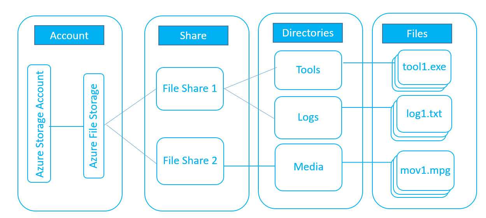

# Planning for an Azure Files deployment
[Azure Files](storage-files-introduction.md) offers fully managed file shares in the cloud that are accessible via the industry standard SMB protocol. Because Azure Files is fully managed, deploying it in production scenarios is much easier than deploying and managing a file server or NAS device. This article addresses the topics to consider when deploying an Azure file share for production use within your organization.

## Management concepts
 The following diagram illustrates the Azure Files management constructs:



* **Storage Account**: All access to Azure Storage is done through a storage account. See [Scalability and Performance Targets](../common/storage-scalability-targets.md?toc=%2fazure%2fstorage%2ffiles%2ftoc.json) for details about storage account capacity.

* **Share**: A File Storage share is an SMB file share in Azure. All directories and files must be created in a parent share. An account can contain an unlimited number of shares, and a share can store an unlimited number of files, up to the 5 TiB total capacity of the file share.

* **Directory**: An optional hierarchy of directories.

* **File**: A file in the share. A file may be up to 1 TiB in size.

* **URL format**: For requests to an Azure file share made with the File REST protocol, files are addressable using the following URL format:

    ```
    https://<storage account>.file.core.windows.net/<share>/<directory>/directories>/<file>
    ```

## Data access method
Azure Files offers two, built-in, convenient data access methods that you can use separately, or in combination with each other, to access your data:

1. **Direct cloud access**: Any Azure file share can be mounted by [Windows](storage-how-to-use-files-windows.md), [macOS](storage-how-to-use-files-mac.md), and/or [Linux](storage-how-to-use-files-linux.md) with the industry standard Server Message Block (SMB) protocol or via the File REST API. With SMB, reads and writes to files on the share are made directly on the file share in Azure. To mount by a VM in Azure, the SMB client in the OS must support at least SMB 2.1. To mount on-premises, such as on a user's workstation, the SMB client supported by the workstation must support at least SMB 3.0 (with encryption). In addition to SMB, new applications or services may directly access the file share via File REST, which provides an easy and scalable application programming interface for software development.
2. **Azure File Sync**: With Azure File Sync, shares can be replicated to Windows Servers on-premises or in Azure. Your users would access the file share through the Windows Server, such as through an SMB or NFS share. This is useful for scenarios in which data will be accessed and modified far away from an Azure datacenter, such as in a branch office scenario. Data may be replicated between multiple Windows Server endpoints, such as between multiple branch offices. Finally, data may be tiered to Azure Files, such that all data is still accessible via the Server, but the Server does not have a full copy of the data. Rather, data is seamlessly recalled when opened by your user.

The following table illustrates how your users and applications can access your Azure file share:

| | Direct cloud access | Azure File Sync |
|------------------------|------------|-----------------|
| What protocols do you need to use? | Azure Files supports SMB 2.1, SMB 3.0, and File REST API. | Access your Azure file share via any supported protocol on Windows Server (SMB, NFS, FTPS, etc.) |  
| Where are you running your workload? | **In Azure**: Azure Files offers direct access to your data. | **On-premises with slow network**: Windows, Linux, and macOS clients can mount a local on-premises Windows File share as a fast cache of your Azure file share. |
| What level of ACLs do you need? | Share and file level. | Share, file, and user level. |

## Data security
Azure Files has several built-in options for ensuring data security:

* Support for encryption in both over-the-wire protocols: SMB 3.0 encryption and File REST over HTTPS. By default: 
    * Clients which support SMB 3.0 encryption send and receive data over an encrypted channel.
    * Clients which do not support SMB 3.0 with encryption can communicate intra-datacenter over SMB 2.1 or SMB 3.0 without encryption. SMB clients are not allowed to communicate inter-datacenter over SMB 2.1 or SMB 3.0 without encryption.
    * Clients can communicate over File REST with either HTTP or HTTPS.
* Encryption at-rest ([Azure Storage Service Encryption](../common/storage-service-encryption.md?toc=%2fazure%2fstorage%2ffiles%2ftoc.json)): Storage Service Encryption (SSE) is enabled for all storage accounts. Data at-rest is encrypted with fully-managed keys. Encryption at-rest does not increase storage costs or reduce performance. 
* Optional requirement of encrypted data in-transit: when selected, Azure Files rejects access the data over unencrypted channels. Specifically, only HTTPS and SMB 3.0 with encryption connections are allowed. 

    > [!Important]  
    > Requiring secure transfer of data will cause older SMB clients not capable of communicating with SMB 3.0 with encryption to fail. For more information, see [Mount on Windows](storage-how-to-use-files-windows.md), [Mount on Linux](storage-how-to-use-files-linux.md), and [Mount on macOS](storage-how-to-use-files-mac.md).

For maximum security, we strongly recommend always enabling both encryption at-rest and enabling encryption of data in-transit whenever you are using modern clients to access your data. For example, if you need to mount a share on a Windows Server 2008 R2 VM, which only supports SMB 2.1, you need to allow unencrypted traffic to your storage account since SMB 2.1 does not support encryption.

If you are using Azure File Sync to access your Azure file share, we will always use HTTPS and SMB 3.0 with encryption to sync your data to your Windows Servers, regardless of whether you require encryption of data at-rest.

## File share performance tiers
Azure Files supports two performance tiers: standard and premium.

* **Standard file shares** are backed by rotational hard disk drives (HDDs) that provide reliable performance for IO workloads that are less sensitive to performance variability such as general-purpose file shares and dev/test environments. Standard file shares are only available in a pay-as-you-go billing model.
* **Premium file shares (preview)** are backed by solid-state disks (SSDs) that provide consistent high performance and low latency, within single-digit milliseconds for most IO operations, for the most IO-intensive workloads. This makes them suitable for a wide variety of workloads like databases, web site hosting, development environments, etc. Premium file shares are only available in a provisioned billing model.

### Provisioned shares
Premium file shares are provisioned based on a fixed GiB/IOPS/throughput ratio. For each GiB provisioned, the share will be issued one IOPS and 0.1 MiB/s throughput up to the max limits per share. The minimum allowed provisioning is 100 GiB with min IOPS/throughput. Share size can be increased at any time and decreased any time but can be decreased once every 24 hours since the last increase.

On a best effort basis, all shares can burst up to three IOPS per GiB of provisioned storage for 60 minutes or longer depending on the size of the share. New shares start with the full burst credit based on the provisioned capacity.

| Provisioned capacity | 100 GiB | 500 GiB | 1 TiB | 5 TiB | 
|----------------------|---------|---------|-------|-------|
| Baseline IOPS | 100 | 500 | 1,024 | 5,120 | 
| Burst limit | 300 | 1,500 | 3,072 | 15,360 | 
| Throughput | 110 MiB/sec | 150 MiB/sec | 202 MiB/sec | 612 MiB/sec |

## File share redundancy
Azure Files supports three data redundancy options: locally redundant storage (LRS), zone redundant storage (ZRS), and geo-redundant storage (GRS). The following sections describe the differences between the different redundancy options:

### Locally redundant storage
[!INCLUDE [storage-common-redundancy-LRS](../../../includes/storage-common-redundancy-LRS.md)]

### Zone redundant storage
[!INCLUDE [storage-common-redundancy-ZRS](../../../includes/storage-common-redundancy-ZRS.md)]

### Geo-redundant storage
[!INCLUDE [storage-common-redundancy-GRS](../../../includes/storage-common-redundancy-GRS.md)]

## Data growth pattern
Today, the maximum size for an Azure file share is 5 TiB. Because of this current limitation, you must consider the expected data growth when deploying an Azure file share. 

It is possible to sync multiple Azure file shares to a single Windows File Server with Azure File Sync. This allows you to ensure that older, large file shares that you may have on-premises can be brought into Azure File Sync. For more information, see [Planning for an Azure File Sync Deployment](storage-files-planning.md).

## Data transfer method
There are many easy options to bulk transfer data from an existing file share, such as an on-premises file share, into Azure Files. A few popular ones include (non-exhaustive list):

* **Azure File Sync**: As part of a first sync between an Azure file share (a "Cloud Endpoint") and a Windows directory namespace (a "Server Endpoint"), Azure File Sync will replicate all data from the existing file share to Azure Files.
* **[Azure Import/Export](../common/storage-import-export-service.md?toc=%2fazure%2fstorage%2ffiles%2ftoc.json)**: The Azure Import/Export service allows you to securely transfer large amounts of data into an Azure file share by shipping hard disk drives to an Azure datacenter. 
* **[Robocopy](https://technet.microsoft.com/library/cc733145.aspx)**: Robocopy is a well known copy tool that ships with Windows and Windows Server. Robocopy may be used to transfer data into Azure Files by mounting the file share locally, and then using the mounted location as the destination in the Robocopy command.
* **[AzCopy](../common/storage-use-azcopy.md?toc=%2fazure%2fstorage%2ffiles%2ftoc.json#upload-files-to-an-azure-file-share)**: AzCopy is a command-line utility designed for copying data to and from Azure Files, as well as Azure Blob storage, using simple commands with optimal performance. AzCopy is available for Windows and Linux.

## Next steps
* [Planning for an Azure File Sync Deployment](storage-sync-files-planning.md)
* [Deploying Azure Files](storage-files-deployment-guide.md)
* [Deploying Azure File Sync](storage-sync-files-deployment-guide.md)
