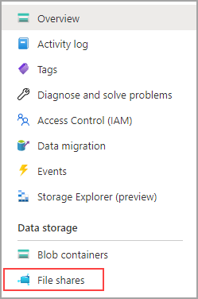
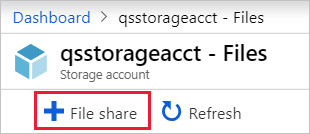
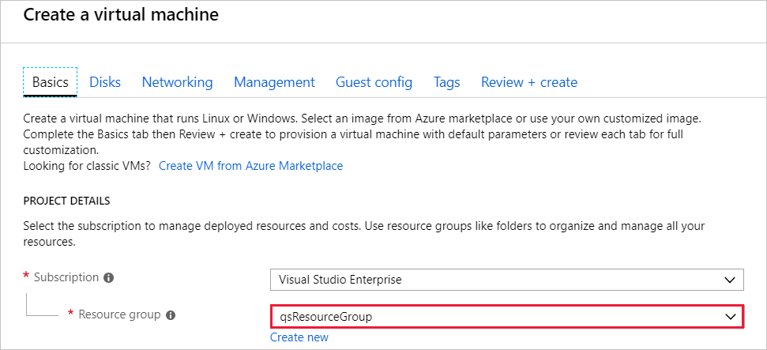
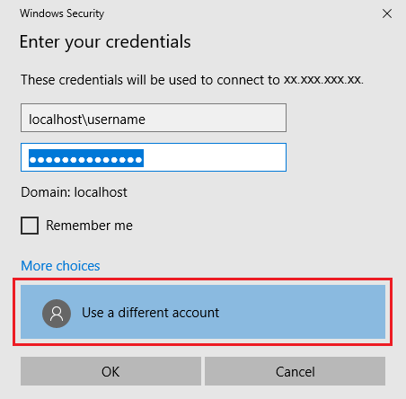
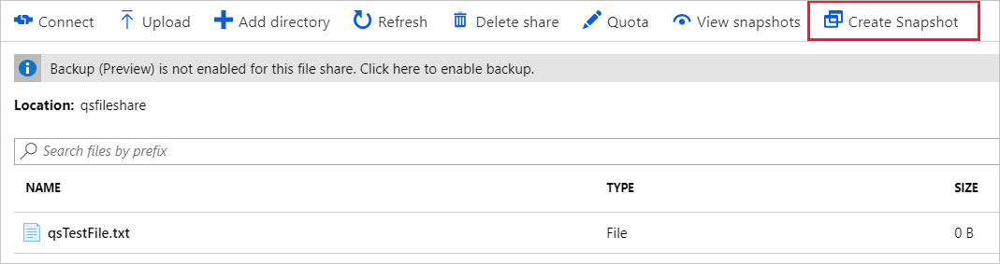
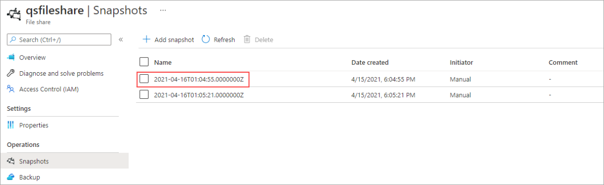
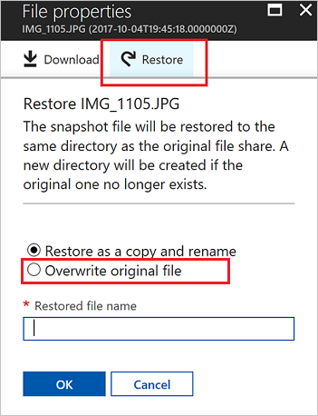
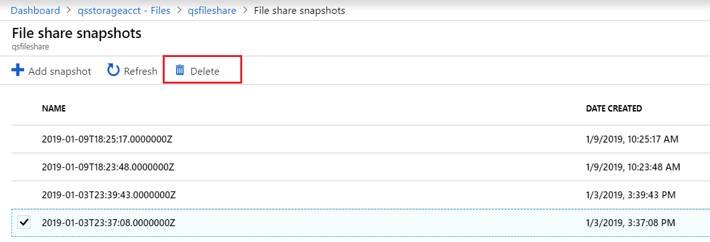
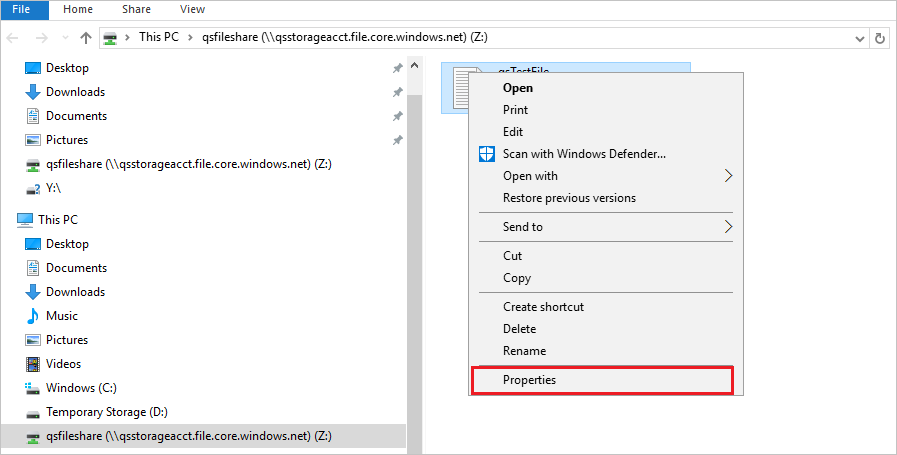
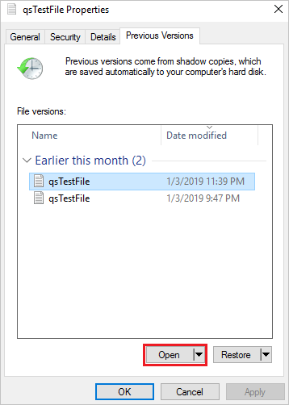

# Quickstart: Create and manage Azure Files share with Windows virtual machines

The article demonstrates the basic steps for creating and using an Azure Files share. In this quickstart, the emphasis is on quickly setting up an Azure Files share so you can experience how the service works. If you need more detailed instructions for creating and using Azure file shares in your own environment, see [Use an Azure file share with Windows](storage-how-to-use-files-windows.md).

If you don't have an Azure subscription, create a [free account](https://azure.microsoft.com/free/?WT.mc_id=A261C142F) before you begin.

## Sign in to Azure

Sign in to the [Azure portal](https://portal.azure.com).

## Prepare your environment

In this quickstart, you set up the following items:

- An Azure storage account and an Azure file share
- A Windows Server 2016 Datacenter VM

### Create a storage account

Before you can work with an Azure file share, you have to create an Azure storage account. A general-purpose v2 storage account provides access to all of the Azure Storage services: blobs, files, queues, and tables. The quickstart creates a general-purpose v2 storage account but, the steps to create any type of storage account are similar. A storage account can contain an unlimited number of shares. A share can store an unlimited number of files, up to the capacity limits of the storage account.

[!INCLUDE [storage-create-account-portal-include](../../../includes/storage-create-account-portal-include.md)]

### Create an Azure file share

Next, you create a file share.

1. When the Azure storage account deployment is complete, select **Go to resource**.
1. Select **File shares** from the storage account pane.

    

1. Select **+ File Share**.

    

1. Name the new file share *qsfileshare*, enter "1" for the **Quota**, leave **Transaction optimized** selected, and select **Create**. The quota can be a maximum of 5 TiB (100 TiB, with large file shares enabled), but you only need 1 GiB for this quickstart.
1. Create a new txt file called *qsTestFile* on your local machine.
1. Select the new file share, then on the file share location, select **Upload**.

    

1. Browse to the location where you created your .txt file > select *qsTestFile.txt* > select **Upload**.

So far, you've created an Azure storage account and a file share with one file in it in Azure. Next you'll create the Azure VM with Windows Server 2016 Datacenter to represent the on-premises server in this quickstart.

### Deploy a VM

1. Next, expand the menu on the left side of the portal and choose **Create a resource** in the upper left-hand corner of the Azure portal.
1. In the search box above the list of **Azure Marketplace** resources, search for and select **Windows Server 2016 Datacenter**.
1. In the **Basics** tab, under **Project details**, select the resource group you created for this quickstart.

   

1. Under **Instance details**, name the VM *qsVM*.
1. Leave the default settings for **Region**, **Availability options**, **Image**, and **Size**.
1. Under **Administrator account**, add a **Username** and enter a **Password** for the VM.
1. Under **Inbound port rules**, choose **Allow selected ports** and then select **RDP (3389)** and **HTTP** from the drop-down.
1. Select **Review + create**.
1. Select **Create**. Creating a new VM will take a few minutes to complete.

1. Once your VM deployment is complete, select **Go to resource**.

At this point, you've created a new virtual machine and attached a data disk. Now you need to connect to the VM.

### Connect to your VM

1. Select **Connect** on the virtual machine properties page.

   

1. In the **Connect to virtual machine** page, keep the default options to connect by **IP address** over **port number** *3389* and select **Download RDP file**.
1. Open the downloaded RDP file and select **Connect** when prompted.
1. In the **Windows Security** window, select **More choices** and then **Use a different account**. Type the username as *localhost\username*, where &lt;username&gt; is the VM admin username you created for the virtual machine. Enter the password you created for the virtual machine, and then select **OK**.

   

1. You may receive a certificate warning during the sign-in process. select **Yes** or **Continue** to create the connection.

## Map the Azure file share to a Windows drive

1. In the Azure portal, navigate to the *qsfileshare* fileshare and select **Connect**.
1. Select a drive letter then copy the contents of the second box and paste it in **Notepad**.

   :::image type="content" source="media/storage-how-to-use-files-windows/files-portal-mounting-cmdlet-resize.png" alt-text="Screenshot that shows the contents of the box that you should copy and paste in Notepad." lightbox="media/storage-how-to-use-files-windows/files-portal-mounting-cmdlet-resize.png":::

1. In the VM, open **PowerShell** and paste in the contents of the **Notepad**, then press enter to run the command. It should map the drive.

## Create a share snapshot

Now that you've mapped the drive, you can create a snapshot.

1. In the portal, navigate to your file share, select **Snapshots**, then select **+ Add snapshot**.

   

1. In the VM, open the *qstestfile.txt* and type "this file has been modified" > Save and close the file.
1. Create another snapshot.

## Browse a share snapshot

1. On your file share, select **Snapshots**.
1. On the **Snapshots** blade, select the first snapshot in the list.

   

1. Open that snapshot, and select *qsTestFile.txt*.

## Restore from a snapshot

1. From the file share snapshot blade, right-click the *qsTestFile*, and select the **Restore** button.

    :::image type="content" source="media/storage-files-quick-create-use-windows/restore-share-snapshot.png" alt-text="Screenshot of the snapshot blade, qstestfile is selected, restore is highlighted.":::

1. Select **Overwrite original file**.

   

1. In the VM, open the file. The unmodified version has been restored.

## Delete a share snapshot

1. On your file share, select **Snapshots**.
1. On the **Snapshots** blade, select the last snapshot in the list and select **Delete**.

   

## Use a share snapshot in Windows

Just like with on-premises VSS snapshots, you can view the snapshots from your mounted Azure file share by using the Previous Versions tab.

1. In File Explorer, locate the mounted share.

   

1. Select *qsTestFile.txt* and > right-click and select **Properties** from the menu.

   

1. Select **Previous Versions** to see the list of share snapshots for this directory.

1. Select **Open** to open the snapshot.

   

## Restore from a previous version

1. Select **Restore**. This action copies the contents of the entire directory recursively to the original location at the time the share snapshot was created.

   
    
    > [!NOTE]
    > If your file has not changed, you will not see a previous version for that file because that file is the same version as the snapshot. This is consistent with how this works on a Windows file server.

## Clean up resources

[!INCLUDE [storage-files-clean-up-portal](../../../includes/storage-files-clean-up-portal.md)]

## Next steps

> [!div class="nextstepaction"]
> [Use an Azure file share with Windows](storage-how-to-use-files-windows.md)
