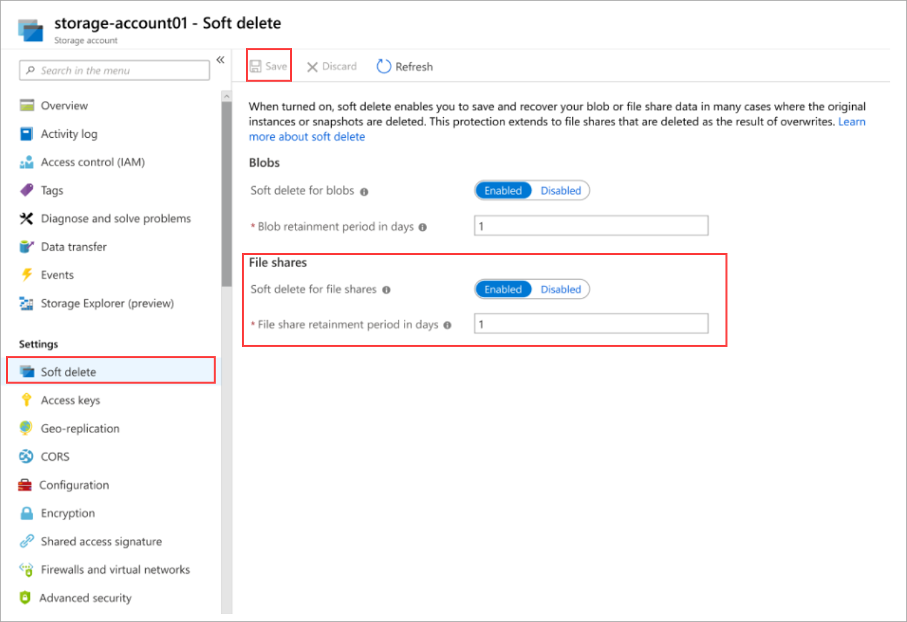

# How to recover deleted file shares

Azure Storage now offers soft delete for file shares so that you can more easily recover your data when it is erroneously modified or deleted by an application or other storage account user.

## How soft delete works

When enabled, soft delete enables you to save and recover your file shares when they are deleted.

When data is deleted, it transitions to a soft deleted state instead of being permanently erased. You can configure the amount of time soft deleted data is recoverable before it is permanently expired.

Soft delete is backwards compatible, so you don't have to make any changes to your applications to take advantage of the protections this feature affords. 

You can enable soft delete on your existing file shares.

## Configuration settings

When you create a new account, soft delete is off by default. Soft delete is also off by default for existing storage accounts. You can toggle the feature on and off at any time during the life of a storage account.

If you enable soft delete for file shares, delete some file shares, and then disable soft delete, you will still be able to access and recover those file shares, if those shares were saved when soft delete was enabled. When you turn on soft delete, you also need to configure the retention period.

The retention period indicates the amount of time that soft deleted file shares are stored and available for recovery. For file shares that are explicitly deleted, the retention period clock starts when the data is deleted. Currently you can retain soft deleted shares for between 1 and 365 days.

You can change the soft delete retention period at any time. An updated retention period will only apply to shares deleted after the retention period has been updated. Shares deleted previous to the retention period update will expire based on the retention period that was configured when that data was deleted. Attempting to delete a soft deleted file share will not affect its expiry time.

## Pricing and billing

Soft deleted file shares are billed at a different rate. Premium file shares, when soft deleted, are billed at the snapshot rate. You will not be charged for data that is permanently deleted after the configured retention period. 

For more details on prices for Azure File Storage in general, check out the [Azure File Storage Pricing Page](https://azure.microsoft.com/pricing/details/storage/files/).

When you initially turn on soft delete, we recommend using a small retention period to better understand how the feature will affect your bill.

## Enable soft delete

The following steps show how to enable soft delete for Azure file shares on your storage account.

# [Portal](#tab/azure-portal)

1. Sign into the [Azure portal](https://portal.azure.com/).
1. Navigate to your storage account and select **Soft delete** under **Settings**.
1. Under **File shares** select **Enabled** for **Soft delete for file shares**.
1. Select **File share retention period in days** and enter a number of your choosing.
1. Select **Save** to confirm your data retention settings.



# [PowerShell](#tab/azure-powershell)

```azurepowershell-interactive
$rgName = "yourResourceGroupName"
$accountName = "yourStorageAccountName"
```

To restore a soft deleted file share, use the following cmdlet:

```azurepowershell-interactive
Restore-AzRmStorageShare -ResourceGroupName $rgname -StorageAccountName $accountName -RestoredShareName aab -DeletedShareName testshare1 -DeletedShareVersion 01D5E2783BDCDA97
```