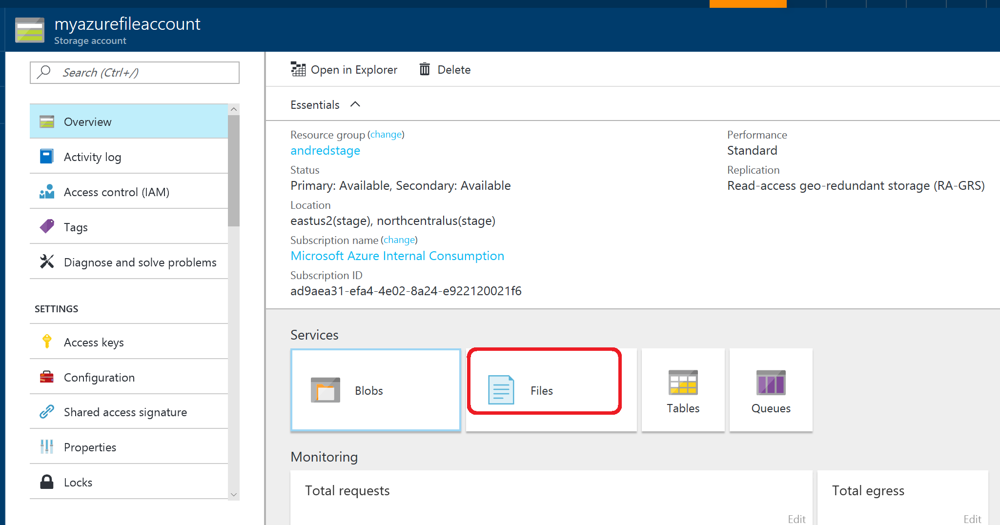
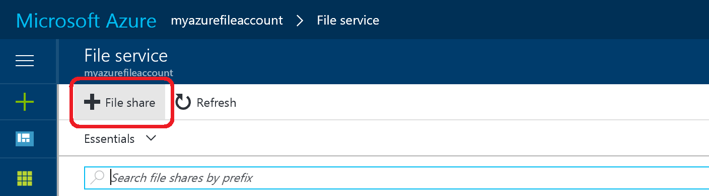
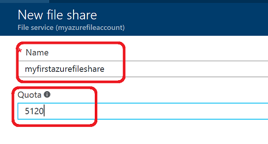
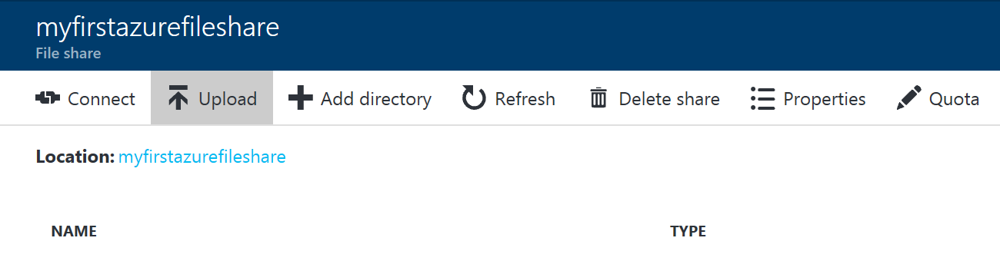

# Create a file share in Azure Files
You can create Azure File shares using the [Azure portal](https://portal.azure.com/), the Azure Storage PowerShell cmdlets, the Azure Storage client libraries, or the Azure Storage REST API. In this tutorial, you will learn:
* How to create an Azure file share using the Azure portal
* [How to create an Azure file share using Powershell](#create-file-share-through-powershell)
* [How to create an Azure file share using the CLI](#create-file-share-through-command-line-interface-cli)

## Prerequisites
To create an Azure file share, you can use a Storage Account that already exists, or [create a new Azure Storage Account](../common/storage-create-storage-account.md?toc=%2fazure%2fstorage%2ffiles%2ftoc.json). To create an Azure file share with PowerShell, you will need the account key and name of your storage account. You will need a Storage account key if you plan to use Powershell or the CLI.

## Create a file share through the Azure portal
1. **Go to the Storage Account blade on the Azure portal**:    
    

2. **Click on add File Share button**:    
    

3. **Provide Name and Quota. The Quota's current maximum value is 5 TiB**:    
    

4. **View your new file share**:
    

5. **Upload a file**:
    

6. **Browse into your file share and manage your directories and files**:
    


## Create file share through PowerShell

[!INCLUDE [updated-for-az](../../../includes/updated-for-az.md)]

To prepare to use PowerShell, download and install the Azure PowerShell cmdlets. See [How to install and configure Azure PowerShell](https://azure.microsoft.com/documentation/articles/powershell-install-configure/) for the install point and installation instructions.

> [!Note]  
> It's recommended that you download and install or upgrade to the latest Azure PowerShell module.

1. **Create a context for your storage account and key**
    The context encapsulates the storage account name and account key. For instructions on copying your account key from the [Azure portal](https://portal.azure.com/), see [Storage account access keys](../common/storage-account-manage.md#access-keys).

    ```powershell
    $storageContext = New-AzStorageContext <storage-account-name> <storage-account-key>
    ```
    
2. **Create a new file share**:    
    
    ```powershell
    $share = New-AzStorageShare logs -Context $storageContext
    ```

> [!Note]  
> The name of your file share must be all lowercase. For complete details about naming file shares and files, see [Naming and Referencing Shares, Directories, Files, and Metadata](https://msdn.microsoft.com/library/azure/dn167011.aspx).

## Create file share through Command Line Interface (CLI)
1. **To prepare to use the Command Line Interface (CLI), download and install the Azure CLI.**  
    See [Install the Azure CLI](https://docs.microsoft.com/cli/azure/install-azure-cli) and [Get started with Azure CLI](https://docs.microsoft.com/cli/azure/get-started-with-azure-cli).

2. **Create a connection string to the storage account where you want to create the share.**  
    Replace ```<storage-account>``` and ```<resource_group>``` with your storage account name and resource group in the following example:

   ```azurecli
    current_env_conn_string=$(az storage account show-connection-string -n <storage-account> -g <resource-group> --query 'connectionString' -o tsv)

    if [[ $current_env_conn_string == "" ]]; then  
        echo "Couldn't retrieve the connection string."
    fi
    ```

3. **Create the file share**
    ```azurecli
    az storage share create --name files --quota 2048 --connection-string $current_env_conn_string 1 > /dev/null
    ```

## Next steps
* [Connect and Mount File Share - Windows](storage-how-to-use-files-windows.md)
* [Connect and Mount File Share - Linux](../storage-how-to-use-files-linux.md)
* [Connect and Mount File Share - macOS](storage-how-to-use-files-mac.md)

See these links for more information about Azure Files.

* [FAQ](../storage-files-faq.md)
* [Troubleshooting on Windows](storage-troubleshoot-windows-file-connection-problems.md)      
* [Troubleshooting on Linux](storage-troubleshoot-linux-file-connection-problems.md)   
