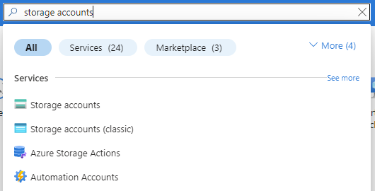
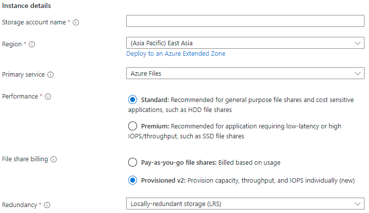
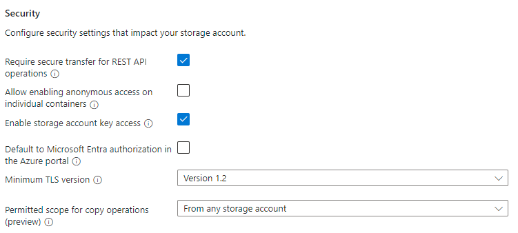
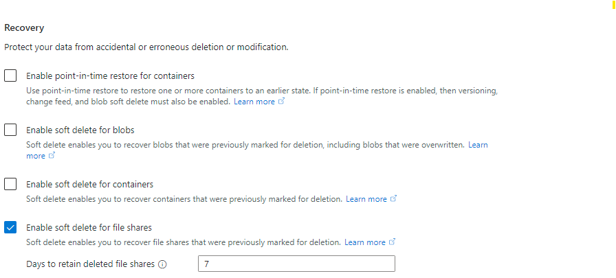
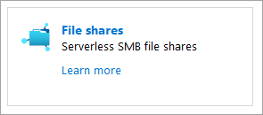

# Create an Azure file share
To create an Azure file share, you need to answer three questions about how you will use it:

- **What are the performance requirements for your Azure file share?**  
    Azure Files offers standard file shares, which are hosted on hard disk-based (HDD-based) hardware, and premium file shares, which are hosted on solid-state disk-based (SSD-based) hardware.

- **What size file share do you need?**  
    Standard file shares can span up to 100 TiB, however this feature is not enabled by default; if you need a file share that is larger than 5 TiB, you will need to enable the large file share feature for your storage account. Premium file shares can span up to 100 TiB without any special setting, however premium file shares are provisioned, rather than pay as you go like standard file shares. This means that provisioning a file share much larger than what you need will increase the total cost of storage.

- **What are your redundancy requirements for your Azure file share?**  
    Standard file shares offer locally-redundant (LRS), zone redundant (ZRS), geo-redundant (GRS), or geo-zone-redundant (GZRS) storage, however the large file share feature is only supported on locally redundant and zone redundant file shares. Premium file shares do not support any form of geo-redundancy.

    Premium file shares are available with locally redundancy in most regions that offer storage accounts and with zone redundancy in a smaller subset of regions. To find out if premium file shares are currently available in your region, see the [products available by region](https://azure.microsoft.com/global-infrastructure/services/?products=storage) page for Azure. For information about regions that support ZRS, see [Azure Storage redundancy](../common/storage-redundancy.md?toc=%2fazure%2fstorage%2ffiles%2ftoc.json).

For more information on these three choices, see [Planning for an Azure Files deployment](storage-files-planning.md).

## Prerequisites
- This article assumes that you have already created an Azure subscription. If you don't already have a subscription, then create a [free account](https://azure.microsoft.com/free/?WT.mc_id=A261C142F) before you begin.
- If you intend to use Azure PowerShell, [install the latest version](https://docs.microsoft.com/powershell/azure/install-az-ps).
- If you intend to use the Azure CLI, [install the latest version](https://docs.microsoft.com/cli/azure/install-azure-cli?view=azure-cli-latest).

## Create a storage account
Azure file shares are deployed into *storage accounts*, which are top-level objects that represent a shared pool of storage. This pool of storage can be used to deploy multiple file shares. 

Azure supports multiple types of storage accounts for different storage scenarios customers may have, but there are two main types of storage accounts for Azure Files. Which storage account type you need to create depends on whether you want to create a standard file share or a premium file share: 

- **General purpose version 2 (GPv2) storage accounts**: GPv2 storage accounts allow you to deploy Azure file shares on standard/hard disk-based (HDD-based) hardware. In addition to storing Azure file shares, GPv2 storage accounts can store other storage resources such as blob containers, queues, or tables. 

- **FileStorage storage accounts**: FileStorage storage accounts allow you to deploy Azure file shares on premium/solid-state disk-based (SSD-based) hardware. FileStorage accounts can only be used to store Azure file shares; no other storage resources (blob containers, queues, tables, etc.) can be deployed in a FileStorage account.

# [Portal](#tab/azure-portal)
To create a storage account via the Azure portal, select **+ Create a resource** from the dashboard. In the resulting Azure Marketplace search window, search for **storage account** and select the resulting search result. This will lead to an overview page for storage accounts; select **Create** to proceed with the storage account creation wizard.



#### The Basics section
The first section to complete to create a storage account is labeled **Basics**. This contains all of the required fields to create a storage account. To create a GPv2 storage account, ensure the **Performance** radio button is set to *Standard* and the **Account kind** drop-down list is selected to *StorageV2 (general purpose v2)*.



To create a FileStorage storage account, ensure the **Performance** radio button is set to *Premium* and the **Account kind** drop-down list is selected to *FileStorage*.



The other basics fields are independent from the choice of storage account:
- **Subscription**: The subscription for the storage account to be deployed into. 
- **Resource group**: The resource group for the storage account to be deployed into. You may either create a new resource group or use an existing resource group. A resource group is a logical container for grouping your Azure services. When you create a storage account, you have the option to either create a new resource group, or use an existing resource group.
- **Storage account name**: The name of the storage account resource to be created. This name must be globally unique, but otherwise can any name you desire. The storage account name will be used as the server name when you mount an Azure file share via SMB.
- **Location**: The region for the storage account to be deployed into. This can be the region associated with the resource group, or any other available region.
- **Replication**: Although this is labeled replication, this field actually means **redundancy**; this is the desired redundancy level: locally redundancy (LRS), zone redundancy (ZRS), geo-redundancy (GRS), and geo-zone-redundancy. This drop-down list also contains read-access geo-redundancy (RA-GRS) and read-access geo-zone redundancy (RA-GZRS), which do not apply to Azure file shares; any file share created in a storage account with these selected will actually be either geo-redundant or geo-zone-redundant, respectively. Depending on your region or selected storage account type, some redundancy options may not be allowed.
- **Access tier**: This field does not apply to Azure Files, so you can choose either one of the radio buttons.

#### The Networking blade
The networking section allows you to configure networking options. These settings are optional for the creation of the storage account and can be configured later if desired. For more information on these options, see [Azure Files networking considerations](storage-files-networking-overview.md).

#### The Advanced blade
The advanced section contains several important settings for Azure file shares:

- **Secure transfer required**: This field indicates whether the storage account requires encryption in transit for communication to the storage account. We recommend this is left enabled, however, if you require SMB 2.1 support, you must disable this. We recommend if you disable encryption that you constrain your storage account access to a virtual network with service endpoints and/or private endpoints.
- **Large file shares**: This field enables the storage account for file shares spanning up to 100 TiB. Enabling this feature will limit your storage account to only locally redundant and zone redundant storage options. Once a GPv2 storage account has been enabled for large file shares, you cannot disable the large file share capability. FileStorage storage accounts (storage accounts for premium file shares) do not have this option, as all premium file shares can scale up to 100 TiB. 



The other settings that are available in the advanced tab (blob soft-delete, hierarchical namespace for Azure Data Lake storage gen 2, and NFSv3 for blob storage) do not apply to Azure Files.

#### Tags
Tags are name/value pairs that enable you to categorize resources and view consolidated billing by applying the same tag to multiple resources and resource groups. These are optional and can be applied after storage account creation.

#### Review + create
The final step to create the storage account is to select the **Create** button on the **Review + create** tab. This button won't be available if all of the required fields for a storage account are not filled.

# [PowerShell](#tab/azure-powershell)
To create a storage account using PowerShell, we will use the `New-AzStorageAccount` cmdlet. This cmdlet has many options; only the required options are shown. To learn more about advanced options, see the [`New-AzStorageAccount` cmdlet documentation](/powershell/module/az.storage/new-azstorageaccount).

To simplify the creation of the storage account and subsequent file share, we will store several parameters in variables. You may replace the variable contents with whatever values you wish, however note that the storage account name must be globally unique.

```azurepowershell-interactive
$resourceGroupName = "myResourceGroup"
$storageAccountName = "mystorageacct$(Get-Random)"
$region = "westus2"
```

To create a storage account capable of storing standard Azure file shares, we will use the following command. The `-SkuName` parameter relates to the type of redundancy desired; if you desire a geo-redundant or geo-zone-redundant storage account, you must also remove the `-EnableLargeFileShare` parameter.

```azurepowershell-interactive
$storAcct = New-AzStorageAccount `
    -ResourceGroupName $resourceGroupName `
    -Name $storageAccountName `
    -SkuName Standard_LRS `
    -Location $region `
    -Kind StorageV2 `
    -EnableLargeFileShare
```

To create a storage account capable of storing premium Azure file shares, we will use the following command. Note that the `-SkuName` parameter has changed to include both `Premium` and the desired redundancy level of locally redundant (`LRS`). The `-Kind` parameter is `FileStorage` instead of `StorageV2` because premium file shares must be created in a FileStorage storage account instead of a GPv2 storage account.

```azurepowershell-interactive
$storAcct = New-AzStorageAccount `
    -ResourceGroupName $resourceGroupName `
    -Name $storageAccountName `
    -SkuName Premium_LRS `
    -Location $region `
    -Kind FileStorage 
```

# [Azure CLI](#tab/azure-cli)
To create a storage account using the Azure CLI, we will use the az storage account create command. This command has many options; only the required options are shown. To learn more about the advanced options, see the [`az storage account create` command documentation](/cli/azure/storage/account).

To simplify the creation of the storage account and subsequent file share, we will store several parameters in variables. You may replace the variable contents with whatever values you wish, however note that the storage account name must be globally unique.

```azurecli-interactive
resourceGroupName="myResourceGroup"
storageAccountName="mystorageacct$RANDOM"
region="westus2"
```

To create a storage account capable of storing standard Azure file shares, we will use the following command. The `--sku` parameter relates to the type of redundancy desired; if you desire a geo-redundant or geo-zone-redundant storage account, you must also remove the `--enable-large-file-share` parameter.

```azurecli-interactive
az storage account create \
    --resource-group $resourceGroupName \
    --name $storageAccountName \
    --kind StorageV2 \
    --sku Standard_ZRS \
    --enable-large-file-share \
    --output none
```

To create a storage account capable of storing premium Azure file shares, we will use the following command. Note that the `--sku` parameter has changed to include both `Premium` and the desired redundancy level of locally redundant (`LRS`). The `--kind` parameter is `FileStorage` instead of `StorageV2` because premium file shares must be created in a FileStorage storage account instead of a GPv2 storage account.

```azurecli-interactive
az storage account create \
    --resource-group $resourceGroupName \
    --name $storageAccountName \
    --kind FileStorage \
    --sku Premium_LRS \
    --output none
```

---

## Create file share
Once you've created your storage account, all that is left is to create your file share. This process is mostly the same regardless of whether you're using a premium file share or a standard file share. The primary difference is the **quota** and what it represents.

For standard file shares, it's an upper boundary of the Azure file share, beyond which end-users cannot go. The primary purpose for quota for a standard file share is budgetary: "I don't want this file share to grow beyond this point". If a quota is not specified, standard file share can span up to 100 TiB (or 5 TiB if the large file shares property is not set for a storage account).

For premium file shares, quota is overloaded to mean **provisioned size**. The provisioned size is the amount that you will be billed for, regardless of actual usage. When you provision a premium file share, you want to consider two factors: 1) the future growth of the share from a space utilization perspective and 2) the IOPS required for your workload. Every provisioned GiB entitles you to additional  reserved and burst IOPS. For more information on how to plan for a premium file share, see [provisioning premium file shares](storage-files-planning.md#understanding-provisioning-for-premium-file-shares).

# [Portal](#tab/azure-portal)
If you just created your storage account, you can navigate to it from the deployment screen by selecting **Go to resource**. If you have previously created the storage account, you can navigate to it via the resource group containing it. Once in the storage account, select the tile labeled **File shares** (you can also navigate to **File shares** via the table of contents for the storage account).



In the file share listing, you should see any file shares you have previously created in this storage account; an empty table if no file shares have been created yet. Select **+ File share** to create a new file share.

The new file share blade should appear on the screen. Complete the fields in the new file share blade to create a file share:

- **Name**: the name of the file share to be created.
- **Quota**: The quota of the file share for standard file shares; the provisioned size of the file share for premium file shares.

Select **Create** to finishing creating the new share. Note that if your storage account is in a virtual network, you will not be able to successfully create an Azure file share unless your client is also in the virtual network. You can also work around this point-in-time limitation by using the Azure PowerShell `New-AzRmStorageShare` cmdlet.

# [PowerShell](#tab/azure-powershell)
You can create the Azure file share with the [`New-AzRmStorageShare`](/powershell/module/az.storage/New-AzRmStorageShare) cmdlet. The following PowerShell commands assume you have set the variables `$resourceGroupName` and `$storageAccountName` as defined above in the creating a storage account with Azure PowerShell section. 

> [!Important]  
> For premium file shares, the `-QuotaGiB` parameter refers to the provisioned size of the file share. The provisioned size of the file share is the amount you will be billed for, regardless of usage. Standard file shares are billed based on usage rather than provisioned size.

```azurepowershell-interactive
$shareName = "myshare"

New-AzRmStorageShare `
    -ResourceGroupName $resourceGroupName `
    -StorageAccountName $storageAccountName `
    -Name $shareName `
    -QuotaGiB 1024 | Out-Null
```

> [!Note]  
> The name of your file share must be all lowercase. For complete details about naming file shares and files, see [Naming and referencing shares, directories, files, and metadata](https://msdn.microsoft.com/library/azure/dn167011.aspx).

# [Azure CLI](#tab/azure-cli)
Before we can create an Azure file share with the Azure CLI, you must get a storage account key to authorize the file share create operation with. This can be done with the [`az storage account keys list`](/cli/azure/storage/account/keys) command:

```azurecli-interactive
storageAccountKey=$(az storage account keys list \
    --resource-group $resourceGroupName \
    --account-name $storageAccountName \
    --query "[0].value" | tr -d '"')
```

Once you have the storage account key, you can create the Azure file share with the [`az storage share create`](/cli/azure/storage/share) command. 

> [!Important]  
> For premium file shares, the `--quota` parameter refers to the provisioned size of the file share. The provisioned size of the file share is the amount you will be billed for, regardless of usage. Standard file shares are billed based on usage rather than provisioned size.

```azurecli-interactive
shareName="myshare"

az storage share create \
    --account-name $storageAccountName \
    --account-key $storageAccountKey \
    --name $shareName \
    --quota 1024 \
    --output none
```

This command will fail if the storage account is contained within a virtual network and the computer you're invoking this command from is not part of the virtual network. You can work around this point-in-time limitation by using the Azure PowerShell `New-AzRmStorageShare` cmdlet as described above, or by executing the Azure CLI from a computer that is a part of the virtual network, including via a VPN connection.

---

> [!Note]  
> The name of your file share must be all lowercase. For complete details about naming file shares and files, see [Naming and referencing shares, directories, files, and metadata](https://msdn.microsoft.com/library/azure/dn167011.aspx).

## Next steps
- [Plan for a deployment of Azure Files](storage-files-planning.md) or [Plan for a deployment of Azure File Sync](storage-sync-files-planning.md). 
- [Networking overview](storage-files-networking-overview.md).
- Connect and mount a file share on [Windows](storage-how-to-use-files-windows.md), [macOS](storage-how-to-use-files-mac.md), and [Linux](storage-how-to-use-files-linux.md).