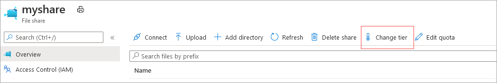
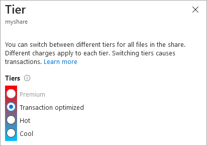

# Create an SMB Azure file share
To create an Azure file share, you need to answer three questions about how you will use it:

- **What are the performance requirements for your Azure file share?**  
    Azure Files offers standard file shares which are hosted on hard disk-based (HDD-based) hardware, and premium file shares, which are hosted on solid-state disk-based (SSD-based) hardware.

- **What are your redundancy requirements for your Azure file share?**  
    Standard file shares offer locally-redundant (LRS), zone redundant (ZRS), geo-redundant (GRS), or geo-zone-redundant (GZRS) storage, however the large file share feature is only supported on locally redundant and zone redundant file shares. Premium file shares don't support any form of geo-redundancy.

    Premium file shares are available with local redundancy and zone redundancy in a subset of regions. To find out if premium file shares are available in your region, see [products available by region](https://azure.microsoft.com/global-infrastructure/services/?products=storage). For more information, see [Azure Files redundancy](files-redundancy.md).

- **What size file share do you need?**  
    In local and zone redundant storage accounts, Azure file shares can span up to 100 TiB. However, in geo- and geo-zone redundant storage accounts, Azure file shares can span only up to 5 TiB unless you sign up for [Geo-redundant storage for large file shares (preview)](geo-redundant-storage-for-large-file-shares.md).

For more information on these three choices, see [Planning for an Azure Files deployment](storage-files-planning.md).

## Applies to
| File share type | SMB | NFS |
|-|:-:|:-:|
| Standard file shares (GPv2), LRS/ZRS |  |  |
| Standard file shares (GPv2), GRS/GZRS |  |  |
| Premium file shares (FileStorage), LRS/ZRS |  |  |

## Prerequisites
- This article assumes that you've already created an Azure subscription. If you don't already have a subscription, then create a [free account](https://azure.microsoft.com/free/?WT.mc_id=A261C142F) before you begin.
- If you intend to use Azure PowerShell, [install the latest version](/powershell/azure/install-azure-powershell).
- If you intend to use Azure CLI, [install the latest version](/cli/azure/install-azure-cli).

## Create a storage account
Azure file shares are deployed into *storage accounts*, which are top-level objects that represent a shared pool of storage. This pool of storage can be used to deploy multiple file shares. 

Azure supports multiple types of storage accounts for different storage scenarios customers may have, but there are two main types of storage accounts for Azure Files. Which storage account type you need to create depends on whether you want to create a standard file share or a premium file share: 

- **General purpose version 2 (GPv2) storage accounts**: GPv2 storage accounts allow you to deploy Azure file shares on standard/hard disk-based (HDD-based) hardware. In addition to storing Azure file shares, GPv2 storage accounts can store other storage resources such as blob containers, queues, or tables. File shares can be deployed into the transaction optimized (default), hot, or cool tiers.

- **FileStorage storage accounts**: FileStorage storage accounts allow you to deploy Azure file shares on premium/solid-state disk-based (SSD-based) hardware. FileStorage accounts can only be used to store Azure file shares; no other storage resources (blob containers, queues, tables, etc.) can be deployed in a FileStorage account.

# [Portal](#tab/azure-portal)
To create a storage account via the Azure portal, select **+ Create a resource** from the dashboard. In the resulting Azure Marketplace search window, search for **storage account** and select the resulting search result. This will lead to an overview page for storage accounts; select **Create** to proceed with the storage account creation wizard.


#### Basics
The first section to complete to create a storage account is labeled **Basics**. This contains all of the required fields to create a storage account. To create a GPv2 storage account, ensure the **Performance** radio button is set to *Standard* and the **Account kind** drop-down list is selected to *StorageV2 (general purpose v2)*.

:::image type="content" source="media/storage-how-to-create-file-share/files-create-smb-share-performance-standard.png" alt-text="A screenshot of the performance radio button with standard selected and account kind with storagev2 selected.":::

To create a FileStorage storage account, ensure the **Performance** radio button is set to *Premium* and **Fileshares** is selected in the **Premium account type** drop-down list.

:::image type="content" source="media/storage-how-to-create-file-share/files-create-smb-share-performance-premium.png" alt-text="A screenshot of the performance radio button with premium selected and account kind with FileStorage selected.":::

The other basics fields are independent from the choice of storage account:
- **Storage account name**: The name of the storage account resource to be created. This name must be globally unique. The storage account name will be used as the server name when you mount an Azure file share via SMB. Storage account names must be between 3 and 24 characters in length. They may contain numbers and lowercase letters only.
- **Location**: The region for the storage account to be deployed into. This can be the region associated with the resource group, or any other available region.
- **Replication**: Although this is labeled replication, this field actually means **redundancy**; this is the desired redundancy level: locally redundancy (LRS), zone redundancy (ZRS), geo-redundancy (GRS), and geo-zone-redundancy (GZRS). This drop-down list also contains read-access geo-redundancy (RA-GRS) and read-access geo-zone redundancy (RA-GZRS), which don't apply to Azure file shares; any file share created in a storage account with these selected will be either geo-redundant or geo-zone-redundant, respectively. 

#### Networking
The networking section allows you to configure networking options. These settings are optional for the creation of the storage account and can be configured later if desired. For more information on these options, see [Azure Files networking considerations](storage-files-networking-overview.md).

#### Data protection
The data protection section allows you to configure the soft-delete policy for Azure file shares in your storage account. Other settings related to soft-delete for blobs, containers, point-in-time restore for containers, versioning, and change feed apply only to Azure Blob storage.

#### Advanced
The advanced section contains several important settings for Azure file shares:

- **Secure transfer required**: This field indicates whether the storage account requires encryption in transit for communication to the storage account. If you require SMB 2.1 support, you must disable this.

    :::image type="content" source="media/storage-how-to-create-file-share/files-create-smb-share-secure-transfer.png" alt-text="A screenshot of secure transfer enabled in the advanced settings for the storage account.":::

- **Large file shares**: This field enables the storage account for file shares spanning up to 100 TiB. Enabling this feature will limit your storage account to only locally redundant and zone redundant storage options. Once a GPv2 storage account has been enabled for large file shares, you can't disable the large file share capability. FileStorage storage accounts (storage accounts for premium file shares) don't have this option, as all premium file shares can scale up to 100 TiB. 

    :::image type="content" source="media/storage-how-to-create-file-share/files-create-smb-share-large-file-shares.png" alt-text="A screenshot of the large file share setting in the storage account's advanced blade.":::

The other settings that are available in the advanced tab (hierarchical namespace for Azure Data Lake storage gen 2, default blob tier, NFSv3 for blob storage, etc.) don't apply to Azure Files.

> [!Important]  
> Selecting the blob access tier doesn't affect the tier of the file share.

#### Tags
Tags are name/value pairs that enable you to categorize resources and view consolidated billing by applying the same tag to multiple resources and resource groups. These are optional and can be applied after storage account creation.

#### Review + create
The final step to create the storage account is to select the **Create** button on the **Review + create** tab. This button won't be available unless all the required fields for a storage account are filled.

# [PowerShell](#tab/azure-powershell)
To create a storage account using PowerShell, use the `New-AzStorageAccount` cmdlet. This cmdlet has many options; only the required options are shown. To learn more about advanced options, see the [`New-AzStorageAccount` cmdlet documentation](/powershell/module/az.storage/new-azstorageaccount).

To simplify creating the storage account and subsequent file share, we'll store several parameters in variables. You may replace the variable contents with whatever values you wish; however, note that the storage account name must be globally unique.

```powershell
$resourceGroupName = "myResourceGroup"
$storageAccountName = "mystorageacct$(Get-Random)"
$region = "westus2"
```

To create a storage account capable of storing standard Azure file shares, use the following command. The `-SkuName` parameter relates to the type of redundancy desired; if you desire a geo-redundant or geo-zone-redundant storage account, remove the `-EnableLargeFileShare` parameter.

```powershell
$storAcct = New-AzStorageAccount `
    -ResourceGroupName $resourceGroupName `
    -Name $storageAccountName `
    -SkuName Standard_LRS `
    -Location $region `
    -Kind StorageV2 `
    -EnableLargeFileShare
```

To create a storage account capable of storing premium Azure file shares, use the following command. Note that the `-SkuName` parameter has changed to include both `Premium` and the desired redundancy level of locally redundant storage (`LRS`). The `-Kind` parameter is `FileStorage` instead of `StorageV2` because premium file shares must be created in a FileStorage storage account instead of a GPv2 storage account.

```powershell
$storAcct = New-AzStorageAccount `
    -ResourceGroupName $resourceGroupName `
    -Name $storageAccountName `
    -SkuName Premium_LRS `
    -Location $region `
    -Kind FileStorage 
```

# [Azure CLI](#tab/azure-cli)
To create a storage account using Azure CLI, use the az storage account create command. This command has many options; only the required options are shown. To learn more about the advanced options, see the [`az storage account create` command documentation](/cli/azure/storage/account).

To simplify the creation of the storage account and subsequent file share, we'll store several parameters in variables. You may replace the variable contents with whatever values you wish, however note that the storage account name must be globally unique.

```azurecli
resourceGroupName="myResourceGroup"
storageAccountName="mystorageacct$RANDOM"
region="westus2"
```

To create a storage account capable of storing standard Azure file shares, use the following command. The `--sku` parameter relates to the type of redundancy desired; if you desire a geo-redundant or geo-zone-redundant storage account, remove the `--enable-large-file-share` parameter.

```azurecli
az storage account create \
    --resource-group $resourceGroupName \
    --name $storageAccountName \
    --kind StorageV2 \
    --sku Standard_ZRS \
    --enable-large-file-share \
    --output none
```

To create a storage account capable of storing premium Azure file shares, use the following command. Note that the `--sku` parameter has changed to include both `Premium` and the desired redundancy level of locally redundant storage (`LRS`). The `--kind` parameter is `FileStorage` instead of `StorageV2` because premium file shares must be created in a FileStorage storage account instead of a GPv2 storage account.

```azurecli
az storage account create \
    --resource-group $resourceGroupName \
    --name $storageAccountName \
    --kind FileStorage \
    --sku Premium_LRS \
    --output none
```

---

### Enable large file shares on an existing account
Before you create an Azure file share on an existing storage account, you might want to enable large file shares (up to 100 TiB) on the storage account if you haven't already. Standard storage accounts using either LRS or ZRS can be upgraded to support large file shares without causing downtime for existing file shares on the storage account. If you have a GRS, GZRS, RA-GRS, or RA-GZRS account, you'll either need to convert it to an LRS account before proceeding or register for the [Azure Files geo-redundancy for large file shares preview](geo-redundant-storage-for-large-file-shares.md).

# [Portal](#tab/azure-portal)
1. Open the [Azure portal](https://portal.azure.com), and navigate to the storage account where you want to enable large file shares.
1. Select **Configuration** under the **Settings** section.
1. Go to the **Large file shares** setting at the bottom of the page. If it's set to **Disabled**, change the setting to **Enabled**.
1. Select **Save**.

# [PowerShell](#tab/azure-powershell)
To enable large file shares on your existing storage account, use the following command. Replace `<yourStorageAccountName>` and `<yourResourceGroup>` with your information.

```powershell
Set-AzStorageAccount `
    -ResourceGroupName <yourResourceGroup> `
    -Name <yourStorageAccountName> `
    -EnableLargeFileShare
```

# [Azure CLI](#tab/azure-cli)
To enable large file shares on your existing storage account, use the following command. Replace `<yourStorageAccountName>` and `<yourResourceGroup>` with your information.

```azurecli-interactive
az storage account update --name <yourStorageAccountName> -g <yourResourceGroup> --enable-large-file-share
```

---

## Create a file share
Once you've created your storage account, you can create your file share. This process is mostly the same regardless of whether you're using a premium file share or a standard file share. You should consider the following differences:

Standard file shares can be deployed into one of the standard tiers: transaction optimized (default), hot, or cool. This is a per file share tier that isn't affected by the **blob access tier** of the storage account (this property only relates to Azure Blob storage - it doesn't relate to Azure Files at all). You can change the tier of the share at any time after it has been deployed. Premium file shares can't be directly converted to any standard tier.

> [!Important]  
> You can move file shares between tiers within GPv2 storage account types (transaction optimized, hot, and cool). Share moves between tiers incur transactions: moving from a hotter tier to a cooler tier will incur the cooler tier's write transaction charge for each file in the share, while a move from a cooler tier to a hotter tier will incur the cool tier's read transaction charge for each file the share.


# [Portal](#tab/azure-portal)
Follow these instructions to create a new Azure file share using the Azure portal.

1. If you just created your storage account, you can navigate to it from the deployment screen by selecting **Go to resource**. Once in the storage account, select the **File shares** in the table of contents for the storage account.

1. In the file share listing, you should see any file shares you have previously created in this storage account; an empty table if no file shares have been created yet. Select **+ File share** to create a new file share.

1. The new file share blade should appear on the screen. Complete the fields in the **Basic** tab of the new file share blade to create a file share:
   
   - **Name**: The name of the file share to be created.
   - **Tier**: The selected tier for a standard file share. This field is only available in a **general purpose (GPv2) storage account**. You can choose transaction optimized, hot, or cool. The share's tier can be changed at any time. We recommend picking the hottest tier possible during a migration, to minimize transaction expenses, and then switching to a lower tier if desired after the migration is complete.
   - **Provisioned capacity**: For premium file shares only, the provisioned capacity is the amount that you'll be billed for regardless of actual usage. The IOPS and throughput available on a premium file share is based on the provisioned capacity, so you can provision more capacity to get more performance. The minimum size for a premium file share is 100 GiB. For more information on how to plan for a premium file share, see [provisioning premium file shares](understanding-billing.md#provisioned-model).
   
1. Select the **Backup** tab. By default, [backup is enabled](../../backup/backup-azure-files.md) when you create an Azure file share using the Azure portal. If you want to disable backup for the file share, uncheck the **Enable backup** checkbox. If you want backup enabled, you can either leave the defaults or create a new Recovery Services Vault in the same region and subscription as the storage account. To create a new backup policy, select **Create a new policy**.

1. Select **Review + create** and then **Create** to create the Azure file share.

# [PowerShell](#tab/azure-powershell)
You can create an Azure file share with the [`New-AzRmStorageShare`](/powershell/module/az.storage/New-AzRmStorageShare) cmdlet. The following PowerShell commands assume you have set the variables `$resourceGroupName` and `$storageAccountName` as defined above in the creating a storage account with Azure PowerShell section. 

The following example shows creating a file share with an explicit tier using the `-AccessTier` parameter. If a tier isn't specified, the default tier for standard file shares is transaction optimized.

> [!Important]  
> For premium file shares, the `-QuotaGiB` parameter refers to the provisioned capacity of the file share. The provisioned capacity of the file share is the amount you'll be billed for, regardless of usage. Standard file shares are billed based on usage rather than provisioned capacity.

```powershell
# Assuming $resourceGroupName and $storageAccountName from earlier in this document have already
# been populated. The access tier parameter may be TransactionOptimized, Hot, or Cool for GPv2 
# storage accounts. Standard tiers are only available in standard storage accounts. 
$shareName = "myshare"

New-AzRmStorageShare `
        -ResourceGroupName $resourceGroupName `
        -StorageAccountName $storageAccountName `
        -Name $shareName `
        -AccessTier TransactionOptimized `
        -QuotaGiB 1024 | `
    Out-Null
```

# [Azure CLI](#tab/azure-cli)
You can create an Azure file share with the [`az storage share-rm create`](/cli/azure/storage/share-rm#az-storage-share-rm-create) command. The following Azure CLI commands assume you have set the variables `$resourceGroupName` and `$storageAccountName` as defined above in the creating a storage account with Azure CLI section.

> [!Important]  
> For premium file shares, the `--quota` parameter refers to the provisioned capacity of the file share. The provisioned capacity of the file share is the amount you'll be billed for, regardless of usage. Standard file shares are billed based on usage rather than provisioned capacity.

```azurecli
shareName="myshare"

az storage share-rm create \
    --resource-group $resourceGroupName \
    --storage-account $storageAccountName \
    --name $shareName \
    --access-tier "TransactionOptimized" \
    --quota 1024 \
    --output none
```

---

> [!Note]  
> The name of your file share must be all lowercase. For complete details about naming file shares and files, see [Naming and referencing shares, directories, files, and metadata](/rest/api/storageservices/Naming-and-Referencing-Shares--Directories--Files--and-Metadata).

### Change the tier of an Azure file share
File shares deployed in **general purpose v2 (GPv2) storage account** can be in the transaction optimized, hot, or cool tiers. You can change the tier of the Azure file share at any time, subject to transaction costs as described above.

# [Portal](#tab/azure-portal)
On the main storage account page, select **File shares**  select the tile labeled **File shares** (you can also navigate to **File shares** via the table of contents for the storage account).

:::image type="content" source="media/storage-files-quick-create-use-windows/click-files.png" alt-text="Screenshot of storage account blade, file shares selected.":::

In the table list of file shares, select the file share for which you would like to change the tier. On the file share overview page, select **Change tier** from the menu.



On the resulting dialog, select the desired tier: transaction optimized, hot, or cool.



# [PowerShell](#tab/azure-powershell)
The following PowerShell cmdlet assumes that you have set the `$resourceGroupName`, `$storageAccountName`, `$shareName` variables as described in the earlier sections of this document.

```PowerShell
Update-AzRmStorageShare `
    -ResourceGroupName $resourceGroupName `
    -StorageAccountName $storageAccountName `
    -Name $shareName `
    -AccessTier Cool
```

# [Azure CLI](#tab/azure-cli)
The following Azure CLI command assumes that you have set the `$resourceGroupName`, `$storageAccountName`, and `$shareName` variables as described in the earlier sections of this document.

```azurecli
az storage share-rm update \
    --resource-group $resourceGroupName \
    --storage-account $storageAccountName \
    --name $shareName \
    --access-tier "Cool"
```

---

### Expand existing file shares
If you enable large file shares on an existing storage account, you must expand existing file shares in that storage account to take advantage of the increased capacity and scale. 

# [Portal](#tab/azure-portal)
1. From your storage account, select **File shares**.
1. Right-click your file share, and then select **Quota**.
1. Enter the new size that you want, and then select **OK**.


# [PowerShell](#tab/azure-powershell)
To set the quota to the maximum size, use the following command. Replace `<YourResourceGroupName>`, `<YourStorageAccountName>`, and `<YourStorageAccountFileShareName>` with your information.

```powershell
$resourceGroupName = "<YourResourceGroupName>"
$storageAccountName = "<YourStorageAccountName>"
$shareName="<YourStorageAccountFileShareName>"

# update quota
Update-AzRmStorageShare `
    -ResourceGroupName $resourceGroupName `
    -StorageAccountName $storageAccountName `
    -Name $shareName `
    -QuotaGiB 102400
```

# [Azure CLI](#tab/azure-cli)
To set the quota to the maximum size, use the following command. Replace `<yourResourceGroupName>`, `<yourStorageAccountName>`, and `<yourFileShareName>` with your information.

```azurecli-interactive
az storage share-rm update \
    --resource-group <yourResourceGroupName> \
    --storage-account <yourStorageAccountName> \
    --name <yourFileShareName> \
    --quota 102400
```

---

## Delete a file share
To delete an Azure file share, you can use the Azure portal, Azure PowerShell, or Azure CLI. SMB Azure file shares can be recovered within the [soft delete](storage-files-prevent-file-share-deletion.md) retention period.

# [Portal](#tab/azure-portal)
1. Open the [Azure portal](https://portal.azure.com), and navigate to the storage account that contains the file share you want to delete.
1. Open the storage account and select **File shares**.
1. Select the file share you want to delete.
1. Select **Delete share**.
1. Check the box confirming that you agree to the deletion of the file share and all its content.
1. Select **Delete**.

:::image type="content" source="media/storage-how-to-create-file-share/delete-file-share.png" alt-text="Screen shot of the Azure portal procedure for deleting a file share." border="true" lightbox="media/storage-how-to-create-file-share/delete-file-share.png":::

# [PowerShell](#tab/azure-powershell)
1. Log in to your Azure account. To use multi-factor authentication, you'll need to supply your Azure tenant ID.

   ```azurepowershell
   Login-AzAccount -TenantId <YourTenantID>
   ```

1. Run the following script. Replace `<YourStorageAccountName>`, `<YourStorageAccountKey>`, and `<FileShareName>` with your information. You can find your storage account key in the Azure portal by navigating to the storage account and selecting **Security + networking** > **Access keys**, or you can use the `Get-AzStorageAccountKey` cmdlet.

   ```azurepowershell
   $context = New-AzStorageContext -StorageAccountName <YourStorageAccountName> -StorageAccountKey <YourStorageAccountKey>
   Remove-AzStorageShare -Context $context -Name "<FileShareName>"
   ```

# [Azure CLI](#tab/azure-cli)
You can delete an Azure file share with the [`az storage share delete`](/cli/azure/storage/share#az-storage-share-delete) command. Replace `<yourFileShareName>` and `<yourStorageAccountName>` with your information.

```azurecli

az storage share delete \
    --name <yourFileShareName> \
    --account-name <yourStorageAccountName>
```

---

## Next steps
- [Planning for an Azure Files deployment](storage-files-planning.md) or [Planning for an Azure File Sync deployment](../file-sync/file-sync-planning.md).
- [Azure Files networking overview](storage-files-networking-overview.md).
- Mount an SMB file share on [Windows](storage-how-to-use-files-windows.md), [macOS](storage-how-to-use-files-mac.md), or [Linux](storage-how-to-use-files-linux.md).
