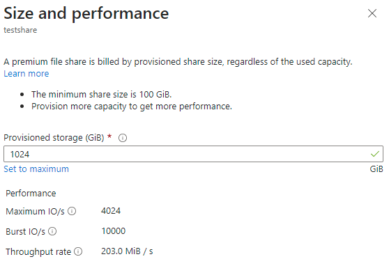

# How to create an SMB Azure file share
Before you create an Azure file share, you need to answer two questions about how you want to use it:

- **What are the performance requirements for your Azure file share?**  
    Azure Files offers two different media tiers of storage, SSD (premium) and HDD (standard), which enable you to tailor your file shares to the performance and price requirements of your scenario. SSD file shares provide consistent high performance and low latency, within single-digit milliseconds for most IO operations. HDD file shares provide cost-effective storage for general purpose use.

- **What are your redundancy requirements for your Azure file share?**  
    Azure Files offers Local (LRS), Zone (ZRS), Geo (GRS), and GeoZone (GZRS) redundancy options for file shares. SSD file shares are only available for the Local and Zone redundancy types. See [Azure Files redundancy](./files-redundancy.md) for more information.

For more information on these choices, see [Planning for an Azure Files deployment](storage-files-planning.md).

## Applies to
| Management model | Billing model | Media tier | Redundancy | SMB | NFS |
|-|-|-|-|:-:|:-:|
| Microsoft.Storage | Provisioned v2 | HDD (standard) | Local (LRS) |  |  |
| Microsoft.Storage | Provisioned v2 | HDD (standard) | Zone (ZRS) |  |  |
| Microsoft.Storage | Provisioned v2 | HDD (standard) | Geo (GRS) |  |  |
| Microsoft.Storage | Provisioned v2 | HDD (standard) | GeoZone (GZRS) |  |  |
| Microsoft.Storage | Provisioned v1 | SSD (premium) | Local (LRS) |  |  |
| Microsoft.Storage | Provisioned v1 | SSD (premium) | Zone (ZRS) |  | |
| Microsoft.Storage | Pay-as-you-go | HDD (standard) | Local (LRS) |  |  |
| Microsoft.Storage | Pay-as-you-go | HDD (standard) | Zone (ZRS) |  |  |
| Microsoft.Storage | Pay-as-you-go | HDD (standard) | Geo (GRS) |  |  |
| Microsoft.Storage | Pay-as-you-go | HDD (standard) | GeoZone (GZRS) |  |  |

## Prerequisites
- This article assumes that you have an Azure subscription. If you don't have an Azure subscription, then create a [free account](https://azure.microsoft.com/free/?WT.mc_id=A261C142F) before you begin.
- If you intend to use Azure PowerShell, [install the latest version](/powershell/azure/install-azure-powershell).
- If you intend to use Azure CLI, [install the latest version](/cli/azure/install-azure-cli).

## Create a storage account
Azure file shares are deployed into *storage accounts*, which are top-level objects that represent a shared pool of storage. This pool of storage can be used to deploy multiple file shares. 

Storage accounts have two properties, kind and SKU, which dictate the billing model, media tier, and redundancy of the file shares deployed in the storage account. For Azure Files, there are three main combinations of kind and SKU to consider:

| Media tier | Billing model | Storage account kind | Storage account SKUs |
|-|-|-|-|
| HDD | [Provisioned v2](./understanding-billing.md#provisioned-v2-model) | FileStorage | <ul><li>StandardV2_LRS</li><li>StandardV2_ZRS</li><li>StandardV2_GRS</li><li>StandardV2_GZRS</li></ul> |
| HDD | [Pay-as-you-go](./understanding-billing.md#pay-as-you-go-model) | StorageV2 | <ul><li>Standard_LRS</li><li>Standard_ZRS</li><li>Standard_GRS</li><li>Standard_GZRS</li></ul> |
| SSD | [Provisioned v1](./understanding-billing.md#provisioned-v1-model) | FileStorage | <ul><li>Premium_LRS</li><li>Premium_ZRS</li></ul> |

If you're creating an HDD file share, you can choose between the provisioned v2 and pay-as-you-go billing models. Both models are fully supported, however, we recommend provisioned v2 for new file share deployments. Provisioned v2 file shares are currently available in a limited subset of regions; see [provisioned v2 availability](./understanding-billing.md#provisioned-v2-availability) for more information.

# [Portal](#tab/azure-portal)
To create a storage account via the Azure portal, use the search box at the top of the Azure portal to search for **storage accounts** and select the matching result. 


This shows a list of all existing storage accounts available in your visible subscriptions. Click **+ Create** to create a new storage account.

### Basics
The first tab to complete to create a storage account is labeled **Basics**, which contains the required fields to create a storage account.


| Field name | Input type | Values | Applicable to Azure Files | Meaning |
|-|-|-|-|-|
| Subscription | Drop-down list | *Available Azure subscriptions* | Yes | The selected subscription in which to deploy the storage account. The number of storage accounts per subscription is limited, so to deploy a new storage account into a selected subscription, if it has fewer storage accounts deployed than the subscription limit. See [storage account scale targets](./storage-files-scale-targets.md#storage-account-scale-targets) for more information. |
| Resource group | Drop-down list | *Available resource groups in selected subscription* | Yes | The resource group in which to deploy the storage account. A resource group is a logical container for organizing for Azure resources, including storage accounts. |
| Storage account name | Text box | -- | Yes | The name of the storage account resource to be created. This name must be globally unique. The storage account name is used as the server name when you mount an Azure file share via SMB. Storage account names must be between 3 and 24 characters in length. They may contain numbers and lowercase letters only. |
| Region | Drop-down list | *Available Azure regions* | Yes | The region for the storage account to be deployed into. This can be the region associated with the resource group, or any other available region. Note: HDD provisioned v2 file shares are only available in a subset of regions. See [provisioned v2 availability](./understanding-billing.md#provisioned-v2-availability) for more information. |
| Primary service | Drop-down list | <ul><li>Azure Blob Storage or Azure Data Lake Storage Gen 2</li><li>**Azure Files**</li><li>Other (tables and queues)</li></ul> | Only unpopulated and **Azure Files** | The service for which you're creating the storage account, in this case **Azure Files**. This field is optional, however, you can't select the provisioned v2 billing model unless you select **Azure Files** from the list. |
| Performance | Radio button group | <ul><li>Standard</li><li>Premium</li></ul> | Yes | The media tier of the storage account. Select **Standard** for an HDD storage account and **Premium** for an SSD storage account. |
| File share billing | Radio button group | <ul><li>Standard<ul><li>Pay-as-you-go</li><li>Provisioned v2</li></ul></li><li>Premium<ul><li>Provisioned v1</li></ul></li></ul> | Yes | The billing model desired for your scenario. For HDD file shares, we recommend provisioned v2 for new deployments, although the pay-as-you-go billing model is still supported. For SSD file shares, the provisioned v1 is the only available billing option. Note: HDD provisioned v2 file shares are only available in a subset of regions. See [provisioned v2 availability](./understanding-billing.md#provisioned-v2-availability) for more information. |
| Redundancy | Drop-down list | <ul><li>Locally-redundant storage (LRS)</li><li>Geo-redundant storage (GRS)</li><li>Zone-redundant storage (ZRS)</li><li>Geo-zone-redundant storage (GZRS)</li></ul> | Yes | The redundancy choice for the storage account. See [Azure Files redundancy](./files-redundancy.md) for more information. |
| Make read access to data available in the event of region unavailability | Checkbox | Checked/unchecked | No | This setting only appears if you select the pay-as-you-go billing model with the Geo or GeoZone redundancy types. Azure Files doesn't support read access to data in the secondary region without a failover regardless of the status of this setting. |

### Advanced
The **Advanced** tab is optional, but provides more granular settings for the storage account. The first section relates to **Security** settings.


| Field name | Input type | Values | Applicable to Azure Files | Meaning |
|-|-|-|-|-|
| Require secure transfer for REST API operations | Checkbox | Checked/unchecked | Yes | This setting indicates that this applies to REST API operations, but it applies to SMB and NFS for Azure Files as well. If you plan to deploy NFS file shares in your storage account, or you have clients that need access to unencrypted SMB (such as SMB 2.1), uncheck this checkbox. |
| Allow enabling anonymous access on individual containers | Checkbox | Checked/unchecked | No | This setting controls whether Azure Blob storage containers are allowed to be accessed with anonymous access. This setting doesn't apply to Azure Files. This setting is available for FileStorage storage accounts containing provisioned v1 or provisioned v2 file shares even though it isn't possible to create Azure Blob storage containers in FileStorage storage accounts. |
| Enable storage account key access | Checkbox | Checked/unchecked | Yes | This setting controls whether the storage account keys (also referred to as shared keys) are enabled. When enabled, storage account keys can be used to mount the file share using SMB or to access the share using the FileREST API. |
| Default to Microsoft Entra authorization in the Azure portal | Checkbox | Checked/unchecked | Yes | This setting controls whether the user's Microsoft Entra (formerly Azure AD) identity is used when browsing the file share in the Azure portal. |
| Minimum TLS version | Drop-down list | *Supported TLS versions* | Yes | This setting controls the minimum allowed TLS version that's used for protocols which use TLS. For Azure Files, only the FileREST protocol uses TLS (as part of HTTPS). |
| Permitted scope for copy operations | Drop-down list | *Scopes for copy operations* | Yes | This setting controls the scope of storage account to storage account copy operations using the FileREST API, usually facilitated through tools like AzCopy. |

The **Hierarchical Namespace** section applies only to Azure Blob storage use, even in FileStorage storage accounts using the provisioned v1 or provisioned v2 billing models which can only contain Azure Files. Azure file shares support a hierarchical namespace regardless of the value of these settings.

| Field name | Input type | Values | Applicable to Azure Files | Meaning |
|-|-|-|-|-|
| Enable hierarchical namespace | Checkbox | Checked/unchecked | No | This is an Azure Blob storage only setting. This setting is disabled for FileStorage storage accounts, but is active for storage accounts using the pay-as-you-go model, even if Azure Files is selected as the primary service. |

The **Access protocols** section applies only to Azure Blob storage use, even in FileStorage storage accounts using the provisioned v1 or provisioned v2 billing models which can only contain Azure Files.

| Field name | Input type | Values | Applicable to Azure Files | Meaning |
|-|-|-|-|-|
| Enable SFTP | Checkbox | Checked/unchecked | No | This is an Azure Blob storage only setting. This setting is disabled for FileStorage storage accounts, but is active for storage accounts using the pay-as-you-go model, even if Azure Files is selected as the primary service. |
| Enable network file system v3 | Checkbox | Checked/unchecked | No | This is an Azure Blob storage only setting. This setting is disabled for FileStorage storage accounts, but is active for storage accounts using the pay-as-you-go model. SSD storage accounts can create NFS v4.1 file shares even though this setting is unchecked; in Azure Files, the file share's protocol is selected on the file share, not the storage account. |

The **Blob storage** section applies only to Azure Blob storage use, even in FileStorage storage accounts using the provisioned v1 or provisioned v2 models which can only contain Azure Files.

| Field name | Input type | Values | Applicable to Azure Files | Meaning |
|-|-|-|-|-|
| Allow cross-tenant replication | Checkbox | Checked/unchecked | No | This is an Azure Blob storage only setting. This setting is always available, even for FileStorage storage accounts which can't contain Azure Blob storage. Checking this checkbox has no impact on Azure Files. |
| Access tier | Radio button group | *Blob storage access tiers* | No | This is an Azure Blob storage only setting. This setting is always available, even for FileStorage storage accounts which can't contain Azure Blob storage. Selecting an option has no impact on Azure Files. |

### Networking
The networking section allows you to configure networking options. These settings are optional for the creation of the storage account and can be configured later if desired. For more information on these options, see [Azure Files networking considerations](storage-files-networking-overview.md).

### Data protection
The **Data protection** tab contains ability to enable or disable soft-delete. The soft-delete option for Azure Files is under the **Recovery** section.


| Field name | Input type | Values | Applicable to Azure Files | Meaning |
|-|-|-|-|-|
| Enable point-in-time restore for containers | Checkbox | Checked/unchecked | No | This is an Azure Blob storage only setting. This setting is always available, even for FileStorage storage accounts which can't contain Azure Blob storage, although checking this box for FileStorage storage accounts does result in a validation error message. For pay-as-you-go storage accounts, the selection for this setting doesn't apply to Azure Files. |
| Maximum restore point (days ago) | Textbox | *Days (number)* | No | When *Enable point-in-time restore for containers* is selected, this textbox is available. The value chosen doesn't apply to Azure Files. |
| Enable soft delete for blobs | Checkbox | Checked/unchecked | No | This is an Azure Blob storage only setting. This setting is always available, even for FileStorage storage accounts which can't contain Azure Blob storage, although checking this box for FileStorage storage accounts does result in a validation error message. For pay-as-you-go storage accounts, the selection for this setting doesn't apply to Azure Files. |
| Days to retain deleted blobs | Textbox | *Days (number)* | No | When *Enable soft delete for blobs* is selected, this textbox is available. The value chosen doesn't apply to Azure Files. |
| Enable soft delete for containers | Checkbox | Checked/unchecked | No | This is an Azure Blob storage only setting. This setting is always available, even for FileStorage storage accounts which can't contain Azure Blob storage, although checking this box for FileStorage storage account does result in a validation error message. For pay-as-you-go storage accounts, the selection for this setting doesn't apply to Azure Files. |
| Days to retain deleted containers | Textbox | *Days (number)* | No | When *Enable soft delete for containers* is selected, this textbox is available. The value chose doesn't apply to Azure Files. |
| Enable soft delete for file shares | Checkbox | Checked/unchecked | Yes | Enable the [soft delete](./storage-files-enable-soft-delete.md) feature to protect against the accidental deletion of file shares. Soft delete is enabled by default, but you may choose to disable this setting if shares are frequently created and deleted as part of a business workflow. Soft deleted file shares are billed for their used capacity, even in provisioned models. |
| Days to retain deleted file shares | Textbox | *Days (number)* | No | When *Enable soft delete for file shares* is selected, this textbox is available. By default, file shares are retained for 7 days before being purged, however you may choose to increase or decrease this number depending on your requirements. Soft deleted file shares are billed for their used capacity, even in provisioned file shares, so retaining for a longer period of time can result in greater expenses due to soft-delete. |

The **Tracking** section applies only to Azure Blob storage use, even in FileStorage storage accounts using the provisioned v1 or provisioned v2 billing models which can only contain Azure Files.

| Field name | Input type | Values | Applicable to Azure Files | Meaning |
|-|-|-|-|-|
| Enable versioning for blobs | Checkbox | Checked/unchecked | No | This is an Azure Blob storage only setting. This setting is always available, even for FileStorage storage accounts which can't contain Azure Blob storage, although checking this box for FileStorage storage accounts does result in a validation error message. For pay-as-you-go storage accounts, the selection for this setting doesn't apply to Azure Files. |
| Enable blob change feed | Checkbox | Checked/unchecked | No | This is an Azure Blob storage only setting. This setting is always available, even for FileStorage storage accounts which can't contain Azure Blob storage, although checking this box for FileStorage storage accounts does result in a validation error message. For pay-as-you-go storage accounts, the selection for this setting doesn't apply to Azure Files. |

The **Access control** section applies only to Azure Blob storage use, even in FileStorage storage accounts using the provisioned v1 or provisioned v2 billing models which can only contain Azure Files.

| Field name | Input type | Values | Applicable to Azure Files | Meaning |
|-|-|-|-|-|
| Enable version-level immutability support | Checkbox | Checked/unchecked | No | This is an Azure Blob storage only setting. This setting is always available, even for FileStorage storage accounts which can't contain Azure Blob storage, although checking this box for FileStorage storage accounts does result in a validation error message. For pay-as-you-go storage accounts, the selection for this setting doesn't apply to Azure Files. |

### Encryption
The **Encryption** tab controls settings related to encryption at rest.


| Field name | Input type | Values | Applicable to Azure Files | Meaning |
|-|-|-|-|-|
| Encryption type | Radio button group | <ul><li>Microsoft-managed keys</li><li>Customer-managed keys</li></ul> | Yes | This setting controls who holds the encryption key for the data placed in this storage account. See [Encryption for data at rest](../common/storage-service-encryption.md?toc=%2Fazure%2Fstorage%2Ffiles%2Ftoc.json) for more information. |
| Enable support for customer-managed keys | Radio button group | <ul><li>Blobs and files only</li><li>All service types (blobs, files, tables, and queues)</li></ul> | No | All kind/SKU combinations Azure file shares can exist in can support customer-managed keys regardless of this setting. |
| Enable infrastructure encryption | Checkbox | Checked/unchecked | Yes | Storage accounts can optionally use a secondary layer of encryption for data stored in the system to guard against one of the keys being compromised. See [Enable infrastructure encryption](../common/infrastructure-encryption-enable.md?toc=%2Fazure%2Fstorage%2Ffiles%2Ftoc.json) for more information. |

### Tags
Tags are name/value pairs that enable you to categorize resources and view consolidated billing by applying the same tag to multiple resources and resource groups. These are optional and can be applied after storage account creation.

### Review + create
The final step to create the storage account is to select the **Create** button on the **Review + create** tab. This button isn't available until all the required fields for a storage account are completed.

# [PowerShell](#tab/azure-powershell)
### Create a provisioned v2 storage account (PowerShell)
The Az.Storage PowerShell module doesn't currently support creating provisioned v2 storage accounts. To create a provisioned v2 storage account using PowerShell, use the `New-AzResource` cmdlet. Storage account properties can be set using the `-Properties` parameter of the `New-AzResource` cmdlet. See [Microsoft.Storage resource provider REST API documentation](/rest/api/storagerp/storage-accounts/create#request-body) to learn more about the possible property names.

To create a storage account for provisioned v2 file shares, use the following command. Remember to replace the values for the variables `$resourceGroupName`, `$storageAccountName`, `$region`, and `$storageAccountSku` with the desired values for your storage account deployment.

```PowerShell
$resourceGroupName = "<my-resource-group>"
$storageAccountName = "<my-storage-account-name>"
$region = "<my-region>"

# Valid SKUs are StandardV2_LRS (HDD Local provisioned v2), StandardV2_ZRS (HDD 
# Zone provisioned v2), StandardV2_GRS (HDD Geo provisioned v2), 
# StandardV2_GZRS (HDD GeoZone provisioned v2)
$storageAccountSku = "StandardV2_LRS"

# Note that kind provided is FileStorage. Combining this with a valid selected 
# SKU will result in an HDD provisioned v2 file share with the selected 
# redundancy. It is also possible to other types of storage accounts with the 
# New-AzResource cmdlet, however, we recommend using the New-AzStorageAccount 
# cmdlet instead.
$storageAccount = New-AzResource `
        -ResourceType "Microsoft.Storage/storageAccounts" `
        -ResourceGroupName $resourceGroupName `
        -ResourceName $storageAccountName `
        -Location $region `
        -Kind "FileStorage" `
        -Sku @{ Name = $storageAccountSku } `
        -Confirm:$false
```

### Create a provisioned v1 or pay-as-you-go storage account (PowerShell)
To create a provisioned v1 or pay-as-you-go storage account using PowerShell, use the `New-AzStorageAccount` cmdlet in the Az.Storage PowerShell module. This cmdlet has many options; only the required options are shown. To learn more about advanced options, see the [`New-AzStorageAccount` cmdlet documentation](/powershell/module/az.storage/new-azstorageaccount).

To create a storage account for provisioned v1 or pay-as-you-go file shares, use the following command. Remember to replace the values for the variables `$resourceGroupName`, `$storageAccountName`, `$region`, `$storageAccountKind`, and `$storageAccountSku` with the desired values for your storage account deployment.

```powershell
$resourceGroupName = "<my-resource-group>"
$storageAccountName = "<my-storage-account-name>"
$region = "<my-region>"

# Valid storage account kinds are FileStorage (SSD provisioned v1) and StorageV2 
# (HDD pay-as-you-go). Create HDD provisioned v2 storage accounts with 
# New-AzResource.
$storageAccountKind = "FileStorage"

# Valid SKUs for FileStorage are Premium_LRS (SSD Local provisioned v1) and 
# Premium_ZRS (SSD Zone provisioned v1).
# 
# Valid SKUs for StorageV2 are Standard_LRS (HDD Local pay-as-you-go), 
# Standard_ZRS (HDD Zone pay-as-you-go), Standard_GRS (HDD Geo pay-as-you-go),
# and Standard_GZRS (HDD GeoZone pay-as-you-go).
$storageAccountSku = "Premium_LRS"

$storageAccount = New-AzStorageAccount `
        -ResourceGroupName $resourceGroupName `
        -Name $storageAccountName `
        -Location $region `
        -Kind $storageAccountKind `
        -SkuName $storageAccountSku
```

# [Azure CLI](#tab/azure-cli)
### Create a provisioned v2 storage account (Azure CLI)
The Azure CLI storage command group doesn't currently support creating provisioned v2 storage accounts. To create a provisioned v2 storage account using Azure CLI, use the `az resource create` command. Storage account properties can be set using the `--properties` parameter of the command. See [Microsoft.Storage resource provider REST API documentation](/rest/api/storagerp/storage-accounts/create#request-body) to learn more about the possible property names.

To create a storage account for provisioned v2 file shares, use the following command. Remember to replace the values for the variables `resourceGroupName`, `storageAccountName`, `region`, and `storageAccountSku` with the desired values for your storage account deployment.

```bash
resourceGroupName="<my-resource-group>"
storageAccountName="<my-storage-account-name>"
region="<my-region>"

# Valid SKUs are StandardV2_LRS (HDD Local provisioned v2), StandardV2_ZRS (HDD 
# Zone provisioned v2), StandardV2_GRS (HDD Geo provisioned v2), 
# StandardV2_GZRS (HDD GeoZone provisioned v2)
storageAccountSku="StandardV2_LRS"

# Note that kind provided is FileStorage. Combining this with a valid selected 
# SKU will result in an HDD provisioned v2 file share with the selected 
# redundancy. It is also possible to other types of storage accounts with the 
# az resource create command, however, we recommend using the az storage account 
# create command instead.
storageAccount=$(az resource create \
        --resource-type "Microsoft.Storage/storageAccounts" \
        --resource-group $resourceGroupName \
        --name $storageAccountName \
        --is-full-object \
        --properties "{\"location\":\"$region\",\"kind\":\"FileStorage\",\"sku\":{\"name\":\"$storageAccountSku\"},\"properties\":{}}" \
        --query "id" \
        --output tsv
)
```

### Create a provisioned v1 or pay-as-you-go storage account (Azure CLI)
To create a provisioned v1 or pay-as-you-go storage account using Azure CLI, use the `az storage account create` command. This command has many options; only the required options are shown. To learn more about the advanced options, see the [`az storage account create` command documentation](/cli/azure/storage/account).

To create a storage account for provisioned v1 or pay-as-you-go file shares, use the following command. Remember to replace the values for the variables `resourceGroupName`, `storageAccountName`, `region`, `storageAccountKind`, and `storageAccountSku` with the desired values for your storage account deployment.

```bash
resourceGroupName="<my-resource-group>"
storageAccountName="<my-storage-account-name>"
region="<my-region>"

# Valid storage account kinds are FileStorage (SSD provisioned v1) and StorageV2 
# (HDD pay-as-you-go). Create HDD provisioned v2 storage accounts with 
# az resource create.
storageAccountKind="FileStorage"

# Valid SKUs for FileStorage are Premium_LRS (SSD Local provisioned v1) and 
# Premium_ZRS (SSD Zone provisioned v1).
# 
# Valid SKUs for StorageV2 are Standard_LRS (HDD Local pay-as-you-go), 
# Standard_ZRS (HDD Zone pay-as-you-go), Standard_GRS (HDD Geo pay-as-you-go),
# and Standard_GZRS (HDD GeoZone pay-as-you-go).
storageAccountSku="Premium_LRS"

az storage account create \
    --resource-group $resourceGroupName \
    --name $storageAccountName \
    --location $region \
    --kind $storageAccountKind \
    --sku $storageAccountSku \
    --output none
```

---

## Create a file share
After you create a storage account, you can create a file share. This process is different depending on whether you created a provisioned v2, provisioned v1, or pay-as-you-go storage account. 

> [!NOTE]
> The name of your file share must be all lower-case letters, numbers, and single hyphens, and must begin and end with a lower-case letter or number. The name can't contain two consecutive hyphens. For details about naming file shares and files, see [Naming and referencing shares, directories, files, and metadata](/rest/api/storageservices/Naming-and-Referencing-Shares--Directories--Files--and-Metadata).

### Create a provisioned v2 file share
When you create a file share using the provisioned v2 billing model, you specify how much storage, IOPS, and throughput your file share needs. The amount of each quantity that you provision determines your total bill. By default, when you create a new file share using the provisioned v2 model, we provide a recommendation for how many IOPS and how much throughput you need based on the amount of provisioned storage you specify. Depending on your individual file share requirements, you may find that you require more or less IOPS or throughput than our recommendations, and can optionally override these recommendations with your own values as desired. To learn more about the provisioned v2 model, see [Understanding the provisioned v2 billing model](./understanding-billing.md#provisioned-v2-model).

# [Portal](#tab/azure-portal)
Follow these instructions to create a new Azure file share using the Azure portal.

1. In your newly created storage account, select **File shares** under **Data storage** in the table of contents for the storage account.

    

2. In the file share listing, you should see any previously created file shares in this storage account or an empty table if no file shares exist. Select **+ File share** to create a new file share.

3. Complete the field in the **Basics** tab of the new file share blade:

    

    - **Name**: The name of the file share to be created.

    - **Provisioned storage (GiB)**: The amount of storage to provision on the share. The actual provisioned storage capacity is the amount that you're billed for regardless of actual usage.

    - **Provisioned IOPS and throughput**: A radio button group that lets you select between *Recommended provisioning* and *Manually specify IOPS and throughput*. The IOPS and throughput recommendations are based on typical customer usage for that amount of provisioned storage for that media tier, so if you don't know specifically what your IOPS and throughput requirements are, we recommend you stick with the recommendations and adjust later as needed.

        - **IOPS**: If you select *Manually specify IOPS and throughput*, this textbox enables you to enter the amount of IOPS you want to provision on this file share.

        - **Throughput (MiB/sec)**: If you select *Manually specify IOPS and throughput*, this textbox enables you to enter the amount of throughput you want to provision on this file share.

4. Select the **Backup** tab. By default, [backup is enabled](../../backup/backup-azure-files.md) when you create an Azure file share using the Azure portal. If you want to disable backup for the file share, uncheck the **Enable backup** checkbox. If you want backup enabled, you can either leave the defaults or create a new Recovery Services Vault in the same region and subscription as the storage account. To create a new backup policy, select **Create a new policy**.

5. Select **Review + create** and then **Create** to create the Azure file share.

# [PowerShell](#tab/azure-powershell)
You can create an Azure file share with the `New-AzResource` cmdlet. The following PowerShell commands assume you set the `$storageAccount` variable when creating a storage account in the Azure PowerShell section.

To create a provisioned v2 file share, use the following command. Remember to replace the values for the variables `$shareName`, `$provisionedStorageGiB`, `$provisionedIops`, and `$provisionedThroughputMibPerSec` with the desired selections for your file share deployment.

```powershell
$shareName = "<file-share>"

# The provisioned storage size of the share in GiB. Valid range is 32 to 
# 262,144. 
$provisionedStorageGib = 1024

# The provisioned IOPS of the share. This is set to null here to get the 
# recommended IOPS for the amount of provisioned storage provided, however, you 
# can override this value if you have detail about how many IOPS your workload 
# requires.
$provisionedIops = $null

# The provisioned throughput in MiB / sec of the share. This is set to null 
# here to get the recommended throughput for the amount of provisioned storage 
# provided, however, you can override this value if you have detail about how 
# much throughput your workload requires.
$provisionedThroughputMibPerSec = $null

# Build file share properties for provisioning
$fileShareProperties = @{ shareQuota = $provisionedStorageGib }

if ($null -ne $provisionedIops) { 
    $fileShareProperties += @{ provisionedIops = $provisionedIops } 
}

if ($null -ne $provisionedThroughputMibPerSec) {
    $fileShareProperties += @{ 
        provisionedBandwidthMibps = $provisionedThroughputMibPerSec 
    }
}

# Build resource ID for desired file share
$resourceId = $storageAccount.ResourceId
$resourceId += "/fileServices/default/shares/$shareName"

# Create resource
New-AzResource `
        -ResourceId $resourceId `
        -Properties $fileShareProperties `
        -Confirm:$false | `
    Out-Null
```

# [Azure CLI](#tab/azure-cli)
You can create an Azure file share with the `az resource create` command. The following commands assume you set the `storageAccount` variable when creating a storage account in the Azure CLI section.

To create a provisioned v2 file share, use the following command. Remember to replace the values for the variables `shareName`, `provisionedStorageGib`, `provisionedIops`, and `provisionedThroughputMibPerSec` with the desired selections for your file share deployment.

```bash
shareName="<file-share>"

# The provisioned storage size of the share in GiB. Valid range is 32 to 
# 262,144.
provisionedStorageGib=1024

# The provisioned IOPS of the share. This is set to the empty string here to 
# get the recommended IOPS for the amount of provisioned storage provided, 
# however, you can override this value if you have detail about how many IOPS 
# your workload requires.
provisionedIops=""

# The provisioned throughput in MiB / sec of the share. This is set to null 
# here to get the recommended throughput for the amount of provisioned storage 
# provided, however, you can override this value if you have detail about how 
# much throughput your workload requires.
provisionedThroughputMibPerSec=""

# Build file share properties JSON.
fileShareProperties="{\"shareQuota\":$provisionedStorageGib"

if [ ! -z "${provisionedIops}" ]; then
    fileShareProperties="$fileShareProperties,\"provisionedIops\":"
    fileShareProperties="$fileShareProperties$provisionedIops"
fi

if [ ! -z "${provisionedThroughputMibPerSec}" ]; then
    fileShareProperties="$fileShareProperties,\"provisionedBandwidthMibps\":"
    fileShareProperties="$fileShareProperties$provisionedThroughputMibPerSec"
fi

fileShareProperties="$fileShareProperties}"

# Build resource ID for desired file share
resourceId="$storageAccount/fileServices/default/shares/$shareName"

# Create resource
az resource create \
        --id $resourceId \
        --properties $fileShareProperties \
        --output none
```

---

### Create an SSD provisioned v1 file share
When you create a file share using the provisioned v1 billing model, you specify how much storage your share needs, and IOPS and throughput capacity are computed for you based on how much storage provisioned. Depending on your individual file share requirements, you may find that you require more IOPS or throughput than our recommendations. In this case, you need to provision more storage to get the required IOPS or throughput. To learn more about the provisioned v1 model, see [Understanding the provisioned v1 billing model](./understanding-billing.md#provisioned-v1-model).

# [Portal](#tab/azure-portal)
Follow these instructions to create a new Azure file share using the Azure portal.

1. In your newly created storage account, select **File shares** under **Data storage** in the table of contents for the storage account.

    

2. In the file share listing, you should see any previously created file shares in this storage account or an empty table if no file shares exist. Select **+ File share** to create a new file share.

3. Complete the fields in the **Basics** tab of new file share blade:

    

    - **Name**: The name of the file share to be created.

    - **Provisioned storage (GiB)**: The amount of storage to provision on the share. The provisioned storage capacity is the amount that you're billed for regardless of actual usage. 

    - **Protocol**: The file sharing protocol to use on the share. By default, new shares use the SMB protocol. Select the NFS protocol for NFS v4.1 shares.

    - **Root Squash**: When NFS is selected as the chosen protocol, toggling the root squash behavior reduces the rights of the root user for NFS file shares.

4. Select the **Backup** tab. By default, [backup is enabled](../../backup/backup-azure-files.md) when you create an Azure file share using the Azure portal. If you want to disable backup for the file share, uncheck the **Enable backup** checkbox. If you want backup enabled, you can either leave the defaults or create a new Recovery Services Vault in the same region and subscription as the storage account. To create a new backup policy, select **Create a new policy**. NFS shares don't support Azure Backup.

5. Select **Review + create** and then **Create** to create the Azure file share.

# [PowerShell](#tab/azure-powershell)
You can create an Azure file share with the [`New-AzRmStorageShare`](/powershell/module/az.storage/New-AzRmStorageShare) cmdlet. The following PowerShell commands assume you set the variables `$resourceGroupName` and `$storageAccountName` as defined in the creating a storage account in the Azure PowerShell section. 

To create a provisioned v1 file share, use the following command. Remember to replace the values for the variables `$shareName`, `$provisionedStorageGib`, and `$protocol` with the desired selections for your file share deployment.

```powershell
$shareName = "<file-share>"

# The provisioned storage size of the share in GiB. Valid range is 100 to 
# 102,400.
$provisionedStorageGib = 1024

# The protocol chosen for the file share. Valid set contains "SMB" and "NFS".
$protocol = "SMB"

New-AzRmStorageShare `
        -ResourceGroupName $resourceGroupName `
        -StorageAccountName $storageAccountName `
        -Name $shareName `
        -QuotaGiB $provisionedStorageGib `
        -EnabledProtocol $protocol | `
    Out-Null
```

# [Azure CLI](#tab/azure-cli)
You can create an Azure file share with [`az storage share-rm create`](/cli/azure/storage/share-rm#az-storage-share-rm-create) command. The following PowerShell commands assume you set the variables `resourceGroupName` and `storageAccountName` as defined in the creating a storage account with Azure CLI section.

To create a provisioned v1 file share, use the following command. Remember to replace the values for the variables `shareName`, `provisionedStorageGib`, and `protocol` with the desired selections for your file share deployment.

```bash
shareName="<file-share>"

# The provisioned storage size of the share in GiB. Valid range is 100 to 
# 102,400.
provisionedStorageGib=1024

# The protocol chosen for the file share. Valid set contains "SMB" and "NFS".
protocol="SMB"

az storage share-rm create \
    --resource-group $resourceGroupName \
    --storage-account $storageAccountName \
    --name $shareName \
    --quota $provisionedStorageGib \
    --enabled-protocols $protocol \
    --output none
```

---

### Create an HDD pay-as-you-go file share
HDD pay-as-you-go file shares have a property called access tier. All three access tiers are stored on the exact same storage hardware. The main difference for these three access tiers is their data at-rest storage prices, which are lower in cooler tiers, and the transaction prices, which are higher in the cooler tiers. To learn more about the differences between tiers, see [differences in access tiers](./understanding-billing.md#differences-in-access-tiers). 

# [Portal](#tab/azure-portal)
Follow these instructions to create a new Azure file share using the Azure portal.

1. In your newly created storage account, select **File shares** under **Data storage** in the table of contents for the storage account.

    

1. In the file share listing, you should see any previously created file shares in this storage account or an empty table if no file shares exist. Select **+ File share** to create a new file share.

1. Complete the fields in the **Basics** tab of new file share blade:

    
   
   - **Name**: The name of the file share to be created.

   - **Access tier**: The selected access tier for a pay-as-you-go file share. We recommend picking the *transaction optimized* access tier possible during a migration, to minimize transaction expenses, and then switching to a lower tier if desired after the migration is complete.
   
1. Select the **Backup** tab. By default, [backup is enabled](../../backup/backup-azure-files.md) when you create an Azure file share using the Azure portal. If you want to disable backup for the file share, uncheck the **Enable backup** checkbox. If you want backup enabled, you can either leave the defaults or create a new Recovery Services Vault in the same region and subscription as the storage account. To create a new backup policy, select **Create a new policy**.

1. Select **Review + create** and then **Create** to create the Azure file share.

# [PowerShell](#tab/azure-powershell)
You can create an Azure file share with the [`New-AzRmStorageShare`](/powershell/module/az.storage/New-AzRmStorageShare) cmdlet. The following PowerShell commands assume you set the variables `$resourceGroupName` and `$storageAccountName` as defined in the creating a storage account with Azure PowerShell section. 

To create a pay-as-you-go file share, use the following command. Remember to replace the values for the variables `$shareName` and `$accessTier` with the desired selections for your file share deployment.

```powershell
$shareName = "<file-share>"

# The access tier of the file share. Valid set contains "TransactionOptimized",
# "Hot", "Cool"
$accessTier = "Hot"

New-AzRmStorageShare `
        -ResourceGroupName $resourceGroupName `
        -StorageAccountName $storageAccountName `
        -Name $shareName `
        -AccessTier $accessTier | `
    Out-Null
```

# [Azure CLI](#tab/azure-cli)
You can create an Azure file share with the [`az storage share-rm create`](/cli/azure/storage/share-rm#az-storage-share-rm-create) command. The following Azure CLI commands assume you set the variables `$resourceGroupName` and `$storageAccountName` as defined in the creating a storage account with Azure CLI section.

To create a pay-as-you-go file share, use the following command. Remember to replace the values for the variables `shareName` and `accessTier` with the desired selections for your file share deployment.

```bash
shareName="<file-share>"

# The access tier of the file share. Valid set contains "TransactionOptimized",
# "Hot", and "Cool".
accessTier="Hot"

az storage share-rm create \
    --resource-group $resourceGroupName \
    --storage-account $storageAccountName \
    --name $shareName \
    --access-tier $accessTier \
    --output none
```

---

## Change the cost and performance characteristics of a file share
After creating your file share, you may need to adjust the provisioning (provisioned models) or access tier (pay-as-you-go model) of the share. The following sections show you how to adjust the relevant properties for your share.

### Change the cost and performance characteristics of a provisioned v2 file share
After creating your provisioned v2 file share, you can change one or all three of the provisioned quantities of your file share.

# [Portal](#tab/azure-portal)
Follow these instructions to update the provisioning for your file share.

1. In your storage account, select **File shares** under **Data storage** in the table of contents for the storage account.

2. In the file share listing, select the file share for which you desire to change the provisioning.

3. In the file share overview, select **Change size and performance**.

    

4. The **Size and performance** pop out dialog has the following options:

    

    - **Provisioned storage (GiB)**: The amount of storage provisioned on the share.

    - **Provisioned IOPS and throughput**: A radio button group that lets you select between *Recommended provisioning* and *Manually specify IOPS and throughput*. If your share is at the recommended IOPS and throughput level for the amount of storage provisioned, *Recommended provisioning* will be selected; otherwise, *Manually specify IOPS and throughput* will be selected. You can toggle between these two options depending on your desire to change share provisioning.

        - **IOPS**: If you select *Manually specify IOPS and throughput*, this textbox enables you to change the amount of IOPS provisioned on this file share.

        - **Throughput (MiB/sec)**: If you select *Manually specify IOPS and throughput*, this textbox enables you to change the amount of throughput provisioned on this file share.

5. Select **Save** to save provisioning changes. Storage, IOPS, and throughput changes are effective within a few minutes after a provisioning change.

# [PowerShell](#tab/azure-powershell)
You can modify a provisioned v2 file share with the `Set-AzResource` cmdlet. Remember to replace the values for the variables `$resourceGroupName`, `$storageAccountName`, `$fileShareName`, `$provisionedStorageGib`, `$provisionedIops`, and `$provisionedThroughputMibPerSec` with the desired values for your file share.

```powershell
# The path to the file share resource to be modified.
$resourceGroupName = "<resource-group>"
$storageAccountName = "<storage-account>"
$fileShareName = "<file-share>"

# The provisioning desired on the file share. Set these values to $null if no 
# change is desired.
$provisionedStorageGib = 10240
$provisionedIops = 10000
$provisionedThroughputMibPerSec = 2048

# Get the resource ID of the storage account
$storageAccount = Get-AzResource `
        -ResourceType "Microsoft.Storage/storageAccounts" `
        -ResourceGroupName $resourceGroupName `
        -ResourceName $storageAccountName

# Build the resource ID of the file share
$resourceId = $storageAccount.ResourceId
$resourceId += "/fileServices/default/shares/$fileShareName"

# Build the properties to be updated for the file share
$fileShareProperties = @{}

if ($null -ne $provisionedStorageGib) {
    $fileShareProperties += @{ shareQuota = $provisionedStorageGib }
}

if ($null -ne $provisionedIops) {
    $fileShareProperties += @{ provisionedIops = $provisionedIops }
}

if ($null -ne $provisionedThroughputMibPerSec) {
    $fileShareProperties += @{ 
        provisionedBandwidthMibps = $provisionedThroughputMibPerSec 
    }
}

# Update file share with new provisioning
Set-AzResource `
        -ResourceId $resourceId `
        -Properties $fileShareProperties `
        -Confirm:$false
```

# [Azure CLI](#tab/azure-cli)
You can modify a provisioned v2 file share with the `az resource patch` command. Remember to replace the value of variables `resourceGroupName`, `storageAccountName`, `fileShareName`, `provisionedStorageGib`, `provisionedIops`, and `provisionedThroughputMibPerSec` with the correct values for your file share.

```bash
# The path to the file share resource to be modified.
resourceGroupName="<resource-group>"
storageAccountName="<storage-account>"
fileShareName="<file-share>"

# The provisioning desired on the file share. Set these values to the empty 
# string if no change is desired.
provisionedStorageGib=10240
provisionedIops=10000
provisionedThroughputMibPerSec=2048

# Get the resource ID of the storage account
storageAccount=$(az resource show \
        --resource-type "Microsoft.Storage/storageAccounts" \
        --resource-group $resourceGroupName \
        --name $storageAccountName \
        --query "id" \
        --output tsv
)

# Build the resource ID of the file share
resourceId="$storageAccount/fileServices/default/shares/$fileShareName"

# Build the properties to be updated for the file share
fileShareProperties="{"

if [ -z "${provisionedStorageGib}" ]; then
    provisionedStorageGib=$(az resource show \
            --ids $resourceId \
            --query "properties.shareQuota" \
            --output tsv
    )
fi

fileShareProperties="$fileShareProperties\"shareQuota\":"
fileShareProperties="$fileShareProperties$provisionedStorageGib"

if [ -z "${provisionedIops}" ]; then
    provisionedIops=$(az resource show \
            --ids $resourceId \
            --query "properties.provisionedIops" \
            --output tsv
    )
fi

fileShareProperties="$fileShareProperties,\"provisionedIops\":"
fileShareProperties="$fileShareProperties$provisionedIops"

if [ -z "${provisionedThroughputMibPerSec}" ]; then
    provisionedThroughputMibPerSec=$(az resource show \
            --ids $resourceId \
            --query "properties.provisionedBandwidthMibps" \
            --output tsv
    )
fi

fileShareProperties="$fileShareProperties,\"provisionedBandwidthMibps\":"
fileShareProperties="$fileShareProperties$provisionedThroughputMibPerSec"

fileShareProperties="$fileShareProperties}"

# Update file share with new provisioning
az resource patch \
        --ids $resourceId \
        --properties $fileShareProperties
```

---

### Change the cost and performance characteristics of a provisioned v1 file share
After creating your provisioned v1 file share, you can change the provisioned storage size of the file share. Changing the provisioned storage of the share will also change the amount of provisioned IOPS and provisioned throughput. For more information, see [provisioned v1 provisioning detail](./understanding-billing.md#provisioned-v1-provisioning-detail).

# [Portal](#tab/azure-portal)
Follow these instructions to update the provisioning for your file share.

1. In your storage account, select **File shares** under **Data storage** in the table of contents for the storage account.

2. In the file share listing, select the file share for which you desire to change the provisioning.

3. In the file share overview select **Change size and performance**.

    

4. The **Size and performance** pop out dialog has a single option, **Provisioned storage (GiB)**. If you require more IOPS or throughput than the given amount of provisioned storage provides, you can increase your provisioned storage capacity to get additional IOPS and throughput.

    

5. Select **Save** to save provisioning changes. Storage, IOPS, and throughput changes are effective within a few minutes after a provisioning change.

# [PowerShell](#tab/azure-powershell)
You can modify a provisioned v1 file share with the `Update-AzRmStorageShare` cmdlet. Remember to replace the values for the variables `$resourceGroupName`, `$storageAccountName`, `$fileShareName`, and `$provisionedStorageGib` with the desired values for your file share.

```PowerShell
# The path to the file share resource to be modified.
$resourceGroupName = "<resource-group>"
$storageAccountName = "<storage-account>"
$fileShareName = "<file-share>"

# The provisioning desired on the file share.
$provisionedStorageGib = 10240

# Update the file share provisioning.
Update-AzRmStorageShare `
        -ResourceGroupName $resourceGroupName `
        -StorageAccountName $storageAccountName `
        -Name $fileShareName `
        -QuotaGiB $provisionedStorageGib
```

# [Azure CLI](#tab/azure-cli)
You can modify a provisioned v1 file share with the `az storage share-rm update` command. Remember to replace the values for the variables `resourceGroupName`, `storageAccountName`, `fileShareName`, and `provisionedStorageGib` with the desired values for your file share.

```bash
# The path to the file share resource to be modified.
resourceGroupName="<resource-group>"
storageAccountName="<storage-account>"
fileShareName="<file-share>"

# The provisioning desired on the file share.
provisionedStorageGib=10240

# Update the file share provisioning.
az storage share-rm update \
        --resource-group $resourceGroupName \
        --storage-account $storageAccountName \
        --name $fileShareName \
        --quota $provisionedStorageGib
```

---

### Change the cost and performance characteristics of a pay-as-you-go file share
After you've created your pay-as-you-go file share, there are two properties you may want to change:

- **Access tier**: The access tier of the file share dictates to the ratio of storage to IOPS/throughput costs (in the form of transactions). There are three access tiers: *transaction optimized*, *hot*, and *cool*. Changing the tier of the Azure file share results in transaction costs for the movement to the new access tier. For more information, see [switching between access tiers](./understanding-billing.md#switching-between-access-tiers).

- **Quota**: Quota is a limit on the size of the file share. The quota property is used in the provisioned v2 and provisioned v1 models to mean "provisioned storage capacity", however, in the pay-as-you-go model, quota has no direct impact on bill. The two primary reasons you might want to modify this are if you use quota to limit the growth of your file share to keep control of the used storage/transaction costs in the pay-as-you-go model, or if you have a storage account predating the introduction of the large file share feature, which enabled file shares to grow beyond 5 TiB. The maximum file share size for a pay-as-you-go file share is 100 TiB.

# [Portal](#tab/azure-portal)
Follow these instructions to update the access tier of your file share.

1. In your storage account, select **File shares** under **Data storage** in the table of contents for the storage account.

2. In the file share listing, select the file share for which you desire to change the access tier.

3. In the file share overview, select **Change tier**.

4. Select the desired **Access tier** from the provided drop-down list.

5. Select **Apply** to save the access tier change.

For these instructions to update the quota of your file share.

1. In your storage account, select **File shares** under **Data storage** in the table of contents for the storage account.

2. In the file share listing, select the file share for which you desire to change the quota.

3. In the file share overview, select **Edit quota**. 

4. In the edit quota pop-out, enter the desired maximum size of the share or select **Set to maximum**. There is no cost implication of setting the share to the maximum size.

5. Click **OK** to save quota changes. The new quota is effective within a few minutes.

# [PowerShell](#tab/azure-powershell)
You can modify the access tier and quota settings of a pay-as-you-go file share with the `Update-AzRmStorageShare` cmdlet. Remember to replace the values for the variables `$resourceGroupName`, `$storageAccountName`, `$fileShareName`, `$accessTier`, and `$quotaGib` with the desired values for your file share.

```PowerShell
# The path to the file share resource to be modified.
$resourceGroupName = "<resource-group>"
$storageAccountName = "<storage-account>"
$fileShareName = "<file-share>"

# The settings to be changed on the file share. Set to $null to skip setting.
$accessTier = "Cool"
$quotaGib = $null

# Construct a parameters hash table for cmdlet splatting.
$updateParams = @{
    ResourceGroupName = $resourceGroupName
    StorageAccountName = $storageAccountName
    Name = $fileShareName
}

if ($null -ne $accessTier) { $updateParams += @{ AccessTier = $accessTier } }
if ($null -ne $quotaGib) { $updateParams += @{ QuotaGiB = $quotaGib } }

# Update the file share
Update-AzRmStorageShare @updateParams
```

# [Azure CLI](#tab/azure-cli)
You can modify the access tier and quota settings of a pay-as-you-go file share with the `az storage share-rm update` command. Remember to replace the values for the variables `resourceGroupName`, `storageAccountName`, `fileShareName`, `accessTier`, and `quotaGib` with the desired values for your file share.

```bash
# The path to the file share resource to be modified.
resourceGroupName="<resource-group>"
storageAccountName="<storage-account>"
fileShareName="<file-share>"

# The settings to be changed on the file share. Set to the empty string to skip 
# setting.
accessTier="Cool"
quotaGib=""

command="az storage share-rm update --resource-group $resourceGroupName"
command="$command --storage-account $storageAccountName --name $fileShareName"

if [ ! -z "${accessTier}" ]; then
    command="$command --access-tier $accessTier"
fi

if [ ! -z "${quotaGib}" ]; then
    command="$command --quota $quotaGib"
fi

# Update file share (command is in variable)
$command
```

---

## Delete a file share
Depending on your workflow, you may wish to delete unused or outdated file shares. You can use the following instructions to delete file shares. File shares in storage accounts with [soft delete enabled](storage-files-prevent-file-share-deletion.md) can be recovered within the  retention period.

# [Portal](#tab/azure-portal)
Follow these instructions to delete a file share.

1. In your storage account, select **File shares** under **Data storage** in the table of contents for the storage account.

2. In the file share list, select the **...** for the file share you desire to delete.

3. Select **Delete share** from the context menu.

4. The **Delete** pop-out contains a survey about why you're deleting the file share. You can skip this, but we appreciate any feedback you have on Azure Files, particularly if something isn't working properly for you.

5. Enter the file share name to confirm deletion and select **Delete**.

# [PowerShell](#tab/azure-powershell)
You can delete a file share using the `Remove-AzRmStorageShare` cmdlet. Remember to replace the values for the variables `$resourceGroupName`, `$storageAccountName`, and `$fileShareName` with the desired values for your file share.

```PowerShell
# The path to the file share resource to be deleted.
$resourceGroupName = "<resource-group>"
$storageAccountName = "<storage-account>"
$fileShareName = "<file-share>"

# Remove the file share
Remove-AzRmStorageShare `
        -ResourceGroupName $resourceGroupName `
        -StorageAccountName $storageAccountName `
        -Name $fileShareName
```

# [Azure CLI](#tab/azure-cli)
You can delete a file share using the `az storage share-rm delete` command. Remember to replace the values for the variables `resourceGroupName`, `storageAccountName`, and `fileShareName` with the desired values for your file share.

```bash
resourceGroupName="<resource-group>"
storageAccountName="<storage-account>"
fileShareName="<file-share>"

az storage share-rm delete \
    --resource-group $resourceGroupName \
    --storage-account $storageAccountName \
    --name $fileShareName
```

---

## Next steps
- [Planning for an Azure Files deployment](storage-files-planning.md) or [Planning for an Azure File Sync deployment](../file-sync/file-sync-planning.md).
- [Azure Files networking overview](storage-files-networking-overview.md).
- Mount an SMB file share on [Windows](storage-how-to-use-files-windows.md), [macOS](storage-how-to-use-files-mac.md), or [Linux](storage-how-to-use-files-linux.md).
