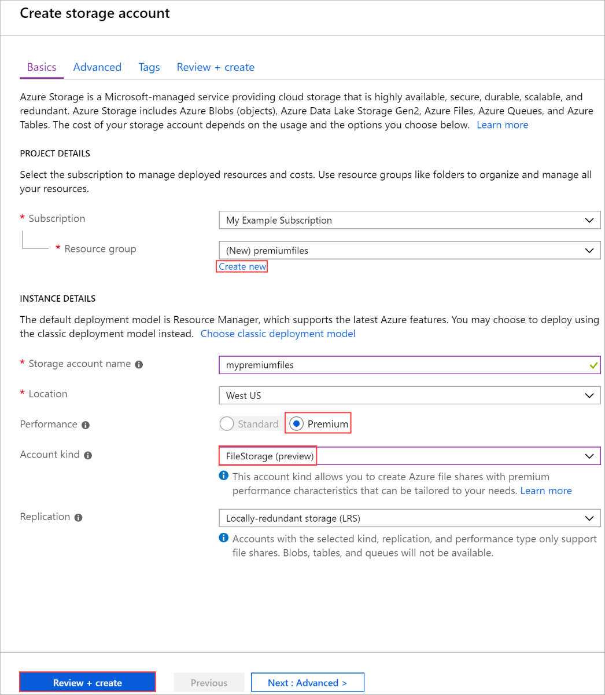

# How to create an Azure premium file storage account

Premium files is a new tier for Azure Files, it is designed for high performance and enterprise scale applications. It provides consistent low latency, high IOPS, and high throughput shares.

This article shows you how to create this new account type using the [Azure portal](https://portal.azure.com/).

## Prerequisites

To access Azure Storage, you'll need an Azure subscription. If you don't already have a subscription, then create a [free account](https://azure.microsoft.com/free/?WT.mc_id=A261C142F) before you begin.

## Sign in to Azure

Sign in to the [Azure portal](https://portal.azure.com/).

## Create a storage account

Now that you're in the Azure portal, you are ready to create your storage account.

Every storage account must belong to an Azure resource group. A resource group is a logical container for grouping your Azure services. When you create a storage account, you have the option to either create a new resource group, or use an existing resource group. This article shows how to create a new resource group.

1. In the Azure portal, select **Storage Accounts** on the left menu.

    

1. On the **Storage Accounts** window that appears, choose **Add**.
1. Select the subscription in which to create the storage account.
1. Under the **Resource group** field, select **Create new**. Enter a name for your new resource group, as shown in the following image.

1. Next, enter a name for your storage account. The name you choose must be unique across Azure. The name also must be between 3 and 24 characters in length, and can include numbers and lowercase letters only.
1. Select a location for your storage account, or use the default location.
1. For **Performance** select **Premium**.
1. Select **Account kind** and choose **FileStorage (preview)**.
1. Leave **Replication** set to its default value of **Locally-redundant storage (LRS)**.

    

1. Select **Review + Create** to review your storage account settings and create the account.
1. Select **Create**.

Once your storage account resource has been created, navigate to it.

## Create a premium file share

1. In the left menu for the storage account, scroll to the **File service** section, then select **Files (preview)**.
1. Select **+File share** to create a premium file share.
1. Enter a name and a desired quota for your file share, then select **Create**.

    

## Clean up resources

If you would like to clean up the resources created in this article, you can simply delete the resource group. Deleting the resource group also deletes the associated storage account as well as any other resources associated with the resource group.

## Next steps

In this article, you've created a premium files storage account. To learn about the performance this account offers, continue to our premium files performance article.

> [!div class="nextstepaction"]
> [Premium files performance](storage-files-premium-files-performance.md)