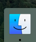
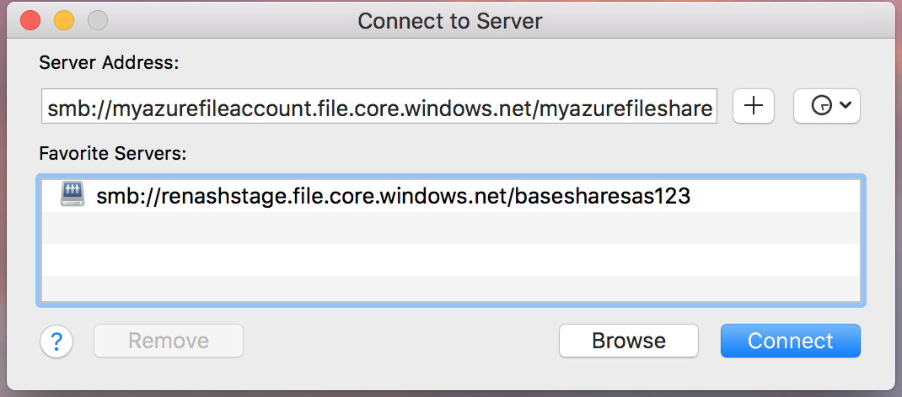
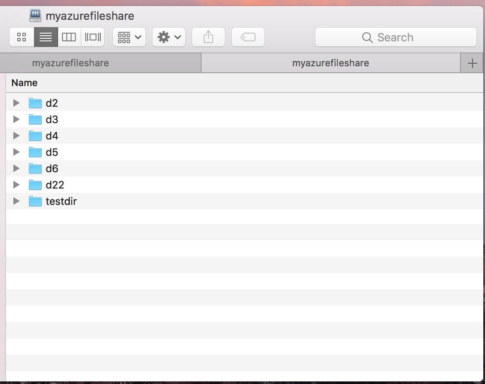
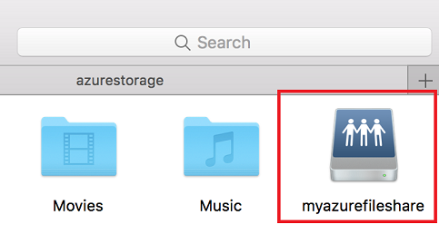

# Mount SMB Azure file share on macOS
[Azure Files](storage-files-introduction.md) is Microsoft's easy-to-use cloud file system. Azure file shares can be mounted with the industry standard SMB 3 protocol by macOS High Sierra 10.13+. This article shows two different ways to mount an Azure file share on macOS: with the Finder UI and using the Terminal.

## Prerequisites for mounting an Azure file share on macOS
* **Storage account name**: To mount an Azure file share, you'll need the name of the storage account.

* **Storage account key**: To mount an Azure file share, you'll need the primary (or secondary) storage key. SAS keys are not currently supported for mounting.

* **Ensure port 445 is open**: SMB communicates over TCP port 445. On your client machine (the Mac), check to make sure your firewall isn't blocking TCP port 445. If your organization or ISP is blocking port 445, you may need to set up a VPN from on-premises to your Azure storage account with Azure Files exposed on your internal network using private endpoints, so that the traffic will go through a secure tunnel as opposed to over the internet. For more information, see [Networking considerations for direct Azure file share access](storage-files-networking-overview.md). To see the summary of ISPs that allow or disallow access from port 445, go to [TechNet](https://social.technet.microsoft.com/wiki/contents/articles/32346.azure-summary-of-isps-that-allow-disallow-access-from-port-445.aspx).

## Applies to
| File share type | SMB | NFS |
|-|:-:|:-:|
| Standard file shares (GPv2), LRS/ZRS |  |  |
| Standard file shares (GPv2), GRS/GZRS |  |  |
| Premium file shares (FileStorage), LRS/ZRS |  |  |

## Mount an Azure file share via Finder
1. **Open Finder**: Finder is open on macOS by default, but you can ensure that it's the currently selected application by clicking the "macOS face icon" on the dock:  
    

2. **Select "Connect to Server" from the "Go" Menu**: Using the UNC path from the prerequisites, convert the beginning double backslash (`\\`) to `smb://` and all other backslashes (`\`) to forwards slashes (`/`). Your link should look like the following:
    

3. **Use the storage account name and storage account key when prompted for a username and password**: When you click "Connect" on the "Connect to Server" dialog, you will be prompted for the username and password (This will be autopopulated with your macOS username). You have the option of placing the storage account name/storage account key in your macOS Keychain.

4. **Use the Azure file share as desired**: After substituting the share name and storage account key in for the username and password, the share will be mounted. You may use this as you would normally use a local folder/file share, including dragging and dropping files into the file share:

    

## Mount an Azure file share via Terminal
1. Replace `<storage-account-name>`, `<storage-account-key>`, and `<share-name>` with the appropriate values for your environment.

    ```
    open smb://<storage-account-name>:<storage-account-key>@<storage-account-name>.file.core.windows.net/<share-name>
    ```

2. **Use the Azure file share as desired**: The Azure file share will be mounted at the mount point specified by the previous command.  

    

## Next steps
* [Connect your Mac to shared computers and servers - Apple Support](https://support.apple.com/guide/mac-help/connect-mac-shared-computers-servers-mchlp1140/mac)