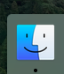
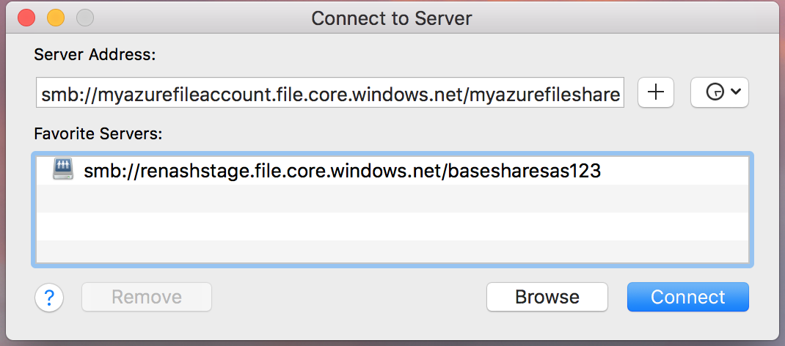
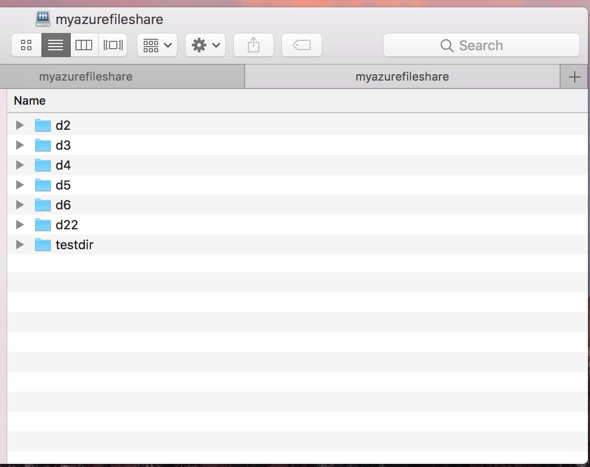
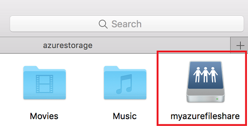

# Mount an Azure file share on macOS

**Applies to:** :heavy_check_mark: SMB file shares

[Azure Files](storage-files-introduction.md) is Microsoft's easy-to-use cloud file system. Azure file shares can be mounted with the industry standard SMB 3 protocol by macOS High Sierra 10.13+.

> [!WARNING]
> Mounting a file share using storage account keys carries inherent security risks. Use [identity-based authentication](identity-kerberos-authentication-macos.md) instead. For information on how to protect and manage your keys, see [Manage storage account access keys](../common/storage-account-keys-manage.md).

## Prerequisites for mounting an Azure file share on macOS

* **Ensure port 445 is open, or set up a VPN connection**: SMB communicates over TCP port 445. On your macOS, check to make sure your firewall doesn't block TCP port 445. If port 445 is blocked, you can set up a VPN from on-premises to your Azure file share using private endpoints. For more information, see [Networking considerations for direct Azure file share access](storage-files-networking-overview.md).

* **Storage account name**: To mount an Azure file share, you need the name of the storage account.

* **Storage account key**: If you're using [identity-based authentication](identity-kerberos-authentication-macos.md) (recommended), you don't need the storage account key. If identity-based authentication isn't configured on the storage account, you need the primary (or secondary) storage account key.

## Mount an Azure file share via Finder

1. **Open Finder**: Finder is open on macOS by default, but you can ensure that it's the currently selected application by clicking the macOS face icon on the dock:  
    

1. **Select "Connect to Server" from the "Go" Menu**: Using the UNC path, convert the beginning double backslash (`\\`) to `smb://` and all other backslashes (`\`) to forward slashes (`/`).
    

1. **Use the storage account name and storage account key if prompted for a username and password**: If desired, you can persist the storage account name and storage account key in your macOS Keychain.

1. **Use the Azure file share as desired**: Use the file share as you would normally use a local folder, including dragging and dropping files into the file share:

    

## Mount an Azure file share via Terminal

1. Replace `<storage-account-name>`, `<storage-account-key>`, and `<share-name>` with the appropriate values for your environment. If you're using identity-based authentication (recommended), omit the storage account key.

    ```terminal
    open smb://<storage-account-name>:<storage-account-key>@<storage-account-name>.file.core.windows.net/<share-name>
    ```

1. **Use the Azure file share as desired**: The Azure file share is mounted at the mount point specified by the previous command.  

    

## Next step

* [Connect your Mac to shared computers and servers - Apple Support](https://support.apple.com/guide/mac-help/connect-mac-shared-computers-servers-mchlp1140/mac)
