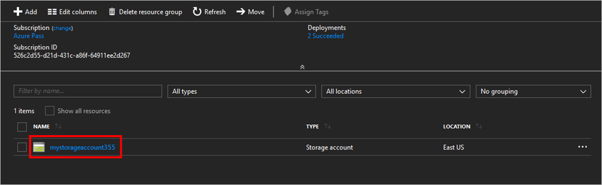

# Quickstart: Create and use an Azure file share
[Azure Files](storage-files-introduction.md) is Microsoft's easy-to-use cloud file system. You can mount Azure file shares in Windows, Linux, and macOS operating systems. This article shows you how to create an SMB Azure file share using either the Azure portal, Azure CLI, or Azure PowerShell.

## Applies to

This Quickstart only applies to SMB Azure file shares. Standard and premium SMB file shares support locally redundant storage (LRS) and zone-redundant storage (ZRS). Standard file shares also support geo-redundant storage (GRS) and geo-zone-redundant storage (GZRS) options. For more information, see [Azure Files redundancy](files-redundancy.md).

| File share type | SMB | NFS |
|-|:-:|:-:|
| Standard file shares (GPv2), LRS/ZRS |  |  |
| Standard file shares (GPv2), GRS/GZRS |  |  |
| Premium file shares (FileStorage), LRS/ZRS |  |  |

## Getting started

# [Portal](#tab/azure-portal)

If you don't have an Azure subscription, create a [free account](https://azure.microsoft.com/free/?WT.mc_id=A261C142F) before you begin.

# [PowerShell](#tab/azure-powershell)

If you don't have an Azure subscription, create a [free account](https://azure.microsoft.com/free/?WT.mc_id=A261C142F) before you begin.

[!INCLUDE [cloud-shell-try-it.md](../../../includes/cloud-shell-try-it.md)]

If you'd like to install and use PowerShell locally, you'll need the Azure PowerShell module Az version 7.0.0 or later. We recommend installing the latest available version. To find out which version of the Azure PowerShell module you're running, execute `Get-InstalledModule Az`. If you need to upgrade, see [Install Azure PowerShell module](/powershell/azure/install-azure-powershell). If you're running PowerShell locally, you also need to run `Login-AzAccount` to log in to your Azure account. To use multifactor authentication, you'll need to supply your Azure tenant ID, such as `Login-AzAccount -TenantId <TenantId>`.

# [Azure CLI](#tab/azure-cli)

[!INCLUDE [azure-cli-prepare-your-environment.md](~/articles/reusable-content/azure-cli/azure-cli-prepare-your-environment.md)]

- This article requires version 2.0.4 or later of the Azure CLI. If using Azure Cloud Shell, the latest version is already installed.

- By default, Azure CLI commands return JavaScript Object Notation (JSON), which is the standard way to send and receive messages from REST APIs. To facilitate working with JSON responses, some of the examples in this article use the *query* parameter on Azure CLI commands. This parameter uses the [JMESPath query language](http://jmespath.org/) to parse JSON. To learn more about how to use the results of Azure CLI commands by following the JMESPath query language, see the [JMESPath tutorial](http://jmespath.org/tutorial.html).

---

## Create a storage account

# [Portal](#tab/azure-portal)
[!INCLUDE [storage-files-create-storage-account-portal](../../../includes/storage-files-create-storage-account-portal.md)]


# [PowerShell](#tab/azure-powershell)


### PowerShell - Create a resource group
A resource group is a logical container into which Azure resources are deployed and managed. If you don't already have an Azure resource group, create a new one with the [New-AzResourceGroup](/powershell/module/az.resources/new-azresourcegroup) cmdlet. You need a resource group to create a storage account.

The following example creates a resource group named *myResourceGroup* in the West US 2 region:

```azurepowershell-interactive
$resourceGroupName = "myResourceGroup"
$region = "westus2"

New-AzResourceGroup `
    -Name $resourceGroupName `
    -Location $region | Out-Null
```

### PowerShell - Create a storage account

A storage account is a shared pool of storage you can use to deploy Azure file shares.

This example creates a storage account using the [New-AzStorageAccount](/powershell/module/az.storage/new-azstorageaccount) cmdlet. The storage account is named *mystorageaccount\<random number>* and a reference to that storage account is stored in the variable **$storageAcct**. Storage account names must be unique, so use `Get-Random` to append a random number to the name to make it unique. 

```azurepowershell-interactive 
$storageAccountName = "mystorageacct$(Get-Random)"

$storageAcct = New-AzStorageAccount `
    -ResourceGroupName $resourceGroupName `
    -Name $storageAccountName `
    -Location $region `
    -Kind StorageV2 `
    -SkuName Standard_LRS `
    -EnableLargeFileShare
```

# [Azure CLI](#tab/azure-cli)

### CLI - Create a resource group
A resource group is a logical container in which Azure resources are deployed and managed. If you don't already have an Azure resource group, you can use the [az group create](/cli/azure/group) command to create one. You need a resource group to create a storage account.

The following example creates a resource group named *myResourceGroup* in the *West US 2* location:

```azurecli-interactive 
export resourceGroupName="myResourceGroup"
region="westus2"

az group create \
    --name $resourceGroupName \
    --location $region \
    --output none
```

### CLI - Create a storage account
A storage account is a shared pool of storage in which you can deploy Azure file shares.

The following example creates a storage account using the [az storage account create](/cli/azure/storage/account) command. Storage account names must be unique, so use `$RANDOM` to append a random number to the name to make it unique.

```azurecli-interactive 
export storageAccountName="mystorageacct$RANDOM"

az storage account create \
    --resource-group $resourceGroupName \
    --name $storageAccountName \
    --location $region \
    --kind StorageV2 \
    --sku Standard_LRS \
    --enable-large-file-share \
    --output none
```


---


## Create an Azure file share


# [Portal](#tab/azure-portal)

To create an Azure file share:

1. Select the storage account from your dashboard.
1. On the storage account page, in the **Data storage** section, select **File shares**.
	
    

1. On the menu at the top of the **File shares** page, select **+ File share**. The **New file share** page drops down.
1. In **Name**, type *myshare*. File share names must be all lower-case letters, numbers, and single hyphens, and must begin and end with a lower-case letter or number. The name can't contain two consecutive hyphens. For details about naming file shares and files, see [Naming and Referencing Shares, Directories, Files, and Metadata](/rest/api/storageservices/Naming-and-Referencing-Shares--Directories--Files--and-Metadata).
1. Leave **Transaction optimized** selected for **Tier**.
1. Select the **Backup** tab. By default, [backup is enabled](../../backup/backup-azure-files.md) when you create an Azure file share using the Azure portal. If you want to disable backup for the file share, uncheck the **Enable backup** checkbox. If you want backup enabled, you can either leave the defaults or create a new Recovery Services Vault in the same region and subscription as the storage account. To create a new backup policy, select **Create a new policy**.

   :::image type="content" source="media/storage-how-to-use-files-portal/create-file-share-backup.png" alt-text="Screenshot showing how to enable or disable file share backup." border="true":::

1. Select **Review + create** and then **Create** to create the Azure file share.

# [PowerShell](#tab/azure-powershell)

Now that you've created a storage account, you can create your first Azure file share by using the [New-AzRmStorageShare](/powershell/module/az.storage/New-AzRmStorageShare) cmdlet. This example creates a share named **myshare** with a quota of 1024 GiB. The quota can be a maximum of 5 TiB, or 100 TiB with large file shares enabled on the storage account.

```azurepowershell-interactive
$shareName = "myshare"

New-AzRmStorageShare `
    -StorageAccount $storageAcct `
    -Name $shareName `
    -EnabledProtocol SMB `
    -QuotaGiB 1024 | Out-Null
```

# [Azure CLI](#tab/azure-cli)

Now that you've created a storage account, you can create your first Azure file share by using the [az storage share-rm create](/cli/azure/storage/share-rm#az-storage-share-rm-create) command. This example creates a share named **myshare**  with a quota of 1024 GiB. The quota can be a maximum of 5 TiB, or 100 TiB with large file shares enabled on the storage account.

```azurecli-interactive
shareName="myshare"

az storage share-rm create \
    --resource-group $resourceGroupName \
    --storage-account $storageAccountName \
    --name $shareName \
    --quota 1024 \
    --enabled-protocols SMB \
    --output none
```

---

#### Create a directory

# [Portal](#tab/azure-portal)

To create a new directory named *myDirectory* at the root of your Azure file share:

1. On the **File share settings** page, select the **myshare** file share. The page for your file share opens, indicating *no files found*.
1. On the menu at the top of the page, select **+ Add directory**. The **New directory** page drops down.
1. Type *myDirectory* and then select **OK**.

# [PowerShell](#tab/azure-powershell)

To create a new directory named **myDirectory** at the root of your Azure file share, use the [New-AzStorageDirectory](/powershell/module/az.storage/New-AzStorageDirectory) cmdlet.

```azurepowershell-interactive
New-AzStorageDirectory `
   -Context $storageAcct.Context `
   -ShareName $shareName `
   -Path "myDirectory"
```

# [Azure CLI](#tab/azure-cli)

To create a new directory named **myDirectory** at the root of your Azure file share, use the [`az storage directory create`](/cli/azure/storage/directory) command:

> [!NOTE]
> If you don't provide credentials with your commands, Azure CLI will query for your storage account key. You can also provide your storage account key with the command by using a variable such as `--account-key $storageAccountKey` or in plain text such as `--account-key "your-storage-account-key-here"`.

```azurecli-interactive
az storage directory create \
   --account-name $storageAccountName \
   --share-name $shareName \
   --name "myDirectory" \
   --output none
```

---


#### Upload a file 
# [Portal](#tab/azure-portal)


First, you need to create or select a file to upload. Do this by whatever means you see fit. When you've decided on the file you'd like to upload, follow these steps:

1. Select the **myDirectory** directory. The **myDirectory** panel opens.
1. In the menu at the top, select **Upload**. The **Upload files** panel opens.  
	
    :::image type="content" source="media/storage-how-to-use-files-portal/upload-file.png" alt-text="Screenshot showing the upload files panel in the Azure portal." border="true":::

1. Select the folder icon to open a window to browse your local files. 
1. Select a file and then select **Open**. 
1. In the **Upload files** page, verify the file name, and then select **Upload**.
1. When finished, the file should appear in the list on the **myDirectory** page.

# [PowerShell](#tab/azure-powershell)

To demonstrate how to upload a file using the [Set-AzStorageFileContent](/powershell/module/az.storage/Set-AzStorageFileContent) cmdlet, we first need to create a file inside your PowerShell Cloud Shell's scratch drive to upload. 

This example puts the current date and time into a new file on your scratch drive, then uploads the file to the file share.

```azurepowershell-interactive
# this expression will put the current date and time into a new file on your scratch drive
cd "~/CloudDrive/"
Get-Date | Out-File -FilePath "SampleUpload.txt" -Force

# this expression will upload that newly created file to your Azure file share
Set-AzStorageFileContent `
   -Context $storageAcct.Context `
   -ShareName $shareName `
   -Source "SampleUpload.txt" `
   -Path "myDirectory\SampleUpload.txt"
```   

If you're running PowerShell locally, substitute `~/CloudDrive/` with a path that exists on your machine.

After uploading the file, you can use the [Get-AzStorageFile](/powershell/module/Az.Storage/Get-AzStorageFile) cmdlet to check to make sure that the file was uploaded to your Azure file share. 

```azurepowershell-interactive
Get-AzStorageFile `
    -Context $storageAcct.Context `
    -ShareName $shareName `
    -Path "myDirectory\" | Get-AzStorageFile
```


# [Azure CLI](#tab/azure-cli)

To demonstrate how to upload a file by using the [`az storage file upload`](/cli/azure/storage/file) command, first create a file to upload on the Cloud Shell scratch drive. In the following example, you create and then upload the file:

```azurecli-interactive
cd ~/clouddrive/
date > SampleUpload.txt

az storage file upload \
    --account-name $storageAccountName \
    --share-name $shareName \
    --source "SampleUpload.txt" \
    --path "myDirectory/SampleUpload.txt"
```

If you're running Azure CLI locally, substitute `~/clouddrive` with a path that exists on your machine.

After you upload the file, you can use the [`az storage file list`](/cli/azure/storage/file) command to make sure that the file was uploaded to your Azure file share:

```azurecli-interactive
az storage file list \
    --account-name $storageAccountName \
    --share-name $shareName \
    --path "myDirectory" \
    --output table
```


---

#### Download a file
# [Portal](#tab/azure-portal)

You can download a copy of the file you uploaded by right-clicking on the file and selecting **Download**. The exact experience will depend on the operating system and browser you're using.


# [PowerShell](#tab/azure-powershell)

You can use the [Get-AzStorageFileContent](/powershell/module/az.storage/Get-AzStorageFilecontent) cmdlet to download a copy of the file you uploaded to the scratch drive of your Cloud Shell.

```azurepowershell-interactive
# Delete an existing file by the same name as SampleDownload.txt, if it exists because you've run this example before.
Remove-Item `
    -Path "SampleDownload.txt" `
    -Force `
    -ErrorAction SilentlyContinue

Get-AzStorageFileContent `
    -Context $storageAcct.Context `
    -ShareName $shareName `
    -Path "myDirectory\SampleUpload.txt" `
    -Destination "SampleDownload.txt"
```

After downloading the file, you can use the `Get-ChildItem` cmdlet to see that the file has been downloaded to your PowerShell Cloud Shell's scratch drive.

```azurepowershell-interactive
Get-ChildItem | Where-Object { $_.Name -eq "SampleDownload.txt" }
``` 

# [Azure CLI](#tab/azure-cli)

You can use the [`az storage file download`](/cli/azure/storage/file) command to download a copy of the file that you uploaded to the Cloud Shell scratch drive:

```azurecli-interactive
# Delete an existing file by the same name as SampleDownload.txt, if it exists, because you've run this example before
rm -f SampleDownload.txt

az storage file download \
    --account-name $storageAccountName \
    --share-name $shareName \
    --path "myDirectory/SampleUpload.txt" \
    --dest "./SampleDownload.txt" \
    --output none
```

---

## Clean up resources
# [Portal](#tab/azure-portal)

[!INCLUDE [storage-files-clean-up-portal](../../../includes/storage-files-clean-up-portal.md)]

# [PowerShell](#tab/azure-powershell)

When you're done, you can use the [Remove-AzResourceGroup](/powershell/module/az.resources/remove-azresourcegroup) cmdlet to delete the resource group and all resources contained in the resource group. 

```azurepowershell-interactive
Remove-AzResourceGroup -Name myResourceGroup
```

# [Azure CLI](#tab/azure-cli)

When you're done, you can use the [`az group delete`](/cli/azure/group) command to delete the resource group and all resources contained in the resource group: 

```azurecli-interactive 
az group delete --name $resourceGroupName
```


---

## Next steps

> [!div class="nextstepaction"]
> [What is Azure Files?](storage-files-introduction.md)
