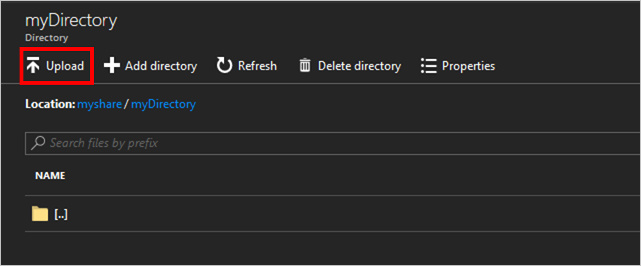
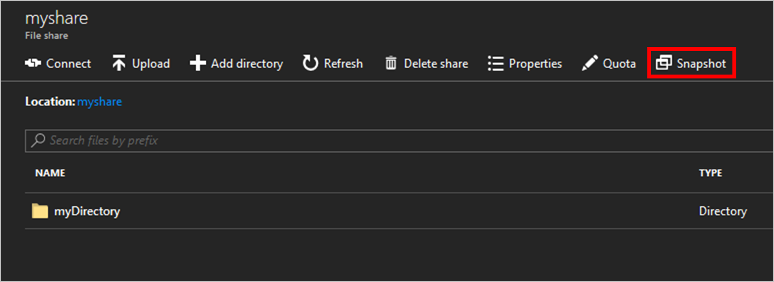
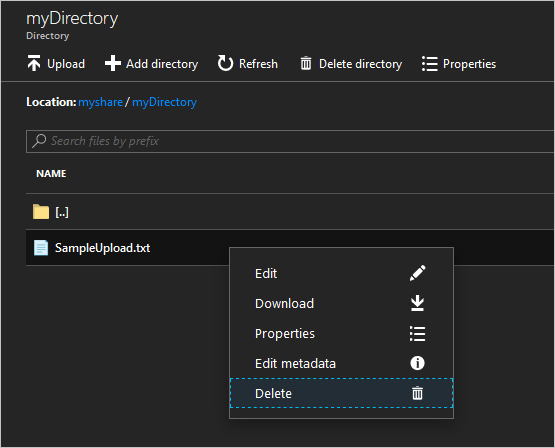
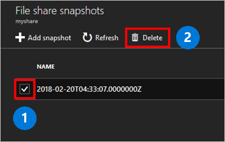

# Managing Azure file shares with the Azure portal 
[Azure Files](storage-files-introduction.md) is Microsoft's easy-to-use cloud file system. Azure file shares can be mounted in Windows, Linux, and macOS. This guide walks you through the basics of working with Azure file shares using the [Azure portal](https://portal.azure.com/). Learn how to:

> [!div class="checklist"]
> * Create a resource group and a storage account
> * Create an Azure file share 
> * Create a directory
> * Upload a file 
> * Download a file
> * Create and use a share snapshot

If you don't have an Azure subscription, you can create a [free account](https://azure.microsoft.com/free/?WT.mc_id=A261C142F) before you begin.

## Create a storage account
[!INCLUDE [storage-files-create-storage-account-portal](../../../includes/storage-files-create-storage-account-portal.md)]

## Create a file share
To create a file share:

1. Select the storage account from your dashboard.
2. On the storage account page, in the **Services** section, select **Files**.
	

3. On the menu at the top of the **File service** page, click **+ File share**. The **New file share** page drops down.
4. In **Name** type *myshare*.
5. Click **OK** to create the Azure file share.

## Work with the contents of the Azure file share
Now that you have created an Azure file share, you can mount the file share with SMB on [Windows](storage-how-to-use-files-windows.md), [Linux](storage-how-to-use-files-linux.md), or [macOS](storage-how-to-use-files-mac.md). Alternatively, you can work with your Azure file share with the Azure portal. All requests made via the Azure portal are made with the File REST API enabling you to create, modify, and delete files and directories on clients without SMB access.

### Create a directory
To create a new directory named *myDirectory* at the root of your Azure file share:

1. On the **File Service** page, select the **myshare** file share. The page for your file share opens.
2. On the menu at the top of the page, select **+ Add directory**. The **New directory** page drops down.
3. Type *myDirectory* and then click **OK**.

### Upload a file 
To demonstrate uploading a file, you first need to create or select a file to be uploaded. You may do this by whatever means you see fit. Once you've selected the file you would like to upload:

1. Click on the **myDirectory** directory. The **myDirectory** panel opens.
2. In the menu at the top, click **Upload**. The **Upload files** panel opens.  
	

3. Click on the folder icon to open a window to browse your local files. 
4. Select a file and then click **Open**. 
5. In the **Upload files** page, verify the file name and then click **Upload**.
6. When finished, the file should appear in the list on the **myDirectory** page.

### Download a file
You can download a copy of the file you uploaded by right clicking on the file. After clicking the download button, the exact experience will depend on the operating system and browser you're using.

## Create and modify share snapshots
One additional useful task you can do with an Azure file share is to create share snapshots. A snapshot preserves a point-in-time for an Azure file share. Share snapshots are similar to operating system technologies you may already be familiar with such as:
- [Volume Shadow Copy Service (VSS)](https://docs.microsoft.com/windows/desktop/VSS/volume-shadow-copy-service-portal) for Windows file systems such as NTFS and ReFS
- [Logical Volume Manager (LVM)](https://en.wikipedia.org/wiki/Logical_Volume_Manager_(Linux)#Basic_functionality) snapshots for Linux systems
- [Apple File System (APFS)](https://developer.apple.com/library/content/documentation/FileManagement/Conceptual/APFS_Guide/Features/Features.html) snapshots for macOS. 

To create a share snapshot:

1. Open the page for the file share by opening the storage account from your dashboard > **Files** > **myshare**. 
2. On the page for the file share, click the **Snapshot** button on menu at the top of the page and then select **Create a snapshot**.  
	

### List and browse share snapshots
Once the snapshot is created, you can click **Snapshot** again and then select **View snapshots** to list the snapshots for the share. The resulting pane will show the snapshots for this share. Click on a share snapshot to browse it.

### Restore from a share snapshot
To demonstrate the restore of a file from a share snapshot, we first need to delete a file from the live Azure file share. Navigate into the *myDirectory* folder, right-click on the file you uploaded, and then click **Delete**. Then, to restore that file from the share snapshot:

1. Click on **Snapshots** in the top menu and select **View snapshots**. 
2. Click on the snapshot that you created earlier and it will open the contents in a new page. 
3. Click on **myDirectory** in the snapshot and you should see the file that you deleted. 
4. Right-click on the deleted file and select **Restore**.
5. A pop-up will appear giving you a choice between restoring the file as a copy or overwriting the original file. Since we have deleted the original file, we can select **Overwrite original file** to restore the file as it was before we deleted it. Click **OK** to restore the file to the Azure file share.  
	

6. Once the file is done being restored, close the page for the snapshot and go back to **myshare** > **myDirectory** and the file should be back in its original place.

### Delete a share snapshot
To delete a share snapshot, [navigate to the list of share snapshots](#list-and-browse-a-share-snapshot). Click the checkbox next to the name of the share snapshot, and select the **Delete** button.

## Clean up resources
[!INCLUDE [storage-files-clean-up-portal](../../../includes/storage-files-clean-up-portal.md)]

## Next steps
- [Managing file shares with the Azure PowerShell](storage-how-to-use-files-powershell.md)
- [Managing file shares with Azure CLI](storage-how-to-use-files-cli.md)
- [Managing file shares with Azure Storage Explorer](storage-how-to-use-files-storage-explorer.md)
- [Planning for an Azure Files deployment](storage-files-planning.md)