# Work with share snapshots (preview)
A share snapshot (preview) is a read-only version of an Azure Files share that's taken at a point in time. After a share snapshot is created, it can be read, copied, or deleted, but not modified. A share snapshot provides a way to back up the share as it appears at a moment in time. 

In this article, you'll learn how to create, manage, and delete share snapshots. For more information, see the [share snapshot overview](storage-snapshots-files.md) or the [snapshot FAQ](storage-files-faq.md).

## Create a share snapshot

You can create a share snapshot by using the Azure portal, PowerShell, Azure CLI, the REST API, or any Azure Storage SDK. The following sections describe how to create a share snapshot by using the portal, CLI, and PowerShell. 

You can take a share snapshot of a file share while it is in use. However, share snapshots capture only data that has already been written to a file share at the time that the share snapshot command is issued. This might exclude any data that has been cached by any applications or the operating system.

### Create a share snapshot by using the portal  
To create a point-in-time share snapshot, go to your file share in the portal and select **Create a snapshot**.

>   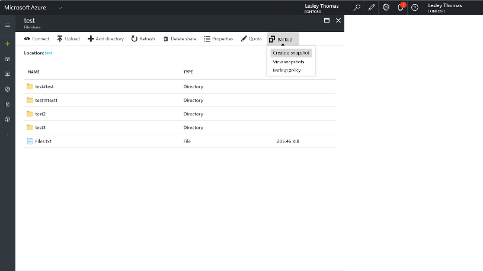


### Create a share snapshot by using Azure CLI 2.0
You can create a share snapshot by using the `az storage share snapshot` command:

```azurecli-interactive
az storage share snapshot -n <share name>
```

Example output:
```json
{
  "metadata": {},
  "name": "<share name>",
  "properties": {
    "etag": "\"0x8D50B7F9A8D7F30\"",
    "lastModified": "2017-10-04T23:28:22+00:00",
    "quota": null
  },
  "snapshot": "2017-10-04T23:28:35.0000000Z"
}
```

### Create a share snapshot by using PowerShell
You can create a share snapshot by using the `$share.Snapshot()` command:

```powershell
$connectionstring="DefaultEndpointsProtocol=http;FileEndpoint=http:<Storage Account Name>.file.core.windows.net /;AccountName=:<Storage Account Name>;AccountKey=:<Storage Account Key>"
$sharename=":<file share name>"

$ctx = New-AzureStorageContext -ConnectionString $connectionstring

##create snapshot
$share=Get-AzureStorageShare -Context $ctx -Name <file share name>
$share.Properties.LastModified
$share.IsSnapshot
$snapshot=$share.Snapshot()

```

## Perform common share snapshot operations

You can enumerate the share snapshots associated with your file share by using the **Previous Versions** tab in Windows, through REST, the client library, PowerShell, and the portal. After the file share is mounted, you can view all the previous versions of the file by using the **Previous Versions** tab in Windows. 

The following sections describe how to use the Azure portal, Windows, and Azure CLI 2.0 to list, browse to, and restore share snapshots.

### Share snapshot operations in the portal

You can look at all your share snapshots for a file share in the portal and browse to a share snapshot to view its content.

#### View a share snapshot
On your file share, under **Snapshot**, select **View snapshots**.

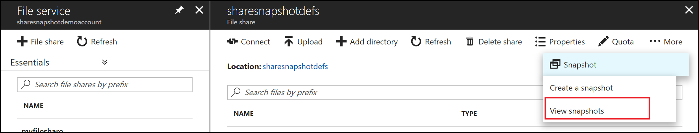

#### List and browse to share snapshot content
View the list of share snapshots and then browse to the content of one snapshot directly by selecting the desired time stamp.

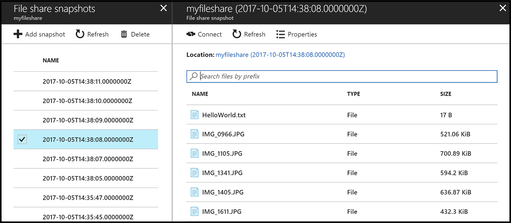

You can also select the **Connect** button on your list snapshot view to get the `net use` command and the directory path to a particular share snapshot. You can then directly browse to that snapshot.


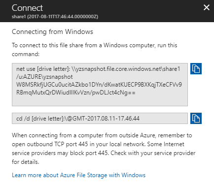

#### Download or restore from a share snapshot
From the portal, download or restore a file from a snapshot by using the **Download** or **Restore** button, respectively.

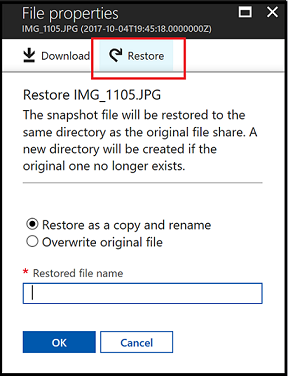

### Share snapshot operations in Windows
When you have already taken share snapshots of your file share, you can view previous versions of a share, a directory, or a particular file from your mounted file share on Windows. As an example, here is how you can use the Previous Versions feature to view and restore a previous version of a directory in Windows.

> [!Note]  
> You can perform the same operations on the share level and the file level. Only the version that contains changes for that directory or file is shown in the list. If a particular directory or file has not changed between two share snapshots, the share snapshot appears in the share-level previous version list but not in the directory's or file's previous version list.

#### Mount a file share
First, mount the file share by using the `net use` command.

#### Open a mounted share in File Explorer
Go to File Explorer and find the mounted share.

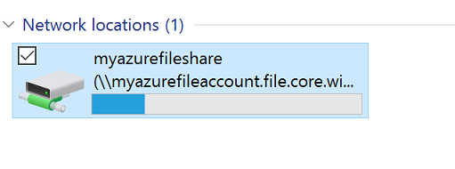

#### List previous versions
Browse to the item or parent item that needs to be restored. Double-click to go to the desired directory. Right-click and select **Properties** from the menu.

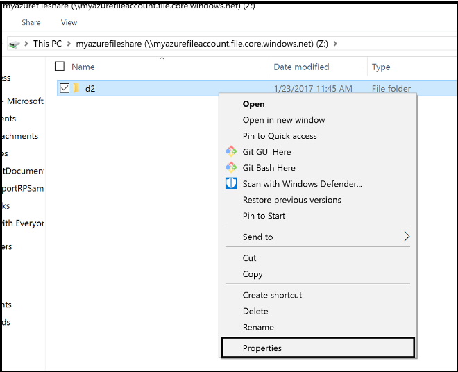

Select **Previous Versions** to see the list of share snapshots for this directory. The list might take a few seconds to load, depending on the network speed and the number of share snapshots in the directory.

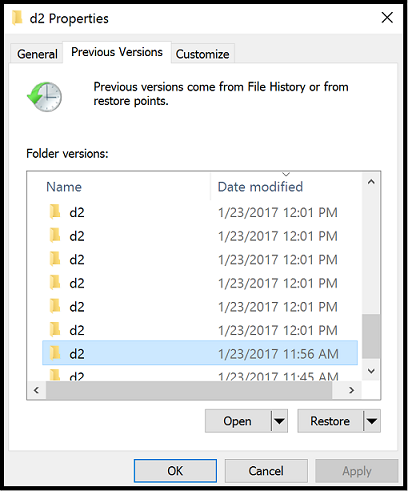

You can select **Open** to open a particular snapshot. 

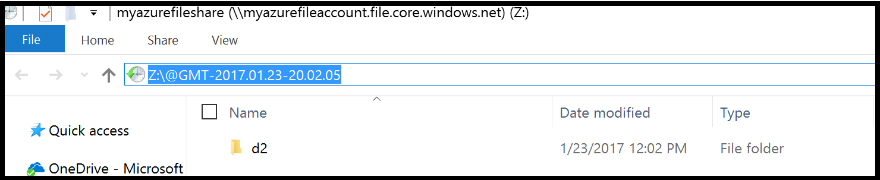

#### Restore from a previous version
Select **Restore** to copy the contents of the entire directory recursively at the share snapshot creation time to the original location.
 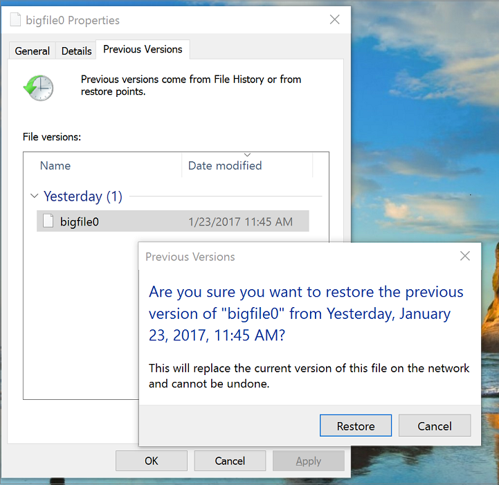

### Share snapshot operations in Azure CLI 2.0
You can use Azure CLI 2.0 to perform operations such as listing share snapshots, browsing to share snapshot content, restoring or downloading files from share snapshots, or deleting share snapshots.

#### List share snapshots

You can list snapshots of a particular share by using [`az storage share list`](/cli/azure/storage/share?view=azure-cli-latest#az_storage_share_list) with `--include-snapshots`:

```azurecli-interactive 
az storage share list --include-snapshots
```

The command gives you a list of share snapshots, along with all its associated properties. The following output is an example:

```json
[
  {
    "metadata": null,
    "name": "sharesnapshotdefs",
    "properties": {
      "etag": "\"0x8D50B5F4005C975\"",
      "lastModified": "2017-10-04T19:36:46+00:00",
      "quota": 5120
    },
    "snapshot": "2017-10-04T19:44:13.0000000Z"
  },
  {
    "metadata": null,
    "name": "sharesnapshotdefs",
    "properties": {
      "etag": "\"0x8D50B5F4005C975\"",
      "lastModified": "2017-10-04T19:36:46+00:00",
      "quota": 5120
    },
    "snapshot": "2017-10-04T19:45:18.0000000Z"
  },
  {
    "metadata": null,
    "name": "sharesnapshotdefs",
    "properties": {
      "etag": "\"0x8D50B5F4005C975\"",
      "lastModified": "2017-10-04T19:36:46+00:00",
      "quota": 5120
    },
    "snapshot": null
  }
]
```

#### Browse to a share snapshot
You can browse to a particular share snapshot and view its content by using [`az storage file list`](/cli/azure/storage/share?view=azure-cli-latest#az_storage_share_list). Specify the share name and the time stamp that you want to browse to, as shown in the following example:

```azurecli-interactive 
az storage file list --share-name sharesnapshotdefs --snapshot '2017-10-04T19:45:18.0000000Z' -otable
```

In the output, you see that the content of the share snapshot is identical to the content of the share at the point in time that share snapshot was created:

```
Name            Content Length    Type    Last Modified
--------------  ----------------  ------  ---------------
HelloWorldDir/                    dir
IMG_0966.JPG    533568            file
IMG_1105.JPG    717711            file
IMG_1341.JPG    608459            file
IMG_1405.JPG    652156            file
IMG_1611.JPG    442671            file
IMG_1634.JPG    1495999           file
IMG_1635.JPG    974058            file

```
#### Restore from a share snapshot

You can restore a file by copying or downloading it from the share snapshot. Use the `az storage file download` command, as shown in the following example:

```azurecli-interactive 
az storage file download --path IMG_0966.JPG --share-name sharesnapshotdefs --snapshot '2017-10-04T19:45:18.0000000Z'
```

In the output, you see that the contents of the downloaded file and its properties are identical to the content and properties at the point in time that share snapshot was created:

```json
{
  "content": null,
  "metadata": {},
  "name": "IMG_0966.JPG",
  "properties": {
    "contentLength": 533568,
    "contentRange": "bytes 0-533567/533568",
    "contentSettings": {
      "cacheControl": null,
      "contentDisposition": null,
      "contentEncoding": null,
      "contentLanguage": null,
      "contentType": "application/octet-stream"
    },
    "copy": {
      "completionTime": null,
      "id": null,
      "progress": null,
      "source": null,
      "status": null,
      "statusDescription": null
    },
    "etag": "\"0x8D50B5F49F7ACDF\"",
    "lastModified": "2017-10-04T19:37:03+00:00",
    "serverEncrypted": true
  }
}
```

## Delete a share snapshot

You can delete share snapshots by using the Azure portal, PowerShell, CLI, the REST API, or any Storage SDK. The following sections describe how to delete share snapshots by using the Azure portal, CLI, and PowerShell.

You can browse to share snapshots and view differences between two snapshots by using any comparison tool. You can then determine which share snapshot you want to delete. 

You cannot delete a share that has a share snapshot. To be able to delete the share, you must first delete all its share snapshots.

### Delete a share snapshot by using the portal  
In the portal, you can go to your file share blade and use the **Delete** button to delete one or more share snapshots.

>   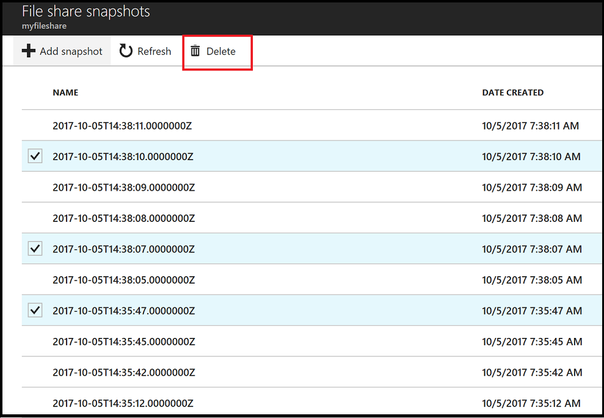


### Delete a share snapshot by using Azure CLI 2.0
You can delete a share snapshot by using the `[az storage share delete]` command. Use your share snapshot time stamp for the `--snapshot '2017-10-04T23:28:35.0000000Z' ` parameter in the following example:

```azurecli-interactive
az storage share delete -n <share name> --snapshot '2017-10-04T23:28:35.0000000Z' 
```

Example output:
```json
{
  "deleted": true
}
```

### Delete a share snapshot by using PowerShell
You can delete a share snapshot by using the `Remove-AzureStorageShare -Share` command:

```powershell
$connectionstring="DefaultEndpointsProtocol=http;FileEndpoint=http:<Storage Account Name>.file.core.windows.net /;AccountName=:<Storage Account Name>;AccountKey=:<Storage Account Key>"
$sharename=":<file share name>"

$ctx = New-AzureStorageContext -ConnectionString $connectionstring

##Create snapshot
$share=Get-AzureStorageShare -Context $ctx -Name <file share name>
$share.Properties.LastModified
$share.IsSnapshot
$snapshot=$share.Snapshot()

##Delete snapshot
Remove-AzureStorageShare -Share $snapshot

```

## Next steps
* [Snapshot overview](storage-snapshots-files.md)
* [Snapshot FAQ](storage-files-faq.md)
