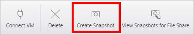
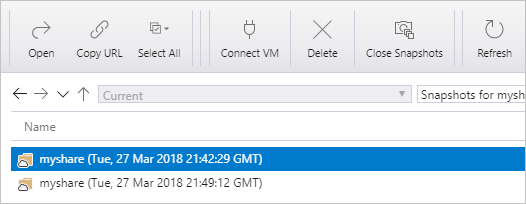

# Managing Azure file shares with Azure Storage Explorer 
[Azure Files](storage-files-introduction.md) is Microsoft's easy-to-use cloud file system. This guide walks you through the basics of working with Azure file shares using [Azure Storage Explorer](https://azure.microsoft.com/features/storage-explorer/). Azure Storage Explorer is a popular client tool available for Windows, macOS, and Linux for managing Azure file shares and other storage resources.

This quickstart requires the Azure Storage Explorer to be installed. If you need to install it, visit [Azure Storage Explorer](https://azure.microsoft.com/features/storage-explorer/) to download it.

In this article you learn how to:

> [!div class="checklist"]
> * Create a resource group and a storage account
> * Create an Azure file share 
> * Create a directory
> * Upload a file
> * Download a file
> * Create and use a share snapshot

If you don't have an Azure subscription, you can create a [free account](https://azure.microsoft.com/free/?WT.mc_id=A261C142F) before you begin.

## Create a storage account
The Azure Storage Explorer doesn't have the ability to create new resources, so for the purposes of this demo, create the storage account with the [Azure portal](https://portal.azure.com/). 

[!INCLUDE [storage-files-create-storage-account-portal](../../../includes/storage-files-create-storage-account-portal.md)]

## Connecting Azure Storage Explorer to Azure resources
On first launch, the **Microsoft Azure Storage Explorer - Connect** window is shown. Azure Storage Explorer provides several ways to connect to storage accounts: 

- **Login through your Azure account**: Enables you to login with your user credentials for your organization or your Microsoft account. 
- **Connect to a specific storage account with a connection string or SAS token**: A connection string is special string containing storage account name and storage account key/SAS token that enables Azure Storage Explorer to directly access the storage account (rather than simply seeing all of the storage accounts within an Azure account). To learn more about connection strings, see [Configure Azure storage connection strings](../common/storage-configure-connection-string.md?toc=%2fazure%2fstorage%2ffiles%2ftoc.json).
- **Connect to a specific storage account with a storage account name and key**: Use the storage account name and key of your storage account to connect to Azure storage.

For the purposes of this quickstart, login with your Azure account. Select **Add an Azure Account** and click **Sign in**. Follow the on-screen prompts to sign into your Azure account.

### Create a file share
To create your first Azure file share within the *storageacct<random number>*  storage account:

1. Expand the storage account you created.
2. Right-click on **File Shares** and select **Create File Share**.  
    

3. Type *myshare* for the file share and hit **Enter**.

> [!Important]  
> Share names need to be all lower case letters, numbers, and single hyphens but cannot start with a hyphen. For complete details about naming file shares and files, see [Naming and Referencing Shares, Directories, Files, and Metadata](https://docs.microsoft.com/rest/api/storageservices/Naming-and-Referencing-Shares--Directories--Files--and-Metadata).

Once the file share has been created, the right pane will open a tab for your file share. 

## Manipulating the contents of the Azure file share
Now that you have created an Azure file share, you can mount the file share with SMB on [Windows](storage-how-to-use-files-windows.md), [Linux](storage-how-to-use-files-linux.md), or [macOS](storage-how-to-use-files-mac.md). Alternatively, you can manipulate your Azure file share with the Azure portal. All requests made via the Azure portal are made with the File REST API enabling you to create, modify, and delete files and directories on clients without SMB access.

### Create a directory
Adding a directory provides a hierarchical structure for managing your file share. You can create multiple levels, but you must ensure that all parent directories exist before creating a subdirectory. For example, for path myDirectory/mySubDirectory, you must first create directory *myDirectory*, then create *mySubDirectory*. 

1. On the tab for the file share, on the top menu, click the **+ New Folder** button. The **Create New Directory** page will open.
    

2. Type *myDirectory* as the name and then click **OK**. 

The *myDirectory* directory will be listed on the tab for the *myshare* file share.

### Upload a file 
Upload a file from your local machine to the new directory in your file share. You can upload an entire folder or just a single file.

1. In the menu at the top, select **Upload**. This gives you the option to upload a folder or a file.

2. Select **Upload File** and then choose a file from your local machine to upload.

3. In **Upload to a directory** type *myDirectory* and then click **Upload**. 

When finished, the file should appear in the list on the **myDirectory** page.

### Download a file
You can download a copy of a file in your file share by right-clicking on the file and selecting **Download**. Choose where you want to put the file on your local machine and then click **Save**.

You will see the progress of the download in the **Activities** pane at the bottom of the window.

## Create and modify share snapshots
A snapshot preserves a point-in-time copy of an Azure file share. File share snapshots are similar to other technologies you may already be familiar with like:
- [Volume Shadow Copy Service (VSS)](https://docs.microsoft.com/previous-versions/windows/it-pro/windows-server-2008-R2-and-2008/ee923636) for Windows file systems such as NTFS and ReFS.
- [Logical Volume Manager (LVM)](https://en.wikipedia.org/wiki/Logical_Volume_Manager_(Linux)#Basic_functionality) snapshots for Linux systems
- [Apple File System (APFS)](https://developer.apple.com/library/content/documentation/FileManagement/Conceptual/APFS_Guide/Features/Features.html) snapshots for macOS. 

To create a share snapshot:

1. Open the tab for the *myshare* file share.
2. In the menu at the top of the tab, click **Create Snapshot** (this might be hidden behind a **... More** depending on the window dimensions of Azure Storage Explorer).  
    

### List and browse share snapshots
Once the snapshot is created, you can click **View Snapshots for File Share** (this might be hidden behind a **... More** depending on the window dimensions of Azure Storage Explorer) to list the snapshots for the share. Double-click on a share snapshot to browse it.

### Restore from a share snapshot
To demonstrate the restore of a file from a share snapshot, we first need to delete a file from the live Azure file share. Navigate into the *myDirectory* folder, right-click on the file you uploaded, and then click **Delete**. Then, to restore that file from the share snapshot:

1. Click on the **View Snapshots for File Share** (this might be hidden behind a **... More** depending on the window dimensions of Azure Storage Explorer).
2. Select a share snapshot from the list and double-click to navigate.
3. Navigate through the snapshot until you find the file you deleted, select it, then click  **Restore Snapshot** (this might be hidden behind a **... More** depending on the window dimensions of Azure Storage Explorer). You will get a warning that restoring the file will overwrite the contents of the file share and it cannot be undone. Select **OK**.
4. The file should now be in it's original place under the live Azure file share.

### Delete a share snapshot
To delete a share snapshot, [navigate to the list of share snapshots](#list-and-browse-share-snapshots). Right click on the share snapshot you would like to delete, and select delete.

## Clean up resources
The Azure Storage Explorer doesn't have the ability to remove resources; you can clean up from this quickstart with the [Azure portal](https://portal.azure.com/). 

[!INCLUDE [storage-files-clean-up-portal](../../../includes/storage-files-clean-up-portal.md)]

## Next steps
- [Managing file shares with the Azure portal](storage-how-to-use-files-portal.md)
- [Managing file shares with Azure PowerShell](storage-how-to-use-files-powershell.md)
- [Managing file shares with the Azure CLI](storage-how-to-use-files-cli.md)
- [Planning for an Azure Files deployment](storage-files-planning.md)