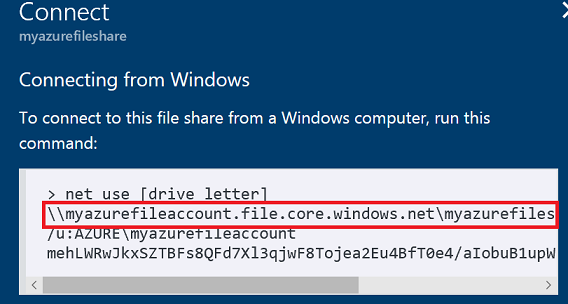

# Mount an Azure File share and access the share in Windows
[Azure Files](storage-files-introduction.md) is Microsoft's easy to use cloud file system. Azure File shares can be mounted in Windows and Windows Server. This article shows three different ways to mount an Azure File share on Windows: with the File Explorer UI, via PowerShell, and via the Command Prompt. 

In order to mount an Azure File share outside of the Azure region it is hosted in, such as on-premises or in a different Azure region, the OS must support SMB 3.0. 

You can mount Azure File shares on a Windows installation that is running either in an Azure VM or on-premises. The table below illustrates which OS versions support mounting file shares in which environment:

| Windows Version        | SMB Version | Mountable in Azure VM | Mountable On-Premises |
|------------------------|-------------|-----------------------|----------------------|
| Windows 10<sup>1</sup>  | SMB 3.0 | Yes | Yes |
| Windows Server 2016    | SMB 3.0     | Yes                   | Yes                  |
| Windows 8.1            | SMB 3.0     | Yes                   | Yes                  |
| Windows Server 2012 R2 | SMB 3.0     | Yes                   | Yes                  |
| Windows Server 2012    | SMB 3.0     | Yes                   | Yes                  |
| Windows 7              | SMB 2.1     | Yes                   | No                   |
| Windows Server 2008 R2 | SMB 2.1     | Yes                   | No                   |

<sup>1</sup>Windows 10 versions 1507, 1511, 1607, 1703, and 1709.

> [!Note]  
> We always recommend taking the most recent KB for your version of Windows.

## </a>Prerequisites for Mounting Azure File Share with Windows 
* **Storage Account Name**: To mount an Azure File share, you will need the name of the storage account.

* **Storage Account Key**: To mount an Azure File share, you will need the primary (or secondary) storage key. SAS keys are not currently supported for mounting.

* **Ensure port 445 is open**: Azure Files uses SMB protocol. SMB communicates over TCP port 445 - check to see if your firewall is not blocking TCP ports 445 from client machine.

## Mount the Azure File share with File Explorer
> [!Note]  
> Note that the following instructions are shown on Windows 10 and may differ slightly on older releases. 

1. **Open File Explorer**: This can be done by opening from the Start Menu, or by pressing Win+E shortcut.

2. **Navigate to the "This PC" item on the left-hand side of the window. This will change the menus available in the ribbon. Under the Computer menu, select "Map Network Drive"**.
    
    

3. **Copy the UNC path from the "Connect" pane in the Azure portal**: A detailed description of how to find this information can be found [here](storage-how-to-use-files-portal.md#connect-to-file-share).

    

4. **Select the Drive letter and enter the UNC path.** 
    
    

5. **Use the Storage Account Name prepended with `Azure\` as the username and a Storage Account Key as the password.**
    
    

6. **Use Azure File share as desired**.
    
    

7. **When you are ready to dismount (or disconnect) the Azure File share, you can do so by right clicking on the entry for the share under the "Network locations" in File Explorer and selecting "Disconnect"**.

## Mount the Azure File share with PowerShell
1. **Use the following command to mount the Azure File share**: Remember to replace `<storage-account-name>`, `<share-name>`, `<storage-account-key>`, `<desired-drive-letter>` with the proper information.

    ```PowerShell
    $acctKey = ConvertTo-SecureString -String "<storage-account-key>" -AsPlainText -Force
    $credential = New-Object System.Management.Automation.PSCredential -ArgumentList "Azure\<storage-account-name>", $acctKey
    New-PSDrive -Name <desired-drive-letter> -PSProvider FileSystem -Root "\\<storage-account-name>.file.core.windows.net\<share-name>" -Credential $credential
    ```

2. **Use the Azure File share as desired**.

3. **When you are finished, dismount the Azure File share using the following command**.

    ```PowerShell
    Remove-PSDrive -Name <desired-drive-letter>
    ```

> [!Note]  
> You may use the `-Persist` parameter on `New-PSDrive` to make the Azure File share visible to the rest of the OS while mounted.

## Mount the Azure File share with Command Prompt
1. **Use the following command to mount the Azure File share**: Remember to replace `<storage-account-name>`, `<share-name>`, `<storage-account-key>`, `<desired-drive-letter>` with the proper information.

    ```
    net use <desired-drive-letter>: \\<storage-account-name>.file.core.windows.net\<share-name> <storage-account-key> /user:Azure\<storage-account-name>
    ```

2. **Use the Azure File share as desired**.

3. **When you are finished, dismount the Azure File share using the following command**.

    ```
    net use <desired-drive-letter>: /delete
    ```

> [!Note]  
> You can configure the Azure File share to automatically reconnect on reboot by persisting the credentials in Windows. The following command will persist the credentials:
>   ```
>   cmdkey /add:<storage-account-name>.file.core.windows.net /user:AZURE\<storage-account-name> /pass:<storage-account-key>
>   ```

## Next steps
See these links for more information about Azure Files.

* [FAQ](../storage-files-faq.md)
* [Troubleshooting on Windows](storage-troubleshoot-windows-file-connection-problems.md)      

### Conceptual articles and videos
* [Azure Files: a frictionless cloud SMB file system for Windows and Linux](https://azure.microsoft.com/documentation/videos/azurecon-2015-azure-files-storage-a-frictionless-cloud-smb-file-system-for-windows-and-linux/)
* [How to use Azure Files with Linux](../storage-how-to-use-files-linux.md)

### Tooling support for Azure Files
* [How to use AzCopy with Microsoft Azure Storage](../common/storage-use-azcopy.md?toc=%2fazure%2fstorage%2ffiles%2ftoc.json)
* [Using the Azure CLI with Azure Storage](../common/storage-azure-cli.md?toc=%2fazure%2fstorage%2ffiles%2ftoc.json#create-and-manage-file-shares)
* [Troubleshooting Azure Files problems - Windows](storage-troubleshoot-windows-file-connection-problems.md)
* [Troubleshooting Azure Files problems - Linux](storage-troubleshoot-linux-file-connection-problems.md)

### Blog posts
* [Azure Files is now generally available](https://azure.microsoft.com/blog/azure-file-storage-now-generally-available/)
* [Inside Azure Files](https://azure.microsoft.com/blog/inside-azure-file-storage/)
* [Introducing Microsoft Azure File Service](http://blogs.msdn.com/b/windowsazurestorage/archive/2014/05/12/introducing-microsoft-azure-file-service.aspx)
* [Migrating data to Azure File ](https://azure.microsoft.com/blog/migrating-data-to-microsoft-azure-files/)

### Reference
* [Storage Client Library for .NET reference](https://msdn.microsoft.com/library/azure/dn261237.aspx)
* [File Service REST API reference](http://msdn.microsoft.com/library/azure/dn167006.aspx)
