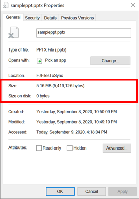
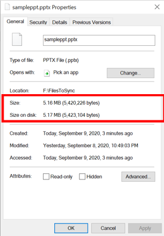

# Cloud tiering overview
Azure File Sync (AFS) keeps your server location in sync with your Azure file share. Both locations are constantly syncing and eventually have the same set of files present.

Cloud tiering, an optional feature of Azure File Sync, decreases the amount of on-premises storage you require by storing only frequently accessed (hot) files on your local server - infrequently accessed (cool) files are split into namespace (file and folder structure) and file content, with the namespace stored locally and the file content stored in an Azure file share in the cloud. 

When a user opens a tiered file, Azure File Sync seamlessly recalls the file data from the file share in Azure without the user needing to know that the file content is stored in Azure.

> [!IMPORTANT]
> Cloud tiering is not supported on the Windows system volume.
    

## What is cloud tiering?

Cloud tiering is the separation between namespace and file content.

Size represents the logical size of the file. Size on disk represents the physical size of the file stream that's stored on the disk.

:::row:::
    :::column:::
         
    :::column-end:::
    :::column:::
        For tiered files, the size on disk is zero since the file content itself isn't being stored locally. When a file is tiered, the Azure File Sync file system filter (StorageSync.sys) replaces the file locally with a pointer (reparse point). The reparse point represents a URL to the file in the Azure file share stored in the cloud. A tiered file has both the "offline" attribute and the FILE_ATTRIBUTE_RECALL_ON_DATA_ACCESS attribute set in NTFS so that third-party applications can securely identify tiered files.      
    :::column-end:::
:::row-end::: 

:::row:::
    :::column:::
         
    :::column-end:::
    :::column:::
        On the other hand, for a file stored in an on-premises file server, the size on disk is about equal to the logical size of the file since the entire file (namespace + file content) is stored locally.       
    :::column-end:::
:::row-end:::

> [!NOTE]
> It's also possible for a file to be partially tiered (or partially recalled). In a partially tiered file, part of the file is on disk. This might occur when files are partially read by applications like multimedia players or zip utilities.

## Cloud tiering policy

The Azure File Sync system filter builds a "heatmap" of your namespace on each server endpoint. The cloud tiering heatmap is essentially an ordered list of all the files that are syncing and are in a location that has cloud tiering enabled. It monitors accesses (read and write operations) over time and based on both the frequency and recency of access, assigns a heat score to every file. A frequently accessed file that was recently opened will be considered hot, while a file that is barely touched and hasn't been accessed for some time will be considered cool. 

When you enable cloud tiering, there are two policies that you can set to inform the Azure File Sync system filter when to tier cool files back to the cloud: the volume free space policy and the date policy. 

The **volume free space policy** tells the system filter to tier cool files to the cloud when a certain amount of space is taken up on your local disk. 

For example, if your local disk capacity is 200 GB and you always want at least 40 GB of your local disk capacity to remain free, you should set the volume free space policy to 20%. In this case, up to 80% of the volume space will be occupied by the most recently accessed files, with any remaining files that don't fit into this space tiered up to Azure. Volume free space applies at the volume level rather than at the level of individual directories or sync groups. 

To check out how the volume free space policy affects files when they're initially downloaded when adding a new server endpoint, see the Sync Policies that Affect Cloud Tiering section below (see [Sync policies that affect cloud tiering](#sync-policies-that-affect-cloud-tiering)).

With the **date policy**, cool files are tiered to the cloud if they haven't been accessed (that is, read or written to) for x number of days. For example, if you noticed that files that have gone more than 15 days without being accessed are typically archival files, you should set your date policy to 15 days. 

For more examples on how the date policy and volume free space policy work together, see [Choosing a cloud tiering policy](storage-sync-choosing-cloud-tiering-policy.md).

> [!Note]
> To determine the relative position of an individual file in that heatmap, the system uses the maximum of either of the following timestamps, in that order: MAX(Last Access Time, Last Modified Time, Creation Time). Typically, last access time is tracked and available. However, when a new server endpoint is created, with cloud tiering enabled, then initially not enough time has passed to observe file access. In the absence of a last access time, the last modified time is used to evaluate the relative position in the heatmap. The same fallback is applicable to the date policy. Without a last access time, the date policy will act on the last modified time. Should that be unavailable, it will fall back to the create time of a file. Over time, the system will observe more and more file access requests and pivot to predominantly use the self-tracked last access time.

> [!Note]
> Cloud tiering does not depend on the NTFS feature for tracking last access time. This NTFS feature is off by default and due to performance considerations, we do not recommend that you manually enable this feature. Cloud tiering tracks last access time separately and very efficiently.

> [!Note]
> To recall files that have been tiered, the network bandwidth should be at least 1 Mbps. If network bandwidth is less than 1 Mbps, files may fail to recall with a timeout error.

## Sync policies that affect cloud tiering

With Azure File Sync agent version 11, there are two additional Azure File Sync policies you can set that affects cloud tiering: **initial download mode** and **proactive recalling mode**.

### Initial download mode 

When a server is connecting to an Azure file share with files in it, you can now decide how you want the server to initially download the file share data. When cloud tiering is enabled, you have two options. 

:::row:::
    :::column:::
         
    :::column-end:::
    :::column:::
        The first option is to recall the namespace first, and then recall the file content by last-modified timestamp, until local disk capacity is reached. If you have enough disk space and you know that files that are last modified should be cached locally, this is the option for you.       
    :::column-end:::
:::row-end:::

The second option is to initially recall the namespace only, and recall the file content when accessed. This option is best if you want to minimize the capacity used on your local disk and want users to decide which files should be cached locally.

:::row:::
    :::column:::
        
    :::column-end:::
    :::column:::
        When cloud tiering is disabled, in addition to the two options above, you get a third option as well, which is to avoid tiered files all together. The files will only appear on the server once they are fully downloaded. If you have applications that require full files to be present and cannot tolerate tiered files in its namespace, this is the option for you.    
    :::column-end:::
:::row-end::: 

### Proactive recalling mode

When a file is created or modified, you now have the option to proactively recall a file to servers that you specify. This makes the new or modified file readily available for consumption in each server you specified. 

For example, say you have a global company, with offices in the US and India. If the US server endpoint and India server endpoint are in the same sync group, by enabling proactive recalling for India’s server endpoint, any new/modified files that people on the US team add/edit will be readily available for consumption on India's server. Without selecting this option, these files that India needs will be tiered files, and will have to be manually recalled. 

One thing you might want to keep in mind is that if files recalled to the server are not actually needed locally, then unnecessary recall to the server can increase your egress traffic and bill from Azure. Therefore, you will only want to enable proactive recalling when you know that pre-populating the cache on a server with recent changes in the cloud will have a positive effect on users or applications using the files on that server. 

For more details on both of these options, please visit [Deploy Azure File Sync](storage-sync-files-deployment-guide.md).

## Minimum file size for a file to tier

For agent versions 9 and newer, the minimum file size for a file to tier is based on the file system cluster size. The minimum file size eligible for cloud tiering is calculated by 2x the cluster size and at a minimum 8 KB. The following table illustrates the minimum file sizes that can be tiered, based on the volume cluster size:

|Volume cluster size (Bytes) |Files of this size or larger can be tiered  |
|----------------------------|---------|
|4 KB or smaller (4096)      | 8 KB    |
|8 KB (8192)                 | 16 KB   |
|16 KB (16384)               | 32 KB   |
|32 KB (32768)               | 64 KB   |
|64 KB (65536)    | 128 KB  |

Cluster sizes up to 64 KB are currently supported but, for larger sizes, cloud tiering does not work.

All file systems that are used by Windows, organize your hard disk based on cluster size (also known as allocation unit size). Cluster size represents the smallest amount of disk space that can be used to hold a file. When file sizes do not come out to an even multiple of the cluster size, additional space must be used to hold the file - up to the next multiple of the cluster size.

Azure File Sync is supported on NTFS volumes with Windows Server 2012 R2 and newer. The following table describes the default cluster sizes when you create a new NTFS volume with Windows Server 2019.

|Volume size    |Windows Server 2019             |
|---------------|--------------------------------|
|7 MB – 16 TB   | 4 KB                |
|16TB – 32 TB   | 8 KB                |
|32TB – 64 TB   | 16 KB               |
|64TB – 128 TB  | 32 KB               |
|128TB – 256 TB | 64 KB (earlier max) |
|256 TB – 512 TB| 128 KB              |
|512 TB – 1 PB  | 256 KB              |
|1 PB – 2 PB    | 512 KB              |
|2 TB – 4 PB    | 1024 KB             |
|4 TB – 8 TB    | 2048 KB (max size)  |
|> 8 TB         | not supported       |

It is possible that upon creation of the volume, you manually formatted the volume with a different cluster size. If your volume stems from an older version of Windows, default cluster sizes may also be different. [This article has more details on default cluster sizes.](https://support.microsoft.com/help/140365/default-cluster-size-for-ntfs-fat-and-exfat) Even if you choose a cluster size smaller than 4 KB, an 8 KB limit as the smallest file size that can be tiered, still applies. (Even if technically 2x cluster size would equate to less than 8 KB.)

The reason for the absolute minimum is found in the way NTFS stores extremely small files - 1 KB to 4 KB sized files. Depending on other parameters of the volume, it is possible that small files are not stored in a cluster on disk at all. It's possibly more efficient to store such files directly in the volume's Master File Table or "MFT record". The cloud tiering reparse point is always stored on disk and takes up exactly one cluster. Tiering such small files could end up with no space savings. Extreme cases could even end up using more space with cloud tiering enabled. To safeguard against that, the smallest size of a file that cloud tiering will tier, is 8 KB on a 4 KB or smaller cluster size. 

## Next Steps
* [Planning for an Azure File Sync deployment](storage-sync-files-planning.md)
* [Choosing a cloud tiering policy](storage-sync-choosing-cloud-tiering-policy.md)
