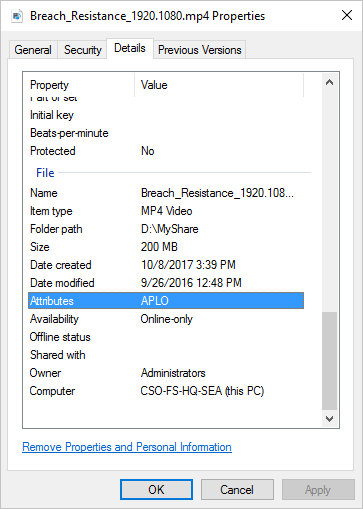

# Cloud Tiering Overview
Cloud tiering is an optional feature of Azure File Sync in which frequently accessed files are cached locally on the server while all other files are tiered to Azure Files based on policy settings. When a file is tiered, the Azure File Sync file system filter (StorageSync.sys) replaces the file locally with a pointer, or reparse point. The reparse point represents a URL to the file in Azure Files. A tiered file has both the "offline" attribute and the FILE_ATTRIBUTE_RECALL_ON_DATA_ACCESS attribute set in NTFS so that third-party applications can securely identify tiered files.
 
When a user opens a tiered file, Azure File Sync seamlessly recalls the file data from Azure Files without the user needing to know that the file is actually stored in Azure. 
 
 > [!Important]  
    > Important: Cloud tiering is not supported for server endpoints on the Windows system volumes, and only files greater than 64 KiB in size can be tiered to Azure Files.
    
Azure File Sync does not support tiering files smaller than 64 KiB as the performance overhead of tiering and recalling such small files would outweigh the space savings.

## Cloud Tiering FAQ

<a id="afs-cloud-tiering"></a>
### How does cloud tiering work?
The Azure File Sync system filter builds a "heatmap" of your namespace on each server endpoint. It monitors accesses (read and write operations) over time and then, based on both the frequency and recency of access, assigns a heat score to every file. A frequently accessed file that was recently opened will be considered hot, whereas a file that is barely touched and has not been accessed for some time will be considered cool. When the file volume on a server exceeds the volume free space threshold you set, it will tier the coolest files to Azure Files until your free space percentage is met.

<a id="afs-volume-free-space"></a>
### How does the volume free space tiering policy work?
Volume free space is the amount of free space you wish to reserve on the volume on which a server endpoint is located. For example, if volume free space is set to 20% on a volume that has one server endpoint, up to 80% of the volume space will be occupied by the most recently accessed files, with any remaining files that do not fit into this space tiered up to Azure. Volume free space applies at the volume level rather than at the level of individual directories or sync groups. 

<a id="volume-free-space-fastdr"></a>
### How does the volume free space tiering policy work with regards to new server endpoints?
When a server endpoint is newly provisioned and connected to an Azure file share, the server will first pull down the namespace and then will pull down the actual files until it hits its volume free space threshold. This process is also known as fast disaster recovery or rapid namespace restore.

<a id="afs-effective-vfs"></a>
### How is volume free space interpreted when I have multiple server endpoints on a volume?
When there is more than one server endpoint on a volume, the effective volume free space threshold is the largest volume free space specified across any server endpoint on that volume. Files will be tiered according to their usage patterns regardless of which server endpoint to which they belong. For example, if you have two server endpoints on a volume, Endpoint1 and Endpoint2, where Endpoint1 has a volume free space threshold of 25% and Endpoint2 has a volume free space threshold of 50%, the volume free space threshold for both server endpoints will be 50%. 

<a id="volume-free-space-guidelines"></a>
### How do I determine the appropriate amount of volume free space?
The amount of data you should keep local is determined by a few factors: your bandwidth, your dataset's access pattern, and your budget. If you have a low-bandwidth connection, you may want to keep more of your data local to ensure there is minimal lag for your users. Otherwise, you can base it on the churn rate during a given period. For example, if you know that about 10% of your 1 TB dataset changes or is actively accessed each month, then you may want to keep 100 GB local so you are not frequently recalling files. If your volume is 2TB, then you will want to keep 5% (or 100 GB) local, meaning the remaining 95% is your volume free space percentage. However, we recommend that you add a buffer to account for periods of higher churn – in other words, starting with a lower volume free space percentage, and then adjusting it if needed later. 

Keeping more data local means lower egress costs as fewer files will be recalled from Azure, but also requires you to maintain a larger amount of on-premises storage, which comes at its own cost. Once you have an instance of Azure File Sync deployed, you can look at your storage account’s egress to roughly gauge whether your volume free space settings are appropriate for your usage. Assuming the storage account contains only your Azure File Sync Cloud Endpoint (that is, your sync share), then high egress means that many files are being recalled from the cloud, and you should consider increasing your local cache.

<a id="is-my-file-tiered"></a>
### How can I tell whether a file has been tiered?
There are several ways to check whether a file has been tiered to your Azure file share:
    
   *  **Check the file attributes on the file.**
     Right-click on a file, go to **Details**, and then scroll down to the **Attributes** property. A tiered file has the following attributes set:     
        
        | Attribute letter | Attribute | Definition |
        |:----------------:|-----------|------------|
        | A | Archive | Indicates that the file should be backed up by backup software. This attribute is always set, regardless of whether the file is tiered or stored fully on disk. |
        | P | Sparse file | Indicates that the file is a sparse file. A sparse file is a specialized type of file that NTFS offers for efficient use when the file on the disk stream is mostly empty. Azure File Sync uses sparse files because a file is either fully tiered or partially recalled. In a fully tiered file, the file stream is stored in the cloud. In a partially recalled file, that part of the file is already on disk. If a file is fully recalled to disk, Azure File Sync converts it from a sparse file to a regular file. |
        | L | Reparse point | Indicates that the file has a reparse point. A reparse point is a special pointer for use by a file system filter. Azure File Sync uses reparse points to define to the Azure File Sync file system filter (StorageSync.sys) the cloud location where the file is stored. This supports seamless access. Users won't need to know that Azure File Sync is being used or how to get access to the file in your Azure file share. When a file is fully recalled, Azure File Sync removes the reparse point from the file. |
        | O | Offline | Indicates that some or all of the file's content is not stored on disk. When a file is fully recalled, Azure File Sync removes this attribute. |

        
        
        You can see the attributes for all the files in a folder by adding the **Attributes** field to the table display of File Explorer. To do this, right-click on an existing column (for example, **Size**), select **More**, and then select **Attributes** from the drop-down list.
        
   * **Use `fsutil` to check for reparse points on a file.**
       As described in the preceding option, a tiered file always has a reparse point set. A reparse pointer is a special pointer for the Azure File Sync file system filter (StorageSync.sys). To check whether a file has a reparse point, in an elevated Command Prompt or PowerShell window, run the `fsutil` utility:
    
        ```PowerShell
        fsutil reparsepoint query <your-file-name>
        ```

        If the file has a reparse point, you can expect to see **Reparse Tag Value: 0x8000001e**. This hexadecimal value is the reparse point value that is owned by Azure File Sync. The output also contains the reparse data that represents the path to your file on your Azure file share.

        > [!WARNING]  
        > The `fsutil reparsepoint` utility command also has the ability to delete a reparse point. Do not execute this command unless the Azure File Sync engineering team asks you to. Running this command might result in data loss. 

<a id="afs-recall-file"></a>

### A file I want to use has been tiered. How can I recall the file to disk to use it locally?
The easiest way to recall a file to disk is to open the file. The Azure File Sync file system filter (StorageSync.sys) seamlessly downloads the file from your Azure file share without any work on your part. For file types that can be partially read from, such as multimedia or .zip files, opening a file doesn't download the entire file.

You also can use PowerShell to force a file to be recalled. This option might be useful if you want to recall multiple files at once, such as all the files in a folder. Open a PowerShell session to the server node where Azure File Sync is installed, and then run the following PowerShell commands:
    
    ```PowerShell
    Import-Module "C:\Program Files\Azure\StorageSyncAgent\StorageSync.Management.ServerCmdlets.dll"
    Invoke-StorageSyncFileRecall -Path <file-or-directory-to-be-recalled>
    ```

<a id="sizeondisk-versus-size"></a>
### Why doesn't the *Size on disk* property for a file match the *Size* property after using Azure File Sync? 
Windows File Explorer exposes two properties to represent the size of a file: **Size** and **Size on disk**. These properties differ subtly in meaning. **Size** represents the complete size of the file. **Size on disk** represents the size of the file stream that's stored on the disk. The values for these properties can differ for a variety of reasons, such as compression, use of Data Deduplication, or cloud tiering with Azure File Sync. If a file is tiered to an Azure file share, the size on the disk is zero, because the file stream is stored in your Azure file share, and not on the disk. It's also possible for a file to be partially tiered (or partially recalled). In a partially tiered file, part of the file is on disk. This might occur when files are partially read by applications like multimedia players or zip utilities. 

<a id="afs-force-tiering"></a>
### How do I force a file or directory to be tiered?
When the cloud tiering feature is enabled, cloud tiering automatically tiers files based on last access and modify times to achieve the volume free space percentage specified on the cloud endpoint. Sometimes, though, you might want to manually force a file to tier. This might be useful if you save a large file that you don't intend to use again for a long time, and you want the free space on your volume now to use for other files and folders. You can force tiering by using the following PowerShell commands:

    ```PowerShell
    Import-Module "C:\Program Files\Azure\StorageSyncAgent\StorageSync.Management.ServerCmdlets.dll"
    Invoke-StorageSyncCloudTiering -Path <file-or-directory-to-be-tiered>
    ```

## Next Steps
* [Planning for an Azure File Sync Deployment](storage-sync-files-planning.md)
