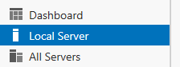
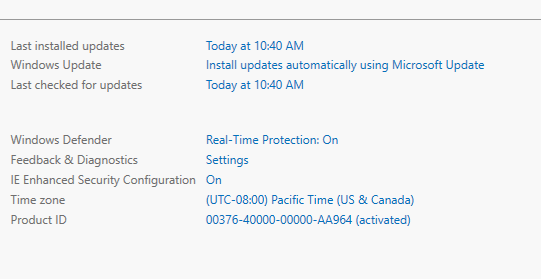
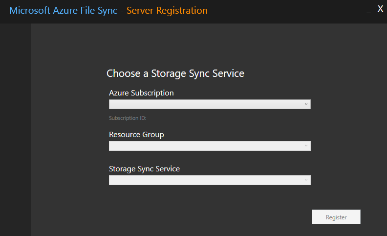

# How to deploy Azure File Sync (preview)
With Azure File Sync (preview), shares can be replicated on-premises or in Azure and accessed through SMB or NFS shares on Windows Server. Azure File Sync is useful for scenarios in which data needs to be accessed and modified far away from an Azure datacenter, such as in a branch office scenario. Data may be replicated between multiple Windows Server endpoints, such as between multiple branch offices.

We strongly recommend reading the [Planning for an Azure Files deployment](planning-azure-files-deployment.md) and [Planning for an Azure File Sync deployment](planning-azure-file-sync-deployment.md) before following the steps in this guide.

## Prerequisites
* A Storage Account and an Azure File share in the same region that you want to deploy Azure File Sync. For more information, see:
    - [Region availability](planning-azure-file-sync-deployment.md#region-availability) of Azure File Sync,
    - [Create a Storage Account](../common/storage-create-storage-account.md?toc=%2fazure%2fstorage%2ffiles%2ftoc.json) for step-by-step directions on how to create a Storage Account, and
    - [Create a file share](storage-how-to-create-file-share.md) for step-by-step directions on how to create a file share.
* At least one supported Windows Server or Windows Server cluster to sync with Azure File Sync. See [Interoperability with Windows Server](planning-azure-file-sync-deployment.md#interoperability-with-windows-server) for more information on supported versions of Windows Server.

## Deploy the Storage Sync Service 
The Storage Sync Service is the top-level Azure resource representing Azure File Sync. To deploy a Storage Sync Service, navigate to the [Azure portal](https://portal.azure.com/), and search for Azure File Sync. After selecting "Azure File Sync (preview)" from the search results, select "Create" to pop open the "Deploy Storage Sync" tab.

The resulting blade asks for the following information:

- **Name**: A unique name (per subscription) for the Storage Sync Service.
- **Subscription**: The subscription to create the Storage Sync Service in. Depending on your organization's configuration strategy, you may have access to one or more subscriptions. An Azure Subscription is the top level and most basic container for cloud service (such as Azure Files) billing.
- **Resource group**: A resource group is a logical group of Azure resources, such as a Storage Account or a Storage Sync Service. You may create a new resource group or use an existing resource group for Azure File Sync (we recommend using resource groups as containers used to isolate resources logically for your organization, such as grouping HR resources or resources for a particular project).
- **Location**: The region (Azure datacenter) which you would like to deploy Azure File Sync in. Only supported regions are available in this list, in Preview, that will be a subset of total regions.

Once the "Deploy Storage Sync" form has been completed, click "Create" to deploy the Storage Sync Service.

## Prepare Windows Servers for use with Azure File Sync
For every server, including server nodes in a Failover Cluster, you intend to use with Azure File Sync, complete the following steps:

1. Disable Internet Explorer Enhanced Security Configuration. This is only required for initial server registration, and can be reenabled after the server has been registered.
    1. Open Server Manager.
    2. On the left-hand side, click "Local Server":  
        
    3. Select the link for "IE Enhanced Security Configuration" on the right-hand side of the Properties sub-pane:  
        
    4. Select "Off" for both Administrators and Users in the Internet Explorer Enhanced Security Configuration pop-up window:  
        

2. Ensure that you are running at least PowerShell 5.1.* (PowerShell 5.1 is the default on Windows Server 2016). You can verify you are running PowerShell 5.1.* by looking at the value of the PSVersion property of the $PSVersionTable object:

    ```PowerShell
    $PSVersionTable.PSVersion
    ```

    - If your PSVersion is less than 5.1.*, as will be the case with most installations of Windows Server 2012 R2, you can easily upgrade by downloading and installing [Windows Management Framework (WMF) 5.1](https://www.microsoft.com/download/details.aspx?id=54616). The appropriate package to download and install for Windows Server 2012 R2 is **Win8.1AndW2K12R2-KB\*\*\*\*\*\*\*-x64.msu**.

3. [Install and configure Azure PowerShell](https://docs.microsoft.com/powershell/azure/install-azurerm-ps). We always recommend using the latest version of the Azure PowerShell modules.

## Install the Azure File Sync agent
The Azure File Sync agent is a downloadable package which enables a Windows Server to be synchronized with an Azure File share. The agent can be downloaded from the [Microsoft Download Center](https://go.microsoft.com/fwlink/?linkid=858257). Once downloaded, double-click on the MSI package to start the Azure File Sync agent installation.

> [!Important]  
> If you intend to use Azure File Sync with a Failover Cluster, the Azure File Sync agent will need to be installed on every node in the cluster.

The Azure File Sync agent installation package should install relatively quickly without too many additional prompts. We recommend:
- Leaving the default installation path `C:\Program Files\Azure\StorageSyncAgent`) to simplify troubleshooting and server maintenance.
- Enabling Microsoft Update to keep Azure File Sync up to date. All updates, including feature updates and hotfixes, to the Azure File Sync agent will occur from Microsoft Update. We always recommend taking the latest update to Azure File Sync. Please see [Azure File Sync update policy](planning-azure-file-sync-deployment.md#azure-file-sync-agent-update-policy) for more information.

At the conclusion of the Azure File Sync agent installation, the Server Registration UI will auto-start. Please see the next section for how to register this server with Azure File Sync.

## Register Windows Server with Storage Sync Service
Registering your Windows Server with a Storage Sync Service establishes a trust-relationship between your server (or cluster) and the Storage Sync Service. The Server Registration UI should auto-start after the installation of the Azure File Sync agent, but if it doesn't, you can open it manually from its location: `C:\Program Files\Azure\StorageSyncAgent\ServerRegistration.exe`. Once the Server Registration UI is open, click "Sign-in" to begin.

After sign-in, you will be prompted for the following information:



- **Azure subscription**: The subscription you deployed the Storage Sync Service in [Deploy the Storage Sync Service](#deploy-the-storage-sync-service) above. 
- **Resource group**: The resource group you deployed the Storage Sync Service in.
- **Storage Sync Service**: The name of the Storage Sync Service you want to register the server with.

Once you have selected the appropriate information from the drop downs, click "Register" to complete the server registration. Note that you will be prompted again to sign-in.

## Create a Sync Group
A Sync Group defines the sync topology for a set of files. Endpoints within a Sync Group will be kept in sync with each other. A Sync Group must contain at least one Cloud Endpoint, which represents an Azure File share, and one Server Endpoint, which represents a path on a Windows Server. To create a Sync Group, navigate to your Storage Sync Service in the [Azure portal](https://portal.azure.com/), and click "+ Sync group":


The resulting pane asks for the following information to create a Sync Group with a Cloud Endpoint:

- **Sync Group Name**: The name of the Sync Group to be created. This name must be unique within the Storage Sync Service, but can be any name that is logical for you.
- **Subscription**: The subscription you deployed the Storage Sync Service in [Deploy the Storage Sync Service](#deploy-the-storage-sync-service) above.
- **Storage Account**: Clicking "Select storage account" will pop open an additional pane allowing you select the Storage Account containing the Azure File share you would like to sync with.
- **Azure File Share**: The name of the Azure File share you would like to sync with.

To add a Server Endpoint, navigate to the newly created Sync Group, and click "Add server endpoint".


The resulting "Add server endpoint" pane requires the following information to create a Server Endpoint:

- **Registered Server**: The name of the server or cluster to create the Server Endpoint on.
- **Path**: The Path on the Windows Server to be synchronized as part of the Sync Group.
- **Cloud Tiering**: A switch to enable or disable cloud tiering, which enables infrequently used or access files to be tiered to Azure Files.
- **Volume Free Space**: the amount of free space to reserve on the volume which the Server Endpoint resides. For example, if the Volume Free Space is set to 50% on a volume with a single Server Endpoint, roughly half the amount of data will be tiered to Azure Files. Note that regardless of whether cloud tiering is enabled, your Azure File share always has a complete copy of the data in the Sync Group.

Click "Create" to add the Server Endpoint. Your files will now be kept in sync across your Azure File share and your Windows Server. 

## Next steps
- [Manage Azure File Sync network traffic](azure-file-sync-network-throttling.md)
- [Add/Remove an Azure File Sync Server Endpoint](storage-sync-files-server-endpoint.md)
- [Register/deregister a server with Azure File Sync](azure-file-sync-server-registration.md)