<!---Customer intent: As a IT Administrator, I want see how to extend Windows file servers with Azure File Sync, so I can evaluate the process for extending storage capacity of my Windows Servers.
--->

# Tutorial: Extend Windows file servers with Azure File Sync
You use Azure File Sync to centralize your organization's file shares and to extend the storage capacity of an on-premises file server. Azure File Sync transforms Windows Server into a quick cache of your Azure file share.

In this tutorial, we'll show the basic steps to take a Windows Server Azure VM and extend its storage capacity using Azure File Sync. We're using a Windows Server Azure VM for this tutorial, but you would typically do the process for your on-premises servers. If you're ready to deploy Azure File Sync in your own environment, use the [Deploy Azure File Sync](storage-sync-files-deployment-guide.md) article instead.

> [!div class="checklist"]
> * Deploy the Storage Sync Service
> * Prepare Windows Server to use with Azure File Sync
> * Install the Azure File Sync agent
> * Register Windows Server with Storage Sync Service
> * Create a sync group and a cloud endpoint
> * Create a server endpoint

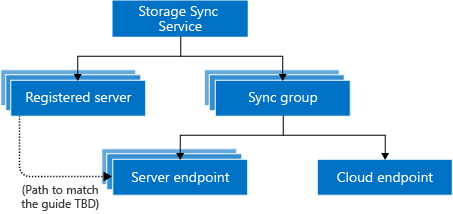

If you don't have an Azure subscription, create a [free account](https://azure.microsoft.com/free/?WT.mc_id=A261C142F) before you begin.

<!--- Will, is there any way we can just have them use a folder on their local machine, so they don't have to create the VM???--->

## Sign in to Azure
Sign in to the Azure portal at https://portal.azure.com.

## Prepare your environment for the tutorial
There are a few things you need to put in place for this tutorial before you deploy Azure File Sync. Along with creating an Azure Storage account and file share, you'll create a Windows Server 2016 Datacenter VM and prepare that server for Azure File Sync.

Let's get started.

### Create a folder and .txt file

On your local computer, create a new folder named *afstutorialfolder* and add a text file named *mytestdoc.txt*. you'll upload that file to the file share later in this tutorial.

### Create a storage account

[!INCLUDE [storage-create-account-portal-include](../../../includes/storage-create-account-portal-include.md)]

<!---Testing the "prepare your environment" section. can be moved to Prereqs if preferred.--->
<!---still have to fix the include to add the last "create" step--->

### Create a file share
<!---can I make this an include from the source article?--->
To create a file share for this tutorial, follow these steps:

1. When the Azure storage account deployment is complete, click **Go to resource**.

    

1. Click **Files** from the storage account pane.

    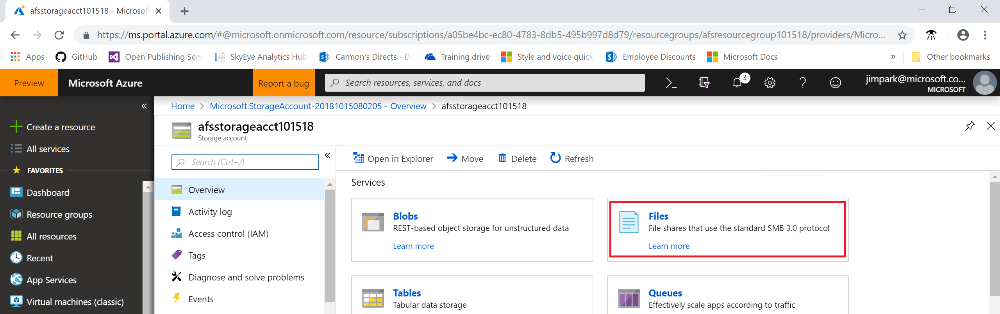

1. Click **+ File Share**.

    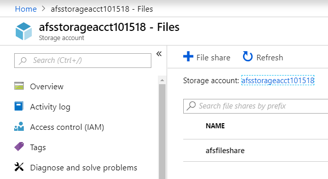

1. Name the new file share *afsfileshare* and enter "1" for the **Quota**, then click **Create**. The quota can be a maximum of 5 TiB, but you only need 1 GB for this tutorial.

    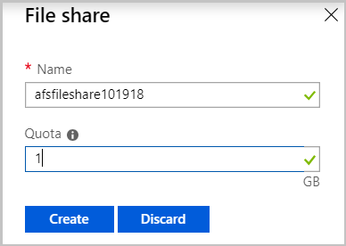

1. Select the new file share and then click **Upload**.

    

1. Browse to the *afstutorialfolder* folder where you created your .txt file, select *mytestdoc.txt* and click **Upload**.

    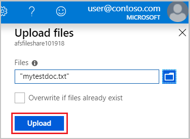

At this point, you've created an Azure Storage account and a file share with one file in it in Azure. Now you'll create the Azure VM with Windows Server 2016 Datacenter to represent the on-premises server in this tutorial.

### Deploy a VM and attach a data disk

1. Choose **Create a resource** in the upper left-hand corner of the Azure portal.
1. In the search box above the list of Azure Marketplace resources, search for and select **Windows Server 2016 Datacenter**, then choose **Create**.

    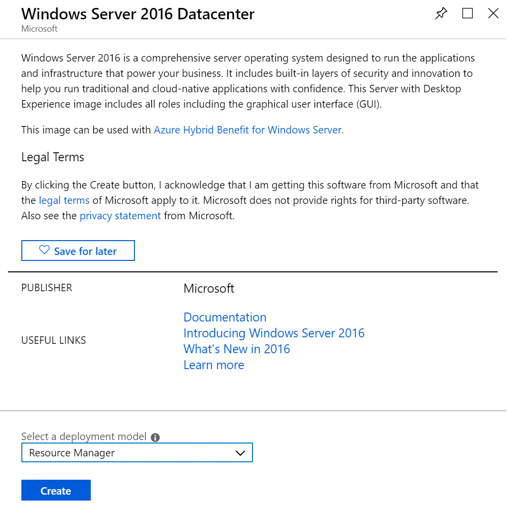

1. In the **Basics** tab, under **Project details**, select the resource group you created for this tutorial.

   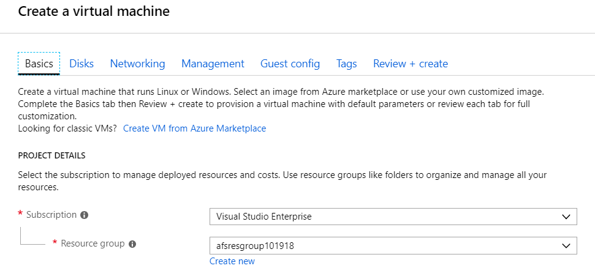

1. Under **Instance details**, provide a VM name, such as *myVM*.

1. Leave the default settings for **Region**, **Availability options**, **Image**, and **Size**.

1. Under **Administrator account**, provide a **Username** and **Password** for the VM.

1. Under **Inbound port rules**, choose **Allow selected ports** and then select **RDP (3389)** and **HTTP** from the drop-down.

   Before you create the VM, you need to create a data disk.

1. Click **Next:Disks**

   

1. In the **Disks** tab, under **Disk options**, leave the defaults. 

   <!---ask Will if we could select "standard" to save expense for the tutorial?--->

1. Under **DATA DISKS**, click **Create and attach a new disk**.
1. Leave the defaults, except change the **Size (GiB)** to **1 GB** for this tutorial.

   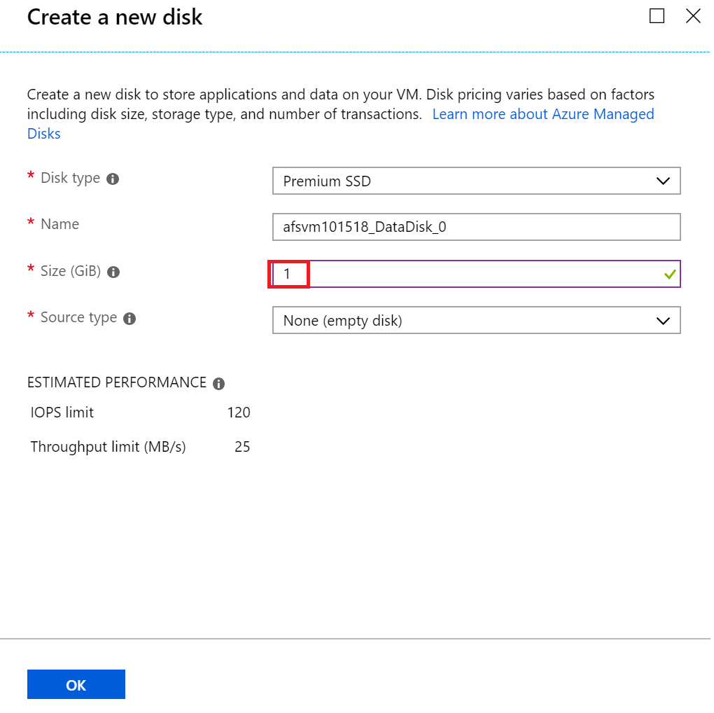

1. Click **OK**.
1. Click **Review + create**.
1. Click **Create**.

   You can click the **Notifications** icon to watch the **Deployment progress**. Creating a new VM will take a few minutes to complete.

1. Once your VM deployment is complete, click **Go to resource**.

   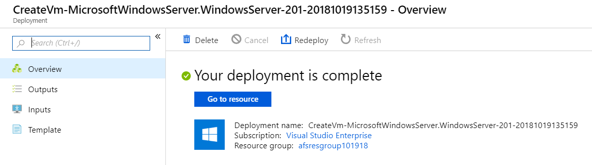

   At this point, you've created a new virtual machine and attached a data disk. Now you need to connect to the VM.

### Connect to your VM

1. In the Azure portal, click **Connect** on the virtual machine properties page.

   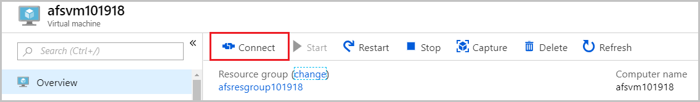

1. In the **Connect to virtual machine** page, keep the default options to connect by **IP address** over port 3389 and click **Download RDP file**.

   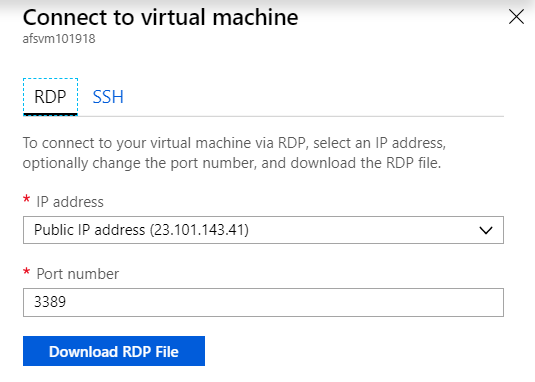

1. Open the downloaded RDP file and click **Connect** when prompted.
1. In the **Windows Security** window, select **More choices** and then **Use a different account**. Type the username as *localhost\username*, enter the password you created for the virtual machine, and then click **OK**.

   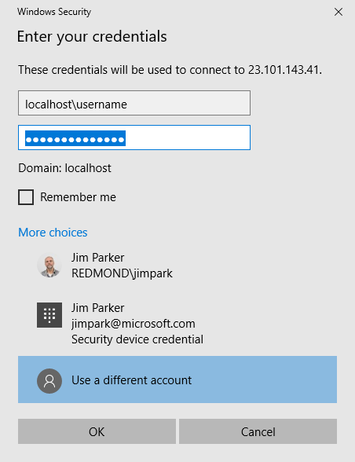

1. You may receive a certificate warning during the sign-in process. Click **Yes** or **Continue** to create the connection.

### Prepare the Windows Server
For the server that you intend to use with Azure File Sync, disable **Internet Explorer Enhanced Security Configuration**. This step is required only for initial server registration. You can re-enable it after the server has been registered.

In the **Windows Server 2016 Datacenter** VM, **Server Manager** will open automatically.  If **Server Manager** doesn't open by default, search for it in Explorer.

1. In **Server Manager** Click **Local Server**.

   

1. On the **Properties** subpane, select the link for **IE Enhanced Security Configuration**.  

    

1. In the **Internet Explorer Enhanced Security Configuration** dialog box, select **Off** for **Administrators** and **Users**:  

    

   Now you can add the data disk to the VM.

### Add the data disk
<!--- suggest putting this section here because server manager automatically opens, so seems like the right place to put it--->

1. In the **Windows Server 2016 Datacenter** VM, click **Files and storage services** > **Volumes** > **Disks**.

    

1. Right-click the 1 GB disk named **Msft Virtual Disk** and click **New volume**.
1. Complete the wizard leaving the defaults in place, noting the assigned drive letter, and click **Create**.

   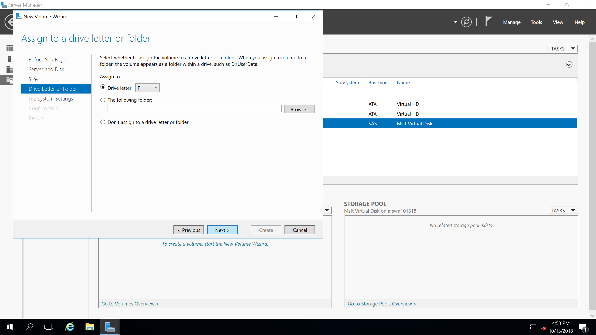

1. Click **Close**.

   At this point, you've brought the disk online and created a volume. You can confirm that adding the data disk was successful by opening Explorer on the VM and confirming that the new drive is present.

1. In Explorer on the VM, double-click the new drive. It's the F: drive in this example.
1. Right-click and select **New** > **Folder**. Name the folder *FilesToSync*.
1. Double-click the **FilesToSync** folder.
1. Right-click and select **New** > **Text Document**. Name the text file *MyTestFile*.

    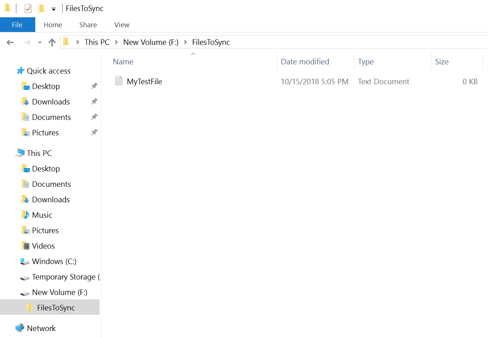

1. Close **Server Manager**.
 
### Download the AzureRM PowerShell module
In the **Windows Server 2016 Datacenter** VM, install the **AzureRM PowerShell module is installed** on the server.

1. In the VM, open an elevated PowerShell window
1. Run the following command:

   ```powershell
   Install-Module -Name AzureRM -AllowClobber
   ```

   > [!NOTE]
   > If you have a version older than 2.8.5.201 of NuGet, you are prompted to download and install
   > the latest version of NuGet.

   By default, the PowerShell gallery isn't configured as a trusted repository for PowerShellGet. The first time you use the PSGallery you see the following prompt:

   ```output
   Untrusted repository

   You are installing the modules from an untrusted repository. If you trust this repository, change its InstallationPolicy value by running the Set-PSRepository cmdlet.

   Are you sure you want to install the modules from 'PSGallery'?
   [Y] Yes  [A] Yes to All  [N] No  [L] No to All  [S] Suspend  [?] Help (default is "N"):
   ```

1. Answer `Yes` or `Yes to All` to continue with the installation.

The `AzureRM` module is a rollup module for the Azure PowerShell cmdlets. Installing it downloads all the available Azure Resource Manager modules and makes their cmdlets available for use.

## Deploy the Storage Sync Service 
Deploying Azure File Sync starts with placing a **Storage Sync Service** resource into a resource group of your selected subscription. The Storage Sync Service inherits access permissions from the subscription and resource group it has been deployed into.

1. In the Azure portal, click **Create a resource** and then search for **Azure File Sync**.
1. In the search results, select **Azure File Sync**.

   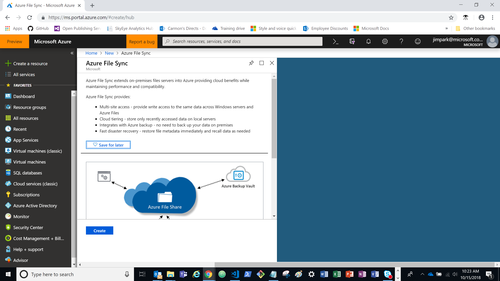

1. Select **Create** to open the **Deploy Storage Sync** tab.

   On the pane that opens, enter the following information:

   | Value | Description |
   | ----- | ----- |
   | **Name** | A unique name (per subscription) for the Storage Sync Service. |
   | **Subscription** | The subscription you're using for this tutorial. |
   | **Resource group** | The resource group you're using for this tutorial. We've used *afsresourcegroup101518* throughout this tutorial. | <!---Will, do you have a preference for creating a new resource group, or just using the one that was created when the storage account was set up? This is just for the purpose of this tutorial. It's more expedient to use the one we created.--->
   | **Location** | East US |

1. When you are finished, select **Create** to deploy the Storage Sync Service.

   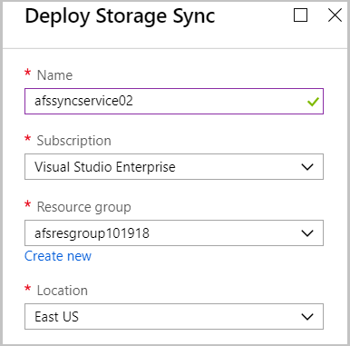

1. Click the **Notifications** tab > **Go to resource**.

## Install the Azure File Sync agent
The Azure File Sync agent is a downloadable package that enables Windows Server to be synced with an Azure file share.

1. In the **Windows Server 2016 Datacenter** VM, open **Internet Explorer**
1. Go to the [Microsoft Download Center](https://go.microsoft.com/fwlink/?linkid=858257) and click **Download**.

   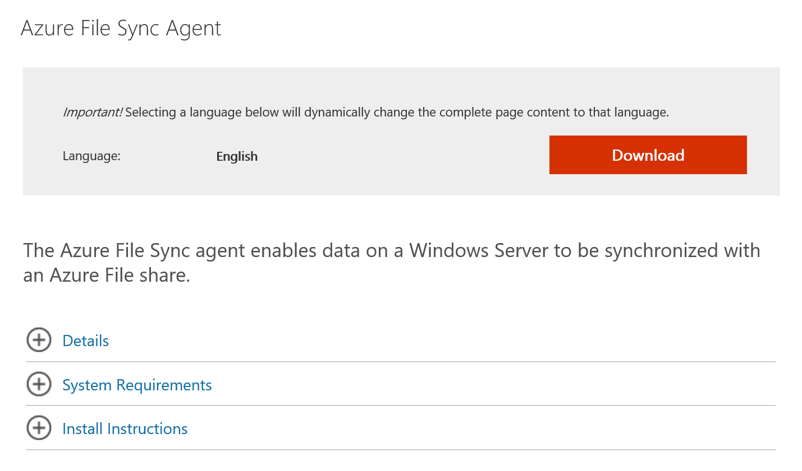

1. Check the box for **StorageSyncAgent_V3_WS2016.EXE** and click **Next**.

   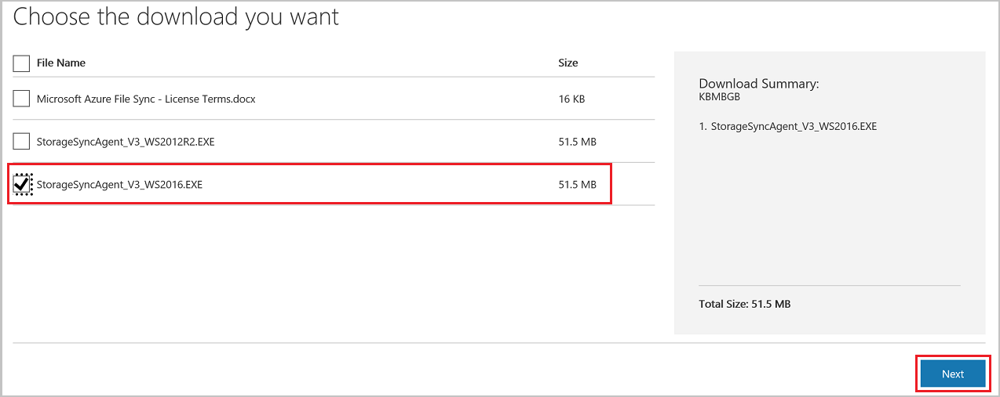

1. **Allow once** > **Run** > **Open** the file.
1. If you haven't already done so, close the PowerShell window.
1. Accept the defaults in the **Storage Sync Agent Setup Wizard**.
1. Click **Install**.
1. Click **Finish**.

You've deployed the Azure Sync Service and installed the agent on the **Windows Server 2016 Datacenter** VM. Now you need to register the VM with the **Storage Sync Service**.

## Register Windows Server with Storage Sync Service
Registering your Windows Server with a Storage Sync Service establishes a trust relationship between your server (or cluster) and the Storage Sync Service. A server can only be registered to one Storage Sync Service and can sync with other servers and Azure file shares associated with the same Storage Sync Service.

The Server Registration UI should open automatically after installing the **Azure File Sync agent**. If it doesn't, you can open it manually from its file location: C:\Program Files\Azure\StorageSyncAgent\ServerRegistration.exe.

1. When the Server Registration UI opens in the VM, click **OK**.

   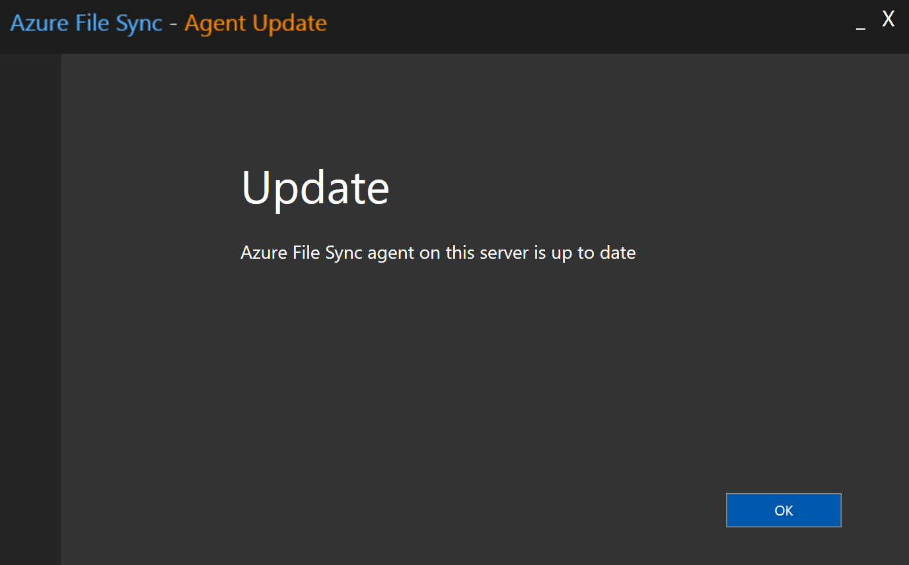

1. Click **Sign-in** to begin.
1. Sign in with your Azure account credentials and click **Sign-in**.
1. Provide the following information:

   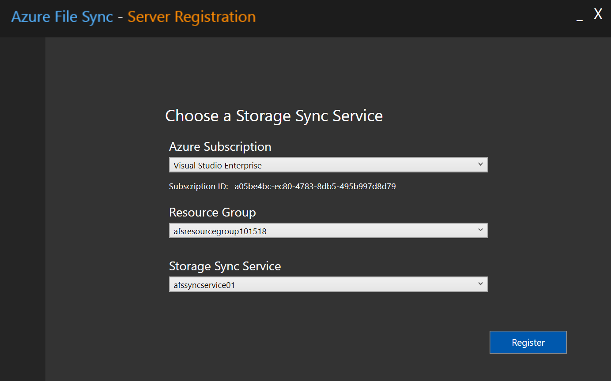

   | | |
   | ----- | ----- |
   | Value | Description |
   | **Azure Subscription** | The subscription that contains the Storage Sync Service. |
   | **Resource Group** | The resource group that contains the Storage Sync Service for this tutorial. We've used *afsresourcegroup101518* throughout this tutorial. |
   | **Storage Sync Service** | The name of the Storage Sync Service you used for this tutorial. We've used *afssyncservice01* throughout this tutorial. |

1. Click **Register** to complete the server registration.
1. As part of the registration process, you are prompted for an additional sign-in. Sign in and click **Next**.
1. Click **Okay**

## Create a sync group and a cloud endpoint
A sync group defines the sync topology for a set of files. A sync group must contain one cloud endpoint, which represents an Azure file share and one or more server endpoints. A server endpoint represents a path on a registered server.

1. To create a sync group, in the [Azure portal](https://portal.azure.com/), go to your Storage Sync Service, and then select **+ Sync group**:

   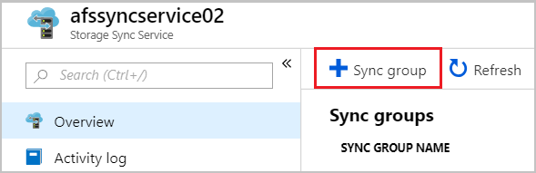

1. In the pane that opens, enter the following information to create a sync group with a cloud endpoint:

   | | |
   | ----- | ----- |
   | Value | Description |
   | **Sync group name** | The name of the sync group to be created. This name must be unique within the Storage Sync Service but can be any name that is logical for you. In this tutorial, we're using *afssyncgroup*.|
   | **Subscription** | The subscription where you deployed the Storage Sync Service. |
   | **Storage account** |Click **Select storage account**. On the pane that appears, select the storage account that has the Azure file share that you created for this tutorial. We used *afsstorageacct101518*. |
   | **Azure file share** | The name of the Azure file share you created for this tutorial. We used *afsfileshare*. |

1. Click **Create**.

<!---at this point "cloud endpoint creation" failed. is this common. should we provide steps to retry???--->

## Add a server endpoint
A server endpoint represents a specific location on a registered server, such as a folder on a server volume.
<!---Can we explain this as the location of your files????--->
<!---if we don't need to address cloud tiering in this tutorial, can we just create a folder on the customers C drive???--->

1. To add a server endpoint, select the newly created sync group and then select **Add server endpoint**.

   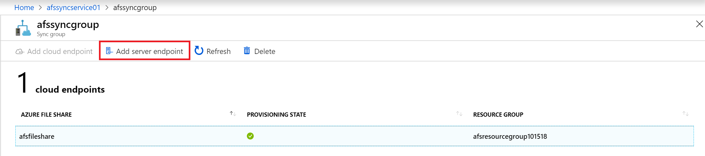

1. In the **Add server endpoint** pane, enter the following information to create a server endpoint:

   | | |
   | ----- | ----- |
   | Value | Description |
   | **Registered server** | The name of the server you created for this tutorial. We used *afsvm101518* in this tutorial ||
   | **Path** | The Windows Server path to the drive you created for this tutorial. In our example, it is *f:\filestosync*. |
   | **Cloud Tiering** | Leave disabled for this tutorial. |
   | **Volume Free Space** | Leave blank for this tutorial. |

1. Click **Create**.

Your files are now kept in sync across your Azure file share and Windows Server.

| Azure Storage| Windows Server |
| ----- | ----- |
| 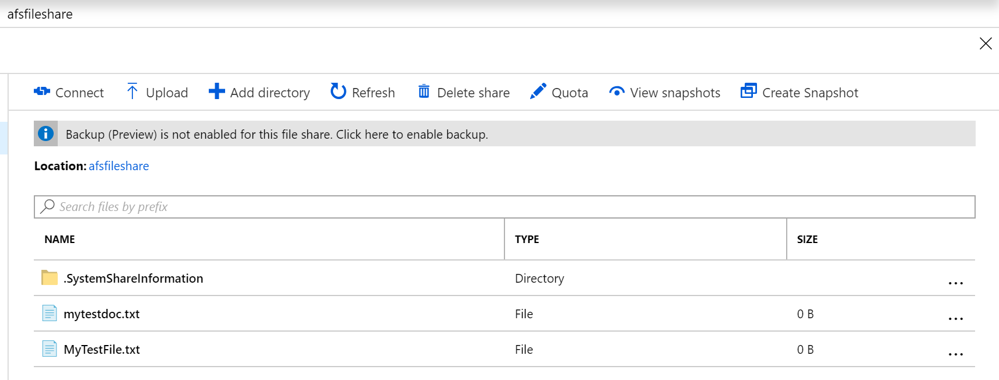 | 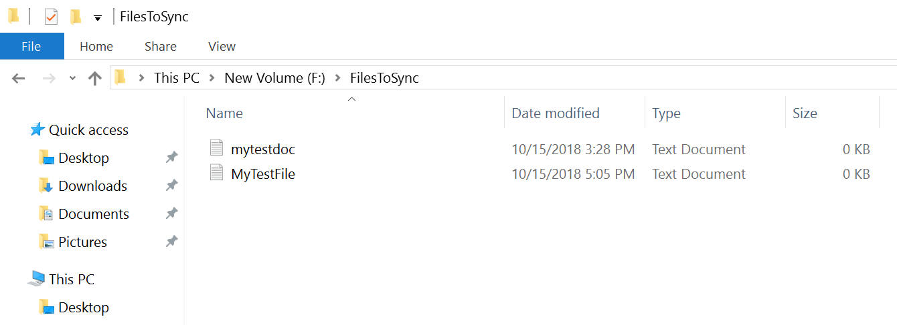 |

## Clean up resources

[!INCLUDE [storage-files-clean-up-portal](../../../includes/storage-files-clean-up-portal.md)]

When no longer needed, you can delete the resource group, virtual machine, and all related resources. To do so, select the resource group for the virtual machine, select **Delete**, then confirm the name of the resource group to delete.

<!--- Do we need to tell them to enable the **Internet Explorer Enhanced Security Configuration** setting we disabled in ## Prepare the Windows Server?--->

## Next steps
<!--- What is the single next most likely thing the customer would do? Is it the next tutorial in the series?--->

In this tutorial, you learned the basic steps to take a Windows Server Azure VM and extend its storage capacity using Azure File Sync. Advance to the next tutorial to learn about setting up DFS-N with Azure Files.

> [!div class="nextstepaction"]
> [Set up DFS-N with Azure Files](./storage-files-set-up-dfs-n.md)

