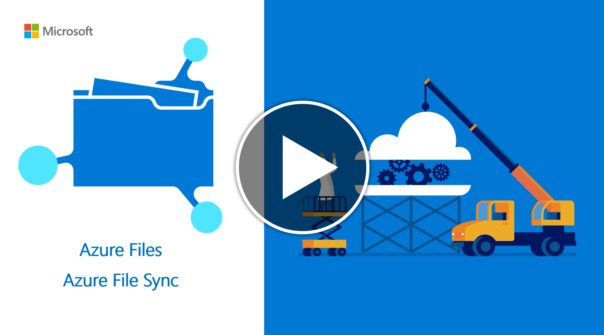

# Planning for an Azure File Sync deployment

:::row:::
    :::column:::
        [](https://www.youtube.com/watch?v=nfWLO7F52-s)
    :::column-end:::
    :::column:::
        Azure File Sync is a service that allows you to cache several Azure file shares on an on-premises Windows Server or cloud VM. 
        
        This article introduces you to Azure File Sync concepts and features. Once you are familiar with Azure File Sync, consider following the [Azure File Sync deployment guide](storage-sync-files-deployment-guide.md) to try out this service.        
    :::column-end:::
:::row-end:::

The files will be stored in the cloud in [Azure file shares](storage-files-introduction.md). Azure file shares can be used in two ways: by directly mounting these serverless Azure file shares (SMB) or by caching Azure file shares on-premises using Azure File Sync. Which deployment option you choose changes the aspects you need to consider as you plan for your deployment. 

- **Direct mount of an Azure file share**: Since Azure Files provides SMB access, you can mount Azure file shares on-premises or in the cloud using the standard SMB client available in Windows, macOS, and Linux. Because Azure file shares are serverless, deploying for production scenarios does not require managing a file server or NAS device. This means you don't have to apply software patches or swap out physical disks. 

- **Cache Azure file share on-premises with Azure File Sync**: Azure File Sync enables you to centralize your organization's file shares in Azure Files, while keeping the flexibility, performance, and compatibility of an on-premises file server. Azure File Sync transforms an on-premises (or cloud) Windows Server into a quick cache of your Azure file share. 

## Management concepts
An Azure File Sync deployment has three fundamental management objects:

- **Azure file share**: An Azure file share is a serverless cloud file share, which provides the *cloud endpoint* of an Azure File Sync sync relationship. Files in an Azure file share can be accessed directly with SMB or the FileREST protocol, although we encourage you to primarily access the files through the Windows Server cache when the Azure file share is being used with Azure File Sync. This is because Azure Files today lacks an efficient change detection mechanism like Windows Server has, so changes to the Azure file share directly will take time to propagate back to the server endpoints.
- **Server endpoint**: The path on the Windows Server that is being synced to an Azure file share. This can be a specific folder on a volume or the root of the volume. Multiple server endpoints can exist on the same volume if their namespaces do not overlap.
- **Sync group**: The object that defines the sync relationship between a **cloud endpoint**, or Azure file share, and a server endpoint. Endpoints within a sync group are kept in sync with each other. If for example, you have two distinct sets of files that you want to manage with Azure File Sync, you would create two sync groups and add different endpoints to each sync group.

### Azure file share management concepts
[!INCLUDE [storage-files-file-share-management-concepts](../../../includes/storage-files-file-share-management-concepts.md)]

### Azure File Sync management concepts
Sync groups are deployed into **Storage Sync Services**, which are top-level objects that register servers for use with Azure File Sync and contain the sync group relationships. The Storage Sync Service resource is a peer of the storage account resource, and can similarly be deployed to Azure resource groups. A Storage Sync Service can create sync groups that contain Azure file shares across multiple storage accounts and multiple registered Windows Servers.

Before you can create a sync group in a Storage Sync Service, you must first register a Windows Server with the Storage Sync Service. This creates a **registered server** object, which represents a trust relationship between your server or cluster and the Storage Sync Service. To register a Storage Sync Service, you must first install the Azure File Sync agent on the server. An individual server or cluster can be registered with only one Storage Sync Service at a time.

A sync group contains one cloud endpoint, or Azure file share, and at least one server endpoint. The server endpoint object contains the settings that configure the **cloud tiering** capability, which provides the caching capability of Azure File Sync. In order to sync with an Azure file share, the storage account containing the Azure file share must be in the same Azure region as the Storage Sync Service.

> [!Important]  
> You can make changes to the namespace of any cloud endpoint or server endpoint in the sync group and have your files synced to the other endpoints in the sync group. If you make a change to the cloud endpoint (Azure file share) directly, changes first need to be discovered by an Azure File Sync change detection job. A change detection job is initiated for a cloud endpoint only once every 24 hours. For more information, see [Azure Files frequently asked questions](storage-files-faq.md#afs-change-detection).

### Consider the count of Storage Sync Services needed
A previous section discusses the core resource to configure for Azure File Sync: a *Storage Sync Service*. A Windows Server can only be registered to one Storage Sync Service. So it is often best to only deploy a single Storage Sync Service and register all servers that it. 

Create multiple Storage Sync Services only if you have:
* distinct sets of servers that must never exchange data with one another. In this case, you want to design the system to exclude certain sets of servers to sync with an Azure file share that is already in use as a cloud endpoint in a sync group in a different Storage Sync Service. Another way to look at this is that Windows Servers registered to different storage sync service cannot sync with the same Azure file share.
* a need to have more registered servers or sync groups than a single Storage Sync Service can support. Review the [Azure File Sync scale targets](storage-files-scale-targets.md#azure-file-sync-scale-targets) for more details.

## Plan for balanced sync topologies
Before you deploy any resources, it is important to plan out what you will sync on a local server, with which Azure file share. Making a plan will help you determine how many storage accounts, Azure file shares, and sync resources you will need. These considerations are still relevant, even if your data doesn't currently reside on a Windows Server or the server you want to use long term. The [migration section](#migration) can help determine appropriate migration paths for your situation.

[!INCLUDE [storage-files-migration-namespace-mapping](../../../includes/storage-files-migration-namespace-mapping.md)]

## Windows file server considerations
To enable the sync capability on Windows Server, you must install the Azure File Sync downloadable agent. The Azure File Sync agent provides two main components: `FileSyncSvc.exe`, the background Windows service that is responsible for monitoring changes on the server endpoints and initiating sync sessions, and `StorageSync.sys`, a file system filter that enables cloud tiering and fast disaster recovery.  

### Operating system requirements
Azure File Sync is supported with the following versions of Windows Server:

| Version | Supported SKUs | Supported deployment options |
|---------|----------------|------------------------------|
| Windows Server 2019 | Datacenter, Standard, and IoT | Full and Core |
| Windows Server 2016 | Datacenter, Standard, and Storage Server | Full and Core |
| Windows Server 2012 R2 | Datacenter, Standard, and Storage Server | Full and Core |

Future versions of Windows Server will be added as they are released.

> [!Important]  
> We recommend keeping all servers that you use with Azure File Sync up to date with the latest updates from Windows Update. 

### Minimum system resources
Azure File Sync requires a server, either physical or virtual, with at least one CPU and a minimum of 2 GiB of memory.

> [!Important]  
> If the server is running in a virtual machine with dynamic memory enabled, the VM should be configured with a minimum of 2048 MiB of memory.

For most production workloads, we do not recommend configuring an Azure File Sync sync server with only the minimum requirements. See [Recommended system resources](#recommended-system-resources) for more information.

### Recommended system resources
Just like any server feature or application, the system resource requirements for Azure File Sync are determined by the scale of the deployment; larger deployments on a server require greater system resources. For Azure File Sync, scale is determined by the number of objects across the server endpoints and the churn on the dataset. A single server can have server endpoints in multiple sync groups and the number of objects listed in the following table accounts for the full namespace that a server is attached to. 

For example, server endpoint A with 10 million objects + server endpoint B with 10 million objects = 20 million objects. For that example deployment, we would recommend 8 CPUs, 16 GiB of memory for steady state, and (if possible) 48 GiB of memory for the initial migration.
 
Namespace data is stored in memory for performance reasons. Because of that, bigger namespaces require more memory to maintain good performance, and more churn requires more CPU to process. 
 
In the following table, we have provided both the size of the namespace as well as a conversion to capacity for typical general purpose file shares, where the average file size is 512 KiB. If your file sizes are smaller, consider adding additional memory for the same amount of capacity. Base your memory configuration on the size of the namespace.

| Namespace size - files & directories (millions)  | Typical capacity (TiB)  | CPU Cores  | Recommended memory (GiB) |
|---------|---------|---------|---------|
| 3        | 1.4     | 2        | 8 (initial sync)/ 2 (typical churn)      |
| 5        | 2.3     | 2        | 16 (initial sync)/ 4 (typical churn)    |
| 10       | 4.7     | 4        | 32  (initial sync)/ 8 (typical churn)   |
| 30       | 14.0    | 8        | 48 (initial sync)/ 16 (typical churn)   |
| 50       | 23.3    | 16       | 64  (initial sync)/ 32 (typical churn)  |
| 100*     | 46.6    | 32       | 128 (initial sync)/ 32 (typical churn)  |

\*Syncing more than 100 million files & directories is not recommended at this time. This is a soft limit based on our tested thresholds. For more information, see [Azure Files scalability and performance targets](storage-files-scale-targets.md#azure-file-sync-scale-targets).

> [!TIP]
> Initial synchronization of a namespace is an intensive operation and we recommend allocating more memory until initial synchronization is complete. This isn't required but, may speed up initial sync. 
> 
> Typical churn is 0.5% of the namespace changing per day. For higher levels of churn, consider adding more CPU. 

- A locally attached volume formatted with the NTFS file system.

### Evaluation cmdlet
Before deploying Azure File Sync, you should evaluate whether it is compatible with your system using the Azure File Sync evaluation cmdlet. This cmdlet checks for potential issues with your file system and dataset, such as unsupported characters or an unsupported operating system version. Its checks cover most but not all of the features mentioned below; we recommend you read through the rest of this section carefully to ensure your deployment goes smoothly. 

The evaluation cmdlet can be installed by installing the Az PowerShell module, which can be installed by following the instructions here: [Install and configure Azure PowerShell](/powershell/azure/install-Az-ps).

#### Usage  
You can invoke the evaluation tool in a few different ways: you can perform the system checks, the dataset checks, or both. To perform both the system and dataset checks: 

```powershell
Invoke-AzStorageSyncCompatibilityCheck -Path <path>
```

To test only your dataset:
```powershell
Invoke-AzStorageSyncCompatibilityCheck -Path <path> -SkipSystemChecks
```
 
To test system requirements only:
```powershell
Invoke-AzStorageSyncCompatibilityCheck -ComputerName <computer name> -SkipNamespaceChecks
```
 
To display the results in CSV:
```powershell
$validation = Invoke-AzStorageSyncCompatibilityCheck C:\DATA
$validation.Results | Select-Object -Property Type, Path, Level, Description, Result | Export-Csv -Path C:\results.csv -Encoding utf8
```

### File system compatibility
Azure File Sync is only supported on directly attached, NTFS volumes. Direct attached storage, or DAS, on Windows Server means that the Windows Server operating system owns the file system. DAS can be provided through physically attaching disks to the file server, attaching virtual disks to a file server VM (such as a VM hosted by Hyper-V), or even through ISCSI.

Only NTFS volumes are supported; ReFS, FAT, FAT32, and other file systems are not supported.

The following table shows the interop state of NTFS file system features: 

| Feature | Support status | Notes |
|---------|----------------|-------|
| Access control lists (ACLs) | Fully supported | Windows-style discretionary access control lists are preserved by Azure File Sync, and are enforced by Windows Server on server endpoints. ACLs can also be enforced when directly mounting the Azure file share, however this requires additional configuration. See the [Identity section](#identity) for more information. |
| Hard links | Skipped | |
| Symbolic links | Skipped | |
| Mount points | Partially supported | Mount points might be the root of a server endpoint, but they are skipped if they are contained in a server endpoint's namespace. |
| Junctions | Skipped | For example, Distributed File System DfrsrPrivate and DFSRoots folders. |
| Reparse points | Skipped | |
| NTFS compression | Fully supported | |
| Sparse files | Fully supported | Sparse files sync (are not blocked), but they sync to the cloud as a full file. If the file contents change in the cloud (or on another server), the file is no longer sparse when the change is downloaded. |
| Alternate Data Streams (ADS) | Preserved, but not synced | For example, classification tags created by the File Classification Infrastructure are not synced. Existing classification tags on files on each of the server endpoints are left untouched. |

<a id="files-skipped"></a>Azure File Sync will also skip certain temporary files and system folders:

| File/folder | Note |
|-|-|
| pagefile.sys | File specific to system |
| Desktop.ini | File specific to system |
| thumbs.db | Temporary file for thumbnails |
| ehthumbs.db | Temporary file for media thumbnails |
| ~$\*.\* | Office temporary file |
| \*.tmp | Temporary file |
| \*.laccdb | Access DB locking file|
| 635D02A9D91C401B97884B82B3BCDAEA.* | Internal Sync file|
| \\System Volume Information | Folder specific to volume |
| $RECYCLE.BIN| Folder |
| \\SyncShareState | Folder for Sync |

### Failover Clustering
Windows Server Failover Clustering is supported by Azure File Sync for the "File Server for general use" deployment option. Failover Clustering is not supported on "Scale-Out File Server for application data" (SOFS) or on Clustered Shared Volumes (CSVs).

> [!Note]  
> The Azure File Sync agent must be installed on every node in a Failover Cluster for sync to work correctly.

### Data Deduplication
**Windows Server 2016 and Windows Server 2019**   
Data Deduplication is supported irrespective of whether cloud tiering is enabled or disabled on one or more server endpoints on the volume for Windows Server 2016 and Windows Server 2019. Enabling Data Deduplication on a volume with cloud tiering enabled lets you cache more files on-premises without provisioning more storage. 

When Data Deduplication is enabled on a volume with cloud tiering enabled, Dedup optimized files within the server endpoint location will be tiered similar to a normal file based on the cloud tiering policy settings. Once the Dedup optimized files have been tiered, the Data Deduplication garbage collection job will run automatically to reclaim disk space by removing unnecessary chunks that are no longer referenced by other files on the volume.

Note the volume savings only apply to the server; your data in the Azure file share will not be deduped.

> [!Note]  
> To support Data Deduplication on volumes with cloud tiering enabled on Windows Server 2019, Windows update [KB4520062 - October 2019](https://support.microsoft.com/help/4520062) or a later monthly rollup update must be installed and Azure File Sync agent version 12.0.0.0 or newer is required.

**Windows Server 2012 R2**  
Azure File Sync does not support Data Deduplication and cloud tiering on the same volume on Windows Server 2012 R2. If Data Deduplication is enabled on a volume, cloud tiering must be disabled. 

**Notes**
- If Data Deduplication is installed prior to installing the Azure File Sync agent, a restart is required to support Data Deduplication and cloud tiering on the same volume.
- If Data Deduplication is enabled on a volume after cloud tiering is enabled, the initial Deduplication optimization job will optimize files on the volume that are not already tiered and will have the following impact on cloud tiering:
    - Free space policy will continue to tier files as per the free space on the volume by using the heatmap.
    - Date policy will skip tiering of files that may have been otherwise eligible for tiering due to the Deduplication optimization job accessing the files.
- For ongoing Deduplication optimization jobs, cloud tiering with date policy will get delayed by the Data Deduplication [MinimumFileAgeDays](/powershell/module/deduplication/set-dedupvolume) setting, if the file is not already tiered. 
    - Example: If the MinimumFileAgeDays setting is seven days and cloud tiering date policy is 30 days, the date policy will tier files after 37 days.
    - Note: Once a file is tiered by Azure File Sync, the Deduplication optimization job will skip the file.
- If a server running Windows Server 2012 R2 with the Azure File Sync agent installed is upgraded to Windows Server 2016 or Windows Server 2019, the following steps must be performed to support Data Deduplication and cloud tiering on the same volume:  
    - Uninstall the Azure File Sync agent for Windows Server 2012 R2 and restart the server.
    - Download the Azure File Sync agent for the new server operating system version (Windows Server 2016 or Windows Server 2019).
    - Install the Azure File Sync agent and restart the server.  
    
    Note: The Azure File Sync configuration settings on the server are retained when the agent is uninstalled and reinstalled.

### Distributed File System (DFS)
Azure File Sync supports interop with DFS Namespaces (DFS-N) and DFS Replication (DFS-R).

**DFS Namespaces (DFS-N)**: Azure File Sync is fully supported on DFS-N servers. You can install the Azure File Sync agent on one or more DFS-N members to sync data between the server endpoints and the cloud endpoint. For more information, see [DFS Namespaces overview](/windows-server/storage/dfs-namespaces/dfs-overview).
 
**DFS Replication (DFS-R)**: Since DFS-R and Azure File Sync are both replication solutions, in most cases, we recommend replacing DFS-R with Azure File Sync. There are however several scenarios where you would want to use DFS-R and Azure File Sync together:

- You are migrating from a DFS-R deployment to an Azure File Sync deployment. For more information, see [Migrate a DFS Replication (DFS-R) deployment to Azure File Sync](storage-sync-files-deployment-guide.md#migrate-a-dfs-replication-dfs-r-deployment-to-azure-file-sync).
- Not every on-premises server that needs a copy of your file data can be connected directly to the internet.
- Branch servers consolidate data onto a single hub server, for which you would like to use Azure File Sync.

For Azure File Sync and DFS-R to work side by side:

1. Azure File Sync cloud tiering must be disabled on volumes with DFS-R replicated folders.
2. Server endpoints should not be configured on DFS-R read-only replication folders.

For more information, see [DFS Replication overview](/previous-versions/windows/it-pro/windows-server-2012-R2-and-2012/jj127250(v=ws.11)).

### Sysprep
Using sysprep on a server that has the Azure File Sync agent installed is not supported and can lead to unexpected results. Agent installation and server registration should occur after deploying the server image and completing sysprep mini-setup.

### Windows Search
If cloud tiering is enabled on a server endpoint, files that are tiered are skipped and not indexed by Windows Search. Non-tiered files are indexed properly.

### Other Hierarchical Storage Management (HSM) solutions
No other HSM solutions should be used with Azure File Sync.

## Performance and Scalability

Since the Azure File Sync agent runs on a Windows Server machine that connects to the Azure file shares, the effective sync performance depends upon a number of factors in your infrastructure: Windows Server and the underlying disk configuration, network bandwidth between the server and the Azure storage, file size, total dataset size, and the activity on the dataset. Since Azure File Sync works on the file level, the performance characteristics of an Azure File Sync-based solution is better measured in the number of objects (files and directories) processed per second.

Changes made to the Azure file share by using the Azure portal or SMB are not immediately detected and replicated like changes to the server endpoint. Azure Files does not yet have change notifications or journaling, so there's no way to automatically initiate a sync session when files are changed. On Windows Server, Azure File Sync uses [Windows USN journaling](/windows/win32/fileio/change-journals) to automatically initiate a sync session when files change

To detect changes to the Azure file share, Azure File Sync has a scheduled job called a change detection job. A change detection job enumerates every file in the file share, and then compares it to the sync version for that file. When the change detection job determines that files have changed, Azure File Sync initiates a sync session. The change detection job is initiated every 24 hours. Because the change detection job works by enumerating every file in the Azure file share, change detection takes longer in larger namespaces than in smaller namespaces. For large namespaces, it might take longer than once every 24 hours to determine which files have changed.

For more information, see [Azure File Sync performance metrics](storage-files-scale-targets.md#azure-file-sync-performance-metrics) and [Azure File Sync scale targets](storage-files-scale-targets.md#azure-file-sync-scale-targets)

## Identity
Azure File Sync works with your standard AD-based identity without any special setup beyond setting up sync. When you are using Azure File Sync, the general expectation is that most accesses go through the Azure File Sync caching servers, rather than through the Azure file share. Since the server endpoints are located on Windows Server, and Windows Server has supported AD and Windows-style ACLs for a long time, nothing is needed beyond ensuring the Windows file servers registered with the Storage Sync Service are domain joined. Azure File Sync will store ACLs on the files in the Azure file share, and will replicate them to all server endpoints.

Even though changes made directly to the Azure file share will take longer to sync to the server endpoints in the sync group, you may also want to ensure that you can enforce your AD permissions on your file share directly in the cloud as well. To do this, you must domain join your storage account to your on-premises AD, just like how your Windows file servers are domain joined. To learn more about domain joining your storage account to a customer-owned Active Directory, see [Azure Files Active Directory overview](storage-files-active-directory-overview.md).

> [!Important]  
> Domain joining your storage account to Active Directory is not required to successfully deploy Azure File Sync. This is a strictly optional step that allows the Azure file share to enforce on-premises ACLs when users mount the Azure file share directly.

## Networking
The Azure File Sync agent communicates with your Storage Sync Service and Azure file share using the Azure File Sync REST protocol and the FileREST protocol, both of which always use HTTPS over port 443. SMB is never used to upload or download data between your Windows Server and the Azure file share. Because most organizations allow HTTPS traffic over port 443, as a requirement for visiting most websites, special networking configuration is usually not required to deploy Azure File Sync.

Based on your organization's policy or unique regulatory requirements, you may require more restrictive communication with Azure, and therefore Azure File Sync provides several mechanisms for you configure networking. Based on your requirements, you can:

- Tunnel sync and file upload/download traffic over your ExpressRoute or Azure VPN. 
- Make use of Azure Files and Azure Networking features such as service endpoints and private endpoints.
- Configure Azure File Sync to support your proxy in your environment.
- Throttle network activity from Azure File Sync.

To learn more about Azure File Sync and networking, see [Azure File Sync networking considerations](storage-sync-files-networking-overview.md).

## Encryption
When using Azure File Sync, there are three different layers of encryption to consider: encryption on the at-rest storage of Windows Server, encryption in transit between the Azure File Sync agent and Azure, and encryption at rest of your data in the Azure file share. 

### Windows Server encryption at rest 
There are two strategies for encrypting data on Windows Server that work generally with Azure File Sync: encryption beneath the file system such that the file system and all of the data written to it is encrypted, and encryption within the file format itself. These methods are not mutually exclusive; they can be used together if desired since the purpose of encryption is different.

To provide encryption beneath the file system, Windows Server provides BitLocker inbox. BitLocker is fully transparent to Azure File Sync. The primary reason to use an encryption mechanism like BitLocker is to prevent physical exfiltration of data from your on-premises datacenter by someone stealing the disks and to prevent sideloading an unauthorized OS to perform unauthorized reads/writes to your data. To learn more about BitLocker, see [BitLocker overview](/windows/security/information-protection/bitlocker/bitlocker-overview).

Third-party products that work similarly to BitLocker, in that they sit beneath the NTFS volume, should similarly work fully transparently with Azure File Sync. 

The other main method for encrypting data is to encrypt the file's data stream when the application saves the file. Some applications may do this natively, however this is usually not the case. An example of a method for encrypting the file's data stream is Azure Information Protection (AIP)/Azure Rights Management Services (Azure RMS)/Active Directory RMS. The primary reason to use an encryption mechanism like AIP/RMS is to prevent data exfiltration of data from your file share by people copying it to alternate locations, like to a flash drive, or emailing it to an unauthorized person. When a file's data stream is encrypted as part of the file format, this file will continue to be encrypted on the Azure file share. 

Azure File Sync does not interoperate with NTFS Encrypted File System (NTFS EFS) or third-party encryption solutions that sit above the file system but below the file's data stream. 

### Encryption in transit

> [!NOTE]
> Azure File Sync service will remove support for TLS1.0 and 1.1 on August 1st, 2020. All supported Azure File Sync agent versions already use TLS1.2 by default. Using an earlier version of TLS could occur if TLS1.2 was disabled on your server or a proxy is used. If you are using a proxy, we recommend you check the proxy configuration. Azure File Sync service regions added after 5/1/2020 will only support TLS1.2 and support for TLS1.0 and 1.1 will be removed from existing regions on August 1st, 2020.  For more information, see the [troubleshooting guide](storage-sync-files-troubleshoot.md#tls-12-required-for-azure-file-sync).

Azure File Sync agent communicates with your Storage Sync Service and Azure file share using the Azure File Sync REST protocol and the FileREST protocol, both of which always use HTTPS over port 443. Azure File Sync does not send unencrypted requests over HTTP. 

Azure storage accounts contain a switch for requiring encryption in transit, which is enabled by default. Even if the switch at the storage account level is disabled, meaning that unencrypted connections to your Azure file shares are possible, Azure File Sync will still only used encrypted channels to access your file share.

The primary reason to disable encryption in transit for the storage account is to support a legacy application that must be run on an older operating system, such as Windows Server 2008 R2 or older Linux distribution, talking to an Azure file share directly. If the legacy application talks to the Windows Server cache of the file share, toggling this setting will have no effect. 

We strongly recommend ensuring encryption of data in-transit is enabled.

For more information about encryption in transit, see [requiring secure transfer in Azure storage](../common/storage-require-secure-transfer.md?toc=%2fazure%2fstorage%2ffiles%2ftoc.json).

### Azure file share encryption at rest
[!INCLUDE [storage-files-encryption-at-rest](../../../includes/storage-files-encryption-at-rest.md)]

## Storage tiers
[!INCLUDE [storage-files-tiers-overview](../../../includes/storage-files-tiers-overview.md)]

### Enable standard file shares to span up to 100 TiB

By default, standard file shares can span only up to 5 TiB, but you can increase the share limit to 100 TiB. To learn how to increase your share limit, see [Enable and create large file shares](storage-files-how-to-create-large-file-share.md).


#### Regional availability
[!INCLUDE [storage-files-tiers-large-file-share-availability](../../../includes/storage-files-tiers-large-file-share-availability.md)]

## Azure file sync region availability

For regional availability, see [Products available by region](https://azure.microsoft.com/global-infrastructure/services/?products=storage).

The following regions require you to request access to Azure Storage before you can use Azure File Sync with them:

- France South
- South Africa West
- UAE Central

To request access for these regions, follow the process in [this document](https://azure.microsoft.com/global-infrastructure/geographies/).

## Redundancy
[!INCLUDE [storage-files-redundancy-overview](../../../includes/storage-files-redundancy-overview.md)]

> [!Important]  
> Geo-redundant and Geo-zone redundant storage have the capability to manually failover storage to the secondary region. We recommend that you do not do this outside of a disaster when you are using Azure File Sync because of the increased likelihood of data loss. In the event of a disaster where you would like to initiate a manual failover of storage, you will need to open up a support case with Microsoft to get Azure File Sync to resume sync with the secondary endpoint.

## Migration
If you have an existing Windows file server 2012R2 or newer, Azure File Sync can be directly installed in place, without the need to move data over to a new server. If you are planning to migrate to a new Windows file server as a part of adopting Azure File Sync, or if your data is currently located on Network Attached Storage (NAS)  there are several possible migration approaches to use Azure File Sync with this data. Which migration approach you should choose, depends on where your data currently resides. 

Check out the [Azure File Sync and Azure file share migration overview](storage-files-migration-overview.md) article where you can find detailed guidance for your scenario.

## Antivirus
Because antivirus works by scanning files for known malicious code, an antivirus product might cause the recall of tiered files, resulting in high egress charges. In versions 4.0 and above of the Azure File Sync agent, tiered files have the secure Windows attribute FILE_ATTRIBUTE_RECALL_ON_DATA_ACCESS set. We recommend consulting with your software vendor to learn how to configure their solution to skip reading files with this attribute set (many do it automatically). 

Microsoft's in-house antivirus solutions, Windows Defender and System Center Endpoint Protection (SCEP), both automatically skip reading files that have this attribute set. We have tested them and identified one minor issue: when you add a server to an existing sync group, files smaller than 800 bytes are recalled (downloaded) on the new server. These files will remain on the new server and will not be tiered since they do not meet the tiering size requirement (>64kb).

> [!Note]  
> Antivirus vendors can check compatibility between their product and Azure File Sync using the [Azure File Sync Antivirus Compatibility Test Suite](https://www.microsoft.com/download/details.aspx?id=58322), which is available for download on the Microsoft Download Center.

## Backup 
If cloud tiering is enabled, solutions that directly back up the server endpoint or a VM on which the server endpoint is located should not be used. Cloud tiering causes only a subset of your data to be stored on the server endpoint, with the full dataset residing in your Azure file share. Depending on the backup solution used, tiered files will either be skipped and not backed up (because they have the FILE_ATTRIBUTE_RECALL_ON_DATA_ACCESS attribute set), or they will be recalled to disk, resulting in high egress charges. We recommend using a cloud backup solution to back up the Azure file share directly. For more information, see [About Azure file share backup](../../backup/azure-file-share-backup-overview.md?toc=%2fazure%2fstorage%2ffiles%2ftoc.json) or contact your backup provider to see if they support backing up Azure file shares.

If you prefer to use an on-premises backup solution, backups should be performed on a server in the sync group that has cloud tiering disabled. When performing a restore, use the volume-level or file-level restore options. Files restored using the file-level restore option will be synced to all endpoints in the sync group and existing files will be replaced with the version restored from backup.  Volume-level restores will not replace newer file versions in the Azure file share or other server endpoints.

> [!WARNING]
> If you need to use Robocopy /B with an Azure File Sync agent running on either source or target server, please upgrade to Azure File Sync agent version v12.0 or above. Using Robocopy /B with agent versions less than v12.0 will lead to the corruption of tiered files during the copy.

> [!Note]  
> Bare-metal (BMR) restore can cause unexpected results and is not currently supported.

> [!Note]  
> With Version 9 of the Azure File Sync agent, VSS snapshots (including Previous Versions tab) are now supported on volumes which have cloud tiering enabled. However, you must enable previous version compatibility through PowerShell. [Learn how](storage-sync-files-deployment-guide.md#self-service-restore-through-previous-versions-and-vss-volume-shadow-copy-service).

## Data Classification
If you have data classification software installed, enabling cloud tiering may result in increased cost for two reasons:

1. With cloud tiering enabled, your hottest files are cached locally and coolest files are tiered to the Azure file share in the cloud. If your data classification regularly scans all files in the file share, the files tiered to the cloud must be recalled whenever scanned. 

2. If the data classification software uses the metadata in the data stream of a file, the file must be fully recalled in order for the software to see the classification. 

These increases in both the number of recalls and the amount of data being recalled can increase costs.

## Azure File Sync agent update policy
[!INCLUDE [storage-sync-files-agent-update-policy](../../../includes/storage-sync-files-agent-update-policy.md)]

## Next steps
* [Consider firewall and proxy settings](storage-sync-files-firewall-and-proxy.md)
* [Planning for an Azure Files deployment](storage-files-planning.md)
* [Deploy Azure Files](./storage-how-to-create-file-share.md)
* [Deploy Azure File Sync](storage-sync-files-deployment-guide.md)
* [Monitor Azure File Sync](storage-sync-files-monitoring.md)
