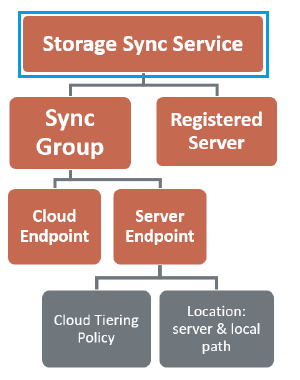
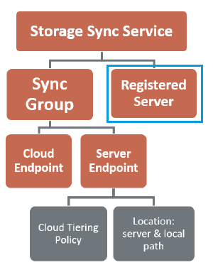
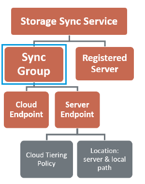
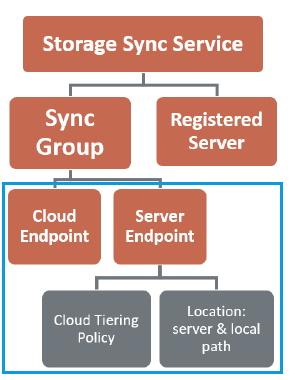

# Deploy Azure File Sync using PowerShell
Use Azure File Sync (preview) to centralize your organization's file shares in Azure Files, while keeping the flexibility, performance, and compatibility of an on-premises file server. Azure File Sync transforms Windows Server into a performance cache of your Azure file shares. You can use any protocol that's available on Windows Server to access your data locally, including SMB, NFS, and FTPS. Each distinct set of files from your server syncs with its own Azure file share and from there to as many other servers as needed.

We strongly recommend that you read [Planning for an Azure Files deployment](storage-files-planning.md) and [Planning for an Azure File Sync deployment](storage-sync-files-planning.md) before you complete the steps described in this article.

This article focuses on the steps needed using Azure File Sync PowerShell for deployment.
Alternatively, follow the [Deploy Azure File Sync](storage-sync-files-deployment-guide.md) guide that will illustrate a deployment using the Azure portal and server utilities.

> [!Important]
> Azure File Sync PowerShell modules require the use of PowerShell version 5.1 or higher.


# PowerShell modules
There are two PowerShell modules that get placed in the install directory of the Azure File Sync agent.
1. StorageSync.Management.PowerShell.Cmdlets.dll
2. StorageSync.Management.ServerCmdlets.dll

The first module contains commands needed to deploy and manage Azure File Sync as if using the Azure portal. Azure credentials are needed. The second module contains functionality only useful on a local, already registered server. No Azure credentials are needed.

> [!Note]
> This tutorial assumes that you run the following PowerShell commands locally on a server with the Azure File Sync agent installed.

 
# Step 1: Preparing the PowerShell context

```PowerShell
# Navigate to the install directory of the Azure File Sync agent.
# By default:
cd 'C:\Program Files\Azure\StorageSyncService\Agent'

Import-Module .\StorageSync.Management.ServerCommandlets.dll
Import-Module .\StorageSync.Management.PowerShell.Cmdlets.dll

# this variable stores your subscription ID 
# get the subscription ID by logging onto the Azure portal
$subID = '<GUID>'

# this variable holds your Azure Active Directory tenant ID
# use Login-AzureRMAccount to get the ID from that context
$tenantID = '<GUID>' 

# this variable holds the name of the Resource Group you want to deploy AFS into
$rg = '<RG_Name>'

# this variable holds the Azure region you want to deploy AFS into
# check that AFS is in fact available in this region
$region = '<Az_Region>'

# the following command creates an AFS context 
# it enables subsequent AFS cmdlets to be executed with minimal 
# repetition of parameters or separate authentication 
Login-AzureRmStorageSync –SubscriptionId $subID -ResourceGroupName $rg -TenantId $tenantID -Location $region

```

 
# Step 2: The "Storage Sync Service"
<table>
    <tr>
        <td></td>
        <td>The deployment of Azure File Sync starts with placing a "Storage Sync Service" resource into a Resource Group of your selected subscription. We recommend provisioning as few of these as needed. You will create a permanent trust relationship between your servers and this resource and a server can only be registered to one Storage Sync Service. As a result, it is recommended to deploy as many storage sync services as you need to separate groups of servers. Keep in mind that servers from different storage sync services cannot sync with each other.</td>
    </tr>
</table>

> [!Note]
> The storage sync service inherited access permissions from the subscription and resource group it has been deployed into. We recommend that you carefully check who has access to it. Entities with write access can start syncing new sets of files from servers registered to this storage sync service and cause data to flow to Azure storage that is accessible to them.

```PowerShell
# create the storage sync service resource.
# location, resource group and other variables are taken from the established context
$service_name = 'TestStorageSyncService'
New-AzureRmStorageSyncService -StorageSyncServiceName $service_name

```

 
# Step 3: Register the server
<table>
    <tr>
        <td></td>
        <td>The registration of a server with the Azure File Sync agent installed is the creation of a trust-relationship between your server and the storage sync service deployed in the previous step. The following command creates a new AFS object called a “Registered Server”. This object will later be used when defining server endpoints for your sync group. A server can only be registered to one storage sync service. This server will only be able to sync with other servers and Azure File Shares associated with the same storage sync service.</td>
    </tr>
</table>

```PowerShell
Register-AzureRmStorageSyncServer -StorageSyncServiceName $service_name

```

> [!Note]
> This command registers the local server with the specified storage sync service. A lasting trust relationship is created in which authentication and authorization is maintained automatically. An admin's Azure credentials are used to register the server, however subsequently the server creates and uses it's own identity that is valid as long as the server stays registered and the current Shared Access Signature token (Storage SAS) is valid. A new SAS token cannot be issued to the server once the server is unregistered, thus removing the server's ability to access Azure storage, stopping any sync.

 
# Step 4: The "Sync Group"
<table>
    <tr>
        <td></td>
        <td>A "Sync Group" contains the sync topology of a given set of files. A Sync Group can sync data to and from a folder or at the maximum an entire volume. Create as many sync groups as you have sets of files that need to sync with different servers or require different cloud tiering policies.</td>
    </tr>
</table>

```PowerShell
<# 
create the storage sync service object.
location, resource group and other variables are taken from the established context
#>
$syncgroup_name = 'MarketingTestFiles'
New-AzureRmStorageSyncGroup -SyncGroupName $syncgroup_name -StorageSyncService $service_name

```

 
# Step 5: Creating "Cloud- and Server- Endpoints"
<table>
    <tr>
        <td></td>
        <td>By defining endpoints in a Sync Group, one can effectively define a topology of locations that sync with each other. From a sync perspective, it does not matter if location contains files or not when it is added as an endpoint. If more than one endpoint contains files, the namespaces will merge, potentially crating conflict files for those directory and file names that already exist on another endpoint. So it is recommended to define a location with source files and empty locations on the other endpoints. Subsequent changes or additions to files will sync from each endpoint in all directions.</td>
    </tr>
</table>
 
## Cloud Endpoint
- A cloud endpoint is a pointer to an Azure file share. All server endpoints will sync with a cloud endpoint, making the cloud endpoint the hub. In this release of Azure File Sync only a single cloud endpoint can be added to a sync group.
- The Storage Account for the file share must be located in an Azure region with the AFS service deployed.
- The entirety of the Azure file share will be synced, with one exception: A special folder, comparable to the hidden ".SystemVolumeInformation" folder on an NTFS volume, will be provisioned. This directory is called ".SystemShareInformation". It contains important sync metadata that will not sync to other endpoints. Do not use or delete it!

> [!Important]
> The following instructions show how to reference an existing Azure file share.
> Before creating a cloud endpoint, make sure you have an Azure file share deployed in an Azure region that is supported by Azure File Sync and matches the region you have deployed your storage sync service resource into.

```PowerShell
# 1) Ensure you have the latest AzureRM PowerShell module installed. 
Install-module AzureRM

# 2) Login to Azure
Login-AzureRmAccount 
<# 
This will prompt you for your Azure credentials. 
After a successful login, the current context is displayed. For example:
Environment : 
AzureCloud Account : <yourAlias@domain.com> 
TenantId : <yourAADTenantIDGUID> 
SubscriptionId : <yourSubScriptionIDGUID> 
SubscriptionName :  
CurrentStorageAccount : 
You may have multiple subscriptions. 
List them with: Get-AzureRmSubscription 
...then select the right one: Select-AzureRmSubscription -SubscriptionId
#>

<# 
3) Select the correct storage account context:
This will list your available AzureRM Storage accounts (classic storage cannot be used with Azure File Sync) 
#>
Get-AzureRmStorageAccount 
# the following selects a storage account for the current PS session context 
Set-AzureRmCurrentStorageAccount -ResourceGroupName $rgname -Name "<SaName>"
# check your selection worked by displaying the current PS session context:
Get-AzureRmContext 

<# 
4) Select the correct Azure file share as the cloud endpoint
the following displays all Azure file shares within the storage account context you previously set
#>
Get-AzureStorageShare

# this command obtains a specific Azure file share object
$azurefileshare = Get-AzureStorageShare -Name "<ShareName>"

<# 
5) create the cloud endpoint in the previously created sync group.
don't forget to specify a friendly name or the Azure portal will not show a name for your endpoint!
it's best if the friendly name matches the Azure file share name, which is consistent with deploying via the portal UI
#>
New-AzureRmStorageSyncCloudEndpoint -StorageSyncServiceName $service_name -SyncGroupName $syncgroup_name -AzureFileShare $azurefileshare.StorageUri.PrimaryUri.AbsoluteUri -FriendlyName $azurefileshare.Name

```

## Server Endpoint
There are two prerequisites to creating a server endpoint:
1. You have at least one server registered to the storage sync service containing the sync group you are creating a server endpoint for
2. If you want to use cloud tiering, you have a non-system directory available on that server.

> [!Note]
> Cloud tiering is only supported on non-system volumes and the storage you want to sync with must look like a local disk to the server. There are several storage subsystems that accomplish that, e.g. Direct Attached Storage (DAS) systems like Storage Spaces Direct. Network attached storage (NAS) is not supported.

```PowerShell
<#
to create a server endpoint, you need the ID of the registered server you want to use as an endpoint.
get that ID from the registered server object.
the following will store all available registered servers:
#>
[Array] $servers = Get-AzureRmStorageSyncServer -StorageSyncServiceName $service_name

<#
print or evaluate through different means which array position contains the correct server
the first server is on array position zero
#>
$servers

<#
create the actual server endpoint with cloud tiering enabled
cloud tiering will maintain 10% free space space on the volume of this endpoint
don't forget to specify a friendly name or the Azure portal will not show a name for your endpoint!
it's best if the friendly name matches the registered server's display name, which is consistent with deploying via the 
portal UI
#>
New-AzureRmStorageSyncServerEndpoint -StorageSyncServiceName $service_name -SyncGroupName $syncgroup_name -ServerId $servers[0].Id -ServerLocalPath "<FullPath>" -FriendlyName $servers[0].DisplayName -CloudTiering -VolumeFreeSpacePercent 10

```

