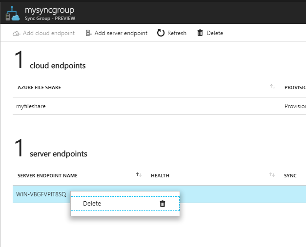

# Add/remove an Azure File Sync server endpoint
Azure File Sync allows you to centralize your organization's file shares in Azure Files without giving up the flexibility, performance, and compatibility of an on-premises file server. It does this by transforming your Windows Servers into a quick cache of your Azure file share. You can use any protocol available on Windows Server to access your data locally (including SMB, NFS, and FTPS) and you can have as many caches as you need across the world.

A *server endpoint* represents a specific location on a *registered server*, such as a folder on a server volume or the root of the volume. Multiple server endpoints can exist on the same volume if their namespaces are not overlapping (for example, F:\sync1 and F:\sync2). You can configure cloud tiering policies individually for each server endpoint. If you add a server location with an existing set of files as a server endpoint to a sync group, those files will be merged with any other files already on other endpoints in the sync group.

See [How to deploy Azure File Sync](storage-sync-files-deployment-guide.md) for information on how to deploy Azure File Sync end-to-end.

## Prerequisites
To create a server endpoint, you must first ensure that the following criteria are met: 
- The server has the Azure File Sync agent installed and has been registered. Instructions for installing the Azure File Sync Agent can be found in the [Register/unregister a server with Azure File Sync](storage-sync-files-server-registration.md) article. 
- Ensure that a Storage Sync Service has been deployed. See [How to deploy Azure File Sync](storage-sync-files-deployment-guide.md) for details on how to deploy a Storage Sync Service. 
- Ensure that a sync group has been deployed. Learn how to [Create a sync group](storage-sync-files-deployment-guide.md#create-a sync-group-and-a-cloud-endpoint).
- Ensure that the server is connected to the internet and that Azure is accessible. We use port 443 for all communication between the server and our service.

## Add a server endpoint
To add a server endpoint, navigate to the desired sync group, and select "Add server endpoint".


The following information is required under **Add server endpoint**:

- **Registered server**: The name of the server or cluster to create the server endpoint on.
- **Path**: The path on the Windows Server to be synchronized as part of the sync group.
- **Cloud Tiering**: A switch to enable or disable cloud tiering. When enabled, cloud tiering will *tier* files to your Azure file shares. This converts on-premises file shares into a cache, rather than a complete copy of the dataset, to help you manage space efficiency on your server.
- **Volume Free Space**: the amount of free space to reserve on the volume which the server endpoint resides. For example, if the volume free space is set to 50% on a volume with a single server endpoint, roughly half the amount of data will be tiered to Azure Files. Regardless of whether cloud tiering is enabled, your Azure file share always has a complete copy of the data in the sync group.

Select **Create** to add the server endpoint. The files within a namespace of a sync group will now be kept in sync. 

## Remove a server endpoint
If you desire to discontinue using Azure File Sync for a given server endpoint, you can remove the server endpoint. 

> [!Warning]  
> Do not attempt to troubleshoot issues with sync, cloud tiering, or any other aspect of Azure File Sync by removing and recreating the server endpoint unless explicitly instructed to by a Microsoft engineer. Removing a server endpoint is a destructive operation, and tiered files within the server endpoint will not be "reconnected" to their locations on the Azure file share after the server endpoint is recreated, which will result in sync errors. Also note, tiered files that exist outside of the server endpoint namespace may be permanently lost. Tiered files may exist within your server endpoint even if cloud tiering was never enabled.

To ensure that all tiered files are recalled before removing the server endpoint, disable cloud tiering on the server endpoint, and then execute the following PowerShell cmdlet to recall all tiered files within your server endpoint namespace:

```powershell
Import-Module "C:\Program Files\Azure\StorageSyncAgent\StorageSync.Management.ServerCmdlets.dll"
Invoke-StorageSyncFileRecall -Path <path-to-to-your-server-endpoint>
```

> [!Note]  
> If the local volume hosting the server does not have enough free space to recall all the tiered data, the `Invoke-StorageSyncFileRecall` cmdlet fails.  

To remove the server endpoint:

1. Navigate to the Storage Sync Service where your server is registered.
2. Navigate to the desired sync group.
3. Remove the server endpoint you desire in the sync group in the Storage Sync Service. This can be accomplished by right-clicking the relevant server endpoint in the sync group pane.

    

## Next steps
- [Register/unregister a server with Azure File Sync](storage-sync-files-server-registration.md)
- [Planning for an Azure File Sync deployment](storage-sync-files-planning.md)
- [Monitor Azure File Sync](storage-sync-files-monitoring.md)
