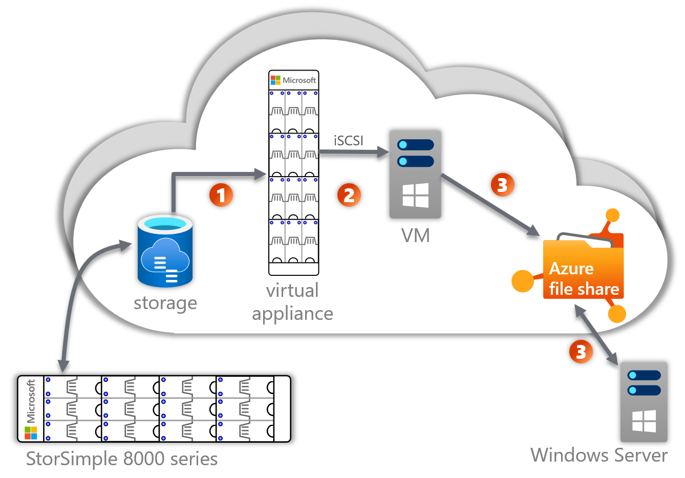

# StorSimple migration to Azure File Sync

StorSimple is a discontinued Microsoft product. Extended support for this product and its cloud service will last until the end of 2022.
It is important to start planning for a migration off of StorSimple right away.

The default and strategic long-term Azure service StorSimple appliances can be migrated to, is Azure File Sync.
It is a generally available Azure service with a super-set of features over StorSimple.

## Full cloud-side migration with limited downtime
This article describes the concept of how a migration will commence.
It is imperative to note that customers in need of migration off of StorSimple and onto Azure File Sync do not need to proceed on their own.

> [!IMPORTANT]
> Microsoft is committed to assist customers in their migration. Email AzureFiles@microsoft .com for a customized migration plan as well as assistance during the migration.

## Migration approach
The migration to Azure File Sync will commence cloud-side with minimal impact to on-premises and limited downtime.
The below concept is targeted at StorSimple 8000 series appliances.
If you are in need of migration from StorSimple 7000 series, the first step entails a free upgrade to a matching 8000 series loaner device from Microsoft.
Reach out to AzureFiles@microsoft.com and we will help you organize an appropriate number of loaner devices.

### General approach

1. Take a volume clone of your on-premises StorSimple appliance and mount it to a temporary StorSimple virtual appliance.
2. Connect the virtual appliance via iSCSI to a temporary Azure VM.
3. Install Azure File Sync on the temporary Windows Server VM -  a specific registry key for this migration also needs to be set before sync is configured on the server.
    * Depending on the number of shares on your StorSimple volume, deploy just as many Azure file shares. (We recommend deploying one Azure file share per storage account.)
    * Configure sync between the individual share on the Windows Server cloud VM and an Azure file share. (1:1 mapping)
    * Optionally, add a local server as an on-premises performance cache, with cloud tiering enabled. This step is necessary if you wish to replace your on-premises StorSimple with a more feature rich, local cache, powered by Windows Server and Azure File Sync's cloud tiering. Your on-premises Windows Server can be a physical machine or cluster, or a virtual machine. It does not have to have as much storage deployed as the dataset size. It only needs enough storage to locally cache the most frequently accessed files.

## Minimizing downtime
After step 3 above, the StorSimple on-premises appliance is still actively used by users and applications. So the set of files that synced from the initial volume clone is slightly outdated at the time sync completes.
The approach to minimizing downtime is to repeat the sync from volume clone process, such that sync finishes faster and faster with each iteration, which in turn is enabled by the changes between volume clones become fewer and fewer.
You can repeat this process, until the sync from a volume clone can finish in the amount of time you find acceptable for downtime.
Once that is the case, block users and applications from making any changes to your StorSimple appliance. Downtime begins.
Take another volume clone and let it sync to the server(s) connected.
Establish access to your users and applications to your new, Azure File Sync backed, Windows Server.
Consider deploying/adjusting a DFS-Namespace to make cutting over from the old StorSimple appliance to your new Windows Server transparent to apps and users.
Your migration is complete.

## Migration goal
After the migration is complete, the temporary StorSimple virtual appliance and Azure VM can be deprovisioned.

Furthermore the StorSimple on-premises appliance can be deprovisioned as your users and applications are already accessing the Windows Server instead.
What you are left with is depicted in the image below. A standard Azure File Sync deployment features a number of Azure file shares and Windows Servers connected to them via Azure File Sync. Remember that a single server can connect different local folders to different file shares at the same time.
Also, one Azure file share can sync to many different servers, in the case you need data cached in branch offices. Also check if you can optimize your cloud tiering policies for more efficient use of your on-premises storage space.

## Next steps
Familiarize yourself with Azure Files and Azure File Sync. It is important to understand the Azure File Sync terminology and deployment pattern for a successful migration. There is more detailed information available for every step in this overview article. Make sure to reach out to Microsoft for customized help during planning and execution of your migration.

> [!IMPORTANT]
> Microsoft is committed to assist customers in their migration. Email AzureFiles@microsoft .com for a customized migration plan as well as assistance during the migration.

## Additional resources
Azure File Sync, as the target service, has two fundamental documents that we recommend you read, if you are new to Azure File Sync.
* [Azure File Sync - overview](storage-sync-files-planning.md)
* [Azure File Sync - deployment guide](storage-sync-files-deployment-guide.md)

Azure Files is a storage service in Azure, offering file shares as a service. No need to pay for or maintain a VM or associated VM storage.
* [Azure Files - overview](storage-files-introduction.md)
* [Azure Files - how to deploy an Azure file share](storage-how-to-create-file-share.md)