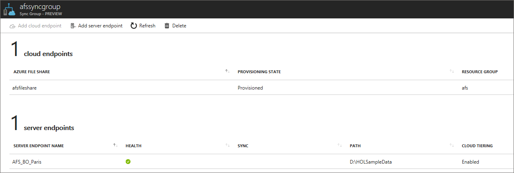

# Troubleshoot Azure File Sync (preview)
Use Azure File Sync (preview) to centralize your organization's file shares in Azure Files, while keeping the flexibility, performance, and compatibility of an on-premises file server. Azure File Sync transforms Windows Server machines into a quick cache of your Azure file share. You can use any protocol that's available on Windows Server to access your data locally, including SMB, NFS, and FTPS. You can have as many caches as you need across the world.

This article is designed to help you troubleshoot and resolve issues that you might encounter with your Azure File Sync deployment. We also describe how to collect important logs from the system if a deeper investigation of the issue is required. If you don't see the answer to your question, you can contact us through the following channels (in escalating order):

1. The comments section of this article.
2. [Azure Storage Forum](https://social.msdn.microsoft.com/Forums/home?forum=windowsazuredata).
3. [Azure Files UserVoice](https://feedback.azure.com/forums/217298-storage/category/180670-files). 
4. Microsoft Support. To create a new support request, in the Azure portal, on the **Help** tab, select the **Help + support** button, and then select **New support request**.

## Agent installation and server registration
<a id="agent-installation-failures"></a>**Troubleshoot agent installation failures**  
If the Azure File Sync agent installation fails, at an elevated command prompt, run the following command to turn on logging during agent installation:

```
StorageSyncAgent.msi /l*v Installer.log
```

Review installer.log to determine the cause of the installation failure. 

> [!Note]  
> The agent installation will fail if your machine is set up to use Microsoft Update and the Windows Update service is not running.

<a id="server-registration-missing"></a>**Server is not listed under Registered Servers in the Azure portal**  
If a server is not listed under **Registered Servers** for a Storage Sync Service:
1. Log in to the server that you want to register.
2. Open File Explorer, and then go to the Storage Sync Agent installation directory (the default location is C:\Program Files\Azure\StorageSyncAgent). 
3. Run ServerRegistration.exe, and complete the wizard to register the server with a Storage Sync Service.

<a id="server-already-registered"></a>**Server Registration displays the following message during Azure File Sync agent installation: "This server is already registered"** 


This message appears if the server was previously registered with a Storage Sync Service. To unregister the server from the current Storage Sync Service and then register with a new Storage Sync Service, complete the steps that are described in [Unregister a server with Azure File Sync](storage-sync-files-server-registration.md#unregister-the-server-with-storage-sync-service).

If the server is not listed under **Registered Servers** in the Storage Sync Service, on the server that you want to unregister, run the following PowerShell commands:

```PowerShell
Import-Module "C:\Program Files\Azure\StorageSyncAgent\StorageSync.Management.ServerCmdlets.dll"
Reset-StorageSyncServer
```

> [!Note]  
> If the server is part of a cluster, you can use the optional *Reset-StorageSyncServer -CleanClusterRegistration* parameter to also remove the cluster registration.

<a id="web-site-not-trusted"></a>**When I register a server, I see numerous "web site not trusted" responses. Why?**  
This issue occurs when the **Enhanced Internet Explorer Security** policy is enabled during server registration. For more information about how to correctly disable the **Enhanced Internet Explorer Security** policy, see [Prepare Windows servers to use with Azure File Sync](storage-sync-files-deployment-guide.md#prepare-windows-servers-to-use-with-azure-file-sync) and [How to deploy Azure File Sync (preview)](storage-sync-files-deployment-guide.md).

## Sync Group management
<a id="cloud-endpoint-using-share"></a>**Cloud Endpoint creation fails, with this error: "The specified Azure FileShare is already in use by a different CloudEndpoint"**  
This issue occurs if the Azure file share is already in use by another Cloud Endpoint. 

If you see this message and the Azure file share currently is not in use by a Cloud Endpoint, complete the following steps to clear the Azure File Sync metadata on the Azure file share:

> [!Warning]  
> Deleting the metadata on an Azure file share that is currently in use by a Cloud Endpoint causes Azure File Sync operations to fail. 

1. In the Azure portal, go to your Azure file share.  
2. Right-click the Azure file share, and then select **Edit metadata**.
3. Right-click **SyncService**, and then select **Delete**.

<a id="cloud-endpoint-authfailed"></a>**Cloud Endpoint creation fails, with this error: "AuthorizationFailed"**  
This issue occurs if your user account doesn't have sufficient rights to create a Cloud Endpoint. 

To create a Cloud Endpoint, your user account must have the following Microsoft Authorization permissions:  
* Read: Get role definition
* Write: Create or update custom role definition
* Read: Get role assignment
* Write: Create role assignment

The following built-in roles have the required Microsoft Authorization permissions:  
* Owner
* User Access Administrator

To determine whether your user account role has the required permissions:  
1. In the Azure portal, select **Resource Groups**.
2. Select the resource group where the storage account is located, and then select **Access control (IAM)**.
3. Select the **role** (for example, Owner or Contributor) for your user account.
4. In the **Resource Provider** list, select **Microsoft Authorization**. 
    * **Role assignment** should have **Read** and **Write** permissions.
    * **Role definition** should have **Read** and **Write** permissions.

<a id="cloud-endpoint-deleteinternalerror"></a>**Cloud Endpoint deletion fails, with this error: "MgmtInternalError"**  
This issue might occur if the Azure file share or storage account is deleted before you delete the Cloud Endpoint. This issue will be fixed in a future update. At that time, you will be able to delete a Cloud Endpoint after you delete the Azure file share or storage account.

Meanwhile, to prevent this issue from occurring, delete the Cloud Endpoint before you delete the Azure file share or storage account.

## Sync
<a id="afs-change-detection"></a>**If I created a file directly in my Azure file share over SMB or through the portal, how long does it take for the file to sync to servers in the Sync Group?**  
[!INCLUDE [storage-sync-files-change-detection](../../../includes/storage-sync-files-change-detection.md)]

<a id="broken-sync"></a>**Sync fails on a server**  
If sync fails on a server:
1. Verify that a Server Endpoint exists in the Azure portal for the directory that you want to sync to an Azure file share:
    
    

2. In Event Viewer, review the operational and diagnostic event logs, located under Applications and Services\Microsoft\FileSync\Agent.
    1. Verify that the server has internet connectivity.
    2. Verify that the Azure File Sync service is running on the server. To do this, open the Services MMC snap-in and verify that the Storage Sync Agent service (FileSyncSvc) is running.

<a id="replica-not-ready"></a>**Sync fails, with this error: "0x80c8300f - The replica is not ready to perform the required operation"**  
This issue is expected if you create a Cloud Endpoint and use an Azure file share that contains data. When the change detection job finishes running on the Azure file share (it might take up to 24 hours), sync should start working correctly.

<a id="broken-sync-files"></a>**Troubleshoot individual files that fail to sync**  
If individual files fail to sync:
1. In Event Viewer, review the operational and diagnostic event logs, located under Applications and Services\Microsoft\FileSync\Agent.
2. Verify that there are no open handles on the file.
    >[!NOTE]
    > Azure File Sync periodically takes VSS snapshots to sync files that have open handles.

## Cloud tiering 
<a id="files-fail-tiering"></a>**Troubleshoot files that fail to tier**  
If files fail to tier to Azure Files:

1. Verify that the files exist in the Azure file share.
    >[NOTE]
    > A file must be synced to an Azure file share before it can be tiered.
2. In Event Viewer, review the operational and diagnostic event logs, located under Applications and Services\Microsoft\FileSync\Agent.
    1. Verify that the server has internet connectivity. 
    2. Verify that the Azure File Sync filter drivers (StorageSync.sys and StorageSyncGuard.sys) are running:
        - At an elevated command prompt, run `fltmc`. Verify that the StorageSync.sys and StorageSyncGuard.sys file system filter drivers are listed.

<a id="files-fail-recall"></a>**Troubleshoot files that fail to be recalled**  
If files fail to be recalled:
1. In Event Viewer, review the operational and diagnostic event logs, located under Applications and Services\Microsoft\FileSync\Agent.
    1. Verify that the files exist in the Azure file share.
    2. Verify that the server has internet connectivity. 
    3. Verify that the Azure File Sync filter drivers (StorageSync.sys and StorageSyncGuard.sys) are running:
        - At an elevated command prompt, run `fltmc`. Verify that the StorageSync.sys and StorageSyncGuard.sys file system filter drivers are listed.

<a id="files-unexpectedly-recalled"></a>**Troubleshoot files unexpectedly recalled on a server**  
Antivirus, backup, and other applications that read large numbers of files cause unintended recalls unless they respect the skip offline attribute and skip reading the content of those files. Skipping offline files for products that support this option helps avoid unintended recalls during operations like antivirus scans or backup jobs.

Consult with your software vendor to learn how to configure their solution to skip reading offline files.

Unintended recalls also might occur in other scenarios, like when you are browsing files in File Explorer. Opening a folder that has cloud-tiered files in File Explorer on the server might result in unintended recalls. This is even more likely if an antivirus solution is enabled on the server.

## General troubleshooting
If you encounter issues with Azure File Sync on a server, start by completing the following steps:
1. In Event Viewer, review the operational and diagnostic event logs.
    - Sync, tiering, and recall issues are logged in the diagnostic and operational event logs under Applications and Services\Microsoft\FileSync\Agent.
    - Issues related to managing a server (for example, configuration settings) are logged in the operational and diagnostic event logs under Applications and Services\Microsoft\FileSync\Management.
2. Verify that the Azure File Sync service is running on the server:
    - Open the Services MMC snap-in and verify that the Storage Sync Agent service (FileSyncSvc) is running.
3. Verify that the Azure File Sync filter drivers (StorageSync.sys and StorageSyncGuard.sys) are running:
    - At an elevated command prompt, run `fltmc`. Verify that the StorageSync.sys and StorageSyncGuard.sys file system filter drivers are listed.

If the issue is not resolved, run the AFSDiag tool:
1. Create a directory where the AFSDiag output will be saved (for example, C:\Output).
2. Open an elevated PowerShell window, and then run the following commands (press Enter after each command):

    ```PowerShell
    cd "c:\Program Files\Azure\StorageSyncAgent"
    Import-Module .\afsdiag.ps1
    Debug-Afs c:\output # Note: Use the path created in step 1.
    ```

3. For the Azure File Sync kernel mode trace level, enter **1** (unless otherwise specified, to create more verbose traces), and then press Enter.
4. For the Azure File Sync user mode trace level, enter **1** (unless otherwise specified, to create more verbose traces), and then press Enter.
5. Reproduce the issue. When you're finished, enter **D**.
6. A .zip file that contains logs and trace files is saved to the output directory that you specified.

## See also
- [Azure Files frequently asked questions](storage-files-faq.md)
- [Troubleshoot Azure Files problems in Windows](storage-troubleshoot-windows-file-connection-problems.md)
- [Troubleshoot Azure Files problems in Linux](storage-troubleshoot-linux-file-connection-problems.md)
